# BAB VIII: METODOLOGI ANALISIS DISTRIBUSI MANFAAT VS BEBAN EKOLOGIS
*Ringkasan Eksekutif Metodologis · Center of Economic and Law Studies (CELIOS)*

---

## A. Desain Penelitian & Tujuan
Penelitian Bab 8 menerapkan **desain evaluasi ketimpangan ekonomi-politik dan pembuktian statistik inferensial (Distributional Justice & Inferential Crosstabulation)** guna menguji kontradiksi fundamental antara pihak yang menikmati rente ekonomi (*beneficiaries*) melawan masyarakat yang menanggung beban kerusakan alam (*burden bearers*). Kajian ini dirancang untuk mencapai tiga tujuan analitis utama:

1. **Pemetaan Konsentrasi Kekayaan Ekstraktif (Hierarchical Entity Profiling):** Mengidentifikasi akumulasi laba bersih konglomerasi dan triliuner Indonesia dari sektor hilirisasi nikel dan tambang di Sulawesi, disandingkan dengan total luas konsesi, kapasitas cerobong PLTU captive, serta estimasi valuasi kerugian lingkungan privat.
2. **Kuantifikasi Beban Publik & Eksternalitas Negatif (Time-Series Aggregation):** Mengukur beban riil masyarakat lokal melalui tren deret waktu penderita infeksi saluran pernapasan (ISPA/Pneumonia) di sentra hilirisasi, eskalasi sengketa perampasan lahan warga, serta valuasi kerusakan ekologis publik berbasis regulasi lingkungan hidup.
3. **Pembuktian Statistik Hubungan Manfaat vs Beban (Pearson Chi-Square & Odds Ratio):** Menguji secara inferensial hipotesis apakah lonjakan indikator ekonomi makro (Investasi PMDN dan PAD) berbanding lurus dengan peningkatan risiko keparahan beban penyakit dan deforestasi di 6 provinsi se-Sulawesi.

---

## B. Sumber Data & Cakupan Wilayah
Penyusunan matriks ketimpangan manfaat vs beban mengintegrasikan 7 basis data resmi lintas sektor kurun waktu 2014–2024 se-Pulau Sulawesi:

- **CELIOS Inequality Report (Laporan 50 Taipan Terkaya Indonesia 2026):** Nilai kekayaan bersih (*net worth*) individu/grup dan porsi kapitalisasi pasar sektor ekstraktif.
- **MODI Ditjen Minerba ESDM & Dataset Kawasan Industri:** Agregasi luasan izin konsesi tambang dan penguasaan lahan oleh grup korporasi konglomerasi.
- **Global Energy Monitor (GEM Coal Plant Tracker, Jan 2026):** Kepemilikan aset induk (*Parent Company*) dan kapasitas pembangkitan kotor PLTU captive batubara.
- **Dinas Kesehatan Daerah & Profil Kesehatan BPS:** Data morbiditas klinis penderita ISPA/Pneumonia sentra industri nikel Sulawesi Tengah dan Sulawesi Tenggara.
- **Konsorsium Pembaruan Agraria (CATAHU KPA) & TanahKita.id:** Sebaran kasus sengketa tenurial kritis, pelanggaran persetujuan FPIC, dan perampasan ruang hidup rakyat.
- **Badan Pusat Statistik (BPS RI) & Ditjen Bina Keuangan Daerah:** Data realisasi Investasi Penanaman Modal Dalam Negeri (PMDN) dan Pendapatan Asli Daerah (PAD) 6 provinsi se-Sulawesi.
- **Global Forest Watch (GFW / Hansen UMD):** Data tahunan kehilangan tutupan hutan alam primer per provinsi untuk pengujian silang statistik.

---

## C. Operasionalisasi Variabel & Indikator Riset
Seluruh variabel konsentrasi kekayaan elit, beban eksternalitas publik, hingga indikator makroekonomi dioperasionalkan ke dalam **9 indikator riset empiris terverifikasi** sebagaimana dirangkum pada matriks operasional berikut:

##### Matriks Operasionalisasi Variabel dan Sumber Data Resmi Bab 8 (Distribusi Manfaat vs Beban)
| No | Indikator Riset | Fokus Pengukuran | Satuan | Sumber Data Primer Resmi |
| :-: | :--- | :--- | :-: | :--- |
| 1 | Akumulasi Kekayaan Taipan Ekstraktif (8.1) | Total Harta Bersih 50 Konglomerat Berbasis SDA | Triliun Rupiah (Rp T) | CELIOS Inequality Report 2026 |
| 2 | Penguasaan Konsesi Tambang Taipan (8.1) | Luasan Lahan Tambang Terafiliasi Top 10 Grup | Hektar (Ha) | MODI ESDM & Dataset Kawasan |
| 3 | Kapasitas PLTU Captive Monopoli (8.1) | Pembangkit Batubara Milik Grup Taipan di Smelter | Megawatt (MW) | Global Energy Monitor (GEM 2026) |
| 4 | Taksiran Kerugian Ekologis Privat (8.1) | Valuasi Kerusakan Lingkungan Berbasis Luas & Emisi | Triliun Rupiah (Rp T) | Adaptasi PermenLHK No. 7/2014 |
| 5 | Beban Kesehatan ISPA Sentra Nikel (8.2) | Penderita Saluran Pernapasan di Sulteng & Sultra | Kasus / Tahun | Data Panel Kesehatan Dinkes & BPS |
| 6 | Sengketa Lahan Kritis Rakyat (8.2) | Letupan Konflik Agraria & Pelanggaran Asas FPIC | Kasus Kritis | Tanahkita.id (CATAHU KPA & YLBHI) |
| 7 | Arus Masuk Investasi PMDN & PAD (8.3) | Variabel Independen Manfaat Ekonomi Regional | Miliar Rp & Juta Rp | BPS PMDN & Portal Keuangan Daerah |
| 8 | Derajat Hubungan Silang Chi-Square (8.3) | Signifikansi Korelasi Manfaat Ekonomi vs Beban | Nilai Chi-Square (χ²) | Crosstab SPSS Model (Alpha 5%) |
| 9 | Rasio Peluang Risiko Beban (8.3) | Tingkat Peningkatan Risiko Dampak saat Manfaat Tinggi | Odds Ratio (OR) | Kontinjensi 2x2 Rasio Peluang |

---

## D. Kerangka Analisis & Formulasi Matematis

### Sub-bab 8.1: Sisi Manfaat — Gurita Bisnis & Monopoli Keuntungan Ekstraktif
Kuantifikasi konsentrasi kapital dihitung dengan memetakan kepemilikan saham konglomerasi pada entitas tambang di Sulawesi, dilanjutkan dengan valuasi ekonomi lingkungan berbasis Peraturan Menteri LHK No. 7 Tahun 2014:

> **1. Konsentrasi Kekayaan Sektor Ekstraktif:**  
> `Total Kekayaan Ekstraktif = Porsi Sektor Ekstraktif (%) × Total Harta 50 Triliuner Terkaya`  
> *Angka Aktual: 58% × Rp4.651 Triliun = Rp2.697,6 Triliun (Laju Elit: Rp13 Miliar/hari vs Upah Buruh: Rp2 Ribu/hari)*  
>  
> **2. Valuasi Estimasi Kerugian Ekologis Privat (PermenLHK 7/2014):**  
> `Kerugian Ekologis Grup = (Luas Konsesi × Nilai Valuasi Hutan per Ha) + (Kapasitas PLTU MW × Biaya Sosial Emisi Karbon)`  
> *Fakta Empiris: Top 10 Grup Taipan menguasai 366.481 Ha konsesi dan 9.655 MW PLTU captive batubara di Sulawesi. Akumulasi daya rusak privat mereka menghasilkan taksiran kerugian ekologis publik melebihi Rp141,5 Triliun.*

##### Tabel 8.1: Ringkasan Top 10 Grup Taipan Ekstraktif vs Kerugian Publik di Sulawesi
| Grup Konglomerasi | Harta CELIOS | Konsesi Lahan | PLTU Captive | Estimasi Rugi | Catatan Kerusakan & Konflik Lapangan |
| :--- | :---: | :---: | :---: | :---: | :--- |
| #1 PT Vale Indonesia | Rp 259,2 T | 118.017 Ha | 0 MW (PLTA) | > Rp 40,0 T | Monopoli Pegunungan Verbeek, 460+ Adat To Karunsi'e |
| #2 Salim Group (Anthony Salim) | Rp 160,0 T | 110.175 Ha | Non-Smelter | > Rp 8,0 T | Tumpang tindih Tahura Poboya & Sengketa Tambang |
| #3 Jiangsu Delong Nickel | Rp 45,0 T | 2.253 Ha | 5.175 MW | > Rp 20,0 T | VDNI/OSS/GNI, Emisi ~36,2 Jt Ton CO2, Bentrokan Maut |
| #4 Tsingshan Holding Group | Rp 163,0 T | 20.765 Ha | 4.030 MW | > Rp 40,0 T | Kawasan IMIP, Emisi ~28,2 Jt Ton CO2, Tragedi ITSS |
| #5 Boy Thohir & Edwin S. | Rp 64,1 T | 21.100 Ha | Grid PLN | > Rp 15,0 T | PT SCM Blok Routa, Deforestasi Hutan Primer |
| #6 J Resources (Jimmy Budiarto) | Rp 7,5 T | 38.150 Ha | Non-Smelter | > Rp 5,0 T | Eksploitasi Pegunungan Bolmong Sulawesi Utara |
| #7 Rajawali Group (Peter S.) | Rp 32,5 T | 30.848 Ha | Non-Smelter | > Rp 4,5 T | Tambang Emas Toka Tindung Minahasa Utara |
| #8 Kalla Group (Keluarga JK) | Rp 900,8 M | 20.173 Ha | 0 MW (PLTA) | > Rp 2,5 T | Reklamasi Pesisir Bua & Smelter Bumi Mineral |
| #9 Harita Group (Lim Hariyanto) | Rp 108,0 T | ~1.000 Ha | Ekspor Mentah | > Rp 1,5 T | PT GKP Pulau Wawonii, 37.000 Jiwa Terdampak |
| #10 Zhenshi Holding Group | Rp 40,0 T | 4.000 Ha | 450 MW | > Rp 5,0 T | Smelter Pesisir Morowali, Emisi ~3,1 Jt Ton CO2 |
| **TOTAL TOP 10 GRUP** | **Rp 880,2 T** | **366.481 Ha** | **9.655 MW** | **> Rp 141,5 T** | **Monopoli Manfaat Ekstraktif Lintas Sulawesi** |

---

### Sub-bab 8.2: Sisi Beban — Krisis Kesehatan Publik dan Sengketa Tenurial
Eksternalitas negatif yang dipikul masyarakat dihitung melalui akumulasi kasus ISPA pada sentra hilirisasi nikel dan dokumentasi sengketa lahan kritis rakyat:

> **1. Akumulasi Penderita ISPA Sentra Hilirisasi (2014-2024):**  
> `Total Kasus ISPA Sentra = Penjumlahan Kasus Tahunan di Provinsi Sulawesi Tengah dan Sulawesi Tenggara`  
> *Angka Aktual: 117.775 Kasus (Puncak tertinggi: 13.671 kasus pada 2016; Terkini: 10.487 kasus pada 2024)*  
>  
> **2. Valuasi Total Kerusakan Lingkungan Publik:**  
> `Valuasi Kerusakan Publik = Kerusakan Hutan Primer + Pencemaran DAS Sungai + Kerusakan Terumbu Karang`  
> *Angka Aktual: Ditaksir Melebihi Rp 100 Triliun (Proksi Valuasi Kerusakan Sumber Daya Alam LHK)*  
>  
> *Fakta Empiris: Kontras dengan keuntungan ratusan triliun rupiah yang dinikmati segelintir elit, masyarakat lingkar industri menanggung 117.775 penderita penyakit pernapasan kronis dan 12 letupan sengketa lahan kritis.*

##### Tabel 8.2: Ringkasan Indikator Beban Publik Akibat Industrialisasi Ekstraktif
| Indikator Beban Publik | Besaran Kuantitatif | Deskripsi Dampak Lapangan |
| :--- | :---: | :--- |
| **Krisis Kesehatan (ISPA/Pneumonia)** | **117.775 Kasus** | Akumulasi penderita infeksi pernapasan di sentra nikel Sulteng & Sultra (2014-2024), terpapar polusi debu dan sulfur PLTU captive. |
| **Konflik Agraria & Sengketa FPIC** | **12 Kasus Kritis** | Sengketa lahan meletus mengorbankan puluhan ribu jiwa, melibatkan perampasan kebun, pelanggaran hak ulayat, dan kriminalisasi. |
| **Estimasi Kerugian Ekologis Publik** | **> Rp 100 Triliun** | Valuasi kerusakan jasa ekosistem: hilangnya fungsi hutan primer, sedimentasi laut terumbu karang, dan lenyapnya air bersih. |

---

### Sub-bab 8.3: Pembuktian Statistik — Tabulasi Silang Chi-Square (Manfaat vs Beban)
Pengujian hipotesis hubungan antara manfaat ekonomi makro dan beban dampak dilakukan menggunakan tabulasi silang (2x2 Crosstab) dan uji Pearson Chi-Square:

> **1. Pembagian Kategori Median (Threshold Partisi):**  
> • Kategori Tinggi : Nilai Observasi ≥ Nilai Median Historis Panel  
> • Kategori Rendah : Nilai Observasi < Nilai Median Historis Panel  
>  
> **2. Rumus Uji Pearson Chi-Square (Uji Hubungan Signifikan):**  
> `χ² = Total [ (Jumlah Teramati - Jumlah Diharapkan)² / Jumlah Diharapkan ]   |   Tolak H0 jika P-Value < 0,05`  
>  
> **3. Rasio Peluang Risiko (Odds Ratio / OR):**  
> `OR = (Kasus Manfaat Tinggi & Beban Parah × Kasus Rendah Keduanya) / (Kasus Silang Lainnya)`  
>  
> *Kaidah Keputusan Statistik: Jika P-Value < 0,05, terbukti signifikan bahwa lonjakan manfaat ekonomi berasosiasi nyata dengan peningkatan keparahan beban ekologis masyarakat.*

##### Tabel 8.3: Hasil Uji Statistik Tabulasi Silang Chi-Square (Manfaat Ekonomi vs Beban Publik)
| Variabel Manfaat (X) | Variabel Beban (Y) | Chi-Square (χ²) | P-Value | Odds Ratio | Kesimpulan Statistik |
| :--- | :--- | :---: | :---: | :---: | :--- |
| Investasi PMDN (Rupiah) | Beban Penyakit (Kasus ISPA) | 0,083 | p = 0,773 | 1,40x | Tidak Signifikan (Agregat Tahunan) |
| Investasi PMDN (Rupiah) | Beban Kerusakan (Deforestasi Ha) | 0,750 | p = 0,386 | 1,96x | Tidak Signifikan (Agregat Tahunan) |
| Pendapatan Asli Daerah (PAD) | Beban Penyakit (Kasus ISPA) | 9,877 | p = 0,002 | 0,02x | **SIGNIFIKAN (P-Value < 0,05)** |
| Pendapatan Asli Daerah (PAD) | Beban Kerusakan (Deforestasi Ha) | 5,323 | p = 0,021 | 0,07x | **SIGNIFIKAN (P-Value < 0,05)** |

---

## E. Korespondensi Metodologi terhadap Sub-bab Laporan Bab 8
Setiap sub-bab analitis pada Bab 8 ditopang oleh metode empiris terstandarisasi sebagaimana dirangkum pada matriks korespondensi berikut:

##### Matriks Korespondensi Metodologis Bab 8
| Sub-bab | Fokus Kajian Empiris | Metode Analitis Utama |
| :-: | :--- | :--- |
| Sub-bab 8.1 | Sisi Manfaat: Gurita Bisnis & Monopoli Keuntungan | Wealth Database Analysis, Mega-Crosstab Top 10 Oligarki, Valuasi PermenLHK 7/2014 |
| Sub-bab 8.2 | Sisi Beban: Krisis Kesehatan & Sengketa Lahan | Descriptive Time-Series Aggregation, Trend Mapping ISPA Sentra, Proksi Valuasi LHK |
| Sub-bab 8.3 | Pembuktian Statistik: Manfaat vs Beban Ekologis | 2x2 Crosstabulation, Median Binning Partition, Pearson Chi-Square & Odds Ratio |

---

## F. Bagan Alur Kerangka Kerja Riset (Research Workflow)
Kerangka investigasi forensik distribusi manfaat vs beban dijalankan secara komprehensif melalui empat tahapan metodologis berikut:

```mermaid
flowchart LR
    subgraph F1["Fase I: Input Multi-Sektor"]
        A1["CELIOS Wealth Report<br/><i>50 Triliuner Ekstraktif</i>"]
        A2["Aset Tambang & PLTU<br/><i>ESDM & GEM 9.655 MW</i>"]
        A3["Kesehatan & Tenurial<br/><i>ISPA Dinkes & 12 Konflik KPA</i>"]
        A4["Ekonomi Makro BPS<br/><i>Investasi PMDN & PAD</i>"]
    end
    subgraph F2["Fase II: Pemetaan & Integrasi"]
        B1["Entity Profiling<br/><i>Top 10 Grup Oligarki</i>"]
        B2["Time-Series ISPA<br/><i>Sulteng & Sultra 117k Kasus</i>"]
        B3["Panel Outer Join<br/><i>Provinsi x Tahun (N=70)</i>"]
    end
    subgraph F3["Fase III: Evaluasi & Uji Statistik"]
        C1["Mega-Crosstab Taipan<br/><i>Laba Rp880 T vs Rugi Rp141 T</i>"]
        C2["Valuasi Kerusakan LHK<br/><i>Beban Publik > Rp100 Triliun</i>"]
        C3["Uji Chi-Square & OR<br/><i>Signifikansi PAD vs Dampak</i>"]
    end
    subgraph F4["Fase IV: Ketimpangan Struktural"]
        D1["Monopoli Manfaat Privat<br/><i>58% Harta dari Tambang</i>"]
        D2["Sosialisasi Beban Publik<br/><i>Penyakit & Perampasan Ruang</i>"]
        D3["Kegagalan Trickle-Down<br/><i>Investasi Naik, Derita Meningkat</i>"]
    end
    F1 --> F2 --> F3 --> F4
```

> **KESIMPULAN METODOLOGIS BAB 8 (DISTRIBUSI MANFAAT VS BEBAN EKOLOGIS):**  
> 1. **Ketimpangan Ekstrem (Privatisasi Keuntungan):** Sebanyak 58% dari total kekayaan 50 triliuner Indonesia (Rp2.697,6 Triliun) terkonsentrasi di sektor ekstraktif, di mana Top 10 Grup Konglomerasi menguasai 366.481 Ha konsesi dan 9.655 MW PLTU captive di Sulawesi.  
> 2. **Sosialisasi Beban Publik:** Di sisi sebaliknya, masyarakat lingkar tambang harus menanggung 117.775 kasus infeksi saluran pernapasan kronis (ISPA) dan taksiran kerusakan lingkungan hidup yang menembus lebih dari Rp100 Triliun.  
> 3. **Korelasi Signifikan:** Uji statistik Chi-Square membuktikan secara empiris bahwa peningkatan indikator ekonomi daerah berhubungan signifikan dengan eskalasi keparahan deforestasi dan penyakit pernapasan warga, meruntuhkan mitos efek tetesan ke bawah (*trickle-down effect*).
