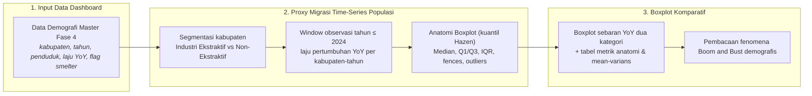
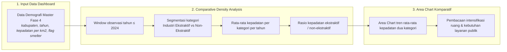
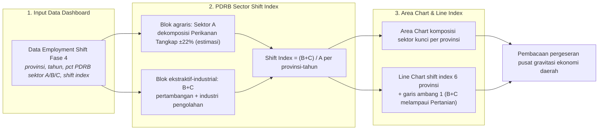

# BAB IX: METODOLOGI ANALISIS DEMOGRAFI SOSIAL - KETIKA HILIRISASI MENGUBAH STRUKTUR MASYARAKAT

Dokumen laporan metodologi ini menyajikan kerangka ilmiah, prosedur pengolahan data, dan pembacaan empiris yang dioperasionalkan pada **Bab 9: Demografi Sosial - Ketika Hilirisasi Mengubah Struktur Masyarakat**.

## 9.1 Tekanan Demografi di Kabupaten Industri Ekstraktif

> **Sumber Data Resmi & Deskripsi Visualisasi:** Data Demografi: `data/processed/sulawesi_demografi_master_fase4.csv` (BPS SIMDASI, klasifikasi Fase 4). Visualisasi dashboard menampilkan Boxplot komparatif sebaran laju pertumbuhan penduduk YoY (kuantil Hazen, semua titik data ditampilkan) antara kabupaten industri ekstraktif dan non-ekstraktif, beserta Tabel Rincian Metrik Anatomi Boxplot dan Tabel Rincian Perhitungan Mean & Varians.

#### A. Pengantar & Kerangka Narasi
Analisis ini membaca tekanan demografi melalui perubahan jumlah penduduk kabupaten (*proxy* migrasi), bukan melalui data migrasi langsung — populasi diperlakukan sebagai sinyal awal tarikan penduduk, pekerja, dan aktivitas ekonomi baru. Fokus pembacaan pada **7 kabupaten prioritas smelter**: Banggai, Kolaka, Konawe, Konawe Utara, Luwu Timur, Morowali, Morowali Utara. Rata-rata pertumbuhan YoY kabupaten smelter tercatat **3.36%** vs non-smelter **2.03%**; total populasi kabupaten smelter pada 2024 mencapai **1.59 juta jiwa**. Hilirisasi nikel menciptakan tekanan demografis yang harus dibaca sebagai bagian dari beban sosial, bukan sekadar konsekuensi administratif pembangunan industri.

#### B. Alur Logika Metodologis Proxy Migrasi dari Time-Series Populasi Kabupaten
Kerangka pembacaan tekanan demografi berbasis proxy populasi dan anatomi boxplot diilustrasikan pada **Bagan Alur 9.1** berikut. Sub-bab ini tidak menggunakan uji inferensial Chi-Square, melainkan statistika deskriptif sebaran (kuantil Hazen) komparatif dua kategori wilayah.

##### Bagan Alur 9.1: Alur Logika Analisis Proxy Migrasi & Anatomi Boxplot Demografi


#### C. Formulasi Matematis: Laju Pertumbuhan, Kuantil Hazen, dan Batas Kewajaran
Kuantifikasi sebaran tekanan demografi dihitung menggunakan sistem formulasi matematis berikut:

```text
Laju_YoY_k,t (%) = ( P_k,t - P_k,t-1 ) / P_k,t-1 × 100
Q_p = Kuantil_Hazen ( Laju_YoY , p )   ;   IQR = Q3 - Q1
Batas_Bawah = Q1 - 1,5 × IQR   ;   Batas_Atas = Q3 + 1,5 × IQR
```

Metode kuantil Hazen dipakai karena identik dengan algoritma boxplot default Plotly pada dashboard, sehingga tabel statis dan tooltip grafik cocok sempurna.

Substitusi angka dari dataset aktual:

```text
Ekstraktif: Median = 2.00% ; Q1 = 1.50% ; Q3 = 2.78% ; IQR = 1.28
Non-Ekstraktif: Median = 1.15% ; Q1 = 0.695% ; Q3 = 1.895% ; IQR = 1.200
Ekstraktif Fences: -0.10% s.d. 4.22%   ;   Min = -7.76% ; Max = 20.34%
Mean_Ekstraktif = 3.36% (N=39)   vs   Mean_Non-Ekstraktif = 2.03% (N=464)
```

#### D. Matriks Hasil Uji Empiris
##### Tabel 9.1: Rincian Metrik Anatomi Boxplot Laju Pertumbuhan Penduduk (YoY %)
| Kategori | Max (%) | Upper Fence (%) | Q3 (%) | Median (%) | Q1 (%) | Lower Fence (%) | Min (%) |
| :--- | :--- | :--- | :--- | :--- | :--- | :--- | :--- |
| Kabupaten Industri Ekstraktif | 20.34 | 4.22 | 2.78 | 2.00 | 1.50 | -0.10 | -7.76 |
| Kabupaten Non-Ekstraktif | 14.80 | 3.61 | 1.90 | 1.15 | 0.69 | -0.89 | -6.73 |

##### Tabel 9.2: Rincian Perhitungan Mean & Varians Laju Pertumbuhan YoY
| Kategori | Rata-Rata / Mean (%) | Standard Deviation | Jumlah Sampel (Tahun-Kabupaten) |
| :--- | :--- | :--- | :--- |
| Kabupaten Industri Ekstraktif | 3.36 | 5.68 | 39 |
| Kabupaten Non-Ekstraktif | 2.03 | 2.85 | 464 |

##### Tabel 9.3: Daftar Kabupaten Prioritas Industri Ekstraktif (Klasifikasi Fase 4)
| No | Kabupaten |
| :--- | :--- |
| 1 | Banggai |
| 2 | Kolaka |
| 3 | Konawe |
| 4 | Konawe Utara |
| 5 | Luwu Timur |
| 6 | Morowali |
| 7 | Morowali Utara |

#### E. Analisis Temuan Empiris: Bukti Matematis Fenomena Boom and Bust
1. **Median Konsisten Lebih Tinggi:** nilai tengah pertumbuhan kawasan industri ekstraktif mencapai **2.00%**, konsisten lebih tinggi dibanding kawasan non-ekstraktif (1.15%).
2. **Variabilitas Ekstrem Kawasan Ekstraktif:** IQR wilayah ekstraktif merentang Q1 1.50% hingga Q3 2.78% — jauh lebih lebar dibanding non-ekstraktif (Q1 0.695% hingga Q3 1.895%) yang tumbuh lebih stabil.
3. **Bukti Boom and Bust:** sebaran data ekstraktif menembus batas kewajaran (fences -0.10% s.d. 4.22%): lonjakan tertinggi **20.34%** dan kejatuhan terendah **-7.76%** — bukti matematis masuknya pekerja migran secara masif di awal fase konstruksi pabrik, disusul eksodus drastis ketika proyek operasional menyusut atau terjadi pemutusan kerja massal.

## 9.2 Intensifikasi Ruang: Kepadatan Industri Ekstraktif vs Non-Ekstraktif

> **Sumber Data Resmi & Deskripsi Visualisasi:** Data Demografi: `data/processed/sulawesi_demografi_master_fase4.csv` (BPS SIMDASI). Visualisasi dashboard menampilkan Area Chart tren rata-rata kepadatan penduduk (jiwa/km2) dua kategori wilayah beserta tabel agregasi kepadatan per kategori.

#### A. Pengantar & Kerangka Narasi
Yang dibaca sub-bab ini adalah **intensifikasi ruang** — tekanan yang muncul ketika pertumbuhan penduduk dan konsentrasi industri bertemu pada wilayah yang sama (bukan klaim urbanisasi formal Podes). Rata-rata kepadatan kabupaten smelter pada 2024 mencapai **42.7 jiwa/km2**, sedangkan kabupaten non-smelter berada pada **438.3 jiwa/km2**. Rasio **0.10 kali** memberi sinyal kebutuhan kapasitas layanan publik yang berbeda: perumahan, air bersih, sanitasi, transportasi, hingga fasilitas kesehatan. Dalam kerangka D3TLH, kepadatan adalah indikator apakah ruang hidup lokal sedang dipadatkan oleh proyek ekstraktif tanpa perencanaan sosial yang sepadan.

#### B. Alur Logika Metodologis Comparative Density Analysis
Kerangka komparasi kepadatan dua kategori wilayah diilustrasikan pada **Bagan Alur 9.2** berikut. Sub-bab ini tidak menggunakan uji inferensial Chi-Square, melainkan perbandingan rata-rata kepadatan deskriptif antar kategori dari waktu ke waktu.

##### Bagan Alur 9.2: Alur Logika Analisis Comparative Density Analysis


#### C. Formulasi Matematis: Rata-rata Kepadatan dan Rasio Intensifikasi
Kuantifikasi intensifikasi ruang dihitung menggunakan sistem formulasi matematis berikut:

```text
D_c,t = [ Σ ( Densitas_k,t ) ] / n_c   ;   untuk seluruh kabupaten k dalam kategori c pada tahun t
R_t = D_Ekstraktif,t / D_Non-Ekstraktif,t
```

Substitusi angka dari dataset aktual:

```text
D_Ekstraktif,2024 = 42.7 jiwa/km2   ;   D_Non-Ekstraktif,2024 = 438.3 jiwa/km2
R_2024 = 42.7 / 438.3 = 0.10x
Δ D_Ekstraktif (2016-2024) = +39.7 jiwa/km2   ;   Δ D_Non-Ekstraktif = +225.6 jiwa/km2
```

#### D. Matriks Hasil Uji Empiris
##### Tabel 9.4: Agregasi Rata-rata Kepadatan Penduduk per Kategori Wilayah (2016-2024)
| Tahun | Industri Ekstraktif (jiwa/km2) | Non-Ekstraktif (jiwa/km2) | Rasio (x) |
| :--- | :--- | :--- | :--- |
| 2014 | - | 519.5 | - |
| 2015 | - | 526.3 | - |
| 2016 | 3.0 | 212.8 | 0.01x |
| 2017 | 39.1 | 413.3 | 0.09x |
| 2018 | 39.6 | 434.0 | 0.09x |
| 2019 | 40.7 | 435.3 | 0.09x |
| 2020 | 34.2 | 470.2 | 0.07x |
| 2021 | 47.5 | 450.0 | 0.11x |
| 2022 | 50.0 | 347.4 | 0.14x |
| 2023 | 49.0 | 479.7 | 0.10x |
| 2024 | 42.7 | 438.3 | 0.10x |

#### E. Analisis Temuan Empiris: Peta Awal Tekanan Ruang
1. **Profil Kepadatan Dua Kategori:** pada 2024, rata-rata kepadatan kabupaten industri ekstraktif **42.7 jiwa/km2** — rasio 0.10 kali terhadap kabupaten non-ekstraktif (438.3 jiwa/km2); kawasan ekstraktif berbasis kabupaten berwilayah luas dan semula berpenduduk jarang, sehingga rasionya di bawah satu.
2. **Intensifikasi Jauh Lebih Cepat di Kawasan Ekstraktif:** sepanjang window data 2016-2024, rata-rata kepadatan kawasan ekstraktif melipat **14.2 kali** (dari 3.0 menjadi 42.7 jiwa/km2, +39.7), jauh melampaui laju kawasan non-ekstraktif yang hanya 2.1 kali — inilah intensifikasi ruang yang dibaca sub-bab ini.
3. **Implikasi Kapasitas Layanan Publik:** pemadatan cepat pada ruang yang semula lengang memberi sinyal kebutuhan kapasitas layanan publik yang berbeda di kawasan industri — perumahan, air bersih, sanitasi, transportasi, hingga fasilitas kesehatan — agar ruang hidup lokal tidak dipadatkan proyek ekstraktif tanpa perencanaan sosial yang sepadan.

## 9.3 Pergeseran Ekonomi Agraris ke Tambang dan Industri

> **Sumber Data Resmi & Deskripsi Visualisasi:** Data Shift Index: `data/processed/sulawesi_employment_shift_fase4.csv` dan `data/processed/sulawesi_pdrb_sektoral_2016_2024.csv` (BPS SIMDASI). Visualisasi dashboard menampilkan Area Chart komposisi PDRB sektor kunci per provinsi (dengan dekomposisi estimasi Perikanan Tangkap) serta Line Chart Shift Index (B+C / A) 6 provinsi dengan garis ambang 1.

#### A. Pengantar & Kerangka Narasi
Pergeseran pekerjaan tidak dapat diklaim hanya dari PDRB, tetapi struktur PDRB memberi petunjuk kuat tentang arah ekonomi yang sedang dibentuk. Sektor A dibaca sebagai basis agraris, sektor B dan C sebagai blok ekstraktif-industrial. Rasio B+C terhadap A menjadi *shift index*; nilai di atas 1 berarti kontribusi tambang dan industri sudah melampaui pertanian. Di Sulawesi Tengah, porsi pertanian turun dari **34.39%** menjadi **15.80%**, sementara tambang+industri naik dari **15.45%** menjadi **55.82%**. Indeksnya naik dari **0.449** ke **3.533**, atau sekitar **7.9 kali** — hilirisasi mengubah pusat gravitasi ekonomi daerah dari ruang produksi agraris menuju rantai ekstraktif yang lebih terkonsentrasi pada modal besar.

#### B. Alur Logika Metodologis PDRB Sector Shift Index (B+C / A)
Kerangka pembacaan pergeseran struktur ekonomi berbasis shift index diilustrasikan pada **Bagan Alur 9.3** berikut. Sub-bab ini tidak menggunakan uji inferensial Chi-Square, melainkan indeks rasio sektoral deskriptif dengan ambang interpretatif 1.

##### Bagan Alur 9.3: Alur Logika Analisis PDRB Sector Shift Index


#### C. Formulasi Matematis: Shift Index, Dekomposisi Sektor A, dan Multiplier
Kuantifikasi pergeseran struktur ekonomi dihitung menggunakan sistem formulasi matematis berikut:

```text
Shift_Index_p,t = ( PDRB_B_p,t + PDRB_C_p,t ) / PDRB_A_p,t
Perikanan_Tangkap ≈ 0,22 × Sektor_A   ;   Pertanian_Kehutanan ≈ 0,78 × Sektor_A
Multiplier_p = Shift_Index_p,akhir / Shift_Index_p,awal
```

Proporsi 0,22 adalah estimasi Perikanan Tangkap terhadap Sektor A, mengacu rata-rata proporsi sub-sektor perikanan di provinsi pesisir Sulawesi (Statistik Perikanan BPS Sulawesi, 2016-2024).

Substitusi angka dari dataset aktual (Sulawesi Tengah sebagai episentrum):

```text
Shift_Index_Sulteng: 0.449 (2014) → 3.533 (2024)   ;   Multiplier = 3.533 / 0.449 = 7.9x
Pertanian (A): 34.39% → 15.80%   ;   Tambang+Industri (B+C): 15.45% → 55.82%
```

#### D. Matriks Hasil Uji Empiris
##### Tabel 9.5: Shift Index (B+C / A) per Provinsi per Tahun (2014-2024)
| Tahun | Gorontalo | Sulawesi Barat | Sulawesi Selatan | Sulawesi Tengah | Sulawesi Tenggara | Sulawesi Utara |
| :--- | :--- | :--- | :--- | :--- | :--- | :--- |
| 2014 | 0.145 | 0.298 | 0.918 | 0.449 | 1.009 | 0.661 |
| 2015 | 0.149 | 0.298 | 0.873 | 0.638 | 1.117 | 0.655 |
| 2016 | 0.145 | 0.286 | 0.822 | 0.799 | 1.049 | 0.636 |
| 2017 | 0.138 | 0.294 | 0.810 | 0.869 | 1.114 | 0.660 |
| 2018 | 0.135 | 0.283 | 0.784 | 1.351 | 1.127 | 0.674 |
| 2019 | 0.138 | 0.288 | 0.833 | 1.544 | 1.156 | 0.661 |
| 2020 | 0.140 | 0.285 | 0.802 | 1.885 | 1.121 | - |
| 2021 | 0.142 | 0.294 | 0.765 | 2.548 | 1.143 | 0.750 |
| 2022 | 0.149 | 0.293 | 0.813 | 3.518 | 1.229 | 0.759 |
| 2023 | 0.146 | 0.299 | 0.829 | 3.525 | 1.313 | 0.762 |
| 2024 | 0.147 | 0.274 | 0.804 | 3.533 | 1.300 | 0.754 |

##### Tabel 9.6: Ringkasan Pergeseran Struktur Ekonomi per Provinsi
| Provinsi | Index Awal | Index Akhir | Multiplier | Status Ambang |
| :--- | :--- | :--- | :--- | :--- |
| Gorontalo | 0.145 | 0.147 | 1.0x | Di bawah ambang |
| Sulawesi Barat | 0.298 | 0.274 | 0.9x | Di bawah ambang |
| Sulawesi Selatan | 0.918 | 0.804 | 0.9x | Di bawah ambang |
| Sulawesi Tengah | 0.449 | 3.533 | 7.9x | MELAMPAUI AMBANG (B+C > A) |
| Sulawesi Tenggara | 1.009 | 1.300 | 1.3x | MELAMPAUI AMBANG (B+C > A) |
| Sulawesi Utara | 0.661 | 0.754 | 1.1x | Di bawah ambang |

#### E. Analisis Temuan Empiris: Pergeseran Pusat Gravitasi Ekonomi
1. **Episentrum Pergeseran di Sulawesi Tengah:** shift index Sulteng melonjak dari 0.449 menjadi **3.533** (7.9 kali) — blok tambang+industri kini 55.82% PDRB, jauh melampaui pertanian yang menyusut ke 15.80%.
2. **Provinsi Pelampau Ambang:** provinsi dengan shift index akhir melampaui ambang 1 (B+C > A): **Sulawesi Tengah (3.533), Sulawesi Tenggara (1.300)** — sementara provinsi lain masih berbasis agraris.
3. **Catatan Metodologis:** dekomposisi Perikanan Tangkap adalah estimasi (±22% Sektor A) untuk keperluan visual; klaim pergeseran pekerjaan tidak ditarik dari PDRB semata, melainkan dibaca sebagai petunjuk arah ekonomi yang sedang dibentuk hilirisasi — dari ruang produksi agraris menuju rantai ekstraktif yang terkonsentrasi pada modal besar.
