# BAB IX: METODOLOGI ANALISIS DEMOGRAFI SOSIAL — KETIKA HILIRISASI MENGUBAH STRUKTUR MASYARAKAT
*Ringkasan Eksekutif Metodologis · Center of Economic and Law Studies (CELIOS)*

---

## A. Desain Penelitian & Tujuan
Penelitian Bab 9 menerapkan **desain analisis demografi spasial dan transformasi struktural ekonomi (Spatial Demography & Structural Transformation Analysis)** guna menguji disrupsi sosial yang terjadi akibat penetrasi industri hilirisasi nikel skala masif di Pulau Sulawesi. Melalui pembacaan data deret waktu populasi, pemodelan sebaran kuantil, dan rasio pergeseran sektoral PDRB, kajian ini membuktikan tiga fenomena perubahan sosial-spasial:

1. **Tekanan Demografi & Proxy Migrasi (Hazen Quantile Boxplot Analysis):** Menganalisis anomali lonjakan penduduk tahunan (YoY) pada 7 kabupaten prioritas smelter dibandingkan kabupaten non-smelter, guna membuktikan fenomena tarikan migrasi tenaga kerja dan siklus fluktuasi tajam (*boom and bust*).
2. **Intensifikasi Ruang & Beban Layanan Publik (Comparative Density Analysis):** Mengukur laju pemadatan penduduk per kilometer persegi pada kawasan industri ekstraktif yang semula berpenduduk jarang, sebagai indikator stres daya dukung sarana air bersih, sanitasi, dan perumahan lokal.
3. **Pergeseran Gravitasi Ekonomi Sektoral (PDRB Sector Shift Index):** Mengkuantifikasi transformasi struktur perekonomian daerah dari basis agraris (Sektor A: Pertanian, Kehutanan, Perikanan) menuju dominasi blok ekstraktif-industrial (Sektor B: Pertambangan dan C: Industri Pengolahan).

---

## B. Sumber Data & Cakupan Wilayah
Analisis demografi sosial ini mengolah basis data panel resmi Badan Pusat Statistik (BPS) kurun waktu 2014–2024 yang mencakup seluruh wilayah kabupaten/kota dan 6 provinsi se-Pulau Sulawesi:

- **BPS SIMDASI (Sistem Informasi Rujukan Statistik Terintegrasi):** Data deret waktu populasi penduduk kabupaten/kota, luas daratan yurisdiksi, dan laju pertumbuhan penduduk YoY.
- **Klasifikasi 7 Kabupaten Prioritas Smelter (Fase 4):** Klaster kabupaten sentra industri pengolahan nikel: Banggai, Kolaka, Konawe, Konawe Utara, Luwu Timur, Morowali, dan Morowali Utara (total populasi 2024 mencapai 1,59 juta jiwa).
- **BPS PDRB Sektoral Seri 2010 (Tahun 2014–2024):** Struktur Produk Domestik Regional Bruto menurut lapangan usaha: Sektor A (Pertanian), Sektor B (Pertambangan), dan Sektor C (Industri Pengolahan).
- **Statistik Perikanan Tangkap BPS:** Dekomposisi estimasi kontribusi sub-sektor perikanan tangkap laut (~22% dari Sektor A) pada provinsi-provinsi pesisir Sulawesi.

---

## C. Operasionalisasi Variabel & Indikator Riset
Seluruh parameter demografi, kepadatan spasial, hingga pergeseran struktur produksi dioperasionalkan ke dalam **9 indikator riset empiris terverifikasi** sebagaimana dirangkum pada matriks operasional berikut:

##### Matriks Operasionalisasi Variabel dan Sumber Data Resmi Bab 9 (Demografi Sosial)
| No | Indikator Riset | Fokus Pengukuran | Satuan | Sumber Data Primer Resmi |
| :-: | :--- | :--- | :-: | :--- |
| 1 | Laju Pertumbuhan Penduduk YoY (9.1) | Pertumbuhan Tahunan Populasi Kabupaten (Proxy Migrasi) | Persen (% / Tahun) | BPS SIMDASI Demografi |
| 2 | Anatomi Sebaran Boxplot Hazen (9.1) | Median, Q1, Q3, IQR, dan Rentang Pagar Kewajaran | Nilai Persentil (%) | BPS SIMDASI (Kuantil Hazen) |
| 3 | Anomali Fluktuasi Boom-and-Bust (9.1) | Lonjakan Ekstrem Tertinggi vs Kejatuhan Terendah | Persen Ekstrem (%) | Dataset Deret Waktu BPS |
| 4 | Kepadatan Penduduk Ekstraktif (9.2) | Jumlah Penduduk per Luas Daratan Kabupaten Smelter | Jiwa / km² | BPS SIMDASI & Luas Wilayah |
| 5 | Rasio Kepadatan Wilayah (9.2) | Rasio Densitas Kabupaten Smelter vs Non-Smelter | Rasio Kelipatan (x) | Analisis Komparasi Kepadatan |
| 6 | Laju Intensifikasi Pemadatan (9.2) | Peningkatan Densitas Penduduk Selama Periode 2016-2024 | Jiwa / km² & Kelipatan | Tracking Time-Series BPS |
| 7 | Kontribusi PDRB Basis Agraris (9.3) | Pangsa PDRB Sektor Pertanian, Kehutanan, Perikanan (A) | Persen PDRB (%) | BPS PDRB Sektoral Seri 2010 |
| 8 | Kontribusi Tambang & Industri (9.3) | Pangsa PDRB Blok Ekstraktif-Industrial (Sektor B + C) | Persen PDRB (%) | BPS PDRB Sektoral Seri 2010 |
| 9 | Indeks Pergeseran Ekonomi / Shift (9.3) | Rasio Pangsa (B + C) terhadap Sektor Agraris (A) | Rasio Indeks | BPS PDRB Sektoral (Ambang 1,0) |

---

## D. Kerangka Analisis & Formulasi Matematis

### Sub-bab 9.1: Tekanan Demografi di Kabupaten Industri Ekstraktif
Penilaian tekanan demografi dilakukan dengan membaca perubahan jumlah penduduk sebagai sinyal tarikan tenaga kerja (proxy migrasi) dan membandingkan distribusinya melalui algoritma boxplot kuantil Hazen:

> **1. Laju Pertumbuhan Penduduk Tahunan (YoY %):**  
> `Pertumbuhan YoY (%) = [ (Jumlah Penduduk Tahun Ini - Penduduk Tahun Lalu) / Penduduk Tahun Lalu ] × 100%`  
>  
> **2. Rentang Pagar Sebaran Normal (Fences Boxplot Hazen):**  
> • Rentang Interkuartil (IQR) = Kuartil Atas (Q3) - Kuartil Bawah (Q1)  
> • Pagar Atas (Upper Fence) = Q3 + (1,5 × IQR)  
> • Pagar Bawah (Lower Fence) = Q1 - (1,5 × IQR)  
>  
> *Fakta Empiris: Rata-rata pertumbuhan kabupaten smelter mencapai 3,36% (median 2,00%) vs non-smelter 2,03% (median 1,15%). Wilayah smelter membuktikan fenomena Boom and Bust tajam: lonjakan tertinggi mencapai +20,34% di awal fase proyek, disusul kejatuhan terendah hingga -7,76% saat fase konstruksi mereda.*

##### Tabel 9.1: Rincian Anatomi Boxplot Laju Pertumbuhan Penduduk YoY (%)
| Kategori Wilayah | Maksimum | Pagar Atas | Q3 | Median | Q1 | Pagar Bawah | Minimum | Mean |
| :--- | :---: | :---: | :---: | :---: | :---: | :---: | :---: | :---: |
| Kabupaten Industri Ekstraktif (7 Kab) | 20,34% | 4,22% | 2,78% | 2,00% | 1,50% | -0,10% | -7,76% | 3,36% |
| Kabupaten Non-Ekstraktif (Lainnya) | 14,80% | 3,61% | 1,90% | 1,15% | 0,69% | -0,89% | -6,73% | 2,03% |

---

### Sub-bab 9.2: Intensifikasi Ruang — Kepadatan Industri Ekstraktif vs Non-Ekstraktif
Pengukuran intensifikasi ruang menilai laju pemadatan penduduk pada kabupaten industri ekstraktif yang memiliki wilayah daratan luas dan semula berpenduduk jarang:

> **1. Kepadatan Penduduk Rata-rata Kategori:**  
> `Kepadatan Kategori = Total Jumlah Penduduk Seluruh Kabupaten / Total Luas Daratan Seluruh Kabupaten`  
>  
> **2. Rasio Intensifikasi Ruang:**  
> `Rasio Kepadatan = Kepadatan Kabupaten Smelter / Kepadatan Kabupaten Non-Smelter`  
>  
> *Fakta Empiris: Pada 2024, kepadatan kabupaten ekstraktif tercatat 42,7 jiwa/km² vs non-ekstraktif 438,3 jiwa/km² (rasio 0,10x). Kendati rasionya tampak kecil karena luas wilayahnya besar, laju pemadatan di kawasan ekstraktif melipat 14,2 kali (dari 3,0 ke 42,7 jiwa/km²) sepanjang 2016-2024, membuktikan adanya pemadatan ruang drastis tanpa kesiapan fasilitas dasar.*

##### Tabel 9.2: Tren Kepadatan Penduduk dan Rasio Intensifikasi Ruang (2016–2024)
| Tahun | Kabupaten Smelter | Kabupaten Non-Smelter | Rasio (x) | Konteks Dinamika Lapangan |
| :---: | :---: | :---: | :---: | :--- |
| 2016 | 3,0 jiwa/km² | 212,8 jiwa/km² | 0,01x | Awal Ekspansi Smelter Terbuka |
| 2018 | 39,6 jiwa/km² | 434,0 jiwa/km² | 0,09x | Arus Masuk Tenaga Kerja Masif |
| 2020 | 34,2 jiwa/km² | 470,2 jiwa/km² | 0,07x | Restriksi Mobilitas Pandemi |
| 2022 | 50,0 jiwa/km² | 347,4 jiwa/km² | 0,14x | Puncak Operasi Smelter Baru |
| 2024 | 42,7 jiwa/km² | 438,3 jiwa/km² | 0,10x | Pemadatan Ruang Meningkat 14,2x Lipat |

---

### Sub-bab 9.3: Pergeseran Ekonomi Agraris ke Tambang dan Industri Pengolahan
Pergeseran gravitasi ekonomi daerah diukur melalui rasio kontribusi blok ekstraktif-industrial terhadap basis agraris tradisional:

> **1. Rumus Shift Index Sektoral PDRB:**  
> `Shift Index = [ PDRB Sektor B (Pertambangan) + PDRB Sektor C (Industri) ] / PDRB Sektor A (Pertanian)`  
>  
> **2. Garis Ambang Batas Dominasi (Threshold = 1,0):**  
> • **Shift Index > 1,0** : Kontribusi Tambang & Industri telah MELAMPAUI basis pangan agraris  
> • **Shift Index ≤ 1,0** : Perekonomian daerah masih bertumpu pada basis agromaritim tradisional  
>  
> *Fakta Empiris: Sulawesi Tengah menjadi episentrum pergeseran dengan lonjakan Shift Index dari 0,449 (2014) menjadi 3,533 (2024), atau melipat 7,9 kali lipat! Pangsa pertanian Sulteng terpangkas separuh (dari 34,39% ke 15,80%), sementara tambang+industri meroket menguasai 55,82% PDRB.*

##### Tabel 9.3: Ringkasan Pergeseran Struktur Ekonomi (Shift Index) 6 Provinsi Se-Sulawesi
| Provinsi | Shift Index 2014 | Shift Index 2024 | Multiplier | Status Ambang Dominasi (B+C > A) |
| :--- | :---: | :---: | :---: | :--- |
| **Sulawesi Tengah** | **0,449** | **3,533** | **7,9x** | **MELAMPAUI AMBANG (Dominasi Tambang 55,8%)** |
| **Sulawesi Tenggara** | **1,009** | **1,300** | **1,3x** | **MELAMPAUI AMBANG (Dominasi Tambang & Smelter)** |
| Sulawesi Selatan | 0,918 | 0,804 | 0,9x | Di Bawah Ambang (Basis Agraris & Jasa Kuat) |
| Sulawesi Utara | 0,661 | 0,754 | 1,1x | Di Bawah Ambang (Ekonomi Agromaritim & Perikanan) |
| Sulawesi Barat | 0,298 | 0,274 | 0,9x | Di Bawah Ambang (Sentra Perkebunan Rakyat) |
| Gorontalo | 0,145 | 0,147 | 1,0x | Di Bawah Ambang (Basis Pertanian Jagung & Pangan) |

---

## E. Korespondensi Metodologi terhadap Sub-bab Laporan Bab 9
Setiap sub-bab analitis pada Bab 9 ditopang oleh metode empiris terstandarisasi sebagaimana dirangkum pada matriks korespondensi berikut:

##### Matriks Korespondensi Metodologis Bab 9
| Sub-bab | Fokus Kajian Empiris | Metode Analitis Utama |
| :-: | :--- | :--- |
| Sub-bab 9.1 | Tekanan Demografi di Kabupaten Smelter | Population Time-Series Proxy, Hazen Quantile Boxplot, Boom-and-Bust Disparity Audit |
| Sub-bab 9.2 | Intensifikasi Ruang & Beban Layanan Publik | Comparative Density Modeling, Spatial Intensification Tracking, Public Service Stress Audit |
| Sub-bab 9.3 | Pergeseran Ekonomi Agraris ke Ekstraktif | PDRB Sectoral Share Ratio, Shift Index Threshold Analysis, Agrarian Displacement Tracking |

---

## F. Bagan Alur Kerangka Kerja Riset (Research Workflow)
Kerangka penyelidikan demografi sosial dijalankan secara berjenjang melalui empat tahapan metodologis berikut:

```mermaid
flowchart LR
    subgraph F1["Fase I: Input Data BPS"]
        A1["Populasi Penduduk<br/><i>BPS SIMDASI 2014-2024</i>"]
        A2["Klaster 7 Kab Smelter<br/><i>1.59 Juta Jiwa (Fase 4)</i>"]
        A3["Luas Daratan Wilayah<br/><i>Luas km2 Kabupaten</i>"]
        A4["PDRB Sektoral Seri 2010<br/><i>Sektor A vs B+C</i>"]
    end
    subgraph F2["Fase II: Segmentasi & Komputasi"]
        B1["Laju Pertumbuhan YoY<br/><i>Proxy Tarikan Migrasi</i>"]
        B2["Pemodelan Kepadatan<br/><i>Jiwa per km2 Kategori</i>"]
        B3["PDRB Shift Ratio<br/><i>(B+C) dibagi Sektor A</i>"]
    end
    subgraph F3["Fase III: Evaluasi Transformasi"]
        C1["Boxplot Hazen<br/><i>Boom & Bust Ekstraktif</i>"]
        C2["Intensifikasi Ruang<br/><i>Pemadatan 14.2x Lipat</i>"]
        C3["Ambang Batas Index 1.0<br/><i>Sulteng 3.53 & Sultra 1.30</i>"]
    end
    subgraph F4["Fase IV: Sintesis Disrupsi Sosial"]
        D1["Tekanan Demografi<br/><i>Tarikan Pekerja Migran</i>"]
        D2["Stres Layanan Publik<br/><i>Sanitasi, Air & Faskes</i>"]
        D3["Alih Gravitasi Ekonomi<br/><i>Tergusurnya Basis Agraris</i>"]
    end
    F1 --> F2 --> F3 --> F4
```

> **KESIMPULAN METODOLOGIS BAB 9 (DISRUPSI DEMOGRAFI SOSIAL & PDRB):**  
> 1. **Anomali Boom and Bust Demografis:** Kawasan industri smelter mencatat rata-rata pertumbuhan penduduk 3,36% dengan rentang variabilitas ekstrem (+20,34% ke -7,76%), membuktikan adanya tarikan migrasi massal di awal proyek yang rentan terhadap guncangan PHK dan eksodus pasca-konstruksi.  
> 2. **Akselerasi Intensifikasi Ruang:** Kepadatan penduduk di kabupaten smelter melesat 14,2 kali lipat sepanjang 2016–2024, memicu tekanan berat terhadap daya dukung infrastruktur perumahan, air bersih, sanitasi, dan fasilitas kesehatan perdesaan.  
> 3. **Pergeseran Gravitasi Ekonomi:** Hilirisasi memicu pergeseran struktural tajam di Sulawesi Tengah (Shift Index naik 7,9x ke 3,533) dan Sulawesi Tenggara (1,300), di mana dominasi industri ekstraktif menggeser ruang produksi agraris dan memperbesar ketergantungan daerah pada rantai pasok modal besar.
