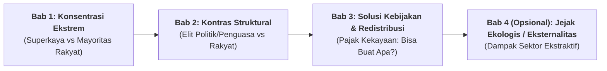

# Standar & Aturan Dokumentasi Laporan Metodologi Statistik (Versi Compact)
**Center of Economic and Law Studies (CELIOS)**

Dokumen ini merupakan **SOP (Standard Operating Procedure)** wajib dalam menyusun laporan **Metodologi Statistik Versi Compact** untuk publikasi riset, *policy brief*, infografis advokasi, dan siaran pers CELIOS. 

Format ini diabstraksikan langsung dari pola baku dokumen resmi: [`Celios-Metodologi-Statistik-2.md`](file:///C:/Users/yooma/OneDrive/Desktop/duniahub/client/4.%20Celios2/tools/report_metodologi/versicompact/Celios-Metodologi-Statistik-2.md).

---

## 1. Filosofi & Karakteristik Versi Compact

Berbeda dengan **Dokumen 4 Pilar** (yang ditujukan untuk *technical data engineers* dengan *script logs*, *REST endpoints*, dan *SPSS outputs*), **Versi Compact** dirancang untuk:
1. **Transparansi Penuh Angka Publik:** Menjelaskan secara gamblang bagaimana setiap angka klaim pada infografis dan rilis media dihitung, sehingga tidak ada kesan "klaim sepihak" atau *black box*.
2. **Bahasa Jurnalisme Data & Kebijakan:** Mengawinkan ketelitian statistik akademis dengan bahasa advokasi publik yang tajam, mudah dipahami jurnalis, analis kebijakan, dan pembuat undang-undang.
3. **Konsep Humanizing the Metric:** Mengonversi agregat nominal angka raksasa (Triliun Rupiah, Ton Emisi, Hektar Konsesi) menjadi unit sosial konkret yang dialami rakyat sehari-hari (upah per detik, masa kerja abad, jumlah guru honorer, beasiswa kuliah, layanan cuci darah).

---

## 2. Struktur Makro Dokumen (Pembagian Bab)

Laporan metodologi versi compact wajib mengelompokkan temuan ke dalam **3 hingga 4 Bab Tematik Berurutan** dengan alur narasi yang kontras dan solutif:



| Bab | Fokus Tematik | Contoh Judul Standar |
| :--- | :--- | :--- |
| **Bab 1** | Membedah kesenjangan horizontal antara kelompok 50 superkaya teratas dengan rakyat jelata/buruh. | *Ketimpangan Ekstrem: 50 Superkaya vs Mayoritas Rakyat* |
| **Bab 2** | Menyoroti kesenjangan vertikal antara kekayaan pengambil kebijakan (Menteri, Presiden, TNI/Polri, Legislatif) dengan rakyat dan aparat tingkat bawah. | *Kontras Kekayaan: Elit Negara vs Rakyat* |
| **Bab 3** | Menghitung potensi fiskal instrumen progresif (misal: *Wealth Tax*) dan mensimulasikan alokasi anggarannya untuk pemenuhan hak dasar rakyat. | *Pajak Kekayaan 50 Triliuner Bisa Buat Apa?* |

---

## 3. Anatomi Wajib Setiap Poin Temuan (7 Elemen Wajib)

Setiap sub-nomor (misal `1.1`, `1.2`, `2.1`, `3.1`, dst.) **HARUS** memuat 7 elemen berikut secara lengkap dan padat:

```text
┌────────────────────────────────────────────────────────────────────────┐
│ [Heading Level 6/Judul Poin]                                           │
│ Nomor.Sub-nomor: [Klaim Kuantitatif yang Kuat dan Spesifik]            │
├────────────────────────────────────────────────────────────────────────┤
│ 1. Narasi Konteks & Sitasi Sumber Primer (Tahun & Lembaga Resmi)       │
│ 2. Parameter Asumsi Konversi (Kurs JISDOR, Ambang Kemiskinan, CAGR)     │
│ 3. Matriks Kalkulasi Matematis (Persamaan Aritmatika / Majemuk)         │
│ 4. Penjabaran Hasil Angka Eksak vs Pembulatan Komunikatif               │
│ 5. Humanizing Scale (Konversi ke Satuan Waktu / Biaya Hidup Riil)       │
│ 6. Catatan Keterbatasan Data (Data Caveat & Boundary Assumptions)      │
│ 7. Rujukan Tautan Dokumen Resmi / Berita / Database Publik (Footnote) │
└────────────────────────────────────────────────────────────────────────┘
```

### Rincian 7 Elemen:

### Elemen 1: Judul Sub-bab Berbasis Klaim Kuantitatif (Actionable Headline)
- **DILARANG:** Menulis judul deskriptif pasif, seperti:  
  *❌ "1.1 Analisis Perbandingan Kekayaan 50 Orang Terkaya"*
- **WAJIB:** Menuliskan kesimpulan angka temuan utama secara lugas:  
  *✅ "1.1 Kekayaan 50 Orang Terkaya Setara dengan 55 Juta Masyarakat Indonesia"*  
  *✅ "1.5 Kekayaan Oligarki Naik Rp13 Miliar per Hari sementara Upah Pekerja hanya Naik Rp2 Ribu per Hari"*  
  *✅ "2.4 Seorang Buruh Perlu Bekerja selama 2 Abad untuk Menyamai Kekayaan Presiden RI"*

### Elemen 2: Sumber Data Primer & Tahun Baseline
- Wajib mencantumkan lembaga penerbit dan tahun rilis data secara eksplisit di kalimat pembuka:
  - *Forbes Real-Time Billionaires / The Richest People in the World (2025/2026)*
  - *Global Wealth Report (GWR) Credit Suisse / UBS (2023/2024)*
  - *Laporan Harta Kekayaan Penyelenggara Negara (LHKPN) Komisi Pemberantasan Korupsi (KPK)*
  - *Badan Pusat Statistik (BPS) — Sakernas, Susenas, PDRB ADHB/ADHK*
  - *Lembaga Penjamin Simpanan (LPS) — Distribusi Simpanan Nasabah*
  - *Undang-Undang APBN & Laporan Keuangan Pemerintah Pusat (LKPP)*
  - *Jaringan Advokasi Tambang (JATAM) & Profil AHU Kemenkumham*

### Elemen 3: Penetapan Parameter Asumsi & Konversi
- Jika menggunakan data valuta asing (USD), **wajib menetapkan tanggal dan kurs rujukan resmi**:
  > *Contoh:* "Konversi berbasis kurs Jakarta Interbank Spot Dollar Rate (JISDOR) per 10 Maret 2026 dengan penyetaraan 1 USD = Rp16.879."
- Jika menggunakan proyeksi pertumbuhan upah atau kekayaan:
  > *Contoh:* "Pertumbuhan rata-rata upah tahunan dihitung menggunakan pendekatan CAGR (Compound Annual Growth Rate) sebesar 4,88 persen per tahun merujuk tren Sakernas BPS 2019–2025."

### Elemen 4: Matriks Formulasi Matematis
Rumus matematika disajikan secara telanjang dan berurutan agar siapa pun dapat mereplikasi hitungan tersebut menggunakan kalkulator sederhana:

$$\text{Jumlah Ekuivalensi Populasi} = \frac{\text{Total Kekayaan 50 Superkaya}}{\text{Median Kekayaan Dewasa GWR}}$$

$$\text{Durasi Kerja } (n) \longrightarrow \text{Kekayaan Target} = \text{Tabungan Tahunan} \times \frac{(1 + r)^n - 1}{r}$$

$$\text{Bantuan per Penerima per Bulan} = \frac{\text{Total Anggaran Pajak Kekayaan}}{\text{Jumlah Kelompok Sasaran}} \div 12$$

### Elemen 5: Humanizing Scale (Skala Waktu & Sosial)
Nilai tahunan wajib dipecah (*breakdown*) ke dimensi waktu mikro agar audiens merasakan kontrasnya:
- Per tahun $\rightarrow$ Per bulan $\rightarrow$ Per hari $\rightarrow$ Per jam $\rightarrow$ Per menit $\rightarrow$ Per detik.
- *Contoh:* Kenaikan Rp4,92 triliun/tahun $\rightarrow$ Rp13,48 miliar/hari $\rightarrow$ Rp561,85 juta/jam $\rightarrow$ Rp9,36 juta/menit $\rightarrow$ **Rp156 ribu/detik**. Dibandingkan upah buruh: **Rp0,024/detik**.

### Elemen 6: Catatan Keterbatasan Data (Methodological Caveats)
Wajib mengakui batasan model secara jujur demi mempertahankan integritas akademik:
- Apakah mengabaikan inflasi masa depan?
- Apakah menggunakan skenario tabungan 100% pendapatan vs 20% realistis?
- Apakah ada sebagian data yang menggunakan *mixed-year estimation* (misal: 18 pejabat belum memperbarui LHKPN 2025 sehingga memakai basis 2024)?

### Elemen 7: Rujukan Tautan & Regulasi
Setiap angka biaya satuan (misal: UKT per mahasiswa, biaya pasang PLTS, biaya cuci darah, gaji honorer) harus menyertakan URL rujukan berita kredibel, keputusan kementerian, atau dokumen regulasi.

---

## 4. Tipologi Model Kalkulasi Standar Versi Compact

Laporan metodologi compact CELIOS menggunakan 6 pola model matematis:

### Tipe A: Model Rasio Agregat & Multiplier (Equivalence Ratio)
Digunakan untuk membandingkan satu entitas raksasa dengan basis ekonomi lain:
*   **Rasio terhadap APBN:** $\text{Rasio} = \frac{\text{Kekayaan 50 Terkaya}}{\text{Belanja Negara UU APBN}}$
*   **Rasio terhadap PDRB Kawasan:** $\text{Rasio} = \frac{\text{Kekayaan 50 Terkaya}}{\sum \text{PDRB (Bali, NT, Sulawesi, Maluku, Papua)}}$
*   **Rasio Kesenjangan Representasi Legislatif:** $\text{Kesenjangan} = \frac{\text{Rata-rata Kekayaan Anggota DPR Dapil}}{\text{Estimasi Kekayaan Rata-rata Warga Provinsi}}$

### Tipe B: Model Anuitas Akumulasi Pendapatan Majemuk (Compounded Wealth Catch-Up)
Menghitung berapa lama (abad/tahun) seorang pekerja biasa dapat menyamai seorang miliarder/pejabat dengan asumsi sebagian pendapatan ditabung dan tumbuh:

$$FV = PMT \times \left[ \frac{(1 + r)^n - 1}{r} \right]$$

*Keterangan:*
- $FV$: Nilai target kekayaan pejabat/miliarder (LHKPN atau Forbes).
- $PMT$: Tabungan tahunan pekerja (misal: 20% dari gaji tahunan BPS Sakernas).
- $r$: Laju kenaikan gaji tahunan (CAGR).
- $n$: Jumlah tahun masa kerja yang dicari.

### Tipe C: Model Simulasi Pajak Kekayaan Progresif (Multi-Tier Wealth Tax)
Menerapkan ambang batas (*threshold*) kekayaan ultra-tinggi:
*   Layer 1 ($< \text{Rp84 Miliar}$): **0%** (Bebas pajak kekayaan)
*   Layer 2 ($\text{Rp84 Miliar s.d. Rp506 Miliar}$): **1%** atas kelebihan di atas Rp84 Miliar.
*   Layer 3 ($> \text{Rp506 Miliar}$): **2%** atas kelebihan di atas Rp506 Miliar.

$$\text{Potensi Pajak} = \sum_{i} \left[ \tau_2 \cdot \max(0, \min(W_i, T_3) - T_2) + \tau_3 \cdot \max(0, W_i - T_3) \right]$$

### Tipe D: Model Alokasi Pembiayaan Alternatif Kebijakan ("Bisa Buat Apa?")
Mendistribusikan potensi penerimaan pajak kekayaan ($\approx \text{Rp93 Triliun}$) ke sektor-sektor publik:

$$\text{Output Layanan/Penerima} = \frac{\text{Total Potensi Pajak Kekayaan}}{\text{Unit Cost Satuan (BPS/Kementerian/Studi Celios)}}$$

*Daftar Unit Cost Standar dalam Model Celios:*
- **Rumah MBR:** Rp240 Juta / unit
- **Kebutuhan Hidup Layak (Basic Income):** Rp4,28 Juta / orang / bulan
- **Beasiswa UKT Perguruan Tinggi Negeri:** Rp19,01 Juta / mahasiswa / tahun
- **Pupuk Urea Bersubsidi (HET):** Rp2.250 / kg
- **Rangkaian KRL Baru (12 Kereta):** Rp167,5 Miliar / trainset
- **Hibah Riset Ilmiah:** Rp200 Juta / proyek penelitian
- **PLTMH Mikrohidro Komunitas:** Rp52,99 Juta / kW
- **PLTS Solar Home System Desa Terpencil:** Rp15,99 Juta / unit
- **Restorasi Hutan Hujan Tropis:** Rp17 Juta / hektare
- **Iuran PBI BPJS Kesehatan:** Rp42.000 / orang / bulan (Rp504.000 / tahun)
- **Subsidi Perawatan Motor Ojol:** Rp13,29 Juta / pengemudi / tahun
- **Gaji Guru Honorer Layak:** Rp4,35 Juta / bulan (selama 2 tahun)
- **Insentif Tenaga Kesehatan:** Rp4,88 Juta / bulan (selama 1 tahun)
- **Bantuan Akses Mandiri Disabilitas:** Rp6,09 Juta / orang / tahun
- **Jaminan Hari Tua Lansia:** Rp228.000 / bulan (Rp2,74 Juta / tahun)
- **Subsidi Penitipan Balita (Daycare):** Rp9,13 Juta / keluarga / tahun
- **Biaya Layanan Cuci Darah Pasien Gagal Ginjal:** Rp9 Juta / pasien / bulan

### Tipe E: Model Emisi Karbon Gaya Hidup Mewah (Luxury Carbon Footprint)
Menghitung emisi aviasi privat (*private jet*) dan mengonversinya ke ekuivalensi kendaraan rakyat:

$$\text{Ekuivalensi Mobil} = \frac{\text{Total Emisi Jet Pribadi } (\text{Ton } \text{CO}_2\text{e})}{\text{Emisi Rata-rata Mobil Konvensional } (5{,}9 \text{ Ton/Tahun})}$$

$$\text{Ekuivalensi Motor} = \frac{\text{Total Emisi Jet Pribadi } (\text{Ton } \text{CO}_2\text{e})}{\text{Emisi Rata-rata Sepeda Motor } (0{,}89 \text{ Ton/Tahun})}$$

### Tipe F: Model Estimasi Biaya Politik Kontestasi Pemilu (Probabilistic Election Cost)
Menghitung kebutuhan logistik pemenangan dengan batas minimum kemenangan (51% wilayah):

$$\text{Biaya Pilpres} = (0{,}51 \times N_{\text{prov}} \times C_{\text{prov}}) + (0{,}51 \times N_{\text{kab/kota}} \times C_{\text{kab/kota}})$$

*Parameter Baseline:*
- $N_{\text{prov}} = 38$, Biaya rata-rata kampanye provinsi $C_{\text{prov}} = \text{Rp100 Miliar}$
- $N_{\text{kab/kota}} = 517$, Biaya rata-rata kampanye kab/kota $C_{\text{kab/kota}} = \text{Rp30 Miliar}$

---

## 5. Standar Penulisan & Gaya Selingkung (Style Guide)

1. **Format Penulisan Angka Moneter:**
   - Gunakan format mata uang baku: `Rp4.651 triliun`, `Rp13,48 miliar`, `Rp561,85 juta`.
   - Di dalam tanda kurung untuk angka eksak: `Rp4,92 triliun (Rp4.921.771.240.600)`.
   - Pisahkan ribuan dengan titik (`.`) dan desimal dengan koma (`,`).
2. **Penulisan Proporsi Ekstrem:**
   - Wajib menyertakan jumlah desimal presisi untuk angka sangat kecil guna menunjukkan betapa eksklusifnya kelompok oligarki: `0,000000174% populasi`.
3. **Penyebutan Nama Figur Publik:**
   - Wajib mencantumkan jabatan resmi dan tanggal penarikan data LHKPN. Jika pelaporan belum diperbarui, berikan tanda bintang (`*`) dan catatan kaki penjelas (*misal: "Hanya X yang sudah memperbarui LHKPN per Desember 2025"*).
4. **Formatting Tabel Ringkas:**
   - Tabel disajikan dalam bentuk matriks komparasi 3–5 kolom yang ringkas dan padat. Hindari tabel raksasa yang membutuhkan scroll horizontal berlebihan di dokumen mobile/PDF.

---

## 6. Checklist Verifikasi Sebelum Rilis Versi Compact

Sebelum dokumen *Versi Compact* disahkan, pastikan telah memenuhi checklist berikut:

- [ ] Setiap sub-bab memiliki judul berbasis angka/klaim temuan kuantitatif yang jelas.
- [ ] Seluruh nominal valuta asing memiliki catatan tanggal dan kurs acuan JISDOR BI yang konsisten.
- [ ] Terdapat penjabaran rumus aritmatika eksplisit (tidak boleh tiba-tiba muncul angka hasil akhir).
- [ ] Terdapat konversi skala waktu mikro (*humanizing numbers*: per hari/jam/detik atau tahun masa kerja).
- [ ] Terdapat catatan batasan metodologi (*caveats*) jika menggunakan proyeksi atau data *mixed-year*.
- [ ] Sumber kutipan berita, publikasi BPS, nomor UU, atau database NGO tercantum tautan aktif/rujukannya.
- [ ] Seluruh gambar/infografis terkait telah dipetakan ke direktori aset yang sesuai.
