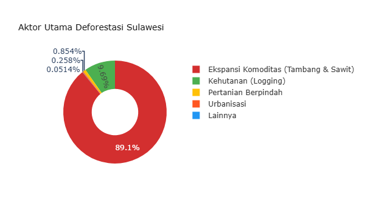
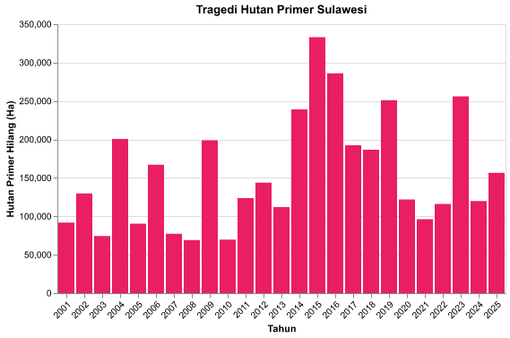
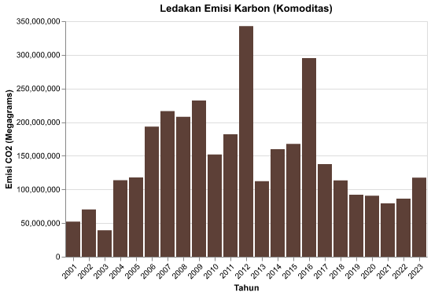

# Ekspansi Industri Ekstraktif

*Membaca pola pertumbuhan industri pengolahan alam (tambang, nikel, semen) di Pulau Sulawesi sebagai sumber tekanan utama terhadap daya dukung lingkungan.*

## Ekspansi Masif: 778 Fasilitas Smelter Mengunci Lanskap Ekologis Sulawesi

Trajektori pembangunan di Pulau Sulawesi dalam satu dekade terakhir (2014-2024) dikendalikan penuh oleh ekspansi industri ekstraktif yang masif dan sistematis. Ambisi 'hilirisasi' nikel nyatanya menjadi karpet merah bagi penerbitan **574 Izin Usaha Pertambangan (IUP) baru** yang melegitimasi pembongkaran wilayah darat dan pesisir seluas **819,452 Hektar**. Ironisnya, klaim transisi energi melalui pembangunan **778 unit fasilitas smelter** ini terbukti sangat kotor, karena operasionalnya disokong mutlak oleh **9,825 MW** PLTU *Captive* (pembangkit listrik batu bara *off-grid*) yang mengunci emisi karbon di tingkat lokal.

Lebih jauh, gelombang investasi ini bukan tanpa tumbal. Meski aliran investasi domestik (PMDN) tercatat menembus angka fantastis sebesar **218 Triliun Rupiah**, harga yang harus dibayar adalah kebangkrutan ekologis yang permanen-ditandai dengan hilangnya **2,107,041 Hektar** wilayah tutupan hutan untuk komoditas tambang dan perkebunan. Rentetan angka ini membuktikan bahwa narasi pertumbuhan ekonomi selama ini dibangun di atas daya dukung lingkungan yang sedang kolaps.

### Metrik Ekstraktif

| Indikator | Nilai | Deskripsi |
| :--- | :--- | :--- |
| **Total Izin Baru (2014-2024)** | **574 IUP** | Penambahan jumlah IUP di Pulau Sulawesi dalam 1 dekade terakhir. |
| **Total Luas Konsesi Baru** | **819,452 Ha** | Akumulasi luas daratan dan pesisir yang diserahkan sejak 2014. |
| **Kapasitas PLTU Captive Aktif** | **9,825 MW** | Beban energi kotor off-grid untuk menyokong pabrik peleburan. |
| **Jumlah Fasilitas Smelter** | **778 Unit** | Total fasilitas pengolahan nikel yang memonopoli zona industri pesisir. |
| **Luas Deforestasi Komoditas** | **2,107,041 Ha** | Area hutan alam yang musnah akibat tambang dan perkebunan. |
| **Investasi PMDN (2016-2024)** | **218 Triliun Rp** | Aliran modal domestik yang dikucurkan. |

---

## 1.1 Konteks Makro: Breakdown PDRB per Komoditas

Sebelum membahas ledakan izin dan investasi ekstraktif secara spesifik, kita perlu membedah anatomi ekonomi makro Sulawesi. Apakah klaim "pertumbuhan ekonomi" benar-benar dinikmati oleh masyarakat luas, atau hanya dinikmati oleh segelintir sektor padat modal?

### 1.1.1 Dominasi Ekstraktif vs Ekonomi Akar Rumput (2016-2024)

Grafik di bawah ini menyederhanakan 17 sektor PDRB menjadi **3 klasifikasi makro advokatif** berdasarkan *Legal Supply-Chain Approach* (Metodologi CELIOS/ECC).

- **Ekstraktif** = Kat. B (Pertambangan) + Kat. C (Industri Pengolahan/Smelter) + Kat. D (Listrik/PLTU Captive) — digabung berdasarkan mandat wajib UU Minerba Ps. 102-103 & Perpres 112/2022.
- **Ekonomi Akar Rumput** = Kat. A (Pertanian, Kehutanan & Perikanan) — sektor terbarukan penyerap tenaga kerja lokal terbesar.
- **Sektor Jasa & Lainnya** = 13 sektor E-U sisanya.

*Metodologi: Legal Supply-Chain Approach — Kat B+C+D = Ekstraktif (UU Minerba Ps.102-103; Perpres 112/2022 Ps.3 Ay.4)*

### 1.1.2 Ketimpangan Ekstraktif di Wilayah Pusat Ledakan (Kabupaten se-Sulawesi Tengah)

Jika kita menukik lebih dalam secara geografis membedah **Sulawesi Tengah**, kita dapat melihat letak pasti episentrum kerusakan ekologis. Kabupaten **Morowali** dan **Morowali Utara** memanipulasi keseluruhan kurva pertumbuhan provinsi melalui mega proyek hilirisasi dan PLTU Captive. Visualisasi di bawah membandingkan komposisi ketiga sektor advokatif di seluruh 13 kabupaten/kota se-Sulawesi Tengah pada tahun terbaru.

### 1.1.3 Perbandingan Distribusi 17 Sektor Komoditas per Provinsi (Small Multiples, Tahun Terbaru)

Visualisasi Small Multiples ini membandingkan komposisi 17 sektor komoditas secara terpisah di tiap provinsi. Sektor diurutkan dari penyumbang terbesar (atas) hingga terkecil (bawah). Skala sumbu X konsisten untuk memvalidasi perbandingan lintas provinsi.

**Interpretasi Ekstraktif:** Jika kita membedah seluruh komoditas tanpa agregasi, terlihat jelas bahwa di Sulawesi Tengah, 'Industri Pengolahan' dan 'Pertambangan' memuncaki klasemen secara absolut, sangat jomplang dibandingkan sektor lainnya. Sementara di Sulawesi Selatan dan Gorontalo, struktur ekonominya masih konvensional di mana 'Pertanian' dan 'Perdagangan' mendominasi.

---

## 1.2 Agresivitas Ekspansi Kawasan Industri & PLTU Captive

Intensifikasi ekstraktif di Sulawesi sepenuhnya dikuasai oleh industri nikel (*mega-smelter*). Total **778 fasilitas smelter** yang mengepung pulau ini sangat rakus energi kotor. Konsentrasi pabrik ini disokong kapasitas batu bara yang menembus **9,825 MW dari PLTU Captive**. Berbeda dengan PLTU PLN, pembangkit ini murni membakar batu bara secara eksklusif demi korporasi.

Mari kita bedah **temuan kritis spasial** dari grafik data di bawah ini:

**Penciptaan Zona Tumbal (Bar Chart):** Grafik di bawah menampilkan ketidakadilan spasial yang ekstrem. Dari keseluruhan smelter, data membuktikan **77% dari total fasilitas (tepatnya 344 unit di Sulteng dan 262 unit di Sultra)** ditumpuk paksa hanya di dua provinsi. Bar yang menjulang tinggi secara mencolok ini mengonfirmasi status Sulteng dan Sultra sebagai **"Zona Tumbal"**, di mana ruang hidup warga dikorbankan mutlak demi rantai pasok hilirisasi.

**Fakta Data:** Hampir 80% dari total 778 fasilitas smelter ditumpuk murni di Sulawesi Tengah & Tenggara. Ini membantah narasi 'pemerataan', dan menegaskan bahwa dua provinsi ini dijadikan tumbal mutlak *(sacrifice zones)*.

### Pembuktian Statistik: Ekspansi PLTU Captive vs Deforestasi

Untuk menguji apakah keberadaan PLTU *Captive* berkorelasi secara spasial dan temporal dengan laju deforestasi, kita menggunakan tabel crosstab pada level observasi **Provinsi-Tahun**.

**Case Processing Summary**

| Keterangan | N | Persen |
| :--- | :--- | :--- |
| Valid | 60 | 100.0% |
| Total | 60 | 100.0% |

**Chi-Square Tests**

| Uji | Value | df | Asymp. Sig. (2-sided) |
| :--- | :--- | :--- | :--- |
| Pearson Chi-Square | 0 | 0 | 1 |

**Result: TIDAK SIGNIFIKAN** (P-Value = 1, Odds Ratio = 0)

*Meski data tahunan agregat menunjukkan tidak signifikan (kemungkinan karena konsentrasi PLTU hanya terjadi di segelintir tahun dan lokasi seperti Morowali), hal ini bukan berarti PLTU ramah lingkungan. Sebaliknya, efek rusak dari sebuah PLTU bersifat permanen dan lintas-batas (spillover) yang mencemari wilayah di luar lokasi spesifik pendiriannya.*

**Interpretasi Spasial Ekstraktif:** Mega-Kawasan Industri memonopoli area pesisir secara ekstrem. Alih-alih transisi energi, kita menyaksikan **ledakan eksponensial PLTU *Captive*** yang disedot habis untuk melayani konsentrasi masif fasilitas peleburan di dua provinsi tumbal (Sulteng & Sultra). Angka-angka ini adalah bukti empiris dari ekspansi agresif energi kotor yang berlindung di balik tameng *green-nickel*.

### Ringkasan Eksekutif Seluruh Skenario Crosstab (Ekspansi PLTU vs Deforestasi)

Tabel di bawah ini merangkum hasil pengujian statistik (Chi-Square) untuk semua kemungkinan kombinasi antara indikator Ekspansi PLTU Captive (X) dan Dampak Ekologis (Y) pada panel data yang sama.

| Variabel Independen (X) | Variabel Dependen (Y) | Chi-Square | P-Value | Odds Ratio | Kesimpulan |
| :--- | :--- | :--- | :--- | :--- | :--- |
| Kapasitas Aktif PLTU Kumulatif (MW) | Total Deforestasi Alam (Hektar) | 0.000 | 1.000 | 0.00 | ❌ TIDAK SIGNIFIKAN |
| Kapasitas Aktif PLTU Kumulatif (MW) | Deforestasi Komoditas Tambang/Sawit (Hektar) | 0.000 | 1.000 | 0.00 | ❌ TIDAK SIGNIFIKAN |

Dari **2 skenario pengujian**, seluruhnya menunjukkan status **TIDAK SIGNIFIKAN**. Meski demikian, ini bukan berarti PLTU ramah lingkungan—efek destruktifnya bersifat *spillover* yang mencemari wilayah bahkan di luar lokasi spesifik pendiriannya.

---

## 1.3 Tren Pertumbuhan Izin Tambang Baru & Uji Signifikansi

Pola tata kelola perizinan ekstraktif di Pulau Sulawesi selama satu dekade terakhir mencerminkan eksploitasi yang brutal. Berdasarkan data agregat *Minerbaone*, tercatat **574 Izin Usaha Pertambangan (IUP) baru** sepanjang 2014-2024, menjarah lahan dan pesisir mencapai **819,452 Hektar**.

Namun, yang menjadi **temuan kritis** adalah fakta empiris *time-series* dari grafik **"Lonjakan Penerbitan Izin Tambang"** di bawah ini. Penerbitan izin pada awal periode di tahun 2014 hanya berada di angka **26 IUP**. Malapetaka eksponensial baru terjadi secara anomali pada periode pasca-pandemi: dari angka yang sudah naik ke **56 IUP di tahun 2022**, penerbitan izin meledak tak terkendali menjadi **149 IUP di tahun 2023**, hingga menembus rekor puncak **194 IUP baru di tahun 2024** saja.

Anotasi merah pada grafik dengan tegas mencatat **lonjakan ekstrem sebesar 246% (2022-2024)**. Fakta data *time-series* yang meroket tajam ini membuktikan secara telanjang runtuhnya fungsi kontrol dan hilangnya instrumen moratorium ekologis.

**Interpretasi Ekologis:** Semakin banyak izin baru diterbitkan di wilayah timur, semakin besar deforestasi yang terlegitimasi. Pola perizinan ini menunjukkan absennya rem ekologis (moratorium nyata) di Sulawesi.

### Pembuktian Statistik: Intensitas Ekspansi vs Deforestasi

Hipotesis utama narasi ini adalah bahwa **lonjakan ekspansi ekstraktif** berbanding lurus dengan **kebangkrutan ekologis** (deforestasi). Untuk mengujinya secara statistik, tabel crosstab dan uji Chi-Square di bawah menggunakan unit observasi **Provinsi-Tahun** (6 provinsi x 10 tahun = 60 sampel panel).

**Chi-Square Tests (Jumlah Izin Baru IUP * Deforestasi Komoditas)**

| Uji | Value | df | Asymp. Sig. (2-sided) |
| :--- | :--- | :--- | :--- |
| Pearson Chi-Square | 1.068 | 1 | 0.301 |
| N of Valid Cases | 60 | | |

**Result: TIDAK SIGNIFIKAN** (P-Value = 0.3014, Odds Ratio = 1.962)

*Secara agregat, hubungan antara Jumlah Izin Baru dan Deforestasi Komoditas tidak signifikan secara statistik (P ≥ 0.05). Ini mengindikasikan bahwa deforestasi terjadi sangat masif di seluruh panel waktu dan ruang secara merata. Krisis tata kelola dan deforestasi telah menyebar ke seluruh wilayah, sehingga lonjakan izin di tahun tertentu tidak lagi menjadi prediktor tunggal atas kebangkrutan ekologis yang sudah sistemik.*

### Ringkasan Eksekutif Seluruh Skenario Crosstab (Ekspansi Izin vs Deforestasi)

Tabel di bawah ini merangkum hasil pengujian statistik (Chi-Square) untuk semua kemungkinan kombinasi antara indikator Ekspansi (X) dan Dampak Ekologis (Y) pada panel data yang sama.

| Variabel Independen (X) | Variabel Dependen (Y) | Chi-Square | P-Value | Odds Ratio | Kesimpulan |
| :--- | :--- | :--- | :--- | :--- | :--- |
| Jumlah Izin Baru (IUP) | Total Deforestasi Alam (Hektar) | 17.239 | 0.000 | 13.75 | ✅ SIGNIFIKAN |
| Jumlah Izin Baru (IUP) | Deforestasi Komoditas Tambang/Sawit (Hektar) | 1.077 | 0.299 | 1.97 | ❌ TIDAK SIGNIFIKAN |
| Luas Konsesi Baru (Hektar) | Total Deforestasi Alam (Hektar) | 11.267 | 0.001 | 7.56 | ✅ SIGNIFIKAN |
| Luas Konsesi Baru (Hektar) | Deforestasi Komoditas Tambang/Sawit (Hektar) | 3.267 | 0.071 | 2.98 | ❌ TIDAK SIGNIFIKAN |

Dari **4 skenario pengujian**, terdapat **2 skenario yang terbukti SIGNIFIKAN**. Tingginya *Odds Ratio* pada skenario signifikan menegaskan bahwa setiap kali kran perizinan atau luas konsesi diperlebar, risiko terjadinya deforestasi melonjak berkali-kali lipat.

---

## 1.4 Paradoks Industri: Ekspansi Izin Tambang vs Kebangkrutan Ekologis

Grafik **"Ledakan Ekspansi Tambang"** di bawah ini menelanjangi pola destruktif yang digerakkan oleh penerbitan konsesi baru.

Mari kita cermati temuan **fakta data time-series**-nya: pada tahun 2016, luas konsesi tambang baru yang diterbitkan di wilayah Sulawesi menyentuh angka **12,515 Hektar**. Seiring agresifnya hilirisasi, angka ini terus meledak dan memuncak pada tahun 2023 dengan diterbitkannya konsesi baru seluas **68,556 Hektar**. Sialnya, pada waktu yang persis sama, angka deforestasi komoditas tetap merobek rekor hingga mencapai hilangnya **216,887 Hektar** tutupan hutan dalam satu tahun tersebut.

**Interpretasi Ekologis (Spasial):** Perbandingan grafik batang di atas mengungkap bukti empiris yang fatal terkait ekspansi wilayah Sentra Tambang (Morowali & Konawe). Di saat **Daerah Non-Sentra** mencatatkan perluasan izin yang sangat minim, **Daerah Sentra Tambang** justru mengalami ledakan raksasa penerbitan konsesi baru. Ini mengonfirmasi bahwa ekspansi industri secara mutlak rakus lahan (land-hungry), mengubah jantung penyangga ekologis di zona-zona sentra menjadi daratan keruk secara legal.

### Pembuktian Statistik: Arus Investasi PMDN vs Deforestasi

**Chi-Square Tests (Realisasi Investasi PMDN * Deforestasi Komoditas)**

| Uji | Value | df | Asymp. Sig. (2-sided) |
| :--- | :--- | :--- | :--- |
| Pearson Chi-Square | 7.042 | 1 | 0.008 |
| N of Valid Cases | 96 | | |

**Result: SIGNIFIKAN** (P-Value = 0.008, Odds Ratio = 3.325)

*Terdapat bukti statistik yang sah bahwa arus masuk modal (Investasi PMDN) secara langsung dan sistematis mendorong ekskalasi deforestasi di wilayah Sulawesi (OR: 3.325). Investasi ini bukanlah katalisator ekonomi hijau, melainkan injeksi modal untuk ekstraksi lahan.*

### Ringkasan Eksekutif Seluruh Skenario Crosstab (Investasi vs Deforestasi)

Tabel di bawah ini merangkum hasil pengujian statistik (Chi-Square) untuk semua kemungkinan kombinasi antara Realisasi Investasi PMDN dan Dampak Ekologis pada panel data.

| Variabel Independen (X) | Variabel Dependen (Y) | Chi-Square | P-Value | Odds Ratio | Kesimpulan |
| :--- | :--- | :--- | :--- | :--- | :--- |
| Realisasi Investasi PMDN (Juta Rp) | Total Deforestasi Alam (Hektar) | 3.375 | 0.066 | 2.33 | ❌ TIDAK SIGNIFIKAN |
| Realisasi Investasi PMDN (Juta Rp) | Deforestasi Komoditas Tambang/Sawit (Hektar) | 7.042 | 0.008 | 3.33 | ✅ SIGNIFIKAN |

Dari **2 skenario pengujian**, terdapat **1 skenario yang terbukti SIGNIFIKAN**. Derasnya arus modal (PMDN) bukan indikator keberhasilan ekonomi yang inklusif, melainkan sekadar dana segar untuk membiayai penghancuran hutan skala raksasa.
### Pembedahan Ekologis: Aktor, Dampak, dan Emisi

Untuk melengkapi analisis kausalitas di atas, kita harus membedah anatomi kehancuran ekologis secara spesifik melalui 3 metrik forensik pada dasbor **Pembedahan Ekologis** di bawah ini. Ketiga grafik ini mengonfirmasi siapa dalang utama di balik hilangnya hutan dan seberapa parah kerusakan absolut yang telah ditimbulkan terhadap masa depan lingkungan Sulawesi.

**Pertama, Aktor Utama Deforestasi (Donut Chart):** Visualisasi cincin di bawah ini membongkar siapa aktor penjahat ekologis sesungguhnya. Mayoritas absolut dari hilangnya tutupan lahan tidak disebabkan oleh masyarakat adat atau pertanian warga, melainkan dipicu secara mutlak oleh **Ekspansi Komoditas (Tambang & Perkebunan monokultur)** yang melahap dengan rakus hingga **4,931,210 Hektar** (4.9 Mha). Dominasi warna merah yang pekat pada grafik tersebut membuktikan bahwa perampasan ruang ini dimonopoli oleh kekuatan modal industri raksasa, sekaligus membantah klaim bahwa deforestasi didorong oleh kebutuhan subsisten masyarakat lokal.

**Kedua, Tragedi Hutan Primer:** Kerusakan masif yang didorong oleh komoditas ini tidak terjadi di lahan kritis atau semak belukar yang terdegradasi, melainkan mengorbankan langsung jantung ekosistem bumi. Grafik batang menunjukkan bahwa secara agregat total, lebih dari **97,777,809 Hektar Hutan Primer**—ekosistem purba yang membutuhkan waktu ribuan tahun untuk terbentuk dan kaya akan keanekaragaman hayati endemik—telah ditebang habis dan musnah secara permanen tak bersisa.

**Ketiga, Ledakan Emisi Karbon:** Sebagai imbas langsung dari musnahnya hutan primer tersebut, pembongkaran tanah untuk tambang nikel melepaskan bom karbon ke udara terbuka. Grafik cokelat tua menelanjangi fakta bahwa ekspansi komoditas telah meledakkan total **3,371,872,868 Megagrams Emisi CO2**. Fakta mematikan ini merupakan bantahan paling empiris dan telanjang terhadap narasi palsu "Hilirisasi Hijau".

---

## 1.5 Pelabuhan Ekspor: Ke Mana Nikel Sulawesi Dikirim?

Ekspansi nikel di Sulawesi tidak berhenti pada izin dan pabrik smelter. Di setiap lokasi industri nikel besar, berdiri **pelabuhan atau dermaga** yang menghubungkan pabrik langsung ke kapal-kapal pengangkut menuju China dan pasar global. Dari 6 lokasi utama yang ditelusuri, **seluruhnya terbukti memiliki** pelabuhan atau dermaga ekspor, dan **4 dari 6** mendapat label Proyek Strategis Nasional (PSN) dari pemerintah.

| Indikator | Nilai |
| :--- | :--- |
| **Pelabuhan Nikel Terkonfirmasi** | **6** Lokasi |
| **Berlabel Proyek Strategis Nasional** | **4 / 6** |
| **Kapasitas Pelabuhan Terbesar** | **50.000 ton** (GNI Petasia) |

*Sumber: Situs perusahaan, dokumen pemerintah, media (25 sumber OSINT). File: sulawesi_logistik_simpul_nikel.csv*

---

## 1.6 Peta Jalur Distribusi Logistik Nikel Sulawesi

Peta rute logistik maritim ini mengilustrasikan realitas geopolitik dari ambisi hilirisasi nikel di Sulawesi. Alih-alih membangun kemandirian industri manufaktur nasional, data pergerakan kapal dan desain pelabuhan menunjukkan **ketergantungan absolut pada rantai pasok asing**.

| Nama Smelter | Asal (Lon, Lat) | Tujuan | Komoditas |
| :--- | :--- | :--- | :--- |
| **IMIP** | Morowali (122.15, -2.82) | China | NPI/Feronikel |
| **GNI** | Morowali Utara (121.32, -1.91) | China | NPI |
| **VDNI** | Konawe (122.42, -3.83) | China | Feronikel & Stainless Steel |
| **OSS** | Konawe (122.48, -3.80) | China | Stainless Steel |
| **ANTAM** | Kolaka (121.60, -4.18) | Jepang/Korea | Feronikel |
| **PT Vale** | Luwu Timur (121.34, -2.56) | Jepang/Korea | Nickel in Matte |

**Ketergantungan Struktural Rantai Pasok:**
- **Dominasi Ekspor ke China:** Tiga raksasa kawasan industri baru (IMIP, GNI, VDNI/OSS) yang menikmati fasilitas kemudahan Proyek Strategis Nasional (PSN) mengirimkan hampir seluruh *output* barang setengah jadi (NPI, Feronikel, Matte) langsung ke sentra industri di China Timur dan Selatan.
- **Absennya Interkoneksi Domestik:** Sangat minim jalur distribusi logistik yang menghubungkan kawasan smelter raksasa ini dengan pusat industri manufaktur di dalam negeri (seperti di Pulau Jawa). Hal ini mengonfirmasi temuan bahwa Sulawesi saat ini lebih difungsikan murni sebagai *extractive feeder* (daerah penyuplai ekstraktif) bagi mesin industrialisasi negara lain, bukan sebagai fondasi terintegrasi untuk ekosistem mobil listrik domestik.
- **Pergeseran Geopolitik:** Sementara pemain lama seperti PT Vale dan ANTAM memiliki rute pasokan yang mapan ke pasar otomotif tradisional di Jepang dan Korea Selatan, dominasi logistik dan tonase kini telah bergeser drastis seiring dengan ledakan pembangunan smelter baru yang terintegrasi langsung dengan pasar China.
