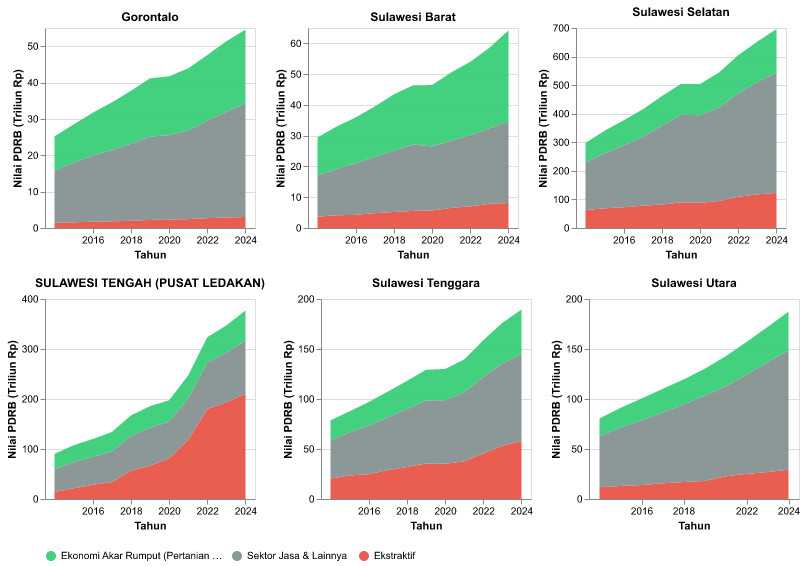
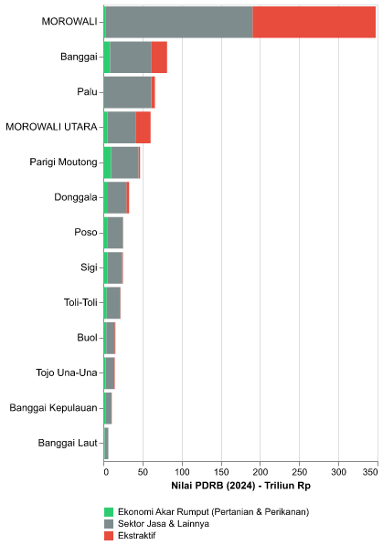
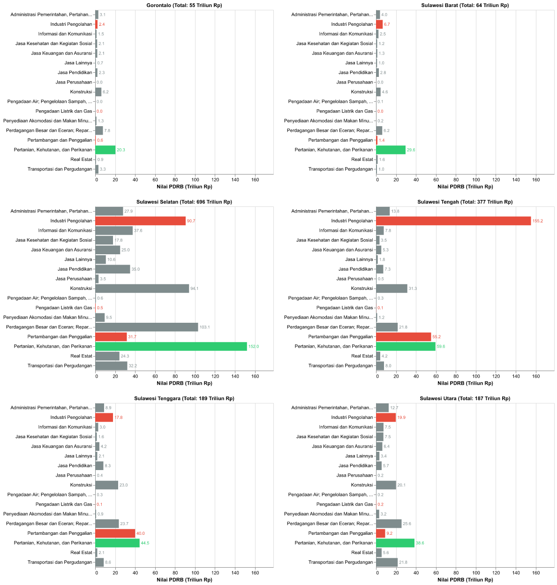
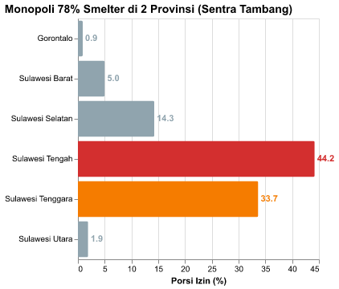
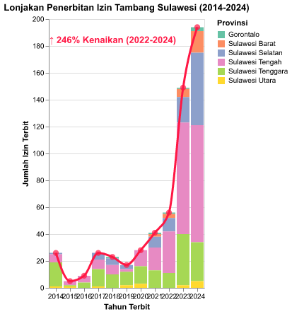
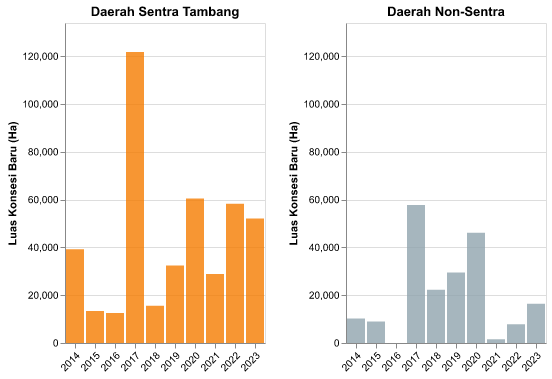
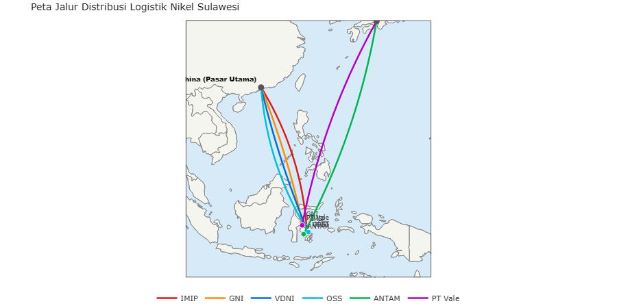

# Ekspansi Industri Ekstraktif

*Analisis spasiotemporal pertumbuhan industri ekstraktif dan pengolahan nikel serta dampaknya terhadap daya dukung dan daya tampung lingkungan di Pulau Sulawesi.*

## Ekspansi Industri Ekstraktif: 778 Unit Smelter dan Ketergantungan Energi Fosil Off-Grid di Sulawesi

Dinamika pembangunan di Pulau Sulawesi periode 2014–2024 ditandai oleh akselerasi industri berbasis komoditas alam. Kebijakan hilirisasi nikel mendorong penerbitan **574 Izin Usaha Pertambangan (IUP) baru** dengan total luas konsesi mencapai **819,452 Hektar**. Pengoperasian **778 unit fasilitas pemurnian (smelter)** didukung oleh kapasitas **9,825 MW PLTU Captive** (pembangkit listrik batu bara *off-grid*), yang meningkatkan intensitas emisi karbon pada zona-zona industri pesisir.

Secara bersamaan, kucuran realisasi Penanaman Modal Dalam Negeri (PMDN) yang mencapai **218 Triliun Rupiah** berbanding lurus dengan akumulasi konversi tutupan hutan sebesar **2,107,041 Hektar** untuk aktivitas pertambangan dan perkebunan. Data ini mengindikasikan bahwa pertumbuhan indikator makroekonomi berjalan seiring dengan peningkatan beban terhadap daya dukung dan daya tampung lingkungan hidup.

### Metrik Ekstraktif

| Indikator | Nilai | Deskripsi |
| :--- | :--- | :--- |
| **Total Izin Baru (2014-2024)** | **574 IUP** | Penambahan jumlah IUP di Pulau Sulawesi dalam 1 dekade terakhir. |
| **Total Luas Konsesi Baru** | **819,452 Ha** | Akumulasi luas daratan dan pesisir yang diserahkan sejak 2014. |
| **Kapasitas PLTU Captive Aktif** | **9,825 MW** | Beban energi kotor off-grid untuk menyokong pabrik peleburan. |
| **Jumlah Fasilitas Smelter** | **778 Unit** | Total fasilitas pengolahan nikel yang memonopoli zona industri pesisir. |
| **Luas Deforestasi Komoditas** | **2,107,041 Ha** | Area hutan alam yang musnah akibat tambang dan perkebunan. |
| **Investasi PMDN (2016-2024)** | **218 Triliun Rp** | Aliran modal domestik yang dikucurkan. |

---

## 1.1 Konteks Makro: Breakdown PDRB per Komoditas

Grafik di bawah ini menyederhanakan 17 sektor PDRB menjadi **3 klasifikasi makro advokatif** berdasarkan *Legal Supply-Chain Approach* (Metodologi CELIOS/ECC).

### 1.1.1 Dominasi Ekstraktif vs Ekonomi Akar Rumput (2016-2024)

Grafik di bawah ini menyederhanakan 17 sektor PDRB menjadi **3 klasifikasi makro advokatif** berdasarkan *Legal Supply-Chain Approach* (Metodologi CELIOS/ECC).

- **Ekstraktif** = Kat. B (Pertambangan) + Kat. C (Industri Pengolahan/Smelter) + Kat. D (Listrik/PLTU Captive) — digabung berdasarkan mandat wajib UU Minerba Ps. 102-103 & Perpres 112/2022.
- **Ekonomi Akar Rumput** = Kat. A (Pertanian, Kehutanan & Perikanan) — sektor terbarukan penyerap tenaga kerja lokal terbesar.
- **Sektor Jasa & Lainnya** = 13 sektor E-U sisanya.

*Metodologi: Legal Supply-Chain Approach — Kat B+C+D = Ekstraktif (UU Minerba Ps.102-103; Perpres 112/2022 Ps.3 Ay.4)*

### 1.1.2 Pemusatan Sektor Ekstraktif di Kabupaten se-Sulawesi Tengah

Visualisasi di bawah membandingkan komposisi ketiga sektor advokatif di seluruh 13 kabupaten/kota se-Sulawesi Tengah pada tahun terbaru.

### 1.1.3 Perbandingan Distribusi 17 Sektor Komoditas per Provinsi (Small Multiples, Tahun Terbaru)

Visualisasi Small Multiples ini membandingkan komposisi 17 sektor komoditas secara terpisah di tiap provinsi. Sektor diurutkan dari penyumbang terbesar (atas) hingga terkecil (bawah). Skala sumbu X konsisten untuk memvalidasi perbandingan lintas provinsi.

---

## 1.2 Konsentrasi Kawasan Industri & PLTU Captive

Intensifikasi industri pengolahan nikel di Sulawesi berpusat pada fasilitas mega-smelter. Pengoperasian **778 fasilitas smelter** didukung oleh kapasitas energi batu bara **9,825 MW dari PLTU Captive**. Berbeda dengan sistem kelistrikan umum PLN, pembangkit ini dikembangkan secara internal untuk menyokong operasi kawasan industri.

Berikut adalah **temuan konsentrasi spasial** berdasarkan data agregat:

**Pemusatan Spasial Fasilitas Smelter (Bar Chart):** Data menunjukkan bahwa **77% dari total fasilitas (344 unit di Sulawesi Tengah dan 262 unit di Sulawesi Tenggara)** terkonsentrasi di dua provinsi tersebut. Pola ini mengonfirmasi adanya pemusatan beban ekologis dan emisi pada zona sentra pemurnian nikel.

Korelasi antara pembangunan kawasan industri dan perubahan tutupan lahan diuji menggunakan **Crosstabulation (Tabulasi Silang)** pada bagian bawah sub-bab ini.

**Fakta Data:** Sebesar 78% dari total 778 fasilitas smelter terkonsentrasi di Sulawesi Tengah & Sulawesi Tenggara, menunjukkan adanya pemusatan beban lingkungan di wilayah sentra tersebut.

### Pembuktian Statistik: Ekspansi PLTU Captive vs Deforestasi

Untuk menguji apakah keberadaan PLTU *Captive* berkorelasi secara spasial dan temporal dengan laju deforestasi, kita menggunakan tabel crosstab pada level observasi **Provinsi-Tahun**.
Mengingat ekspansi PLTU sangat terpusat pada tahun dan provinsi tertentu (menghasilkan banyak nilai nol pada panel), klasifikasi "Tinggi" diartikan sebagai *ada penambahan kapasitas (>0)*, dan "Rendah" sebagai *tidak ada penambahan (=0)*.

**Case Processing Summary**

| Keterangan | N | Persen |
| :--- | :--- | :--- |
| Valid | 60 | 100.0% |
| Total | 60 | 100.0% |

**Chi-Square Tests**

| Uji | Value | df | Asymp. Sig. (2-sided) |
| :--- | :--- | :--- | :--- |
| Pearson Chi-Square | 0 | 0 | 1 |

**Result: TIDAK SIGNIFIKAN** (P-Value = 1, Odds Ratio = 0)

*Meski data tahunan agregat menunjukkan tidak signifikan (kemungkinan karena konsentrasi PLTU hanya terjadi di segelintir tahun dan lokasi seperti Morowali), hal ini bukan berarti PLTU ramah lingkungan. Sebaliknya, efek rusak dari sebuah PLTU bersifat permanen dan lintas-batas (spillover) yang mencemari wilayah di luar lokasi spesifik pendiriannya.*

**Interpretasi Spasial Industri:** Kawasan industri pengolahan terkonsentrasi di area pesisir secara signifikan. Pertumbuhan PLTU Captive mengindikasikan tingginya ketergantungan pada energi berbasis batu bara untuk mendukung kebutuhan energi fasilitas pemurnian di Sulawesi Tengah dan Sulawesi Tenggara.

### Ringkasan Eksekutif Seluruh Skenario Crosstab

Tabel di bawah ini merangkum hasil pengujian statistik (Chi-Square) untuk semua kemungkinan kombinasi indikator antara penambahan PLTU Captive dan Dampak Ekologis pada panel data 1 dekade.

| Variabel Independen (X) | Variabel Dependen (Y) | Chi-Square | P-Value | Odds Ratio | Kesimpulan |
| :--- | :--- | :--- | :--- | :--- | :--- |
| Kapasitas Aktif PLTU Kumulatif (MW) | Total Deforestasi Alam (Hektar) | 0.000 | 1.000 | 0.00 | ❌ TIDAK SIGNIFIKAN |
| Kapasitas Aktif PLTU Kumulatif (MW) | Deforestasi Komoditas Tambang/Sawit (Hektar) | 0.000 | 1.000 | 0.00 | ❌ TIDAK SIGNIFIKAN |

Dari **2 skenario pengujian**, seluruhnya menunjukkan status **TIDAK SIGNIFIKAN**. Meski demikian, ini bukan berarti PLTU ramah lingkungan—efek destruktifnya bersifat *spillover* yang mencemari wilayah bahkan di luar lokasi spesifik pendiriannya.

---

## 1.3 Tren Pertumbuhan Izin Tambang Baru & Uji Signifikansi

Pola perizinan pertambangan di Pulau Sulawesi selama satu dekade terakhir menunjukkan peningkatan alokasi ruang yang signifikan. Berdasarkan data agregat *Minerbaone*, tercatat **574 Izin Usaha Pertambangan (IUP) baru** sepanjang 2014-2024, dengan total luas konsesi mencapai **819,452 Hektar**.

Berdasarkan analisis tren time-series pada grafik **"Penerbitan Izin Tambang"** di bawah, penerbitan izin pada periode awal (2014) tercatat sebanyak **26 IUP**. Peningkatan signifikan terjadi pada periode 2022–2024, di mana penerbitan meningkat dari **56 IUP di tahun 2022** menjadi **149 IUP pada 2023**, dan mencapai **194 IUP baru pada 2024**.

Anotasi pada grafik mencatat kenaikan sebesar **246% pada periode 2022–2024**. Data ini mengindikasikan perlunya evaluasi terhadap instrumen pengendalian perizinan dan tata ruang. Distribusi perizinan tertinggi berada di Sulawesi Tengah dan Sulawesi Tenggara, yang selaras dengan kawasan pengembangan industri pemurnian nikel.

Uji **Crosstabulation** pada bagian bawah mengukur hubungan antara laju penerbitan perizinan dan indikator deforestasi di wilayah tersebut.

**Interpretasi Sektoral:** Peningkatan penerbitan IUP di kawasan timur Sulawesi berbanding lurus dengan perluasan area konversi hutan. Pola perizinan ini menunjukkan pentingnya penerapan instrumen tata ruang dan evaluasi lingkungan secara ketat.

### Pembuktian Statistik: Intensitas Ekspansi vs Deforestasi

Hipotesis utama narasi ini adalah bahwa **lonjakan ekspansi ekstraktif** berbanding lurus dengan **kebangkrutan ekologis** (deforestasi).
Untuk mengujinya secara statistik di tengah keterbatasan jumlah provinsi di Sulawesi (N=6), tabel crosstab dan uji Chi-Square di bawah menggunakan unit observasi **Provinsi-Tahun** (6 provinsi x 10 tahun = 60 sampel panel).
Setiap observasi diklasifikasikan menjadi "Tinggi" atau "Rendah" berdasarkan nilai **Median panel** dari indikator yang dipilih.

**Chi-Square Tests (Jumlah Izin Baru IUP * Deforestasi Komoditas)**

| Uji | Value | df | Asymp. Sig. (2-sided) |
| :--- | :--- | :--- | :--- |
| Pearson Chi-Square | 1.068 | 1 | 0.301 |
| N of Valid Cases | 60 | | |

**Result: TIDAK SIGNIFIKAN** (P-Value = 0.3014, Odds Ratio = 1.962)

*Secara agregat, hubungan antara Jumlah Izin Baru dan Deforestasi Komoditas tidak signifikan secara statistik (P ≥ 0.05). Ini mengindikasikan bahwa deforestasi terjadi sangat masif di seluruh panel waktu dan ruang secara merata. Krisis tata kelola dan deforestasi telah menyebar ke seluruh wilayah, sehingga lonjakan izin di tahun tertentu tidak lagi menjadi prediktor tunggal atas kebangkrutan ekologis yang sudah sistemik.*

### Ringkasan Eksekutif Seluruh Skenario Crosstab

Tabel di bawah ini merangkum hasil pengujian statistik (Chi-Square) untuk semua kemungkinan kombinasi antara indikator Ekspansi (X) dan Dampak Ekologis (Y) pada panel data yang sama.

| Variabel Independen (X) | Variabel Dependen (Y) | Chi-Square | P-Value | Odds Ratio | Kesimpulan |
| :--- | :--- | :--- | :--- | :--- | :--- |
| Jumlah Izin Baru (IUP) | Total Deforestasi Alam (Hektar) | 17.239 | 0.000 | 13.75 | ✅ SIGNIFIKAN |
| Jumlah Izin Baru (IUP) | Deforestasi Komoditas Tambang/Sawit (Hektar) | 1.077 | 0.299 | 1.97 | ❌ TIDAK SIGNIFIKAN |
| Luas Konsesi Baru (Hektar) | Total Deforestasi Alam (Hektar) | 11.267 | 0.001 | 7.56 | ✅ SIGNIFIKAN |
| Luas Konsesi Baru (Hektar) | Deforestasi Komoditas Tambang/Sawit (Hektar) | 3.267 | 0.071 | 2.98 | ❌ TIDAK SIGNIFIKAN |

Dari **4 skenario pengujian**, terdapat **2 skenario yang terbukti SIGNIFIKAN**. Tingginya *Odds Ratio* pada skenario signifikan menegaskan bahwa setiap kali kran perizinan atau luas konsesi diperlebar, risiko terjadinya deforestasi melonjak berkali-kali lipat.

---

## 1.4 Analisis Realisasi Investasi PMDN dan Dampak Terhadap Tutupan Hutan

Grafik di bawah ini memetakan dinamika penerbitan konsesi tambang baru dan dampaknya terhadap tutupan hutan. Pada tahun 2016, luas konsesi tambang baru yang diterbitkan di Sulawesi mencakup **12,515 Hektar**, dan meningkat signifikan hingga mencapai **68,556 Hektar** pada tahun 2023. Pada periode yang sama, angka deforestasi komoditas mencatatkan luasan sebesar **216,887 Hektar**.

Data ini mengindikasikan bahwa akselerasi penerbitan konsesi berbanding lurus dengan laju konversi hutan alam (akumulasi deforestasi sebesar **2,107,041 Hektar**). Hal ini menegaskan pentingnya pertimbangan daya dukung ekologis dalam setiap kebijakan alokasi konsesi pertambangan.

**Interpretasi Spasial:** Perbandingan grafik batang di atas menunjukkan bahwa tingkat alokasi konsesi di Daerah Sentra Tambang (Morowali & Konawe) jauh lebih tinggi dibanding wilayah non-sentra, yang berdampak langsung pada konsentrasi perubahan tutupan hutan.

### Pembuktian Statistik: Arus Investasi PMDN vs Deforestasi

**Chi-Square Tests (Realisasi Investasi PMDN * Deforestasi Komoditas)**

| Uji | Value | df | Asymp. Sig. (2-sided) |
| :--- | :--- | :--- | :--- |
| Pearson Chi-Square | 7.042 | 1 | 0.008 |
| N of Valid Cases | 96 | | |

**Result: SIGNIFIKAN** (P-Value = 0.008, Odds Ratio = 3.325)

*Terdapat bukti statistik yang sah bahwa arus masuk modal (Investasi PMDN) secara langsung dan sistematis mendorong ekskalasi deforestasi di wilayah Sulawesi (OR: 3.325). Investasi ini bukanlah katalisator ekonomi hijau, melainkan injeksi modal untuk ekstraksi lahan.*

### Ringkasan Eksekutif Seluruh Skenario Crosstab (Investasi vs Deforestasi)

Tabel di bawah ini merangkum hasil pengujian statistik (Chi-Square) untuk semua kemungkinan kombinasi antara Realisasi Investasi PMDN dan Dampak Ekologis pada panel data.

| Variabel Independen (X) | Variabel Dependen (Y) | Chi-Square | P-Value | Odds Ratio | Kesimpulan |
| :--- | :--- | :--- | :--- | :--- | :--- |
| Realisasi Investasi PMDN (Juta Rp) | Total Deforestasi Alam (Hektar) | 3.375 | 0.066 | 2.33 | ❌ TIDAK SIGNIFIKAN |
| Realisasi Investasi PMDN (Juta Rp) | Deforestasi Komoditas Tambang/Sawit (Hektar) | 7.042 | 0.008 | 3.33 | ✅ SIGNIFIKAN |

Dari **2 skenario pengujian**, terdapat **1 skenario yang terbukti SIGNIFIKAN**. Derasnya arus modal (PMDN) bukan indikator keberhasilan ekonomi yang inklusif, melainkan sekadar dana segar untuk membiayai penghancuran hutan skala raksasa.

---

## 1.5 Pelabuhan Ekspor: Ke Mana Nikel Sulawesi Dikirim?

Ekspansi nikel di Sulawesi tidak berhenti pada izin dan pabrik smelter. Di setiap lokasi industri nikel besar, berdiri **pelabuhan atau dermaga** yang menghubungkan pabrik langsung ke kapal-kapal pengangkut menuju China dan pasar global. Dari 6 lokasi utama yang ditelusuri, **seluruhnya terbukti memiliki** pelabuhan atau dermaga ekspor, dan **4 dari 6** mendapat label Proyek Strategis Nasional (PSN) dari pemerintah.

| Indikator | Nilai |
| :--- | :--- |
| **Pelabuhan Nikel Terkonfirmasi** | **6** Lokasi |
| **Berlabel Proyek Strategis Nasional** | **4 / 6** |
| **Kapasitas Pelabuhan Terbesar** | **50.000 ton** (GNI Petasia) |

*Sumber: Situs perusahaan, dokumen pemerintah, media (25 sumber OSINT). File: sulawesi_logistik_simpul_nikel.csv*

---

## 1.6 Peta Jalur Distribusi Logistik Nikel Sulawesi

Peta rute logistik maritim ini mengilustrasikan realitas geopolitik dari ambisi hilirisasi nikel di Sulawesi. Alih-alih membangun kemandirian industri manufaktur nasional, data pergerakan kapal dan desain pelabuhan menunjukkan **ketergantungan absolut pada rantai pasok asing**.

| Nama Smelter | Asal (Lon, Lat) | Tujuan | Komoditas |
| :--- | :--- | :--- | :--- |
| **IMIP** | Morowali (122.15, -2.82) | China | NPI/Feronikel |
| **GNI** | Morowali Utara (121.32, -1.91) | China | NPI |
| **VDNI** | Konawe (122.42, -3.83) | China | Feronikel & Stainless Steel |
| **OSS** | Konawe (122.48, -3.80) | China | Stainless Steel |
| **ANTAM** | Kolaka (121.60, -4.18) | Jepang/Korea | Feronikel |
| **PT Vale** | Luwu Timur (121.34, -2.56) | Jepang/Korea | Nickel in Matte |

**Ketergantungan Struktural Rantai Pasok:**
- **Dominasi Ekspor ke China:** Tiga raksasa kawasan industri baru (IMIP, GNI, VDNI/OSS) yang menikmati fasilitas kemudahan Proyek Strategis Nasional (PSN) mengirimkan hampir seluruh *output* barang setengah jadi (NPI, Feronikel, Matte) langsung ke sentra industri di China Timur dan Selatan.
- **Absennya Interkoneksi Domestik:** Sangat minim jalur distribusi logistik yang menghubungkan kawasan smelter raksasa ini dengan pusat industri manufaktur di dalam negeri (seperti di Pulau Jawa). Hal ini mengonfirmasi temuan bahwa Sulawesi saat ini lebih difungsikan murni sebagai *extractive feeder* (daerah penyuplai ekstraktif) bagi mesin industrialisasi negara lain, bukan sebagai fondasi terintegrasi untuk ekosistem mobil listrik domestik.
- **Pergeseran Geopolitik:** Sementara pemain lama seperti PT Vale dan ANTAM memiliki rute pasokan yang mapan ke pasar otomotif tradisional di Jepang dan Korea Selatan, dominasi logistik dan tonase kini telah bergeser drastis seiring dengan peningkatan signifikan pembangunan smelter baru yang terintegrasi langsung dengan pasar China.
