CELIOS - Center of Economic and Law Studies

Ekspansi Industri Ekstraktif

Analisis spasiotemporal pertumbuhan industri ekstraktif dan pengolahan nikel serta dampaknya terhadap daya dukung dan daya tampung lingkungan di Pulau Sulawesi.

**🔍 Metodologi**

    **Alur Kausalitas (Ekonomi Politik Ekologi):** `Kebijakan Hilirisasi` → `Ekskalasi Perizinan & Investasi` → `Konsentrasi Smelter & Pembangkit Captive` → `Tekanan Ekologis (Konversi Lahan)`
    
    Kebijakan hilirisasi mendorong akselerasi perizinan dan kucuran investasi yang terkonsentrasi pada industri pengolahan padat emisi, sehingga meningkatkan beban terhadap daya dukung dan daya tampung lingkungan secara signifikan.
    
    **Variabel Tekanan / Ekspansi (X):**
    *   **Izin Usaha Pertambangan Baru:** Total IUP yang diterbitkan dalam rentang 2014-2024 (Data Minerbaone Kementerian ESDM).
    *   **Pertumbuhan Fasilitas Smelter:** Kapasitas dan jumlah unit pengolahan terintegrasi (Database CGS & Kementerian ESDM).
    *   **Kapasitas PLTU Captive:** Beban energi batu bara *off-grid* untuk fasilitas smelter (Global Energy Monitor/GEM).
    *   **Investasi PMDN:** Aliran Penanaman Modal Dalam Negeri (Kementerian Investasi/BKPM).
    
    **Variabel Dampak Ekologis (Y):**
    *   **Deforestasi Komoditas:** Luas tutupan hutan yang dikonversi untuk operasi pertambangan dan perkebunan monokultur (Global Forest Watch/GFW).
    
    **Metode Pengolahan Data:**
    Pendekatan kuantitatif deskriptif menggunakan teknik **Crosstabulation (Tabulasi Silang)** dan **Trend Analysis (Analisis Tren Time-Series)**. Seluruh raw data diagregasi berdasarkan dimensi spasial (Provinsi) dan temporal (Tahun 2014-2024) untuk memetakan anomali, pola konsentrasi perizinan, serta laju eksploitasi ruang secara presisi.

    Ekspansi Industri Ekstraktif: 778 Unit Smelter dan Ketergantungan Energi Fosil Off-Grid di Sulawesi
    
        Dinamika pembangunan di Pulau Sulawesi periode 2014–2024 ditandai oleh akselerasi industri berbasis komoditas alam. Kebijakan hilirisasi nikel mendorong penerbitan 574 Izin Usaha Pertambangan (IUP) baru dengan total luas konsesi mencapai 819,452 Hektar. Pengoperasian 778 unit fasilitas pemurnian (smelter) didukung oleh kapasitas 9,825 MW PLTU Captive (pembangkit listrik batu bara off-grid), yang meningkatkan intensitas emisi karbon pada zona-zona industri pesisir.

        Secara bersamaan, kucuran realisasi Penanaman Modal Dalam Negeri (PMDN) yang mencapai 218 Triliun Rupiah berbanding lurus dengan akumulasi konversi tutupan hutan sebesar 2,107,041 Hektar untuk aktivitas pertambangan dan perkebunan. Data ini mengindikasikan bahwa pertumbuhan indikator makroekonomi berjalan seiring dengan peningkatan beban terhadap daya dukung dan daya tampung lingkungan hidup.

            Total Izin Baru (2014-2024)
            574 IUP
            Penambahan jumlah Izin Usaha Pertambangan (IUP) di Pulau Sulawesi dalam rentang satu dekade terakhir.
        
        Sumber: Kementerian ESDM (Minerbaone)File: sulawesi_izin_baru_per_tahun.csv

            Total Luas Konsesi Baru
            819,452 Ha
            Akumulasi luas daratan dan perairan pesisir yang dialokasikan untuk konsesi pertambangan sejak 2014.
        
        Sumber: Kementerian ESDM (Minerbaone)File: sulawesi_izin_baru_per_tahun.csv

            Kapasitas PLTU Captive Aktif
            9,825 MW
            Kapasitas pembangkit listrik batu bara off-grid yang beroperasi khusus menyokong fasilitas pemurnian nikel.
        
        Sumber: Global Energy Monitor (GEM)File: sulawesi_pltu_captive.csv

            Jumlah Fasilitas Smelter
            778 Unit
            Total fasilitas pengolahan & pemurnian nikel yang terkonsentrasi di kawasan industri pesisir seperti Morowali dan Konawe.
        
        Sumber: Database Smelter ESDM & CGSFile: sulawesi_esdm_nikel.csv

            Luas Deforestasi Komoditas
            2,107,041 Ha
            Luas tutupan hutan alam yang dikonversi akibat aktivitas industri pertambangan dan perkebunan monokultur.
        
        Sumber: Global Forest Watch (GFW)File: sulawesi_gfw_master_1_dekade_2014_2023.csv

            Investasi PMDN (2016-2024)
            218 Triliun Rp
            Realisasi investasi modal dalam negeri yang mengindikasikan tingginya intensitas kapital pada sektor industri ekstraktif.
        
        Sumber: Kementerian Investasi / BKPMFile: sulawesi_investasi_pmdn_2016_2024.csv

---

### 1.1 Konteks Makro: Breakdown PDRB per Komoditas

Sebelum membahas ledakan izin dan investasi ekstraktif secara spesifik, kita perlu membedah anatomi ekonomi makro Sulawesi. 
Apakah klaim "pertumbuhan ekonomi" benar-benar dinikmati oleh masyarakat luas, atau hanya dinikmati oleh segelintir sektor padat modal?

#### 1.1.1 Dominasi Ekstraktif vs Ekonomi Akar Rumput (2016-2024)

Grafik di bawah ini menyederhanakan 17 sektor PDRB menjadi **3 klasifikasi makro advokatif** berdasarkan *Legal Supply-Chain Approach* (Metodologi CELIOS/ECC).

- 🔴 **Ekstraktif** = Kat. B (Pertambangan) + Kat. C (Industri Pengolahan/Smelter) + Kat. D (Listrik/PLTU Captive) — digabung berdasarkan mandat wajib UU Minerba Ps. 102–103 & Perpres 112/2022.
- 🟢 **Ekonomi Akar Rumput** = Kat. A (Pertanian, Kehutanan & Perikanan) — sektor terbarukan penyerap tenaga kerja lokal terbesar.
- ⚪ **Sektor Jasa & Lainnya** = 13 sektor E–U sisanya.

    &bull; Ekonomi Akar Rumput (Pertanian & Perikanan)
    &bull; Sektor Jasa & Lainnya
    &bull; Ekstraktif

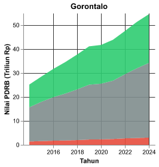

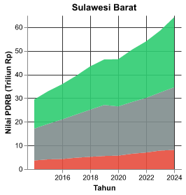

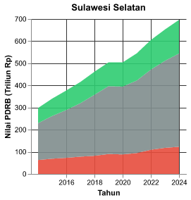

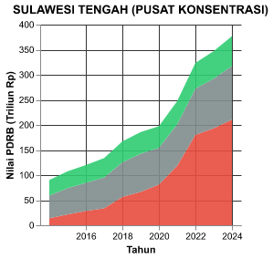

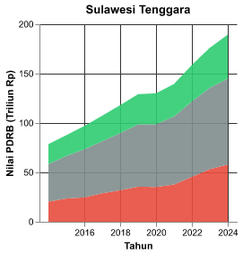

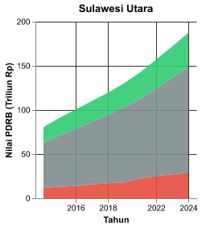

*Metodologi: Legal Supply-Chain Approach — Kat B+C+D = Ekstraktif (UU Minerba Ps.102-103; Perpres 112/2022 Ps.3 Ay.4)*

#### 1.1.2 Pemusatan Sektor Ekstraktif di Kabupaten se-Sulawesi Tengah

Jika dianalisis secara spasial pada tingkat kabupaten di Sulawesi Tengah, terlihat konsentrasi kegiatan industri ekstraktif. Kabupaten **Morowali** dan **Morowali Utara** mendominasi struktur PDRB provinsi melalui pengembangan kawasan industri hilirisasi dan PLTU Captive. 
Visualisasi di bawah membandingkan komposisi ketiga sektor advokatif di seluruh 13 kabupaten/kota se-Sulawesi Tengah pada tahun terbaru.

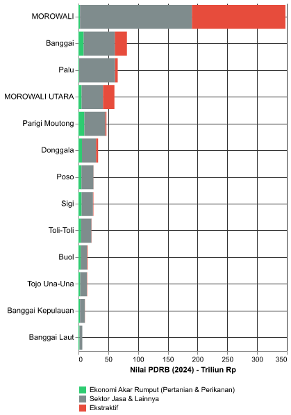

**Lihat Data Mentah: Agregasi 3 Sektor Advokatif (Provinsi & Kabupaten)**

**Data Provinsi**

| provinsi          |   tahun | Klasifikasi                                 |   nilai_miliar_rp |   nilai_triliun_rp |   pct_dari_total |
|:------------------|--------:|:--------------------------------------------|------------------:|-------------------:|-----------------:|
| Gorontalo         |    2014 | Ekstraktif                                  |           1394.77 |            1.39477 |          5.53617 |
| Gorontalo         |    2014 | Sektor Jasa & Lainnya                       |          14287.5  |           14.2875  |         56.7102  |
| Gorontalo         |    2014 | Ekonomi Akar Rumput (Pertanian & Perikanan) |           9511.57 |            9.51157 |         37.7536  |
| Gorontalo         |    2015 | Ekstraktif                                  |           1577.12 |            1.57712 |          5.53503 |
| Gorontalo         |    2015 | Sektor Jasa & Lainnya                       |          16373.4  |           16.3734  |         57.4639  |
| Gorontalo         |    2015 | Ekonomi Akar Rumput (Pertanian & Perikanan) |          10542.9  |           10.5429  |         37.001   |
| Gorontalo         |    2016 | Ekstraktif                                  |           1727.89 |            1.72789 |          5.45118 |
| Gorontalo         |    2016 | Sektor Jasa & Lainnya                       |          18170.4  |           18.1704  |         57.3242  |
| Gorontalo         |    2016 | Ekonomi Akar Rumput (Pertanian & Perikanan) |          11799.3  |           11.7993  |         37.2247  |
| Gorontalo         |    2017 | Ekstraktif                                  |           1828.87 |            1.82887 |          5.29529 |
| Gorontalo         |    2017 | Sektor Jasa & Lainnya                       |          19581.5  |           19.5815  |         56.6962  |
| Gorontalo         |    2017 | Ekonomi Akar Rumput (Pertanian & Perikanan) |          13127.3  |           13.1273  |         38.0086  |
| Gorontalo         |    2018 | Ekstraktif                                  |           1988.44 |            1.98844 |          5.26999 |
| Gorontalo         |    2018 | Sektor Jasa & Lainnya                       |          21162.9  |           21.1629  |         56.0884  |
| Gorontalo         |    2018 | Ekonomi Akar Rumput (Pertanian & Perikanan) |          14580    |           14.58    |         38.6416  |
| Gorontalo         |    2019 | Ekstraktif                                  |           2225.18 |            2.22518 |          5.40808 |
| Gorontalo         |    2019 | Sektor Jasa & Lainnya                       |          22902.1  |           22.9021  |         55.6614  |
| Gorontalo         |    2019 | Ekonomi Akar Rumput (Pertanian & Perikanan) |          16018.1  |           16.0181  |         38.9305  |
| Gorontalo         |    2020 | Ekstraktif                                  |           2289.5  |            2.2895  |          5.48648 |
| Gorontalo         |    2020 | Sektor Jasa & Lainnya                       |          23252.2  |           23.2522  |         55.7207  |
| Gorontalo         |    2020 | Ekonomi Akar Rumput (Pertanian & Perikanan) |          16188.2  |           16.1882  |         38.7928  |
| Gorontalo         |    2021 | Ekstraktif                                  |           2441.3  |            2.4413  |          5.5619  |
| Gorontalo         |    2021 | Sektor Jasa & Lainnya                       |          24369.7  |           24.3697  |         55.5204  |
| Gorontalo         |    2021 | Ekonomi Akar Rumput (Pertanian & Perikanan) |          17082.2  |           17.0822  |         38.9177  |
| Gorontalo         |    2022 | Ekstraktif                                  |           2713.93 |            2.71393 |          5.70557 |
| Gorontalo         |    2022 | Sektor Jasa & Lainnya                       |          26779.2  |           26.7792  |         56.2986  |
| Gorontalo         |    2022 | Ekonomi Akar Rumput (Pertanian & Perikanan) |          18073.2  |           18.0732  |         37.9958  |
| Gorontalo         |    2023 | Ekstraktif                                  |           2861.71 |            2.86171 |          5.57113 |
| Gorontalo         |    2023 | Sektor Jasa & Lainnya                       |          29118    |           29.1181  |         56.6866  |
| Gorontalo         |    2023 | Ekonomi Akar Rumput (Pertanian & Perikanan) |          19387    |           19.387   |         37.7423  |
| Gorontalo         |    2024 | Ekstraktif                                  |           3029.21 |            3.02921 |          5.55211 |
| Gorontalo         |    2024 | Sektor Jasa & Lainnya                       |          31186.2  |           31.1862  |         57.1597  |
| Gorontalo         |    2024 | Ekonomi Akar Rumput (Pertanian & Perikanan) |          20344.3  |           20.3443  |         37.2881  |
| Sulawesi Barat    |    2014 | Ekstraktif                                  |           3672.06 |            3.67206 |         12.4653  |
| Sulawesi Barat    |    2014 | Sektor Jasa & Lainnya                       |          13485.2  |           13.4852  |         45.7773  |
| Sulawesi Barat    |    2014 | Ekonomi Akar Rumput (Pertanian & Perikanan) |          12301    |           12.301   |         41.7574  |
| Sulawesi Barat    |    2015 | Ekstraktif                                  |           4143.27 |            4.14327 |         12.5601  |
| Sulawesi Barat    |    2015 | Sektor Jasa & Lainnya                       |          14993.6  |           14.9936  |         45.4524  |
| Sulawesi Barat    |    2015 | Ekonomi Akar Rumput (Pertanian & Perikanan) |          13850.6  |           13.8506  |         41.9875  |
| Sulawesi Barat    |    2016 | Ekstraktif                                  |           4271.68 |            4.27168 |         11.8839  |
| Sulawesi Barat    |    2016 | Sektor Jasa & Lainnya                       |          16765.9  |           16.7659  |         46.643   |
| Sulawesi Barat    |    2016 | Ekonomi Akar Rumput (Pertanian & Perikanan) |          14907.6  |           14.9076  |         41.4731  |
| Sulawesi Barat    |    2017 | Ekstraktif                                  |           4836.04 |            4.83604 |         12.2439  |
| Sulawesi Barat    |    2017 | Sektor Jasa & Lainnya                       |          18261    |           18.261   |         46.2334  |
| Sulawesi Barat    |    2017 | Ekonomi Akar Rumput (Pertanian & Perikanan) |          16400.4  |           16.4004  |         41.5226  |
| Sulawesi Barat    |    2018 | Ekstraktif                                  |           5207.25 |            5.20725 |         11.9823  |
| Sulawesi Barat    |    2018 | Sektor Jasa & Lainnya                       |          19926.6  |           19.9266  |         45.8526  |
| Sulawesi Barat    |    2018 | Ekonomi Akar Rumput (Pertanian & Perikanan) |          18324    |           18.324   |         42.1651  |
| Sulawesi Barat    |    2019 | Ekstraktif                                  |           5566.29 |            5.56629 |         12.0052  |
| Sulawesi Barat    |    2019 | Sektor Jasa & Lainnya                       |          21558.4  |           21.5584  |         46.4964  |
| Sulawesi Barat    |    2019 | Ekonomi Akar Rumput (Pertanian & Perikanan) |          19241.1  |           19.2411  |         41.4985  |
| Sulawesi Barat    |    2020 | Ekstraktif                                  |           5710.77 |            5.71077 |         12.2902  |
| Sulawesi Barat    |    2020 | Sektor Jasa & Lainnya                       |          20804.6  |           20.8046  |         44.7738  |
| Sulawesi Barat    |    2020 | Ekonomi Akar Rumput (Pertanian & Perikanan) |          19950.6  |           19.9506  |         42.9359  |
| Sulawesi Barat    |    2021 | Ekstraktif                                  |           6526.35 |            6.52635 |         12.9067  |
| Sulawesi Barat    |    2021 | Sektor Jasa & Lainnya                       |          21877.3  |           21.8773  |         43.2652  |
| Sulawesi Barat    |    2021 | Ekonomi Akar Rumput (Pertanian & Perikanan) |          22161.9  |           22.1619  |         43.828   |
| Sulawesi Barat    |    2022 | Ekstraktif                                  |           7029.84 |            7.02984 |         13.0114  |
| Sulawesi Barat    |    2022 | Sektor Jasa & Lainnya                       |          23089.4  |           23.0894  |         42.7357  |
| Sulawesi Barat    |    2022 | Ekonomi Akar Rumput (Pertanian & Perikanan) |          23909.1  |           23.9091  |         44.2529  |
| Sulawesi Barat    |    2023 | Ekstraktif                                  |           7846.36 |            7.84636 |         13.3961  |
| Sulawesi Barat    |    2023 | Sektor Jasa & Lainnya                       |          24553.6  |           24.5536  |         41.9205  |
| Sulawesi Barat    |    2023 | Ekonomi Akar Rumput (Pertanian & Perikanan) |          26171.8  |           26.1718  |         44.6833  |
| Sulawesi Barat    |    2024 | Ekstraktif                                  |           8127.91 |            8.12791 |         12.6574  |
| Sulawesi Barat    |    2024 | Sektor Jasa & Lainnya                       |          26478    |           26.478   |         41.2336  |
| Sulawesi Barat    |    2024 | Ekonomi Akar Rumput (Pertanian & Perikanan) |          29608.8  |           29.6088  |         46.109   |
| Sulawesi Selatan  |    2014 | Ekstraktif                                  |          63038.8  |           63.0388  |         21.1515  |
| Sulawesi Selatan  |    2014 | Sektor Jasa & Lainnya                       |         166530    |          166.53    |         55.8761  |
| Sulawesi Selatan  |    2014 | Ekonomi Akar Rumput (Pertanian & Perikanan) |          68465.4  |           68.4654  |         22.9724  |
| Sulawesi Selatan  |    2015 | Ekstraktif                                  |          68964.6  |           68.9646  |         20.2605  |
| Sulawesi Selatan  |    2015 | Sektor Jasa & Lainnya                       |         192644    |          192.644   |         56.595   |
| Sulawesi Selatan  |    2015 | Ekonomi Akar Rumput (Pertanian & Perikanan) |          78781.8  |           78.7818  |         23.1445  |
| Sulawesi Selatan  |    2016 | Ekstraktif                                  |          72801.6  |           72.8016  |         19.3052  |
| Sulawesi Selatan  |    2016 | Sektor Jasa & Lainnya                       |         215962    |          215.962   |         57.2679  |
| Sulawesi Selatan  |    2016 | Ekonomi Akar Rumput (Pertanian & Perikanan) |          88344.9  |           88.3449  |         23.4269  |
| Sulawesi Selatan  |    2017 | Ekstraktif                                  |          78123.9  |           78.1239  |         18.7984  |
| Sulawesi Selatan  |    2017 | Sektor Jasa & Lainnya                       |         241354    |          241.354   |         58.0754  |
| Sulawesi Selatan  |    2017 | Ekonomi Akar Rumput (Pertanian & Perikanan) |          96109.9  |           96.1099  |         23.1262  |
| Sulawesi Selatan  |    2018 | Ekstraktif                                  |          81909.9  |           81.9099  |         17.7381  |
| Sulawesi Selatan  |    2018 | Sektor Jasa & Lainnya                       |         275768    |          275.768   |         59.7191  |
| Sulawesi Selatan  |    2018 | Ekonomi Akar Rumput (Pertanian & Perikanan) |         104097    |          104.097   |         22.5428  |
| Sulawesi Selatan  |    2019 | Ekstraktif                                  |          90047.3  |           90.0473  |         17.8552  |
| Sulawesi Selatan  |    2019 | Sektor Jasa & Lainnya                       |         306618    |          306.618   |         60.7983  |
| Sulawesi Selatan  |    2019 | Ekonomi Akar Rumput (Pertanian & Perikanan) |         107655    |          107.655   |         21.3466  |
| Sulawesi Selatan  |    2020 | Ekstraktif                                  |          88180.3  |           88.1803  |         17.4943  |
| Sulawesi Selatan  |    2020 | Sektor Jasa & Lainnya                       |         306412    |          306.412   |         60.7897  |
| Sulawesi Selatan  |    2020 | Ekonomi Akar Rumput (Pertanian & Perikanan) |         109460    |          109.46    |         21.716   |
| Sulawesi Selatan  |    2021 | Ekstraktif                                  |          94365.1  |           94.3651  |         17.3192  |
| Sulawesi Selatan  |    2021 | Sektor Jasa & Lainnya                       |         327657    |          327.657   |         60.1364  |
| Sulawesi Selatan  |    2021 | Ekonomi Akar Rumput (Pertanian & Perikanan) |         122835    |          122.835   |         22.5444  |
| Sulawesi Selatan  |    2022 | Ekstraktif                                  |         109301    |          109.301   |         18.061   |
| Sulawesi Selatan  |    2022 | Sektor Jasa & Lainnya                       |         361952    |          361.952   |         59.8094  |
| Sulawesi Selatan  |    2022 | Ekonomi Akar Rumput (Pertanian & Perikanan) |         133923    |          133.923   |         22.1296  |
| Sulawesi Selatan  |    2023 | Ekstraktif                                  |         117825    |          117.825   |         18.0534  |
| Sulawesi Selatan  |    2023 | Sektor Jasa & Lainnya                       |         393278    |          393.278   |         60.2588  |
| Sulawesi Selatan  |    2023 | Ekonomi Akar Rumput (Pertanian & Perikanan) |         141545    |          141.545   |         21.6878  |
| Sulawesi Selatan  |    2024 | Ekstraktif                                  |         122852    |          122.852   |         17.6448  |
| Sulawesi Selatan  |    2024 | Sektor Jasa & Lainnya                       |         421353    |          421.353   |         60.5172  |
| Sulawesi Selatan  |    2024 | Ekonomi Akar Rumput (Pertanian & Perikanan) |         152048    |          152.048   |         21.838   |
| Sulawesi Tengah   |    2014 | Ekstraktif                                  |          13974.9  |           13.9749  |         15.4853  |
| Sulawesi Tengah   |    2014 | Sektor Jasa & Lainnya                       |          45235.4  |           45.2354  |         50.1243  |
| Sulawesi Tengah   |    2014 | Ekonomi Akar Rumput (Pertanian & Perikanan) |          31036    |           31.036   |         34.3904  |
| Sulawesi Tengah   |    2015 | Ekstraktif                                  |          21514.7  |           21.5147  |         20       |
| Sulawesi Tengah   |    2015 | Sektor Jasa & Lainnya                       |          52415    |           52.415   |         48.7248  |
| Sulawesi Tengah   |    2015 | Ekonomi Akar Rumput (Pertanian & Perikanan) |          33643.7  |           33.6437  |         31.2751  |
| Sulawesi Tengah   |    2016 | Ekstraktif                                  |          28455    |           28.455   |         23.7066  |
| Sulawesi Tengah   |    2016 | Sektor Jasa & Lainnya                       |          56036.7  |           56.0367  |         46.6856  |
| Sulawesi Tengah   |    2016 | Ekonomi Akar Rumput (Pertanian & Perikanan) |          35538.3  |           35.5383  |         29.6078  |
| Sulawesi Tengah   |    2017 | Ekstraktif                                  |          33777.3  |           33.7773  |         25.2162  |
| Sulawesi Tengah   |    2017 | Sektor Jasa & Lainnya                       |          61351.3  |           61.3513  |         45.8012  |
| Sulawesi Tengah   |    2017 | Ekonomi Akar Rumput (Pertanian & Perikanan) |          38822.6  |           38.8225  |         28.9826  |
| Sulawesi Tengah   |    2018 | Ekstraktif                                  |          56438    |           56.438   |         33.7677  |
| Sulawesi Tengah   |    2018 | Sektor Jasa & Lainnya                       |          68975    |           68.975   |         41.2688  |
| Sulawesi Tengah   |    2018 | Ekonomi Akar Rumput (Pertanian & Perikanan) |          41722.8  |           41.7228  |         24.9634  |
| Sulawesi Tengah   |    2019 | Ekstraktif                                  |          66558.6  |           66.5586  |         35.8343  |
| Sulawesi Tengah   |    2019 | Sektor Jasa & Lainnya                       |          76089.5  |           76.0895  |         40.9656  |
| Sulawesi Tengah   |    2019 | Ekonomi Akar Rumput (Pertanian & Perikanan) |          43092    |           43.092   |         23.2002  |
| Sulawesi Tengah   |    2020 | Ekstraktif                                  |          81027.2  |           81.0272  |         41.0387  |
| Sulawesi Tengah   |    2020 | Sektor Jasa & Lainnya                       |          73451.9  |           73.4519  |         37.202   |
| Sulawesi Tengah   |    2020 | Ekonomi Akar Rumput (Pertanian & Perikanan) |          42961.7  |           42.9617  |         21.7593  |
| Sulawesi Tengah   |    2021 | Ekstraktif                                  |         118501    |          118.501   |         47.9218  |
| Sulawesi Tengah   |    2021 | Sektor Jasa & Lainnya                       |          82279.1  |           82.2791  |         33.2736  |
| Sulawesi Tengah   |    2021 | Ekonomi Akar Rumput (Pertanian & Perikanan) |          46500.1  |           46.5001  |         18.8046  |
| Sulawesi Tengah   |    2022 | Ekstraktif                                  |         180201    |          180.201   |         55.6812  |
| Sulawesi Tengah   |    2022 | Sektor Jasa & Lainnya                       |          92222.5  |           92.2225  |         28.4963  |
| Sulawesi Tengah   |    2022 | Ekonomi Akar Rumput (Pertanian & Perikanan) |          51206.6  |           51.2066  |         15.8226  |
| Sulawesi Tengah   |    2023 | Ekstraktif                                  |         193259    |          193.259   |         55.6718  |
| Sulawesi Tengah   |    2023 | Sektor Jasa & Lainnya                       |          99077.2  |           99.0772  |         28.5411  |
| Sulawesi Tengah   |    2023 | Ekonomi Akar Rumput (Pertanian & Perikanan) |          54803.2  |           54.8032  |         15.7871  |
| Sulawesi Tengah   |    2024 | Ekstraktif                                  |         210514    |          210.514   |         55.8466  |
| Sulawesi Tengah   |    2024 | Sektor Jasa & Lainnya                       |         106869    |          106.869   |         28.351   |
| Sulawesi Tengah   |    2024 | Ekonomi Akar Rumput (Pertanian & Perikanan) |          59567.6  |           59.5676  |         15.8025  |
| Sulawesi Tenggara |    2014 | Ekstraktif                                  |          20409.6  |           20.4096  |         25.9591  |
| Sulawesi Tenggara |    2014 | Sektor Jasa & Lainnya                       |          38015    |           38.015   |         48.3515  |
| Sulawesi Tenggara |    2014 | Ekonomi Akar Rumput (Pertanian & Perikanan) |          20197.5  |           20.1975  |         25.6894  |
| Sulawesi Tenggara |    2015 | Ekstraktif                                  |          23573.8  |           23.5738  |         26.8756  |
| Sulawesi Tenggara |    2015 | Sektor Jasa & Lainnya                       |          43064.7  |           43.0647  |         49.0964  |
| Sulawesi Tenggara |    2015 | Ekonomi Akar Rumput (Pertanian & Perikanan) |          21076    |           21.076   |         24.028   |
| Sulawesi Tenggara |    2016 | Ekstraktif                                  |          24759.1  |           24.7591  |         25.5263  |
| Sulawesi Tenggara |    2016 | Sektor Jasa & Lainnya                       |          48654.5  |           48.6545  |         50.162   |
| Sulawesi Tenggara |    2016 | Ekonomi Akar Rumput (Pertanian & Perikanan) |          23581.1  |           23.5811  |         24.3118  |
| Sulawesi Tenggara |    2017 | Ekstraktif                                  |          28849.8  |           28.8498  |         26.8562  |
| Sulawesi Tenggara |    2017 | Sektor Jasa & Lainnya                       |          52704.5  |           52.7045  |         49.0624  |
| Sulawesi Tenggara |    2017 | Ekonomi Akar Rumput (Pertanian & Perikanan) |          25869.1  |           25.8691  |         24.0815  |
| Sulawesi Tenggara |    2018 | Ekstraktif                                  |          31921.1  |           31.9211  |         27.0366  |
| Sulawesi Tenggara |    2018 | Sektor Jasa & Lainnya                       |          57852.1  |           57.8521  |         48.9996  |
| Sulawesi Tenggara |    2018 | Ekonomi Akar Rumput (Pertanian & Perikanan) |          28293.3  |           28.2933  |         23.9639  |
| Sulawesi Tenggara |    2019 | Ekstraktif                                  |          35513.4  |           35.5134  |         27.4818  |
| Sulawesi Tenggara |    2019 | Sektor Jasa & Lainnya                       |          63050.8  |           63.0508  |         48.7915  |
| Sulawesi Tenggara |    2019 | Ekonomi Akar Rumput (Pertanian & Perikanan) |          30660.9  |           30.6609  |         23.7267  |
| Sulawesi Tenggara |    2020 | Ekstraktif                                  |          35230.5  |           35.2305  |         27.0781  |
| Sulawesi Tenggara |    2020 | Sektor Jasa & Lainnya                       |          63481.4  |           63.4814  |         48.7916  |
| Sulawesi Tenggara |    2020 | Ekonomi Akar Rumput (Pertanian & Perikanan) |          31395.4  |           31.3954  |         24.1304  |
| Sulawesi Tenggara |    2021 | Ekstraktif                                  |          37685.9  |           37.6859  |         27.0195  |
| Sulawesi Tenggara |    2021 | Sektor Jasa & Lainnya                       |          68865.9  |           68.8659  |         49.3745  |
| Sulawesi Tenggara |    2021 | Ekonomi Akar Rumput (Pertanian & Perikanan) |          32924.9  |           32.9249  |         23.606   |
| Sulawesi Tenggara |    2022 | Ekstraktif                                  |          45510.3  |           45.5103  |         28.6589  |
| Sulawesi Tenggara |    2022 | Sektor Jasa & Lainnya                       |          76326.4  |           76.3264  |         48.0644  |
| Sulawesi Tenggara |    2022 | Ekonomi Akar Rumput (Pertanian & Perikanan) |          36963.6  |           36.9636  |         23.2768  |
| Sulawesi Tenggara |    2023 | Ekstraktif                                  |          53291.7  |           53.2917  |         30.2485  |
| Sulawesi Tenggara |    2023 | Sektor Jasa & Lainnya                       |          82344.1  |           82.3441  |         46.7386  |
| Sulawesi Tenggara |    2023 | Ekonomi Akar Rumput (Pertanian & Perikanan) |          40544.1  |           40.5441  |         23.0129  |
| Sulawesi Tenggara |    2024 | Ekstraktif                                  |          57904.9  |           57.9049  |         30.5596  |
| Sulawesi Tenggara |    2024 | Sektor Jasa & Lainnya                       |          87081.7  |           87.0817  |         45.9578  |
| Sulawesi Tenggara |    2024 | Ekonomi Akar Rumput (Pertanian & Perikanan) |          44495.2  |           44.4952  |         23.4826  |
| Sulawesi Utara    |    2014 | Ekstraktif                                  |          11818.9  |           11.8189  |         14.6513  |
| Sulawesi Utara    |    2014 | Sektor Jasa & Lainnya                       |          51048.8  |           51.0488  |         63.2828  |
| Sulawesi Utara    |    2014 | Ekonomi Akar Rumput (Pertanian & Perikanan) |          17800    |           17.8     |         22.0659  |
| Sulawesi Utara    |    2015 | Ekstraktif                                  |          13035.4  |           13.0354  |         14.3017  |
| Sulawesi Utara    |    2015 | Sektor Jasa & Lainnya                       |          58341.1  |           58.3411  |         64.0086  |
| Sulawesi Utara    |    2015 | Ekonomi Akar Rumput (Pertanian & Perikanan) |          19769.2  |           19.7692  |         21.6897  |
| Sulawesi Utara    |    2016 | Ekstraktif                                  |          13978.7  |           13.9787  |         13.9072  |
| Sulawesi Utara    |    2016 | Sektor Jasa & Lainnya                       |          64706.7  |           64.7067  |         64.3759  |
| Sulawesi Utara    |    2016 | Ekonomi Akar Rumput (Pertanian & Perikanan) |          21828.4  |           21.8284  |         21.7168  |
| Sulawesi Utara    |    2017 | Ekstraktif                                  |          15744.7  |           15.7447  |         14.2982  |
| Sulawesi Utara    |    2017 | Sektor Jasa & Lainnya                       |          70658.9  |           70.6589  |         64.1672  |
| Sulawesi Utara    |    2017 | Ekonomi Akar Rumput (Pertanian & Perikanan) |          23713.2  |           23.7132  |         21.5346  |
| Sulawesi Utara    |    2018 | Ekstraktif                                  |          16981    |           16.981   |         14.2086  |
| Sulawesi Utara    |    2018 | Sektor Jasa & Lainnya                       |          77494.5  |           77.4945  |         64.8421  |
| Sulawesi Utara    |    2018 | Ekonomi Akar Rumput (Pertanian & Perikanan) |          25037.2  |           25.0372  |         20.9494  |
| Sulawesi Utara    |    2019 | Ekstraktif                                  |          18026.2  |           18.0262  |         13.8528  |
| Sulawesi Utara    |    2019 | Sektor Jasa & Lainnya                       |          84998.3  |           84.9983  |         65.3198  |
| Sulawesi Utara    |    2019 | Ekonomi Akar Rumput (Pertanian & Perikanan) |          27102    |           27.102   |         20.8274  |
| Sulawesi Utara    |    2021 | Ekstraktif                                  |          22678.2  |           22.6782  |         15.9011  |
| Sulawesi Utara    |    2021 | Sektor Jasa & Lainnya                       |          89866.8  |           89.8668  |         63.0111  |
| Sulawesi Utara    |    2021 | Ekonomi Akar Rumput (Pertanian & Perikanan) |          30075.4  |           30.0754  |         21.0877  |
| Sulawesi Utara    |    2022 | Ekstraktif                                  |          25080.2  |           25.0801  |         15.9706  |
| Sulawesi Utara    |    2022 | Sektor Jasa & Lainnya                       |          99143.1  |           99.1431  |         63.1326  |
| Sulawesi Utara    |    2022 | Ekonomi Akar Rumput (Pertanian & Perikanan) |          32816.3  |           32.8163  |         20.8968  |
| Sulawesi Utara    |    2023 | Ekstraktif                                  |          26973.2  |           26.9732  |         15.6849  |
| Sulawesi Utara    |    2023 | Sektor Jasa & Lainnya                       |         109831    |          109.831   |         63.8665  |
| Sulawesi Utara    |    2023 | Ekonomi Akar Rumput (Pertanian & Perikanan) |          35165.4  |           35.1654  |         20.4486  |
| Sulawesi Utara    |    2024 | Ekstraktif                                  |          29255.6  |           29.2556  |         15.6134  |
| Sulawesi Utara    |    2024 | Sektor Jasa & Lainnya                       |         119536    |          119.536   |         63.7951  |
| Sulawesi Utara    |    2024 | Ekonomi Akar Rumput (Pertanian & Perikanan) |          38583    |           38.583   |         20.5914  |

**Data Kabupaten (Sulawesi Tengah)**

| kabupaten         | Klasifikasi                                 |   nilai_triliun_rp |       pct |
|:------------------|:--------------------------------------------|-------------------:|----------:|
| Banggai Laut      | Ekonomi Akar Rumput (Pertanian & Perikanan) |            1.79981 | 27.9178   |
| Banggai Laut      | Ekstraktif                                  |            0.12224 |  1.89613  |
| Banggai Laut      | Sektor Jasa & Lainnya                       |            4.52476 | 70.186    |
| Banggai Kepulauan | Ekonomi Akar Rumput (Pertanian & Perikanan) |            2.52787 | 23.5049   |
| Banggai Kepulauan | Ekstraktif                                  |            0.18397 |  1.71061  |
| Banggai Kepulauan | Sektor Jasa & Lainnya                       |            8.0428  | 74.7845   |
| Tojo Una-Una      | Ekonomi Akar Rumput (Pertanian & Perikanan) |            2.88141 | 19.5902   |
| Tojo Una-Una      | Ekstraktif                                  |            0.61359 |  4.17169  |
| Tojo Una-Una      | Sektor Jasa & Lainnya                       |           11.2134  | 76.2381   |
| Buol              | Ekonomi Akar Rumput (Pertanian & Perikanan) |            3.76968 | 24.1925   |
| Buol              | Ekstraktif                                  |            1.1462  |  7.35592  |
| Buol              | Sektor Jasa & Lainnya                       |           10.6661  | 68.4516   |
| Toli-Toli         | Ekonomi Akar Rumput (Pertanian & Perikanan) |            4.35356 | 19.655    |
| Toli-Toli         | Ekstraktif                                  |            0.44044 |  1.98845  |
| Toli-Toli         | Sektor Jasa & Lainnya                       |           17.3559  | 78.3565   |
| Sigi              | Ekonomi Akar Rumput (Pertanian & Perikanan) |            5.17194 | 20.5851   |
| Sigi              | Ekstraktif                                  |            0.82712 |  3.29206  |
| Sigi              | Sektor Jasa & Lainnya                       |           19.1256  | 76.1229   |
| Poso              | Ekonomi Akar Rumput (Pertanian & Perikanan) |            4.9577  | 19.4596   |
| Poso              | Ekstraktif                                  |            0.40224 |  1.57885  |
| Poso              | Sektor Jasa & Lainnya                       |           20.1169  | 78.9615   |
| Donggala          | Ekonomi Akar Rumput (Pertanian & Perikanan) |            5.96012 | 18.0312   |
| Donggala          | Ekstraktif                                  |            3.52832 | 10.6743   |
| Donggala          | Sektor Jasa & Lainnya                       |           23.566   | 71.2945   |
| Parigi Moutong    | Ekonomi Akar Rumput (Pertanian & Perikanan) |            9.96949 | 21.2334   |
| Parigi Moutong    | Ekstraktif                                  |            1.93067 |  4.11202  |
| Parigi Moutong    | Sektor Jasa & Lainnya                       |           35.0517  | 74.6546   |
| Morowali Utara    | Ekonomi Akar Rumput (Pertanian & Perikanan) |            5.16981 |  8.5498   |
| Morowali Utara    | Ekstraktif                                  |           19.2165  | 31.7801   |
| Morowali Utara    | Sektor Jasa & Lainnya                       |           36.0808  | 59.6701   |
| Palu              | Ekonomi Akar Rumput (Pertanian & Perikanan) |            1.24127 |  1.88535  |
| Palu              | Ekstraktif                                  |            4.56322 |  6.93104  |
| Palu              | Sektor Jasa & Lainnya                       |           60.033   | 91.1836   |
| Banggai           | Ekonomi Akar Rumput (Pertanian & Perikanan) |            8.84904 | 10.8612   |
| Banggai           | Ekstraktif                                  |           20.6346  | 25.3266   |
| Banggai           | Sektor Jasa & Lainnya                       |           51.9904  | 63.8122   |
| Morowali          | Ekonomi Akar Rumput (Pertanian & Perikanan) |            2.70286 |  0.777314 |
| Morowali          | Ekstraktif                                  |          157.169   | 45.2002   |
| Morowali          | Sektor Jasa & Lainnya                       |          187.846   | 54.0225   |

*📁 **Sumber File:** Data SIMDASI BPS yang diagregasi menjadi 3 Klasifikasi Utama.*

#### 1.1.3 Perbandingan Distribusi 17 Sektor Komoditas per Provinsi (Small Multiples, Tahun Terbaru)

Visualisasi Small Multiples ini membandingkan komposisi 17 sektor komoditas secara terpisah di tiap provinsi. Sektor diurutkan dari penyumbang terbesar (atas) hingga terkecil (bawah). Skala sumbu X konsisten untuk memvalidasi perbandingan lintas provinsi.

    &bull; Ekonomi Akar Rumput (Pertanian & Perikanan)
    &bull; Sektor Jasa & Lainnya
    &bull; Ekstraktif

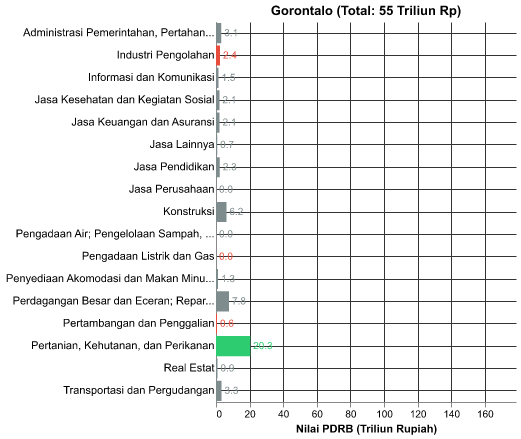

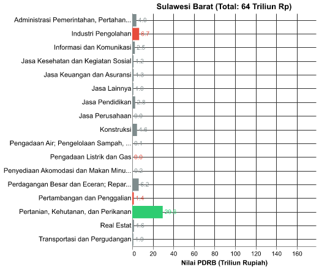

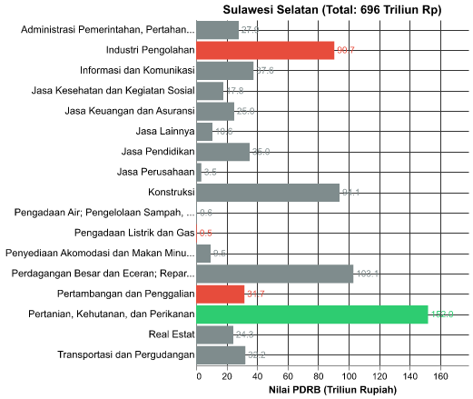

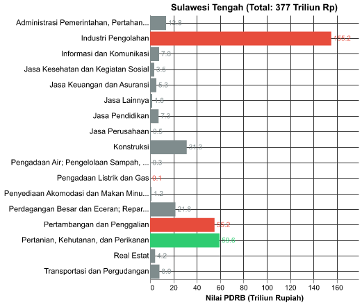

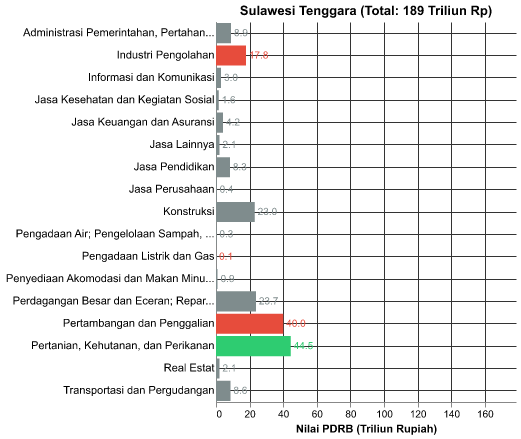

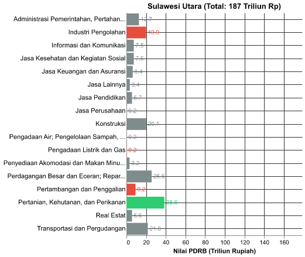

    Interpretasi Sektoral: Analisis komoditas menunjukkan bahwa struktur PDRB Sulawesi Tengah didominasi secara signifikan oleh sektor Industri Pengolahan dan Pertambangan, berbeda dengan Sulawesi Selatan dan Gorontalo yang masih berbasis pada sektor Pertanian dan Perdagangan.

**Lihat Data Mentah: PDRB Sektoral**

| provinsi          |   tahun | sektor_kode   | sektor_nama                                                     |   nilai_miliar_rp |   pct_dari_total |
|:------------------|--------:|:--------------|:----------------------------------------------------------------|------------------:|-----------------:|
| Gorontalo         |    2014 | A             | Pertanian, Kehutanan, dan Perikanan                             |           9511.57 |            37.75 |
| Gorontalo         |    2014 | B             | Pertambangan dan Penggalian                                     |            331.42 |             1.32 |
| Gorontalo         |    2014 | C             | Industri Pengolahan                                             |           1051.64 |             4.17 |
| Gorontalo         |    2014 | D             | Pengadaan Listrik dan Gas                                       |             11.71 |             0.05 |
| Gorontalo         |    2014 | E             | Pengadaan Air; Pengelolaan Sampah, Limbah, dan Daur Ulang       |             12.76 |             0.05 |
| Gorontalo         |    2014 | F             | Konstruksi                                                      |           2971.32 |            11.79 |
| Gorontalo         |    2014 | G             | Perdagangan Besar dan Eceran; Reparasi Mobil dan Sepeda Motor   |           2624.85 |            10.42 |
| Gorontalo         |    2014 | H             | Transportasi dan Pergudangan                                    |           1535.45 |             6.09 |
| Gorontalo         |    2014 | I             | Penyediaan Akomodasi dan Makan Minum                            |            540.44 |             2.15 |
| Gorontalo         |    2014 | J             | Informasi dan Komunikasi                                        |            631.1  |             2.5  |
| Gorontalo         |    2014 | K             | Jasa Keuangan dan Asuransi                                      |            930.75 |             3.69 |
| Gorontalo         |    2014 | L             | Real Estat                                                      |            463.94 |             1.84 |
| Gorontalo         |    2014 | M,N           | Jasa Perusahaan                                                 |             24.3  |             0.1  |
| Gorontalo         |    2014 | O             | Administrasi Pemerintahan, Pertahanan, dan Jaminan Sosial Wajib |           2214.14 |             8.79 |
| Gorontalo         |    2014 | P             | Jasa Pendidikan                                                 |           1051.89 |             4.18 |
| Gorontalo         |    2014 | Q             | Jasa Kesehatan dan Kegiatan Sosial                              |            862.82 |             3.42 |
| Gorontalo         |    2014 | R,S,T,U       | Jasa Lainnya                                                    |            423.69 |             1.68 |
| Gorontalo         |    2015 | A             | Pertanian, Kehutanan, dan Perikanan                             |          10542.9  |            37    |
| Gorontalo         |    2015 | B             | Pertambangan dan Penggalian                                     |            375.72 |             1.32 |
| Gorontalo         |    2015 | C             | Industri Pengolahan                                             |           1191.32 |             4.18 |
| Gorontalo         |    2015 | D             | Pengadaan Listrik dan Gas                                       |             10.08 |             0.04 |
| Gorontalo         |    2015 | E             | Pengadaan Air; Pengelolaan Sampah, Limbah, dan Daur Ulang       |             14.01 |             0.05 |
| Gorontalo         |    2015 | F             | Konstruksi                                                      |           3525.79 |            12.37 |
| Gorontalo         |    2015 | G             | Perdagangan Besar dan Eceran; Reparasi Mobil dan Sepeda Motor   |           2997.64 |            10.52 |
| Gorontalo         |    2015 | H             | Transportasi dan Pergudangan                                    |           1790.68 |             6.28 |
| Gorontalo         |    2015 | I             | Penyediaan Akomodasi dan Makan Minum                            |            639.59 |             2.24 |
| Gorontalo         |    2015 | J             | Informasi dan Komunikasi                                        |            721.78 |             2.53 |
| Gorontalo         |    2015 | K             | Jasa Keuangan dan Asuransi                                      |           1075.65 |             3.78 |
| Gorontalo         |    2015 | L             | Real Estat                                                      |            541.92 |             1.9  |
| Gorontalo         |    2015 | M,N           | Jasa Perusahaan                                                 |             28.07 |             0.1  |
| Gorontalo         |    2015 | O             | Administrasi Pemerintahan, Pertahanan, dan Jaminan Sosial Wajib |           2358.85 |             8.28 |
| Gorontalo         |    2015 | P             | Jasa Pendidikan                                                 |           1186.51 |             4.16 |
| Gorontalo         |    2015 | Q             | Jasa Kesehatan dan Kegiatan Sosial                              |           1014.32 |             3.56 |
| Gorontalo         |    2015 | R,S,T,U       | Jasa Lainnya                                                    |            478.63 |             1.68 |
| Gorontalo         |    2016 | A             | Pertanian, Kehutanan, dan Perikanan                             |          11799.3  |            37.22 |
| Gorontalo         |    2016 | B             | Pertambangan dan Penggalian                                     |            380.96 |             1.2  |
| Gorontalo         |    2016 | C             | Industri Pengolahan                                             |           1333.94 |             4.21 |
| Gorontalo         |    2016 | D             | Pengadaan Listrik dan Gas                                       |             12.99 |             0.04 |
| Gorontalo         |    2016 | E             | Pengadaan Air; Pengelolaan Sampah, Limbah, dan Daur Ulang       |             16.94 |             0.05 |
| Gorontalo         |    2016 | F             | Konstruksi                                                      |           3820.28 |            12.05 |
| Gorontalo         |    2016 | G             | Perdagangan Besar dan Eceran; Reparasi Mobil dan Sepeda Motor   |           3481.16 |            10.98 |
| Gorontalo         |    2016 | H             | Transportasi dan Pergudangan                                    |           1973.41 |             6.23 |
| Gorontalo         |    2016 | I             | Penyediaan Akomodasi dan Makan Minum                            |            720.13 |             2.27 |
| Gorontalo         |    2016 | J             | Informasi dan Komunikasi                                        |            828.56 |             2.61 |
| Gorontalo         |    2016 | K             | Jasa Keuangan dan Asuransi                                      |           1313.86 |             4.14 |
| Gorontalo         |    2016 | L             | Real Estat                                                      |            617.52 |             1.95 |
| Gorontalo         |    2016 | M,N           | Jasa Perusahaan                                                 |             31.2  |             0.1  |
| Gorontalo         |    2016 | O             | Administrasi Pemerintahan, Pertahanan, dan Jaminan Sosial Wajib |           2422.5  |             7.64 |
| Gorontalo         |    2016 | P             | Jasa Pendidikan                                                 |           1288.64 |             4.07 |
| Gorontalo         |    2016 | Q             | Jasa Kesehatan dan Kegiatan Sosial                              |           1142.24 |             3.6  |
| Gorontalo         |    2016 | R,S,T,U       | Jasa Lainnya                                                    |            513.92 |             1.62 |
| Gorontalo         |    2017 | A             | Pertanian, Kehutanan, dan Perikanan                             |          13127.3  |            38.01 |
| Gorontalo         |    2017 | B             | Pertambangan dan Penggalian                                     |            399.98 |             1.16 |
| Gorontalo         |    2017 | C             | Industri Pengolahan                                             |           1413.09 |             4.09 |
| Gorontalo         |    2017 | D             | Pengadaan Listrik dan Gas                                       |             15.8  |             0.05 |
| Gorontalo         |    2017 | E             | Pengadaan Air; Pengelolaan Sampah, Limbah, dan Daur Ulang       |             19.93 |             0.06 |
| Gorontalo         |    2017 | F             | Konstruksi                                                      |           3978.86 |            11.52 |
| Gorontalo         |    2017 | G             | Perdagangan Besar dan Eceran; Reparasi Mobil dan Sepeda Motor   |           3938.42 |            11.4  |
| Gorontalo         |    2017 | H             | Transportasi dan Pergudangan                                    |           2092.42 |             6.06 |
| Gorontalo         |    2017 | I             | Penyediaan Akomodasi dan Makan Minum                            |            814.28 |             2.36 |
| Gorontalo         |    2017 | J             | Informasi dan Komunikasi                                        |            921.97 |             2.67 |
| Gorontalo         |    2017 | K             | Jasa Keuangan dan Asuransi                                      |           1493.4  |             4.32 |
| Gorontalo         |    2017 | L             | Real Estat                                                      |            661.58 |             1.92 |
| Gorontalo         |    2017 | M,N           | Jasa Perusahaan                                                 |             33.45 |             0.1  |
| Gorontalo         |    2017 | O             | Administrasi Pemerintahan, Pertahanan, dan Jaminan Sosial Wajib |           2427.25 |             7.03 |
| Gorontalo         |    2017 | P             | Jasa Pendidikan                                                 |           1442.74 |             4.18 |
| Gorontalo         |    2017 | Q             | Jasa Kesehatan dan Kegiatan Sosial                              |           1216.76 |             3.52 |
| Gorontalo         |    2017 | R,S,T,U       | Jasa Lainnya                                                    |            540.47 |             1.56 |
| Gorontalo         |    2018 | A             | Pertanian, Kehutanan, dan Perikanan                             |          14580    |            38.64 |
| Gorontalo         |    2018 | B             | Pertambangan dan Penggalian                                     |            420.36 |             1.11 |
| Gorontalo         |    2018 | C             | Industri Pengolahan                                             |           1550.42 |             4.11 |
| Gorontalo         |    2018 | D             | Pengadaan Listrik dan Gas                                       |             17.66 |             0.05 |
| Gorontalo         |    2018 | E             | Pengadaan Air; Pengelolaan Sampah, Limbah, dan Daur Ulang       |             22.61 |             0.06 |
| Gorontalo         |    2018 | F             | Konstruksi                                                      |           4195.48 |            11.12 |
| Gorontalo         |    2018 | G             | Perdagangan Besar dan Eceran; Reparasi Mobil dan Sepeda Motor   |           4465.44 |            11.83 |
| Gorontalo         |    2018 | H             | Transportasi dan Pergudangan                                    |           2208.99 |             5.85 |
| Gorontalo         |    2018 | I             | Penyediaan Akomodasi dan Makan Minum                            |            894.39 |             2.37 |
| Gorontalo         |    2018 | J             | Informasi dan Komunikasi                                        |           1016.32 |             2.69 |
| Gorontalo         |    2018 | K             | Jasa Keuangan dan Asuransi                                      |           1600.32 |             4.24 |
| Gorontalo         |    2018 | L             | Real Estat                                                      |            705.83 |             1.87 |
| Gorontalo         |    2018 | M,N           | Jasa Perusahaan                                                 |             35.73 |             0.09 |
| Gorontalo         |    2018 | O             | Administrasi Pemerintahan, Pertahanan, dan Jaminan Sosial Wajib |           2489.27 |             6.6  |
| Gorontalo         |    2018 | P             | Jasa Pendidikan                                                 |           1627.2  |             4.31 |
| Gorontalo         |    2018 | Q             | Jasa Kesehatan dan Kegiatan Sosial                              |           1331.09 |             3.53 |
| Gorontalo         |    2018 | R,S,T,U       | Jasa Lainnya                                                    |            570.24 |             1.51 |
| Gorontalo         |    2019 | A             | Pertanian, Kehutanan, dan Perikanan                             |          16018.1  |            38.93 |
| Gorontalo         |    2019 | B             | Pertambangan dan Penggalian                                     |            450.54 |             1.09 |
| Gorontalo         |    2019 | C             | Industri Pengolahan                                             |           1755.2  |             4.27 |
| Gorontalo         |    2019 | D             | Pengadaan Listrik dan Gas                                       |             19.44 |             0.05 |
| Gorontalo         |    2019 | E             | Pengadaan Air; Pengelolaan Sampah, Limbah, dan Daur Ulang       |             25.71 |             0.06 |
| Gorontalo         |    2019 | F             | Konstruksi                                                      |           4391.21 |            10.67 |
| Gorontalo         |    2019 | G             | Perdagangan Besar dan Eceran; Reparasi Mobil dan Sepeda Motor   |           5102.34 |            12.4  |
| Gorontalo         |    2019 | H             | Transportasi dan Pergudangan                                    |           2366.71 |             5.75 |
| Gorontalo         |    2019 | I             | Penyediaan Akomodasi dan Makan Minum                            |            969.04 |             2.36 |
| Gorontalo         |    2019 | J             | Informasi dan Komunikasi                                        |           1100.11 |             2.67 |
| Gorontalo         |    2019 | K             | Jasa Keuangan dan Asuransi                                      |           1635.75 |             3.98 |
| Gorontalo         |    2019 | L             | Real Estat                                                      |            771.44 |             1.87 |
| Gorontalo         |    2019 | M,N           | Jasa Perusahaan                                                 |             38.62 |             0.09 |
| Gorontalo         |    2019 | O             | Administrasi Pemerintahan, Pertahanan, dan Jaminan Sosial Wajib |           2599.96 |             6.32 |
| Gorontalo         |    2019 | P             | Jasa Pendidikan                                                 |           1822.04 |             4.43 |
| Gorontalo         |    2019 | Q             | Jasa Kesehatan dan Kegiatan Sosial                              |           1473.89 |             3.58 |
| Gorontalo         |    2019 | R,S,T,U       | Jasa Lainnya                                                    |            605.31 |             1.47 |
| Gorontalo         |    2020 | A             | Pertanian, Kehutanan, dan Perikanan                             |          16188.2  |            38.79 |
| Gorontalo         |    2020 | B             | Pertambangan dan Penggalian                                     |            468.2  |             1.12 |
| Gorontalo         |    2020 | C             | Industri Pengolahan                                             |           1799.86 |             4.31 |
| Gorontalo         |    2020 | D             | Pengadaan Listrik dan Gas                                       |             21.44 |             0.05 |
| Gorontalo         |    2020 | E             | Pengadaan Air; Pengelolaan Sampah, Limbah, dan Daur Ulang       |             26.18 |             0.06 |
| Gorontalo         |    2020 | F             | Konstruksi                                                      |           4399.36 |            10.54 |
| Gorontalo         |    2020 | G             | Perdagangan Besar dan Eceran; Reparasi Mobil dan Sepeda Motor   |           5100.3  |            12.22 |
| Gorontalo         |    2020 | H             | Transportasi dan Pergudangan                                    |           2245.9  |             5.38 |
| Gorontalo         |    2020 | I             | Penyediaan Akomodasi dan Makan Minum                            |            964.41 |             2.31 |
| Gorontalo         |    2020 | J             | Informasi dan Komunikasi                                        |           1145    |             2.74 |
| Gorontalo         |    2020 | K             | Jasa Keuangan dan Asuransi                                      |           1869.83 |             4.48 |
| Gorontalo         |    2020 | L             | Real Estat                                                      |            778.97 |             1.87 |
| Gorontalo         |    2020 | M,N           | Jasa Perusahaan                                                 |             36.49 |             0.09 |
| Gorontalo         |    2020 | O             | Administrasi Pemerintahan, Pertahanan, dan Jaminan Sosial Wajib |           2628.24 |             6.3  |
| Gorontalo         |    2020 | P             | Jasa Pendidikan                                                 |           1947.54 |             4.67 |
| Gorontalo         |    2020 | Q             | Jasa Kesehatan dan Kegiatan Sosial                              |           1528.89 |             3.66 |
| Gorontalo         |    2020 | R,S,T,U       | Jasa Lainnya                                                    |            581.08 |             1.39 |
| Gorontalo         |    2021 | A             | Pertanian, Kehutanan, dan Perikanan                             |          17082.2  |            38.92 |
| Gorontalo         |    2021 | B             | Pertambangan dan Penggalian                                     |            483.23 |             1.1  |
| Gorontalo         |    2021 | C             | Industri Pengolahan                                             |           1936.07 |             4.41 |
| Gorontalo         |    2021 | D             | Pengadaan Listrik dan Gas                                       |             22    |             0.05 |
| Gorontalo         |    2021 | E             | Pengadaan Air; Pengelolaan Sampah, Limbah, dan Daur Ulang       |             26.88 |             0.06 |
| Gorontalo         |    2021 | F             | Konstruksi                                                      |           4597.26 |            10.47 |
| Gorontalo         |    2021 | G             | Perdagangan Besar dan Eceran; Reparasi Mobil dan Sepeda Motor   |           5386.86 |            12.27 |
| Gorontalo         |    2021 | H             | Transportasi dan Pergudangan                                    |           2325.32 |             5.3  |
| Gorontalo         |    2021 | I             | Penyediaan Akomodasi dan Makan Minum                            |           1008.94 |             2.3  |
| Gorontalo         |    2021 | J             | Informasi dan Komunikasi                                        |           1184    |             2.7  |
| Gorontalo         |    2021 | K             | Jasa Keuangan dan Asuransi                                      |           2140.55 |             4.88 |
| Gorontalo         |    2021 | L             | Real Estat                                                      |            756.47 |             1.72 |
| Gorontalo         |    2021 | M,N           | Jasa Perusahaan                                                 |             37.54 |             0.09 |
| Gorontalo         |    2021 | O             | Administrasi Pemerintahan, Pertahanan, dan Jaminan Sosial Wajib |           2644.99 |             6.03 |
| Gorontalo         |    2021 | P             | Jasa Pendidikan                                                 |           2018.2  |             4.6  |
| Gorontalo         |    2021 | Q             | Jasa Kesehatan dan Kegiatan Sosial                              |           1642.19 |             3.74 |
| Gorontalo         |    2021 | R,S,T,U       | Jasa Lainnya                                                    |            600.53 |             1.37 |
| Gorontalo         |    2022 | A             | Pertanian, Kehutanan, dan Perikanan                             |          18073.2  |            38    |
| Gorontalo         |    2022 | B             | Pertambangan dan Penggalian                                     |            519.28 |             1.09 |
| Gorontalo         |    2022 | C             | Industri Pengolahan                                             |           2170.69 |             4.56 |
| Gorontalo         |    2022 | D             | Pengadaan Listrik dan Gas                                       |             23.96 |             0.05 |
| Gorontalo         |    2022 | E             | Pengadaan Air; Pengelolaan Sampah, Limbah, dan Daur Ulang       |             27.76 |             0.06 |
| Gorontalo         |    2022 | F             | Konstruksi                                                      |           5189.74 |            10.91 |
| Gorontalo         |    2022 | G             | Perdagangan Besar dan Eceran; Reparasi Mobil dan Sepeda Motor   |           6220.17 |            13.08 |
| Gorontalo         |    2022 | H             | Transportasi dan Pergudangan                                    |           2668.65 |             5.61 |
| Gorontalo         |    2022 | I             | Penyediaan Akomodasi dan Makan Minum                            |           1076.17 |             2.26 |
| Gorontalo         |    2022 | J             | Informasi dan Komunikasi                                        |           1286.08 |             2.7  |
| Gorontalo         |    2022 | K             | Jasa Keuangan dan Asuransi                                      |           2192.18 |             4.61 |
| Gorontalo         |    2022 | L             | Real Estat                                                      |            820.71 |             1.73 |
| Gorontalo         |    2022 | M,N           | Jasa Perusahaan                                                 |             42.8  |             0.09 |
| Gorontalo         |    2022 | O             | Administrasi Pemerintahan, Pertahanan, dan Jaminan Sosial Wajib |           2802.94 |             5.89 |
| Gorontalo         |    2022 | P             | Jasa Pendidikan                                                 |           2124    |             4.47 |
| Gorontalo         |    2022 | Q             | Jasa Kesehatan dan Kegiatan Sosial                              |           1711.67 |             3.6  |
| Gorontalo         |    2022 | R,S,T,U       | Jasa Lainnya                                                    |            616.29 |             1.3  |
| Gorontalo         |    2023 | A             | Pertanian, Kehutanan, dan Perikanan                             |          19387    |            37.74 |
| Gorontalo         |    2023 | B             | Pertambangan dan Penggalian                                     |            562.13 |             1.09 |
| Gorontalo         |    2023 | C             | Industri Pengolahan                                             |           2273.93 |             4.43 |
| Gorontalo         |    2023 | D             | Pengadaan Listrik dan Gas                                       |             25.65 |             0.05 |
| Gorontalo         |    2023 | E             | Pengadaan Air; Pengelolaan Sampah, Limbah, dan Daur Ulang       |             29.2  |             0.06 |
| Gorontalo         |    2023 | F             | Konstruksi                                                      |           5717.04 |            11.13 |
| Gorontalo         |    2023 | G             | Perdagangan Besar dan Eceran; Reparasi Mobil dan Sepeda Motor   |           7074.66 |            13.77 |
| Gorontalo         |    2023 | H             | Transportasi dan Pergudangan                                    |           3040.11 |             5.92 |
| Gorontalo         |    2023 | I             | Penyediaan Akomodasi dan Makan Minum                            |           1156.14 |             2.25 |
| Gorontalo         |    2023 | J             | Informasi dan Komunikasi                                        |           1370.73 |             2.67 |
| Gorontalo         |    2023 | K             | Jasa Keuangan dan Asuransi                                      |           2070.44 |             4.03 |
| Gorontalo         |    2023 | L             | Real Estat                                                      |            820.26 |             1.6  |
| Gorontalo         |    2023 | M,N           | Jasa Perusahaan                                                 |             42.33 |             0.08 |
| Gorontalo         |    2023 | O             | Administrasi Pemerintahan, Pertahanan, dan Jaminan Sosial Wajib |           2985    |             5.81 |
| Gorontalo         |    2023 | P             | Jasa Pendidikan                                                 |           2249.9  |             4.38 |
| Gorontalo         |    2023 | Q             | Jasa Kesehatan dan Kegiatan Sosial                              |           1896.89 |             3.69 |
| Gorontalo         |    2023 | R,S,T,U       | Jasa Lainnya                                                    |            665.35 |             1.3  |
| Gorontalo         |    2024 | A             | Pertanian, Kehutanan, dan Perikanan                             |          20344.3  |            37.29 |
| Gorontalo         |    2024 | B             | Pertambangan dan Penggalian                                     |            606.29 |             1.11 |
| Gorontalo         |    2024 | C             | Industri Pengolahan                                             |           2396.85 |             4.39 |
| Gorontalo         |    2024 | D             | Pengadaan Listrik dan Gas                                       |             26.07 |             0.05 |
| Gorontalo         |    2024 | E             | Pengadaan Air; Pengelolaan Sampah, Limbah, dan Daur Ulang       |             31    |             0.06 |
| Gorontalo         |    2024 | F             | Konstruksi                                                      |           6186.44 |            11.34 |
| Gorontalo         |    2024 | G             | Perdagangan Besar dan Eceran; Reparasi Mobil dan Sepeda Motor   |           7760.67 |            14.22 |
| Gorontalo         |    2024 | H             | Transportasi dan Pergudangan                                    |           3296.35 |             6.04 |
| Gorontalo         |    2024 | I             | Penyediaan Akomodasi dan Makan Minum                            |           1250.17 |             2.29 |
| Gorontalo         |    2024 | J             | Informasi dan Komunikasi                                        |           1464.96 |             2.69 |
| Gorontalo         |    2024 | K             | Jasa Keuangan dan Asuransi                                      |           2123.19 |             3.89 |
| Gorontalo         |    2024 | L             | Real Estat                                                      |            862.84 |             1.58 |
| Gorontalo         |    2024 | M,N           | Jasa Perusahaan                                                 |             42.98 |             0.08 |
| Gorontalo         |    2024 | O             | Administrasi Pemerintahan, Pertahanan, dan Jaminan Sosial Wajib |           3139.57 |             5.75 |
| Gorontalo         |    2024 | P             | Jasa Pendidikan                                                 |           2276.92 |             4.17 |
| Gorontalo         |    2024 | Q             | Jasa Kesehatan dan Kegiatan Sosial                              |           2051.91 |             3.76 |
| Gorontalo         |    2024 | R,S,T,U       | Jasa Lainnya                                                    |            699.15 |             1.28 |
| Sulawesi Barat    |    2014 | A             | Pertanian, Kehutanan, dan Perikanan                             |          12301    |            41.76 |
| Sulawesi Barat    |    2014 | B             | Pertambangan dan Penggalian                                     |            605.98 |             2.06 |
| Sulawesi Barat    |    2014 | C             | Industri Pengolahan                                             |           3054.56 |            10.37 |
| Sulawesi Barat    |    2014 | D             | Pengadaan Listrik dan Gas                                       |             11.52 |             0.04 |
| Sulawesi Barat    |    2014 | E             | Pengadaan Air; Pengelolaan Sampah, Limbah, dan Daur Ulang       |             45.63 |             0.15 |
| Sulawesi Barat    |    2014 | F             | Konstruksi                                                      |           2285.04 |             7.76 |
| Sulawesi Barat    |    2014 | G             | Perdagangan Besar dan Eceran; Reparasi Mobil dan Sepeda Motor   |           3092.15 |            10.5  |
| Sulawesi Barat    |    2014 | H             | Transportasi dan Pergudangan                                    |            450.5  |             1.53 |
| Sulawesi Barat    |    2014 | I             | Penyediaan Akomodasi dan Makan Minum                            |             69.72 |             0.24 |
| Sulawesi Barat    |    2014 | J             | Informasi dan Komunikasi                                        |           1138.2  |             3.86 |
| Sulawesi Barat    |    2014 | K             | Jasa Keuangan dan Asuransi                                      |            600.82 |             2.04 |
| Sulawesi Barat    |    2014 | L             | Real Estat                                                      |            823.45 |             2.8  |
| Sulawesi Barat    |    2014 | M,N           | Jasa Perusahaan                                                 |             22.31 |             0.08 |
| Sulawesi Barat    |    2014 | O             | Administrasi Pemerintahan, Pertahanan, dan Jaminan Sosial Wajib |           2443.94 |             8.3  |
| Sulawesi Barat    |    2014 | P             | Jasa Pendidikan                                                 |           1437.78 |             4.88 |
| Sulawesi Barat    |    2014 | Q             | Jasa Kesehatan dan Kegiatan Sosial                              |            564.46 |             1.92 |
| Sulawesi Barat    |    2014 | R,S,T,U       | Jasa Lainnya                                                    |            511.19 |             1.74 |
| Sulawesi Barat    |    2015 | A             | Pertanian, Kehutanan, dan Perikanan                             |          13850.6  |            41.99 |
| Sulawesi Barat    |    2015 | B             | Pertambangan dan Penggalian                                     |            730.15 |             2.21 |
| Sulawesi Barat    |    2015 | C             | Industri Pengolahan                                             |           3402.85 |            10.32 |
| Sulawesi Barat    |    2015 | D             | Pengadaan Listrik dan Gas                                       |             10.27 |             0.03 |
| Sulawesi Barat    |    2015 | E             | Pengadaan Air; Pengelolaan Sampah, Limbah, dan Daur Ulang       |             49.93 |             0.15 |
| Sulawesi Barat    |    2015 | F             | Konstruksi                                                      |           2582.36 |             7.83 |
| Sulawesi Barat    |    2015 | G             | Perdagangan Besar dan Eceran; Reparasi Mobil dan Sepeda Motor   |           3440.82 |            10.43 |
| Sulawesi Barat    |    2015 | H             | Transportasi dan Pergudangan                                    |            511.78 |             1.55 |
| Sulawesi Barat    |    2015 | I             | Penyediaan Akomodasi dan Makan Minum                            |             75.58 |             0.23 |
| Sulawesi Barat    |    2015 | J             | Informasi dan Komunikasi                                        |           1262.79 |             3.83 |
| Sulawesi Barat    |    2015 | K             | Jasa Keuangan dan Asuransi                                      |            659.87 |             2    |
| Sulawesi Barat    |    2015 | L             | Real Estat                                                      |            902.66 |             2.74 |
| Sulawesi Barat    |    2015 | M,N           | Jasa Perusahaan                                                 |             24.47 |             0.07 |
| Sulawesi Barat    |    2015 | O             | Administrasi Pemerintahan, Pertahanan, dan Jaminan Sosial Wajib |           2738.31 |             8.3  |
| Sulawesi Barat    |    2015 | P             | Jasa Pendidikan                                                 |           1542.12 |             4.67 |
| Sulawesi Barat    |    2015 | Q             | Jasa Kesehatan dan Kegiatan Sosial                              |            630.47 |             1.91 |
| Sulawesi Barat    |    2015 | R,S,T,U       | Jasa Lainnya                                                    |            572.48 |             1.74 |
| Sulawesi Barat    |    2016 | A             | Pertanian, Kehutanan, dan Perikanan                             |          14907.6  |            41.47 |
| Sulawesi Barat    |    2016 | B             | Pertambangan dan Penggalian                                     |            832.5  |             2.32 |
| Sulawesi Barat    |    2016 | C             | Industri Pengolahan                                             |           3426.24 |             9.53 |
| Sulawesi Barat    |    2016 | D             | Pengadaan Listrik dan Gas                                       |             12.94 |             0.04 |
| Sulawesi Barat    |    2016 | E             | Pengadaan Air; Pengelolaan Sampah, Limbah, dan Daur Ulang       |             53.75 |             0.15 |
| Sulawesi Barat    |    2016 | F             | Konstruksi                                                      |           2934.03 |             8.16 |
| Sulawesi Barat    |    2016 | G             | Perdagangan Besar dan Eceran; Reparasi Mobil dan Sepeda Motor   |           3759.89 |            10.46 |
| Sulawesi Barat    |    2016 | H             | Transportasi dan Pergudangan                                    |            534.6  |             1.49 |
| Sulawesi Barat    |    2016 | I             | Penyediaan Akomodasi dan Makan Minum                            |             84.84 |             0.24 |
| Sulawesi Barat    |    2016 | J             | Informasi dan Komunikasi                                        |           1394.73 |             3.88 |
| Sulawesi Barat    |    2016 | K             | Jasa Keuangan dan Asuransi                                      |            780.22 |             2.17 |
| Sulawesi Barat    |    2016 | L             | Real Estat                                                      |            990.39 |             2.76 |
| Sulawesi Barat    |    2016 | M,N           | Jasa Perusahaan                                                 |             25.72 |             0.07 |
| Sulawesi Barat    |    2016 | O             | Administrasi Pemerintahan, Pertahanan, dan Jaminan Sosial Wajib |           3084.39 |             8.58 |
| Sulawesi Barat    |    2016 | P             | Jasa Pendidikan                                                 |           1760.88 |             4.9  |
| Sulawesi Barat    |    2016 | Q             | Jasa Kesehatan dan Kegiatan Sosial                              |            722.46 |             2.01 |
| Sulawesi Barat    |    2016 | R,S,T,U       | Jasa Lainnya                                                    |            640.04 |             1.78 |
| Sulawesi Barat    |    2017 | A             | Pertanian, Kehutanan, dan Perikanan                             |          16400.4  |            41.52 |
| Sulawesi Barat    |    2017 | B             | Pertambangan dan Penggalian                                     |            887.9  |             2.25 |
| Sulawesi Barat    |    2017 | C             | Industri Pengolahan                                             |           3932.7  |             9.96 |
| Sulawesi Barat    |    2017 | D             | Pengadaan Listrik dan Gas                                       |             15.44 |             0.04 |
| Sulawesi Barat    |    2017 | E             | Pengadaan Air; Pengelolaan Sampah, Limbah, dan Daur Ulang       |             59.19 |             0.15 |
| Sulawesi Barat    |    2017 | F             | Konstruksi                                                      |           3228.84 |             8.17 |
| Sulawesi Barat    |    2017 | G             | Perdagangan Besar dan Eceran; Reparasi Mobil dan Sepeda Motor   |           4105.3  |            10.39 |
| Sulawesi Barat    |    2017 | H             | Transportasi dan Pergudangan                                    |            559.39 |             1.42 |
| Sulawesi Barat    |    2017 | I             | Penyediaan Akomodasi dan Makan Minum                            |             90.8  |             0.23 |
| Sulawesi Barat    |    2017 | J             | Informasi dan Komunikasi                                        |           1571.32 |             3.98 |
| Sulawesi Barat    |    2017 | K             | Jasa Keuangan dan Asuransi                                      |            881.54 |             2.23 |
| Sulawesi Barat    |    2017 | L             | Real Estat                                                      |           1055.88 |             2.67 |
| Sulawesi Barat    |    2017 | M,N           | Jasa Perusahaan                                                 |             27.45 |             0.07 |
| Sulawesi Barat    |    2017 | O             | Administrasi Pemerintahan, Pertahanan, dan Jaminan Sosial Wajib |           3189.1  |             8.07 |
| Sulawesi Barat    |    2017 | P             | Jasa Pendidikan                                                 |           1994    |             5.05 |
| Sulawesi Barat    |    2017 | Q             | Jasa Kesehatan dan Kegiatan Sosial                              |            781.42 |             1.98 |
| Sulawesi Barat    |    2017 | R,S,T,U       | Jasa Lainnya                                                    |            716.78 |             1.81 |
| Sulawesi Barat    |    2018 | A             | Pertanian, Kehutanan, dan Perikanan                             |          18324    |            42.17 |
| Sulawesi Barat    |    2018 | B             | Pertambangan dan Penggalian                                     |            971.11 |             2.23 |
| Sulawesi Barat    |    2018 | C             | Industri Pengolahan                                             |           4219.6  |             9.71 |
| Sulawesi Barat    |    2018 | D             | Pengadaan Listrik dan Gas                                       |             16.54 |             0.04 |
| Sulawesi Barat    |    2018 | E             | Pengadaan Air; Pengelolaan Sampah, Limbah, dan Daur Ulang       |             64.45 |             0.15 |
| Sulawesi Barat    |    2018 | F             | Konstruksi                                                      |           3536.6  |             8.14 |
| Sulawesi Barat    |    2018 | G             | Perdagangan Besar dan Eceran; Reparasi Mobil dan Sepeda Motor   |           4480.53 |            10.31 |
| Sulawesi Barat    |    2018 | H             | Transportasi dan Pergudangan                                    |            598.46 |             1.38 |
| Sulawesi Barat    |    2018 | I             | Penyediaan Akomodasi dan Makan Minum                            |            100.83 |             0.23 |
| Sulawesi Barat    |    2018 | J             | Informasi dan Komunikasi                                        |           1734.27 |             3.99 |
| Sulawesi Barat    |    2018 | K             | Jasa Keuangan dan Asuransi                                      |            951.67 |             2.19 |
| Sulawesi Barat    |    2018 | L             | Real Estat                                                      |           1124.68 |             2.59 |
| Sulawesi Barat    |    2018 | M,N           | Jasa Perusahaan                                                 |             28.62 |             0.07 |
| Sulawesi Barat    |    2018 | O             | Administrasi Pemerintahan, Pertahanan, dan Jaminan Sosial Wajib |           3506.98 |             8.07 |
| Sulawesi Barat    |    2018 | P             | Jasa Pendidikan                                                 |           2191.18 |             5.04 |
| Sulawesi Barat    |    2018 | Q             | Jasa Kesehatan dan Kegiatan Sosial                              |            849.42 |             1.95 |
| Sulawesi Barat    |    2018 | R,S,T,U       | Jasa Lainnya                                                    |            758.88 |             1.75 |
| Sulawesi Barat    |    2019 | A             | Pertanian, Kehutanan, dan Perikanan                             |          19241.1  |            41.5  |
| Sulawesi Barat    |    2019 | B             | Pertambangan dan Penggalian                                     |           1038.63 |             2.24 |
| Sulawesi Barat    |    2019 | C             | Industri Pengolahan                                             |           4510.45 |             9.73 |
| Sulawesi Barat    |    2019 | D             | Pengadaan Listrik dan Gas                                       |             17.21 |             0.04 |
| Sulawesi Barat    |    2019 | E             | Pengadaan Air; Pengelolaan Sampah, Limbah, dan Daur Ulang       |             70.55 |             0.15 |
| Sulawesi Barat    |    2019 | F             | Konstruksi                                                      |           3845.47 |             8.29 |
| Sulawesi Barat    |    2019 | G             | Perdagangan Besar dan Eceran; Reparasi Mobil dan Sepeda Motor   |           4736.26 |            10.21 |
| Sulawesi Barat    |    2019 | H             | Transportasi dan Pergudangan                                    |            650.25 |             1.4  |
| Sulawesi Barat    |    2019 | I             | Penyediaan Akomodasi dan Makan Minum                            |            111.37 |             0.24 |
| Sulawesi Barat    |    2019 | J             | Informasi dan Komunikasi                                        |           1957.77 |             4.22 |
| Sulawesi Barat    |    2019 | K             | Jasa Keuangan dan Asuransi                                      |            997.31 |             2.15 |
| Sulawesi Barat    |    2019 | L             | Real Estat                                                      |           1212.27 |             2.61 |
| Sulawesi Barat    |    2019 | M,N           | Jasa Perusahaan                                                 |             31    |             0.07 |
| Sulawesi Barat    |    2019 | O             | Administrasi Pemerintahan, Pertahanan, dan Jaminan Sosial Wajib |           3785.41 |             8.16 |
| Sulawesi Barat    |    2019 | P             | Jasa Pendidikan                                                 |           2437.4  |             5.26 |
| Sulawesi Barat    |    2019 | Q             | Jasa Kesehatan dan Kegiatan Sosial                              |            891.42 |             1.92 |
| Sulawesi Barat    |    2019 | R,S,T,U       | Jasa Lainnya                                                    |            831.92 |             1.79 |
| Sulawesi Barat    |    2020 | A             | Pertanian, Kehutanan, dan Perikanan                             |          19950.6  |            42.94 |
| Sulawesi Barat    |    2020 | B             | Pertambangan dan Penggalian                                     |           1006.74 |             2.17 |
| Sulawesi Barat    |    2020 | C             | Industri Pengolahan                                             |           4685.57 |            10.08 |
| Sulawesi Barat    |    2020 | D             | Pengadaan Listrik dan Gas                                       |             18.46 |             0.04 |
| Sulawesi Barat    |    2020 | E             | Pengadaan Air; Pengelolaan Sampah, Limbah, dan Daur Ulang       |             71.8  |             0.15 |
| Sulawesi Barat    |    2020 | F             | Konstruksi                                                      |           3347.09 |             7.2  |
| Sulawesi Barat    |    2020 | G             | Perdagangan Besar dan Eceran; Reparasi Mobil dan Sepeda Motor   |           4677.4  |            10.07 |
| Sulawesi Barat    |    2020 | H             | Transportasi dan Pergudangan                                    |            619.95 |             1.33 |
| Sulawesi Barat    |    2020 | I             | Penyediaan Akomodasi dan Makan Minum                            |            104.84 |             0.23 |
| Sulawesi Barat    |    2020 | J             | Informasi dan Komunikasi                                        |           2077.72 |             4.47 |
| Sulawesi Barat    |    2020 | K             | Jasa Keuangan dan Asuransi                                      |           1066.18 |             2.29 |
| Sulawesi Barat    |    2020 | L             | Real Estat                                                      |           1242.53 |             2.67 |
| Sulawesi Barat    |    2020 | M,N           | Jasa Perusahaan                                                 |             29.73 |             0.06 |
| Sulawesi Barat    |    2020 | O             | Administrasi Pemerintahan, Pertahanan, dan Jaminan Sosial Wajib |           3559.22 |             7.66 |
| Sulawesi Barat    |    2020 | P             | Jasa Pendidikan                                                 |           2297.13 |             4.94 |
| Sulawesi Barat    |    2020 | Q             | Jasa Kesehatan dan Kegiatan Sosial                              |            915.91 |             1.97 |
| Sulawesi Barat    |    2020 | R,S,T,U       | Jasa Lainnya                                                    |            795.07 |             1.71 |
| Sulawesi Barat    |    2021 | A             | Pertanian, Kehutanan, dan Perikanan                             |          22161.9  |            43.83 |
| Sulawesi Barat    |    2021 | B             | Pertambangan dan Penggalian                                     |           1112.49 |             2.2  |
| Sulawesi Barat    |    2021 | C             | Industri Pengolahan                                             |           5395    |            10.67 |
| Sulawesi Barat    |    2021 | D             | Pengadaan Listrik dan Gas                                       |             18.86 |             0.04 |
| Sulawesi Barat    |    2021 | E             | Pengadaan Air; Pengelolaan Sampah, Limbah, dan Daur Ulang       |             71.58 |             0.14 |
| Sulawesi Barat    |    2021 | F             | Konstruksi                                                      |           3889.8  |             7.69 |
| Sulawesi Barat    |    2021 | G             | Perdagangan Besar dan Eceran; Reparasi Mobil dan Sepeda Motor   |           4998.51 |             9.89 |
| Sulawesi Barat    |    2021 | H             | Transportasi dan Pergudangan                                    |            645.33 |             1.28 |
| Sulawesi Barat    |    2021 | I             | Penyediaan Akomodasi dan Makan Minum                            |            110.89 |             0.22 |
| Sulawesi Barat    |    2021 | J             | Informasi dan Komunikasi                                        |           2076.69 |             4.11 |
| Sulawesi Barat    |    2021 | K             | Jasa Keuangan dan Asuransi                                      |           1189.98 |             2.35 |
| Sulawesi Barat    |    2021 | L             | Real Estat                                                      |           1237.19 |             2.45 |
| Sulawesi Barat    |    2021 | M,N           | Jasa Perusahaan                                                 |             30.51 |             0.06 |
| Sulawesi Barat    |    2021 | O             | Administrasi Pemerintahan, Pertahanan, dan Jaminan Sosial Wajib |           3572.52 |             7.07 |
| Sulawesi Barat    |    2021 | P             | Jasa Pendidikan                                                 |           2303.44 |             4.56 |
| Sulawesi Barat    |    2021 | Q             | Jasa Kesehatan dan Kegiatan Sosial                              |            917.68 |             1.81 |
| Sulawesi Barat    |    2021 | R,S,T,U       | Jasa Lainnya                                                    |            833.17 |             1.65 |
| Sulawesi Barat    |    2022 | A             | Pertanian, Kehutanan, dan Perikanan                             |          23909.1  |            44.25 |
| Sulawesi Barat    |    2022 | B             | Pertambangan dan Penggalian                                     |           1161.17 |             2.15 |
| Sulawesi Barat    |    2022 | C             | Industri Pengolahan                                             |           5848.12 |            10.82 |
| Sulawesi Barat    |    2022 | D             | Pengadaan Listrik dan Gas                                       |             20.55 |             0.04 |
| Sulawesi Barat    |    2022 | E             | Pengadaan Air; Pengelolaan Sampah, Limbah, dan Daur Ulang       |             71.46 |             0.13 |
| Sulawesi Barat    |    2022 | F             | Konstruksi                                                      |           4031.58 |             7.46 |
| Sulawesi Barat    |    2022 | G             | Perdagangan Besar dan Eceran; Reparasi Mobil dan Sepeda Motor   |           5360.29 |             9.92 |
| Sulawesi Barat    |    2022 | H             | Transportasi dan Pergudangan                                    |            757.68 |             1.4  |
| Sulawesi Barat    |    2022 | I             | Penyediaan Akomodasi dan Makan Minum                            |            126.37 |             0.23 |
| Sulawesi Barat    |    2022 | J             | Informasi dan Komunikasi                                        |           2129.12 |             3.94 |
| Sulawesi Barat    |    2022 | K             | Jasa Keuangan dan Asuransi                                      |           1272.79 |             2.36 |
| Sulawesi Barat    |    2022 | L             | Real Estat                                                      |           1346.03 |             2.49 |
| Sulawesi Barat    |    2022 | M,N           | Jasa Perusahaan                                                 |             32.75 |             0.06 |
| Sulawesi Barat    |    2022 | O             | Administrasi Pemerintahan, Pertahanan, dan Jaminan Sosial Wajib |           3650.26 |             6.76 |
| Sulawesi Barat    |    2022 | P             | Jasa Pendidikan                                                 |           2411.95 |             4.46 |
| Sulawesi Barat    |    2022 | Q             | Jasa Kesehatan dan Kegiatan Sosial                              |           1000.97 |             1.85 |
| Sulawesi Barat    |    2022 | R,S,T,U       | Jasa Lainnya                                                    |            898.16 |             1.66 |
| Sulawesi Barat    |    2023 | A             | Pertanian, Kehutanan, dan Perikanan                             |          26171.8  |            44.68 |
| Sulawesi Barat    |    2023 | B             | Pertambangan dan Penggalian                                     |           1288.82 |             2.2  |
| Sulawesi Barat    |    2023 | C             | Industri Pengolahan                                             |           6534.37 |            11.16 |
| Sulawesi Barat    |    2023 | D             | Pengadaan Listrik dan Gas                                       |             23.17 |             0.04 |
| Sulawesi Barat    |    2023 | E             | Pengadaan Air; Pengelolaan Sampah, Limbah, dan Daur Ulang       |             75.05 |             0.13 |
| Sulawesi Barat    |    2023 | F             | Konstruksi                                                      |           4294.63 |             7.33 |
| Sulawesi Barat    |    2023 | G             | Perdagangan Besar dan Eceran; Reparasi Mobil dan Sepeda Motor   |           5821.08 |             9.94 |
| Sulawesi Barat    |    2023 | H             | Transportasi dan Pergudangan                                    |            892.69 |             1.52 |
| Sulawesi Barat    |    2023 | I             | Penyediaan Akomodasi dan Makan Minum                            |            142.15 |             0.24 |
| Sulawesi Barat    |    2023 | J             | Informasi dan Komunikasi                                        |           2335.13 |             3.99 |
| Sulawesi Barat    |    2023 | K             | Jasa Keuangan dan Asuransi                                      |           1236.13 |             2.11 |
| Sulawesi Barat    |    2023 | L             | Real Estat                                                      |           1471.07 |             2.51 |
| Sulawesi Barat    |    2023 | M,N           | Jasa Perusahaan                                                 |             36.18 |             0.06 |
| Sulawesi Barat    |    2023 | O             | Administrasi Pemerintahan, Pertahanan, dan Jaminan Sosial Wajib |           3731.32 |             6.37 |
| Sulawesi Barat    |    2023 | P             | Jasa Pendidikan                                                 |           2490.4  |             4.25 |
| Sulawesi Barat    |    2023 | Q             | Jasa Kesehatan dan Kegiatan Sosial                              |           1054.19 |             1.8  |
| Sulawesi Barat    |    2023 | R,S,T,U       | Jasa Lainnya                                                    |            973.59 |             1.66 |
| Sulawesi Barat    |    2024 | A             | Pertanian, Kehutanan, dan Perikanan                             |          29608.8  |            46.11 |
| Sulawesi Barat    |    2024 | B             | Pertambangan dan Penggalian                                     |           1417.81 |             2.21 |
| Sulawesi Barat    |    2024 | C             | Industri Pengolahan                                             |           6684.64 |            10.41 |
| Sulawesi Barat    |    2024 | D             | Pengadaan Listrik dan Gas                                       |             25.46 |             0.04 |
| Sulawesi Barat    |    2024 | E             | Pengadaan Air; Pengelolaan Sampah, Limbah, dan Daur Ulang       |             81.92 |             0.13 |
| Sulawesi Barat    |    2024 | F             | Konstruksi                                                      |           4618.63 |             7.19 |
| Sulawesi Barat    |    2024 | G             | Perdagangan Besar dan Eceran; Reparasi Mobil dan Sepeda Motor   |           6241.99 |             9.72 |
| Sulawesi Barat    |    2024 | H             | Transportasi dan Pergudangan                                    |            967.34 |             1.51 |
| Sulawesi Barat    |    2024 | I             | Penyediaan Akomodasi dan Makan Minum                            |            156.04 |             0.24 |
| Sulawesi Barat    |    2024 | J             | Informasi dan Komunikasi                                        |           2490.3  |             3.88 |
| Sulawesi Barat    |    2024 | K             | Jasa Keuangan dan Asuransi                                      |           1279.61 |             1.99 |
| Sulawesi Barat    |    2024 | L             | Real Estat                                                      |           1620.27 |             2.52 |
| Sulawesi Barat    |    2024 | M,N           | Jasa Perusahaan                                                 |             40.2  |             0.06 |
| Sulawesi Barat    |    2024 | O             | Administrasi Pemerintahan, Pertahanan, dan Jaminan Sosial Wajib |           3989.5  |             6.21 |
| Sulawesi Barat    |    2024 | P             | Jasa Pendidikan                                                 |           2765.97 |             4.31 |
| Sulawesi Barat    |    2024 | Q             | Jasa Kesehatan dan Kegiatan Sosial                              |           1187.94 |             1.85 |
| Sulawesi Barat    |    2024 | R,S,T,U       | Jasa Lainnya                                                    |           1038.28 |             1.62 |
| Sulawesi Selatan  |    2014 | A             | Pertanian, Kehutanan, dan Perikanan                             |          68465.4  |            22.97 |
| Sulawesi Selatan  |    2014 | B             | Pertambangan dan Penggalian                                     |          21182    |             7.11 |
| Sulawesi Selatan  |    2014 | C             | Industri Pengolahan                                             |          41652.1  |            13.98 |
| Sulawesi Selatan  |    2014 | D             | Pengadaan Listrik dan Gas                                       |            204.64 |             0.07 |
| Sulawesi Selatan  |    2014 | E             | Pengadaan Air; Pengelolaan Sampah, Limbah, dan Daur Ulang       |            354.76 |             0.12 |
| Sulawesi Selatan  |    2014 | F             | Konstruksi                                                      |          36015.4  |            12.08 |
| Sulawesi Selatan  |    2014 | G             | Perdagangan Besar dan Eceran; Reparasi Mobil dan Sepeda Motor   |          37623.8  |            12.62 |
| Sulawesi Selatan  |    2014 | H             | Transportasi dan Pergudangan                                    |          11827.8  |             3.97 |
| Sulawesi Selatan  |    2014 | I             | Penyediaan Akomodasi dan Makan Minum                            |           4108.43 |             1.38 |
| Sulawesi Selatan  |    2014 | J             | Informasi dan Komunikasi                                        |          14594.3  |             4.9  |
| Sulawesi Selatan  |    2014 | K             | Jasa Keuangan dan Asuransi                                      |          10823.8  |             3.63 |
| Sulawesi Selatan  |    2014 | L             | Real Estat                                                      |          11523.1  |             3.87 |
| Sulawesi Selatan  |    2014 | M,N           | Jasa Perusahaan                                                 |           1297.15 |             0.44 |
| Sulawesi Selatan  |    2014 | O             | Administrasi Pemerintahan, Pertahanan, dan Jaminan Sosial Wajib |          13632.2  |             4.57 |
| Sulawesi Selatan  |    2014 | P             | Jasa Pendidikan                                                 |          15497.6  |             5.2  |
| Sulawesi Selatan  |    2014 | Q             | Jasa Kesehatan dan Kegiatan Sosial                              |           5509.31 |             1.85 |
| Sulawesi Selatan  |    2014 | R,S,T,U       | Jasa Lainnya                                                    |           3722.08 |             1.25 |
| Sulawesi Selatan  |    2015 | A             | Pertanian, Kehutanan, dan Perikanan                             |          78781.8  |            23.14 |
| Sulawesi Selatan  |    2015 | B             | Pertambangan dan Penggalian                                     |          21521    |             6.32 |
| Sulawesi Selatan  |    2015 | C             | Industri Pengolahan                                             |          47250.1  |            13.88 |
| Sulawesi Selatan  |    2015 | D             | Pengadaan Listrik dan Gas                                       |            193.48 |             0.06 |
| Sulawesi Selatan  |    2015 | E             | Pengadaan Air; Pengelolaan Sampah, Limbah, dan Daur Ulang       |            369.75 |             0.11 |
| Sulawesi Selatan  |    2015 | F             | Konstruksi                                                      |          42181.4  |            12.39 |
| Sulawesi Selatan  |    2015 | G             | Perdagangan Besar dan Eceran; Reparasi Mobil dan Sepeda Motor   |          43788.7  |            12.86 |
| Sulawesi Selatan  |    2015 | H             | Transportasi dan Pergudangan                                    |          14245.7  |             4.19 |
| Sulawesi Selatan  |    2015 | I             | Penyediaan Akomodasi dan Makan Minum                            |           4548.96 |             1.34 |
| Sulawesi Selatan  |    2015 | J             | Informasi dan Komunikasi                                        |          15715.2  |             4.62 |
| Sulawesi Selatan  |    2015 | K             | Jasa Keuangan dan Asuransi                                      |          12256.6  |             3.6  |
| Sulawesi Selatan  |    2015 | L             | Real Estat                                                      |          13585.6  |             3.99 |
| Sulawesi Selatan  |    2015 | M,N           | Jasa Perusahaan                                                 |           1483.65 |             0.44 |
| Sulawesi Selatan  |    2015 | O             | Administrasi Pemerintahan, Pertahanan, dan Jaminan Sosial Wajib |          16286.1  |             4.78 |
| Sulawesi Selatan  |    2015 | P             | Jasa Pendidikan                                                 |          17300.5  |             5.08 |
| Sulawesi Selatan  |    2015 | Q             | Jasa Kesehatan dan Kegiatan Sosial                              |           6515.54 |             1.91 |
| Sulawesi Selatan  |    2015 | R,S,T,U       | Jasa Lainnya                                                    |           4366.16 |             1.28 |
| Sulawesi Selatan  |    2016 | A             | Pertanian, Kehutanan, dan Perikanan                             |          88344.9  |            23.43 |
| Sulawesi Selatan  |    2016 | B             | Pertambangan dan Penggalian                                     |          19564.3  |             5.19 |
| Sulawesi Selatan  |    2016 | C             | Industri Pengolahan                                             |          53017.5  |            14.06 |
| Sulawesi Selatan  |    2016 | D             | Pengadaan Listrik dan Gas                                       |            219.86 |             0.06 |
| Sulawesi Selatan  |    2016 | E             | Pengadaan Air; Pengelolaan Sampah, Limbah, dan Daur Ulang       |            394    |             0.1  |
| Sulawesi Selatan  |    2016 | F             | Konstruksi                                                      |          47621.2  |            12.63 |
| Sulawesi Selatan  |    2016 | G             | Perdagangan Besar dan Eceran; Reparasi Mobil dan Sepeda Motor   |          50058.3  |            13.27 |
| Sulawesi Selatan  |    2016 | H             | Transportasi dan Pergudangan                                    |          16170.5  |             4.29 |
| Sulawesi Selatan  |    2016 | I             | Penyediaan Akomodasi dan Makan Minum                            |           4991.42 |             1.32 |
| Sulawesi Selatan  |    2016 | J             | Informasi dan Komunikasi                                        |          17573.8  |             4.66 |
| Sulawesi Selatan  |    2016 | K             | Jasa Keuangan dan Asuransi                                      |          14363.1  |             3.81 |
| Sulawesi Selatan  |    2016 | L             | Real Estat                                                      |          14879.2  |             3.95 |
| Sulawesi Selatan  |    2016 | M,N           | Jasa Perusahaan                                                 |           1652.58 |             0.44 |
| Sulawesi Selatan  |    2016 | O             | Administrasi Pemerintahan, Pertahanan, dan Jaminan Sosial Wajib |          16841.8  |             4.47 |
| Sulawesi Selatan  |    2016 | P             | Jasa Pendidikan                                                 |          19130.9  |             5.07 |
| Sulawesi Selatan  |    2016 | Q             | Jasa Kesehatan dan Kegiatan Sosial                              |           7329.54 |             1.94 |
| Sulawesi Selatan  |    2016 | R,S,T,U       | Jasa Lainnya                                                    |           4956.08 |             1.31 |
| Sulawesi Selatan  |    2017 | A             | Pertanian, Kehutanan, dan Perikanan                             |          96109.9  |            23.13 |
| Sulawesi Selatan  |    2017 | B             | Pertambangan dan Penggalian                                     |          20405.9  |             4.91 |
| Sulawesi Selatan  |    2017 | C             | Industri Pengolahan                                             |          57449.3  |            13.82 |
| Sulawesi Selatan  |    2017 | D             | Pengadaan Listrik dan Gas                                       |            268.71 |             0.06 |
| Sulawesi Selatan  |    2017 | E             | Pengadaan Air; Pengelolaan Sampah, Limbah, dan Daur Ulang       |            430.77 |             0.1  |
| Sulawesi Selatan  |    2017 | F             | Konstruksi                                                      |          53564    |            12.89 |
| Sulawesi Selatan  |    2017 | G             | Perdagangan Besar dan Eceran; Reparasi Mobil dan Sepeda Motor   |          56977.3  |            13.71 |
| Sulawesi Selatan  |    2017 | H             | Transportasi dan Pergudangan                                    |          17514.1  |             4.21 |
| Sulawesi Selatan  |    2017 | I             | Penyediaan Akomodasi dan Makan Minum                            |           5710.65 |             1.37 |
| Sulawesi Selatan  |    2017 | J             | Informasi dan Komunikasi                                        |          19933    |             4.8  |
| Sulawesi Selatan  |    2017 | K             | Jasa Keuangan dan Asuransi                                      |          15797.2  |             3.8  |
| Sulawesi Selatan  |    2017 | L             | Real Estat                                                      |          15874.7  |             3.82 |
| Sulawesi Selatan  |    2017 | M,N           | Jasa Perusahaan                                                 |           1845.25 |             0.44 |
| Sulawesi Selatan  |    2017 | O             | Administrasi Pemerintahan, Pertahanan, dan Jaminan Sosial Wajib |          18194.8  |             4.38 |
| Sulawesi Selatan  |    2017 | P             | Jasa Pendidikan                                                 |          21756.5  |             5.24 |
| Sulawesi Selatan  |    2017 | Q             | Jasa Kesehatan dan Kegiatan Sosial                              |           8188.61 |             1.97 |
| Sulawesi Selatan  |    2017 | R,S,T,U       | Jasa Lainnya                                                    |           5567.57 |             1.34 |
| Sulawesi Selatan  |    2018 | A             | Pertanian, Kehutanan, dan Perikanan                             |         104097    |            22.54 |
| Sulawesi Selatan  |    2018 | B             | Pertambangan dan Penggalian                                     |          22166.7  |             4.8  |
| Sulawesi Selatan  |    2018 | C             | Industri Pengolahan                                             |          59443.1  |            12.87 |
| Sulawesi Selatan  |    2018 | D             | Pengadaan Listrik dan Gas                                       |            300.09 |             0.06 |
| Sulawesi Selatan  |    2018 | E             | Pengadaan Air; Pengelolaan Sampah, Limbah, dan Daur Ulang       |            462.7  |             0.1  |
| Sulawesi Selatan  |    2018 | F             | Konstruksi                                                      |          62568.9  |            13.55 |
| Sulawesi Selatan  |    2018 | G             | Perdagangan Besar dan Eceran; Reparasi Mobil dan Sepeda Motor   |          66418.3  |            14.38 |
| Sulawesi Selatan  |    2018 | H             | Transportasi dan Pergudangan                                    |          19699.8  |             4.27 |
| Sulawesi Selatan  |    2018 | I             | Penyediaan Akomodasi dan Makan Minum                            |           6532.74 |             1.41 |
| Sulawesi Selatan  |    2018 | J             | Informasi dan Komunikasi                                        |          22779.8  |             4.93 |
| Sulawesi Selatan  |    2018 | K             | Jasa Keuangan dan Asuransi                                      |          17278.6  |             3.74 |
| Sulawesi Selatan  |    2018 | L             | Real Estat                                                      |          17144.4  |             3.71 |
| Sulawesi Selatan  |    2018 | M,N           | Jasa Perusahaan                                                 |           2106.3  |             0.46 |
| Sulawesi Selatan  |    2018 | O             | Administrasi Pemerintahan, Pertahanan, dan Jaminan Sosial Wajib |          20654.2  |             4.47 |
| Sulawesi Selatan  |    2018 | P             | Jasa Pendidikan                                                 |          24426    |             5.29 |
| Sulawesi Selatan  |    2018 | Q             | Jasa Kesehatan dan Kegiatan Sosial                              |           9187.59 |             1.99 |
| Sulawesi Selatan  |    2018 | R,S,T,U       | Jasa Lainnya                                                    |           6508.35 |             1.41 |
| Sulawesi Selatan  |    2019 | A             | Pertanian, Kehutanan, dan Perikanan                             |         107655    |            21.35 |
| Sulawesi Selatan  |    2019 | B             | Pertambangan dan Penggalian                                     |          23301.7  |             4.62 |
| Sulawesi Selatan  |    2019 | C             | Industri Pengolahan                                             |          66426.9  |            13.17 |
| Sulawesi Selatan  |    2019 | D             | Pengadaan Listrik dan Gas                                       |            318.61 |             0.06 |
| Sulawesi Selatan  |    2019 | E             | Pengadaan Air; Pengelolaan Sampah, Limbah, dan Daur Ulang       |            476.36 |             0.09 |
| Sulawesi Selatan  |    2019 | F             | Konstruksi                                                      |          71164.2  |            14.11 |
| Sulawesi Selatan  |    2019 | G             | Perdagangan Besar dan Eceran; Reparasi Mobil dan Sepeda Motor   |          74624.4  |            14.8  |
| Sulawesi Selatan  |    2019 | H             | Transportasi dan Pergudangan                                    |          21211.5  |             4.21 |
| Sulawesi Selatan  |    2019 | I             | Penyediaan Akomodasi dan Makan Minum                            |           7129.7  |             1.41 |
| Sulawesi Selatan  |    2019 | J             | Informasi dan Komunikasi                                        |          25485.6  |             5.05 |
| Sulawesi Selatan  |    2019 | K             | Jasa Keuangan dan Asuransi                                      |          18429.9  |             3.65 |
| Sulawesi Selatan  |    2019 | L             | Real Estat                                                      |          18407.6  |             3.65 |
| Sulawesi Selatan  |    2019 | M,N           | Jasa Perusahaan                                                 |           2370.75 |             0.47 |
| Sulawesi Selatan  |    2019 | O             | Administrasi Pemerintahan, Pertahanan, dan Jaminan Sosial Wajib |          23328.5  |             4.63 |
| Sulawesi Selatan  |    2019 | P             | Jasa Pendidikan                                                 |          26538.5  |             5.26 |
| Sulawesi Selatan  |    2019 | Q             | Jasa Kesehatan dan Kegiatan Sosial                              |          10163.1  |             2.02 |
| Sulawesi Selatan  |    2019 | R,S,T,U       | Jasa Lainnya                                                    |           7288.27 |             1.45 |
| Sulawesi Selatan  |    2020 | A             | Pertanian, Kehutanan, dan Perikanan                             |         109460    |            21.72 |
| Sulawesi Selatan  |    2020 | B             | Pertambangan dan Penggalian                                     |          23541.1  |             4.67 |
| Sulawesi Selatan  |    2020 | C             | Industri Pengolahan                                             |          64316.6  |            12.76 |
| Sulawesi Selatan  |    2020 | D             | Pengadaan Listrik dan Gas                                       |            322.65 |             0.06 |
| Sulawesi Selatan  |    2020 | E             | Pengadaan Air; Pengelolaan Sampah, Limbah, dan Daur Ulang       |            510.09 |             0.1  |
| Sulawesi Selatan  |    2020 | F             | Konstruksi                                                      |          72415.6  |            14.37 |
| Sulawesi Selatan  |    2020 | G             | Perdagangan Besar dan Eceran; Reparasi Mobil dan Sepeda Motor   |          72983    |            14.48 |
| Sulawesi Selatan  |    2020 | H             | Transportasi dan Pergudangan                                    |          15483.2  |             3.07 |
| Sulawesi Selatan  |    2020 | I             | Penyediaan Akomodasi dan Makan Minum                            |           6302    |             1.25 |
| Sulawesi Selatan  |    2020 | J             | Informasi dan Komunikasi                                        |          28309.7  |             5.62 |
| Sulawesi Selatan  |    2020 | K             | Jasa Keuangan dan Asuransi                                      |          18914.6  |             3.75 |
| Sulawesi Selatan  |    2020 | L             | Real Estat                                                      |          19214.3  |             3.81 |
| Sulawesi Selatan  |    2020 | M,N           | Jasa Perusahaan                                                 |           2176.61 |             0.43 |
| Sulawesi Selatan  |    2020 | O             | Administrasi Pemerintahan, Pertahanan, dan Jaminan Sosial Wajib |          23749.4  |             4.71 |
| Sulawesi Selatan  |    2020 | P             | Jasa Pendidikan                                                 |          28238.2  |             5.6  |
| Sulawesi Selatan  |    2020 | Q             | Jasa Kesehatan dan Kegiatan Sosial                              |          11635.1  |             2.31 |
| Sulawesi Selatan  |    2020 | R,S,T,U       | Jasa Lainnya                                                    |           6480.52 |             1.29 |
| Sulawesi Selatan  |    2021 | A             | Pertanian, Kehutanan, dan Perikanan                             |         122835    |            22.54 |
| Sulawesi Selatan  |    2021 | B             | Pertambangan dan Penggalian                                     |          25904.9  |             4.75 |
| Sulawesi Selatan  |    2021 | C             | Industri Pengolahan                                             |          68092.5  |            12.5  |
| Sulawesi Selatan  |    2021 | D             | Pengadaan Listrik dan Gas                                       |            367.61 |             0.07 |
| Sulawesi Selatan  |    2021 | E             | Pengadaan Air; Pengelolaan Sampah, Limbah, dan Daur Ulang       |            541.44 |             0.1  |
| Sulawesi Selatan  |    2021 | F             | Konstruksi                                                      |          78560.8  |            14.42 |
| Sulawesi Selatan  |    2021 | G             | Perdagangan Besar dan Eceran; Reparasi Mobil dan Sepeda Motor   |          79490.5  |            14.59 |
| Sulawesi Selatan  |    2021 | H             | Transportasi dan Pergudangan                                    |          16764.8  |             3.08 |
| Sulawesi Selatan  |    2021 | I             | Penyediaan Akomodasi dan Makan Minum                            |           6566.25 |             1.21 |
| Sulawesi Selatan  |    2021 | J             | Informasi dan Komunikasi                                        |          30297.1  |             5.56 |
| Sulawesi Selatan  |    2021 | K             | Jasa Keuangan dan Asuransi                                      |          19793.4  |             3.63 |
| Sulawesi Selatan  |    2021 | L             | Real Estat                                                      |          19747.5  |             3.62 |
| Sulawesi Selatan  |    2021 | M,N           | Jasa Perusahaan                                                 |           2354.76 |             0.43 |
| Sulawesi Selatan  |    2021 | O             | Administrasi Pemerintahan, Pertahanan, dan Jaminan Sosial Wajib |          24454.5  |             4.49 |
| Sulawesi Selatan  |    2021 | P             | Jasa Pendidikan                                                 |          29214.7  |             5.36 |
| Sulawesi Selatan  |    2021 | Q             | Jasa Kesehatan dan Kegiatan Sosial                              |          12802    |             2.35 |
| Sulawesi Selatan  |    2021 | R,S,T,U       | Jasa Lainnya                                                    |           7069.66 |             1.3  |
| Sulawesi Selatan  |    2022 | A             | Pertanian, Kehutanan, dan Perikanan                             |         133923    |            22.13 |
| Sulawesi Selatan  |    2022 | B             | Pertambangan dan Penggalian                                     |          30875.2  |             5.1  |
| Sulawesi Selatan  |    2022 | C             | Industri Pengolahan                                             |          77997.2  |            12.89 |
| Sulawesi Selatan  |    2022 | D             | Pengadaan Listrik dan Gas                                       |            428.38 |             0.07 |
| Sulawesi Selatan  |    2022 | E             | Pengadaan Air; Pengelolaan Sampah, Limbah, dan Daur Ulang       |            592.23 |             0.1  |
| Sulawesi Selatan  |    2022 | F             | Konstruksi                                                      |          85233.4  |            14.08 |
| Sulawesi Selatan  |    2022 | G             | Perdagangan Besar dan Eceran; Reparasi Mobil dan Sepeda Motor   |          88596.7  |            14.64 |
| Sulawesi Selatan  |    2022 | H             | Transportasi dan Pergudangan                                    |          23912.5  |             3.95 |
| Sulawesi Selatan  |    2022 | I             | Penyediaan Akomodasi dan Makan Minum                            |           8018.89 |             1.33 |
| Sulawesi Selatan  |    2022 | J             | Informasi dan Komunikasi                                        |          32345.6  |             5.34 |
| Sulawesi Selatan  |    2022 | K             | Jasa Keuangan dan Asuransi                                      |          21674.9  |             3.58 |
| Sulawesi Selatan  |    2022 | L             | Real Estat                                                      |          21121.9  |             3.49 |
| Sulawesi Selatan  |    2022 | M,N           | Jasa Perusahaan                                                 |           2808.55 |             0.46 |
| Sulawesi Selatan  |    2022 | O             | Administrasi Pemerintahan, Pertahanan, dan Jaminan Sosial Wajib |          24941.9  |             4.12 |
| Sulawesi Selatan  |    2022 | P             | Jasa Pendidikan                                                 |          30606.8  |             5.06 |
| Sulawesi Selatan  |    2022 | Q             | Jasa Kesehatan dan Kegiatan Sosial                              |          14045.5  |             2.32 |
| Sulawesi Selatan  |    2022 | R,S,T,U       | Jasa Lainnya                                                    |           8052.95 |             1.33 |
| Sulawesi Selatan  |    2023 | A             | Pertanian, Kehutanan, dan Perikanan                             |         141545    |            21.69 |
| Sulawesi Selatan  |    2023 | B             | Pertambangan dan Penggalian                                     |          33488.1  |             5.13 |
| Sulawesi Selatan  |    2023 | C             | Industri Pengolahan                                             |          83858.2  |            12.85 |
| Sulawesi Selatan  |    2023 | D             | Pengadaan Listrik dan Gas                                       |            478.84 |             0.07 |
| Sulawesi Selatan  |    2023 | E             | Pengadaan Air; Pengelolaan Sampah, Limbah, dan Daur Ulang       |            616.09 |             0.09 |
| Sulawesi Selatan  |    2023 | F             | Konstruksi                                                      |          92441.6  |            14.16 |
| Sulawesi Selatan  |    2023 | G             | Perdagangan Besar dan Eceran; Reparasi Mobil dan Sepeda Motor   |          95894.7  |            14.69 |
| Sulawesi Selatan  |    2023 | H             | Transportasi dan Pergudangan                                    |          29168.9  |             4.47 |
| Sulawesi Selatan  |    2023 | I             | Penyediaan Akomodasi dan Makan Minum                            |           8762.16 |             1.34 |
| Sulawesi Selatan  |    2023 | J             | Informasi dan Komunikasi                                        |          34921.4  |             5.35 |
| Sulawesi Selatan  |    2023 | K             | Jasa Keuangan dan Asuransi                                      |          23014.7  |             3.53 |
| Sulawesi Selatan  |    2023 | L             | Real Estat                                                      |          22521.6  |             3.45 |
| Sulawesi Selatan  |    2023 | M,N           | Jasa Perusahaan                                                 |           3190.96 |             0.49 |
| Sulawesi Selatan  |    2023 | O             | Administrasi Pemerintahan, Pertahanan, dan Jaminan Sosial Wajib |          26166    |             4.01 |
| Sulawesi Selatan  |    2023 | P             | Jasa Pendidikan                                                 |          32012    |             4.9  |
| Sulawesi Selatan  |    2023 | Q             | Jasa Kesehatan dan Kegiatan Sosial                              |          15353.3  |             2.35 |
| Sulawesi Selatan  |    2023 | R,S,T,U       | Jasa Lainnya                                                    |           9214.45 |             1.41 |
| Sulawesi Selatan  |    2024 | A             | Pertanian, Kehutanan, dan Perikanan                             |         152048    |            21.84 |
| Sulawesi Selatan  |    2024 | B             | Pertambangan dan Penggalian                                     |          31687.9  |             4.55 |
| Sulawesi Selatan  |    2024 | C             | Industri Pengolahan                                             |          90664.9  |            13.02 |
| Sulawesi Selatan  |    2024 | D             | Pengadaan Listrik dan Gas                                       |            499.46 |             0.07 |
| Sulawesi Selatan  |    2024 | E             | Pengadaan Air; Pengelolaan Sampah, Limbah, dan Daur Ulang       |            646.3  |             0.09 |
| Sulawesi Selatan  |    2024 | F             | Konstruksi                                                      |          94072.5  |            13.51 |
| Sulawesi Selatan  |    2024 | G             | Perdagangan Besar dan Eceran; Reparasi Mobil dan Sepeda Motor   |         103079    |            14.8  |
| Sulawesi Selatan  |    2024 | H             | Transportasi dan Pergudangan                                    |          32220    |             4.63 |
| Sulawesi Selatan  |    2024 | I             | Penyediaan Akomodasi dan Makan Minum                            |           9497.46 |             1.36 |
| Sulawesi Selatan  |    2024 | J             | Informasi dan Komunikasi                                        |          37618.8  |             5.4  |
| Sulawesi Selatan  |    2024 | K             | Jasa Keuangan dan Asuransi                                      |          24963.8  |             3.59 |
| Sulawesi Selatan  |    2024 | L             | Real Estat                                                      |          24347.5  |             3.5  |
| Sulawesi Selatan  |    2024 | M,N           | Jasa Perusahaan                                                 |           3462.27 |             0.5  |
| Sulawesi Selatan  |    2024 | O             | Administrasi Pemerintahan, Pertahanan, dan Jaminan Sosial Wajib |          27942.6  |             4.01 |
| Sulawesi Selatan  |    2024 | P             | Jasa Pendidikan                                                 |          35046.1  |             5.03 |
| Sulawesi Selatan  |    2024 | Q             | Jasa Kesehatan dan Kegiatan Sosial                              |          17810.8  |             2.56 |
| Sulawesi Selatan  |    2024 | R,S,T,U       | Jasa Lainnya                                                    |          10645.8  |             1.53 |
| Sulawesi Tengah   |    2014 | A             | Pertanian, Kehutanan, dan Perikanan                             |          31036    |            34.39 |
| Sulawesi Tengah   |    2014 | B             | Pertambangan dan Penggalian                                     |           8645.75 |             9.58 |
| Sulawesi Tengah   |    2014 | C             | Industri Pengolahan                                             |           5296.51 |             5.87 |
| Sulawesi Tengah   |    2014 | D             | Pengadaan Listrik dan Gas                                       |             32.64 |             0.04 |
| Sulawesi Tengah   |    2014 | E             | Pengadaan Air; Pengelolaan Sampah, Limbah, dan Daur Ulang       |            132.85 |             0.15 |
| Sulawesi Tengah   |    2014 | F             | Konstruksi                                                      |          12273.5  |            13.6  |
| Sulawesi Tengah   |    2014 | G             | Perdagangan Besar dan Eceran; Reparasi Mobil dan Sepeda Motor   |           8787.92 |             9.74 |
| Sulawesi Tengah   |    2014 | H             | Transportasi dan Pergudangan                                    |           3845.11 |             4.26 |
| Sulawesi Tengah   |    2014 | I             | Penyediaan Akomodasi dan Makan Minum                            |            522.68 |             0.58 |
| Sulawesi Tengah   |    2014 | J             | Informasi dan Komunikasi                                        |           3135    |             3.47 |
| Sulawesi Tengah   |    2014 | K             | Jasa Keuangan dan Asuransi                                      |           2133.17 |             2.36 |
| Sulawesi Tengah   |    2014 | L             | Real Estat                                                      |           1869.56 |             2.07 |
| Sulawesi Tengah   |    2014 | M,N           | Jasa Perusahaan                                                 |            253.05 |             0.28 |
| Sulawesi Tengah   |    2014 | O             | Administrasi Pemerintahan, Pertahanan, dan Jaminan Sosial Wajib |           6123.14 |             6.78 |
| Sulawesi Tengah   |    2014 | P             | Jasa Pendidikan                                                 |           3963.96 |             4.39 |
| Sulawesi Tengah   |    2014 | Q             | Jasa Kesehatan dan Kegiatan Sosial                              |           1378.85 |             1.53 |
| Sulawesi Tengah   |    2014 | R,S,T,U       | Jasa Lainnya                                                    |            816.62 |             0.9  |
| Sulawesi Tengah   |    2015 | A             | Pertanian, Kehutanan, dan Perikanan                             |          33643.7  |            31.28 |
| Sulawesi Tengah   |    2015 | B             | Pertambangan dan Penggalian                                     |          11027.2  |            10.25 |
| Sulawesi Tengah   |    2015 | C             | Industri Pengolahan                                             |          10455.7  |             9.72 |
| Sulawesi Tengah   |    2015 | D             | Pengadaan Listrik dan Gas                                       |             31.77 |             0.03 |
| Sulawesi Tengah   |    2015 | E             | Pengadaan Air; Pengelolaan Sampah, Limbah, dan Daur Ulang       |            150.85 |             0.14 |
| Sulawesi Tengah   |    2015 | F             | Konstruksi                                                      |          15341.2  |            14.26 |
| Sulawesi Tengah   |    2015 | G             | Perdagangan Besar dan Eceran; Reparasi Mobil dan Sepeda Motor   |           9986.68 |             9.28 |
| Sulawesi Tengah   |    2015 | H             | Transportasi dan Pergudangan                                    |           4344.51 |             4.04 |
| Sulawesi Tengah   |    2015 | I             | Penyediaan Akomodasi dan Makan Minum                            |            592.68 |             0.55 |
| Sulawesi Tengah   |    2015 | J             | Informasi dan Komunikasi                                        |           3469.44 |             3.23 |
| Sulawesi Tengah   |    2015 | K             | Jasa Keuangan dan Asuransi                                      |           2350.62 |             2.19 |
| Sulawesi Tengah   |    2015 | L             | Real Estat                                                      |           2098.94 |             1.95 |
| Sulawesi Tengah   |    2015 | M,N           | Jasa Perusahaan                                                 |            286.92 |             0.27 |
| Sulawesi Tengah   |    2015 | O             | Administrasi Pemerintahan, Pertahanan, dan Jaminan Sosial Wajib |           6923.04 |             6.44 |
| Sulawesi Tengah   |    2015 | P             | Jasa Pendidikan                                                 |           4368.65 |             4.06 |
| Sulawesi Tengah   |    2015 | Q             | Jasa Kesehatan dan Kegiatan Sosial                              |           1532.65 |             1.42 |
| Sulawesi Tengah   |    2015 | R,S,T,U       | Jasa Lainnya                                                    |            968.83 |             0.9  |
| Sulawesi Tengah   |    2016 | A             | Pertanian, Kehutanan, dan Perikanan                             |          35538.3  |            29.61 |
| Sulawesi Tengah   |    2016 | B             | Pertambangan dan Penggalian                                     |          14165.6  |            11.8  |
| Sulawesi Tengah   |    2016 | C             | Industri Pengolahan                                             |          14253.5  |            11.87 |
| Sulawesi Tengah   |    2016 | D             | Pengadaan Listrik dan Gas                                       |             35.93 |             0.03 |
| Sulawesi Tengah   |    2016 | E             | Pengadaan Air; Pengelolaan Sampah, Limbah, dan Daur Ulang       |            162.43 |             0.14 |
| Sulawesi Tengah   |    2016 | F             | Konstruksi                                                      |          15501.1  |            12.91 |
| Sulawesi Tengah   |    2016 | G             | Perdagangan Besar dan Eceran; Reparasi Mobil dan Sepeda Motor   |          10883.4  |             9.07 |
| Sulawesi Tengah   |    2016 | H             | Transportasi dan Pergudangan                                    |           4663.78 |             3.89 |
| Sulawesi Tengah   |    2016 | I             | Penyediaan Akomodasi dan Makan Minum                            |            636.75 |             0.53 |
| Sulawesi Tengah   |    2016 | J             | Informasi dan Komunikasi                                        |           3823.84 |             3.19 |
| Sulawesi Tengah   |    2016 | K             | Jasa Keuangan dan Asuransi                                      |           2840.02 |             2.37 |
| Sulawesi Tengah   |    2016 | L             | Real Estat                                                      |           2229.21 |             1.86 |
| Sulawesi Tengah   |    2016 | M,N           | Jasa Perusahaan                                                 |            310.84 |             0.26 |
| Sulawesi Tengah   |    2016 | O             | Administrasi Pemerintahan, Pertahanan, dan Jaminan Sosial Wajib |           7518.03 |             6.26 |
| Sulawesi Tengah   |    2016 | P             | Jasa Pendidikan                                                 |           4750.82 |             3.96 |
| Sulawesi Tengah   |    2016 | Q             | Jasa Kesehatan dan Kegiatan Sosial                              |           1625.67 |             1.35 |
| Sulawesi Tengah   |    2016 | R,S,T,U       | Jasa Lainnya                                                    |           1090.9  |             0.91 |
| Sulawesi Tengah   |    2017 | A             | Pertanian, Kehutanan, dan Perikanan                             |          38822.6  |            28.98 |
| Sulawesi Tengah   |    2017 | B             | Pertambangan dan Penggalian                                     |          17192.2  |            12.83 |
| Sulawesi Tengah   |    2017 | C             | Industri Pengolahan                                             |          16541    |            12.35 |
| Sulawesi Tengah   |    2017 | D             | Pengadaan Listrik dan Gas                                       |             44.08 |             0.03 |
| Sulawesi Tengah   |    2017 | E             | Pengadaan Air; Pengelolaan Sampah, Limbah, dan Daur Ulang       |            176.59 |             0.13 |
| Sulawesi Tengah   |    2017 | F             | Konstruksi                                                      |          16785.5  |            12.53 |
| Sulawesi Tengah   |    2017 | G             | Perdagangan Besar dan Eceran; Reparasi Mobil dan Sepeda Motor   |          11800.1  |             8.81 |
| Sulawesi Tengah   |    2017 | H             | Transportasi dan Pergudangan                                    |           5195.42 |             3.88 |
| Sulawesi Tengah   |    2017 | I             | Penyediaan Akomodasi dan Makan Minum                            |            719.14 |             0.54 |
| Sulawesi Tengah   |    2017 | J             | Informasi dan Komunikasi                                        |           4291.04 |             3.2  |
| Sulawesi Tengah   |    2017 | K             | Jasa Keuangan dan Asuransi                                      |           3160.99 |             2.36 |
| Sulawesi Tengah   |    2017 | L             | Real Estat                                                      |           2435.79 |             1.82 |
| Sulawesi Tengah   |    2017 | M,N           | Jasa Perusahaan                                                 |            335.07 |             0.25 |
| Sulawesi Tengah   |    2017 | O             | Administrasi Pemerintahan, Pertahanan, dan Jaminan Sosial Wajib |           8290.81 |             6.19 |
| Sulawesi Tengah   |    2017 | P             | Jasa Pendidikan                                                 |           5165.47 |             3.86 |
| Sulawesi Tengah   |    2017 | Q             | Jasa Kesehatan dan Kegiatan Sosial                              |           1818.78 |             1.36 |
| Sulawesi Tengah   |    2017 | R,S,T,U       | Jasa Lainnya                                                    |           1176.59 |             0.88 |
| Sulawesi Tengah   |    2018 | A             | Pertanian, Kehutanan, dan Perikanan                             |          41722.8  |            24.96 |
| Sulawesi Tengah   |    2018 | B             | Pertambangan dan Penggalian                                     |          21468.3  |            12.84 |
| Sulawesi Tengah   |    2018 | C             | Industri Pengolahan                                             |          34919.7  |            20.89 |
| Sulawesi Tengah   |    2018 | D             | Pengadaan Listrik dan Gas                                       |             50    |             0.03 |
| Sulawesi Tengah   |    2018 | E             | Pengadaan Air; Pengelolaan Sampah, Limbah, dan Daur Ulang       |            190.89 |             0.11 |
| Sulawesi Tengah   |    2018 | F             | Konstruksi                                                      |          18300.5  |            10.95 |
| Sulawesi Tengah   |    2018 | G             | Perdagangan Besar dan Eceran; Reparasi Mobil dan Sepeda Motor   |          13347.6  |             7.99 |
| Sulawesi Tengah   |    2018 | H             | Transportasi dan Pergudangan                                    |           5958.02 |             3.56 |
| Sulawesi Tengah   |    2018 | I             | Penyediaan Akomodasi dan Makan Minum                            |            799.45 |             0.48 |
| Sulawesi Tengah   |    2018 | J             | Informasi dan Komunikasi                                        |           5075.11 |             3.04 |
| Sulawesi Tengah   |    2018 | K             | Jasa Keuangan dan Asuransi                                      |           3332.36 |             1.99 |
| Sulawesi Tengah   |    2018 | L             | Real Estat                                                      |           2696.3  |             1.61 |
| Sulawesi Tengah   |    2018 | M,N           | Jasa Perusahaan                                                 |            370.77 |             0.22 |
| Sulawesi Tengah   |    2018 | O             | Administrasi Pemerintahan, Pertahanan, dan Jaminan Sosial Wajib |           9748.57 |             5.83 |
| Sulawesi Tengah   |    2018 | P             | Jasa Pendidikan                                                 |           5736.63 |             3.43 |
| Sulawesi Tengah   |    2018 | Q             | Jasa Kesehatan dan Kegiatan Sosial                              |           2134.82 |             1.28 |
| Sulawesi Tengah   |    2018 | R,S,T,U       | Jasa Lainnya                                                    |           1283.91 |             0.77 |
| Sulawesi Tengah   |    2019 | A             | Pertanian, Kehutanan, dan Perikanan                             |          43092    |            23.2  |
| Sulawesi Tengah   |    2019 | B             | Pertambangan dan Penggalian                                     |          24863.3  |            13.39 |
| Sulawesi Tengah   |    2019 | C             | Industri Pengolahan                                             |          41643.5  |            22.42 |
| Sulawesi Tengah   |    2019 | D             | Pengadaan Listrik dan Gas                                       |             51.81 |             0.03 |
| Sulawesi Tengah   |    2019 | E             | Pengadaan Air; Pengelolaan Sampah, Limbah, dan Daur Ulang       |            196.62 |             0.11 |
| Sulawesi Tengah   |    2019 | F             | Konstruksi                                                      |          21021.9  |            11.32 |
| Sulawesi Tengah   |    2019 | G             | Perdagangan Besar dan Eceran; Reparasi Mobil dan Sepeda Motor   |          14608.7  |             7.87 |
| Sulawesi Tengah   |    2019 | H             | Transportasi dan Pergudangan                                    |           6557.23 |             3.53 |
| Sulawesi Tengah   |    2019 | I             | Penyediaan Akomodasi dan Makan Minum                            |            831.71 |             0.45 |
| Sulawesi Tengah   |    2019 | J             | Informasi dan Komunikasi                                        |           5662.8  |             3.05 |
| Sulawesi Tengah   |    2019 | K             | Jasa Keuangan dan Asuransi                                      |           3370.56 |             1.81 |
| Sulawesi Tengah   |    2019 | L             | Real Estat                                                      |           2798.05 |             1.51 |
| Sulawesi Tengah   |    2019 | M,N           | Jasa Perusahaan                                                 |            395.11 |             0.21 |
| Sulawesi Tengah   |    2019 | O             | Administrasi Pemerintahan, Pertahanan, dan Jaminan Sosial Wajib |          10750.1  |             5.79 |
| Sulawesi Tengah   |    2019 | P             | Jasa Pendidikan                                                 |           6146.02 |             3.31 |
| Sulawesi Tengah   |    2019 | Q             | Jasa Kesehatan dan Kegiatan Sosial                              |           2397.69 |             1.29 |
| Sulawesi Tengah   |    2019 | R,S,T,U       | Jasa Lainnya                                                    |           1353.04 |             0.73 |
| Sulawesi Tengah   |    2020 | A             | Pertanian, Kehutanan, dan Perikanan                             |          42961.7  |            21.76 |
| Sulawesi Tengah   |    2020 | B             | Pertambangan dan Penggalian                                     |          26456.5  |            13.4  |
| Sulawesi Tengah   |    2020 | C             | Industri Pengolahan                                             |          54517.2  |            27.61 |
| Sulawesi Tengah   |    2020 | D             | Pengadaan Listrik dan Gas                                       |             53.53 |             0.03 |
| Sulawesi Tengah   |    2020 | E             | Pengadaan Air; Pengelolaan Sampah, Limbah, dan Daur Ulang       |            200.12 |             0.1  |
| Sulawesi Tengah   |    2020 | F             | Konstruksi                                                      |          20028    |            10.14 |
| Sulawesi Tengah   |    2020 | G             | Perdagangan Besar dan Eceran; Reparasi Mobil dan Sepeda Motor   |          13971.9  |             7.08 |
| Sulawesi Tengah   |    2020 | H             | Transportasi dan Pergudangan                                    |           4461.6  |             2.26 |
| Sulawesi Tengah   |    2020 | I             | Penyediaan Akomodasi dan Makan Minum                            |            753.6  |             0.38 |
| Sulawesi Tengah   |    2020 | J             | Informasi dan Komunikasi                                        |           6059.67 |             3.07 |
| Sulawesi Tengah   |    2020 | K             | Jasa Keuangan dan Asuransi                                      |           3688.18 |             1.87 |
| Sulawesi Tengah   |    2020 | L             | Real Estat                                                      |           2862.5  |             1.45 |
| Sulawesi Tengah   |    2020 | M,N           | Jasa Perusahaan                                                 |            392.08 |             0.2  |
| Sulawesi Tengah   |    2020 | O             | Administrasi Pemerintahan, Pertahanan, dan Jaminan Sosial Wajib |          10961    |             5.55 |
| Sulawesi Tengah   |    2020 | P             | Jasa Pendidikan                                                 |           6125.1  |             3.1  |
| Sulawesi Tengah   |    2020 | Q             | Jasa Kesehatan dan Kegiatan Sosial                              |           2589.32 |             1.31 |
| Sulawesi Tengah   |    2020 | R,S,T,U       | Jasa Lainnya                                                    |           1358.87 |             0.69 |
| Sulawesi Tengah   |    2021 | A             | Pertanian, Kehutanan, dan Perikanan                             |          46500.1  |            18.8  |
| Sulawesi Tengah   |    2021 | B             | Pertambangan dan Penggalian                                     |          34898.4  |            14.11 |
| Sulawesi Tengah   |    2021 | C             | Industri Pengolahan                                             |          83546.5  |            33.79 |
| Sulawesi Tengah   |    2021 | D             | Pengadaan Listrik dan Gas                                       |             56.3  |             0.02 |
| Sulawesi Tengah   |    2021 | E             | Pengadaan Air; Pengelolaan Sampah, Limbah, dan Daur Ulang       |            213.37 |             0.09 |
| Sulawesi Tengah   |    2021 | F             | Konstruksi                                                      |          24031.2  |             9.72 |
| Sulawesi Tengah   |    2021 | G             | Perdagangan Besar dan Eceran; Reparasi Mobil dan Sepeda Motor   |          15846.8  |             6.41 |
| Sulawesi Tengah   |    2021 | H             | Transportasi dan Pergudangan                                    |           4823.4  |             1.95 |
| Sulawesi Tengah   |    2021 | I             | Penyediaan Akomodasi dan Makan Minum                            |            864.59 |             0.35 |
| Sulawesi Tengah   |    2021 | J             | Informasi dan Komunikasi                                        |           6635.76 |             2.68 |
| Sulawesi Tengah   |    2021 | K             | Jasa Keuangan dan Asuransi                                      |           4278.82 |             1.73 |
| Sulawesi Tengah   |    2021 | L             | Real Estat                                                      |           2954.41 |             1.19 |
| Sulawesi Tengah   |    2021 | M,N           | Jasa Perusahaan                                                 |            407.41 |             0.16 |
| Sulawesi Tengah   |    2021 | O             | Administrasi Pemerintahan, Pertahanan, dan Jaminan Sosial Wajib |          11707.4  |             4.73 |
| Sulawesi Tengah   |    2021 | P             | Jasa Pendidikan                                                 |           6234.84 |             2.52 |
| Sulawesi Tengah   |    2021 | Q             | Jasa Kesehatan dan Kegiatan Sosial                              |           2874.49 |             1.16 |
| Sulawesi Tengah   |    2021 | R,S,T,U       | Jasa Lainnya                                                    |           1406.6  |             0.57 |
| Sulawesi Tengah   |    2022 | A             | Pertanian, Kehutanan, dan Perikanan                             |          51206.6  |            15.82 |
| Sulawesi Tengah   |    2022 | B             | Pertambangan dan Penggalian                                     |          49643.8  |            15.34 |
| Sulawesi Tengah   |    2022 | C             | Industri Pengolahan                                             |         130495    |            40.32 |
| Sulawesi Tengah   |    2022 | D             | Pengadaan Listrik dan Gas                                       |             62.63 |             0.02 |
| Sulawesi Tengah   |    2022 | E             | Pengadaan Air; Pengelolaan Sampah, Limbah, dan Daur Ulang       |            227.29 |             0.07 |
| Sulawesi Tengah   |    2022 | F             | Konstruksi                                                      |          27211.4  |             8.41 |
| Sulawesi Tengah   |    2022 | G             | Perdagangan Besar dan Eceran; Reparasi Mobil dan Sepeda Motor   |          18463.7  |             5.71 |
| Sulawesi Tengah   |    2022 | H             | Transportasi dan Pergudangan                                    |           6706.57 |             2.07 |
| Sulawesi Tengah   |    2022 | I             | Penyediaan Akomodasi dan Makan Minum                            |            984.64 |             0.3  |
| Sulawesi Tengah   |    2022 | J             | Informasi dan Komunikasi                                        |           6967.23 |             2.15 |
| Sulawesi Tengah   |    2022 | K             | Jasa Keuangan dan Asuransi                                      |           4599.04 |             1.42 |
| Sulawesi Tengah   |    2022 | L             | Real Estat                                                      |           3302.1  |             1.02 |
| Sulawesi Tengah   |    2022 | M,N           | Jasa Perusahaan                                                 |            451.95 |             0.14 |
| Sulawesi Tengah   |    2022 | O             | Administrasi Pemerintahan, Pertahanan, dan Jaminan Sosial Wajib |          12159.3  |             3.76 |
| Sulawesi Tengah   |    2022 | P             | Jasa Pendidikan                                                 |           6555.3  |             2.03 |
| Sulawesi Tengah   |    2022 | Q             | Jasa Kesehatan dan Kegiatan Sosial                              |           3067.18 |             0.95 |
| Sulawesi Tengah   |    2022 | R,S,T,U       | Jasa Lainnya                                                    |           1526.82 |             0.47 |
| Sulawesi Tengah   |    2023 | A             | Pertanian, Kehutanan, dan Perikanan                             |          54803.2  |            15.79 |
| Sulawesi Tengah   |    2023 | B             | Pertambangan dan Penggalian                                     |          53102.3  |            15.3  |
| Sulawesi Tengah   |    2023 | C             | Industri Pengolahan                                             |         140088    |            40.36 |
| Sulawesi Tengah   |    2023 | D             | Pengadaan Listrik dan Gas                                       |             68.07 |             0.02 |
| Sulawesi Tengah   |    2023 | E             | Pengadaan Air; Pengelolaan Sampah, Limbah, dan Daur Ulang       |            239.21 |             0.07 |
| Sulawesi Tengah   |    2023 | F             | Konstruksi                                                      |          28842.4  |             8.31 |
| Sulawesi Tengah   |    2023 | G             | Perdagangan Besar dan Eceran; Reparasi Mobil dan Sepeda Motor   |          20191.2  |             5.82 |
| Sulawesi Tengah   |    2023 | H             | Transportasi dan Pergudangan                                    |           7487.65 |             2.16 |
| Sulawesi Tengah   |    2023 | I             | Penyediaan Akomodasi dan Makan Minum                            |           1095.23 |             0.32 |
| Sulawesi Tengah   |    2023 | J             | Informasi dan Komunikasi                                        |           7430.49 |             2.14 |
| Sulawesi Tengah   |    2023 | K             | Jasa Keuangan dan Asuransi                                      |           4734.8  |             1.36 |
| Sulawesi Tengah   |    2023 | L             | Real Estat                                                      |           3832.48 |             1.1  |
| Sulawesi Tengah   |    2023 | M,N           | Jasa Perusahaan                                                 |            496.15 |             0.14 |
| Sulawesi Tengah   |    2023 | O             | Administrasi Pemerintahan, Pertahanan, dan Jaminan Sosial Wajib |          12771.2  |             3.68 |
| Sulawesi Tengah   |    2023 | P             | Jasa Pendidikan                                                 |           6931.15 |             2    |
| Sulawesi Tengah   |    2023 | Q             | Jasa Kesehatan dan Kegiatan Sosial                              |           3367.4  |             0.97 |
| Sulawesi Tengah   |    2023 | R,S,T,U       | Jasa Lainnya                                                    |           1657.88 |             0.48 |
| Sulawesi Tengah   |    2024 | A             | Pertanian, Kehutanan, dan Perikanan                             |          59567.6  |            15.8  |
| Sulawesi Tengah   |    2024 | B             | Pertambangan dan Penggalian                                     |          55198.2  |            14.64 |
| Sulawesi Tengah   |    2024 | C             | Industri Pengolahan                                             |         155242    |            41.18 |
| Sulawesi Tengah   |    2024 | D             | Pengadaan Listrik dan Gas                                       |             73.54 |             0.02 |
| Sulawesi Tengah   |    2024 | E             | Pengadaan Air; Pengelolaan Sampah, Limbah, dan Daur Ulang       |            253.67 |             0.07 |
| Sulawesi Tengah   |    2024 | F             | Konstruksi                                                      |          31345.8  |             8.32 |
| Sulawesi Tengah   |    2024 | G             | Perdagangan Besar dan Eceran; Reparasi Mobil dan Sepeda Motor   |          21766.1  |             5.77 |
| Sulawesi Tengah   |    2024 | H             | Transportasi dan Pergudangan                                    |           8028.11 |             2.13 |
| Sulawesi Tengah   |    2024 | I             | Penyediaan Akomodasi dan Makan Minum                            |           1202.46 |             0.32 |
| Sulawesi Tengah   |    2024 | J             | Informasi dan Komunikasi                                        |           7802.84 |             2.07 |
| Sulawesi Tengah   |    2024 | K             | Jasa Keuangan dan Asuransi                                      |           5338.81 |             1.42 |
| Sulawesi Tengah   |    2024 | L             | Real Estat                                                      |           4245.94 |             1.13 |
| Sulawesi Tengah   |    2024 | M,N           | Jasa Perusahaan                                                 |            539.45 |             0.14 |
| Sulawesi Tengah   |    2024 | O             | Administrasi Pemerintahan, Pertahanan, dan Jaminan Sosial Wajib |          13755.8  |             3.65 |
| Sulawesi Tengah   |    2024 | P             | Jasa Pendidikan                                                 |           7309.27 |             1.94 |
| Sulawesi Tengah   |    2024 | Q             | Jasa Kesehatan dan Kegiatan Sosial                              |           3518.48 |             0.93 |
| Sulawesi Tengah   |    2024 | R,S,T,U       | Jasa Lainnya                                                    |           1762.37 |             0.47 |
| Sulawesi Tenggara |    2014 | A             | Pertanian, Kehutanan, dan Perikanan                             |          20197.5  |            25.69 |
| Sulawesi Tenggara |    2014 | B             | Pertambangan dan Penggalian                                     |          15688.3  |            19.95 |
| Sulawesi Tenggara |    2014 | C             | Industri Pengolahan                                             |           4692.25 |             5.97 |
| Sulawesi Tenggara |    2014 | D             | Pengadaan Listrik dan Gas                                       |             29.09 |             0.04 |
| Sulawesi Tenggara |    2014 | E             | Pengadaan Air; Pengelolaan Sampah, Limbah, dan Daur Ulang       |            163.05 |             0.21 |
| Sulawesi Tenggara |    2014 | F             | Konstruksi                                                      |           9685.83 |            12.32 |
| Sulawesi Tenggara |    2014 | G             | Perdagangan Besar dan Eceran; Reparasi Mobil dan Sepeda Motor   |           9265.16 |            11.78 |
| Sulawesi Tenggara |    2014 | H             | Transportasi dan Pergudangan                                    |           3483.06 |             4.43 |
| Sulawesi Tenggara |    2014 | I             | Penyediaan Akomodasi dan Makan Minum                            |            454.96 |             0.58 |
| Sulawesi Tenggara |    2014 | J             | Informasi dan Komunikasi                                        |           1510.13 |             1.92 |
| Sulawesi Tenggara |    2014 | K             | Jasa Keuangan dan Asuransi                                      |           1817.84 |             2.31 |
| Sulawesi Tenggara |    2014 | L             | Real Estat                                                      |           1293.2  |             1.64 |
| Sulawesi Tenggara |    2014 | M,N           | Jasa Perusahaan                                                 |            154.81 |             0.2  |
| Sulawesi Tenggara |    2014 | O             | Administrasi Pemerintahan, Pertahanan, dan Jaminan Sosial Wajib |           4748.43 |             6.04 |
| Sulawesi Tenggara |    2014 | P             | Jasa Pendidikan                                                 |           3585.5  |             4.56 |
| Sulawesi Tenggara |    2014 | Q             | Jasa Kesehatan dan Kegiatan Sosial                              |            760.78 |             0.97 |
| Sulawesi Tenggara |    2014 | R,S,T,U       | Jasa Lainnya                                                    |           1092.22 |             1.39 |
| Sulawesi Tenggara |    2015 | A             | Pertanian, Kehutanan, dan Perikanan                             |          21076    |            24.03 |
| Sulawesi Tenggara |    2015 | B             | Pertambangan dan Penggalian                                     |          18319.4  |            20.89 |
| Sulawesi Tenggara |    2015 | C             | Industri Pengolahan                                             |           5223.07 |             5.95 |
| Sulawesi Tenggara |    2015 | D             | Pengadaan Listrik dan Gas                                       |             31.28 |             0.04 |
| Sulawesi Tenggara |    2015 | E             | Pengadaan Air; Pengelolaan Sampah, Limbah, dan Daur Ulang       |            172.77 |             0.2  |
| Sulawesi Tenggara |    2015 | F             | Konstruksi                                                      |          11691.2  |            13.33 |
| Sulawesi Tenggara |    2015 | G             | Perdagangan Besar dan Eceran; Reparasi Mobil dan Sepeda Motor   |          10514.9  |            11.99 |
| Sulawesi Tenggara |    2015 | H             | Transportasi dan Pergudangan                                    |           3903.2  |             4.45 |
| Sulawesi Tenggara |    2015 | I             | Penyediaan Akomodasi dan Makan Minum                            |            516.15 |             0.59 |
| Sulawesi Tenggara |    2015 | J             | Informasi dan Komunikasi                                        |           1602.43 |             1.83 |
| Sulawesi Tenggara |    2015 | K             | Jasa Keuangan dan Asuransi                                      |           2036.81 |             2.32 |
| Sulawesi Tenggara |    2015 | L             | Real Estat                                                      |           1403.85 |             1.6  |
| Sulawesi Tenggara |    2015 | M,N           | Jasa Perusahaan                                                 |            181.34 |             0.21 |
| Sulawesi Tenggara |    2015 | O             | Administrasi Pemerintahan, Pertahanan, dan Jaminan Sosial Wajib |           4987.8  |             5.69 |
| Sulawesi Tenggara |    2015 | P             | Jasa Pendidikan                                                 |           3988.55 |             4.55 |
| Sulawesi Tenggara |    2015 | Q             | Jasa Kesehatan dan Kegiatan Sosial                              |            844.16 |             0.96 |
| Sulawesi Tenggara |    2015 | R,S,T,U       | Jasa Lainnya                                                    |           1221.45 |             1.39 |
| Sulawesi Tenggara |    2016 | A             | Pertanian, Kehutanan, dan Perikanan                             |          23581.1  |            24.31 |
| Sulawesi Tenggara |    2016 | B             | Pertambangan dan Penggalian                                     |          18797.3  |            19.38 |
| Sulawesi Tenggara |    2016 | C             | Industri Pengolahan                                             |           5924.56 |             6.11 |
| Sulawesi Tenggara |    2016 | D             | Pengadaan Listrik dan Gas                                       |             37.27 |             0.04 |
| Sulawesi Tenggara |    2016 | E             | Pengadaan Air; Pengelolaan Sampah, Limbah, dan Daur Ulang       |            190.9  |             0.2  |
| Sulawesi Tenggara |    2016 | F             | Konstruksi                                                      |          13596.3  |            14.02 |
| Sulawesi Tenggara |    2016 | G             | Perdagangan Besar dan Eceran; Reparasi Mobil dan Sepeda Motor   |          12013.5  |            12.39 |
| Sulawesi Tenggara |    2016 | H             | Transportasi dan Pergudangan                                    |           4362.87 |             4.5  |
| Sulawesi Tenggara |    2016 | I             | Penyediaan Akomodasi dan Makan Minum                            |            568.96 |             0.59 |
| Sulawesi Tenggara |    2016 | J             | Informasi dan Komunikasi                                        |           1792.69 |             1.85 |
| Sulawesi Tenggara |    2016 | K             | Jasa Keuangan dan Asuransi                                      |           2419.56 |             2.49 |
| Sulawesi Tenggara |    2016 | L             | Real Estat                                                      |           1500.54 |             1.55 |
| Sulawesi Tenggara |    2016 | M,N           | Jasa Perusahaan                                                 |            201.36 |             0.21 |
| Sulawesi Tenggara |    2016 | O             | Administrasi Pemerintahan, Pertahanan, dan Jaminan Sosial Wajib |           5206.29 |             5.37 |
| Sulawesi Tenggara |    2016 | P             | Jasa Pendidikan                                                 |           4557.36 |             4.7  |
| Sulawesi Tenggara |    2016 | Q             | Jasa Kesehatan dan Kegiatan Sosial                              |            915.25 |             0.94 |
| Sulawesi Tenggara |    2016 | R,S,T,U       | Jasa Lainnya                                                    |           1328.95 |             1.37 |
| Sulawesi Tenggara |    2017 | A             | Pertanian, Kehutanan, dan Perikanan                             |          25869.1  |            24.08 |
| Sulawesi Tenggara |    2017 | B             | Pertambangan dan Penggalian                                     |          22213.4  |            20.68 |
| Sulawesi Tenggara |    2017 | C             | Industri Pengolahan                                             |           6591.64 |             6.14 |
| Sulawesi Tenggara |    2017 | D             | Pengadaan Listrik dan Gas                                       |             44.78 |             0.04 |
| Sulawesi Tenggara |    2017 | E             | Pengadaan Air; Pengelolaan Sampah, Limbah, dan Daur Ulang       |            194.81 |             0.18 |
| Sulawesi Tenggara |    2017 | F             | Konstruksi                                                      |          14345.9  |            13.35 |
| Sulawesi Tenggara |    2017 | G             | Perdagangan Besar dan Eceran; Reparasi Mobil dan Sepeda Motor   |          13481.6  |            12.55 |
| Sulawesi Tenggara |    2017 | H             | Transportasi dan Pergudangan                                    |           4849.62 |             4.51 |
| Sulawesi Tenggara |    2017 | I             | Penyediaan Akomodasi dan Makan Minum                            |            621.68 |             0.58 |
| Sulawesi Tenggara |    2017 | J             | Informasi dan Komunikasi                                        |           1984.44 |             1.85 |
| Sulawesi Tenggara |    2017 | K             | Jasa Keuangan dan Asuransi                                      |           2629.88 |             2.45 |
| Sulawesi Tenggara |    2017 | L             | Real Estat                                                      |           1601.74 |             1.49 |
| Sulawesi Tenggara |    2017 | M,N           | Jasa Perusahaan                                                 |            219.35 |             0.2  |
| Sulawesi Tenggara |    2017 | O             | Administrasi Pemerintahan, Pertahanan, dan Jaminan Sosial Wajib |           5532.16 |             5.15 |
| Sulawesi Tenggara |    2017 | P             | Jasa Pendidikan                                                 |           4875.37 |             4.54 |
| Sulawesi Tenggara |    2017 | Q             | Jasa Kesehatan dan Kegiatan Sosial                              |            972.08 |             0.9  |
| Sulawesi Tenggara |    2017 | R,S,T,U       | Jasa Lainnya                                                    |           1395.85 |             1.3  |
| Sulawesi Tenggara |    2018 | A             | Pertanian, Kehutanan, dan Perikanan                             |          28293.3  |            23.96 |
| Sulawesi Tenggara |    2018 | B             | Pertambangan dan Penggalian                                     |          24595.9  |            20.83 |
| Sulawesi Tenggara |    2018 | C             | Industri Pengolahan                                             |           7279.08 |             6.17 |
| Sulawesi Tenggara |    2018 | D             | Pengadaan Listrik dan Gas                                       |             46.12 |             0.04 |
| Sulawesi Tenggara |    2018 | E             | Pengadaan Air; Pengelolaan Sampah, Limbah, dan Daur Ulang       |            206.63 |             0.18 |
| Sulawesi Tenggara |    2018 | F             | Konstruksi                                                      |          15925.5  |            13.49 |
| Sulawesi Tenggara |    2018 | G             | Perdagangan Besar dan Eceran; Reparasi Mobil dan Sepeda Motor   |          14919.8  |            12.64 |
| Sulawesi Tenggara |    2018 | H             | Transportasi dan Pergudangan                                    |           5415.79 |             4.59 |
| Sulawesi Tenggara |    2018 | I             | Penyediaan Akomodasi dan Makan Minum                            |            679.36 |             0.58 |
| Sulawesi Tenggara |    2018 | J             | Informasi dan Komunikasi                                        |           2150.5  |             1.82 |
| Sulawesi Tenggara |    2018 | K             | Jasa Keuangan dan Asuransi                                      |           2773.47 |             2.35 |
| Sulawesi Tenggara |    2018 | L             | Real Estat                                                      |           1656.92 |             1.4  |
| Sulawesi Tenggara |    2018 | M,N           | Jasa Perusahaan                                                 |            239.5  |             0.2  |
| Sulawesi Tenggara |    2018 | O             | Administrasi Pemerintahan, Pertahanan, dan Jaminan Sosial Wajib |           6009.03 |             5.09 |
| Sulawesi Tenggara |    2018 | P             | Jasa Pendidikan                                                 |           5325.41 |             4.51 |
| Sulawesi Tenggara |    2018 | Q             | Jasa Kesehatan dan Kegiatan Sosial                              |           1062.12 |             0.9  |
| Sulawesi Tenggara |    2018 | R,S,T,U       | Jasa Lainnya                                                    |           1488.15 |             1.26 |
| Sulawesi Tenggara |    2019 | A             | Pertanian, Kehutanan, dan Perikanan                             |          30660.9  |            23.73 |
| Sulawesi Tenggara |    2019 | B             | Pertambangan dan Penggalian                                     |          27189.8  |            21.04 |
| Sulawesi Tenggara |    2019 | C             | Industri Pengolahan                                             |           8273.48 |             6.4  |
| Sulawesi Tenggara |    2019 | D             | Pengadaan Listrik dan Gas                                       |             50.12 |             0.04 |
| Sulawesi Tenggara |    2019 | E             | Pengadaan Air; Pengelolaan Sampah, Limbah, dan Daur Ulang       |            215.57 |             0.17 |
| Sulawesi Tenggara |    2019 | F             | Konstruksi                                                      |          17694.6  |            13.69 |
| Sulawesi Tenggara |    2019 | G             | Perdagangan Besar dan Eceran; Reparasi Mobil dan Sepeda Motor   |          16499.1  |            12.77 |
| Sulawesi Tenggara |    2019 | H             | Transportasi dan Pergudangan                                    |           5730.83 |             4.43 |
| Sulawesi Tenggara |    2019 | I             | Penyediaan Akomodasi dan Makan Minum                            |            725.3  |             0.56 |
| Sulawesi Tenggara |    2019 | J             | Informasi dan Komunikasi                                        |           2313.98 |             1.79 |
| Sulawesi Tenggara |    2019 | K             | Jasa Keuangan dan Asuransi                                      |           3023.06 |             2.34 |
| Sulawesi Tenggara |    2019 | L             | Real Estat                                                      |           1736.97 |             1.34 |
| Sulawesi Tenggara |    2019 | M,N           | Jasa Perusahaan                                                 |            260.4  |             0.2  |
| Sulawesi Tenggara |    2019 | O             | Administrasi Pemerintahan, Pertahanan, dan Jaminan Sosial Wajib |           6322.56 |             4.89 |
| Sulawesi Tenggara |    2019 | P             | Jasa Pendidikan                                                 |           5783.03 |             4.48 |
| Sulawesi Tenggara |    2019 | Q             | Jasa Kesehatan dan Kegiatan Sosial                              |           1174.14 |             0.91 |
| Sulawesi Tenggara |    2019 | R,S,T,U       | Jasa Lainnya                                                    |           1571.38 |             1.22 |
| Sulawesi Tenggara |    2020 | A             | Pertanian, Kehutanan, dan Perikanan                             |          31395.4  |            24.13 |
| Sulawesi Tenggara |    2020 | B             | Pertambangan dan Penggalian                                     |          25748.8  |            19.79 |
| Sulawesi Tenggara |    2020 | C             | Industri Pengolahan                                             |           9430.25 |             7.25 |
| Sulawesi Tenggara |    2020 | D             | Pengadaan Listrik dan Gas                                       |             51.42 |             0.04 |
| Sulawesi Tenggara |    2020 | E             | Pengadaan Air; Pengelolaan Sampah, Limbah, dan Daur Ulang       |            224.4  |             0.17 |
| Sulawesi Tenggara |    2020 | F             | Konstruksi                                                      |          17668.3  |            13.58 |
| Sulawesi Tenggara |    2020 | G             | Perdagangan Besar dan Eceran; Reparasi Mobil dan Sepeda Motor   |          16318.6  |            12.54 |
| Sulawesi Tenggara |    2020 | H             | Transportasi dan Pergudangan                                    |           5299.16 |             4.07 |
| Sulawesi Tenggara |    2020 | I             | Penyediaan Akomodasi dan Makan Minum                            |            710.18 |             0.55 |
| Sulawesi Tenggara |    2020 | J             | Informasi dan Komunikasi                                        |           2468.76 |             1.9  |
| Sulawesi Tenggara |    2020 | K             | Jasa Keuangan dan Asuransi                                      |           3114.17 |             2.39 |
| Sulawesi Tenggara |    2020 | L             | Real Estat                                                      |           1749.05 |             1.34 |
| Sulawesi Tenggara |    2020 | M,N           | Jasa Perusahaan                                                 |            257.92 |             0.2  |
| Sulawesi Tenggara |    2020 | O             | Administrasi Pemerintahan, Pertahanan, dan Jaminan Sosial Wajib |           6737.47 |             5.18 |
| Sulawesi Tenggara |    2020 | P             | Jasa Pendidikan                                                 |           6071.03 |             4.67 |
| Sulawesi Tenggara |    2020 | Q             | Jasa Kesehatan dan Kegiatan Sosial                              |           1303.08 |             1    |
| Sulawesi Tenggara |    2020 | R,S,T,U       | Jasa Lainnya                                                    |           1559.27 |             1.2  |
| Sulawesi Tenggara |    2021 | A             | Pertanian, Kehutanan, dan Perikanan                             |          32924.9  |            23.61 |
| Sulawesi Tenggara |    2021 | B             | Pertambangan dan Penggalian                                     |          26988.6  |            19.35 |
| Sulawesi Tenggara |    2021 | C             | Industri Pengolahan                                             |          10640.9  |             7.63 |
| Sulawesi Tenggara |    2021 | D             | Pengadaan Listrik dan Gas                                       |             56.44 |             0.04 |
| Sulawesi Tenggara |    2021 | E             | Pengadaan Air; Pengelolaan Sampah, Limbah, dan Daur Ulang       |            231.25 |             0.17 |
| Sulawesi Tenggara |    2021 | F             | Konstruksi                                                      |          20244.1  |            14.51 |
| Sulawesi Tenggara |    2021 | G             | Perdagangan Besar dan Eceran; Reparasi Mobil dan Sepeda Motor   |          17822.4  |            12.78 |
| Sulawesi Tenggara |    2021 | H             | Transportasi dan Pergudangan                                    |           5328.02 |             3.82 |
| Sulawesi Tenggara |    2021 | I             | Penyediaan Akomodasi dan Makan Minum                            |            744.97 |             0.53 |
| Sulawesi Tenggara |    2021 | J             | Informasi dan Komunikasi                                        |           2457.86 |             1.76 |
| Sulawesi Tenggara |    2021 | K             | Jasa Keuangan dan Asuransi                                      |           3488.82 |             2.5  |
| Sulawesi Tenggara |    2021 | L             | Real Estat                                                      |           1810.26 |             1.3  |
| Sulawesi Tenggara |    2021 | M,N           | Jasa Perusahaan                                                 |            267.61 |             0.19 |
| Sulawesi Tenggara |    2021 | O             | Administrasi Pemerintahan, Pertahanan, dan Jaminan Sosial Wajib |           6954.55 |             4.99 |
| Sulawesi Tenggara |    2021 | P             | Jasa Pendidikan                                                 |           6458.12 |             4.63 |
| Sulawesi Tenggara |    2021 | Q             | Jasa Kesehatan dan Kegiatan Sosial                              |           1421.34 |             1.02 |
| Sulawesi Tenggara |    2021 | R,S,T,U       | Jasa Lainnya                                                    |           1636.57 |             1.17 |
| Sulawesi Tenggara |    2022 | A             | Pertanian, Kehutanan, dan Perikanan                             |          36963.6  |            23.28 |
| Sulawesi Tenggara |    2022 | B             | Pertambangan dan Penggalian                                     |          32163.4  |            20.25 |
| Sulawesi Tenggara |    2022 | C             | Industri Pengolahan                                             |          13282.8  |             8.36 |
| Sulawesi Tenggara |    2022 | D             | Pengadaan Listrik dan Gas                                       |             64.14 |             0.04 |
| Sulawesi Tenggara |    2022 | E             | Pengadaan Air; Pengelolaan Sampah, Limbah, dan Daur Ulang       |            235.71 |             0.15 |
| Sulawesi Tenggara |    2022 | F             | Konstruksi                                                      |          21512.5  |            13.55 |
| Sulawesi Tenggara |    2022 | G             | Perdagangan Besar dan Eceran; Reparasi Mobil dan Sepeda Motor   |          20360.2  |            12.82 |
| Sulawesi Tenggara |    2022 | H             | Transportasi dan Pergudangan                                    |           6879.1  |             4.33 |
| Sulawesi Tenggara |    2022 | I             | Penyediaan Akomodasi dan Makan Minum                            |            826.56 |             0.52 |
| Sulawesi Tenggara |    2022 | J             | Informasi dan Komunikasi                                        |           2683.33 |             1.69 |
| Sulawesi Tenggara |    2022 | K             | Jasa Keuangan dan Asuransi                                      |           3849.51 |             2.42 |
| Sulawesi Tenggara |    2022 | L             | Real Estat                                                      |           1933.79 |             1.22 |
| Sulawesi Tenggara |    2022 | M,N           | Jasa Perusahaan                                                 |            316.83 |             0.2  |
| Sulawesi Tenggara |    2022 | O             | Administrasi Pemerintahan, Pertahanan, dan Jaminan Sosial Wajib |           7301.13 |             4.6  |
| Sulawesi Tenggara |    2022 | P             | Jasa Pendidikan                                                 |           7146.66 |             4.5  |
| Sulawesi Tenggara |    2022 | Q             | Jasa Kesehatan dan Kegiatan Sosial                              |           1475.81 |             0.93 |
| Sulawesi Tenggara |    2022 | R,S,T,U       | Jasa Lainnya                                                    |           1805.24 |             1.14 |
| Sulawesi Tenggara |    2023 | A             | Pertanian, Kehutanan, dan Perikanan                             |          40544.1  |            23.01 |
| Sulawesi Tenggara |    2023 | B             | Pertambangan dan Penggalian                                     |          37767.5  |            21.44 |
| Sulawesi Tenggara |    2023 | C             | Industri Pengolahan                                             |          15455    |             8.77 |
| Sulawesi Tenggara |    2023 | D             | Pengadaan Listrik dan Gas                                       |             69.29 |             0.04 |
| Sulawesi Tenggara |    2023 | E             | Pengadaan Air; Pengelolaan Sampah, Limbah, dan Daur Ulang       |            252.26 |             0.14 |
| Sulawesi Tenggara |    2023 | F             | Konstruksi                                                      |          22238.4  |            12.62 |
| Sulawesi Tenggara |    2023 | G             | Perdagangan Besar dan Eceran; Reparasi Mobil dan Sepeda Motor   |          22398.2  |            12.71 |
| Sulawesi Tenggara |    2023 | H             | Transportasi dan Pergudangan                                    |           8122.46 |             4.61 |
| Sulawesi Tenggara |    2023 | I             | Penyediaan Akomodasi dan Makan Minum                            |            885.45 |             0.5  |
| Sulawesi Tenggara |    2023 | J             | Informasi dan Komunikasi                                        |           2825.05 |             1.6  |
| Sulawesi Tenggara |    2023 | K             | Jasa Keuangan dan Asuransi                                      |           4158.37 |             2.36 |
| Sulawesi Tenggara |    2023 | L             | Real Estat                                                      |           1989.79 |             1.13 |
| Sulawesi Tenggara |    2023 | M,N           | Jasa Perusahaan                                                 |            351.67 |             0.2  |
| Sulawesi Tenggara |    2023 | O             | Administrasi Pemerintahan, Pertahanan, dan Jaminan Sosial Wajib |           7779.78 |             4.42 |
| Sulawesi Tenggara |    2023 | P             | Jasa Pendidikan                                                 |           7803.29 |             4.43 |
| Sulawesi Tenggara |    2023 | Q             | Jasa Kesehatan dan Kegiatan Sosial                              |           1510.14 |             0.86 |
| Sulawesi Tenggara |    2023 | R,S,T,U       | Jasa Lainnya                                                    |           2029.25 |             1.15 |
| Sulawesi Tenggara |    2024 | A             | Pertanian, Kehutanan, dan Perikanan                             |          44495.2  |            23.48 |
| Sulawesi Tenggara |    2024 | B             | Pertambangan dan Penggalian                                     |          40028.1  |            21.13 |
| Sulawesi Tenggara |    2024 | C             | Industri Pengolahan                                             |          17805.4  |             9.4  |
| Sulawesi Tenggara |    2024 | D             | Pengadaan Listrik dan Gas                                       |             71.42 |             0.04 |
| Sulawesi Tenggara |    2024 | E             | Pengadaan Air; Pengelolaan Sampah, Limbah, dan Daur Ulang       |            256.65 |             0.14 |
| Sulawesi Tenggara |    2024 | F             | Konstruksi                                                      |          23018.5  |            12.15 |
| Sulawesi Tenggara |    2024 | G             | Perdagangan Besar dan Eceran; Reparasi Mobil dan Sepeda Motor   |          23733.2  |            12.53 |
| Sulawesi Tenggara |    2024 | H             | Transportasi dan Pergudangan                                    |           8596.51 |             4.54 |
| Sulawesi Tenggara |    2024 | I             | Penyediaan Akomodasi dan Makan Minum                            |            945.4  |             0.5  |
| Sulawesi Tenggara |    2024 | J             | Informasi dan Komunikasi                                        |           3016.53 |             1.59 |
| Sulawesi Tenggara |    2024 | K             | Jasa Keuangan dan Asuransi                                      |           4203.73 |             2.22 |
| Sulawesi Tenggara |    2024 | L             | Real Estat                                                      |           2085.97 |             1.1  |
| Sulawesi Tenggara |    2024 | M,N           | Jasa Perusahaan                                                 |            385.36 |             0.2  |
| Sulawesi Tenggara |    2024 | O             | Administrasi Pemerintahan, Pertahanan, dan Jaminan Sosial Wajib |           8911.52 |             4.7  |
| Sulawesi Tenggara |    2024 | P             | Jasa Pendidikan                                                 |           8269.07 |             4.36 |
| Sulawesi Tenggara |    2024 | Q             | Jasa Kesehatan dan Kegiatan Sosial                              |           1597.39 |             0.84 |
| Sulawesi Tenggara |    2024 | R,S,T,U       | Jasa Lainnya                                                    |           2061.87 |             1.09 |
| Sulawesi Utara    |    2014 | A             | Pertanian, Kehutanan, dan Perikanan                             |          17800    |            22.07 |
| Sulawesi Utara    |    2014 | B             | Pertambangan dan Penggalian                                     |           3837.73 |             4.76 |
| Sulawesi Utara    |    2014 | C             | Industri Pengolahan                                             |           7919.92 |             9.82 |
| Sulawesi Utara    |    2014 | D             | Pengadaan Listrik dan Gas                                       |             61.21 |             0.08 |
| Sulawesi Utara    |    2014 | E             | Pengadaan Air; Pengelolaan Sampah, Limbah, dan Daur Ulang       |            111.86 |             0.14 |
| Sulawesi Utara    |    2014 | F             | Konstruksi                                                      |           9266.87 |            11.49 |
| Sulawesi Utara    |    2014 | G             | Perdagangan Besar dan Eceran; Reparasi Mobil dan Sepeda Motor   |           9915.38 |            12.29 |
| Sulawesi Utara    |    2014 | H             | Transportasi dan Pergudangan                                    |           7934.64 |             9.84 |
| Sulawesi Utara    |    2014 | I             | Penyediaan Akomodasi dan Makan Minum                            |           1681.15 |             2.08 |
| Sulawesi Utara    |    2014 | J             | Informasi dan Komunikasi                                        |           3044.6  |             3.77 |
| Sulawesi Utara    |    2014 | K             | Jasa Keuangan dan Asuransi                                      |           2989.71 |             3.71 |
| Sulawesi Utara    |    2014 | L             | Real Estat                                                      |           2871.4  |             3.56 |
| Sulawesi Utara    |    2014 | M,N           | Jasa Perusahaan                                                 |             67.87 |             0.08 |
| Sulawesi Utara    |    2014 | O             | Administrasi Pemerintahan, Pertahanan, dan Jaminan Sosial Wajib |           6799.12 |             8.43 |
| Sulawesi Utara    |    2014 | P             | Jasa Pendidikan                                                 |           2309.08 |             2.86 |
| Sulawesi Utara    |    2014 | Q             | Jasa Kesehatan dan Kegiatan Sosial                              |           2857.01 |             3.54 |
| Sulawesi Utara    |    2014 | R,S,T,U       | Jasa Lainnya                                                    |           1200.07 |             1.49 |
| Sulawesi Utara    |    2015 | A             | Pertanian, Kehutanan, dan Perikanan                             |          19769.2  |            21.69 |
| Sulawesi Utara    |    2015 | B             | Pertambangan dan Penggalian                                     |           4333.25 |             4.75 |
| Sulawesi Utara    |    2015 | C             | Industri Pengolahan                                             |           8625.28 |             9.46 |
| Sulawesi Utara    |    2015 | D             | Pengadaan Listrik dan Gas                                       |             76.84 |             0.08 |
| Sulawesi Utara    |    2015 | E             | Pengadaan Air; Pengelolaan Sampah, Limbah, dan Daur Ulang       |            120.72 |             0.13 |
| Sulawesi Utara    |    2015 | F             | Konstruksi                                                      |          10544    |            11.57 |
| Sulawesi Utara    |    2015 | G             | Perdagangan Besar dan Eceran; Reparasi Mobil dan Sepeda Motor   |          11242.3  |            12.33 |
| Sulawesi Utara    |    2015 | H             | Transportasi dan Pergudangan                                    |           9682.48 |            10.62 |
| Sulawesi Utara    |    2015 | I             | Penyediaan Akomodasi dan Makan Minum                            |           1959.58 |             2.15 |
| Sulawesi Utara    |    2015 | J             | Informasi dan Komunikasi                                        |           3481.98 |             3.82 |
| Sulawesi Utara    |    2015 | K             | Jasa Keuangan dan Asuransi                                      |           3233.73 |             3.55 |
| Sulawesi Utara    |    2015 | L             | Real Estat                                                      |           3199.5  |             3.51 |
| Sulawesi Utara    |    2015 | M,N           | Jasa Perusahaan                                                 |             78.4  |             0.09 |
| Sulawesi Utara    |    2015 | O             | Administrasi Pemerintahan, Pertahanan, dan Jaminan Sosial Wajib |           7664.85 |             8.41 |
| Sulawesi Utara    |    2015 | P             | Jasa Pendidikan                                                 |           2611.02 |             2.86 |
| Sulawesi Utara    |    2015 | Q             | Jasa Kesehatan dan Kegiatan Sosial                              |           3153.47 |             3.46 |
| Sulawesi Utara    |    2015 | R,S,T,U       | Jasa Lainnya                                                    |           1369.05 |             1.5  |
| Sulawesi Utara    |    2016 | A             | Pertanian, Kehutanan, dan Perikanan                             |          21828.4  |            21.72 |
| Sulawesi Utara    |    2016 | B             | Pertambangan dan Penggalian                                     |           4846.61 |             4.82 |
| Sulawesi Utara    |    2016 | C             | Industri Pengolahan                                             |           9044.18 |             9    |
| Sulawesi Utara    |    2016 | D             | Pengadaan Listrik dan Gas                                       |             87.9  |             0.09 |
| Sulawesi Utara    |    2016 | E             | Pengadaan Air; Pengelolaan Sampah, Limbah, dan Daur Ulang       |            130.62 |             0.13 |
| Sulawesi Utara    |    2016 | F             | Konstruksi                                                      |          11451.2  |            11.39 |
| Sulawesi Utara    |    2016 | G             | Perdagangan Besar dan Eceran; Reparasi Mobil dan Sepeda Motor   |          12177    |            12.11 |
| Sulawesi Utara    |    2016 | H             | Transportasi dan Pergudangan                                    |          11073.5  |            11.02 |
| Sulawesi Utara    |    2016 | I             | Penyediaan Akomodasi dan Makan Minum                            |           2259.55 |             2.25 |
| Sulawesi Utara    |    2016 | J             | Informasi dan Komunikasi                                        |           3879.2  |             3.86 |
| Sulawesi Utara    |    2016 | K             | Jasa Keuangan dan Asuransi                                      |           3980.67 |             3.96 |
| Sulawesi Utara    |    2016 | L             | Real Estat                                                      |           3483.29 |             3.47 |
| Sulawesi Utara    |    2016 | M,N           | Jasa Perusahaan                                                 |             88.22 |             0.09 |
| Sulawesi Utara    |    2016 | O             | Administrasi Pemerintahan, Pertahanan, dan Jaminan Sosial Wajib |           8300.78 |             8.26 |
| Sulawesi Utara    |    2016 | P             | Jasa Pendidikan                                                 |           2828.45 |             2.81 |
| Sulawesi Utara    |    2016 | Q             | Jasa Kesehatan dan Kegiatan Sosial                              |           3511.34 |             3.49 |
| Sulawesi Utara    |    2016 | R,S,T,U       | Jasa Lainnya                                                    |           1542.97 |             1.54 |
| Sulawesi Utara    |    2017 | A             | Pertanian, Kehutanan, dan Perikanan                             |          23713.2  |            21.53 |
| Sulawesi Utara    |    2017 | B             | Pertambangan dan Penggalian                                     |           5329.46 |             4.84 |
| Sulawesi Utara    |    2017 | C             | Industri Pengolahan                                             |          10310.6  |             9.36 |
| Sulawesi Utara    |    2017 | D             | Pengadaan Listrik dan Gas                                       |            104.62 |             0.1  |
| Sulawesi Utara    |    2017 | E             | Pengadaan Air; Pengelolaan Sampah, Limbah, dan Daur Ulang       |            135.45 |             0.12 |
| Sulawesi Utara    |    2017 | F             | Konstruksi                                                      |          12635.5  |            11.47 |
| Sulawesi Utara    |    2017 | G             | Perdagangan Besar dan Eceran; Reparasi Mobil dan Sepeda Motor   |          13316.3  |            12.09 |
| Sulawesi Utara    |    2017 | H             | Transportasi dan Pergudangan                                    |          11985.9  |            10.88 |
| Sulawesi Utara    |    2017 | I             | Penyediaan Akomodasi dan Makan Minum                            |           2445.08 |             2.22 |
| Sulawesi Utara    |    2017 | J             | Informasi dan Komunikasi                                        |           4321.37 |             3.92 |
| Sulawesi Utara    |    2017 | K             | Jasa Keuangan dan Asuransi                                      |           4415.38 |             4.01 |
| Sulawesi Utara    |    2017 | L             | Real Estat                                                      |           3803.3  |             3.45 |
| Sulawesi Utara    |    2017 | M,N           | Jasa Perusahaan                                                 |            102.18 |             0.09 |
| Sulawesi Utara    |    2017 | O             | Administrasi Pemerintahan, Pertahanan, dan Jaminan Sosial Wajib |           8924.54 |             8.1  |
| Sulawesi Utara    |    2017 | P             | Jasa Pendidikan                                                 |           3013.6  |             2.74 |
| Sulawesi Utara    |    2017 | Q             | Jasa Kesehatan dan Kegiatan Sosial                              |           3840.26 |             3.49 |
| Sulawesi Utara    |    2017 | R,S,T,U       | Jasa Lainnya                                                    |           1720    |             1.56 |
| Sulawesi Utara    |    2018 | A             | Pertanian, Kehutanan, dan Perikanan                             |          25037.2  |            20.95 |
| Sulawesi Utara    |    2018 | B             | Pertambangan dan Penggalian                                     |           5932.14 |             4.96 |
| Sulawesi Utara    |    2018 | C             | Industri Pengolahan                                             |          10939.2  |             9.15 |
| Sulawesi Utara    |    2018 | D             | Pengadaan Listrik dan Gas                                       |            109.7  |             0.09 |
| Sulawesi Utara    |    2018 | E             | Pengadaan Air; Pengelolaan Sampah, Limbah, dan Daur Ulang       |            140.73 |             0.12 |
| Sulawesi Utara    |    2018 | F             | Konstruksi                                                      |          14077.4  |            11.78 |
| Sulawesi Utara    |    2018 | G             | Perdagangan Besar dan Eceran; Reparasi Mobil dan Sepeda Motor   |          14514.7  |            12.14 |
| Sulawesi Utara    |    2018 | H             | Transportasi dan Pergudangan                                    |          13383.8  |            11.2  |
| Sulawesi Utara    |    2018 | I             | Penyediaan Akomodasi dan Makan Minum                            |           2614.16 |             2.19 |
| Sulawesi Utara    |    2018 | J             | Informasi dan Komunikasi                                        |           4728.3  |             3.96 |
| Sulawesi Utara    |    2018 | K             | Jasa Keuangan dan Asuransi                                      |           4566.46 |             3.82 |
| Sulawesi Utara    |    2018 | L             | Real Estat                                                      |           4185.94 |             3.5  |
| Sulawesi Utara    |    2018 | M,N           | Jasa Perusahaan                                                 |            119.19 |             0.1  |
| Sulawesi Utara    |    2018 | O             | Administrasi Pemerintahan, Pertahanan, dan Jaminan Sosial Wajib |           9552.85 |             7.99 |
| Sulawesi Utara    |    2018 | P             | Jasa Pendidikan                                                 |           3332.11 |             2.79 |
| Sulawesi Utara    |    2018 | Q             | Jasa Kesehatan dan Kegiatan Sosial                              |           4271.75 |             3.57 |
| Sulawesi Utara    |    2018 | R,S,T,U       | Jasa Lainnya                                                    |           2007.04 |             1.68 |
| Sulawesi Utara    |    2019 | A             | Pertanian, Kehutanan, dan Perikanan                             |          27102    |            20.83 |
| Sulawesi Utara    |    2019 | B             | Pertambangan dan Penggalian                                     |           6571.43 |             5.05 |
| Sulawesi Utara    |    2019 | C             | Industri Pengolahan                                             |          11334.1  |             8.71 |
| Sulawesi Utara    |    2019 | D             | Pengadaan Listrik dan Gas                                       |            120.66 |             0.09 |
| Sulawesi Utara    |    2019 | E             | Pengadaan Air; Pengelolaan Sampah, Limbah, dan Daur Ulang       |            148.15 |             0.11 |
| Sulawesi Utara    |    2019 | F             | Konstruksi                                                      |          15396.4  |            11.83 |
| Sulawesi Utara    |    2019 | G             | Perdagangan Besar dan Eceran; Reparasi Mobil dan Sepeda Motor   |          16594.9  |            12.75 |
| Sulawesi Utara    |    2019 | H             | Transportasi dan Pergudangan                                    |          14581.7  |            11.21 |
| Sulawesi Utara    |    2019 | I             | Penyediaan Akomodasi dan Makan Minum                            |           2702.18 |             2.08 |
| Sulawesi Utara    |    2019 | J             | Informasi dan Komunikasi                                        |           5194.58 |             3.99 |
| Sulawesi Utara    |    2019 | K             | Jasa Keuangan dan Asuransi                                      |           4860.29 |             3.74 |
| Sulawesi Utara    |    2019 | L             | Real Estat                                                      |           4501.26 |             3.46 |
| Sulawesi Utara    |    2019 | M,N           | Jasa Perusahaan                                                 |            133.15 |             0.1  |
| Sulawesi Utara    |    2019 | O             | Administrasi Pemerintahan, Pertahanan, dan Jaminan Sosial Wajib |           9867.14 |             7.58 |
| Sulawesi Utara    |    2019 | P             | Jasa Pendidikan                                                 |           3787.35 |             2.91 |
| Sulawesi Utara    |    2019 | Q             | Jasa Kesehatan dan Kegiatan Sosial                              |           4778.13 |             3.67 |
| Sulawesi Utara    |    2019 | R,S,T,U       | Jasa Lainnya                                                    |           2453.06 |             1.89 |
| Sulawesi Utara    |    2021 | A             | Pertanian, Kehutanan, dan Perikanan                             |          30075.4  |            21.09 |
| Sulawesi Utara    |    2021 | B             | Pertambangan dan Penggalian                                     |           7738.99 |             5.43 |
| Sulawesi Utara    |    2021 | C             | Industri Pengolahan                                             |          14797    |            10.38 |
| Sulawesi Utara    |    2021 | D             | Pengadaan Listrik dan Gas                                       |            142.27 |             0.1  |
| Sulawesi Utara    |    2021 | E             | Pengadaan Air; Pengelolaan Sampah, Limbah, dan Daur Ulang       |            162.34 |             0.11 |
| Sulawesi Utara    |    2021 | F             | Konstruksi                                                      |          16781.3  |            11.77 |
| Sulawesi Utara    |    2021 | G             | Perdagangan Besar dan Eceran; Reparasi Mobil dan Sepeda Motor   |          18669    |            13.09 |
| Sulawesi Utara    |    2021 | H             | Transportasi dan Pergudangan                                    |          12852.5  |             9.01 |
| Sulawesi Utara    |    2021 | I             | Penyediaan Akomodasi dan Makan Minum                            |           2257.32 |             1.58 |
| Sulawesi Utara    |    2021 | J             | Informasi dan Komunikasi                                        |           5925.77 |             4.15 |
| Sulawesi Utara    |    2021 | K             | Jasa Keuangan dan Asuransi                                      |           5739.73 |             4.02 |
| Sulawesi Utara    |    2021 | L             | Real Estat                                                      |           4571.81 |             3.21 |
| Sulawesi Utara    |    2021 | M,N           | Jasa Perusahaan                                                 |            139.57 |             0.1  |
| Sulawesi Utara    |    2021 | O             | Administrasi Pemerintahan, Pertahanan, dan Jaminan Sosial Wajib |          10283.4  |             7.21 |
| Sulawesi Utara    |    2021 | P             | Jasa Pendidikan                                                 |           4159.99 |             2.92 |
| Sulawesi Utara    |    2021 | Q             | Jasa Kesehatan dan Kegiatan Sosial                              |           5921.45 |             4.15 |
| Sulawesi Utara    |    2021 | R,S,T,U       | Jasa Lainnya                                                    |           2402.54 |             1.68 |
| Sulawesi Utara    |    2022 | A             | Pertanian, Kehutanan, dan Perikanan                             |          32816.3  |            20.9  |
| Sulawesi Utara    |    2022 | B             | Pertambangan dan Penggalian                                     |           8175.27 |             5.21 |
| Sulawesi Utara    |    2022 | C             | Industri Pengolahan                                             |          16744.4  |            10.66 |
| Sulawesi Utara    |    2022 | D             | Pengadaan Listrik dan Gas                                       |            160.45 |             0.1  |
| Sulawesi Utara    |    2022 | E             | Pengadaan Air; Pengelolaan Sampah, Limbah, dan Daur Ulang       |            165.28 |             0.11 |
| Sulawesi Utara    |    2022 | F             | Konstruksi                                                      |          18034.5  |            11.48 |
| Sulawesi Utara    |    2022 | G             | Perdagangan Besar dan Eceran; Reparasi Mobil dan Sepeda Motor   |          20834.6  |            13.27 |
| Sulawesi Utara    |    2022 | H             | Transportasi dan Pergudangan                                    |          16155.1  |            10.29 |
| Sulawesi Utara    |    2022 | I             | Penyediaan Akomodasi dan Makan Minum                            |           2582.88 |             1.64 |
| Sulawesi Utara    |    2022 | J             | Informasi dan Komunikasi                                        |           6326.43 |             4.03 |
| Sulawesi Utara    |    2022 | K             | Jasa Keuangan dan Asuransi                                      |           5941.02 |             3.78 |
| Sulawesi Utara    |    2022 | L             | Real Estat                                                      |           4732.24 |             3.01 |
| Sulawesi Utara    |    2022 | M,N           | Jasa Perusahaan                                                 |            148.83 |             0.09 |
| Sulawesi Utara    |    2022 | O             | Administrasi Pemerintahan, Pertahanan, dan Jaminan Sosial Wajib |          10734.5  |             6.84 |
| Sulawesi Utara    |    2022 | P             | Jasa Pendidikan                                                 |           4527.33 |             2.88 |
| Sulawesi Utara    |    2022 | Q             | Jasa Kesehatan dan Kegiatan Sosial                              |           6369.6  |             4.06 |
| Sulawesi Utara    |    2022 | R,S,T,U       | Jasa Lainnya                                                    |           2590.77 |             1.65 |
| Sulawesi Utara    |    2023 | A             | Pertanian, Kehutanan, dan Perikanan                             |          35165.4  |            20.45 |
| Sulawesi Utara    |    2023 | B             | Pertambangan dan Penggalian                                     |           8506.04 |             4.95 |
| Sulawesi Utara    |    2023 | C             | Industri Pengolahan                                             |          18295.1  |            10.64 |
| Sulawesi Utara    |    2023 | D             | Pengadaan Listrik dan Gas                                       |            172.09 |             0.1  |
| Sulawesi Utara    |    2023 | E             | Pengadaan Air; Pengelolaan Sampah, Limbah, dan Daur Ulang       |            169.72 |             0.1  |
| Sulawesi Utara    |    2023 | F             | Konstruksi                                                      |          19265.2  |            11.2  |
| Sulawesi Utara    |    2023 | G             | Perdagangan Besar dan Eceran; Reparasi Mobil dan Sepeda Motor   |          23331.4  |            13.57 |
| Sulawesi Utara    |    2023 | H             | Transportasi dan Pergudangan                                    |          19959.8  |            11.61 |
| Sulawesi Utara    |    2023 | I             | Penyediaan Akomodasi dan Makan Minum                            |           2867.64 |             1.67 |
| Sulawesi Utara    |    2023 | J             | Informasi dan Komunikasi                                        |           6874.2  |             4    |
| Sulawesi Utara    |    2023 | K             | Jasa Keuangan dan Asuransi                                      |           5983.26 |             3.48 |
| Sulawesi Utara    |    2023 | L             | Real Estat                                                      |           5047.06 |             2.93 |
| Sulawesi Utara    |    2023 | M,N           | Jasa Perusahaan                                                 |            158.85 |             0.09 |
| Sulawesi Utara    |    2023 | O             | Administrasi Pemerintahan, Pertahanan, dan Jaminan Sosial Wajib |          11349.9  |             6.6  |
| Sulawesi Utara    |    2023 | P             | Jasa Pendidikan                                                 |           5028.33 |             2.92 |
| Sulawesi Utara    |    2023 | Q             | Jasa Kesehatan dan Kegiatan Sosial                              |           6857.61 |             3.99 |
| Sulawesi Utara    |    2023 | R,S,T,U       | Jasa Lainnya                                                    |           2937.97 |             1.71 |
| Sulawesi Utara    |    2024 | A             | Pertanian, Kehutanan, dan Perikanan                             |          38583    |            20.59 |
| Sulawesi Utara    |    2024 | B             | Pertambangan dan Penggalian                                     |           9177.92 |             4.9  |
| Sulawesi Utara    |    2024 | C             | Industri Pengolahan                                             |          19890.5  |            10.62 |
| Sulawesi Utara    |    2024 | D             | Pengadaan Listrik dan Gas                                       |            187.16 |             0.1  |
| Sulawesi Utara    |    2024 | E             | Pengadaan Air; Pengelolaan Sampah, Limbah, dan Daur Ulang       |            179.56 |             0.1  |
| Sulawesi Utara    |    2024 | F             | Konstruksi                                                      |          20051.9  |            10.7  |
| Sulawesi Utara    |    2024 | G             | Perdagangan Besar dan Eceran; Reparasi Mobil dan Sepeda Motor   |          25553.4  |            13.64 |
| Sulawesi Utara    |    2024 | H             | Transportasi dan Pergudangan                                    |          21766.6  |            11.62 |
| Sulawesi Utara    |    2024 | I             | Penyediaan Akomodasi dan Makan Minum                            |           3151.66 |             1.68 |
| Sulawesi Utara    |    2024 | J             | Informasi dan Komunikasi                                        |           7490.59 |             4    |
| Sulawesi Utara    |    2024 | K             | Jasa Keuangan dan Asuransi                                      |           6362.55 |             3.4  |
| Sulawesi Utara    |    2024 | L             | Real Estat                                                      |           5589.24 |             2.98 |
| Sulawesi Utara    |    2024 | M,N           | Jasa Perusahaan                                                 |            172.78 |             0.09 |
| Sulawesi Utara    |    2024 | O             | Administrasi Pemerintahan, Pertahanan, dan Jaminan Sosial Wajib |          12719.1  |             6.79 |
| Sulawesi Utara    |    2024 | P             | Jasa Pendidikan                                                 |           5658.03 |             3.02 |
| Sulawesi Utara    |    2024 | Q             | Jasa Kesehatan dan Kegiatan Sosial                              |           7450.63 |             3.98 |
| Sulawesi Utara    |    2024 | R,S,T,U       | Jasa Lainnya                                                    |           3389.6  |             1.81 |

*📁 **Sumber File:** `data/processed/sulawesi_pdrb_sektoral_2016_2024.csv` - Data dari BPS (SIMDASI).*

---

### 1.2 Konsentrasi Kawasan Industri & PLTU Captive

Metode: Analisis Spasial & Crosstab (Sentra vs Non-Sentra)

**ℹ️ Metodologi: Analisis Spasial & Uji Tabulasi Silang**

    **Metode Analisis:** Halaman ini menggunakan pendekatan *Descriptive Spatial Analysis* dipadukan dengan Inferensial (Uji Chi-Square) untuk mengukur pemusatan infrastruktur energi (*PLTU Captive*) dan menguji hubungannya terhadap perubahan tutupan hutan secara statistik.

    1. **Analisis Profil (Chi-Square Test):** Mengukur signifikansi hubungan antara ekspansi kapasitas PLTU (X) dengan perubahan tutupan hutan (Y).
        * **Binning:** Data panel (Provinsi-Tahun) diklasifikasikan menjadi kategori "Tinggi" dan "Rendah" menggunakan ambang batas nilai Tengah (Median).
        * `H0 (Null Hypothesis): Tidak ada hubungan antara Penambahan Kapasitas PLTU Captive dan Laju Deforestasi.`
        * `Decision Rule: Jika P-Value < 0.05, maka Tolak H0 (Ada Hubungan Signifikan).`
    2. **Kalkulasi Emisi Historis (Cumulative Sum):** Merekam jejak emisi kumulatif PLTU dari tahun ke tahun.
        * `Kapasitas_Kumulatif_t = Kapasitas_Kumulatif_{t-1} + MW_t`
    3. **Pemetaan Konsentrasi Spasial (Proportional Ratio):** Mengukur distribusi lokasi fasilitas hilirisasi.
        * `Rasio Konsentrasi = (Fasilitas_Provinsi_X / Total_Fasilitas_Sulawesi) * 100%`
    4. **Variabel & Fitur Data PLTU (Global Energy Monitor):**
        * **Plant/Unit name, Owner/Parent:** Identitas dan kepemilikan.
        * **Capacity (MW), Status, Start year:** Kapasitas aktif dan tahun mulai operasi.
        * **Subnational unit (Provinsi), Local area:** Lokasi operasional.
        * **Captive industry use, captive_flag:** Penanda PLTU khusus industri.
    5. **Variabel & Fitur Data Smelter (ESDM/CGS):**
        * **nama_perusahaan, jenis_badan_usaha:** Identitas perusahaan.
        * **provinsi, komoditas, golongan:** Lokasi dan jenis tambang.
        * **total_luas_ha, nilai_investasi_usd_juta:** Luas area dan kapitalisasi modal.
        * **kapasitas_produksi_ton_tahun, status_operasional:** Output produksi dan status operasional.
    6. **Dataset & File:**
        * PLTU: `data/processed/sulawesi_pltu_captive.csv`
        * Smelter: `data/processed/sulawesi_esdm_nikel.csv`

Intensifikasi industri pengolahan nikel di Sulawesi berpusat pada fasilitas mega-smelter. Pengoperasian **778 fasilitas smelter** didukung oleh kapasitas energi batu bara **9,825 MW dari PLTU Captive**. Berbeda dengan sistem kelistrikan umum PLN, pembangkit ini dikembangkan secara internal untuk menyokong operasi kawasan industri.

Berikut adalah **temuan konsentrasi spasial** berdasarkan data agregat:

**Pemusatan Spasial Fasilitas Smelter (Bar Chart):** Data menunjukkan bahwa **77% dari total fasilitas (344 unit di Sulawesi Tengah dan 262 unit di Sulawesi Tenggara)** terkonsentrasi di dua provinsi tersebut. Pola ini mengonfirmasi adanya pemusatan beban ekologis dan emisi pada zona sentra pemurnian nikel.

Korelasi antara pembangunan kawasan industri dan perubahan tutupan lahan diuji menggunakan **Crosstabulation (Tabulasi Silang)** pada bagian bawah sub-bab ini.

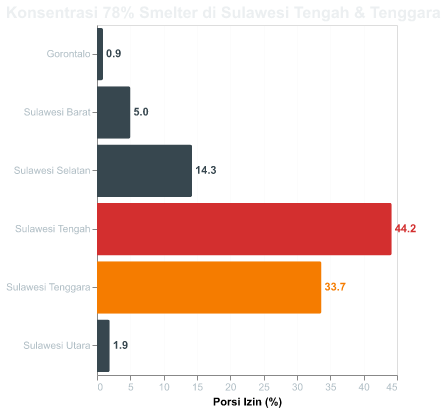

Fakta Data: Sebesar 78% dari total 778 fasilitas smelter terkonsentrasi di Sulawesi Tengah & Sulawesi Tenggara, menunjukkan adanya pemusatan beban lingkungan di wilayah sentra tersebut.

**Lihat Data Detail: Daftar Izin Smelter (PT & Lokasi)**

| nama_perusahaan                       | provinsi          | lokasi_izin                                                                               | komoditas                                                |   total_luas_ha |
|:--------------------------------------|:------------------|:------------------------------------------------------------------------------------------|:---------------------------------------------------------|----------------:|
| ANUGERAH JAYA BUANA                   | Sulawesi Selatan  | KAB. LUWU TIMUR                                                                           | Nikel                                                    |         2800    |
| CITRA LAMPIA MANDIRI                  | Sulawesi Selatan  | KAB. LUWU TIMUR                                                                           | Nikel                                                    |         2660    |
| DAYA GUNA GEMILANG                    | Sulawesi Selatan  | KAB. LUWU TIMUR                                                                           | Nikel                                                    |         4787    |
| ERA MARPADOT                          | Sulawesi Selatan  | KAB. LUWU TIMUR, KAB. KOLAKA UTARA                                                        | Nikel                                                    |         4301.5  |
| KAHALA MINERA                         | Sulawesi Selatan  | KAB. LUWU TIMUR                                                                           | Nikel                                                    |          900    |
| KOLAKA MINERAL RESOURCES              | Sulawesi Selatan  | KAB. BONE                                                                                 | Nikel                                                    |         2100    |
| LINGKE SULAWESI MINERAL               | Sulawesi Selatan  | KAB. LUWU TIMUR                                                                           | Nikel                                                    |          943    |
| MADUMA ASIH PRATAMA                   | Sulawesi Selatan  | KAB. LUWU TIMUR                                                                           | Nikel                                                    |         7069    |
| MITRA BERKARYA SEJATI                 | Sulawesi Selatan  | KAB. LUWU TIMUR                                                                           | Nikel                                                    |         3807    |
| PARAMOS REZEKI INDAH                  | Sulawesi Selatan  | KAB. LUWU TIMUR                                                                           | Nikel                                                    |         6639    |
| PONGKERU MINERAL UTAMA                | Sulawesi Selatan  | KAB. LUWU TIMUR                                                                           | Nikel                                                    |         4252    |
| PRIMA UTAMA LESTARI                   | Sulawesi Selatan  | KAB. LUWU TIMUR                                                                           | Nikel                                                    |         1419    |
| SANROY MITRA SAUDARA                  | Sulawesi Selatan  | KAB. LUWU TIMUR                                                                           | Nikel                                                    |         6378    |
| SULAWESI DAMAI MINERAL                | Sulawesi Selatan  | KAB. LUWU TIMUR                                                                           | Nikel                                                    |         1665    |
| SUMBER WAHAU JAYA                     | Sulawesi Selatan  | KAB. LUWU TIMUR                                                                           | Nikel                                                    |          303    |
| TAMBORA RAYA                          | Sulawesi Selatan  | KAB. LUWU TIMUR                                                                           | Nikel                                                    |         5082    |
| TIZAR TIRZIA TRIZARDI                 | Sulawesi Selatan  | KAB. LUWU TIMUR                                                                           | Nikel                                                    |         5668    |
| VIRGO PUSPITA LESTARI                 | Sulawesi Selatan  | KAB. LUWU TIMUR                                                                           | Nikel                                                    |         2698    |
| ALASKA DWIPA PERDANA                  | Sulawesi Tengah   | KAB. MOROWALI                                                                             | Nikel                                                    |          480    |
| AMANAT SEPUH LESTARI                  | Sulawesi Tengah   | KAB. MOROWALI                                                                             | Nikel                                                    |         2516    |
| ANEKA USAHA CEMERLANG                 | Sulawesi Tengah   | KAB. MOROWALI UTARA                                                                       | Nikel                                                    |         2814    |
| ANG AND FANG BROTHER                  | Sulawesi Tengah   | KAB. MOROWALI                                                                             | Nikel                                                    |          775    |
| ANUGERAH ARGA PRATAMA                 | Sulawesi Tengah   | KAB. MOROWALI                                                                             | Nikel                                                    |         1855    |
| ANUGERAH BANGUN MAKMUR                | Sulawesi Tengah   | KAB. BANGGAI                                                                              | Nikel                                                    |         4335    |
| ANUGERAH BUMI GEMILANG                | Sulawesi Tengah   | KAB. BANGGAI                                                                              | Nikel                                                    |         4100    |
| ANUGERAH SUMBER BUMI                  | Sulawesi Tengah   | KAB. BANGGAI                                                                              | Nikel                                                    |          199    |
| ANUGERAH TOMPIRA NIKEL                | Sulawesi Tengah   | KAB. BANGGAI                                                                              | Nikel                                                    |         1240    |
| ARTHA BUMI MINERAL                    | Sulawesi Tengah   | KAB. BOMBANA; KAB. MOROWALI, KAB. MOROWALI UTARA                                          | Nikel                                                    |         7112    |
| AULIA PRIMA PERKASA                   | Sulawesi Tengah   | KAB. MOROWALI UTARA                                                                       | Nikel                                                    |          339    |
| Abadi Nikel Nusantara                 | Sulawesi Tengah   | KAB. MOROWALI                                                                             | Nikel                                                    |         4871    |
| BANGGAI KENCANA PERMAI                | Sulawesi Tengah   | KAB. BANGGAI                                                                              | Nikel                                                    |        10024    |
| BANGGAI MANDIRI PRATAMA               | Sulawesi Tengah   | KAB. BANGGAI                                                                              | Nikel                                                    |         2267    |
| BHAKTIPUTRA PERSADA NUSANTARA         | Sulawesi Tengah   | KAB. MOROWALI UTARA                                                                       | Nikel                                                    |         7031.69 |
| BIMA CAKRA PERKASA MINERALINDO        | Sulawesi Tengah   | KAB. MOROWALI                                                                             | Nikel                                                    |          199    |
| BINEKA KARYA                          | Sulawesi Tengah   | KAB. MOROWALI                                                                             | Nikel                                                    |          970    |
| BINTANG SINAR PERKASA                 | Sulawesi Tengah   | KAB. MOROWALI                                                                             | Nikel                                                    |         1867.7  |
| BINTANGDELAPAN MINERAL                | Sulawesi Tengah   | KAB. MOROWALI                                                                             | Nikel                                                    |        20765    |
| BRATAMA MERCINDO ABADI                | Sulawesi Tengah   | KAB. MOROWALI                                                                             | Nikel                                                    |         1199    |
| BUKIT MAKMUR ISTINDO NIKELTAMA        | Sulawesi Tengah   | KAB. MOROWALI, KAB. MOROWALI UTARA                                                        | Nikel                                                    |         4778    |
| BUMI GEMILANG PERDANA                 | Sulawesi Tengah   | KAB. BANGGAI                                                                              | Nikel                                                    |          198    |
| BUMI INDAH SULTRA                     | Sulawesi Tengah   | KAB. MOROWALI UTARA                                                                       | Nikel                                                    |         8034    |
| BUMI KALAENA PERSADA                  | Sulawesi Tengah   | KAB. MOROWALI                                                                             | Nikel                                                    |          685    |
| BUMI MAKMUR GEMILANG                  | Sulawesi Tengah   | KAB. BANGGAI                                                                              | Nikel                                                    |         3447    |
| BUMI MATANO INDAH                     | Sulawesi Tengah   | KAB. MOROWALI                                                                             | Nikel                                                    |           32    |
| BUMI MOROWALI UTAMA                   | Sulawesi Tengah   | KAB. MOROWALI                                                                             | Nikel                                                    |         1963    |
| BUMI PERSADA SURYA PRATAMA            | Sulawesi Tengah   | KAB. BANGGAI                                                                              | Nikel                                                    |         7941    |
| BUMI ROUTA MINING                     | Sulawesi Tengah   | KAB. MOROWALI                                                                             | Nikel                                                    |         5690    |
| C-GONG PERKASA                        | Sulawesi Tengah   | KAB. BANGGAI                                                                              | Nikel                                                    |         3119    |
| CAHAYA GINDA GANDA                    | Sulawesi Tengah   | KAB. MOROWALI                                                                             | Nikel                                                    |         1942    |
| CAHAYA MURNI SEJAHTERA                | Sulawesi Tengah   | KAB. MOROWALI UTARA                                                                       | Nikel                                                    |         5428    |
| CAHYA ADITAMA TEKNINDO                | Sulawesi Tengah   | KAB. MOROWALI                                                                             | Nikel                                                    |          736    |
| CETARA BANGUN PERSADA                 | Sulawesi Tengah   | KAB. MOROWALI                                                                             | Nikel                                                    |          199    |
| CIPTA HUTAMA MARANTI                  | Sulawesi Tengah   | KAB. MOROWALI UTARA                                                                       | Nikel                                                    |          150.28 |
| CITRA ANGGUN BARATAMA                 | Sulawesi Tengah   | KAB. MOROWALI                                                                             | Nikel                                                    |         6080    |
| CITRA MOLAMAHU                        | Sulawesi Tengah   | KAB. BANGGAI                                                                              | Nikel                                                    |         1607    |
| COCOMAN                               | Sulawesi Tengah   | KAB. MOROWALI UTARA                                                                       | Nikel                                                    |          190    |
| CORE MINERAL RESOURCES                | Sulawesi Tengah   | KAB. BANGGAI                                                                              | Nikel                                                    |         2030    |
| DELAPAN INTI POWER                    | Sulawesi Tengah   | KAB. MOROWALI                                                                             | Nikel                                                    |         4941    |
| DUA SAUDARA NIKELINDO                 | Sulawesi Tengah   | KAB. MOROWALI                                                                             | Nikel                                                    |         1535    |
| EMAS HIJAU JAYA                       | Sulawesi Tengah   | KAB. MOROWALI                                                                             | Nikel                                                    |         3580    |
| ENERSTEEL                             | Sulawesi Tengah   | KAB. MOROWALI UTARA                                                                       | Nikel                                                    |          484    |
| ERABARU TIMUR LESTARI                 | Sulawesi Tengah   | KAB. MOROWALI                                                                             | Nikel                                                    |         1159    |
| FADLAN MULIA JAYA                     | Sulawesi Tengah   | KAB. MOROWALI                                                                             | Nikel                                                    |          199    |
| FAJAR PRIMA SUKSES                    | Sulawesi Tengah   | KAB. MOROWALI                                                                             | Nikel                                                    |          640    |
| GALIH INSTRUMENTASI                   | Sulawesi Tengah   | KAB. MOROWALI                                                                             | Nikel                                                    |         1621    |
| GEMA RIPAH PRATAMA                    | Sulawesi Tengah   | KAB. MOROWALI UTARA                                                                       | Nikel                                                    |          145    |
| GEMILANG BANGUN PERKASA               | Sulawesi Tengah   | KAB. BANGGAI                                                                              | Nikel                                                    |         4398    |
| GEMILANG MANDIRI PERKASA              | Sulawesi Tengah   | KAB. BANGGAI                                                                              | Nikel                                                    |         4677    |
| GENBA MULTI MINERAL                   | Sulawesi Tengah   | KAB. MOROWALI                                                                             | Nikel                                                    |         3744    |
| GHANESA WANA UTAMA                    | Sulawesi Tengah   | KAB. MOROWALI UTARA                                                                       | Nikel                                                    |          199.5  |
| GITA FLORA                            | Sulawesi Tengah   | KAB. MOROWALI                                                                             | Nikel                                                    |          624    |
| GRAHA MINING UTAMA                    | Sulawesi Tengah   | KAB. MOROWALI                                                                             | Nikel                                                    |         1726.53 |
| GUNUNG WANGI NIKELINDO                | Sulawesi Tengah   | KAB. MOROWALI UTARA                                                                       | Nikel                                                    |         5093    |
| HALMAHERA INTERNATIONAL RESOURCES     | Sulawesi Tengah   | KAB. MOROWALI UTARA                                                                       | Nikel                                                    |          750    |
| HARAPAN JAYA NIKELINDO                | Sulawesi Tengah   | KAB. MOROWALI                                                                             | Nikel                                                    |         1406    |
| HENGJAYA MINERALINDO                  | Sulawesi Tengah   | KAB. MOROWALI                                                                             | Nikel                                                    |         5983    |
| HERBINDO LIFE SANOBAR                 | Sulawesi Tengah   | KAB. MOROWALI                                                                             | Nikel                                                    |         1838    |
| HOFFMEN INTERNATIONAL                 | Sulawesi Tengah   | KAB. MOROWALI UTARA                                                                       | Nikel                                                    |          585    |
| INDICO SUKSES JAYA                    | Sulawesi Tengah   | KAB. BANGGAI                                                                              | Nikel                                                    |         1493    |
| INDOBERKAH JAYA MANDIRI               | Sulawesi Tengah   | KAB. MOROWALI                                                                             | Nikel                                                    |          196    |
| INDUSTRI TAMBANG UTAMA                | Sulawesi Tengah   | KAB. MOROWALI                                                                             | Nikel                                                    |          507    |
| INTEGRA MINING NUSANTARA INDONESIA    | Sulawesi Tengah   | KAB. BANGGAI                                                                              | Nikel                                                    |          199    |
| ITAMATRA NUSANTARA                    | Sulawesi Tengah   | KAB. MOROWALI UTARA                                                                       | Nikel                                                    |          974    |
| KEINZ VENTURA                         | Sulawesi Tengah   | KAB. MOROWALI UTARA                                                                       | Nikel                                                    |         1205    |
| KENCANA BUMI MINERAL                  | Sulawesi Tengah   | KAB. MOROWALI                                                                             | Nikel                                                    |         2549    |
| KENCANA NUSANTARA SAKTI               | Sulawesi Tengah   | KAB. MOROWALI                                                                             | Nikel                                                    |         2815    |
| KIMBERWAN INTERBUANA                  | Sulawesi Tengah   | KAB. MOROWALI                                                                             | Nikel                                                    |         3239    |
| KONINIS FAJAR MINERAL                 | Sulawesi Tengah   | KAB. BANGGAI                                                                              | Nikel                                                    |         2738    |
| KURNIA DEGESS RAPTAMA                 | Sulawesi Tengah   | KAB. MOROWALI                                                                             | Nikel                                                    |         6829    |
| LABOTA BAHODOPI SORAJAI               | Sulawesi Tengah   | KAB. MOROWALI                                                                             | Nikel                                                    |          608    |
| LAROENAI BUNGSEL SORAJAI              | Sulawesi Tengah   | KAB. MOROWALI                                                                             | Nikel                                                    |          256    |
| LUWUK GAS SEJATI                      | Sulawesi Tengah   | KAB. MOROWALI UTARA                                                                       | Nikel                                                    |         3172    |
| MACRO PURI INDAH PERKASA              | Sulawesi Tengah   | KAB. MOROWALI                                                                             | Nikel                                                    |         3480    |
| MAGHANTARA MULTIMEDIA NUSAPHALA       | Sulawesi Tengah   | KAB. MOROWALI                                                                             | Nikel                                                    |         2318    |
| MAHLIGAI ARTHA SEJAHTERA              | Sulawesi Tengah   | KAB. MOROWALI                                                                             | Nikel                                                    |          514    |
| MAKARTI PADABAHO SORAJAI              | Sulawesi Tengah   | KAB. MOROWALI                                                                             | Nikel                                                    |         1135    |
| MAKASSAR SUKSES SEJAHTERA             | Sulawesi Tengah   | KAB. MOROWALI                                                                             | Nikel                                                    |         1029    |
| MERPATI PRATAMA SUKSES                | Sulawesi Tengah   | KAB. BANGGAI                                                                              | Nikel                                                    |         2307    |
| MINERAL BUMI NUSANTARA                | Sulawesi Tengah   | KAB. MOROWALI                                                                             | Batu Gamping; Nikel                                      |          432    |
| MITRA JAYA PERKASA ABADI              | Sulawesi Tengah   | KAB. MOROWALI                                                                             | Nikel                                                    |         1086    |
| MITRA KARYA AGUNG LESTARI             | Sulawesi Tengah   | KAB. MOROWALI                                                                             | Nikel                                                    |          743    |
| MULAI DARI INDONESIA                  | Sulawesi Tengah   | KAB. MOROWALI                                                                             | Nikel                                                    |         3147    |
| MULIA PACIFIC RESOURCES               | Sulawesi Tengah   | KAB. MOROWALI UTARA                                                                       | Nikel                                                    |         4780    |
| MULIA TANGJONG                        | Sulawesi Tengah   | KAB. MOROWALI                                                                             | Nikel                                                    |         1000    |
| MULTI DINAR KARYA                     | Sulawesi Tengah   | KAB. TOJO UNA-UNA                                                                         | Nikel                                                    |        10800    |
| MULTI MENTARI INTERNUSA               | Sulawesi Tengah   | KAB. MOROWALI                                                                             | Nikel                                                    |          856    |
| NUSA MINERAL SEMESTA                  | Sulawesi Tengah   | KAB. MOROWALI                                                                             | Nikel                                                    |         1015    |
| NUSAJAYA PERSADATAMA MANDIRI          | Sulawesi Tengah   | KAB. MOROWALI                                                                             | Nikel                                                    |         1825    |
| ODDELL INDONESIA                      | Sulawesi Tengah   | KAB. MOROWALI                                                                             | Nikel                                                    |         3050    |
| OTI EYA ABADI                         | Sulawesi Tengah   | KAB. MOROWALI                                                                             | Nikel                                                    |         3339.23 |
| PALU BARUGA YAKU                      | Sulawesi Tengah   | KAB. MOROWALI UTARA                                                                       | Nikel                                                    |          249.7  |
| PAM MINERAL                           | Sulawesi Tengah   | KAB. MOROWALI                                                                             | Nikel                                                    |          198    |
| PANTAS INDOMINING                     | Sulawesi Tengah   | KAB. BANGGAI                                                                              | Nikel                                                    |         4458    |
| PENTA DHARMA KARSA                    | Sulawesi Tengah   | KAB. BANGGAI                                                                              | Nikel                                                    |         1220    |
| PINHARD INDONESIA                     | Sulawesi Tengah   | KAB. MOROWALI; KAB. MOROWALI UTARA                                                        | Nikel                                                    |         6813    |
| PRIMA BANGUN PERSADA NUSANTARA        | Sulawesi Tengah   | KAB. BANGGAI                                                                              | Nikel                                                    |         7139    |
| PRIMA DHARMA KARSA                    | Sulawesi Tengah   | KAB. BANGGAI                                                                              | Nikel                                                    |          938    |
| PT MITRA SULAWESI BERSAMA             | Sulawesi Tengah   | KAB. MOROWALI                                                                             | Nikel                                                    |          606    |
| PUTRA SULAWESI MINNING                | Sulawesi Tengah   | KAB. MOROWALI                                                                             | Nikel                                                    |          650    |
| PUTRI PERDANA                         | Sulawesi Tengah   | KAB. MOROWALI UTARA                                                                       | Nikel                                                    |          205.6  |
| RAIHAN CATURPUTRA                     | Sulawesi Tengah   | KAB. MOROWALI                                                                             | Nikel                                                    |          688    |
| REZKY UTAMA                           | Sulawesi Tengah   | KAB. MOROWALI UTARA                                                                       | Nikel                                                    |          200    |
| ROUDHOH PRATAMA                       | Sulawesi Tengah   | KAB. MOROWALI                                                                             | Nikel                                                    |          610    |
| SARANA ERANAS TAMBANG                 | Sulawesi Tengah   | KAB. MOROWALI                                                                             | Nikel                                                    |         1060    |
| SARANA MAJU CEMERLANG                 | Sulawesi Tengah   | KAB. MOROWALI                                                                             | Nikel                                                    |          538    |
| SARANA MINERALINDO PERKASA            | Sulawesi Tengah   | KAB. MOROWALI UTARA                                                                       | Nikel                                                    |         4656    |
| SELARAS MAJU                          | Sulawesi Tengah   | KAB. MOROWALI                                                                             | Nikel                                                    |          572    |
| SINAR KARYAGAMMA PRIMATAMA            | Sulawesi Tengah   | KAB. MOROWALI UTARA                                                                       | Nikel                                                    |         3596    |
| SINAR MAKMUR CEMERLANG                | Sulawesi Tengah   | KAB. BANGGAI                                                                              | Nikel                                                    |         3099    |
| SINOSTEEL INDONESIA MINING            | Sulawesi Tengah   | KAB. MOROWALI UTARA                                                                       | Nikel                                                    |         2038.7  |
| SUGICO PENDRAGON ENERGI               | Sulawesi Tengah   | KAB. MOROWALI                                                                             | Nikel                                                    |         8953    |
| SUMBER MINERAL ABADI                  | Sulawesi Tengah   | KAB. MOROWALI UTARA                                                                       | Nikel                                                    |         1948    |
| SUMBER PERMATA MINERAL                | Sulawesi Tengah   | KAB. MOROWALI                                                                             | Nikel                                                    |          176    |
| SUMBER PERMATA SELARAS                | Sulawesi Tengah   | KAB. MOROWALI UTARA                                                                       | Nikel                                                    |          424    |
| SUMBER SWARNA PRATAMA                 | Sulawesi Tengah   | KAB. MOROWALI; KAB. MOROWALI UTARA                                                        | Nikel                                                    |         6664    |
| SURYA AMINDO PERKASA                  | Sulawesi Tengah   | KAB. MOROWALI UTARA                                                                       | Nikel                                                    |          160    |
| SYNERGY BARAPRIMA GEMILANG            | Sulawesi Tengah   | KAB. MOROWALI                                                                             | Nikel                                                    |         1812    |
| TANJUNG BATANGA SAKTI                 | Sulawesi Tengah   | KAB. MOROWALI                                                                             | Nikel                                                    |          228.7  |
| TEKNIK ALUM SERVICE                   | Sulawesi Tengah   | KAB. MOROWALI                                                                             | Nikel                                                    |         1301    |
| TERATAI BINDO UTAMA                   | Sulawesi Tengah   | KAB. MOROWALI                                                                             | Nikel                                                    |          319.6  |
| TIGA BAJI                             | Sulawesi Tengah   | KAB. MOROWALI                                                                             | Nikel                                                    |          199    |
| TIGA DARA                             | Sulawesi Tengah   | KAB. BANGGAI, KAB. MOROWALI UTARA                                                         | Nikel                                                    |         1074    |
| TOPOGARO BUNGBAR SORAJAI              | Sulawesi Tengah   | KAB. MOROWALI                                                                             | Nikel                                                    |          148.8  |
| TOTAL PRIMA INDONESIA                 | Sulawesi Tengah   | KAB. MOROWALI; KAB. MOROWALI UTARA                                                        | Nikel                                                    |         4748    |
| TRINUSA BANGUN PERKASA                | Sulawesi Tengah   | KAB. MOROWALI UTARA                                                                       | Nikel                                                    |         1305    |
| TRINUSA DHARMA UTAMA                  | Sulawesi Tengah   | KAB. MOROWALI UTARA                                                                       | Nikel                                                    |           85    |
| USAHA KITA KINERJATAMA                | Sulawesi Tengah   | KAB. MOROWALI UTARA                                                                       | Nikel                                                    |         1209    |
| VITA INDAH SEJATI                     | Sulawesi Tengah   | KAB. MOROWALI                                                                             | Nikel                                                    |          993    |
| WAHIDA PERSADA                        | Sulawesi Tengah   | KAB. MOROWALI                                                                             | Nikel                                                    |         1386    |
| WARSITA KARYA                         | Sulawesi Tengah   | KAB. MOROWALI; KAB. MOROWALI UTARA                                                        | Nikel                                                    |          389    |
| WOSINDO MINERAL PERKASA               | Sulawesi Tengah   | KAB. MOROWALI                                                                             | Nikel                                                    |          395    |
| WOSINDO PERKASA                       | Sulawesi Tengah   | KAB. MOROWALI                                                                             | Nikel                                                    |          477    |
| YUDAF PERSADA JAYA                    | Sulawesi Tengah   | KAB. MOROWALI, KAB. MOROWALI UTARA                                                        | Nikel                                                    |         4151    |
| ADHI KARTIKO PRATAMA                  | Sulawesi Tenggara | KAB. KONAWE UTARA                                                                         | Nikel                                                    |         1975    |
| AGRABUDI BARAMULIA MANDIRI            | Sulawesi Tenggara | KAB. BOMBANA                                                                              | Nikel                                                    |         3940    |
| AKAR MAS INTERNASIONAL                | Sulawesi Tenggara | KAB. KOLAKA                                                                               | Nikel                                                    |          225    |
| ALAM RAYA INDAH                       | Sulawesi Tenggara | KAB. KONAWE UTARA                                                                         | Nikel                                                    |          196    |
| ALMHARIG                              | Sulawesi Tenggara | KAB. BOMBANA                                                                              | Nikel                                                    |         2018    |
| ALVINDO MINING RESOURCE               | Sulawesi Tenggara | KAB. KONAWE                                                                               | Nikel                                                    |         2439    |
| ANDALAN ENERGI NUSANTARA              | Sulawesi Tenggara | KAB. KONAWE                                                                               | Nikel                                                    |          403.2  |
| ANEKA TAMBANG                         | Sulawesi Tenggara | KAB. KOLAKA; KAB. KONAWE UTARA                                                            | Nikel                                                    |        29456.5  |
| ANUGRAH BUKIT BESAR                   | Sulawesi Tenggara | KAB. KOLAKA UTARA                                                                         | Nikel                                                    |         3982    |
| ANUGRAH LESTARI KENDARI               | Sulawesi Tenggara | KAB. KONAWE UTARA                                                                         | Nikel                                                    |         1060    |
| APOLLO NICKEL INDONESIA               | Sulawesi Tenggara | KAB. KONAWE UTARA                                                                         | Nikel                                                    |          106    |
| ARGA MORINI INDAH                     | Sulawesi Tenggara | KAB. BUTON TENGAH                                                                         | Nikel                                                    |         2834.96 |
| ARGA MORINI INDOTAMA                  | Sulawesi Tenggara | KAB. BUTON TENGAH                                                                         | Nikel                                                    |         1026    |
| BAKTI BUMI SULAWESI                   | Sulawesi Tenggara | KAB. BOMBANA                                                                              | Nikel                                                    |         4888    |
| BANGUN MEGA CEMERLANG                 | Sulawesi Tenggara | KAB. KONAWE UTARA                                                                         | Nikel                                                    |          199    |
| BERKAH TARULI JAYA                    | Sulawesi Tenggara | KAB. KONAWE                                                                               | Nikel                                                    |         1130    |
| BHUMI KARYA UTAMA                     | Sulawesi Tenggara | KAB. KONAWE UTARA                                                                         | Nikel                                                    |          310    |
| BHUMI SWADAYA MINERAL                 | Sulawesi Tenggara | KAB. KONAWE UTARA                                                                         | Nikel                                                    |          317    |
| BINANGA HARTAMA RAYA                  | Sulawesi Tenggara | KAB. KONAWE UTARA                                                                         | Nikel                                                    |          185    |
| BOLA DUNIA MANDIRI                    | Sulawesi Tenggara | KAB. KOLAKA                                                                               | Nikel                                                    |          260    |
| BOSOSI PRATAMA                        | Sulawesi Tenggara | KAB. KONAWE UTARA                                                                         | Nikel                                                    |         1850    |
| BOSOWA MINING                         | Sulawesi Tenggara | KAB. KONAWE UTARA                                                                         | Nikel                                                    |         1500    |
| BUMI DUA MINERAL                      | Sulawesi Tenggara | KAB. KOLAKA UTARA                                                                         | Nikel                                                    |          855    |
| BUMI KONAWE ABADI                     | Sulawesi Tenggara | KAB. KONAWE UTARA                                                                         | Nikel                                                    |          419.6  |
| BUMI KONAWE MINERINA                  | Sulawesi Tenggara | KAB. KONAWE UTARA                                                                         | Nikel                                                    |          616    |
| BUMI KONAWE MINING                    | Sulawesi Tenggara | KAB. KONAWE                                                                               | Nikel                                                    |         3175    |
| BUMI NIKEL NUSANTARA                  | Sulawesi Tenggara | KAB. KONAWE UTARA                                                                         | Nikel                                                    |          386.49 |
| BUMI SENTOSA JAYA                     | Sulawesi Tenggara | KAB. KONAWE UTARA                                                                         | Nikel                                                    |         1030    |
| CERIA NUGRAHA INDOTAMA                | Sulawesi Tenggara | KAB. KOLAKA                                                                               | Nikel                                                    |         6785    |
| CINTA JAYA                            | Sulawesi Tenggara | KAB. KONAWE UTARA                                                                         | Nikel                                                    |          309    |
| CIPTA DJAYA SELARAS MINING            | Sulawesi Tenggara | KAB. KONAWE UTARA                                                                         | Nikel                                                    |          634.8  |
| CIPTA DJAYA SURYA                     | Sulawesi Tenggara | KAB. KONAWE UTARA                                                                         | Nikel                                                    |          195.7  |
| CITRA ARYA SENTOSA HUTAMA             | Sulawesi Tenggara | KAB. KONAWE                                                                               | Nikel                                                    |          420    |
| CITRA SILIKA MALLAWA                  | Sulawesi Tenggara | KAB. KOLAKA UTARA                                                                         | Nikel                                                    |          475    |
| DAKA GROUP                            | Sulawesi Tenggara | KAB. KONAWE UTARA                                                                         | Nikel                                                    |          200    |
| DHARMA BUMI KOLAKA                    | Sulawesi Tenggara | KAB. KOLAKA                                                                               | Nikel                                                    |         1075    |
| DWIMITRA MULTIGUNA SEJAHTERA          | Sulawesi Tenggara | KAB. KONAWE UTARA                                                                         | Nikel                                                    |          130    |
| ELIT KHARISMA UTAMA                   | Sulawesi Tenggara | KAB. KONAWE UTARA                                                                         | Nikel                                                    |          496.1  |
| ENERGI PRIMA SENTOSA                  | Sulawesi Tenggara | KAB. KONAWE UTARA                                                                         | Nikel                                                    |         3638    |
| FATWA BUMI SEJAHTERA                  | Sulawesi Tenggara | KAB. KOLAKA UTARA                                                                         | Nikel                                                    |           99    |
| GEMA KREASI PERDANA                   | Sulawesi Tenggara | KAB. KONAWE; KAB. KONAWE KEPULAUAN                                                        | Nikel                                                    |         1808.9  |
| GEMILANG MULTI MINERAL                | Sulawesi Tenggara | KAB. KONAWE UTARA                                                                         | Nikel                                                    |         5645    |
| GENERASI AGUNG PERKASA                | Sulawesi Tenggara | KAB. KONAWE SELATAN                                                                       | Nikel                                                    |          584    |
| GEOMINERAL INTI PERKASA               | Sulawesi Tenggara | KAB. KONAWE UTARA                                                                         | Nikel                                                    |         1398    |
| GERBANG MULTI SEJAHTERA               | Sulawesi Tenggara | KAB. KONAWE SELATAN                                                                       | Nikel                                                    |         2301.62 |
| HIJRAH SAWITTO MARIORITA              | Sulawesi Tenggara | KAB. KONAWE                                                                               | Nikel                                                    |         5055.85 |
| HOMKEY INTI PRIMA                     | Sulawesi Tenggara | KAB. KONAWE                                                                               | Nikel                                                    |         4870    |
| IFISHDECO                             | Sulawesi Tenggara | KAB. KONAWE SELATAN                                                                       | Nikel                                                    |          920.2  |
| INDONUSA ARTA MULYA                   | Sulawesi Tenggara | KAB. KONAWE UTARA                                                                         | Nikel                                                    |          394    |
| INDRA BUMI MULIA                      | Sulawesi Tenggara | KAB. KONAWE UTARA                                                                         | Nikel                                                    |          198    |
| INDRABAKTI MUSTIKA                    | Sulawesi Tenggara | KAB. KONAWE UTARA                                                                         | Nikel                                                    |          576    |
| INTAN PERDHANA PUSPA                  | Sulawesi Tenggara | KAB. KONAWE                                                                               | Nikel                                                    |         3000    |
| INTEGRA MINING NUSANTARA              | Sulawesi Tenggara | KAB. KONAWE SELATAN                                                                       | Nikel                                                    |          100    |
| JAGAD RAYATAMA                        | Sulawesi Tenggara | KAB. KONAWE SELATAN                                                                       | Nikel                                                    |         1670    |
| KABAENA KROMIT PRATHAMA               | Sulawesi Tenggara | KAB. KONAWE UTARA                                                                         | Nikel                                                    |          102.6  |
| KACCI PURNAMA INDAH                   | Sulawesi Tenggara | KAB. KONAWE UTARA                                                                         | Nikel                                                    |          419    |
| KARYA ALAM ABADI                      | Sulawesi Tenggara | KAB. KONAWE UTARA                                                                         | Nikel                                                    |         1036    |
| KARYA ENERGI MAKMUR                   | Sulawesi Tenggara | KAB. KONAWE UTARA                                                                         | Nikel                                                    |         3803    |
| KARYA PUTRA KONTARA                   | Sulawesi Tenggara | KAB. KONAWE UTARA                                                                         | Nikel                                                    |         7672    |
| KARYATAMA KONAWE UTARA                | Sulawesi Tenggara | KAB. KONAWE UTARA                                                                         | Nikel                                                    |         3119    |
| KASMAR TIAR RAYA                      | Sulawesi Tenggara | KAB. KOLAKA UTARA                                                                         | Nikel                                                    |          955    |
| KELOMPOK DELAPAN INDONESIA            | Sulawesi Tenggara | KAB. KONAWE UTARA                                                                         | Nikel                                                    |          226.51 |
| KEMBAR EMAS SULTRA                    | Sulawesi Tenggara | KAB. KONAWE UTARA                                                                         | Nikel                                                    |          570    |
| KONAWE NIKEL NUSANTARA                | Sulawesi Tenggara | KAB. KONAWE UTARA                                                                         | Nikel                                                    |          373.8  |
| KONAWE UTARA INDO MINERAL MINING      | Sulawesi Tenggara | KAB. KONAWE UTARA                                                                         | Nikel                                                    |         2000    |
| KONUT JAYA MINERAL                    | Sulawesi Tenggara | KAB. KONAWE                                                                               | Nikel                                                    |          732.2  |
| KONUTARA PRIMA                        | Sulawesi Tenggara | KAB. KONAWE UTARA                                                                         | Nikel                                                    |         2827    |
| KONUTARA SEJATI                       | Sulawesi Tenggara | KAB. KONAWE UTARA                                                                         | Nikel                                                    |         1923    |
| LAEYA CIPTA GUNA                      | Sulawesi Tenggara | KAB. KONAWE SELATAN                                                                       | Nikel                                                    |         1185    |
| LAWAKI TIAR RAYA                      | Sulawesi Tenggara | KAB. KOLAKA UTARA                                                                         | Nikel                                                    |         3861    |
| MACIKA MADA MADANA                    | Sulawesi Tenggara | KAB. KONAWE SELATAN                                                                       | Nikel                                                    |          705    |
| MADANI SEJAHTERA                      | Sulawesi Tenggara | KAB. KONAWE UTARA                                                                         | Nikel                                                    |         2014    |
| MAKMUR LESTARI PRIMATAMA              | Sulawesi Tenggara | KAB. KONAWE UTARA                                                                         | Nikel                                                    |          407    |
| MANUNGGAL SARANA SURYA PRATAMA        | Sulawesi Tenggara | KAB. KONAWE UTARA                                                                         | Nikel                                                    |          284.92 |
| MANYOI MANDIRI                        | Sulawesi Tenggara | KAB. BOMBANA                                                                              | Nikel                                                    |         1731.62 |
| MARGO KARYA MANDIRI                   | Sulawesi Tenggara | KAB. BOMBANA                                                                              | Nikel                                                    |         2128    |
| MASEMPO DALLE                         | Sulawesi Tenggara | KAB. KONAWE UTARA                                                                         | Nikel                                                    |          103.2  |
| MEGA TAMBANG INDONESIA                | Sulawesi Tenggara | KAB. KONAWE SELATAN                                                                       | Nikel                                                    |         1758    |
| MEGA TAMBANG NIKEL                    | Sulawesi Tenggara | KAB. KONAWE SELATAN                                                                       | Nikel                                                    |         2466    |
| META ADHI PERDANA                     | Sulawesi Tenggara | KAB. KONAWE UTARA                                                                         | Nikel                                                    |          165.5  |
| MINING MAJU                           | Sulawesi Tenggara | KAB. KOLAKA UTARA                                                                         | Nikel                                                    |          227    |
| MITRA UTAMA RESOURCES                 | Sulawesi Tenggara | KAB. KONAWE UTARA                                                                         | Nikel                                                    |          237.9  |
| MODERN CAHAYA MAKMUR                  | Sulawesi Tenggara | KAB. KONAWE                                                                               | Nikel                                                    |         6575    |
| MODERN ENERGI MINERAL                 | Sulawesi Tenggara | KAB. KONAWE UTARA                                                                         | Nikel                                                    |         3364    |
| MUDA PRIMA INSAN                      | Sulawesi Tenggara | KAB. KONAWE                                                                               | Nikel                                                    |         1000    |
| MULIA MAKMUR PERKASA                  | Sulawesi Tenggara | KAB. KOLAKA UTARA                                                                         | Nikel                                                    |         2450    |
| MUSHAR UTAMA SULTRA                   | Sulawesi Tenggara | KAB. KONAWE UTARA                                                                         | Nikel                                                    |          136    |
| NARAYANA LAMBALE SELARAS              | Sulawesi Tenggara | KAB. BOMBANA                                                                              | Nikel                                                    |          414    |
| NIKELINDO SURYAKENCANA AGUNG          | Sulawesi Tenggara | KAB. KONAWE                                                                               | Nikel                                                    |         2654    |
| PANDU URANE PERKASA                   | Sulawesi Tenggara | KAB. KONAWE SELATAN                                                                       | Nikel                                                    |         1665    |
| PANJI NUGRAHA SAKTI                   | Sulawesi Tenggara | KAB. KONAWE SELATAN                                                                       | Nikel                                                    |         1883    |
| PARAMITHA PERSADA TAMA                | Sulawesi Tenggara | KAB. KONAWE UTARA                                                                         | Nikel                                                    |          175    |
| PATOWONUA CIPTA MANDIRI               | Sulawesi Tenggara | KAB. KONAWE UTARA                                                                         | Nikel                                                    |          197    |
| PATRINDO JAYA MAKMUR                  | Sulawesi Tenggara | KAB. KOLAKA UTARA                                                                         | Nikel                                                    |          500    |
| PD. ANEKA USAHA KOLAKA                | Sulawesi Tenggara | KAB. KOLAKA                                                                               | Nikel                                                    |          340    |
| PELANGI UTAMA JAYA MANDIRI            | Sulawesi Tenggara | KAB. KONAWE                                                                               | Nikel                                                    |         2375    |
| PERTAMBANGAN BUMI ANOA                | Sulawesi Tenggara | KAB. KONAWE SELATAN                                                                       | Nikel                                                    |          626    |
| PERTAMBANGAN BUMI INDONESIA           | Sulawesi Tenggara | KAB. KONAWE UTARA                                                                         | Nikel                                                    |         5923    |
| PERTAMBANGAN NICKEL SULAWESI TENGGARA | Sulawesi Tenggara | KAB. KOLAKA; KAB. KONAWE UTARA                                                            | Nikel                                                    |          647    |
| PRIMASTIAN METAL PRATAMA              | Sulawesi Tenggara | KAB. KONAWE UTARA                                                                         | Nikel                                                    |          102    |
| PUTRA DERMAWAN PRATAMA                | Sulawesi Tenggara | KAB. KOLAKA UTARA                                                                         | Nikel                                                    |          881    |
| PUTRA INTISULTRA PERKASA              | Sulawesi Tenggara | KAB. KONAWE UTARA                                                                         | Nikel                                                    |          261    |
| PUTRA KENDARI SEJAHTERA               | Sulawesi Tenggara | KAB. KONAWE UTARA                                                                         | Nikel                                                    |          218    |
| PUTRA KONAWE UTAMA                    | Sulawesi Tenggara | KAB. KONAWE UTARA                                                                         | Nikel                                                    |         4845    |
| PUTRA MEKONGGA SEJAHTERA              | Sulawesi Tenggara | KAB. KOLAKA                                                                               | Nikel                                                    |          388    |
| PUTRI GLORY ELSHADAY                  | Sulawesi Tenggara | KAB. KONAWE                                                                               | Nikel                                                    |         4086    |
| PUTRI WULANDARI                       | Sulawesi Tenggara | KAB. KONAWE UTARA                                                                         | Nikel                                                    |          168    |
| RANASPI ARYANORI                      | Sulawesi Tenggara | KAB. KOLAKA UTARA                                                                         | Nikel                                                    |         1050    |
| RAODAH BUMI SULTRA                    | Sulawesi Tenggara | KAB. KONAWE UTARA                                                                         | Nikel                                                    |         1699    |
| RIOTA JAYA LESTARI                    | Sulawesi Tenggara | KAB. KOLAKA UTARA                                                                         | Nikel                                                    |         3389.9  |
| RIZQI BIOKAS PRATAMA                  | Sulawesi Tenggara | KAB. KONAWE UTARA                                                                         | Nikel                                                    |          251    |
| RIZQI SINAR BIOKAS                    | Sulawesi Tenggara | KAB. KONAWE UTARA                                                                         | Nikel                                                    |          220    |
| ROHUL ENERGI INDONESIA                | Sulawesi Tenggara | KAB. BOMBANA                                                                              | Nikel                                                    |         3450    |
| ROSHINI INDONESIA                     | Sulawesi Tenggara | KAB. KONAWE UTARA                                                                         | Nikel                                                    |          109    |
| SAMBAS MINERALS MINING                | Sulawesi Tenggara | KAB. KONAWE SELATAN                                                                       | Nikel                                                    |         1008    |
| SENTRATAMA KARYA CEMERLANG            | Sulawesi Tenggara | KAB. KONAWE SELATAN                                                                       | Nikel                                                    |         1226    |
| SINAR JAYA SULTRA UTAMA               | Sulawesi Tenggara | KAB. KONAWE UTARA                                                                         | Nikel                                                    |          301    |
| ST NICKEL RESOURCES                   | Sulawesi Tenggara | KAB. KONAWE                                                                               | Nikel                                                    |         1818    |
| STARGATE DUA PASIFIC RESOURCES        | Sulawesi Tenggara | KAB. KONAWE UTARA                                                                         | Nikel                                                    |          461.1  |
| STARGATE PASIFIC RESOURCES            | Sulawesi Tenggara | KAB. KONAWE UTARA                                                                         | Nikel                                                    |         1213.2  |
| SUJUD BUMI BERKAH                     | Sulawesi Tenggara | KAB. KONAWE UTARA                                                                         | Nikel                                                    |          168    |
| SULAWESI CAHAYA MINERAL               | Sulawesi Tenggara | KAB. KONAWE                                                                               | Nikel                                                    |        21100    |
| SULEMANDARA KONAWE                    | Sulawesi Tenggara | KAB. KONAWE                                                                               | Nikel                                                    |          100    |
| SULTRA SARANA BUMI                    | Sulawesi Tenggara | KAB. KONAWE UTARA                                                                         | Nikel                                                    |         2630    |
| SUMBER BUMI PUTERA                    | Sulawesi Tenggara | KAB. KONAWE UTARA                                                                         | Nikel                                                    |          218.21 |
| SURIA LINTAS GEMILANG                 | Sulawesi Tenggara | KAB. KOLAKA                                                                               | Nikel                                                    |          760    |
| SURYA SAGA UTAMA                      | Sulawesi Tenggara | KAB. BOMBANA                                                                              | Nikel                                                    |         1299    |
| TAMBANG BUMI SULAWESI                 | Sulawesi Tenggara | KAB. BOMBANA                                                                              | Nikel                                                    |         1533    |
| TAMBANG INDONESIA SEJAHTERA           | Sulawesi Tenggara | KAB. KONAWE SELATAN                                                                       | Nikel                                                    |          831.15 |
| TAMBANG MATARAPE SEJAHTERA            | Sulawesi Tenggara | KAB. KONAWE UTARA                                                                         | Nikel                                                    |         1681    |
| TAMBANG MINERAL MAJU                  | Sulawesi Tenggara | KAB. KOLAKA UTARA                                                                         | Nikel                                                    |          738    |
| TAMBANG PUSAKA BUMI                   | Sulawesi Tenggara | KAB. KONAWE UTARA                                                                         | Nikel                                                    |          201.3  |
| TATARAN MEDIA SARANA                  | Sulawesi Tenggara | KAB. KONAWE UTARA                                                                         | Nikel                                                    |         1597    |
| TEKONINDO                             | Sulawesi Tenggara | KAB. BOMBANA                                                                              | Nikel                                                    |          531.3  |
| TIMAH INVESTASI MINERAL               | Sulawesi Tenggara | KAB. BOMBANA                                                                              | Nikel                                                    |          300    |
| TIRAN INDONESIA                       | Sulawesi Tenggara | KAB. KONAWE UTARA                                                                         | Nikel                                                    |         1411.35 |
| TITAN AGRO ABADI                      | Sulawesi Tenggara | KAB. KONAWE UTARA                                                                         | Nikel                                                    |         3029    |
| TONIA MITRA SEJAHTERA                 | Sulawesi Tenggara | KAB. BOMBANA                                                                              | Nikel                                                    |         5891    |
| TOSHIDA INDONESIA                     | Sulawesi Tenggara | KAB. KOLAKA                                                                               | Nikel                                                    |         5000    |
| TRIAS JAYA AGUNG                      | Sulawesi Tenggara | KAB. BOMBANA                                                                              | Nikel                                                    |          512    |
| TRISED MEGA CEMERLANG                 | Sulawesi Tenggara | KAB. KONAWE UTARA                                                                         | Nikel                                                    |          199    |
| TRISTACO MINERAL MAKMUR               | Sulawesi Tenggara | KAB. KONAWE UTARA                                                                         | Nikel                                                    |          138.9  |
| UNAAHA BAKTI PERSADA                  | Sulawesi Tenggara | KAB. KONAWE UTARA                                                                         | Nikel                                                    |          159    |
| VALE INDONESIA                        | Sulawesi Tenggara | KAB. KOLAKA; KAB. KOLAKA UTARA; KAB. MOROWALI, KAB. LUWU TIMUR                            | Nikel                                                    |       118017    |
| VISI DEBTINDO MINERAL                 | Sulawesi Tenggara | KAB. KONAWE SELATAN                                                                       | Nikel                                                    |          873.8  |
| WAJA INTI LESTARI                     | Sulawesi Tenggara | KAB. KOLAKA                                                                               | Nikel                                                    |          210.3  |
| WANGGUDU SUMBER MINERAL               | Sulawesi Tenggara | KAB. KONAWE UTARA                                                                         | Nikel                                                    |          203    |
| WAWONII MAKMUR JAYARAYA               | Sulawesi Tenggara | KAB. KONAWE                                                                               | Nikel                                                    |          950    |
| WIJAYA INTI NUSANTARA                 | Sulawesi Tenggara | KAB. KONAWE SELATAN                                                                       | Nikel                                                    |         1931    |
| WIJAYA NIKEL NUSANTARA                | Sulawesi Tenggara | KAB. KOLAKA                                                                               | Nikel                                                    |          110    |
| WISNU MANDIRI BATARA                  | Sulawesi Tenggara | KAB. KONAWE UTARA                                                                         | Nikel                                                    |          154.8  |
| YULAN PRATAMA                         | Sulawesi Tenggara | KAB. KONAWE UTARA                                                                         | Nikel                                                    |          107    |
| BERKAH DAYA MANDIRI                   | Gorontalo         | KAB. GORONTALO UTARA                                                                      | Batuan                                                   |          173    |
| KARYA JAYA BAROQAH                    | Gorontalo         | KAB. GORONTALO                                                                            | Diorit                                                   |            5.96 |
| LION GLOBAL ENERGI                    | Gorontalo         | KAB. GORONTALO                                                                            | Emas                                                     |         4981    |
| MITRA BERLIAN PRATAMA                 | Gorontalo         | KAB. GORONTALO UTARA                                                                      | Basalt                                                   |           46.3  |
| RAGAM TAMBANG INDONESIA               | Gorontalo         | KAB. GORONTALO                                                                            | Granodiorit                                              |            2.3  |
| RIZKILLAH                             | Gorontalo         | KAB. GORONTALO                                                                            | Diorit                                                   |            3.68 |
| WANHONG LOGISTIK MINERAL              | Gorontalo         | KOTA GORONTALO                                                                            | nan                                                      |          nan    |
| ABADI DUA PUTRI                       | Sulawesi Barat    | KAB. PASANGKAYU                                                                           | Kerikil Berpasir Alami (Sirtu)                           |            6    |
| ALAM SUMBER REZEKI                    | Sulawesi Barat    | KAB. MAMUJU TENGAH                                                                        | Kerikil Berpasir Alami (Sirtu)                           |           69.85 |
| ANEKA BARA LESTARI                    | Sulawesi Barat    | KAB. MAMUJU                                                                               | Andesit                                                  |          183.2  |
| ANUGERAH BATU ANDALAN                 | Sulawesi Barat    | KAB. MAMUJU                                                                               | Andesit                                                  |           93    |
| ANUGERAH BATU SILOPO                  | Sulawesi Barat    | KAB. POLEWALI MANDAR                                                                      | Andesit                                                  |           55.5  |
| AZ ZAHRA                              | Sulawesi Barat    | KAB. MAMUJU                                                                               | Batu Gunung Quarry Besar                                 |           55.2  |
| BINA MITRA TOPOYO                     | Sulawesi Barat    | KAB. MAMUJU TENGAH                                                                        | Pasir                                                    |            2.5  |
| BINTANG PRATAMA PERKASA MANDIRI       | Sulawesi Barat    | KAB. PASANGKAYU                                                                           | Kerikil Berpasir Alami (Sirtu)                           |            5    |
| BONEHAU PRIMA COAL                    | Sulawesi Barat    | KAB. MAMUJU                                                                               | Batubara                                                 |           98    |
| BUTTU BATU INDAH                      | Sulawesi Barat    | KAB. MAMASA                                                                               | Batu Gunung Quarry Besar                                 |            7.8  |
| CADAS INDUSTRI AZELIA MEKAR           | Sulawesi Barat    | KAB. MAJENE                                                                               | Batu Gunung Quarry Besar                                 |           31.63 |
| CAHAYA TIGA SAHABAT                   | Sulawesi Barat    | KAB. MAJENE                                                                               | Andesit                                                  |           45    |
| DWI PERKASA NUSANTARA                 | Sulawesi Barat    | KAB. PASANGKAYU                                                                           | Pasir                                                    |           74    |
| EMBRIO INTERNASIONAL INDONESIA        | Sulawesi Barat    | KAB. PASANGKAYU                                                                           | Pasir                                                    |           23.4  |
| FAUZAN                                | Sulawesi Barat    | KAB. PASANGKAYU                                                                           | Pasir                                                    |            8    |
| HASILINDO UTAMA INVESTAMA             | Sulawesi Barat    | KAB. POLEWALI MANDAR                                                                      | Andesit                                                  |           49.48 |
| HORAS MANDIRI TO MARIO                | Sulawesi Barat    | KAB. MAJENE                                                                               | Batu Gunung Quarry Besar                                 |           10.5  |
| INTI KARYA POLMAN                     | Sulawesi Barat    | KAB. POLEWALI MANDAR                                                                      | Galena                                                   |          776.06 |
| INTI KONSTRUKSI ABADI                 | Sulawesi Barat    | KAB. PASANGKAYU                                                                           | Kerikil Berpasir Alami (Sirtu)                           |            5.8  |
| IRA MANDIRI                           | Sulawesi Barat    | KAB. PASANGKAYU                                                                           | Pasir                                                    |            2.6  |
| ISCO IRON                             | Sulawesi Barat    | KAB. POLEWALI MANDAR                                                                      | Besi                                                     |          943    |
| ISCO POLMAN RESOURCES                 | Sulawesi Barat    | KAB. POLEWALI MANDAR                                                                      | Timbal                                                   |          199    |
| JAYA PASIR ANDALAN                    | Sulawesi Barat    | KAB. MAMUJU                                                                               | Kerikil Berpasir Alami (Sirtu)                           |           13.9  |
| KULAKA JAYA PERKASA                   | Sulawesi Barat    | KAB. PASANGKAYU                                                                           | Pasir Laut                                               |         1000    |
| LIBAS PERKASA NUSANTARA               | Sulawesi Barat    | KAB. PASANGKAYU                                                                           | Pasir                                                    |           36.1  |
| MANAKARRA MULTI MINING                | Sulawesi Barat    | KAB. MAMUJU                                                                               | Mangan                                                   |          132    |
| MANDAR PRIMA AGUNG                    | Sulawesi Barat    | KAB. POLEWALI MANDAR                                                                      | Batu Gunung Quarry Besar                                 |           98.2  |
| Maju Bersama                          | Sulawesi Barat    | KAB. PASANGKAYU                                                                           | Pasir                                                    |           24.7  |
| NUSANTARA MINING SEMESTA              | Sulawesi Barat    | KAB. MAMUJU                                                                               | Batu Gunung Quarry Besar                                 |           94.5  |
| PASIR PUTRA UTAMA                     | Sulawesi Barat    | KAB. MAMUJU TENGAH                                                                        | Kerikil Berpasir Alami (Sirtu)                           |           17.25 |
| PILAR BATU SULAWESI                   | Sulawesi Barat    | KAB. MAMUJU                                                                               | Batu Gunung Quarry Besar                                 |           97.6  |
| POLEMAJU MINERAL MANDIRI              | Sulawesi Barat    | KAB. MAMUJU                                                                               | Andesit                                                  |           79    |
| PUTRA BONDE MAHATIDANA                | Sulawesi Barat    | KAB. MAJENE                                                                               | Batu Gunung Quarry Besar                                 |           16.6  |
| RAMA KARYA CIPTA                      | Sulawesi Barat    | KAB. MAMUJU                                                                               | Kerikil Berpasir Alami (Sirtu)                           |            5.24 |
| SAMUDRA PANTOLOAN                     | Sulawesi Barat    | KAB. PASANGKAYU                                                                           | Kerikil Berpasir Alami (Sirtu)                           |           14    |
| TAKODO PERKASA                        | Sulawesi Barat    | KAB. POLEWALI MANDAR                                                                      | Batu Gunung Quarry Besar                                 |           20    |
| TOPAZ PERKASA                         | Sulawesi Barat    | KAB. MAMUJU TENGAH                                                                        | Batu Gunung Quarry Besar                                 |            3.6  |
| WAHAB TOLA                            | Sulawesi Barat    | KAB. PASANGKAYU                                                                           | Pasir                                                    |            1.42 |
| YAKUSA TOLELO NUSANTARA               | Sulawesi Barat    | KAB. MAMUJU TENGAH                                                                        | Pasir                                                    |           25    |
| ADE RESKY SEJAHTERA                   | Sulawesi Selatan  | KAB. ENREKANG                                                                             | Marmer                                                   |          100    |
| AEPRRA ENERGI PERSADA                 | Sulawesi Selatan  | KAB. LUWU TIMUR                                                                           | Batu Gamping untuk Industri                              |           35.83 |
| AL FADJRI                             | Sulawesi Selatan  | KAB. BONE BOLANGO                                                                         | Granodiorit                                              |           24    |
| ALAQAH MALLEWA SEJAHTERA              | Sulawesi Selatan  | KAB. LUWU                                                                                 | Batu Gunung Quarry Besar                                 |           40.32 |
| ALI MINING KONSTRUKSI                 | Sulawesi Selatan  | KAB. MAROS                                                                                | Tanah Urug                                               |           46.29 |
| ALIFQA PRADANA GROUP                  | Sulawesi Selatan  | KAB. BONE                                                                                 | Batu Gamping                                             |           10.28 |
| ALIM PERKASA                          | Sulawesi Selatan  | KAB. LUWU                                                                                 | Kerikil Berpasir Alami (Sirtu)                           |           48.71 |
| ALL BAROKAH SENTOSA                   | Sulawesi Selatan  | KAB. BARRU                                                                                | Tras                                                     |            8.28 |
| ANATO GROUP                           | Sulawesi Selatan  | KAB. PINRANG                                                                              | Batu Gunung Quarry Besar                                 |            9.48 |
| ANDRY BINTANG CEMERLANG               | Sulawesi Selatan  | KAB. BONE                                                                                 | Batu Gamping untuk Industri                              |           48.22 |
| ANUGERAH TEHNIK UTAMA                 | Sulawesi Selatan  | KAB. LUWU TIMUR                                                                           | Kerikil Berpasir Alami (Sirtu)                           |            5.9  |
| ANUGRAH EMAS BINTANG CEMERLANG        | Sulawesi Selatan  | KAB. MAROS                                                                                | Kerikil Berpasir Alami (Sirtu)                           |           29.93 |
| ANUGRAH NUR TOMBOLO                   | Sulawesi Selatan  | KAB. MAROS                                                                                | Batu Gamping                                             |           57.08 |
| ARABYAN KARUNIA JAYA                  | Sulawesi Selatan  | KAB. BULUKUMBA                                                                            | Batu Gamping untuk Industri                              |           45.27 |
| ARTESIS INDONESIA                     | Sulawesi Selatan  | KAB. BONE                                                                                 | Tembaga                                                  |         7614    |
| ASAS ANUGERAH BERKAH                  | Sulawesi Selatan  | KAB. BONE BOLANGO                                                                         | Andesit                                                  |            2    |
| ASFHIA BERKAH ABADI                   | Sulawesi Selatan  | KAB. WAJO                                                                                 | Tanah Urug                                               |            6.41 |
| ASTRICKY JAYA                         | Sulawesi Selatan  | KAB. BULUKUMBA                                                                            | Batu Gamping untuk Industri; Tanah Urug                  |           98.2  |
| ATNUR PRIMA MANDIRI                   | Sulawesi Selatan  | KAB. PINRANG                                                                              | Pasir                                                    |           12.9  |
| BANTENG BUANA INDONESIA               | Sulawesi Selatan  | KAB. GOWA                                                                                 | Andesit                                                  |           17.5  |
| BATU SIKUKU                           | Sulawesi Selatan  | KAB. LUWU                                                                                 | Kerikil Berpasir Alami (Sirtu)                           |            8.16 |
| BEDDU COTTANG BACO                    | Sulawesi Selatan  | KAB. BONE                                                                                 | Pasir                                                    |           80.4  |
| BENJALA BUMI BERKAH                   | Sulawesi Selatan  | KAB. BULUKUMBA                                                                            | Tanah Urug                                               |           12.42 |
| BENTENG UTAMA GROUP                   | Sulawesi Selatan  | KAB. BONE                                                                                 | Pasir                                                    |           60.72 |
| BENUA BORNOE KENCANA                  | Sulawesi Selatan  | KAB. WAJO                                                                                 | Kerikil Berpasir Alami (Sirtu)                           |           11.12 |
| BINTANG UTAMA ABADI                   | Sulawesi Selatan  | KAB. LUWU                                                                                 | Galena                                                   |          377    |
| BINTANG UTAMA MANYAMPA                | Sulawesi Selatan  | KAB. BULUKUMBA                                                                            | Tanah Urug                                               |           38.12 |
| BUKIT EMAS SINJAI                     | Sulawesi Selatan  | KAB. SINJAI                                                                               | Batu Gunung Quarry Besar                                 |           11    |
| BULU TAMMANGURA                       | Sulawesi Selatan  | KAB. MAROS                                                                                | Andesit; Tanah Urug                                      |           28.99 |
| BUMI BARRU SEJAHTERA                  | Sulawesi Selatan  | KAB. BARRU                                                                                | Kerikil Berpasir Alami (Sirtu)                           |            6    |
| BUMI TIRE PERSADA                     | Sulawesi Selatan  | KAB. BULUKUMBA                                                                            | Batu Gamping                                             |           40.91 |
| CAHAYA MAULANA                        | Sulawesi Selatan  | KAB. PINRANG                                                                              | Pasir                                                    |            7.29 |
| CAHAYA SAGA UTAMA                     | Sulawesi Selatan  | KAB. BARRU                                                                                | Tras                                                     |            9.5  |
| CELEBES BONE MINERAL                  | Sulawesi Selatan  | KAB. BONE BOLANGO                                                                         | Tembaga                                                  |        13195    |
| CHRISTINA EXPLO MINING                | Sulawesi Selatan  | KAB. TANA TORAJA                                                                          | Galena                                                   |         3200    |
| CIKAL MAS SEMESTA                     | Sulawesi Selatan  | KAB. GOWA                                                                                 | Kerikil Berpasir Alami (Sirtu)                           |           20.75 |
| CIPTA BETON SINAR PERKASA             | Sulawesi Selatan  | KAB. GOWA                                                                                 | Kerikil Berpasir Alami (Sirtu)                           |            6.47 |
| DIEGO PUTRA KONSTRUKSI                | Sulawesi Selatan  | KAB. TAKALAR                                                                              | Batu Gunung Quarry Besar                                 |           30.64 |
| FADILAH UTAMA SEJAHTERA               | Sulawesi Selatan  | KAB. BARRU                                                                                | Pasir Kuarsa                                             |           13.3  |
| GARASI SEMBILAN TUJUH                 | Sulawesi Selatan  | KAB. SINJAI                                                                               | Tanah Urug                                               |            5.82 |
| GORONTALO MINERALS                    | Sulawesi Selatan  | KAB. BONE BOLANGO                                                                         | Emas                                                     |        24995    |
| GRAND MARMER ALAM SERASI              | Sulawesi Selatan  | KAB. MAROS                                                                                | Marmer                                                   |           35    |
| HADAF KARYA MANDIRI                   | Sulawesi Selatan  | KAB. ENREKANG                                                                             | Emas                                                     |         1000    |
| HASNI GORONTALO SEJAHTERA             | Sulawesi Selatan  | KAB. BONE BOLANGO                                                                         | Andesit                                                  |            3    |
| ILHAM AFIQ MANDIRI                    | Sulawesi Selatan  | KAB. PINRANG                                                                              | Batu Gunung Quarry Besar                                 |           13.15 |
| ILHAM JAYA PUTRA                      | Sulawesi Selatan  | KAB. MAROS                                                                                | Kerikil Berpasir Alami (Sirtu)                           |            6.69 |
| JASA SUMBER GALIAN                    | Sulawesi Selatan  | KOTA PALOPO                                                                               | Tanah Urug                                               |            9.7  |
| JUNIOR MANDIRI                        | Sulawesi Selatan  | KAB. LUWU TIMUR                                                                           | Tanah Urug                                               |            3.91 |
| KALLA AREBAMMA                        | Sulawesi Selatan  | KAB. LUWU UTARA; KAB. MAMUJU                                                              | Besi; Emas; Tembaga                                      |        20173    |
| KALOMANG BIRU PERSADA                 | Sulawesi Selatan  | KAB. BARRU                                                                                | Batu Gamping untuk Industri; Pasir Kuarsa                |         1109.08 |
| LAKERA BUM BERKARYA                   | Sulawesi Selatan  | KAB. PINRANG                                                                              | Batu Gunung Quarry Besar                                 |           30.5  |
| LIMA TUJU TUJU                        | Sulawesi Selatan  | KAB. MAROS                                                                                | Tanah Urug                                               |           36.17 |
| MANREPO TAMBANG REMPOA                | Sulawesi Selatan  | KAB. MAROS                                                                                | Batu Gunung Quarry Besar; Tanah Urug                     |           55.14 |
| MASMINDO DWI AREA                     | Sulawesi Selatan  | KAB. LUWU                                                                                 | Emas                                                     |        14390    |
| MATTAPPA                              | Sulawesi Selatan  | KAB. WAJO                                                                                 | Pasir                                                    |            6.55 |
| MATTIRO DECENG LUTIM                  | Sulawesi Selatan  | KAB. LUWU TIMUR                                                                           | Batu Gunung Quarry Besar                                 |           17.03 |
| MEGA BATU MATTIROWALIE                | Sulawesi Selatan  | KAB. SOPPENG                                                                              | Batu Gunung Quarry Besar                                 |           13.71 |
| MERDEKA MINERAL INDONESIA             | Sulawesi Selatan  | KAB. BONE                                                                                 | Besi                                                     |         6067    |
| MINERAL BUKIT HARAPAN                 | Sulawesi Selatan  | KAB. MAROS                                                                                | Batu Gunung Quarry Besar                                 |           22.47 |
| MITRA ANUGRAH                         | Sulawesi Selatan  | KAB. BONE BOLANGO                                                                         | Batuan                                                   |           43.75 |
| MUDA BERSATU DJAYA                    | Sulawesi Selatan  | KAB. LUWU                                                                                 | Kuarsit                                                  |          196    |
| NETRAL PINRANG                        | Sulawesi Selatan  | KAB. PINRANG                                                                              | Batu Gunung Quarry Besar                                 |           16.6  |
| NUSANTARA RESOURCES JAYAUTAMA         | Sulawesi Selatan  | KAB. MAROS                                                                                | Marmer                                                   |           19.58 |
| OPTIMA JAYA SAKTI                     | Sulawesi Selatan  | KAB. GOWA                                                                                 | Kerikil Berpasir Alami (Sirtu)                           |            8.95 |
| ORION MEA LUTIM                       | Sulawesi Selatan  | KAB. LUWU TIMUR                                                                           | Kerikil Berpasir Alami (Sirtu)                           |           32.41 |
| PANCA DIGITAL SOLUTION                | Sulawesi Selatan  | KAB. LUWU TIMUR                                                                           | Besi                                                     |         1497.08 |
| PASIR PUTIH RADDA                     | Sulawesi Selatan  | KAB. LUWU UTARA                                                                           | Pasir                                                    |            6.4  |
| PATRI                                 | Sulawesi Selatan  | KAB. LUWU UTARA                                                                           | Pasir                                                    |            3.53 |
| PIRANTI JAGADRAYA                     | Sulawesi Selatan  | KAB. LUWU                                                                                 | Kerikil Berpasir Alami (Sirtu)                           |           11.76 |
| PONRO KANNI                           | Sulawesi Selatan  | KAB. PINRANG                                                                              | Batu Gunung Quarry Besar                                 |           16.66 |
| PUTRA TUNGGAL CEMERLANG               | Sulawesi Selatan  | KAB. GOWA                                                                                 | Kerikil Berpasir Alami (Sirtu)                           |            6.14 |
| RAGA UTAMA                            | Sulawesi Selatan  | KAB. MAROS                                                                                | Tanah Urug                                               |            9.8  |
| REKHABILA UTAMA                       | Sulawesi Selatan  | KAB. BARRU                                                                                | Tras                                                     |           20.73 |
| REZKY BATU KAPUR                      | Sulawesi Selatan  | KAB. BONE                                                                                 | Batu Gamping                                             |          199.31 |
| SANUSI KARSA TAMA BANGUNAN            | Sulawesi Selatan  | KAB. MAROS                                                                                | Batu Gunung Quarry Besar                                 |           42.97 |
| SARANG TENGNGE' TANDEALLOANAN         | Sulawesi Selatan  | KAB. TANA TORAJA                                                                          | Batu Gamping                                             |            5    |
| SEMEN BOSOWA MAROS                    | Sulawesi Selatan  | KAB. MAROS                                                                                | Batu Gamping untuk Industri; Clay                        |          826.86 |
| SINAR FADLI                           | Sulawesi Selatan  | KAB. BARRU                                                                                | Kerikil Berpasir Alami (Sirtu)                           |            5.09 |
| SINAR MALIBA MANDIRI                  | Sulawesi Selatan  | KAB. ENREKANG                                                                             | Batu Gunung Quarry Besar                                 |            6.79 |
| SINAR MARS                            | Sulawesi Selatan  | KAB. ENREKANG                                                                             | Kerikil Berpasir Alami (Sirtu)                           |            5.05 |
| STAR MITRA SULAWESI                   | Sulawesi Selatan  | KAB. LUWU TIMUR                                                                           | Kerikil Berpasir Alami (Sirtu)                           |            9.33 |
| SURYA PERKASA GLOBAL                  | Sulawesi Selatan  | KAB. MAROS                                                                                | Tanah Urug                                               |           33.29 |
| SURYA PERKASA MINERAL                 | Sulawesi Selatan  | KAB. MAROS; KAB. PINRANG                                                                  | Batu Gunung Quarry Besar; Clay                           |           30.1  |
| SYARIF HIDAYATULLAH                   | Sulawesi Selatan  | KAB. WAJO                                                                                 | Pasir                                                    |            6.09 |
| Sumber Karunia Perkasa                | Sulawesi Selatan  | KAB. GOWA                                                                                 | Kerikil Berpasir Alami (Sirtu)                           |           13.98 |
| TANETE MULIA PAKORO                   | Sulawesi Selatan  | KAB. PINRANG                                                                              | Batu Gunung Quarry Besar                                 |           60.5  |
| TEPPO TAMBANG PACIFIC                 | Sulawesi Selatan  | KAB. LUWU UTARA                                                                           | Pasir                                                    |            8    |
| TRI PUTRA COPPO                       | Sulawesi Selatan  | KAB. BARRU                                                                                | Peridotit                                                |           11.09 |
| TRINUSA RESOURCES                     | Sulawesi Selatan  | KAB. SINJAI                                                                               | Emas                                                     |        11326    |
| TUNGGAL PUTRA BONE PUTE               | Sulawesi Selatan  | KAB. BONE                                                                                 | Batu Gunung Quarry Besar                                 |           13.56 |
| USFATINDO                             | Sulawesi Selatan  | KAB. PINRANG                                                                              | Batu Gunung Quarry Besar                                 |           77.79 |
| WIJAYA EKA SAKTI                      | Sulawesi Selatan  | KAB. BONE                                                                                 | Tembaga                                                  |        10000    |
| ZAYN AL RAJHI                         | Sulawesi Selatan  | KAB. LUWU TIMUR                                                                           | Tanah Urug                                               |           15.8  |
| A RASMAMULIA                          | Sulawesi Tengah   | KAB. DONGGALA                                                                             | Kerikil Berpasir Alami (Sirtu)                           |           33.35 |
| AAL RIZKI TAMBANG PALU                | Sulawesi Tengah   | KAB. DONGGALA                                                                             | Batu Gunung Quarry Besar                                 |           95.7  |
| ABDARA BRM TAMBANG                    | Sulawesi Tengah   | KAB. DONGGALA                                                                             | Batu Gunung Quarry Besar                                 |           39.63 |
| ACES SELARAS                          | Sulawesi Tengah   | KOTA PALU                                                                                 | Batu Gunung Quarry Besar                                 |           19.79 |
| ADI RACHMAT MANDIRI                   | Sulawesi Tengah   | KAB. DONGGALA                                                                             | Kerikil Berpasir Alami (Sirtu)                           |            6.35 |
| AFIT LINTAS JAYA                      | Sulawesi Tengah   | KAB. MOROWALI UTARA                                                                       | Batu Gamping                                             |           67.99 |
| ALAM QUARRY PRATAMA                   | Sulawesi Tengah   | KAB. DONGGALA                                                                             | Batu Gunung Quarry Besar                                 |           17    |
| ALPHA OMEGA PERSADA                   | Sulawesi Tengah   | KAB. DONGGALA                                                                             | Batu Gunung Quarry Besar                                 |           43.93 |
| AMARSHA                               | Sulawesi Tengah   | KAB. SIGI                                                                                 | Pasir                                                    |           15    |
| ANUGERAH BATU PUTIH                   | Sulawesi Tengah   | KAB. MOROWALI                                                                             | Batu Gamping                                             |          502.28 |
| ANUGERAH PERDANA MEMBANGUN            | Sulawesi Tengah   | KAB. DONGGALA                                                                             | Kerikil Berpasir Alami (Sirtu)                           |           15    |
| ANUGRAH AFIT ABADI                    | Sulawesi Tengah   | KAB. MOROWALI UTARA                                                                       | Batu Gamping untuk Industri                              |           83.7  |
| ANUGRAH BATU AMPANA                   | Sulawesi Tengah   | KAB. TOJO UNA-UNA                                                                         | Kerikil Berpasir Alami (Sirtu)                           |          387.09 |
| ANUGRAH BATU SULAWESI RESOURCES       | Sulawesi Tengah   | KAB. TOLI TOLI                                                                            | Batuan                                                   |           47.82 |
| ANUGRAH RAYA KALTINDO                 | Sulawesi Tengah   | KOTA PALU                                                                                 | Kerikil Berpasir Alami (Sirtu)                           |           10.6  |
| ARFIDI SUKSES MANDIRI                 | Sulawesi Tengah   | KAB. DONGGALA                                                                             | Diorit                                                   |           39    |
| ARGASARI PRATAMA                      | Sulawesi Tengah   | KAB. DONGGALA                                                                             | Kerikil Berpasir Alami (Sirtu)                           |           15.77 |
| ARIFIN CHAN MALINDO                   | Sulawesi Tengah   | KAB. DONGGALA                                                                             | Batu Gunung Quarry Besar                                 |           18.5  |
| ASET SULAWESI MINERALINDO             | Sulawesi Tengah   | KAB. MOROWALI                                                                             | Batu Gamping                                             |          166.66 |
| ASIA AMANAH MANDIRI                   | Sulawesi Tengah   | KAB. DONGGALA                                                                             | Batu Gunung Quarry Besar                                 |           10.47 |
| ASSAQTI MORUT ENERGY                  | Sulawesi Tengah   | KAB. MOROWALI UTARA                                                                       | Pasir                                                    |           24.5  |
| AURORA CAHAYA LESTARI                 | Sulawesi Tengah   | KAB. BANGGAI KEPULAUAN                                                                    | Batu Gamping                                             |          113.7  |
| BAHOEA ALAM JAYA                      | Sulawesi Tengah   | KAB. MOROWALI                                                                             | Kerikil Berpasir Alami (Sirtu)                           |           38.56 |
| BAHTERA BERKAH ABADI GRUP             | Sulawesi Tengah   | KOTA PALU                                                                                 | Batu Gunung Quarry Besar                                 |            9.5  |
| BAKAL MAJU                            | Sulawesi Tengah   | KAB. DONGGALA                                                                             | Batu Gunung Quarry Besar                                 |           20.6  |
| BALQIS REZA REVOLO                    | Sulawesi Tengah   | KAB. DONGGALA                                                                             | Batu Gunung Quarry Besar                                 |           30    |
| BANUA INANTA CEMERLANG                | Sulawesi Tengah   | KAB. DONGGALA                                                                             | Batu Gunung Quarry Besar                                 |           43    |
| BARA MITRA ANDALAN SEJAHTRA           | Sulawesi Tengah   | KOTA PALU                                                                                 | Batuan                                                   |           16.88 |
| BAROKAH SEJAHTERA WATUSAMPU           | Sulawesi Tengah   | KOTA PALU                                                                                 | Batu Gunung Quarry Besar                                 |           10.3  |
| BAROKAH WATUSAMPU                     | Sulawesi Tengah   | KOTA PALU                                                                                 | Andesit                                                  |            7.05 |
| BARU TERBIT                           | Sulawesi Tengah   | KAB. DONGGALA                                                                             | Kerikil Berpasir Alami (Sirtu)                           |           13.98 |
| BATU ALAM PRIMA                       | Sulawesi Tengah   | KAB. MOROWALI                                                                             | Batu Gamping                                             |           22.02 |
| BATU ALAM SUMBER SEJAHTERA            | Sulawesi Tengah   | KAB. DONGGALA                                                                             | Batu Gunung Quarry Besar                                 |           25    |
| BATU AMPANA SEJAHTERA                 | Sulawesi Tengah   | KAB. TOJO UNA-UNA                                                                         | Batu Gunung Quarry Besar                                 |          153.8  |
| BATU HITAM JASA PERTAMBANGAN          | Sulawesi Tengah   | KAB. DONGGALA                                                                             | Andesit                                                  |           43.21 |
| BATU TAMBANG SAMBALAGI                | Sulawesi Tengah   | KAB. MOROWALI                                                                             | Batu Gamping                                             |          193.16 |
| BATUAN UNGGUL PERKASA                 | Sulawesi Tengah   | KAB. MOROWALI                                                                             | Batu Gamping untuk Industri                              |         1136.63 |
| BATUJAYA BERSAMA SEJAHTERA            | Sulawesi Tengah   | KAB. DONGGALA                                                                             | Batu Gunung Quarry Besar                                 |           86    |
| BATULICIN BARAMEGA                    | Sulawesi Tengah   | KAB. DONGGALA                                                                             | Andesit                                                  |           43.15 |
| BERKAH BATU BANAWA                    | Sulawesi Tengah   | KAB. DONGGALA                                                                             | Batu Gunung Quarry Besar                                 |           20    |
| BERKAH BATU SENTOSA                   | Sulawesi Tengah   | KAB. DONGGALA                                                                             | Batu Gunung Quarry Besar                                 |           47.87 |
| BERKAH MITRA SENTOSA SEJAHTERA        | Sulawesi Tengah   | KAB. TOLI TOLI                                                                            | Kerikil Berpasir Alami (Sirtu)                           |           27.6  |
| BERKAH UTAMA MOROWALI                 | Sulawesi Tengah   | KAB. MOROWALI                                                                             | Kerikil Berpasir Alami (Sirtu)                           |           19.77 |
| BINA DAYA LAHAN PERTIWI               | Sulawesi Tengah   | KAB. BUOL                                                                                 | Emas                                                     |         3836    |
| BINTANG CEMERLANG MINERAL MORUT       | Sulawesi Tengah   | KAB. MOROWALI UTARA                                                                       | Batu Gamping                                             |           97.8  |
| BINTANG MANUNGGAL PERSADA             | Sulawesi Tengah   | KOTA PALU                                                                                 | Batu Gunung Quarry Besar                                 |           17.17 |
| BINTANG MINING UTAMA                  | Sulawesi Tengah   | KAB. MOROWALI UTARA                                                                       | Batu Gamping                                             |           97.83 |
| BIOMAS INTERNASIONAL                  | Sulawesi Tengah   | KAB. MOROWALI                                                                             | Batu Gamping                                             |          180    |
| BOBBY CHANDRA GLOBAL INDONESIA        | Sulawesi Tengah   | KAB. BANGGAI                                                                              | Batu Gamping                                             |          199.5  |
| BOSOWA TAMBANG INDONESIA              | Sulawesi Tengah   | KAB. DONGGALA                                                                             | Batu Gunung Quarry Besar                                 |           22    |
| BRAVO MAHESA ARKATAMA                 | Sulawesi Tengah   | KAB. MOROWALI                                                                             | Batu Gamping                                             |           82    |
| BUANA SULAWESI PARAMITA               | Sulawesi Tengah   | KAB. DONGGALA                                                                             | Batu Gunung Quarry Besar                                 |           12.85 |
| BUKIT INDAH NIRWANA                   | Sulawesi Tengah   | KAB. MOROWALI                                                                             | Batu Gamping untuk Industri                              |          190    |
| BUKIT MAKMUR PERDANA                  | Sulawesi Tengah   | KAB. MOROWALI UTARA                                                                       | Kerikil Berpasir Alami (Sirtu)                           |           50    |
| BULURI REZEKI MUSA                    | Sulawesi Tengah   | KOTA PALU                                                                                 | Batu Gunung Quarry Besar                                 |           48    |
| BUMI ALPHA MANDIRI                    | Sulawesi Tengah   | KAB. SIGI                                                                                 | Batu Gunung Quarry Besar                                 |           95.54 |
| BUMI BINTANG SILIKA                   | Sulawesi Tengah   | KAB. MOROWALI UTARA                                                                       | Batu Gamping                                             |          305.4  |
| BUMI MOROWALI ABADI                   | Sulawesi Tengah   | KAB. MOROWALI                                                                             | Batu Gamping                                             |           85.44 |
| BUMI NICKEL MOROWALI                  | Sulawesi Tengah   | KAB. MOROWALI                                                                             | Kerikil Berpasir Alami (Sirtu)                           |            7.9  |
| BUMI NUSANTARA RESEARCES              | Sulawesi Tengah   | KAB. MOROWALI UTARA                                                                       | nan                                                      |          nan    |
| CAHAYA ALAM MAKMUR                    | Sulawesi Tengah   | KAB. MOROWALI                                                                             | Pasir                                                    |           42.71 |
| CAHAYA MINERAL INDUSTRI               | Sulawesi Tengah   | KAB. MOROWALI                                                                             | Kerikil Berpasir Alami (Sirtu)                           |           26    |
| CAHAYA MINERAL SEJAHTERA              | Sulawesi Tengah   | KAB. MOROWALI                                                                             | Batu Gamping                                             |           41.8  |
| CALMONA PRIMA JAYA                    | Sulawesi Tengah   | KAB. MOROWALI                                                                             | Batu Gamping untuk Industri                              |          387.44 |
| CELEBES ANUGERAH MULIA                | Sulawesi Tengah   | KOTA PALU                                                                                 | Andesit                                                  |           12    |
| CELEBES LINOTA                        | Sulawesi Tengah   | KAB. DONGGALA                                                                             | Batu Gunung Quarry Besar                                 |           48.03 |
| CETARA KARYA PERKASA                  | Sulawesi Tengah   | KAB. MOROWALI                                                                             | Batu Gunung Quarry Besar                                 |          198.86 |
| CIPTA MINERAL PERKASA                 | Sulawesi Tengah   | KAB. MOROWALI                                                                             | Batu Gunung Quarry Besar                                 |          160.7  |
| CITRA PALU MINERALS                   | Sulawesi Tengah   | KAB. DONGGALA, KAB. TOLI TOLI, KAB. PARIGI MOUTONG, KAB. SIGI, KOTA PALU, KAB. LUWU UTARA | Emas                                                     |        85180    |
| DAKSA PETRA MINERAL                   | Sulawesi Tengah   | KAB. MOROWALI UTARA                                                                       | Batu Gamping                                             |           72.17 |
| DAMPALA SEJAHTERA BERSAMA             | Sulawesi Tengah   | KAB. MOROWALI                                                                             | Kerikil Berpasir Alami (Sirtu)                           |           12.55 |
| DAVINDO JAYAMANDIRI PALU              | Sulawesi Tengah   | KOTA PALU                                                                                 | Kerikil Berpasir Alami (Sirtu)                           |           16.18 |
| DENMAR JAYA MANDIRI                   | Sulawesi Tengah   | KAB. MOROWALI                                                                             | Batu Gamping                                             |           73.53 |
| DHEA HARUM PERKASA                    | Sulawesi Tengah   | KAB. DONGGALA                                                                             | Batu Gunung Quarry Besar                                 |           21.6  |
| DUTA SARANA MINERAL                   | Sulawesi Tengah   | KAB. MOROWALI                                                                             | Tanah Urug                                               |           16.13 |
| DWI PERMATA KUARRY                    | Sulawesi Tengah   | KAB. TOLI TOLI                                                                            | Batu Gunung Quarry Besar                                 |          102.7  |
| EMPROS DHARMA JAYA                    | Sulawesi Tengah   | KAB. BANGGAI                                                                              | Batu Gamping                                             |           92    |
| ESTETIKA KARYA UTAMA                  | Sulawesi Tengah   | KAB. TOJO UNA-UNA                                                                         | Batuan                                                   |           17.6  |
| ESWE SURYA MEDIKA                     | Sulawesi Tengah   | KAB. BANGGAI                                                                              | Andesit                                                  |           72.2  |
| FARHAN BATU PALU.                     | Sulawesi Tengah   | KOTA PALU                                                                                 | Batu Gunung Quarry Besar                                 |           18.01 |
| FAZDA PERTAMBANGAN BEBATUAN           | Sulawesi Tengah   | KAB. MOROWALI UTARA                                                                       | Batu Gamping                                             |           33    |
| FINARA RAMA MOROWALI                  | Sulawesi Tengah   | KAB. MOROWALI                                                                             | Batu Gamping                                             |           80    |
| GAMPING BUMI ASIA                     | Sulawesi Tengah   | KAB. BANGGAI KEPULAUAN                                                                    | Batu Gamping                                             |          199    |
| GAMPING SEJAHTERA MANDIRI             | Sulawesi Tengah   | KAB. BANGGAI KEPULAUAN                                                                    | Batu Gamping                                             |          199    |
| GEMILANG BATU KOLO                    | Sulawesi Tengah   | KAB. MOROWALI UTARA                                                                       | Batu Gamping untuk Industri                              |           98.6  |
| GIRI MORI SEJAHTERA                   | Sulawesi Tengah   | KAB. MOROWALI UTARA                                                                       | Batu Gamping                                             |           45    |
| GITA PERKASA MINERALINDO              | Sulawesi Tengah   | KAB. MOROWALI UTARA                                                                       | Batu Gunung Quarry Besar                                 |          160    |
| GOSYEN ALAM SEJAHTERA                 | Sulawesi Tengah   | KAB. MOROWALI                                                                             | Kerikil Berpasir Alami (Sirtu)                           |           11    |
| GRAHA BATU PERDANA                    | Sulawesi Tengah   | KAB. MOROWALI                                                                             | Batu Gamping                                             |          122.36 |
| GRAHA ISTIKA UTAMA                    | Sulawesi Tengah   | KAB. MOROWALI                                                                             | Batu Gamping                                             |           61.5  |
| GRAHA OGE PERKASA                     | Sulawesi Tengah   | KAB. DONGGALA                                                                             | Batu Gunung Quarry Besar                                 |           30.57 |
| GRAHA VEGA TODEA                      | Sulawesi Tengah   | KAB. DONGGALA                                                                             | Batu Gunung Quarry Besar                                 |           33.54 |
| GRIYA NUSA TAMBANG                    | Sulawesi Tengah   | KAB. BANGGAI                                                                              | Tanah Urug                                               |         2821.2  |
| GUNUNG BATU ULTIMA                    | Sulawesi Tengah   | KAB. DONGGALA                                                                             | Andesit                                                  |           39.22 |
| GUNUNG SUKSES VANI                    | Sulawesi Tengah   | KAB. DONGGALA                                                                             | Batu Gunung Quarry Besar                                 |           35.24 |
| HADJU PUTRA MANDIRI                   | Sulawesi Tengah   | KAB. DONGGALA                                                                             | Batu Gunung Quarry Besar                                 |          124.64 |
| HAMPARAN PER KASA                     | Sulawesi Tengah   | KAB. DONGGALA                                                                             | Batu Gunung Quarry Besar                                 |           20.08 |
| HANADA LUCKY STONE                    | Sulawesi Tengah   | KAB. DONGGALA                                                                             | Kerikil Berpasir Alami (Sirtu)                           |           42.3  |
| HARAPAN BARU                          | Sulawesi Tengah   | KAB. MOROWALI                                                                             | Batu Gamping untuk Industri                              |           64    |
| HARAPAN BARU SEJATI                   | Sulawesi Tengah   | KAB. BANGGAI                                                                              | Kerikil Berpasir Alami (Sirtu)                           |           12    |
| HASAL LOGAM UTAMA                     | Sulawesi Tengah   | KOTA PALU                                                                                 | Batu Gunung Quarry Besar                                 |           22.05 |
| HASTARI NAWASENA ENERGI               | Sulawesi Tengah   | KAB. MOROWALI UTARA                                                                       | Batu Gunung Quarry Besar                                 |           60    |
| HEMDEV MINERAL PERKASA                | Sulawesi Tengah   | KAB. MOROWALI UTARA                                                                       | Batu Gamping                                             |           98.7  |
| INDAKO BANGUN PERSADA                 | Sulawesi Tengah   | KOTA PALU                                                                                 | Batu Gunung Quarry Besar                                 |           13.07 |
| INDO TAMBANG SENTOSA                  | Sulawesi Tengah   | KAB. TOLI TOLI                                                                            | Batu Gunung Quarry Besar                                 |           95.97 |
| INDOLOGO SEJAHTERA                    | Sulawesi Tengah   | KAB. DONGGALA                                                                             | Batu Gunung Quarry Besar                                 |           31.37 |
| INDOTAMBANG PASIR UTAMA               | Sulawesi Tengah   | KAB. TOJO UNA-UNA                                                                         | Kerikil Berpasir Alami (Sirtu)                           |           24    |
| INIA MPUU SEJAHTERA                   | Sulawesi Tengah   | KAB. MOROWALI                                                                             | Kerikil Berpasir Alami (Sirtu)                           |           90.58 |
| INVESTASI STALAKTIT INDONESIA         | Sulawesi Tengah   | KAB. MOROWALI                                                                             | Batu Gamping                                             |           68.19 |
| JASATAMA MANDIRI SUKSES               | Sulawesi Tengah   | KAB. MOROWALI                                                                             | Batu Gamping untuk Industri                              |           85.73 |
| JUBA PRATAMA                          | Sulawesi Tengah   | KOTA PALU                                                                                 | Batu Gunung Quarry Besar                                 |            8.98 |
| JUYOMI SINAR LABUAN                   | Sulawesi Tengah   | KAB. DONGGALA                                                                             | Kerikil Berpasir Alami (Sirtu)                           |           19.5  |
| KALTIM KHATULISTIWA                   | Sulawesi Tengah   | KAB. DONGGALA                                                                             | Batu Gunung Quarry Besar                                 |           35    |
| KARIVAN MUDA PRATAMA                  | Sulawesi Tengah   | KAB. PARIGI MOUTONG                                                                       | Batu Gunung Quarry Besar                                 |           20.06 |
| KARONA MEMBANGUN INDONESIA            | Sulawesi Tengah   | KAB. SIGI                                                                                 | Pasir                                                    |           38.68 |
| KARYA SOPAI SEJAHTERA                 | Sulawesi Tengah   | KOTA PALU                                                                                 | Batu Gunung Quarry Besar                                 |           19.92 |
| KENCANA BATU ALAM                     | Sulawesi Tengah   | KAB. MOROWALI                                                                             | Batu Gamping untuk Industri                              |          196.9  |
| KHATULISTIWA MINERAL AND MINING       | Sulawesi Tengah   | KAB. MOROWALI UTARA                                                                       | Batu Gunung Quarry Besar                                 |          169.2  |
| KURNIA PURNAMA MINERAL                | Sulawesi Tengah   | KAB. TOLI TOLI                                                                            | Batu Kuarsa                                              |           39    |
| Kawan Kita Lestari                    | Sulawesi Tengah   | KOTA PALU                                                                                 | Batu Gunung Quarry Besar                                 |           20    |
| LABUAN LELEA RATAN                    | Sulawesi Tengah   | KAB. DONGGALA                                                                             | Kerikil Berpasir Alami (Sirtu)                           |           15    |
| LABUAN PERKASA RAYA                   | Sulawesi Tengah   | KAB. DONGGALA                                                                             | Kerikil Berpasir Alami (Sirtu)                           |           20.83 |
| LAHAN NUSANTARA PERKASA               | Sulawesi Tengah   | KAB. DONGGALA                                                                             | Batu Gunung Quarry Besar                                 |           47    |
| LEWUTO BIMA PERSADA                   | Sulawesi Tengah   | KAB. MOROWALI                                                                             | Batu Gamping                                             |          178.8  |
| LOGAM JAYA UTAMA                      | Sulawesi Tengah   | KAB. MOROWALI                                                                             | Batu Gamping                                             |           58.3  |
| MAEGA ANUGRAH                         | Sulawesi Tengah   | KAB. DONGGALA                                                                             | Batu Gunung Quarry Besar                                 |           30.5  |
| MAHKOTA PERKASA GROUP                 | Sulawesi Tengah   | KAB. PARIGI MOUTONG                                                                       | Kerikil Berpasir Alami (Sirtu)                           |           39.5  |
| MAKMUR TAMIN RAYA                     | Sulawesi Tengah   | KAB. MOROWALI                                                                             | Batu Gamping                                             |           53    |
| MANUNGGAL MULTI STONE                 | Sulawesi Tengah   | KAB. DONGGALA                                                                             | Batuan                                                   |           15.8  |
| MARALES JAYA SENTOSA                  | Sulawesi Tengah   | KAB. DONGGALA                                                                             | Batu Gunung Quarry Besar                                 |           40    |
| MEGANITA BUANA PRATAMA                | Sulawesi Tengah   | KAB. DONGGALA                                                                             | Batu Gunung Quarry Besar                                 |           18.56 |
| MEKAR INDAH BERMANFAAT                | Sulawesi Tengah   | KAB. MOROWALI UTARA                                                                       | Batu Gamping                                             |           27.4  |
| MENDUI PUTERA ABADI                   | Sulawesi Tengah   | KAB. MOROWALI                                                                             | Batu Gamping                                             |           28.5  |
| MINERAL BUMI PULUTI                   | Sulawesi Tengah   | KAB. MOROWALI                                                                             | Batu Gamping                                             |           84    |
| MINERAL SUMBER ARTHA                  | Sulawesi Tengah   | KOTA PALU                                                                                 | Batu Gunung Quarry Besar                                 |           35.23 |
| MINERALINDO ALAM NUSANTARA            | Sulawesi Tengah   | KAB. MOROWALI UTARA                                                                       | Batu Gamping                                             |           78.6  |
| MITRA CELEBES STEEL INDONESIA         | Sulawesi Tengah   | KAB. DONGGALA                                                                             | Andesit                                                  |           66    |
| MOEDA JAYA SEJAHTERA                  | Sulawesi Tengah   | KAB. DONGGALA                                                                             | Batu Gunung Quarry Besar                                 |           38.77 |
| MOFARAH ENERGI TOPOGARO               | Sulawesi Tengah   | KAB. MOROWALI                                                                             | Batu Gamping                                             |           93.15 |
| MORAMO GAMPING MAKMUR                 | Sulawesi Tengah   | KAB. BANGGAI                                                                              | Batu Gamping untuk Industri                              |         2340    |
| MOROWALI BANGKIT SEJAHTERA            | Sulawesi Tengah   | KAB. MOROWALI                                                                             | Batu Gamping                                             |          788    |
| MOROWALI NUSANTARA MINERAL            | Sulawesi Tengah   | KAB. MOROWALI                                                                             | Kerikil Berpasir Alami (Sirtu)                           |            7.2  |
| MULIA JAYA MOROWALI                   | Sulawesi Tengah   | KAB. MOROWALI                                                                             | Kerikil Berpasir Alami (Sirtu)                           |           50.27 |
| MULIA SILIKA INDONESIA                | Sulawesi Tengah   | KAB. MOROWALI UTARA                                                                       | Batu Gamping                                             |          296.6  |
| MURIND PERSADA                        | Sulawesi Tengah   | KAB. DONGGALA                                                                             | Batu Gunung Quarry Besar                                 |           15    |
| MUTIA KARYA MANDIRI                   | Sulawesi Tengah   | KAB. MOROWALI                                                                             | Kerikil Berpasir Alami (Sirtu)                           |            9.9  |
| MUTIARA PERDANA ABADI                 | Sulawesi Tengah   | KAB. BANGGAI                                                                              | Kerikil Berpasir Alami (Sirtu)                           |           25    |
| MUTIARA SELATAN                       | Sulawesi Tengah   | KAB. MOROWALI                                                                             | Kerikil Berpasir Alami (Sirtu)                           |            5    |
| NATURAL PERSADA MOROWALI              | Sulawesi Tengah   | KAB. MOROWALI                                                                             | Batu Gamping                                             |           93    |
| NOVUS BUMI PERSADA                    | Sulawesi Tengah   | KAB. MOROWALI                                                                             | Batu Gamping                                             |           98    |
| Nadya Sederhana Membangun             | Sulawesi Tengah   | KAB. MOROWALI UTARA                                                                       | Batu Gamping                                             |           80    |
| PALEWAI REZEKI PAMMASE                | Sulawesi Tengah   | KAB. MOROWALI                                                                             | Kerikil Berpasir Alami (Sirtu)                           |           23    |
| PALU BATU MADU                        | Sulawesi Tengah   | KAB. DONGGALA                                                                             | Batuan                                                   |           28.6  |
| PANORAMA FATUTOKO GRUP                | Sulawesi Tengah   | KAB. MOROWALI                                                                             | Kerikil Berpasir Alami (Sirtu)                           |           75.44 |
| PASI WITA AKSATA                      | Sulawesi Tengah   | KAB. MOROWALI UTARA                                                                       | Batu Gamping                                             |           97.57 |
| PENINSULA KAPUR PRIMA                 | Sulawesi Tengah   | KAB. MOROWALI                                                                             | Batu Gamping                                             |           97    |
| PERDANA GEOMINE MANDIRI               | Sulawesi Tengah   | KAB. MOROWALI UTARA                                                                       | Batu Gamping                                             |           24    |
| PERMATA INDAH MATABOLO                | Sulawesi Tengah   | KAB. MOROWALI UTARA                                                                       | Batu Gamping untuk Industri                              |           94.3  |
| PRIMA BERKAT MINERAL                  | Sulawesi Tengah   | KAB. MOROWALI                                                                             | Batu Gamping                                             |          187.41 |
| PRIMA LESTARI SEJAHTERA GEMILANG      | Sulawesi Tengah   | KAB. DONGGALA                                                                             | Kerikil Berpasir Alami (Sirtu)                           |           19.35 |
| PRIMA MINERAL ABADI                   | Sulawesi Tengah   | KAB. MOROWALI                                                                             | Batu Gamping                                             |          495.35 |
| PRIMA MOROWALI SEJAHTERA              | Sulawesi Tengah   | KAB. MOROWALI                                                                             | Batu Gamping                                             |          164.45 |
| PRIMA TAMBANG SEMESTA                 | Sulawesi Tengah   | KAB. BANGGAI KEPULAUAN                                                                    | Batu Gamping                                             |          199    |
| PT AAL RIZKI TADANGPALIE              | Sulawesi Tengah   | KAB. DONGGALA                                                                             | Besi                                                     |         5248    |
| PUTERA SIUNA PERKASA                  | Sulawesi Tengah   | KAB. BANGGAI                                                                              | Batu Gamping                                             |           52    |
| PUTRA ELAN BALINDO                    | Sulawesi Tengah   | KOTA PALU                                                                                 | Batu Gunung Quarry Besar                                 |           17.86 |
| PUTRA LABUAN SULAWESI                 | Sulawesi Tengah   | KAB. DONGGALA                                                                             | Kerikil Berpasir Alami (Sirtu)                           |           10    |
| PUTRA SEJAHTERA MEMBANGUN             | Sulawesi Tengah   | KAB. MOROWALI                                                                             | Kerikil Berpasir Alami (Sirtu)                           |           87    |
| RAHMAH CIPTA KHATULISTIWA             | Sulawesi Tengah   | KAB. DONGGALA                                                                             | Kerikil Berpasir Alami (Sirtu)                           |           10    |
| REKAYASA BUMI MOROWALI                | Sulawesi Tengah   | KAB. MOROWALI UTARA                                                                       | Batu Gamping                                             |           34.6  |
| REZKY UTAMA JAYA                      | Sulawesi Tengah   | KAB. MOROWALI                                                                             | Batu Gamping                                             |          190    |
| RISGUN PERKASA ABADI                  | Sulawesi Tengah   | KOTA PALU                                                                                 | Batu Gunung Quarry Besar                                 |           21.97 |
| SAMUDRA LIMESTONE ABADI               | Sulawesi Tengah   | KAB. MOROWALI                                                                             | Batu Gamping                                             |           99.3  |
| SANDY KARYA MOROWALI                  | Sulawesi Tengah   | KAB. MOROWALI                                                                             | Batu Gamping                                             |           37.43 |
| SANTINA MAJU BERSAMA                  | Sulawesi Tengah   | KAB. MOROWALI UTARA                                                                       | Batu Gamping                                             |           23.35 |
| SENTOSA SWADAYA TAMA                  | Sulawesi Tengah   | KAB. TOLI TOLI                                                                            | Batu Gunung Quarry Besar                                 |          164.06 |
| SENTRAL LABUAN TEGAR MANDIRI          | Sulawesi Tengah   | KAB. DONGGALA                                                                             | Kerikil Berpasir Alami (Sirtu)                           |           10    |
| SENTRAL SILIKA ABADI                  | Sulawesi Tengah   | KAB. MOROWALI UTARA                                                                       | Batu Gamping                                             |           37.05 |
| SILKAR NATIONAL                       | Sulawesi Tengah   | KAB. PARIGI MOUTONG                                                                       | Batu Gunung Quarry Besar                                 |            9.31 |
| SINAR MESTIKA NUSANTARA               | Sulawesi Tengah   | KAB. MOROWALI UTARA                                                                       | Batu Gamping                                             |           95.5  |
| SINAR MUTIARA MEGALITHINDO            | Sulawesi Tengah   | KAB. DONGGALA                                                                             | Batu Gunung Quarry Besar                                 |           10    |
| SOIL EXCAVATION                       | Sulawesi Tengah   | KAB. MOROWALI UTARA                                                                       | Batu Gamping                                             |            9.7  |
| SUKENA WALET                          | Sulawesi Tengah   | KAB. MOROWALI UTARA                                                                       | Pasir                                                    |           35.6  |
| SULAWESI UTAMA MANDIRI                | Sulawesi Tengah   | KAB. MOROWALI                                                                             | Batu Gamping                                             |          109.68 |
| SUMBAR MAKMUR BATUAN                  | Sulawesi Tengah   | KAB. DONGGALA                                                                             | Batu Gunung Quarry Besar                                 |           19.32 |
| SUMBER BATU NUSANTARA                 | Sulawesi Tengah   | KAB. MOROWALI UTARA                                                                       | Batu Gamping                                             |           51.96 |
| SUMBER BATUAN PRIMA                   | Sulawesi Tengah   | KOTA PALU                                                                                 | Batu Gunung Quarry Besar                                 |           10.2  |
| SUMBER GLORI MAKMUR                   | Sulawesi Tengah   | KAB. MOROWALI                                                                             | Kerikil Berpasir Alami (Sirtu)                           |           18.23 |
| TAMA OTOLU METUTUAI                   | Sulawesi Tengah   | KAB. MOROWALI                                                                             | Kerikil Berpasir Alami (Sirtu)                           |           49.2  |
| TAMBANG MAJU GLOBAL                   | Sulawesi Tengah   | KOTA PALU                                                                                 | Batu Gunung Quarry Besar                                 |           10.04 |
| TENAGA RESOURCES                      | Sulawesi Tengah   | KAB. TOLI TOLI                                                                            | Kerikil Berpasir Alami (Sirtu)                           |           16.73 |
| TERA LIMESTONE SEJAHTERA              | Sulawesi Tengah   | KAB. MOROWALI                                                                             | Batu Gamping                                             |           98.6  |
| TOHA BATU PALU                        | Sulawesi Tengah   | KOTA PALU                                                                                 | Batuan                                                   |           28.58 |
| TOLI TOLI KARYA PERSADA               | Sulawesi Tengah   | KAB. TOLI TOLI                                                                            | Batu Gunung Quarry Besar                                 |           49    |
| TOLI TOLI PERKASA                     | Sulawesi Tengah   | KAB. TOLI TOLI                                                                            | Batu Gunung Quarry Besar                                 |           49.29 |
| TOLITOLI ANUGERAH BERSAMA             | Sulawesi Tengah   | KAB. TOLI TOLI                                                                            | Batu Gunung Quarry Besar                                 |           47.29 |
| TOMBAL JAYA SIRTU                     | Sulawesi Tengah   | KAB. BANGGAI                                                                              | Batu Gunung Quarry Besar                                 |           49    |
| TOMPE MINERAL MINING                  | Sulawesi Tengah   | KAB. DONGGALA                                                                             | Kerikil Berpasir Alami (Sirtu)                           |           82.11 |
| TRI MEGA ADHIRAJASA                   | Sulawesi Tengah   | KAB. TOLI TOLI                                                                            | Batu Gunung Quarry Besar                                 |          172.09 |
| TRIO KENCANA                          | Sulawesi Tengah   | KAB. PARIGI MOUTONG                                                                       | Emas                                                     |        15725    |
| TUNAS KASIH ANDHIKABAKTI              | Sulawesi Tengah   | KAB. TOLI TOLI                                                                            | Molibdenum                                               |          600    |
| UTAMA SIRTU ABADI                     | Sulawesi Tengah   | KOTA PALU                                                                                 | Batu Gunung Quarry Besar                                 |            9.8  |
| VICTORY CEMERLANG LESTARI BERSAMA     | Sulawesi Tengah   | KAB. DONGGALA                                                                             | Batuan                                                   |           13.13 |
| WADI AL AINI MEMBANGUN                | Sulawesi Tengah   | KAB. DONGGALA                                                                             | Batu Gunung Quarry Besar; Kerikil Berpasir Alami (Sirtu) |           34.12 |
| WAHYU NUSANTARA INDONESIA             | Sulawesi Tengah   | KAB. SIGI                                                                                 | Kerikil Berpasir Alami (Sirtu)                           |           20    |
| WAHYU RIZKY                           | Sulawesi Tengah   | KAB. BANGGAI                                                                              | Kerikil Berpasir Alami (Sirtu)                           |           14    |
| WATU MERIBA JAYA                      | Sulawesi Tengah   | KOTA PALU                                                                                 | Batu Gunung Quarry Besar                                 |           18.58 |
| WATU SINAI ABADI                      | Sulawesi Tengah   | KOTA PALU                                                                                 | Batu Gunung Quarry Besar                                 |           18.7  |
| WIKA MANUNGGAL PERKASA                | Sulawesi Tengah   | KAB. MOROWALI                                                                             | Kerikil Berpasir Alami (Sirtu)                           |           51.65 |
| AKSAN RAYA PERKASA                    | Sulawesi Tenggara | KAB. KONAWE SELATAN                                                                       | Pasir Kuarsa                                             |          221.27 |
| ALAM MITRA MANDIRI                    | Sulawesi Tenggara | KAB. BUTON                                                                                | Batuan Aspal                                             |          251    |
| ALESHA INTI BUMI                      | Sulawesi Tenggara | KAB. KONAWE SELATAN                                                                       | Batu Gamping untuk Industri                              |          107.62 |
| ALEXANDRA INTI BUMI                   | Sulawesi Tenggara | KAB. BOMBANA                                                                              | Pasir Kuarsa                                             |           86.91 |
| ANEKA BATUAN INDONESIA                | Sulawesi Tenggara | KAB. KONAWE UTARA                                                                         | Batu Gamping untuk Industri                              |         1226.09 |
| ANUGRAH ALAM BUANA INDONESIA          | Sulawesi Tenggara | KAB. BOMBANA                                                                              | Emas                                                     |         2000    |
| ARYOS MINERAL INDONESIA               | Sulawesi Tenggara | KOTA KENDARI                                                                              | nan                                                      |          nan    |
| AYASKARA ALAM NUSANTARA               | Sulawesi Tenggara | KAB. MUNA                                                                                 | Batu Gamping untuk Industri                              |          464.2  |
| BENTENG GUNUNG MAS                    | Sulawesi Tenggara | KAB. KONAWE SELATAN                                                                       | Batu Gamping untuk Industri                              |           15.75 |
| BHUMI MINERAL PRATAMA                 | Sulawesi Tenggara | KAB. BUTON                                                                                | Batu Gamping untuk Industri                              |         4837.8  |
| BINTANG DELAPAN RESOURCES             | Sulawesi Tenggara | KAB. KONAWE UTARA                                                                         | nan                                                      |          nan    |
| BINTANG ENERGI MINERAL                | Sulawesi Tenggara | KAB. KONAWE SELATAN                                                                       | Pasir Kuarsa                                             |         1031.1  |
| BINTANG MOROSI SEJAHTRA               | Sulawesi Tenggara | KAB. KONAWE UTARA                                                                         | Batu Gamping                                             |           33.2  |
| BINTANG ROHI                          | Sulawesi Tenggara | KAB. MUNA                                                                                 | Batu Gamping                                             |          151.89 |
| BITUMEN ALAM INDONESIA                | Sulawesi Tenggara | KAB. BUTON                                                                                | Batuan Aspal                                             |         1751    |
| BUKIT GAMPING RESOURCES               | Sulawesi Tenggara | KAB. BUTON TENGAH                                                                         | Batu Gamping untuk Industri                              |          624.55 |
| BUMI ALAM SEMESTA                     | Sulawesi Tenggara | KAB. KONAWE UTARA                                                                         | Batu Gamping                                             |         2000    |
| BUMI NIAGA LESTARI                    | Sulawesi Tenggara | KAB. BUTON                                                                                | Batuan Aspal                                             |          196    |
| BUMI NIAGA MANDIRI                    | Sulawesi Tenggara | KAB. KONAWE UTARA                                                                         | Pasir                                                    |            5    |
| BUMINDO INTI CEMERLANG                | Sulawesi Tenggara | KAB. BUTON                                                                                | Batuan Aspal                                             |          400    |
| BUNGA TAMBANG NUSANTARA               | Sulawesi Tenggara | KAB. BUTON                                                                                | Batuan Aspal                                             |         2000    |
| CAHAYA ALAM NUSANTARA                 | Sulawesi Tenggara | KAB. KONAWE SELATAN                                                                       | Batu Gamping                                             |            7    |
| CAHAYA CEMERLANG                      | Sulawesi Tenggara | KAB. KONAWE UTARA                                                                         | Batu Gamping untuk Industri                              |           38.41 |
| CAHAYA KARYA PERSADA                  | Sulawesi Tenggara | KAB. BUTON                                                                                | Batuan Aspal                                             |          580    |
| CAHAYA RIZQI PERDANA                  | Sulawesi Tenggara | KAB. KONAWE UTARA                                                                         | Batu Gamping untuk Industri                              |           48.32 |
| CAHAYA SULTRA INDONESIA               | Sulawesi Tenggara | KAB. KONAWE SELATAN                                                                       | Batu Gamping untuk Industri                              |          162.34 |
| CATUR BINTANG SEJAHTERA               | Sulawesi Tenggara | KAB. BOMBANA                                                                              | Pasir Kuarsa                                             |          199.11 |
| CITRA KHUSUMA SULTRA                  | Sulawesi Tenggara | KAB. KONAWE SELATAN                                                                       | Batu Gamping                                             |          122    |
| DIAMOND ALFA PROPERTINDO              | Sulawesi Tenggara | KAB. BUTON TENGAH                                                                         | Kalsit                                                   |         4331.95 |
| EVI ANDRIANI SYAM                     | Sulawesi Tenggara | KAB. KOLAKA                                                                               | Peridotit                                                |           23.83 |
| FARDAN TOLAKINDO PERKASA              | Sulawesi Tenggara | KAB. KONAWE SELATAN                                                                       | Batu Gamping                                             |          131.49 |
| GAMPING KOLAKA SEJAHTERA              | Sulawesi Tenggara | KAB. KOLAKA                                                                               | Kerikil Berpasir Alami (Sirtu)                           |           95.55 |
| GARUDA PERKASA NUSANTARA              | Sulawesi Tenggara | KAB. BUTON                                                                                | Batuan Aspal                                             |         1871    |
| GASING SULAWESI                       | Sulawesi Tenggara | KAB. KOLAKA                                                                               | Pasir Kuarsa                                             |          103.46 |
| GASING SULAWESI MINERAL               | Sulawesi Tenggara | KAB. BOMBANA                                                                              | Pasir Kuarsa                                             |          215.95 |
| GERBANG NUSANTARA                     | Sulawesi Tenggara | KAB. KOLAKA UTARA                                                                         | Batu Gamping                                             |           59.85 |
| GIO NIKEL NUSANTARA                   | Sulawesi Tenggara | KOTA KENDARI                                                                              | nan                                                      |          nan    |
| GLOBAL CITRA KONAWE UTARA             | Sulawesi Tenggara | KAB. KONAWE UTARA                                                                         | Batu Gamping                                             |           71.32 |
| HANGTIAN NUR CAHAYA                   | Sulawesi Tenggara | KAB. KONAWE SELATAN                                                                       | Pasir Kuarsa                                             |           47.7  |
| HANKING MAKMUR NICKELSMELT            | Sulawesi Tenggara | KAB. KONAWE UTARA                                                                         | nan                                                      |          nan    |
| HARJA BUMI PERSADA                    | Sulawesi Tenggara | KAB. KONAWE UTARA                                                                         | Batu Gamping untuk Industri                              |          185.66 |
| HOFFMEN ENERGI PERKASA                | Sulawesi Tenggara | KAB. KONAWE SELATAN                                                                       | Batu Gamping; Batu Gamping untuk Industri                |           82.64 |
| ILYAS KARYA                           | Sulawesi Tenggara | KAB. KONAWE SELATAN                                                                       | Batu Gamping                                             |           71.06 |
| INTI BUMI SELARAS                     | Sulawesi Tenggara | KAB. BUTON                                                                                | Batuan Aspal                                             |         1014    |
| JAYA MINERAL POMALAA                  | Sulawesi Tenggara | KAB. KOLAKA                                                                               | Kerikil Berpasir Alami (Sirtu)                           |           41.1  |
| JAYASINERGI MINERAL NUSANTARA         | Sulawesi Tenggara | KAB. KONAWE UTARA                                                                         | Tanah Urug                                               |          303.26 |
| KARSA CIPTA PERSADA                   | Sulawesi Tenggara | KAB. BUTON                                                                                | Batuan Aspal                                             |         1722    |
| KARUNIA ALAM INDONESIA                | Sulawesi Tenggara | KAB. BUTON                                                                                | Batuan Aspal                                             |          319.5  |
| KARYA BUANA BUTON                     | Sulawesi Tenggara | KAB. BUTON                                                                                | Batuan Aspal                                             |          961    |
| KARYA CITRA BUTON                     | Sulawesi Tenggara | KAB. BUTON                                                                                | Batuan Aspal                                             |         1000    |
| KARYA MEGAH BUTON                     | Sulawesi Tenggara | KAB. BUTON                                                                                | Batuan Aspal                                             |          830.79 |
| KASMAR POLEANG RAYA                   | Sulawesi Tenggara | KAB. BOMBANA                                                                              | Pasir Kuarsa                                             |         3386.01 |
| KEMILAU BERSAMA SAHABAT               | Sulawesi Tenggara | KAB. KONAWE SELATAN                                                                       | Batu Gamping untuk Industri                              |           78.25 |
| KISWAH PERDANA                        | Sulawesi Tenggara | KAB. KOLAKA                                                                               | Pasir Kuarsa                                             |           43.32 |
| KONAWEHA MAKMUR                       | Sulawesi Tenggara | KAB. KONAWE                                                                               | Peridotit                                                |            9    |
| KREASI KARBONAT UTAMA                 | Sulawesi Tenggara | KAB. KONAWE SELATAN                                                                       | Batu Gamping                                             |           39.85 |
| KURNIA TEKNIK JAYATAMA                | Sulawesi Tenggara | KAB. KOLAKA UTARA                                                                         | Kromit                                                   |         1088    |
| KYARA SUKSES MANDIRI                  | Sulawesi Tenggara | KAB. KONAWE UTARA                                                                         | nan                                                      |          nan    |
| LALOMERUI PERKASA                     | Sulawesi Tenggara | KAB. KONAWE                                                                               | Pasir                                                    |            7.34 |
| LAMBOO INTI PASIR SILIKA              | Sulawesi Tenggara | KAB. KONAWE SELATAN                                                                       | Pasir Kuarsa                                             |          145.26 |
| LAUTAN BERKAH NUSANTARA               | Sulawesi Tenggara | KAB. BUTON                                                                                | Batuan Aspal                                             |          280    |
| LINTAS STONE MINERAL                  | Sulawesi Tenggara | KAB. KONAWE SELATAN                                                                       | Batu Gamping                                             |           53.64 |
| MALINDO BARA MURNI                    | Sulawesi Tenggara | KAB. BUTON                                                                                | Mangan                                                   |          695    |
| MAPAN JAYA SEJATI                     | Sulawesi Tenggara | KAB. KONAWE UTARA                                                                         | Batu Gamping                                             |           44.28 |
| MAPAN MULIA MAKMUR                    | Sulawesi Tenggara | KAB. KONAWE SELATAN                                                                       | Pasir Kuarsa                                             |          666.04 |
| MARAKTI MINERAL RESOURCES             | Sulawesi Tenggara | KAB. BOMBANA                                                                              | Pasir Kuarsa                                             |          146.23 |
| MARAKTI MINERAL SEJAHTERA             | Sulawesi Tenggara | KAB. KONAWE UTARA                                                                         | Batu Gamping untuk Industri                              |          265.28 |
| MATAIWOI JAYA MAKMUR                  | Sulawesi Tenggara | KAB. KONAWE UTARA                                                                         | Batu Gamping                                             |          100.04 |
| MEKAR JAYA MORAMO                     | Sulawesi Tenggara | KAB. KONAWE SELATAN                                                                       | Batu Gamping untuk Industri                              |           37.03 |
| METRIX ELCIPTA                        | Sulawesi Tenggara | KAB. BUTON                                                                                | Batuan Aspal                                             |           99    |
| MINERAL ABADI DJOJO                   | Sulawesi Tenggara | KAB. KONAWE SELATAN                                                                       | Batu Gamping untuk Industri                              |           59.4  |
| MINERALINDO BERKAH SEMESTA            | Sulawesi Tenggara | KAB. KOLAKA                                                                               | Grafit                                                   |          189.13 |
| MOLYNCO ASIA INDOTAMA                 | Sulawesi Tenggara | KAB. BUTON SELATAN                                                                        | Batu Gamping untuk Industri                              |         4984.6  |
| MORAMO KENCANA SAKTI                  | Sulawesi Tenggara | KAB. KONAWE SELATAN                                                                       | Batu Gamping untuk Industri                              |            7.84 |
| MOSA INTI RAYA                        | Sulawesi Tenggara | KAB. BUTON, KAB. BUTON SELATAN                                                            | Batu Gamping untuk Industri                              |         4924    |
| NAGA MAS SULTRA                       | Sulawesi Tenggara | KAB. KONAWE SELATAN                                                                       | Pasir Kuarsa                                             |           92.19 |
| NAKA MOROWALI SEJAHTERA               | Sulawesi Tenggara | KAB. KOLAKA                                                                               | Kerikil Berpasir Alami (Sirtu)                           |           91.24 |
| NURDIN KADIR                          | Sulawesi Tenggara | KAB. KONAWE SELATAN                                                                       | Batu Gamping                                             |            5    |
| ORISON MINERAL SYNERGY                | Sulawesi Tenggara | KAB. KONAWE SELATAN                                                                       | Batu Gamping untuk Industri                              |           46.73 |
| PANRITA BERKAH UTAMA                  | Sulawesi Tenggara | KAB. KONAWE SELATAN                                                                       | Batu Gamping                                             |           20    |
| PRATAMA MINERAL INTERNATIONAL         | Sulawesi Tenggara | KOTA KENDARI                                                                              | nan                                                      |          nan    |
| PUTINDO BUANA JAYA                    | Sulawesi Tenggara | KAB. BUTON                                                                                | Batuan Aspal                                             |         1383.29 |
| PUTINDO CIPTA JAYA                    | Sulawesi Tenggara | KAB. BUTON                                                                                | Batuan Aspal                                             |         1000    |
| PUTRA KOLAKA SEJAHTERA                | Sulawesi Tenggara | KAB. KOLAKA                                                                               | Pasir Kuarsa                                             |          199.59 |
| PUTRA UTAMA SUKSES                    | Sulawesi Tenggara | KOTA KENDARI                                                                              | nan                                                      |          nan    |
| RAMADHAN MORAMO RAYA                  | Sulawesi Tenggara | KAB. KONAWE SELATAN                                                                       | Batu Gamping                                             |           11    |
| REJEKI ALAM SULTRA                    | Sulawesi Tenggara | KAB. KOLAKA                                                                               | Batu Gamping                                             |           83.2  |
| RIDHA BUANA MANDIRI                   | Sulawesi Tenggara | KAB. KOLAKA                                                                               | Peridotit                                                |            5.32 |
| RIZQI PERDANA                         | Sulawesi Tenggara | KAB. KONAWE UTARA                                                                         | Batu Gamping                                             |           84.5  |
| SASMAKA ANUGERAH ALAM                 | Sulawesi Tenggara | KAB. KONAWE SELATAN                                                                       | Batu Gamping untuk Industri                              |           44.74 |
| SEJAHTERA ENERGI RESOURCES            | Sulawesi Tenggara | KAB. KONAWE                                                                               | Batu Gamping untuk Industri                              |         3012.93 |
| SILIKA BERKAH BOMBANA                 | Sulawesi Tenggara | KAB. BOMBANA                                                                              | Pasir Kuarsa                                             |          178.81 |
| SILIKA CENTRA PRATAMA                 | Sulawesi Tenggara | KAB. KONAWE SELATAN                                                                       | Pasir Kuarsa                                             |          194.1  |
| SINAR BATUMAS MAKMUR                  | Sulawesi Tenggara | KAB. BUTON                                                                                | Batuan Aspal                                             |          801    |
| SULAWESI SUKSES JAYA                  | Sulawesi Tenggara | KAB. KONAWE UTARA                                                                         | Batu Gamping                                             |           10.71 |
| SULTRA INDOMINERAL LIMA TUJUH         | Sulawesi Tenggara | KOTA KENDARI                                                                              | nan                                                      |          nan    |
| SULTRA SUMBER SEJAHTERA               | Sulawesi Tenggara | KAB. KOLAKA                                                                               | Batu Gamping                                             |          135.09 |
| SUMBER ALAM MATA WAWATU               | Sulawesi Tenggara | KAB. KONAWE SELATAN                                                                       | Batu Gamping untuk Industri                              |           10.18 |
| SURYA AMIEN SANTOSO                   | Sulawesi Tenggara | KAB. KONAWE SELATAN                                                                       | Batu Gamping untuk Industri                              |           88.41 |
| TIAR SILICA INDONESIA                 | Sulawesi Tenggara | KAB. BOMBANA                                                                              | Pasir Kuarsa                                             |         4892    |
| TIMUR MULTI PERKASA                   | Sulawesi Tenggara | KAB. KONAWE UTARA                                                                         | Batu Gamping                                             |           21.37 |
| TRI MITRA BABARINA PUTRA              | Sulawesi Tenggara | KAB. KOLAKA                                                                               | Peridotit                                                |           64.7  |
| WARA KIRANA BAKTI                     | Sulawesi Tenggara | KAB. BUTON                                                                                | Batuan Aspal                                             |           99    |
| WATU MORINI                           | Sulawesi Tenggara | KAB. KONAWE SELATAN                                                                       | Batu Gamping untuk Industri                              |           14.35 |
| WIJAYA KARYA ASPAL                    | Sulawesi Tenggara | KAB. BUTON                                                                                | Batuan Aspal                                             |          315.42 |
| WIJAYA KARYA BITUMEN                  | Sulawesi Tenggara | KAB. BUTON                                                                                | Batuan Aspal                                             |          100    |
| WINDYA PERSADA SULTRA                 | Sulawesi Tenggara | KAB. KONAWE UTARA                                                                         | Batu Gamping                                             |           62.14 |
| WIRSHA MINERAL INDONESIA              | Sulawesi Tenggara | KAB. KONAWE UTARA                                                                         | Batu Gamping                                             |           18.2  |
| YUANDA JAYA INDONESIA                 | Sulawesi Tenggara | KAB. KOLAKA                                                                               | nan                                                      |          nan    |
| YUMAN JAYA TAMA                       | Sulawesi Tenggara | KAB. BUTON                                                                                | Batuan Aspal                                             |           98    |
| ARAFURA SURYA ALAM                    | Sulawesi Utara    | KAB. BOLAANG MONGONDOW TIMUR                                                              | Emas                                                     |         4000    |
| BERKAT ABADI KORINDO                  | Sulawesi Utara    | KAB. BOLAANG MONGONDOW                                                                    | Emas                                                     |          162.3  |
| BOLMONG TIMUR PRIMANUSA RESOURCES     | Sulawesi Utara    | KAB. BOLAANG MONGONDOW TIMUR                                                              | Emas                                                     |         7889    |
| BULAWAN DAYA LESTARI                  | Sulawesi Utara    | KAB. BOLAANG MONGONDOW                                                                    | Emas                                                     |           99.84 |
| J RESOURCES BOLAANG MONGONDOW         | Sulawesi Utara    | KAB. BOLAANG MONGONDOW, KAB. BOLAANG MONGONDOW TIMUR, KAB. BOLAANG MONGONDOW SELATAN      | Emas                                                     |        38150    |
| KARYADEKA MANADOKU                    | Sulawesi Utara    | KAB. MINAHASA                                                                             | Batu Gunung Quarry Besar                                 |           15.4  |
| KINSTON SULUTINDO                     | Sulawesi Utara    | KAB. MINAHASA                                                                             | Batu Gunung Quarry Besar                                 |            6.84 |
| KOPERASI PRODUSEN UNIT DESA NOMONTANG | Sulawesi Utara    | KAB. BOLAANG MONGONDOW TIMUR                                                              | Emas                                                     |          215.1  |
| MEARES SOPUTAN MINING                 | Sulawesi Utara    | KAB. MINAHASA UTARA, KOTA BITUNG                                                          | Emas                                                     |         8969    |
| MONUMEN ENERGI NUSANTARA              | Sulawesi Utara    | KAB. BOLAANG MONGONDOW                                                                    | Emas                                                     |         1808.25 |
| PERINTIS                              | Sulawesi Utara    | KAB. BOLAANG MONGONDOW                                                                    | Emas                                                     |          100    |
| SULUT SOLOG TAMBANG                   | Sulawesi Utara    | KAB. BOLAANG MONGONDOW                                                                    | Batu Gamping untuk Industri; Clay                        |          508.14 |
| SUMBER ENERGI JAYA                    | Sulawesi Utara    | KAB. MINAHASA SELATAN; KAB. MINAHASA TENGGARA                                             | Emas                                                     |         1959.84 |
| TAMBANG TONDANO NUSAJAYA              | Sulawesi Utara    | KAB. MINAHASA UTARA, KOTA BITUNG                                                          | Emas                                                     |        30848    |
| WIRA ENERGI UTAMA                     | Sulawesi Utara    | KAB. MINAHASA TENGGARA                                                                    | Batu Gamping                                             |           97.05 |

*📁 **Sumber File:** Data mentah dari `sulawesi_esdm_nikel.csv`. Data di atas menyertakan Nama PT dan Lokasi secara detail.*

    Interpretasi Spasial Industri:

    Kawasan industri pengolahan terkonsentrasi di area pesisir secara signifikan. Pertumbuhan PLTU Captive mengindikasikan tingginya ketergantungan pada energi berbasis batu bara untuk mendukung kebutuhan energi fasilitas pemurnian di Sulawesi Tengah dan Sulawesi Tenggara.

#### Pembuktian Statistik: Ekspansi PLTU Captive vs Deforestasi

Untuk menguji apakah keberadaan PLTU *Captive* berkorelasi secara spasial dan temporal dengan laju deforestasi, kita menggunakan tabel crosstab pada level observasi **Provinsi-Tahun**. 
Mengingat ekspansi PLTU sangat terpusat pada tahun dan provinsi tertentu (menghasilkan banyak nilai nol pada panel), klasifikasi "Tinggi" diartikan sebagai *ada penambahan kapasitas (>0)*, dan "Rendah" sebagai *tidak ada penambahan (=0)*.

##### Variabel Independen (X) - Ekspansi Energi

##### Variabel Dependen (Y) - Dampak Ekologis

### Detail Uji Statistik (Chi-Square & Odds Ratio)

*Tabel-tabel di bawah ini merepresentasikan bukti statistik hubungan antara penambahan PLTU Captive dengan lonjakan deforestasi.*

##### Case Processing Summary

|                                                                       |   ('Cases', 'Valid', 'N') | ('Cases', 'Valid', 'Percent')   |   ('Cases', 'Missing', 'N') | ('Cases', 'Missing', 'Percent')   |   ('Cases', 'Total', 'N') | ('Cases', 'Total', 'Percent')   |
|:----------------------------------------------------------------------|--------------------------:|:--------------------------------|----------------------------:|:----------------------------------|--------------------------:|:--------------------------------|
| Kapasitas Aktif PLTU Kumulatif (MW) * Total Deforestasi Alam (Hektar) |                        60 | 100.0%                          |                           0 | 0.0%                              |                        60 | 100.0%                          |

##### Kapasitas Aktif PLTU Kumulatif (MW) * Total Deforestasi Alam (Hektar) Crosstabulation

|                                   |   Rendah (<23,254) |   Tinggi (≥23,254) |   Total |
|:----------------------------------|-------------------:|-------------------:|--------:|
| ('Rendah (≤0)', 'Count')          |                 30 |                 30 |      60 |
| ('Rendah (≤0)', 'Expected Count') |                  0 |                  0 |       0 |
| ('Tinggi (>0)', 'Count')          |                  0 |                  0 |       0 |
| ('Tinggi (>0)', 'Expected Count') |                  0 |                  0 |       0 |
| ('Total', 'Count')                |                 30 |                 30 |      60 |
| ('Total', 'Expected Count')       |                  0 |                  0 |       0 |

##### Chi-Square Tests

|                              |   Value |   df |   Asymp. Sig. (2-sided) |
|:-----------------------------|--------:|-----:|------------------------:|
| Pearson Chi-Square           |       0 |    0 |                       1 |
| Likelihood Ratio             |       0 |    0 |                       1 |
| Linear-by-Linear Association |     nan |    1 |                     nan |
| N of Valid Cases             |      60 |      |                         |

### Ringkasan Uji Hipotesis

        Result: TIDAK SIGNIFIKAN
        
            P-Value    : 1

            Chi-Square : 0

            df         : 0

**Odds Ratio (Risk Estimate):** `0`

        Interpretasi Ekologis:

        Meski data tahunan agregat menunjukkan tidak signifikan (kemungkinan karena konsentrasi PLTU hanya terjadi di segelintir tahun dan lokasi seperti Morowali), hal ini **bukan berarti PLTU ramah lingkungan**. Sebaliknya, efek rusak dari sebuah PLTU bersifat permanen dan lintas-batas (spillover) yang mencemari wilayah di luar lokasi spesifik pendiriannya.

---

### Ringkasan Eksekutif Seluruh Skenario Crosstab

Tabel di bawah ini merangkum hasil pengujian statistik (Chi-Square) untuk semua kemungkinan kombinasi indikator antara penambahan PLTU Captive dan Dampak Ekologis pada panel data 1 dekade.

| Variabel Independen (X)             | Variabel Dependen (Y)                        |   Chi-Square |   P-Value |   Odds Ratio | Kesimpulan          |
|:------------------------------------|:---------------------------------------------|-------------:|----------:|-------------:|:--------------------|
| Kapasitas Aktif PLTU Kumulatif (MW) | Total Deforestasi Alam (Hektar)              |            0 |         1 |            0 | 🔴 TIDAK SIGNIFIKAN |
| Kapasitas Aktif PLTU Kumulatif (MW) | Deforestasi Komoditas Tambang/Sawit (Hektar) |            0 |         1 |            0 | 🔴 TIDAK SIGNIFIKAN |

    Pembedahan Realitas Ekologis:

Dari 2 skenario pengujian, seluruhnya menunjukkan status TIDAK SIGNIFIKAN.

Di atas kertas, ini mungkin terlihat seolah PLTU Captive tidak langsung berkorelasi dengan angka deforestasi tahunan per provinsi. Namun, dalam realitas krisis ekologis, ketidaksignifikanan ini justru membongkar sebuah anomali mematikan: bahaya PLTU tidak tunduk pada sekat administratif. Efek destruktifnya (polusi air, udara, pembukaan infrastruktur penunjang) meluber (spillover) tanpa pandang bulu ke berbagai lokasi, mendegradasi ekosistem alam bahkan sebelum pembangkit resmi beroperasi secara penuh.    

**Lihat Data Panel Mentah (Merge PLTU & GFW)**

| Provinsi          |   Tahun |   Kapasitas_PLTU_Kumulatif_MW | X_Label     |   Total_Deforestasi_Ha | Y_Label          |
|:------------------|--------:|------------------------------:|:------------|-----------------------:|:-----------------|
| Gorontalo         |    2014 |                             0 | Rendah (≤0) |               10320.9  | Rendah (<23,254) |
| Gorontalo         |    2015 |                             0 | Rendah (≤0) |               18520.6  | Rendah (<23,254) |
| Gorontalo         |    2016 |                             0 | Rendah (≤0) |               15680.7  | Rendah (<23,254) |
| Gorontalo         |    2017 |                             0 | Rendah (≤0) |               11903    | Rendah (<23,254) |
| Gorontalo         |    2018 |                             0 | Rendah (≤0) |               11535.8  | Rendah (<23,254) |
| Gorontalo         |    2019 |                             0 | Rendah (≤0) |               16577.4  | Rendah (<23,254) |
| Gorontalo         |    2020 |                             0 | Rendah (≤0) |                4562.55 | Rendah (<23,254) |
| Gorontalo         |    2021 |                             0 | Rendah (≤0) |                3438.03 | Rendah (<23,254) |
| Gorontalo         |    2022 |                             0 | Rendah (≤0) |                4176    | Rendah (<23,254) |
| Gorontalo         |    2023 |                             0 | Rendah (≤0) |               11475.7  | Rendah (<23,254) |
| Sulawesi Barat    |    2014 |                             0 | Rendah (≤0) |               20884.1  | Rendah (<23,254) |
| Sulawesi Barat    |    2015 |                             0 | Rendah (≤0) |               23642    | Tinggi (≥23,254) |
| Sulawesi Barat    |    2016 |                             0 | Rendah (≤0) |               22866.2  | Rendah (<23,254) |
| Sulawesi Barat    |    2017 |                             0 | Rendah (≤0) |               19627    | Rendah (<23,254) |
| Sulawesi Barat    |    2018 |                             0 | Rendah (≤0) |               21741.3  | Rendah (<23,254) |
| Sulawesi Barat    |    2019 |                             0 | Rendah (≤0) |               24489.7  | Tinggi (≥23,254) |
| Sulawesi Barat    |    2020 |                             0 | Rendah (≤0) |               13135.7  | Rendah (<23,254) |
| Sulawesi Barat    |    2021 |                             0 | Rendah (≤0) |               13505.4  | Rendah (<23,254) |
| Sulawesi Barat    |    2022 |                             0 | Rendah (≤0) |               14573.9  | Rendah (<23,254) |
| Sulawesi Barat    |    2023 |                             0 | Rendah (≤0) |               27140.4  | Tinggi (≥23,254) |
| Sulawesi Selatan  |    2014 |                             0 | Rendah (≤0) |               65784.8  | Tinggi (≥23,254) |
| Sulawesi Selatan  |    2015 |                             0 | Rendah (≤0) |               74016.8  | Tinggi (≥23,254) |
| Sulawesi Selatan  |    2016 |                             0 | Rendah (≤0) |               71141    | Tinggi (≥23,254) |
| Sulawesi Selatan  |    2017 |                             0 | Rendah (≤0) |               53527.1  | Tinggi (≥23,254) |
| Sulawesi Selatan  |    2018 |                             0 | Rendah (≤0) |               46670.5  | Tinggi (≥23,254) |
| Sulawesi Selatan  |    2019 |                             0 | Rendah (≤0) |               67424.2  | Tinggi (≥23,254) |
| Sulawesi Selatan  |    2020 |                             0 | Rendah (≤0) |               33599.3  | Tinggi (≥23,254) |
| Sulawesi Selatan  |    2021 |                             0 | Rendah (≤0) |               25907.7  | Tinggi (≥23,254) |
| Sulawesi Selatan  |    2022 |                             0 | Rendah (≤0) |               36235.4  | Tinggi (≥23,254) |
| Sulawesi Selatan  |    2023 |                             0 | Rendah (≤0) |               79194.1  | Tinggi (≥23,254) |
| Sulawesi Tengah   |    2014 |                             0 | Rendah (≤0) |               87699.3  | Tinggi (≥23,254) |
| Sulawesi Tengah   |    2015 |                             0 | Rendah (≤0) |              154169    | Tinggi (≥23,254) |
| Sulawesi Tengah   |    2016 |                             0 | Rendah (≤0) |              128000    | Tinggi (≥23,254) |
| Sulawesi Tengah   |    2017 |                             0 | Rendah (≤0) |               71995.1  | Tinggi (≥23,254) |
| Sulawesi Tengah   |    2018 |                             0 | Rendah (≤0) |               71334.5  | Tinggi (≥23,254) |
| Sulawesi Tengah   |    2019 |                             0 | Rendah (≤0) |               92685.3  | Tinggi (≥23,254) |
| Sulawesi Tengah   |    2020 |                             0 | Rendah (≤0) |               46924.3  | Tinggi (≥23,254) |
| Sulawesi Tengah   |    2021 |                             0 | Rendah (≤0) |               36807.6  | Tinggi (≥23,254) |
| Sulawesi Tengah   |    2022 |                             0 | Rendah (≤0) |               43938.9  | Tinggi (≥23,254) |
| Sulawesi Tengah   |    2023 |                             0 | Rendah (≤0) |               87894.4  | Tinggi (≥23,254) |
| Sulawesi Tenggara |    2014 |                             0 | Rendah (≤0) |               47611.3  | Tinggi (≥23,254) |
| Sulawesi Tenggara |    2015 |                             0 | Rendah (≤0) |               48097.2  | Tinggi (≥23,254) |
| Sulawesi Tenggara |    2016 |                             0 | Rendah (≤0) |               39632.9  | Tinggi (≥23,254) |
| Sulawesi Tenggara |    2017 |                             0 | Rendah (≤0) |               29650.6  | Tinggi (≥23,254) |
| Sulawesi Tenggara |    2018 |                             0 | Rendah (≤0) |               28050.4  | Tinggi (≥23,254) |
| Sulawesi Tenggara |    2019 |                             0 | Rendah (≤0) |               41159.9  | Tinggi (≥23,254) |
| Sulawesi Tenggara |    2020 |                             0 | Rendah (≤0) |               20725.8  | Rendah (<23,254) |
| Sulawesi Tenggara |    2021 |                             0 | Rendah (≤0) |               13790    | Rendah (<23,254) |
| Sulawesi Tenggara |    2022 |                             0 | Rendah (≤0) |               14541.8  | Rendah (<23,254) |
| Sulawesi Tenggara |    2023 |                             0 | Rendah (≤0) |               43927.2  | Tinggi (≥23,254) |
| Sulawesi Utara    |    2014 |                             0 | Rendah (≤0) |                6968.32 | Rendah (<23,254) |
| Sulawesi Utara    |    2015 |                             0 | Rendah (≤0) |               14568.2  | Rendah (<23,254) |
| Sulawesi Utara    |    2016 |                             0 | Rendah (≤0) |                8735.15 | Rendah (<23,254) |
| Sulawesi Utara    |    2017 |                             0 | Rendah (≤0) |                5658.21 | Rendah (<23,254) |
| Sulawesi Utara    |    2018 |                             0 | Rendah (≤0) |                7345.12 | Rendah (<23,254) |
| Sulawesi Utara    |    2019 |                             0 | Rendah (≤0) |                8883.75 | Rendah (<23,254) |
| Sulawesi Utara    |    2020 |                             0 | Rendah (≤0) |                2856.61 | Rendah (<23,254) |
| Sulawesi Utara    |    2021 |                             0 | Rendah (≤0) |                2712.44 | Rendah (<23,254) |
| Sulawesi Utara    |    2022 |                             0 | Rendah (≤0) |                2648.67 | Rendah (<23,254) |
| Sulawesi Utara    |    2023 |                             0 | Rendah (≤0) |                6343.27 | Rendah (<23,254) |

*Sumber: Gabungan `sulawesi_pltu_captive.csv` (GEM) dan `sulawesi_gfw_master_1_dekade_2014_2023.csv` (GFW).*

---

### 1.3 Tren Pertumbuhan Izin Tambang Baru & Uji Signifikansi

**ℹ️ Metodologi: Analisis Tren & Uji Tabulasi Silang**

    **Metode Analisis:** Halaman ini menggunakan pendekatan statistik *Time-Series* dan Inferensial (Uji Chi-Square) untuk menguji hipotesis bahwa ekspansi izin tambang berbanding lurus dengan laju deforestasi.

    1. **Analisis Profil (Chi-Square Test):** Mengukur signifikansi hubungan antara tekanan ekspansi (X) dengan perubahan tutupan hutan (Y).
        * **Binning:** Data panel (Provinsi-Tahun) diklasifikasikan menjadi kategori "Tinggi" dan "Rendah" menggunakan ambang batas nilai Tengah (Median).
        * `H0 (Null Hypothesis): Tidak ada hubungan antara Ekspansi Perizinan dan Laju Deforestasi.`
        * `Decision Rule: Jika P-Value < 0.05, maka Tolak H0 (Ada Hubungan Signifikan).`
    2. **Formula Analisis Tren (Time-Series):** Mengukur agregasi jumlah izin baru dan tren persentase lonjakan (*Year-on-Year*).
        * `Regresi Komparatif = (IUP_t - IUP_{t-1}) / IUP_{t-1} * 100%`
    3. **Variabel & Fitur Data:**
        * **Provinsi:** Nama provinsi lokasi izin.
        * **Tahun:** Tahun penerbitan izin.
        * **Jumlah_Izin_Baru:** Total izin baru yang terbit di tahun tersebut.
        * **Total_Luas_Konsesi_Baru_Ha:** Luas konsesi (Hektar).
        * **Sumber:** Metadata sumber data Minerbaone.
    4. **Dataset & File:** Dataset primer dari Minerbaone (Kementerian ESDM).
        * `data/processed/sulawesi_izin_baru_per_tahun.csv`

Pola perizinan pertambangan di Pulau Sulawesi selama satu dekade terakhir menunjukkan peningkatan alokasi ruang yang signifikan. Berdasarkan data agregat *Minerbaone*, tercatat **574 Izin Usaha Pertambangan (IUP) baru** sepanjang 2014-2024, dengan total luas konsesi mencapai **819,452 Hektar**.

Berdasarkan analisis tren time-series pada grafik **"Penerbitan Izin Tambang"** di bawah, penerbitan izin pada periode awal (2014) tercatat sebanyak **26 IUP**. Peningkatan signifikan terjadi pada periode 2022–2024, di mana penerbitan meningkat dari **56 IUP di tahun 2022** menjadi **149 IUP pada 2023**, dan mencapai **194 IUP baru pada 2024**.

Anotasi pada grafik mencatat kenaikan sebesar **246% pada periode 2022–2024**. Data ini mengindikasikan perlunya evaluasi terhadap instrumen pengendalian perizinan dan tata ruang. Distribusi perizinan tertinggi berada di Sulawesi Tengah dan Sulawesi Tenggara, yang selaras dengan kawasan pengembangan industri pemurnian nikel.

Uji **Crosstabulation** pada bagian bawah mengukur hubungan antara laju penerbitan perizinan dan indikator deforestasi di wilayah tersebut.

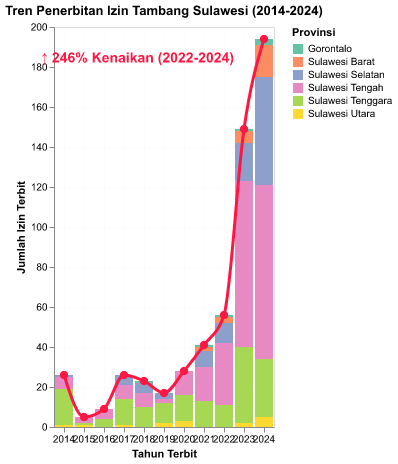

    Interpretasi Sektoral: Peningkatan penerbitan IUP di kawasan timur Sulawesi berbanding lurus dengan perluasan area konversi hutan. Pola perizinan ini menunjukkan pentingnya penerapan instrumen tata ruang dan evaluasi lingkungan secara ketat.

**Lihat Data Mentah: Agregat Izin Minerbaone**

|   Tahun | Provinsi          |   Jumlah_Izin_Baru |
|--------:|:------------------|-------------------:|
|    2014 | Gorontalo         |                  0 |
|    2014 | Sulawesi Barat    |                  0 |
|    2014 | Sulawesi Selatan  |                  1 |
|    2014 | Sulawesi Tengah   |                  6 |
|    2014 | Sulawesi Tenggara |                 18 |
|    2014 | Sulawesi Utara    |                  1 |
|    2015 | Gorontalo         |                  0 |
|    2015 | Sulawesi Barat    |                  0 |
|    2015 | Sulawesi Selatan  |                  0 |
|    2015 | Sulawesi Tengah   |                  3 |
|    2015 | Sulawesi Tenggara |                  1 |
|    2015 | Sulawesi Utara    |                  1 |
|    2016 | Gorontalo         |                  0 |
|    2016 | Sulawesi Barat    |                  0 |
|    2016 | Sulawesi Selatan  |                  0 |
|    2016 | Sulawesi Tengah   |                  5 |
|    2016 | Sulawesi Tenggara |                  4 |
|    2016 | Sulawesi Utara    |                  0 |
|    2017 | Gorontalo         |                  0 |
|    2017 | Sulawesi Barat    |                  0 |
|    2017 | Sulawesi Selatan  |                  5 |
|    2017 | Sulawesi Tengah   |                  7 |
|    2017 | Sulawesi Tenggara |                 13 |
|    2017 | Sulawesi Utara    |                  1 |
|    2018 | Gorontalo         |                  1 |
|    2018 | Sulawesi Barat    |                  0 |
|    2018 | Sulawesi Selatan  |                  5 |
|    2018 | Sulawesi Tengah   |                  7 |
|    2018 | Sulawesi Tenggara |                 10 |
|    2018 | Sulawesi Utara    |                  0 |
|    2019 | Gorontalo         |                  0 |
|    2019 | Sulawesi Barat    |                  0 |
|    2019 | Sulawesi Selatan  |                  3 |
|    2019 | Sulawesi Tengah   |                  2 |
|    2019 | Sulawesi Tenggara |                 10 |
|    2019 | Sulawesi Utara    |                  2 |
|    2020 | Gorontalo         |                  0 |
|    2020 | Sulawesi Barat    |                  0 |
|    2020 | Sulawesi Selatan  |                  0 |
|    2020 | Sulawesi Tengah   |                 12 |
|    2020 | Sulawesi Tenggara |                 13 |
|    2020 | Sulawesi Utara    |                  3 |
|    2021 | Gorontalo         |                  1 |
|    2021 | Sulawesi Barat    |                  2 |
|    2021 | Sulawesi Selatan  |                  8 |
|    2021 | Sulawesi Tengah   |                 17 |
|    2021 | Sulawesi Tenggara |                 13 |
|    2021 | Sulawesi Utara    |                  0 |
|    2022 | Gorontalo         |                  1 |
|    2022 | Sulawesi Barat    |                  3 |
|    2022 | Sulawesi Selatan  |                 10 |
|    2022 | Sulawesi Tengah   |                 31 |
|    2022 | Sulawesi Tenggara |                 11 |
|    2022 | Sulawesi Utara    |                  0 |
|    2023 | Gorontalo         |                  1 |
|    2023 | Sulawesi Barat    |                  6 |
|    2023 | Sulawesi Selatan  |                 19 |
|    2023 | Sulawesi Tengah   |                 83 |
|    2023 | Sulawesi Tenggara |                 38 |
|    2023 | Sulawesi Utara    |                  2 |
|    2024 | Gorontalo         |                  3 |
|    2024 | Sulawesi Barat    |                 16 |
|    2024 | Sulawesi Selatan  |                 54 |
|    2024 | Sulawesi Tengah   |                 87 |
|    2024 | Sulawesi Tenggara |                 29 |
|    2024 | Sulawesi Utara    |                  5 |

*📁 **Sumber File:** `data/processed/sulawesi_izin_baru_per_tahun.csv` - Agregat penerbitan izin tambang baru per provinsi di Sulawesi.*

#### Pembuktian Statistik: Intensitas Ekspansi vs Deforestasi

Hipotesis utama narasi ini adalah bahwa **lonjakan ekspansi ekstraktif** berbanding lurus dengan **kebangkrutan ekologis** (deforestasi). 
Untuk mengujinya secara statistik di tengah keterbatasan jumlah provinsi di Sulawesi (N=6), tabel crosstab dan uji Chi-Square di bawah menggunakan unit observasi **Provinsi-Tahun** (6 provinsi x 10 tahun = 60 sampel panel). 
Setiap observasi diklasifikasikan menjadi "Tinggi" atau "Rendah" berdasarkan nilai **Median panel** dari indikator yang dipilih.

##### Variabel Independen (X) - Tekanan Ekspansi

##### Variabel Dependen (Y) - Dampak Ekologis

### Detail Uji Statistik (Chi-Square & Odds Ratio)

*Tabel-tabel di bawah ini adalah *output* statistik formal yang menyajikan bukti statistik formal: Case Processing → Crosstabulation → Chi-Square Tests → Ringkasan Hipotesis.*

##### Case Processing Summary

|                                                          |   ('Cases', 'Valid', 'N') | ('Cases', 'Valid', 'Percent')   |   ('Cases', 'Missing', 'N') | ('Cases', 'Missing', 'Percent')   |   ('Cases', 'Total', 'N') | ('Cases', 'Total', 'Percent')   |
|:---------------------------------------------------------|--------------------------:|:--------------------------------|----------------------------:|:----------------------------------|--------------------------:|:--------------------------------|
| Jumlah Izin Baru (IUP) * Total Deforestasi Alam (Hektar) |                        60 | 100.0%                          |                           0 | 0.0%                              |                        60 | 100.0%                          |

##### Jumlah Izin Baru (IUP) * Total Deforestasi Alam (Hektar) Crosstabulation

|                                   |   Rendah (<23,254) |   Tinggi (≥23,254) |   Total |
|:----------------------------------|-------------------:|-------------------:|--------:|
| ('Rendah (<2)', 'Count')          |               22   |                7   |      29 |
| ('Rendah (<2)', 'Expected Count') |               14.5 |               14.5 |      29 |
| ('Tinggi (≥2)', 'Count')          |                8   |               23   |      31 |
| ('Tinggi (≥2)', 'Expected Count') |               15.5 |               15.5 |      31 |
| ('Total', 'Count')                |               30   |               30   |      60 |
| ('Total', 'Expected Count')       |               30   |               30   |      60 |

##### Chi-Square Tests

**Jumlah Izin Baru (IUP) * Total Deforestasi Alam (Hektar)**

|                              |   Value |   df |   Asymp. Sig. (2-sided) |
|:-----------------------------|--------:|-----:|------------------------:|
| Pearson Chi-Square           |  13.081 |    1 |                       0 |
| Likelihood Ratio             |  13.606 |    1 |                       0 |
| Linear-by-Linear Association |  14.766 |    1 |                       0 |
| N of Valid Cases             |  60     |      |                         |

### Ringkasan Uji Hipotesis

        Result: SIGNIFIKAN (Ada Hubungan)
        
            P-Value    : 0.0003

            Chi-Square : 13.081

            df         : 1

**Odds Ratio (Risk Estimate):** `9.036`

        Interpretasi Ekologis:

        Temuan ini sangat krusial: lonjakan intensitas Jumlah Izin Baru (IUP) terbukti **berkorelasi kuat dan signifikan** dengan peningkatan Total Deforestasi Alam (Hektar) (OR: 9.036). Ini adalah konfirmasi empiris bahwa narasi hilirisasi dan investasi ekstraktif bukanlah pertumbuhan tanpa korban-ekspansi spasial mereka mutlak mengorbankan luasan hutan di tingkat tapak.

---

### Ringkasan Eksekutif Seluruh Skenario Crosstab

Tabel di bawah ini merangkum hasil pengujian statistik (Chi-Square) untuk semua kemungkinan kombinasi antara indikator Ekspansi (X) dan Dampak Ekologis (Y) pada panel data yang sama.

| Variabel Independen (X)    | Variabel Dependen (Y)                        |   Chi-Square |   P-Value |   Odds Ratio | Kesimpulan          |
|:---------------------------|:---------------------------------------------|-------------:|----------:|-------------:|:--------------------|
| Jumlah Izin Baru (IUP)     | Total Deforestasi Alam (Hektar)              |       13.081 |     0     |         9.04 | 🟢 SIGNIFIKAN       |
| Jumlah Izin Baru (IUP)     | Deforestasi Komoditas Tambang/Sawit (Hektar) |        1.068 |     0.301 |         1.96 | 🔴 TIDAK SIGNIFIKAN |
| Luas Konsesi Baru (Hektar) | Total Deforestasi Alam (Hektar)              |       11.267 |     0.001 |         7.56 | 🟢 SIGNIFIKAN       |
| Luas Konsesi Baru (Hektar) | Deforestasi Komoditas Tambang/Sawit (Hektar) |        3.267 |     0.071 |         2.98 | 🔴 TIDAK SIGNIFIKAN |

    Pembedahan Realitas Ekologis:

Dari 4 skenario pengujian, terdapat 2 skenario yang terbukti SIGNIFIKAN.

Angka-angka pada tabel di atas bukan sekadar statistik di atas kertas, melainkan bukti empiris dari daya rusak kebijakan. Tingginya Odds Ratio pada skenario yang signifikan menegaskan bahwa setiap kali kran perizinan atau luas konsesi diperlebar, risiko terjadinya deforestasi melonjak berkali-kali lipat.

Menariknya, jika ada skenario yang menunjukkan TIDAK SIGNIFIKAN (khususnya pada deforestasi komoditas spesifik), ini tidak berarti industri ekstraktif ramah lingkungan. Sebaliknya, ini menjadi indikasi mengerikan bahwa kehancuran ekologis telah menyebar tak terkendali (spillover effect)-di mana kerusakan hutan akibat operasi tambang menjalar jauh melampaui batas konsesi resmi komoditasnya hingga merusak total lanskap alam secara merata.    

**Lihat Data Panel Mentah (Merge Izin & GFW)**

| Provinsi          |   Tahun |   Jumlah_Izin_Baru | X_Label     |   Total_Deforestasi_Ha | Y_Label          |
|:------------------|--------:|-------------------:|:------------|-----------------------:|:-----------------|
| Sulawesi Utara    |    2014 |                  1 | Rendah (<2) |                6968.32 | Rendah (<23,254) |
| Sulawesi Utara    |    2015 |                  1 | Rendah (<2) |               14568.2  | Rendah (<23,254) |
| Sulawesi Utara    |    2016 |                  0 | Rendah (<2) |                8735.15 | Rendah (<23,254) |
| Sulawesi Utara    |    2017 |                  1 | Rendah (<2) |                5658.21 | Rendah (<23,254) |
| Sulawesi Utara    |    2018 |                  0 | Rendah (<2) |                7345.12 | Rendah (<23,254) |
| Sulawesi Utara    |    2019 |                  2 | Tinggi (≥2) |                8883.75 | Rendah (<23,254) |
| Sulawesi Utara    |    2020 |                  3 | Tinggi (≥2) |                2856.61 | Rendah (<23,254) |
| Sulawesi Utara    |    2021 |                  0 | Rendah (<2) |                2712.44 | Rendah (<23,254) |
| Sulawesi Utara    |    2022 |                  0 | Rendah (<2) |                2648.67 | Rendah (<23,254) |
| Sulawesi Utara    |    2023 |                  2 | Tinggi (≥2) |                6343.27 | Rendah (<23,254) |
| Sulawesi Tengah   |    2014 |                  6 | Tinggi (≥2) |               87699.3  | Tinggi (≥23,254) |
| Sulawesi Tengah   |    2015 |                  3 | Tinggi (≥2) |              154169    | Tinggi (≥23,254) |
| Sulawesi Tengah   |    2016 |                  5 | Tinggi (≥2) |              128000    | Tinggi (≥23,254) |
| Sulawesi Tengah   |    2017 |                  7 | Tinggi (≥2) |               71995.1  | Tinggi (≥23,254) |
| Sulawesi Tengah   |    2018 |                  7 | Tinggi (≥2) |               71334.5  | Tinggi (≥23,254) |
| Sulawesi Tengah   |    2019 |                  2 | Tinggi (≥2) |               92685.3  | Tinggi (≥23,254) |
| Sulawesi Tengah   |    2020 |                 12 | Tinggi (≥2) |               46924.3  | Tinggi (≥23,254) |
| Sulawesi Tengah   |    2021 |                 17 | Tinggi (≥2) |               36807.6  | Tinggi (≥23,254) |
| Sulawesi Tengah   |    2022 |                 31 | Tinggi (≥2) |               43938.9  | Tinggi (≥23,254) |
| Sulawesi Tengah   |    2023 |                 83 | Tinggi (≥2) |               87894.4  | Tinggi (≥23,254) |
| Sulawesi Selatan  |    2014 |                  1 | Rendah (<2) |               65784.8  | Tinggi (≥23,254) |
| Sulawesi Selatan  |    2015 |                  0 | Rendah (<2) |               74016.8  | Tinggi (≥23,254) |
| Sulawesi Selatan  |    2016 |                  0 | Rendah (<2) |               71141    | Tinggi (≥23,254) |
| Sulawesi Selatan  |    2017 |                  5 | Tinggi (≥2) |               53527.1  | Tinggi (≥23,254) |
| Sulawesi Selatan  |    2018 |                  5 | Tinggi (≥2) |               46670.5  | Tinggi (≥23,254) |
| Sulawesi Selatan  |    2019 |                  3 | Tinggi (≥2) |               67424.2  | Tinggi (≥23,254) |
| Sulawesi Selatan  |    2020 |                  0 | Rendah (<2) |               33599.3  | Tinggi (≥23,254) |
| Sulawesi Selatan  |    2021 |                  8 | Tinggi (≥2) |               25907.7  | Tinggi (≥23,254) |
| Sulawesi Selatan  |    2022 |                 10 | Tinggi (≥2) |               36235.4  | Tinggi (≥23,254) |
| Sulawesi Selatan  |    2023 |                 19 | Tinggi (≥2) |               79194.1  | Tinggi (≥23,254) |
| Sulawesi Tenggara |    2014 |                 18 | Tinggi (≥2) |               47611.3  | Tinggi (≥23,254) |
| Sulawesi Tenggara |    2015 |                  1 | Rendah (<2) |               48097.2  | Tinggi (≥23,254) |
| Sulawesi Tenggara |    2016 |                  4 | Tinggi (≥2) |               39632.9  | Tinggi (≥23,254) |
| Sulawesi Tenggara |    2017 |                 13 | Tinggi (≥2) |               29650.6  | Tinggi (≥23,254) |
| Sulawesi Tenggara |    2018 |                 10 | Tinggi (≥2) |               28050.4  | Tinggi (≥23,254) |
| Sulawesi Tenggara |    2019 |                 10 | Tinggi (≥2) |               41159.9  | Tinggi (≥23,254) |
| Sulawesi Tenggara |    2020 |                 13 | Tinggi (≥2) |               20725.8  | Rendah (<23,254) |
| Sulawesi Tenggara |    2021 |                 13 | Tinggi (≥2) |               13790    | Rendah (<23,254) |
| Sulawesi Tenggara |    2022 |                 11 | Tinggi (≥2) |               14541.8  | Rendah (<23,254) |
| Sulawesi Tenggara |    2023 |                 38 | Tinggi (≥2) |               43927.2  | Tinggi (≥23,254) |
| Gorontalo         |    2014 |                  0 | Rendah (<2) |               10320.9  | Rendah (<23,254) |
| Gorontalo         |    2015 |                  0 | Rendah (<2) |               18520.6  | Rendah (<23,254) |
| Gorontalo         |    2016 |                  0 | Rendah (<2) |               15680.7  | Rendah (<23,254) |
| Gorontalo         |    2017 |                  0 | Rendah (<2) |               11903    | Rendah (<23,254) |
| Gorontalo         |    2018 |                  1 | Rendah (<2) |               11535.8  | Rendah (<23,254) |
| Gorontalo         |    2019 |                  0 | Rendah (<2) |               16577.4  | Rendah (<23,254) |
| Gorontalo         |    2020 |                  0 | Rendah (<2) |                4562.55 | Rendah (<23,254) |
| Gorontalo         |    2021 |                  1 | Rendah (<2) |                3438.03 | Rendah (<23,254) |
| Gorontalo         |    2022 |                  1 | Rendah (<2) |                4176    | Rendah (<23,254) |
| Gorontalo         |    2023 |                  1 | Rendah (<2) |               11475.7  | Rendah (<23,254) |
| Sulawesi Barat    |    2014 |                  0 | Rendah (<2) |               20884.1  | Rendah (<23,254) |
| Sulawesi Barat    |    2015 |                  0 | Rendah (<2) |               23642    | Tinggi (≥23,254) |
| Sulawesi Barat    |    2016 |                  0 | Rendah (<2) |               22866.2  | Rendah (<23,254) |
| Sulawesi Barat    |    2017 |                  0 | Rendah (<2) |               19627    | Rendah (<23,254) |
| Sulawesi Barat    |    2018 |                  0 | Rendah (<2) |               21741.3  | Rendah (<23,254) |
| Sulawesi Barat    |    2019 |                  0 | Rendah (<2) |               24489.7  | Tinggi (≥23,254) |
| Sulawesi Barat    |    2020 |                  0 | Rendah (<2) |               13135.7  | Rendah (<23,254) |
| Sulawesi Barat    |    2021 |                  2 | Tinggi (≥2) |               13505.4  | Rendah (<23,254) |
| Sulawesi Barat    |    2022 |                  3 | Tinggi (≥2) |               14573.9  | Rendah (<23,254) |
| Sulawesi Barat    |    2023 |                  6 | Tinggi (≥2) |               27140.4  | Tinggi (≥23,254) |

*Sumber: Gabungan `sulawesi_izin_baru_per_tahun.csv` (Minerbaone) dan `sulawesi_gfw_master_1_dekade_2014_2023.csv` (GFW).*

---

### 1.4 Analisis Realisasi Investasi PMDN dan Dampak Terhadap Tutupan Hutan

Metode: Analisis Spasial, Dual-Axis Split & Uji Chi-Square

**ℹ️ Metodologi: Analisis Spasial & Uji Chi-Square (Crosstab)**

    **Metode Analisis:** Sub-bab ini menggunakan pendekatan *Descriptive Spatial Analysis* dan inferensi statistik melalui Uji Chi-Square (Crosstabulation) untuk menguji korelasi antara kucuran modal PMDN dengan tingkat perubahan tutupan hutan secara spasial.

    1. **Uji Tabulasi Silang (Chi-Square Test of Independence):** Mengukur signifikansi hubungan antara arus masuk investasi (X) dengan tingkat perubahan tutupan hutan (Y).
        * **Binning Kategori:** Variabel kontinu dikonversi menjadi data kategorikal (Biner) menggunakan nilai tengah (Median). 'Tinggi' > Median, 'Rendah' <= Median.
        * `H0 (Null Hypothesis): Tidak ada hubungan signifikan secara statistik antara tingginya arus modal PMDN dengan laju deforestasi.`
        * `Decision Rule (Alpha 5%): Jika P-Value < 0.05, maka Tolak H0 (Terbukti secara empiris bahwa kucuran investasi berkorelasi dengan perubahan tutupan hutan).`
    2. **Kalkulasi Dual-Axis (Trend Comparison):** Membandingkan secara visual tren investasi (Bar Chart) terhadap fluktuasi laju deforestasi komoditas (Line Chart) menggunakan skala ganda (Dual-Axis) terpisah per kategori wilayah.
        * `Tahun_t (Investasi) vs Tahun_t (Deforestasi)`
    3. **Variabel & Fitur Data Investasi (BKPM):**
        * **Tahun, Provinsi:** Dimensi waktu dan lokasi.
        * **nilai (Juta Rupiah):** Realisasi Investasi Penanaman Modal Dalam Negeri (PMDN).
    4. **Variabel & Fitur Data Deforestasi (GFW):**
        * **Provinsi, Tahun:** Dimensi spasial dan temporal deforestasi.
        * **Total_Deforestasi_Ha:** Angka agregat seluruh jenis kerusakan tutupan lahan.
        * **Deforestasi_Driver_Komoditas_Tambang_Sawit_Ha:** Deforestasi khusus komoditas ekstraktif.
    5. **Dataset & File:**
        * Investasi: `data/processed/sulawesi_investasi_pmdn_2016_2024.csv`
        * Deforestasi: `data/processed/sulawesi_gfw_master_1_dekade_2014_2023.csv`

Grafik di bawah ini memetakan dinamika penerbitan konsesi tambang baru dan dampaknya terhadap tutupan hutan. Pada tahun 2016, luas konsesi tambang baru yang diterbitkan di Sulawesi mencakup **12,515 Hektar**, dan meningkat signifikan hingga mencapai **68,556 Hektar** pada tahun 2023. Pada periode yang sama, angka deforestasi komoditas mencatatkan luasan sebesar **216,887 Hektar**.

Data ini mengindikasikan bahwa akselerasi penerbitan konsesi berbanding lurus dengan laju konversi hutan alam (akumulasi deforestasi sebesar **2,107,041 Hektar**). Hal ini menegaskan pentingnya pertimbangan daya dukung ekologis dalam setiap kebijakan alokasi konsesi pertambangan.

Daerah Sentra Tambang

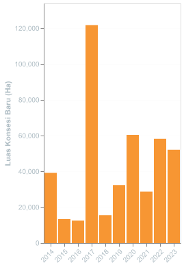

Daerah Non-Sentra

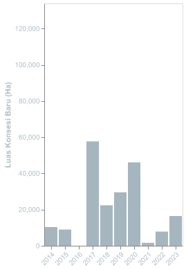

    Interpretasi Spasial: Perbandingan grafik batang di atas menunjukkan bahwa tingkat alokasi konsesi di Daerah Sentra Tambang (Morowali & Konawe) jauh lebih tinggi dibanding wilayah non-sentra, yang berdampak langsung pada konsentrasi perubahan tutupan hutan.

**Lihat Data Mentah: Ekspansi Konsesi vs Deforestasi**

| Kategori Wilayah   |   Tahun |   Deforestasi Komoditas (Ha) |   Luas Konsesi Tambang Baru (Ha) |
|:-------------------|--------:|-----------------------------:|---------------------------------:|
| Non-Sentra         |    2014 |                     178084   |                         10301.4  |
| Non-Sentra         |    2015 |                     180460   |                          8969    |
| Non-Sentra         |    2016 |                     296140   |                             0    |
| Non-Sentra         |    2017 |                     158590   |                         57722.2  |
| Non-Sentra         |    2018 |                     147528   |                         22336    |
| Non-Sentra         |    2019 |                     121435   |                         29509.9  |
| Non-Sentra         |    2020 |                     128763   |                         46139    |
| Non-Sentra         |    2021 |                     103916   |                          1588.41 |
| Non-Sentra         |    2022 |                     114686   |                          7859.45 |
| Non-Sentra         |    2023 |                     163877   |                         16418.2  |
| Sentra Tambang     |    2014 |                      69946.5 |                         39216.7  |
| Sentra Tambang     |    2015 |                      44999.2 |                         13370    |
| Sentra Tambang     |    2016 |                      63332.1 |                         12515.8  |
| Sentra Tambang     |    2017 |                      60755.6 |                        121743    |
| Sentra Tambang     |    2018 |                      53148.1 |                         15634.7  |
| Sentra Tambang     |    2019 |                      42398   |                         32458.3  |
| Sentra Tambang     |    2020 |                      40232.2 |                         60420.8  |
| Sentra Tambang     |    2021 |                      46963.6 |                         28835    |
| Sentra Tambang     |    2022 |                      38775.7 |                         58268.1  |
| Sentra Tambang     |    2023 |                      53010.1 |                         52138.7  |

*📁 **Sumber File:** `sulawesi_izin_baru_per_tahun.csv` & `sulawesi_gfw_master_1_dekade_2014_2023.csv` - Data Kementerian ESDM (Izin) dan GFW.*

---

#### Pembedahan Ekologis: Aktor, Dampak, dan Emisi

Berdasarkan data Global Forest Watch (GFW), analisis penyebab deforestasi di Sulawesi mengonfirmasi faktor-faktor berikut:

**1. Aktor Utama Deforestasi (Donut Chart):** Konversi tutupan hutan terbesar didominasi oleh **Ekspansi Komoditas (Tambang & Perkebunan Monokultur)** yang mencapai **4,931,210 Hektar** (4.9 Mha), mengindikasikan bahwa pembukaan lahan didorong oleh aktivitas sektor industri skala besar.

**2. Perubahan Tutupan Hutan Primer (Bar Chart Tengah):** Akumulasi konversi lahan mencakup **3,904,079 Hektar Hutan Primer**, yang memiliki peranan kunci dalam menjaga keanekaragaman hayati dan penyimpan cadangan karbon alami.

**3. Estimasi Emisi Karbon (Bar Chart Kanan):** Konversi hutan alam untuk aktivitas komoditas melepaskan estimasi emisi sebesar **3,371,872,868 Megagrams CO2**, yang menjadi catatan penting dalam inventarisasi emisi sektor berbasis lahan.

Aktor Utama Deforestasi

                    &bull; Ekspansi Komoditas

                    4.9 Mha

                    &bull; Kehutanan (Logging)

                    536 kha

                    &bull; Pertanian Berpindah

                    47 kha

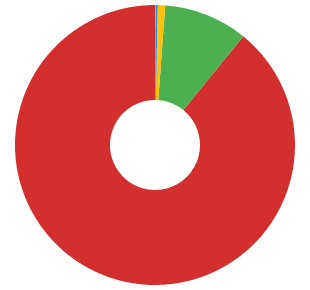

*Investasi komoditas (merah) mendominasi porsi penyebab konversi hutan di Sulawesi.*

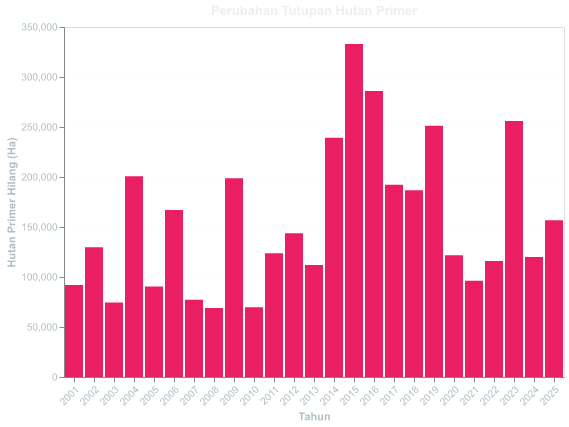

*Perubahan tutupan mencakup area Hutan Primer.*

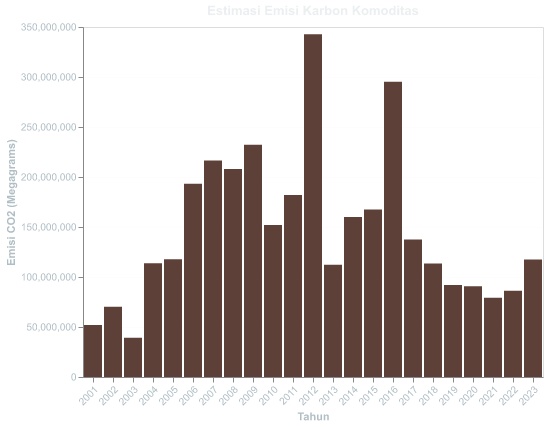

*Estimasi pelepasan emisi CO2 akibat konversi lahan berbasis komoditas.*

**Lihat Data Mentah: Deforestasi GFW**

| Provinsi          |   Tahun |   Total_Deforestasi_Ha |   Deforestasi_Hutan_Primer_Ha |   Deforestasi_Kawasan_Lindung_Ha |   Laju_Deforestasi_Ha |   Deforestasi_Driver_Komoditas_Tambang_Sawit_Ha |   Deforestasi_Driver_Kehutanan_Ha |   Total_Emisi_CO2_Megagram |   Baseline_Tutupan_Hutan_2000_Ha |   Deforestasi_Driver_Pertanian_Berpindah_Ha |   Deforestasi_Driver_Urbanisasi_Ha | Sumber             |
|:------------------|--------:|-----------------------:|------------------------------:|---------------------------------:|----------------------:|------------------------------------------------:|----------------------------------:|---------------------------:|---------------------------------:|--------------------------------------------:|-----------------------------------:|:-------------------|
| Sulawesi Utara    |    2014 |                6968.32 |                       6968.32 |                          6968.32 |               6968.32 |                                      150237     |                        7942.47    |                1.13895e+08 |                      1.24953e+06 |                                   1095.72   |                          241.907   | data/raw/klhk_gfw/ |
| Sulawesi Utara    |    2015 |               14568.2  |                      14568.2  |                         14568.2  |              14568.2  |                                      159874     |                        7354.54    |                1.39071e+08 |                      1.24953e+06 |                                   1606.99   |                          181.68    | data/raw/klhk_gfw/ |
| Sulawesi Utara    |    2016 |                8735.15 |                       8735.15 |                          8735.15 |               8735.15 |                                      264301     |                       10844.9     |                2.53867e+08 |                      1.24953e+06 |                                    389.345  |                          200.732   | data/raw/klhk_gfw/ |
| Sulawesi Utara    |    2017 |                5658.21 |                       5658.21 |                          5658.21 |               5658.21 |                                      116019     |                        7760.29    |                8.97932e+07 |                      1.24953e+06 |                                    525.993  |                          343.387   | data/raw/klhk_gfw/ |
| Sulawesi Utara    |    2018 |                7345.12 |                       7345.12 |                          7345.12 |               7345.12 |                                      116112     |                        8629.97    |                7.83302e+07 |                      1.24953e+06 |                                    443.495  |                          264.032   | data/raw/klhk_gfw/ |
| Sulawesi Utara    |    2019 |                8883.75 |                       8883.75 |                          8883.75 |               8883.75 |                                       94751.9   |                        7201.18    |                6.52237e+07 |                      1.24953e+06 |                                    305.196  |                          311.276   | data/raw/klhk_gfw/ |
| Sulawesi Utara    |    2020 |                2856.61 |                       2856.61 |                          2856.61 |               2856.61 |                                      102903     |                        4993.07    |                6.79679e+07 |                      1.24953e+06 |                                    189.308  |                          245.979   | data/raw/klhk_gfw/ |
| Sulawesi Utara    |    2021 |                2712.44 |                       2712.44 |                          2712.44 |               2712.44 |                                       73460.5   |                        4271.22    |                4.73798e+07 |                      1.24953e+06 |                                     43.9475 |                           88.8812  | data/raw/klhk_gfw/ |
| Sulawesi Utara    |    2022 |                2648.67 |                       2648.67 |                          2648.67 |               2648.67 |                                       84098.6   |                        3579.42    |                5.21752e+07 |                      1.24953e+06 |                                     35.3402 |                           85.117   | data/raw/klhk_gfw/ |
| Sulawesi Utara    |    2023 |                6343.27 |                       6343.27 |                          6343.27 |               6343.27 |                                      132468     |                        6501.32    |                8.00052e+07 |                      1.24953e+06 |                                    102.193  |                          164.933   | data/raw/klhk_gfw/ |
| Sulawesi Tengah   |    2014 |               87699.3  |                      87699.3  |                         87699.3  |              87699.3  |                                           0     |                           0       |                0           |                      1.01969e+07 |                                      0      |                            0       | data/raw/klhk_gfw/ |
| Sulawesi Tengah   |    2015 |              154169    |                     154169    |                        154169    |             154169    |                                           0     |                           0       |                0           |                      1.01969e+07 |                                      0      |                            0       | data/raw/klhk_gfw/ |
| Sulawesi Tengah   |    2016 |              128000    |                     128000    |                        128000    |             128000    |                                           0     |                           0       |                0           |                      1.01969e+07 |                                      0      |                            0       | data/raw/klhk_gfw/ |
| Sulawesi Tengah   |    2017 |               71995.1  |                      71995.1  |                         71995.1  |              71995.1  |                                           0     |                           0       |                0           |                      1.01969e+07 |                                      0      |                            0       | data/raw/klhk_gfw/ |
| Sulawesi Tengah   |    2018 |               71334.5  |                      71334.5  |                         71334.5  |              71334.5  |                                           0     |                           0       |                0           |                      1.01969e+07 |                                      0      |                            0       | data/raw/klhk_gfw/ |
| Sulawesi Tengah   |    2019 |               92685.3  |                      92685.3  |                         92685.3  |              92685.3  |                                           0     |                           0       |                0           |                      1.01969e+07 |                                      0      |                            0       | data/raw/klhk_gfw/ |
| Sulawesi Tengah   |    2020 |               46924.3  |                      46924.3  |                         46924.3  |              46924.3  |                                           0     |                           0       |                0           |                      1.01969e+07 |                                      0      |                            0       | data/raw/klhk_gfw/ |
| Sulawesi Tengah   |    2021 |               36807.6  |                      36807.6  |                         36807.6  |              36807.6  |                                           0     |                           0       |                0           |                      1.01969e+07 |                                      0      |                            0       | data/raw/klhk_gfw/ |
| Sulawesi Tengah   |    2022 |               43938.9  |                      43938.9  |                         43938.9  |              43938.9  |                                           0     |                           0       |                0           |                      1.01969e+07 |                                      0      |                            0       | data/raw/klhk_gfw/ |
| Sulawesi Tengah   |    2023 |               87894.4  |                      87894.4  |                         87894.4  |              87894.4  |                                           0     |                           0       |                0           |                      1.01969e+07 |                                      0      |                            0       | data/raw/klhk_gfw/ |
| Sulawesi Selatan  |    2014 |               65784.8  |                      65784.8  |                         65784.8  |              65784.8  |                                       25686.6   |                        4778.53    |                1.92366e+07 |                      5.56288e+06 |                                     66.8498 |                           39.156   | data/raw/klhk_gfw/ |
| Sulawesi Selatan  |    2015 |               74016.8  |                      74016.8  |                         74016.8  |              74016.8  |                                       19836.4   |                        2599.35    |                1.44345e+07 |                      5.56288e+06 |                                     44.0793 |                           20.7704  | data/raw/klhk_gfw/ |
| Sulawesi Selatan  |    2016 |               71141    |                      71141    |                         71141    |              71141    |                                       31087.6   |                        7693.88    |                2.52056e+07 |                      5.56288e+06 |                                    142.008  |                          156.624   | data/raw/klhk_gfw/ |
| Sulawesi Selatan  |    2017 |               53527.1  |                      53527.1  |                         53527.1  |              53527.1  |                                       41347.5   |                        9898.64    |                3.28524e+07 |                      5.56288e+06 |                                     94.9282 |                           83.6199  | data/raw/klhk_gfw/ |
| Sulawesi Selatan  |    2018 |               46670.5  |                      46670.5  |                         46670.5  |              46670.5  |                                       30355.4   |                        6853.14    |                2.24968e+07 |                      5.56288e+06 |                                     83.2353 |                           83.3122  | data/raw/klhk_gfw/ |
| Sulawesi Selatan  |    2019 |               67424.2  |                      67424.2  |                         67424.2  |              67424.2  |                                       25249     |                        5599.89    |                1.75318e+07 |                      5.56288e+06 |                                     39.8483 |                           63.6958  | data/raw/klhk_gfw/ |
| Sulawesi Selatan  |    2020 |               33599.3  |                      33599.3  |                         33599.3  |              33599.3  |                                       24812.9   |                        5442.14    |                1.41981e+07 |                      5.56288e+06 |                                     77.4657 |                          116.391   | data/raw/klhk_gfw/ |
| Sulawesi Selatan  |    2021 |               25907.7  |                      25907.7  |                         25907.7  |              25907.7  |                                       29166.6   |                        6328.33    |                1.88529e+07 |                      5.56288e+06 |                                    145.854  |                          126.238   | data/raw/klhk_gfw/ |
| Sulawesi Selatan  |    2022 |               36235.4  |                      36235.4  |                         36235.4  |              36235.4  |                                       29644     |                        5597.99    |                2.10968e+07 |                      5.56288e+06 |                                    100.467  |                          142.931   | data/raw/klhk_gfw/ |
| Sulawesi Selatan  |    2023 |               79194.1  |                      79194.1  |                         79194.1  |              79194.1  |                                       29253.1   |                        5670.54    |                2.02775e+07 |                      5.56288e+06 |                                    150.008  |                           78.6966  | data/raw/klhk_gfw/ |
| Sulawesi Tenggara |    2014 |               47611.3  |                      47611.3  |                         47611.3  |              47611.3  |                                       69946.5   |                       14883.7     |                4.39927e+07 |                      3.08178e+06 |                                    178      |                          431.657   | data/raw/klhk_gfw/ |
| Sulawesi Tenggara |    2015 |               48097.2  |                      48097.2  |                         48097.2  |              48097.2  |                                       44999.2   |                        7677.62    |                2.7196e+07  |                      3.08178e+06 |                                    138.349  |                          154.91    | data/raw/klhk_gfw/ |
| Sulawesi Tenggara |    2016 |               39632.9  |                      39632.9  |                         39632.9  |              39632.9  |                                       63332.1   |                       15267.4     |                3.87755e+07 |                      3.08178e+06 |                                    261.451  |                          251.156   | data/raw/klhk_gfw/ |
| Sulawesi Tenggara |    2017 |               29650.6  |                      29650.6  |                         29650.6  |              29650.6  |                                       60755.6   |                       13331.3     |                3.42323e+07 |                      3.08178e+06 |                                    220.69   |                          114.839   | data/raw/klhk_gfw/ |
| Sulawesi Tenggara |    2018 |               28050.4  |                      28050.4  |                         28050.4  |              28050.4  |                                       53148.1   |                       12558       |                3.0064e+07  |                      3.08178e+06 |                                    193.79   |                          244.273   | data/raw/klhk_gfw/ |
| Sulawesi Tenggara |    2019 |               41159.9  |                      41159.9  |                         41159.9  |              41159.9  |                                       42398     |                        9104.44    |                2.27045e+07 |                      3.08178e+06 |                                    149.732  |                          212.322   | data/raw/klhk_gfw/ |
| Sulawesi Tenggara |    2020 |               20725.8  |                      20725.8  |                         20725.8  |              20725.8  |                                       40232.2   |                        9654.67    |                2.13157e+07 |                      3.08178e+06 |                                    168.932  |                          154.63    | data/raw/klhk_gfw/ |
| Sulawesi Tenggara |    2021 |               13790    |                      13790    |                         13790    |              13790    |                                       46963.6   |                       11788.7     |                2.62714e+07 |                      3.08178e+06 |                                    194.092  |                          217.674   | data/raw/klhk_gfw/ |
| Sulawesi Tenggara |    2022 |               14541.8  |                      14541.8  |                         14541.8  |              14541.8  |                                       38775.7   |                       10099.3     |                2.4596e+07  |                      3.08178e+06 |                                    179.631  |                          217.24    | data/raw/klhk_gfw/ |
| Sulawesi Tenggara |    2023 |               43927.2  |                      43927.2  |                         43927.2  |              43927.2  |                                       53010.1   |                       11946.3     |                3.0805e+07  |                      3.08178e+06 |                                    102.401  |                          278.924   | data/raw/klhk_gfw/ |
| Gorontalo         |    2014 |               10320.9  |                      10320.9  |                         10320.9  |              10320.9  |                                        2160.21  |                        2748.42    |                4.02608e+06 |                      1.07378e+06 |                                   1688.02   |                           94.5102  | data/raw/klhk_gfw/ |
| Gorontalo         |    2015 |               18520.6  |                      18520.6  |                         18520.6  |              18520.6  |                                         749.119 |                        1276.7     |                1.71753e+06 |                      1.07378e+06 |                                    809.662  |                           45.8532  | data/raw/klhk_gfw/ |
| Gorontalo         |    2016 |               15680.7  |                      15680.7  |                         15680.7  |              15680.7  |                                         751.21  |                        1189.79    |                1.94642e+06 |                      1.07378e+06 |                                   1180.15   |                           48.8261  | data/raw/klhk_gfw/ |
| Gorontalo         |    2017 |               11903    |                      11903    |                         11903    |              11903    |                                        1223.86  |                        1514.88    |                2.79281e+06 |                      1.07378e+06 |                                   1834.93   |                           92.3176  | data/raw/klhk_gfw/ |
| Gorontalo         |    2018 |               11535.8  |                      11535.8  |                         11535.8  |              11535.8  |                                        1059.76  |                        1713.04    |                2.63997e+06 |                      1.07378e+06 |                                   1387.26   |                           98.2933  | data/raw/klhk_gfw/ |
| Gorontalo         |    2019 |               16577.4  |                      16577.4  |                         16577.4  |              16577.4  |                                        1433.83  |                        2218.11    |                3.11253e+06 |                      1.07378e+06 |                                   1258.61   |                          162.045   | data/raw/klhk_gfw/ |
| Gorontalo         |    2020 |                4562.55 |                       4562.55 |                          4562.55 |               4562.55 |                                        1047.39  |                        1907.83    |                3.03805e+06 |                      1.07378e+06 |                                   1828.37   |                           78.8393  | data/raw/klhk_gfw/ |
| Gorontalo         |    2021 |                3438.03 |                       3438.03 |                          3438.03 |               3438.03 |                                        1289.33  |                        1089.57    |                2.22903e+06 |                      1.07378e+06 |                                   1035.25   |                           78.9959  | data/raw/klhk_gfw/ |
| Gorontalo         |    2022 |                4176    |                       4176    |                          4176    |               4176    |                                         943.706 |                        1148.05    |                1.8916e+06  |                      1.07378e+06 |                                    745.716  |                           54.8841  | data/raw/klhk_gfw/ |
| Gorontalo         |    2023 |               11475.7  |                      11475.7  |                         11475.7  |              11475.7  |                                        2155.86  |                        2152.58    |                4.06014e+06 |                      1.07378e+06 |                                   1853.56   |                          146.424   | data/raw/klhk_gfw/ |
| Sulawesi Barat    |    2014 |               20884.1  |                      20884.1  |                         20884.1  |              20884.1  |                                           0     |                           2.6663  |            29166.4         |                      2.58646e+06 |                                     32.9097 |                           20.6447  | data/raw/klhk_gfw/ |
| Sulawesi Barat    |    2015 |               23642    |                      23642    |                         23642    |              23642    |                                           0     |                           0       |            22097.8         |                      2.58646e+06 |                                     38.7756 |                            3.04719 | data/raw/klhk_gfw/ |
| Sulawesi Barat    |    2016 |               22866.2  |                      22866.2  |                         22866.2  |              22866.2  |                                           0     |                           1.5236  |            35130.8         |                      2.58646e+06 |                                     40.9086 |                           18.6641  | data/raw/klhk_gfw/ |
| Sulawesi Barat    |    2017 |               19627    |                      19627    |                         19627    |              19627    |                                           0     |                           5.71349 |            58938           |                      2.58646e+06 |                                     53.3259 |                           38.9279  | data/raw/klhk_gfw/ |
| Sulawesi Barat    |    2018 |               21741.3  |                      21741.3  |                         21741.3  |              21741.3  |                                           0     |                           4.57079 |            69233.2         |                      2.58646e+06 |                                     46.5459 |                           78.4653  | data/raw/klhk_gfw/ |
| Sulawesi Barat    |    2019 |               24489.7  |                      24489.7  |                         24489.7  |              24489.7  |                                           0     |                           5.94203 |            37077.7         |                      2.58646e+06 |                                     23.6919 |                           33.1382  | data/raw/klhk_gfw/ |
| Sulawesi Barat    |    2020 |               13135.7  |                      13135.7  |                         13135.7  |              13135.7  |                                           0     |                           2.89483 |            30653.1         |                      2.58646e+06 |                                     32.3764 |                           16.6072  | data/raw/klhk_gfw/ |
| Sulawesi Barat    |    2021 |               13505.4  |                      13505.4  |                         13505.4  |              13505.4  |                                           0     |                           1.9045  |            40085.9         |                      2.58646e+06 |                                     51.1929 |                           15.0074  | data/raw/klhk_gfw/ |
| Sulawesi Barat    |    2022 |               14573.9  |                      14573.9  |                         14573.9  |              14573.9  |                                           0     |                           0.22854 |            19878           |                      2.58646e+06 |                                     25.5964 |                            8.60832 | data/raw/klhk_gfw/ |
| Sulawesi Barat    |    2023 |               27140.4  |                      27140.4  |                         27140.4  |              27140.4  |                                           0     |                           0.7618  |            56277           |                      2.58646e+06 |                                     46.0888 |                           57.3634  | data/raw/klhk_gfw/ |

#### Pembuktian Statistik: Arus Investasi PMDN vs Deforestasi

Menggunakan tabel crosstab untuk menguji korelasi spasial-temporal antara arus masuk Investasi PMDN dengan tingkat kerusakan hutan (Deforestasi) pada level panel **Provinsi-Tahun**. Variabel *Investasi* akan dipecah berdasarkan nilai tengah (median) menjadi 'Tinggi' dan 'Rendah', begitu pula dengan variabel *Deforestasi*.

##### Variabel Independen (X) - Arus Modal

##### Variabel Dependen (Y) - Dampak Ekologis

### Detail Uji Statistik (Chi-Square & Odds Ratio)

*Tabel-tabel di bawah ini merepresentasikan bukti statistik hubungan antara Arus Investasi PMDN dengan tingkat deforestasi alam.*

##### Case Processing Summary

|                                                                      |   ('Cases', 'Valid', 'N') | ('Cases', 'Valid', 'Percent')   |   ('Cases', 'Missing', 'N') | ('Cases', 'Missing', 'Percent')   |   ('Cases', 'Total', 'N') | ('Cases', 'Total', 'Percent')   |
|:---------------------------------------------------------------------|--------------------------:|:--------------------------------|----------------------------:|:----------------------------------|--------------------------:|:--------------------------------|
| Realisasi Investasi PMDN (Juta Rp) * Total Deforestasi Alam (Hektar) |                        96 | 100.0%                          |                           0 | 0.0%                              |                        96 | 100.0%                          |

##### Realisasi Investasi PMDN (Juta Rp) * Total Deforestasi Alam (Hektar) Crosstabulation

|                                       |   Rendah (<22,303) |   Tinggi (≥22,303) |   Total |
|:--------------------------------------|-------------------:|-------------------:|--------:|
| ('Rendah (≤1,097)', 'Count')          |                 29 |                 19 |      48 |
| ('Rendah (≤1,097)', 'Expected Count') |                 24 |                 24 |      48 |
| ('Tinggi (>1,097)', 'Count')          |                 19 |                 29 |      48 |
| ('Tinggi (>1,097)', 'Expected Count') |                 24 |                 24 |      48 |
| ('Total', 'Count')                    |                 48 |                 48 |      96 |
| ('Total', 'Expected Count')           |                 48 |                 48 |      96 |

##### Chi-Square Tests

|                              |   Value |   df |   Asymp. Sig. (2-sided) |
|:-----------------------------|--------:|-----:|------------------------:|
| Pearson Chi-Square           |   3.375 |    1 |                   0.066 |
| Likelihood Ratio             |   3.395 |    1 |                   0.065 |
| Linear-by-Linear Association |   4.123 |    1 |                   0.042 |
| N of Valid Cases             |  96     |      |                         |

### Ringkasan Uji Hipotesis

        Result: TIDAK SIGNIFIKAN
        
            P-Value    : 0.0662

            Chi-Square : 3.375

            df         : 1

**Odds Ratio (Risk Estimate):** `2.33`

        Interpretasi Kausalitas:

        Secara statistik agregat mungkin belum terlihat korelasi linier di tahun yang persis sama. Hal ini menyingkap anomali bahwa investasi bernilai triliunan kerap ditahan untuk birokrasi awal, sementara pembabatan hutan fisiknya baru meledak secara sporadis di tahun-tahun berikutnya (lagging effect).

---

### Ringkasan Eksekutif Seluruh Skenario Crosstab

Tabel di bawah ini merangkum hasil pengujian statistik (Chi-Square) untuk semua kemungkinan kombinasi indikator antara Realisasi Investasi PMDN dan Dampak Ekologis pada panel data.

| Variabel Independen (X)            | Variabel Dependen (Y)                        |   Chi-Square |   P-Value |   Odds Ratio | Kesimpulan          |
|:-----------------------------------|:---------------------------------------------|-------------:|----------:|-------------:|:--------------------|
| Realisasi Investasi PMDN (Juta Rp) | Total Deforestasi Alam (Hektar)              |        3.375 |     0.066 |         2.33 | 🔴 TIDAK SIGNIFIKAN |
| Realisasi Investasi PMDN (Juta Rp) | Deforestasi Komoditas Tambang/Sawit (Hektar) |        7.042 |     0.008 |         3.33 | 🟢 SIGNIFIKAN       |

Pembedahan Realitas Ekologis:

Dari 2 skenario pengujian, terbukti ada skenario yang SIGNIFIKAN secara statistik.

Temuan ini mengunci mati argumen pemerintah. Derasnya arus modal (PMDN) bukanlah indikator keberhasilan ekonomi yang inklusif, melainkan sekadar dana segar untuk membiayai penghancuran hutan skala raksasa. Angka statistik membuktikan betapa rentannya ekosistem hutan penyangga terhadap setiap lembar rupiah modal ekstraktif yang ditanamkan.

**Lihat Data Panel Mentah (Merge Investasi & GFW)**

| Provinsi          |   Tahun |   Investasi_Juta_Rp | X_Label         |   Total_Deforestasi_Ha | Y_Label          |
|:------------------|--------:|--------------------:|:----------------|-----------------------:|:-----------------|
| Sulawesi Utara    |    2016 |              5069.6 | Tinggi (>1,097) |                8735.15 | Rendah (<22,303) |
| Sulawesi Utara    |    2016 |                74   | Rendah (≤1,097) |                8735.15 | Rendah (<22,303) |
| Sulawesi Utara    |    2017 |              1488.2 | Tinggi (>1,097) |                5658.21 | Rendah (<22,303) |
| Sulawesi Utara    |    2017 |                57   | Rendah (≤1,097) |                5658.21 | Rendah (<22,303) |
| Sulawesi Utara    |    2018 |              4320.1 | Tinggi (>1,097) |                7345.12 | Rendah (<22,303) |
| Sulawesi Utara    |    2018 |                82   | Rendah (≤1,097) |                7345.12 | Rendah (<22,303) |
| Sulawesi Utara    |    2019 |              8259.6 | Tinggi (>1,097) |                8883.75 | Rendah (<22,303) |
| Sulawesi Utara    |    2019 |               225   | Rendah (≤1,097) |                8883.75 | Rendah (<22,303) |
| Sulawesi Utara    |    2020 |              3005.6 | Tinggi (>1,097) |                2856.61 | Rendah (<22,303) |
| Sulawesi Utara    |    2020 |               813   | Rendah (≤1,097) |                2856.61 | Rendah (<22,303) |
| Sulawesi Utara    |    2021 |              3480   | Tinggi (>1,097) |                2712.44 | Rendah (<22,303) |
| Sulawesi Utara    |    2021 |               792   | Rendah (≤1,097) |                2712.44 | Rendah (<22,303) |
| Sulawesi Utara    |    2022 |              5042.1 | Tinggi (>1,097) |                2648.67 | Rendah (<22,303) |
| Sulawesi Utara    |    2022 |              1290   | Tinggi (>1,097) |                2648.67 | Rendah (<22,303) |
| Sulawesi Utara    |    2023 |              7698.2 | Tinggi (>1,097) |                6343.27 | Rendah (<22,303) |
| Sulawesi Utara    |    2023 |              2744   | Tinggi (>1,097) |                6343.27 | Rendah (<22,303) |
| Sulawesi Tengah   |    2016 |              1081.2 | Rendah (≤1,097) |              128000    | Tinggi (≥22,303) |
| Sulawesi Tengah   |    2016 |               105   | Rendah (≤1,097) |              128000    | Tinggi (≥22,303) |
| Sulawesi Tengah   |    2017 |              1929.7 | Tinggi (>1,097) |               71995.1  | Tinggi (≥22,303) |
| Sulawesi Tengah   |    2017 |                60   | Rendah (≤1,097) |               71995.1  | Tinggi (≥22,303) |
| Sulawesi Tengah   |    2018 |              8488.9 | Tinggi (>1,097) |               71334.5  | Tinggi (≥22,303) |
| Sulawesi Tengah   |    2018 |               130   | Rendah (≤1,097) |               71334.5  | Tinggi (≥22,303) |
| Sulawesi Tengah   |    2019 |              4438.8 | Tinggi (>1,097) |               92685.3  | Tinggi (≥22,303) |
| Sulawesi Tengah   |    2019 |               291   | Rendah (≤1,097) |               92685.3  | Tinggi (≥22,303) |
| Sulawesi Tengah   |    2020 |              5261.3 | Tinggi (>1,097) |               46924.3  | Tinggi (≥22,303) |
| Sulawesi Tengah   |    2020 |               812   | Rendah (≤1,097) |               46924.3  | Tinggi (≥22,303) |
| Sulawesi Tengah   |    2021 |              3012.3 | Tinggi (>1,097) |               36807.6  | Tinggi (≥22,303) |
| Sulawesi Tengah   |    2021 |               847   | Rendah (≤1,097) |               36807.6  | Tinggi (≥22,303) |
| Sulawesi Tengah   |    2022 |              3758.6 | Tinggi (>1,097) |               43938.9  | Tinggi (≥22,303) |
| Sulawesi Tengah   |    2022 |              1576   | Tinggi (>1,097) |               43938.9  | Tinggi (≥22,303) |
| Sulawesi Tengah   |    2023 |              4772.5 | Tinggi (>1,097) |               87894.4  | Tinggi (≥22,303) |
| Sulawesi Tengah   |    2023 |              2145   | Tinggi (>1,097) |               87894.4  | Tinggi (≥22,303) |
| Sulawesi Selatan  |    2016 |              3334.6 | Tinggi (>1,097) |               71141    | Tinggi (≥22,303) |
| Sulawesi Selatan  |    2016 |               365   | Rendah (≤1,097) |               71141    | Tinggi (≥22,303) |
| Sulawesi Selatan  |    2017 |              1969.4 | Tinggi (>1,097) |               53527.1  | Tinggi (≥22,303) |
| Sulawesi Selatan  |    2017 |               242   | Rendah (≤1,097) |               53527.1  | Tinggi (≥22,303) |
| Sulawesi Selatan  |    2018 |              3275.9 | Tinggi (>1,097) |               46670.5  | Tinggi (≥22,303) |
| Sulawesi Selatan  |    2018 |               318   | Rendah (≤1,097) |               46670.5  | Tinggi (≥22,303) |
| Sulawesi Selatan  |    2019 |              5672.6 | Tinggi (>1,097) |               67424.2  | Tinggi (≥22,303) |
| Sulawesi Selatan  |    2019 |               825   | Rendah (≤1,097) |               67424.2  | Tinggi (≥22,303) |
| Sulawesi Selatan  |    2020 |              9142   | Tinggi (>1,097) |               33599.3  | Tinggi (≥22,303) |
| Sulawesi Selatan  |    2020 |              1919   | Tinggi (>1,097) |               33599.3  | Tinggi (≥22,303) |
| Sulawesi Selatan  |    2021 |             12075.4 | Tinggi (>1,097) |               25907.7  | Tinggi (≥22,303) |
| Sulawesi Selatan  |    2021 |              1994   | Tinggi (>1,097) |               25907.7  | Tinggi (≥22,303) |
| Sulawesi Selatan  |    2022 |              7528   | Tinggi (>1,097) |               36235.4  | Tinggi (≥22,303) |
| Sulawesi Selatan  |    2022 |              3328   | Tinggi (>1,097) |               36235.4  | Tinggi (≥22,303) |
| Sulawesi Selatan  |    2023 |             11468.3 | Tinggi (>1,097) |               79194.1  | Tinggi (≥22,303) |
| Sulawesi Selatan  |    2023 |              8070   | Tinggi (>1,097) |               79194.1  | Tinggi (≥22,303) |
| Sulawesi Tenggara |    2016 |              1794.2 | Tinggi (>1,097) |               39632.9  | Tinggi (≥22,303) |
| Sulawesi Tenggara |    2016 |               109   | Rendah (≤1,097) |               39632.9  | Tinggi (≥22,303) |
| Sulawesi Tenggara |    2017 |              3148.7 | Tinggi (>1,097) |               29650.6  | Tinggi (≥22,303) |
| Sulawesi Tenggara |    2017 |                62   | Rendah (≤1,097) |               29650.6  | Tinggi (≥22,303) |
| Sulawesi Tenggara |    2018 |              1603.4 | Tinggi (>1,097) |               28050.4  | Tinggi (≥22,303) |
| Sulawesi Tenggara |    2018 |                54   | Rendah (≤1,097) |               28050.4  | Tinggi (≥22,303) |
| Sulawesi Tenggara |    2019 |              3827.1 | Tinggi (>1,097) |               41159.9  | Tinggi (≥22,303) |
| Sulawesi Tenggara |    2019 |               172   | Rendah (≤1,097) |               41159.9  | Tinggi (≥22,303) |
| Sulawesi Tenggara |    2020 |              2865.7 | Tinggi (>1,097) |               20725.8  | Rendah (<22,303) |
| Sulawesi Tenggara |    2020 |               552   | Rendah (≤1,097) |               20725.8  | Rendah (<22,303) |
| Sulawesi Tenggara |    2021 |              4334.2 | Tinggi (>1,097) |               13790    | Rendah (<22,303) |
| Sulawesi Tenggara |    2021 |               954   | Rendah (≤1,097) |               13790    | Rendah (<22,303) |
| Sulawesi Tenggara |    2022 |              7596   | Tinggi (>1,097) |               14541.8  | Rendah (<22,303) |
| Sulawesi Tenggara |    2022 |               988   | Rendah (≤1,097) |               14541.8  | Rendah (<22,303) |
| Sulawesi Tenggara |    2023 |              7734.6 | Tinggi (>1,097) |               43927.2  | Tinggi (≥22,303) |
| Sulawesi Tenggara |    2023 |              2166   | Tinggi (>1,097) |               43927.2  | Tinggi (≥22,303) |
| Gorontalo         |    2016 |              2202.5 | Tinggi (>1,097) |               15680.7  | Rendah (<22,303) |
| Gorontalo         |    2016 |                20   | Rendah (≤1,097) |               15680.7  | Rendah (<22,303) |
| Gorontalo         |    2017 |               888.4 | Rendah (≤1,097) |               11903    | Rendah (<22,303) |
| Gorontalo         |    2017 |                16   | Rendah (≤1,097) |               11903    | Rendah (<22,303) |
| Gorontalo         |    2018 |              2666.8 | Tinggi (>1,097) |               11535.8  | Rendah (<22,303) |
| Gorontalo         |    2018 |                30   | Rendah (≤1,097) |               11535.8  | Rendah (<22,303) |
| Gorontalo         |    2019 |               844.4 | Rendah (≤1,097) |               16577.4  | Rendah (<22,303) |
| Gorontalo         |    2019 |                93   | Rendah (≤1,097) |               16577.4  | Rendah (<22,303) |
| Gorontalo         |    2020 |               683.6 | Rendah (≤1,097) |                4562.55 | Rendah (<22,303) |
| Gorontalo         |    2020 |               291   | Rendah (≤1,097) |                4562.55 | Rendah (<22,303) |
| Gorontalo         |    2021 |              1004.3 | Rendah (≤1,097) |                3438.03 | Rendah (<22,303) |
| Gorontalo         |    2021 |               364   | Rendah (≤1,097) |                3438.03 | Rendah (<22,303) |
| Gorontalo         |    2022 |              1113.5 | Tinggi (>1,097) |                4176    | Rendah (<22,303) |
| Gorontalo         |    2022 |               580   | Rendah (≤1,097) |                4176    | Rendah (<22,303) |
| Gorontalo         |    2023 |              3960.1 | Tinggi (>1,097) |               11475.7  | Rendah (<22,303) |
| Gorontalo         |    2023 |               996   | Rendah (≤1,097) |               11475.7  | Rendah (<22,303) |
| Sulawesi Barat    |    2016 |                84.1 | Rendah (≤1,097) |               22866.2  | Tinggi (≥22,303) |
| Sulawesi Barat    |    2016 |                14   | Rendah (≤1,097) |               22866.2  | Tinggi (≥22,303) |
| Sulawesi Barat    |    2017 |               660.2 | Rendah (≤1,097) |               19627    | Rendah (<22,303) |
| Sulawesi Barat    |    2017 |                22   | Rendah (≤1,097) |               19627    | Rendah (<22,303) |
| Sulawesi Barat    |    2018 |              3144.2 | Tinggi (>1,097) |               21741.3  | Rendah (<22,303) |
| Sulawesi Barat    |    2018 |                20   | Rendah (≤1,097) |               21741.3  | Rendah (<22,303) |
| Sulawesi Barat    |    2019 |              1187.2 | Tinggi (>1,097) |               24489.7  | Tinggi (≥22,303) |
| Sulawesi Barat    |    2019 |                54   | Rendah (≤1,097) |               24489.7  | Tinggi (≥22,303) |
| Sulawesi Barat    |    2020 |               252.9 | Rendah (≤1,097) |               13135.7  | Rendah (<22,303) |
| Sulawesi Barat    |    2020 |               113   | Rendah (≤1,097) |               13135.7  | Rendah (<22,303) |
| Sulawesi Barat    |    2021 |               395.3 | Rendah (≤1,097) |               13505.4  | Rendah (<22,303) |
| Sulawesi Barat    |    2021 |               191   | Rendah (≤1,097) |               13505.4  | Rendah (<22,303) |
| Sulawesi Barat    |    2022 |              1313.3 | Tinggi (>1,097) |               14573.9  | Rendah (<22,303) |
| Sulawesi Barat    |    2022 |               249   | Rendah (≤1,097) |               14573.9  | Rendah (<22,303) |
| Sulawesi Barat    |    2023 |              2011.1 | Tinggi (>1,097) |               27140.4  | Tinggi (≥22,303) |
| Sulawesi Barat    |    2023 |               880   | Rendah (≤1,097) |               27140.4  | Tinggi (≥22,303) |

*Sumber: Gabungan `sulawesi_investasi_pmdn_2016_2024.csv` (BKPM) dan `sulawesi_gfw_master_1_dekade_2014_2023.csv` (GFW).*

*📁 **Sumber File:** `data/processed/sulawesi_gfw_master_1_dekade_2014_2023.csv` - Data dari Global Forest Watch.*

**Lihat Data Mentah: Realisasi Investasi PMDN (BKPM)**

| provinsi          |   tahun | indikator                        |   nilai | satuan   | Sumber                                |
|:------------------|--------:|:---------------------------------|--------:|:---------|:--------------------------------------|
| Sulawesi Utara    |    2016 | Investasi PMDN - Nilai (Juta Rp) |  5069.6 | Juta Rp  | nasional_investasi_pmdn_2016_2024.csv |
| Sulawesi Utara    |    2017 | Investasi PMDN - Nilai (Juta Rp) |  1488.2 | Juta Rp  | nasional_investasi_pmdn_2016_2024.csv |
| Sulawesi Tengah   |    2016 | Investasi PMDN - Nilai (Juta Rp) |  1081.2 | Juta Rp  | nasional_investasi_pmdn_2016_2024.csv |
| Sulawesi Tengah   |    2017 | Investasi PMDN - Nilai (Juta Rp) |  1929.7 | Juta Rp  | nasional_investasi_pmdn_2016_2024.csv |
| Sulawesi Selatan  |    2016 | Investasi PMDN - Nilai (Juta Rp) |  3334.6 | Juta Rp  | nasional_investasi_pmdn_2016_2024.csv |
| Sulawesi Selatan  |    2017 | Investasi PMDN - Nilai (Juta Rp) |  1969.4 | Juta Rp  | nasional_investasi_pmdn_2016_2024.csv |
| Sulawesi Tenggara |    2016 | Investasi PMDN - Nilai (Juta Rp) |  1794.2 | Juta Rp  | nasional_investasi_pmdn_2016_2024.csv |
| Sulawesi Tenggara |    2017 | Investasi PMDN - Nilai (Juta Rp) |  3148.7 | Juta Rp  | nasional_investasi_pmdn_2016_2024.csv |
| Gorontalo         |    2016 | Investasi PMDN - Nilai (Juta Rp) |  2202.5 | Juta Rp  | nasional_investasi_pmdn_2016_2024.csv |
| Gorontalo         |    2017 | Investasi PMDN - Nilai (Juta Rp) |   888.4 | Juta Rp  | nasional_investasi_pmdn_2016_2024.csv |
| Sulawesi Barat    |    2016 | Investasi PMDN - Nilai (Juta Rp) |    84.1 | Juta Rp  | nasional_investasi_pmdn_2016_2024.csv |
| Sulawesi Barat    |    2017 | Investasi PMDN - Nilai (Juta Rp) |   660.2 | Juta Rp  | nasional_investasi_pmdn_2016_2024.csv |
| Sulawesi Utara    |    2018 | Investasi PMDN - Nilai (Juta Rp) |  4320.1 | Juta Rp  | nasional_investasi_pmdn_2016_2024.csv |
| Sulawesi Utara    |    2019 | Investasi PMDN - Nilai (Juta Rp) |  8259.6 | Juta Rp  | nasional_investasi_pmdn_2016_2024.csv |
| Sulawesi Tengah   |    2018 | Investasi PMDN - Nilai (Juta Rp) |  8488.9 | Juta Rp  | nasional_investasi_pmdn_2016_2024.csv |
| Sulawesi Tengah   |    2019 | Investasi PMDN - Nilai (Juta Rp) |  4438.8 | Juta Rp  | nasional_investasi_pmdn_2016_2024.csv |
| Sulawesi Selatan  |    2018 | Investasi PMDN - Nilai (Juta Rp) |  3275.9 | Juta Rp  | nasional_investasi_pmdn_2016_2024.csv |
| Sulawesi Selatan  |    2019 | Investasi PMDN - Nilai (Juta Rp) |  5672.6 | Juta Rp  | nasional_investasi_pmdn_2016_2024.csv |
| Sulawesi Tenggara |    2018 | Investasi PMDN - Nilai (Juta Rp) |  1603.4 | Juta Rp  | nasional_investasi_pmdn_2016_2024.csv |
| Sulawesi Tenggara |    2019 | Investasi PMDN - Nilai (Juta Rp) |  3827.1 | Juta Rp  | nasional_investasi_pmdn_2016_2024.csv |
| Gorontalo         |    2018 | Investasi PMDN - Nilai (Juta Rp) |  2666.8 | Juta Rp  | nasional_investasi_pmdn_2016_2024.csv |
| Gorontalo         |    2019 | Investasi PMDN - Nilai (Juta Rp) |   844.4 | Juta Rp  | nasional_investasi_pmdn_2016_2024.csv |
| Sulawesi Barat    |    2018 | Investasi PMDN - Nilai (Juta Rp) |  3144.2 | Juta Rp  | nasional_investasi_pmdn_2016_2024.csv |
| Sulawesi Barat    |    2019 | Investasi PMDN - Nilai (Juta Rp) |  1187.2 | Juta Rp  | nasional_investasi_pmdn_2016_2024.csv |
| Sulawesi Utara    |    2020 | Investasi PMDN - Nilai (Juta Rp) |  3005.6 | Juta Rp  | nasional_investasi_pmdn_2016_2024.csv |
| Sulawesi Utara    |    2021 | Investasi PMDN - Nilai (Juta Rp) |  3480   | Juta Rp  | nasional_investasi_pmdn_2016_2024.csv |
| Sulawesi Tengah   |    2020 | Investasi PMDN - Nilai (Juta Rp) |  5261.3 | Juta Rp  | nasional_investasi_pmdn_2016_2024.csv |
| Sulawesi Tengah   |    2021 | Investasi PMDN - Nilai (Juta Rp) |  3012.3 | Juta Rp  | nasional_investasi_pmdn_2016_2024.csv |
| Sulawesi Selatan  |    2020 | Investasi PMDN - Nilai (Juta Rp) |  9142   | Juta Rp  | nasional_investasi_pmdn_2016_2024.csv |
| Sulawesi Selatan  |    2021 | Investasi PMDN - Nilai (Juta Rp) | 12075.4 | Juta Rp  | nasional_investasi_pmdn_2016_2024.csv |
| Sulawesi Tenggara |    2020 | Investasi PMDN - Nilai (Juta Rp) |  2865.7 | Juta Rp  | nasional_investasi_pmdn_2016_2024.csv |
| Sulawesi Tenggara |    2021 | Investasi PMDN - Nilai (Juta Rp) |  4334.2 | Juta Rp  | nasional_investasi_pmdn_2016_2024.csv |
| Gorontalo         |    2020 | Investasi PMDN - Nilai (Juta Rp) |   683.6 | Juta Rp  | nasional_investasi_pmdn_2016_2024.csv |
| Gorontalo         |    2021 | Investasi PMDN - Nilai (Juta Rp) |  1004.3 | Juta Rp  | nasional_investasi_pmdn_2016_2024.csv |
| Sulawesi Barat    |    2020 | Investasi PMDN - Nilai (Juta Rp) |   252.9 | Juta Rp  | nasional_investasi_pmdn_2016_2024.csv |
| Sulawesi Barat    |    2021 | Investasi PMDN - Nilai (Juta Rp) |   395.3 | Juta Rp  | nasional_investasi_pmdn_2016_2024.csv |
| Sulawesi Utara    |    2022 | Investasi PMDN - Nilai (Juta Rp) |  5042.1 | Juta Rp  | nasional_investasi_pmdn_2016_2024.csv |
| Sulawesi Utara    |    2023 | Investasi PMDN - Nilai (Juta Rp) |  7698.2 | Juta Rp  | nasional_investasi_pmdn_2016_2024.csv |
| Sulawesi Tengah   |    2022 | Investasi PMDN - Nilai (Juta Rp) |  3758.6 | Juta Rp  | nasional_investasi_pmdn_2016_2024.csv |
| Sulawesi Tengah   |    2023 | Investasi PMDN - Nilai (Juta Rp) |  4772.5 | Juta Rp  | nasional_investasi_pmdn_2016_2024.csv |
| Sulawesi Selatan  |    2022 | Investasi PMDN - Nilai (Juta Rp) |  7528   | Juta Rp  | nasional_investasi_pmdn_2016_2024.csv |
| Sulawesi Selatan  |    2023 | Investasi PMDN - Nilai (Juta Rp) | 11468.3 | Juta Rp  | nasional_investasi_pmdn_2016_2024.csv |
| Sulawesi Tenggara |    2022 | Investasi PMDN - Nilai (Juta Rp) |  7596   | Juta Rp  | nasional_investasi_pmdn_2016_2024.csv |
| Sulawesi Tenggara |    2023 | Investasi PMDN - Nilai (Juta Rp) |  7734.6 | Juta Rp  | nasional_investasi_pmdn_2016_2024.csv |
| Gorontalo         |    2022 | Investasi PMDN - Nilai (Juta Rp) |  1113.5 | Juta Rp  | nasional_investasi_pmdn_2016_2024.csv |
| Gorontalo         |    2023 | Investasi PMDN - Nilai (Juta Rp) |  3960.1 | Juta Rp  | nasional_investasi_pmdn_2016_2024.csv |
| Sulawesi Barat    |    2022 | Investasi PMDN - Nilai (Juta Rp) |  1313.3 | Juta Rp  | nasional_investasi_pmdn_2016_2024.csv |
| Sulawesi Barat    |    2023 | Investasi PMDN - Nilai (Juta Rp) |  2011.1 | Juta Rp  | nasional_investasi_pmdn_2016_2024.csv |
| Sulawesi Utara    |    2016 | Investasi PMDN - Jumlah Proyek   |    74   | Proyek   | nasional_investasi_pmdn_2016_2024.csv |
| Sulawesi Utara    |    2017 | Investasi PMDN - Jumlah Proyek   |    57   | Proyek   | nasional_investasi_pmdn_2016_2024.csv |
| Sulawesi Tengah   |    2016 | Investasi PMDN - Jumlah Proyek   |   105   | Proyek   | nasional_investasi_pmdn_2016_2024.csv |
| Sulawesi Tengah   |    2017 | Investasi PMDN - Jumlah Proyek   |    60   | Proyek   | nasional_investasi_pmdn_2016_2024.csv |
| Sulawesi Selatan  |    2016 | Investasi PMDN - Jumlah Proyek   |   365   | Proyek   | nasional_investasi_pmdn_2016_2024.csv |
| Sulawesi Selatan  |    2017 | Investasi PMDN - Jumlah Proyek   |   242   | Proyek   | nasional_investasi_pmdn_2016_2024.csv |
| Sulawesi Tenggara |    2016 | Investasi PMDN - Jumlah Proyek   |   109   | Proyek   | nasional_investasi_pmdn_2016_2024.csv |
| Sulawesi Tenggara |    2017 | Investasi PMDN - Jumlah Proyek   |    62   | Proyek   | nasional_investasi_pmdn_2016_2024.csv |
| Gorontalo         |    2016 | Investasi PMDN - Jumlah Proyek   |    20   | Proyek   | nasional_investasi_pmdn_2016_2024.csv |
| Gorontalo         |    2017 | Investasi PMDN - Jumlah Proyek   |    16   | Proyek   | nasional_investasi_pmdn_2016_2024.csv |
| Sulawesi Barat    |    2016 | Investasi PMDN - Jumlah Proyek   |    14   | Proyek   | nasional_investasi_pmdn_2016_2024.csv |
| Sulawesi Barat    |    2017 | Investasi PMDN - Jumlah Proyek   |    22   | Proyek   | nasional_investasi_pmdn_2016_2024.csv |
| Sulawesi Utara    |    2018 | Investasi PMDN - Jumlah Proyek   |    82   | Proyek   | nasional_investasi_pmdn_2016_2024.csv |
| Sulawesi Utara    |    2019 | Investasi PMDN - Jumlah Proyek   |   225   | Proyek   | nasional_investasi_pmdn_2016_2024.csv |
| Sulawesi Tengah   |    2018 | Investasi PMDN - Jumlah Proyek   |   130   | Proyek   | nasional_investasi_pmdn_2016_2024.csv |
| Sulawesi Tengah   |    2019 | Investasi PMDN - Jumlah Proyek   |   291   | Proyek   | nasional_investasi_pmdn_2016_2024.csv |
| Sulawesi Selatan  |    2018 | Investasi PMDN - Jumlah Proyek   |   318   | Proyek   | nasional_investasi_pmdn_2016_2024.csv |
| Sulawesi Selatan  |    2019 | Investasi PMDN - Jumlah Proyek   |   825   | Proyek   | nasional_investasi_pmdn_2016_2024.csv |
| Sulawesi Tenggara |    2018 | Investasi PMDN - Jumlah Proyek   |    54   | Proyek   | nasional_investasi_pmdn_2016_2024.csv |
| Sulawesi Tenggara |    2019 | Investasi PMDN - Jumlah Proyek   |   172   | Proyek   | nasional_investasi_pmdn_2016_2024.csv |
| Gorontalo         |    2018 | Investasi PMDN - Jumlah Proyek   |    30   | Proyek   | nasional_investasi_pmdn_2016_2024.csv |
| Gorontalo         |    2019 | Investasi PMDN - Jumlah Proyek   |    93   | Proyek   | nasional_investasi_pmdn_2016_2024.csv |
| Sulawesi Barat    |    2018 | Investasi PMDN - Jumlah Proyek   |    20   | Proyek   | nasional_investasi_pmdn_2016_2024.csv |
| Sulawesi Barat    |    2019 | Investasi PMDN - Jumlah Proyek   |    54   | Proyek   | nasional_investasi_pmdn_2016_2024.csv |
| Sulawesi Utara    |    2020 | Investasi PMDN - Jumlah Proyek   |   813   | Proyek   | nasional_investasi_pmdn_2016_2024.csv |
| Sulawesi Utara    |    2021 | Investasi PMDN - Jumlah Proyek   |   792   | Proyek   | nasional_investasi_pmdn_2016_2024.csv |
| Sulawesi Tengah   |    2020 | Investasi PMDN - Jumlah Proyek   |   812   | Proyek   | nasional_investasi_pmdn_2016_2024.csv |
| Sulawesi Tengah   |    2021 | Investasi PMDN - Jumlah Proyek   |   847   | Proyek   | nasional_investasi_pmdn_2016_2024.csv |
| Sulawesi Selatan  |    2020 | Investasi PMDN - Jumlah Proyek   |  1919   | Proyek   | nasional_investasi_pmdn_2016_2024.csv |
| Sulawesi Selatan  |    2021 | Investasi PMDN - Jumlah Proyek   |  1994   | Proyek   | nasional_investasi_pmdn_2016_2024.csv |
| Sulawesi Tenggara |    2020 | Investasi PMDN - Jumlah Proyek   |   552   | Proyek   | nasional_investasi_pmdn_2016_2024.csv |
| Sulawesi Tenggara |    2021 | Investasi PMDN - Jumlah Proyek   |   954   | Proyek   | nasional_investasi_pmdn_2016_2024.csv |
| Gorontalo         |    2020 | Investasi PMDN - Jumlah Proyek   |   291   | Proyek   | nasional_investasi_pmdn_2016_2024.csv |
| Gorontalo         |    2021 | Investasi PMDN - Jumlah Proyek   |   364   | Proyek   | nasional_investasi_pmdn_2016_2024.csv |
| Sulawesi Barat    |    2020 | Investasi PMDN - Jumlah Proyek   |   113   | Proyek   | nasional_investasi_pmdn_2016_2024.csv |
| Sulawesi Barat    |    2021 | Investasi PMDN - Jumlah Proyek   |   191   | Proyek   | nasional_investasi_pmdn_2016_2024.csv |
| Sulawesi Utara    |    2022 | Investasi PMDN - Jumlah Proyek   |  1290   | Proyek   | nasional_investasi_pmdn_2016_2024.csv |
| Sulawesi Utara    |    2023 | Investasi PMDN - Jumlah Proyek   |  2744   | Proyek   | nasional_investasi_pmdn_2016_2024.csv |
| Sulawesi Tengah   |    2022 | Investasi PMDN - Jumlah Proyek   |  1576   | Proyek   | nasional_investasi_pmdn_2016_2024.csv |
| Sulawesi Tengah   |    2023 | Investasi PMDN - Jumlah Proyek   |  2145   | Proyek   | nasional_investasi_pmdn_2016_2024.csv |
| Sulawesi Selatan  |    2022 | Investasi PMDN - Jumlah Proyek   |  3328   | Proyek   | nasional_investasi_pmdn_2016_2024.csv |
| Sulawesi Selatan  |    2023 | Investasi PMDN - Jumlah Proyek   |  8070   | Proyek   | nasional_investasi_pmdn_2016_2024.csv |
| Sulawesi Tenggara |    2022 | Investasi PMDN - Jumlah Proyek   |   988   | Proyek   | nasional_investasi_pmdn_2016_2024.csv |
| Sulawesi Tenggara |    2023 | Investasi PMDN - Jumlah Proyek   |  2166   | Proyek   | nasional_investasi_pmdn_2016_2024.csv |
| Gorontalo         |    2022 | Investasi PMDN - Jumlah Proyek   |   580   | Proyek   | nasional_investasi_pmdn_2016_2024.csv |
| Gorontalo         |    2023 | Investasi PMDN - Jumlah Proyek   |   996   | Proyek   | nasional_investasi_pmdn_2016_2024.csv |
| Sulawesi Barat    |    2022 | Investasi PMDN - Jumlah Proyek   |   249   | Proyek   | nasional_investasi_pmdn_2016_2024.csv |
| Sulawesi Barat    |    2023 | Investasi PMDN - Jumlah Proyek   |   880   | Proyek   | nasional_investasi_pmdn_2016_2024.csv |

*📁 **Sumber File:** `data/processed/sulawesi_investasi_pmdn_2016_2024.csv` - Data Ekstraksi OSS/BKPM.*

### 1.5 Pelabuhan Ekspor: Ke Mana Nikel Sulawesi Dikirim?

Metode: Open Source Intelligence (OSINT)

**ℹ️ Metodologi: Open Source Intelligence (OSINT)**

    **Metode Analisis:** Kurasi & Validasi Silang (OSINT) dengan mencocokkan data citra satelit, dokumen lingkungan, dan laporan kargo.

Ekspansi nikel di Sulawesi tidak berhenti pada izin dan pabrik smelter. Di setiap lokasi industri nikel besar, berdiri **pelabuhan atau dermaga** yang menghubungkan pabrik langsung ke kapal-kapal pengangkut menuju China dan pasar global. Dari 6 lokasi utama yang ditelusuri, **seluruhnya terbukti memiliki** pelabuhan atau dermaga ekspor, dan **4 dari 6** mendapat label Proyek Strategis Nasional (PSN) dari pemerintah.

        Pelabuhan Nikel Terkonfirmasi
        6
        Seluruh lokasi industri nikel besar di Sulawesi terbukti memiliki pelabuhan atau dermaga ekspor.
        Sumber: Situs perusahaan, dokumen pemerintah, media (25 sumber)
File: sulawesi_logistik_simpul_nikel.csv

        Berlabel Proyek Strategis Nasional
        4 / 6
        Label PSN mempercepat perizinan dan memudahkan pembebasan lahan warga sekitar.
        Sumber: KPPIP, Perpres 58/2017, Perpres 12/2025

        Pelabuhan Terbesar
        50.000 ton
        GNI Petasia memiliki pelabuhan yang mampu menampung kapal pengangkut berkapasitas hingga 50.000 ton.
        Sumber: gunbusternickelindustry.com

**Lihat Data Mentah: Fasilitas Pelabuhan Ekspor (Card 1)**

| node_label                   | port_facility         | export_channel                |
|:-----------------------------|:----------------------|:------------------------------|
| IMIP — Bahodopi Morowali     | terkonfirmasi         | bulk carrier ke China         |
| GNI — Petasia Morowali Utara | terkonfirmasi         | NPI ke China dan Asia         |
| VDNI — Morosi Konawe         | terkonfirmasi         | ferronickel + stainless steel |
| OSS — Morosi Konawe          | terkonfirmasi_berbagi | stainless steel               |
| ANTAM — Pomalaa Kolaka       | terkonfirmasi         | ferronickel                   |
| Vale — Sorowako Luwu Timur   | terkonfirmasi         | nickel in matte via Malili    |

*📁 **Sumber File:** `data/processed/sulawesi_logistik_simpul_nikel.csv` - Ekstraksi data OSINT fasilitas pelabuhan.*

**Lihat Data Mentah: Status PSN (Card 2)**

| node_label                   | psn_status      | psn_detail                                                                                                                       |
|:-----------------------------|:----------------|:---------------------------------------------------------------------------------------------------------------------------------|
| IMIP — Bahodopi Morowali     | terkonfirmasi   | PSN terkonfirmasi (Vale PDF: PSN 2022); KPPIP program smelter                                                                    |
| GNI — Petasia Morowali Utara | belum_ditemukan | tidak ditemukan eksplisit untuk GNI                                                                                              |
| VDNI — Morosi Konawe         | terkonfirmasi   | PSN Perpres 58/2017; Kawasan Industri Konawe (KIK); KPPIP program smelter                                                        |
| OSS — Morosi Konawe          | terkonfirmasi   | PSN Perpres 58/2017; Kawasan Industri Konawe (KIK)                                                                               |
| ANTAM — Pomalaa Kolaka       | terkonfirmasi   | PSN (Vale PDF: NSP Pomalaa); IPIP PSN Desember 2022 (Huayou, 11.808 ha, US$10B)                                                  |
| Vale — Sorowako Luwu Timur   | belum_ditemukan | Tidak ditemukan PSN eksplisit untuk Sorowako mining, tapi proyek Vale IGP (Pomalaa, Morowali, Sorowako) berstatus growth project |

*📁 **Sumber File:** `data/processed/sulawesi_logistik_simpul_nikel.csv` - Ekstraksi data status Proyek Strategis Nasional.*

**Lihat Data Mentah: Detail Kapasitas Pelabuhan (Card 3)**

| node_label                   | port_detail                                                                                                |
|:-----------------------------|:-----------------------------------------------------------------------------------------------------------|
| IMIP — Bahodopi Morowali     | Seaport + port jetties untuk bulk carrier; airport 1.800m; port access as shared service (Tsingshan)       |
| GNI — Petasia Morowali Utara | Integrated port & stockpile: 9x5.000 DWT Barge + 2x50.000 DWT Vessel                                       |
| VDNI — Morosi Konawe         | Jetty (2017): 4 tongkang + 1 kapal besar; pelabuhan 50.000 ton; jalan eksklusif 30m                        |
| OSS — Morosi Konawe          | Berbagi jetty VDNI di Desa Porara, Kecamatan Morosi                                                        |
| ANTAM — Pomalaa Kolaka       | Jetty 12.000 DWT; unloading 2x500 ton/jam; belt conveyor 4 km (P3FP Work Package 1, US$573M)               |
| Vale — Sorowako Luwu Timur   | Pelabuhan Vale Nuha + Pelabuhan Balantang Malili; rute: Sorowako → Malili → Balantang; IHIP port baru 2027 |

*📁 **Sumber File:** `data/processed/sulawesi_logistik_simpul_nikel.csv` - Ekstraksi spesifikasi teknis dan kapasitas pelabuhan.*

### 1.6 Peta Jalur Distribusi Logistik Nikel Sulawesi

Metode: Spatial Logistic Mapping (Analisis Spasial Ekstraktif)

**ℹ️ Metodologi: Pemetaan Spasial Rantai Pasok Maritim**

    **Metode Analisis:** Pemetaan Kausalitas (Spasial) untuk membedah asimetri penguasaan ruang antara origin (sumber ekstraksi) dan destination (pusat industrialisasi). Garis diplot menggunakan rute untuk merepresentasikan jarak tempuh kapal logistik di permukaan bumi.

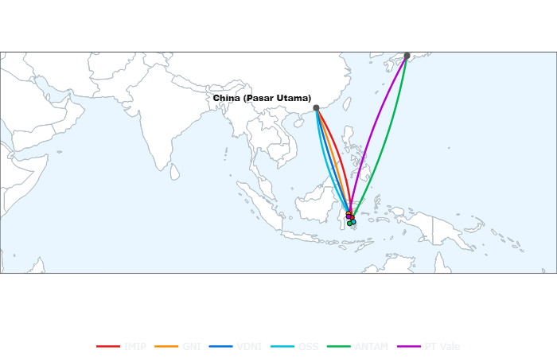

    Anatomi Rantai Pasok Logistik Maritim

    Peta rute logistik maritim mengilustrasikan alur distribusi produk olahan nikel dari kawasan industri di Sulawesi:
    
        Orientasi Ekspor: Kawasan industri utama (IMIP, GNI, VDNI/OSS) yang berstatus Proyek Strategis Nasional (PSN) mengalirkan produk olahan (NPI, Feronikel, Matte) ke sentra-sentra industri manufaktur di pasar internasional.
        Integrasi Rantai Pasok: Mayoritas rute pengapalan terhubung langsung dengan pelabuhan ekspor tujuan, yang mengindikasikan posisi kawasan pemurnian di Sulawesi sebagai pemasok bahan baku setengah jadi pada rantai pasok global.
        Dinamika Rute Maritim: Peta rute mencerminkan diversifikasi pasar ekspor, di mana beberapa fasilitas terhubung dengan pasar Asia Timur (Jepang dan Korea Selatan), sementara fasilitas baru terintegrasi dengan jaringan logistik utama kawasan Asia.

**Lihat Data Mentah: Jalur Distribusi Logistik Nikel Sulawesi**

| Nama Smelter   |   Lon Origin |   Lat Origin |   Lon Dest |   Lat Dest |
|:---------------|-------------:|-------------:|-----------:|-----------:|
| IMIP           |       122.15 |        -2.82 |      113.8 |       22.8 |
| GNI            |       121.32 |        -1.91 |      113.8 |       22.8 |
| VDNI           |       122.42 |        -3.83 |      113.8 |       22.8 |
| OSS            |       122.48 |        -3.8  |      113.8 |       22.8 |
| ANTAM          |       121.6  |        -4.18 |      135   |       35   |
| PT Vale        |       121.34 |        -2.56 |      135   |       35   |

*ℹ️ **Sumber File:** data/processed/sulawesi_logistik_simpul_nikel.csv - Pemetaan koordinat smelter dan pelabuhan tujuan akhir (agregasi spasial).*

