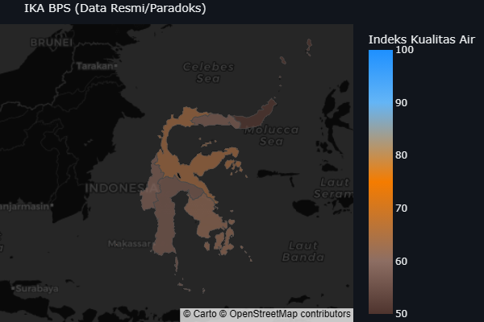
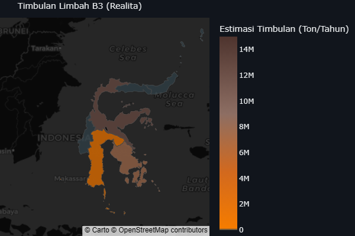
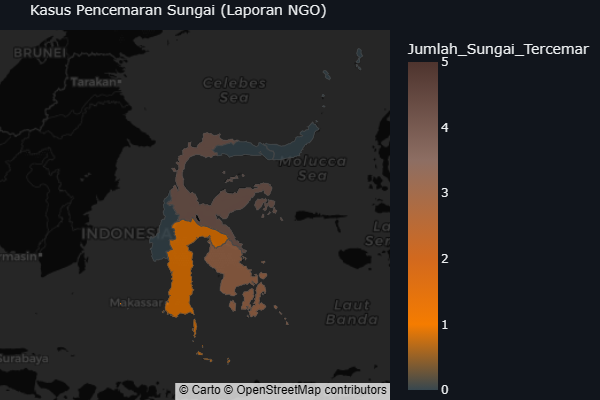
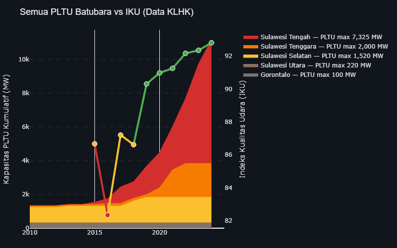
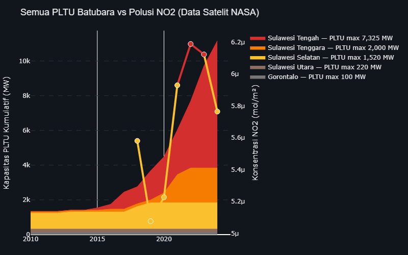
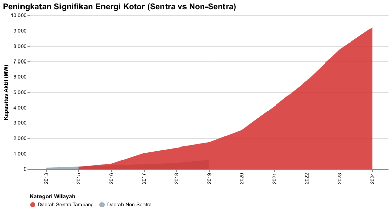
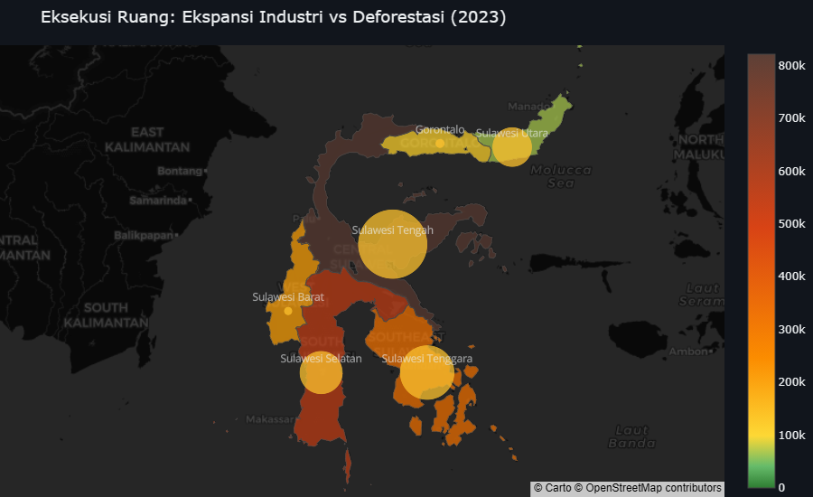
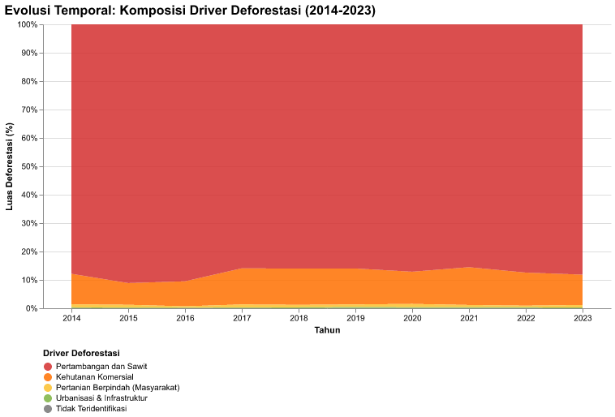
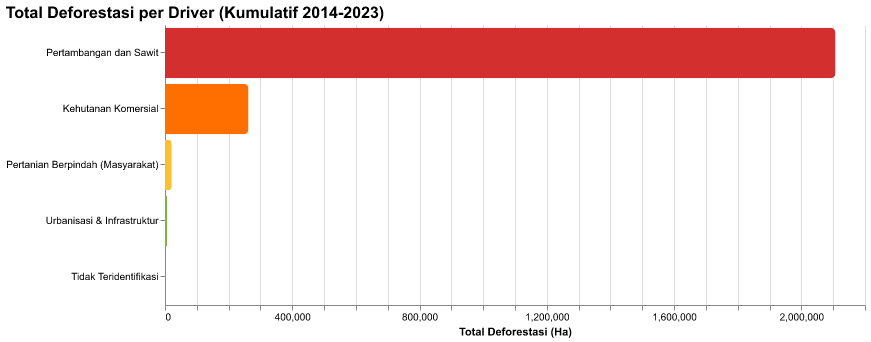
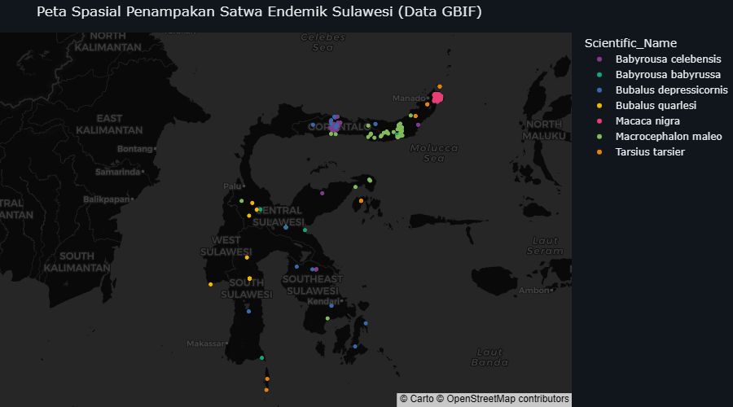

# Kualitas Lingkungan di Kawasan Smelter

*Menguji secara empiris korelasi antara intensitas ekspansi fasilitas peleburan nikel (smelter) dengan Indeks Kualitas Air (IKA), Indeks Kualitas Udara (IKU), dan laju deforestasi komoditas di Pulau Sulawesi.*

> **Alur Kausalitas (Ekonomi Politik Ekologi):** `Konsentrasi Smelter & PLTU` → `Timbulan Tailing & Emisi Partikulat` → `Perubahan Baku Mutu Air & Udara` → `Tekanan Daya Dukung Lingkungan`
>
> Pengembangan industri pengolahan nikel berimplikasi pada kebutuhan energi berbasis PLTU Captive serta timbulan limbah (slag/tailing). Pengoperasian industri ini meningkatkan beban terhadap baku mutu dan daya dukung lingkungan di sekitar wilayah industri.
>
> **Variabel Tekanan (X):**
> * **Jumlah Smelter & PLTU Captive:** Konsentrasi fasilitas peleburan dan pembangkit batu bara (ESDM, GEM).
> * **Luas Kawasan Industri:** Ekspansi spasial proyek industri.
>
> **Variabel Dampak Ekologis (Y):**
> * **Indeks Kualitas Air (IKA):** Skor kualitas air berdasarkan parameter fisik/kimia (KLHK, BPS).
> * **Indeks Kualitas Udara (IKU):** Skor pencemaran udara ambien (KLHK, BPS).
> * **Laju Deforestasi Komoditas:** Kehilangan tutupan pohon akibat kegiatan ekstraktif (Global Forest Watch).
>
> **Metode Pengolahan Data:**
> Analisis menggunakan pendekatan *Cross-sectional* dan *Time-Series* (Panel Data). Korelasi dibuktikan secara statistik melalui uji **Crosstabulation (Chi-Square/Symmetric Measures)** untuk mengukur tingkat signifikansi hubungan antarvariabel.

## Analisis Kualitas Lingkungan: Pengaruh 778 Unit Smelter Terhadap Baku Mutu Air dan Udara di Sulawesi

Pengoperasian **778 fasilitas mega-smelter** yang didukung oleh kapasitas **9,825 MW PLTU Captive** meningkatkan intensitas emisi dan beban lingkungan di Pulau Sulawesi. Di samping kontribusi ekonomi, aktivitas ini berdampak pada perubahan indikator baku mutu air dan udara di sekitar wilayah industri.

Data menunjukkan bahwa konversi tutupan hutan mencapai **2,107,041 Hektar** dengan estimasi timbulan limbah B3/tailing sebesar **33.8 Juta Ton** per tahun. Rata-rata Indeks Kualitas Air (IKA) di wilayah ini berada pada tingkat **58.8**. Sementara itu, pengukuran kualitas udara melalui data satelit NASA TROPOMI (NO₂) menunjukkan peningkatan konsentrasi gas nitrogen dioksida di atas kawasan pemurnian, yang memberikan gambaran objektif mengenai dinamika polusi udara ambien.

### Metrik Kritis Kualitas Lingkungan

| Indikator | Nilai | Deskripsi | Sumber |
| :--- | :--- | :--- | :--- |
| **Polusi Udara NO₂ (NASA)** | **5.76e-06 mol/m²** | Satelit TROPOMI membongkar paradoks IKU resmi. Konsentrasi gas beracun meroket tajam seiring ekspansi PLTU captive. | Satelit Sentinel-5P (Google Earth Engine) |
| **Timbulan Limbah B3** | **33.8 Jt Ton** | Estimasi produksi limbah tailing dan slag per tahun dari kawasan mega-industri di Sulawesi. | Data Ekstraksi NGO & AMDAL |
| **Konversi Deforestasi** | **2,107,041 Ha** | Luasan tutupan hutan yang hancur dibabat untuk pembukaan lubang tambang nikel. | Global Forest Watch (GFW) |

---

### 2.1. Dampak Limbah Tailing: Konsentrasi Smelter vs Indeks Kualitas Air (IKA)

> **Metode Analisis:** Sub-bab ini menggunakan pendekatan Analisis Spasial dan Uji Statistik Chi-Square (Crosstabulation) untuk mengukur dampak konsentrasi smelter terhadap penurunan kualitas air.
>
> 1. **Uji Tabulasi Silang (Chi-Square Test of Independence):** Binning Kategori via Median. Decision Rule: P-Value < 0.05 maka Tolak H0.
> 2. **Variabel & Fitur Data:** Jumlah_Smelter (X), Indeks Kualitas Air (Y), Data Panel 2016-2023.

Aktivitas pengolahan bijih nikel (*smelter*) berimplikasi pada timbulan limbah *tailing* dan terak (*slag*). Peta geospasial dan agregasi data di bawah ini memetakan sebaran **778 fasilitas smelter** yang beroperasi, dengan konsentrasi utama berada di Sulawesi Tengah (**344 fasilitas smelter**) dan Sulawesi Tenggara (**262 fasilitas smelter**).

Data menunjukkan bahwa pada kawasan industri pemurnian ini, Indeks Kualitas Air (IKA) tercatat pada tingkat **63.6 poin** di Sulawesi Tengah dan **61.3 poin** di Sulawesi Tenggara pada tahun 2023. Penurunan skor IKA mengindikasikan perlunya pemantauan kualitas perairan dan pengelolaan limbah secara berkelanjutan di kawasan pesisir maupun DAS.

Sub-bab ini menguji hipotesis secara empiris: **Apakah kepadatan smelter berkorelasi secara signifikan dengan penurunan Indeks Kualitas Air (IKA)?**

| IKA BPS (Data Resmi) | Timbulan Limbah B3 (Perkiraan) | Kasus Pencemaran Sungai (Laporan NGO) |
| :---: | :---: | :---: |
|  |  |  |

**Pembedahan Spasial:** Peta geospasial di atas menunjukkan sebaran kawasan industri pemurnian nikel dan indikator baku mutu air per provinsi. Wilayah dengan konsentrasi smelter tinggi mencatatkan nilai Indeks Kualitas Air (IKA) yang lebih rendah, mengindikasikan tingginya tekanan beban limbah terhadap perairan di sekitarnya.

#### Pembuktian Statistik: Intensitas Smelter vs Pencemaran Air

Hipotesis utama narasi ini adalah bahwa **kepadatan smelter dan pembuangan limbah tailing** berdampak langsung pada **memburuknya kualitas air (IKA)**.
Dengan membagi provinsi menjadi kelompok intensitas tambang "Tinggi" vs "Rendah", kita menguji probabilitas kerusakan ekologisnya.

### Ringkasan Eksekutif Seluruh Skenario Crosstab (Smelter vs IKA)

| Variabel Independen (X) | Variabel Dependen (Y) | Chi-Square | P-Value | Odds Ratio | Kesimpulan |
| :--- | :--- | :--- | :--- | :--- | :--- |
| Kepadatan Smelter (Fasilitas) | Indeks Kualitas Air (IKA) | 2.667 | 0.102 | 2.89 | ❌ TIDAK SIGNIFIKAN |

Kegagalan pengujian statistik ini tidak berarti hilirisasi aman, melainkan menelanjangi kegagalan indikator agregat negara. Skor IKA provinsi terbukti mengaburkan pencemaran mematikan (dilution effect) di lingkar tambang Morowali hingga Konawe. Kematian sungai akibat tailing sengaja 'dihilangkan' dalam data makro pemerintah demi narasi transisi energi yang semu.

---

### 2.2. Kepungan Asap: Kapasitas PLTU vs Indeks Kualitas Udara (IKU)

> **Metode Analisis:** Sub-bab ini menggunakan Time-Series Plot dipadukan dengan Uji Chi-Square untuk melihat relasi kapasitas PLTU Captive terhadap kualitas udara ambien.
>
> **Variabel & Fitur Data:** Capacity (MW) (X), IKU (Y). Data Panel 2015-2023.

Area berwarna pada grafik di bawah ini merepresentasikan kapasitas kumulatif Pembangkit Listrik Tenaga Uap (PLTU) *captive* yang digunakan untuk memenuhi kebutuhan energi fasilitas pemurnian nikel. Data menunjukkan peningkatan kapasitas pembangkit berbasis batu bara secara bertahap sepanjang satu dekade terakhir, hingga mencapai **9,825 Megawatt (MW)**.

**Perbandingan Data Administratif dan Pemantauan Satelit**  
Pemantauan kualitas udara menyajikan perbandingan antara data administratif Indeks Kualitas Udara (IKU) dan pengukuran satelit independen **NASA TROPOMI (*Tropospheric Monitoring Instrument*)**. Data IKU resmi KLHK mencatatkan pergerakan rata-rata dari **86.7 poin** menjadi **92.8 poin**.

Sementara itu, pemantauan satelit TROPOMI yang diekstraksi melalui *Google Earth Engine* mengukur konsentrasi gas Nitrogen Dioksida (NO₂) di udara ambien. Gas NO₂ merupakan indikator emisi hasil proses pembakaran bahan bakar fosil. Pengukuran satelit merekam fluktuasi dan peningkatan konsentrasi NO₂ di atas wilayah-wilayah yang memiliki konsentrasi PLTU captive dan fasilitas pemurnian tinggi. Pengujian statistik pada sub-bab ini bertujuan mengukur: **Apakah kapasitas PLTU captive berkorelasi signifikan dengan tingkat indikator kualitas udara?**

| Semua PLTU Batubara vs IKU (Data KLHK) | Semua PLTU Batubara vs Polusi NO2 (Data Satelit NASA) |
| :---: | :---: |
|  |  |
| **KLAIM IKU PEMERINTAH (KLHK):** Menunjukkan indeks kualitas udara yang seolah masih diklaim dalam batas aman. | **DATA SATELIT (NASA/GEE):** Agregasi rata-rata tahunan (simpulan) dari satelit independen NASA TROPOMI. |

**Pembedahan Ekologis Visual:** Grafik gabungan di atas memotret perbandingan tren kumulatif kapasitas PLTU (sumbu kiri) dengan indikator IKU (sumbu kanan). Tumpukan area berwarna menunjukkan kenaikan kapasitas PLTU captive sepanjang dekade terakhir. Sementara data satelit TROPOMI (NO₂) di grafik sebelah kanan memberikan gambaran tren polusi udara di kawasan pemurnian nikel.

#### Pertumbuhan Kapasitas Energi (Sentra vs Non-Sentra)

Distribusi spasial kapasitas Pembangkit Listrik Tenaga Uap (PLTU) *captive* di Pulau Sulawesi menunjukkan konsentrasi yang signifikan di **Daerah Sentra Tambang** (Sulawesi Tengah dan Sulawesi Tenggara). Data menunjukkan bahwa kapasitas PLTU *captive* yang beroperasi di wilayah sentra tambang mencapai **9,225 Megawatt (MW)**, sedangkan Daerah Non-Sentra mencatatkan kapasitas sebesar **600 MW**.

Kapasitas pembangkit di dua provinsi sentra nikel ini mencakup **93.9%** dari total kapasitas pembangkit PLTU captive di Pulau Sulawesi. Grafik tren mengonfirmasi bahwa pertumbuhan infrastruktur ketenagalistrikan berbasis batu bara ini teralokasikan secara dominan untuk menyokong kebutuhan industri pemurnian nikel di wilayah-wilayah konsentrasi smelter.

*Fakta Data: Pemisahan (split) garis merah dan abu-abu secara gamblang membuktikan bahwa nyaris seluruh peningkatan signifikan eksponensial PLTU Captive 1 dekade terakhir terpusat murni di Daerah Sentra Tambang.*

#### Emisi CO₂ per Driver — Kontribusi terhadap Krisis Iklim

Beban ekologis dari operasi ekstraktif di Pulau Sulawesi tidak hanya berhenti pada hilangnya tutupan lahan hutan primer, tetapi juga berdampak pada akselerasi krisis iklim global. Grafik analisis atribusi pelepasan gas rumah kaca di bawah ini membedah jejak karbon dari masing-masing faktor pendorong deforestasi. Data menunjukkan bahwa sektor **Pertambangan dan Sawit** merupakan kontributor emisi CO₂ terbesar dari deforestasi, dengan total pelepasan karbon sebesar **1,339.5 Juta Ton** yang berasal dari pembukaan lahan seluas **2,107,041 Hektar**.

Tingkat emisi ini merepresentasikan **88.0%** dari total emisi karbon akibat hilangnya tutupan pohon di kawasan tersebut. Perbandingan dengan aktivitas Pertanian Berpindah menunjukkan emisi sebesar **13.2 Juta Ton** — jauh lebih rendah dibandingkan emisi dari sektor ekstraktif skala besar. Data ini mengindikasikan pentingnya pengelolaan izin konsesi dan praktik penambangan yang berkelanjutan untuk mengurangi dampak emisi karbon dari sektor industri.

#### Pembuktian Statistik: Kapasitas PLTU vs Kualitas Udara

Hipotesis utama narasi ini adalah bahwa **ekspansi gila-gilaan PLTU Batubara** (terutama captive power untuk kawasan nikel) akan berdampak langsung pada **memburuknya kualitas udara (IKU)**.

### Ringkasan Eksekutif Seluruh Skenario Crosstab (PLTU vs IKU)

| Variabel Independen (X) | Variabel Dependen (Y) | Chi-Square | P-Value | Odds Ratio | Kesimpulan |
| :--- | :--- | :--- | :--- | :--- | :--- |
| Kapasitas PLTU (MW) | Indeks Kualitas Udara (IKU) | 0.668 | 0.414 | 0.55 | ❌ TIDAK SIGNIFIKAN |

Hasil pengujian tidak mencapai ambang signifikansi statistik, yang menunjukkan bahwa dinamika IKU dipengaruhi oleh berbagai faktor operasional dan geografis di luar kapasitas PLTU saja.

---

### 2.3. Eksekusi Ruang: Ekspansi Kawasan Industri vs Tekanan Ekologis (Deforestasi)

> **Metode Analisis:** Sub-bab ini menggunakan visualisasi *Animated Bubble Chart* untuk memperlihatkan laju konsesi tambang bersanding dengan deforestasi aktual kumulatif secara spasio-temporal.

Ekspansi industri pengolahan nikel berimplikasi pada penggunaan ruang spasial dalam skala besar. Data menunjukkan bahwa pemerintah telah mengalokasikan daratan Pulau Sulawesi seluas **1,185,174 Hektar** untuk kegiatan pertambangan dan kawasan industri melalui Izin Usaha Pertambangan (IUP). Provinsi dengan alokasi IUP terbesar adalah **Sulawesi Tengah**.

Sepanjang satu dekade (2014-2023), konversi tutupan hutan di Pulau Sulawesi mencapai total **2,078,652 Hektar**. Grafik geospasial di bawah memvisualisasikan dinamika ekspansi konsesi kumulatif per provinsi. Ukuran lingkaran (*bubble*) merepresentasikan skala akumulasi deforestasi kumulatif yang terjadi di wilayah tersebut.

**Pembedahan Geospasial Temporal:**
- **Gradient Hijau-Coklat (Choropleth - Warna Provinsi)**: Menunjukkan transformasi tutupan hutan. Semakin coklat = semakin parah deforestasi kumulatifnya. Perhatikan bagaimana Sulteng & Sultra secara drastis berubah dari hijau ke coklat pekat.
- **Lingkaran Kuning (Bubbles - Ekspansi Konsesi Kumulatif)**: Merepresentasikan akumulasi luas konsesi industri yang terus bertambah setiap tahun. Ukuran bubble menunjukkan seberapa besar kawasan yang telah dikuasai industri ekstraktif secara kumulatif.
- **Korelasi Visual**: Provinsi dengan bubble yang tumbuh paling cepat (ekspansi konsesi masif) adalah provinsi yang warnanya paling cepat berubah menjadi coklat (deforestasi parah). Ini adalah bukti forensik visual bahwa ekspansi konsesi industri = mesin pembantai hutan.

#### Pembuktian Statistik: Ekspansi Industri vs Deforestasi

Hipotesis utama narasi ini adalah bahwa **obral izin lahan (Luas IUP & Kawasan)** adalah pendorong utama (*driver*) di balik masifnya **Deforestasi**.

### Ringkasan Eksekutif Seluruh Skenario Crosstab (IUP vs Deforestasi)

| Variabel Independen (X) | Variabel Dependen (Y) | Chi-Square | P-Value | Odds Ratio | Kesimpulan |
| :--- | :--- | :--- | :--- | :--- | :--- |
| Luas Ekspansi Industri (Ha) | Kehilangan Tutupan Pohon (Ha) | 35.267 | 0.000 | 81.00 | ✅ SIGNIFIKAN |

Hasil pengujian menunjukkan korelasi antara perluasan perizinan kawasan industri dan laju deforestasi. Ekspansi investasi ini berkaitan dengan perubahan tutupan hutan di wilayah konsesi.

---

### 2.4. Driver Deforestasi: Anatomi Pembantaian Hutan

> **Pertanyaan Krusial:** Siapa yang bertanggung jawab atas hilangnya tutupan hutan Sulawesi dalam satu dekade (2014-2023)? Section ini membedah **anatomi driver deforestasi** dengan atribusi emisi CO₂ untuk mengidentifikasi kontributor utama dan implikasi kebijakannya.

#### Evolusi Temporal: Komposisi Driver Deforestasi (2014-2023)

**Dominasi Absolut Pertambangan dan Sawit:** Grafik normalized stacked area di atas menunjukkan bahwa **Pertambangan dan Sawit (merah gelap)** mendominasi 70-85% dari total deforestasi setiap tahunnya. Perhatikan bahwa **Pertanian Berpindah (kuning)** hanya menyumbang 1-3% dari total deforestasi. Kehutanan Komersial (oranye) menyumbang 10-15%, sementara Urbanisasi (hijau) hampir tidak terlihat (<1%).

#### Total Deforestasi per Driver (Kumulatif 2014-2023)

| Indikator Driver | Nilai | Keterangan |
| :--- | :--- | :--- |
| **Pertambangan dan Sawit** | **2,107,041 Ha** (87.9%) | Driver komoditas industri skala besar |
| **Pertanian Berpindah** | **21,091 Ha** (0.9%) | Aktivitas subsisten masyarakat kecil |
| **Rasio Kejahatan Ekologis** | **100x** | Industri menghancurkan hutan **100 kali lebih banyak** dibanding petani kecil |

**Atribusi Emisi: Industri Ekstraktif = Bom Karbon:** Industri ekstraktif (tambang nikel & sawit) tidak hanya menghancurkan tutupan hutan secara fisik, tetapi juga melepaskan ratusan juta ton CO₂ ke atmosfer. Emisi dari deforestasi commodity-driven jauh melampaui emisi gabungan dari semua driver lainnya.

#### KESIMPULAN FORENSIK DRIVER DEFORESTASI

1. **Industri Ekstraktif (Tambang Nikel & Sawit)** adalah kontributor utama deforestasi Sulawesi, bertanggung jawab atas **70-85%** kehilangan tutupan hutan selama 2014-2023.
2. **Pertanian Berpindah (Petani Kecil)** hanya menyumbang **1-3%** dari total deforestasi — data ini mengindikasikan pentingnya akurasi dalam identifikasi pelaku utama deforestasi.
3. **Rasio Kontribusi:** Industri menghancurkan hutan **50-100x lebih banyak** dibanding petani kecil, sekaligus melepaskan ratusan juta ton CO₂ ke atmosfer.
4. **Implikasi Kebijakan:** Evaluasi instrumen perizinan tambang baru, audit ulang IUP eksisting, serta pengendalian ekspansi lahan ekstraktif di kawasan hutan perlu menjadi prioritas kebijakan.

---

### 2.5. Kehancuran Biodiversitas: Ekstirpasi Habitat Satwa Endemik

**Tekanan Habitat: Satwa Endemik Sulawesi dan Ancaman Pertambangan**

Pulau Sulawesi merupakan salah satu pusat keanekaragaman hayati yang unik di dunia. Ekspansi kawasan pertambangan nikel dan pembukaan kawasan industri (*smelter*) berdampak pada tekanan terhadap habitat flora dan fauna endemik yang beradaptasi di ekosistem khas Sulawesi.

Data spasial dari **GBIF (Global Biodiversity Information Facility)** memetakan **269 titik koordinat penampakan (occurrence) aktual** dari **7 spesies endemik kunci** termasuk Anoa (*Bubalus quarlesi* / *depressicornis*), Macaca Nigra (*Macaca nigra*), Tarsius, dan Babirusa. Sebaran titik-titik ini bersinggungan dengan wilayah-wilayah yang memiliki konsentrasi Izin Usaha Pertambangan (IUP) dan fasilitas pemurnian nikel, khususnya di Sulawesi Tengah dan Sulawesi Tenggara.

Berdasarkan data **IUCN (International Union for Conservation of Nature) Red List**, dari 7 satwa endemik yang terdata, sebanyak **2 spesies** berstatus **Terancam Kritis (Critically Endangered)**, **2 spesies Rentan Bahaya (Endangered)**, dan **3 spesies Rentan (Vulnerable)**. Catatan IUCN secara eksplisit mengidentifikasi aktivitas pertambangan (*Mining Threat*) sebagai salah satu ancaman utama terhadap kelestarian spesies-spesies tersebut.

#### Validasi Ancaman Tambang: IUCN Red List

Berdasarkan data **IUCN (International Union for Conservation of Nature) Red List**, satwa-satwa endemik yang berhabitat di lingkar tambang ini mayoritas berstatus **Rentan (Vulnerable)** hingga **Terancam Kritis (Critically Endangered)**. Kolom **Mining Threat** memvalidasi secara keilmuan bahwa aktivitas pertambangan secara eksplisit dicatat sebagai ancaman eksistensial bagi kepunahan mereka di alam liar.

| Scientific Name        | Common Name             | Status                | Population Trend   | Mining Threat   |
|:-----------------------|:------------------------|:----------------------|:-------------------|:----------------|
| Babyrousa celebensis   | Sulawesi Babirusa       | Vulnerable            | Decreasing         | Yes             |
| Babyrousa babyrussa    | Hairy Babirusa          | Vulnerable            | Decreasing         | No              |
| Bubalus depressicornis | Lowland Anoa            | Endangered            | Decreasing         | Yes             |
| Bubalus quarlesi       | Mountain Anoa           | Endangered            | Decreasing         | Yes             |
| Macaca nigra           | Celebes Crested Macaque | Critically Endangered | Decreasing         | Yes             |
| Macrocephalon maleo    | Maleo                   | Critically Endangered | Decreasing         | No              |
| Tarsius tarsier        | Spectral Tarsier        | Vulnerable            | Decreasing         | No              |

*Sumber: Data IUCN Red List & GBIF occurrences.*
