    
Daya Dukung Lingkungan Hidup Indonesia

---

---

---

# Beban Kesehatan Masyarakat Terdampak

*Tinjauan empiris beban kesehatan masyarakat akibat paparan emisi dan polutan industri di kawasan penyangga smelter nikel Sulawesi.*

🔍 Metodologi

**Alur Kausalitas (Ekonomi Politik Ekologi):** `Konsentrasi Industri Ekstraktif` → `Penurunan Kualitas Daya Dukung Lingkungan` → `Peningkatan Insidensi Penyakit (ISPA, Diare) & Ketimpangan Faskes`

Ekspansi industri ekstraktif berpotensi memengaruhi kualitas lingkungan hidup masyarakat setempat. Pembuangan polutan ke udara ambien dan badan air berkorelasi dengan peningkatan insidensi penyakit respiratori dan infeksi saluran pencernaan, yang diperparah oleh ketimpangan distribusi fasilitas kesehatan.

**Variabel Dampak Kesehatan (Y):**
*   **ISPA/Pneumonia:** Penyakit pernapasan akibat paparan debu dan sulfur.
*   **Diare & Penyakit Menular (Malaria/Kusta):** Dampak pencemaran air dan buruknya sanitasi di lingkar tambang.
*   **Ketersediaan Fasilitas Kesehatan:** Kesenjangan infrastruktur medis (Puskesmas & Rumah Sakit) terhadap pertumbuhan beban kasus penyakit.

**Metode Pengolahan Data:**
Analisis menggunakan *Cross-sectional* dan *Time-Series*. Menggabungkan dataset *survey* dinas kesehatan dan ketersediaan layanan publik untuk menganalisis korelasi antara pertumbuhan kapasitas PLTU *captive* dan peningkatan beban penyakit di masyarakat dengan ketersediaan fasilitas medis yang terbatas.

## Hilirisasi Nikel dan Dampak Kesehatan: Analisis Data Empiris di Kawasan Penyangga

    
        Data empiris menggambarkan kesenjangan antara klaim pertumbuhan ekonomi dari ekspansi industri nikel dan kondisi kesehatan masyarakat di kawasan penyangga. Selama satu dekade terakhir, emisi partikulat, gas buang PLTU batu bara, dan timbulan limbah dari fasilitas ekstraktif telah memberikan tekanan signifikan terhadap kualitas lingkungan hidup masyarakat. Data empiris merekam bagaimana ekspansi kapasitas industri, yang ditopang oleh PLTU *captive* berkapasitas **9,825 Megawatt**, berjalan sejajar dengan peningkatan kasus penyakit di kawasan-kawasan penyangga.
    

    
        Sepanjang 2014–2024, data agregat dinas kesehatan mencatat total **kasus ISPA dan Pneumonia sebanyak 233,687 kasus**. Sementara itu, **kasus Diare tercatat sebanyak 2,286,607 kasus**. Peningkatan insidensi penyakit ini berkorelasi dengan penurunan Indeks Kualitas Air (IKA) secara periodik. Konversi tutupan hutan untuk perluasan konsesi tambang turut berkontribusi pada pergeseran habitat satwa liar, yang berpotensi memicu perpindahan vektor penyakit zoonosis ke permukiman warga. Secara kumulatif, **kasus Malaria tercatat mencapai 50,877 kasus**, mengindikasikan tekanan terhadap keseimbangan ekologis di wilayah tambang.
    

    
        Distribusi infrastruktur kesehatan di wilayah industri menunjukkan kesenjangan yang perlu menjadi perhatian. Ketersediaan fasilitas layanan primer seperti **Puskesmas tercatat sebanyak 1,393 unit** pada tahun 2024, di kawasan yang bersamaan menanggung beban penyakit di atas rata-rata. Kondisi ini mengindikasikan bahwa pertumbuhan ekonomi dari hilirisasi nikel belum diimbangi dengan distribusi infrastruktur kesehatan yang proporsional bagi masyarakat di wilayah operasi industri (*sacrifice zone*).

### Metrik Agregat

| Indikator | Nilai | Deskripsi | Sumber |
| :--- | :--- | :--- | :--- |
| **Total Kasus ISPA/Pneumonia** | **233,687** | Penyakit pernapasan yang meningkat secara konsisten, seiring paparan kronis debu batu bara dan emisi SO₂ dari cerobong *smelter*. | **Sumber:** Data Agregat Dinas Kesehatan (2014-2024)*File: sulawesi_kesehatan_detail_2014_2024.csv* |
| **Total Kasus Diare** | **2,286,607** | Infeksi saluran pencernaan yang tercatat tinggi, seiring degradasi kualitas sumber air tanah dan badan air akibat limbah tailing tambang. | **Sumber:** Data Agregat Dinas Kesehatan (2014-2024)*File: sulawesi_kesehatan_detail_2014_2024.csv* |
| **Total Kasus Malaria** | **50,877** | Penyakit vektor endemis dengan kecenderungan meningkat, berkorelasi dengan keberadaan genangan air bekas galian tambang yang tidak direklamasi. | **Sumber:** Data Agregat Dinas Kesehatan (2014-2024)*File: sulawesi_kesehatan_detail_2014_2024.csv* |
| **Rasio Puskesmas Terdaftar (2024)** | **1,393 Unit** | Fasilitas primer warga yang pertumbuhannya tidak sebanding dengan peningkatan beban kasus penyakit di wilayah industri. | **Sumber:** BPS Ketersediaan Faskes*File: sulawesi_faskes_agregat_v3.csv* |
| **Rasio Rumah Sakit (2024)** | **300 Unit** | Ketersediaan rumah sakit yang tidak merata di wilayah timur, mengindikasikan belum optimalnya distribusi infrastruktur medis. | **Sumber:** BPS Ketersediaan Faskes*File: sulawesi_faskes_agregat_v3.csv* |

---

### 3.1 Kesenjangan Fasilitas Kesehatan di Kawasan Ekstraktif

> **Metode: Grouped Horizontal Bar Chart (Data 2022)**

ℹ️ Metodologi: Grouped Horizontal Bar Chart

**Metode Analisis:** Sub-bab ini menggunakan visualisasi perbandingan *Grouped Horizontal Bar Chart* pada satu periode cross-sectional (Tahun 2024) untuk mengukur ketimpangan infrastruktur kesehatan primer dan sekunder.

1. **Analisis Ketimpangan Infrastruktur (Gap Analysis):**
    * **Segmentasi Fasilitas:** Fasilitas kesehatan dikategorikan secara hierarkis menjadi Puskesmas (Faskes Primer) dan Rumah Sakit (Faskes Sekunder) untuk dievaluasi secara spasial (Sentra vs Non-Sentra).
    * **Evaluasi Defisit:** Mengukur kesenjangan distribusi rasio fasilitas medis per provinsi menggunakan analisis komparatif absolut.
    * **Pemetaan Ketersediaan:** Membedah paradoks ketersediaan layanan kesehatan di wilayah pusat akumulasi kapital ekstraktif sebagai pembuktian defisit infrastruktur publik.
2. **Kalkulasi/Formula Pengolahan:** Perhitungan agregat ketersediaan faskes menurut wilayah pada tahun acuan data terbaru (2024).
    * `Rata_Rata_Faskes = MEAN(Jumlah_Faskes) GROUP BY Jenis_Faskes, Kategori_Zona`
3. **Variabel & Fitur Data:**
    * **Jumlah & Jenis Faskes (Dependen):** Unit Rumah Sakit dan Puskesmas terdaftar (BPS).
    * **Kategori Zona (Independen):** Lokasi wilayah (Sentra vs Non-Sentra).
4. **Dataset & File:**
    * Data Agregat Faskes: `data/processed/sulawesi_faskes_agregat_v3.csv`

Data perbandingan distribusi fasilitas kesehatan mengindikasikan bahwa ketersediaan infrastruktur medis di provinsi sentra industri relatif tidak lebih baik dibandingkan wilayah non-sentra, meski beban penyakit di wilayah tersebut lebih tinggi.

Melalui komparasi grafik batang (*Grouped Bar Chart*) di bawah, terlihat bahwa ketersediaan Fasilitas Kesehatan di provinsi dengan konsentrasi industri tinggi justru mengalami defisit relatif. Rata-rata Rumah Sakit di Sentra Industri tercatat **40 unit** per provinsi, lebih rendah dari wilayah Non-Sentra yang mencapai **55 unit**. Kesenjangan distribusi fasilitas medis di area dengan beban penyakit tinggi ini perlu menjadi pertimbangan dalam perencanaan infrastruktur kesehatan ke depan.

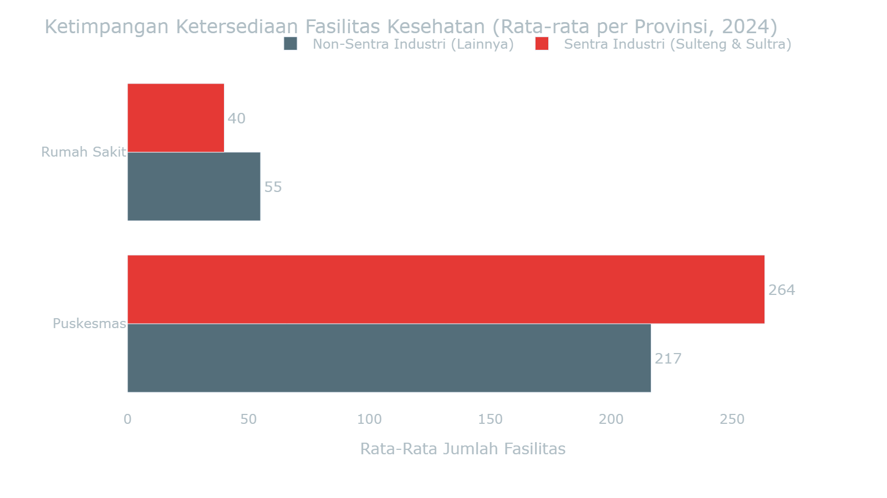

Lihat Data Mentah: Ketimpangan Faskes 2024

| Kategori                           | jenis_faskes   |   jumlah |
|:-----------------------------------|:---------------|---------:|
| Non-Sentra Industri (Lainnya)      | Puskesmas      |    216.5 |
| Non-Sentra Industri (Lainnya)      | Rumah Sakit    |     55   |
| Sentra Industri (Sulteng & Sultra) | Puskesmas      |    263.5 |
| Sentra Industri (Sulteng & Sultra) | Rumah Sakit    |     40   |

> 📁 **Sumber File:** `data/processed/sulawesi_faskes_agregat_v3.csv`

---

### 3.2 Ketimpangan Beban Penyakit: Sentra Industri vs Non-Sentra

> **Metode: Comparative Spatial Analysis (Dinas Kesehatan 2014-2024)**

ℹ️ Metodologi: Comparative Spatial Analysis

**Metode Analisis:** Sub-bab ini menggunakan analisis komparatif spasial (*Comparative Spatial Analysis*) untuk membandingkan rata-rata beban penyakit antara provinsi sentra ekstraktif dan non-sentra.

1. **Model Komparasi Spasial (Comparative Analysis):**
    * **Segmentasi Wilayah (Binning):** Provinsi secara sistematis dibagi menjadi dua zona: Sentra Industri (Sulteng & Sultra) dan Non-Sentra (Sulsel, Sulut, Gorontalo, Sulbar).
    * **Kuantifikasi Kesenjangan:** Menghitung rata-rata absolut beban kesakitan (*disease burden*) per zona untuk mengukur ketimpangan kesehatan struktural antar wilayah.
    * **Pemetaan Pola:** Mengidentifikasi secara analitik apakah konsentrasi fasilitas tambang berkorespondensi langsung dengan akumulasi masif kasus epidemiologis.
2. **Kalkulasi/Formula Pengolahan:** Perhitungan rata-rata absolut beban penyakit tahunan berdasarkan klasifikasi wilayah.
    * `Rata_Rata_Kasus_Zona = MEAN(Jumlah_Kasus) GROUP BY Kategori_Zona`
    * `Disparitas_Beban = Rata_Rata_Kasus_Sentra / Rata_Rata_Kasus_Non_Sentra`
3. **Variabel & Fitur Data:**
    * **Kategori Zona (Independen):** Labeling spasial (Sentra vs Non-Sentra).
    * **Kasus ISPA/Pneumonia & Diare (Dependen):** Total prevalensi historis penyakit per tahun dari fasilitas kesehatan primer.
4. **Dataset & File:**
    * Data Agregasi Kesehatan: `data/processed/sulawesi_kesehatan_detail_2014_2024.csv`

Melalui analisis komparatif spasial, terlihat bahwa beban ekologis tidak terdistribusi secara merata di seluruh wilayah. Provinsi sentra ekspansi nikel—Sulawesi Tengah dan Sulawesi Tenggara—menunjukkan indikator penyakit yang secara konsisten lebih tinggi.

Data menunjukkan bahwa rata-rata penderita **ISPA/Pneumonia** di Sentra Industri tercatat **5,353 kasus per tahun**, dibandingkan provinsi Non-Sentra di angka **2,634 kasus**. Selisih sebesar **2.0 kali lipat** ini mengindikasikan beban pernapasan yang lebih berat di kawasan penyangga *smelter*. Temuan ini mendukung hipotesis kerangka riset D3TLH: wilayah dengan konsentrasi industri tinggi cenderung menanggung beban kesehatan yang lebih besar akibat tekanan terhadap daya tampung lingkungan.

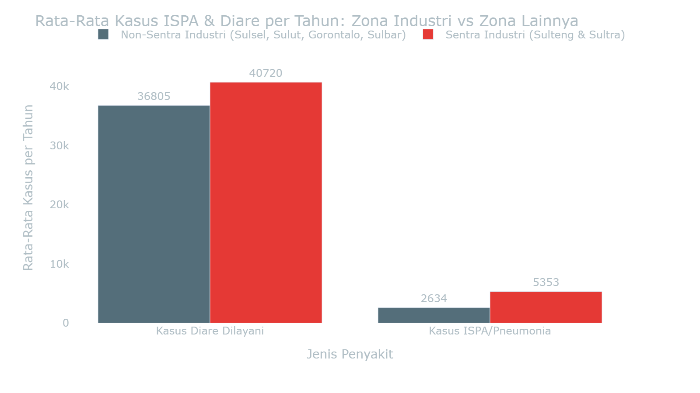

Lihat Data Mentah: Komparasi Kasus per Provinsi

| indikator            | Kategori                                               |    nilai |
|:---------------------|:-------------------------------------------------------|---------:|
| Kasus Diare Dilayani | Non-Sentra Industri (Sulsel, Sulut, Gorontalo, Sulbar) | 36805    |
| Kasus Diare Dilayani | Sentra Industri (Sulteng & Sultra)                     | 40720.3  |
| Kasus ISPA/Pneumonia | Non-Sentra Industri (Sulsel, Sulut, Gorontalo, Sulbar) |  2634.36 |
| Kasus ISPA/Pneumonia | Sentra Industri (Sulteng & Sultra)                     |  5353.41 |

> 📁 **Sumber File:** `data/processed/sulawesi_kesehatan_detail_2014_2024.csv` - Agregasi Rata-rata per Kategori Wilayah

> **Interpretasi Ekologis:** Kesenjangan statistik ini mengindikasikan bahwa manfaat ekonomi dari hilirisasi nikel belum disertai perbaikan infrastruktur kesehatan yang proporsional di wilayah operasi industri ekstraktif.

---

### 3.3 Lintasan Waktu Ekologis &amp; Dinamika Penyakit di Kawasan Industri Ekstraktif

> **Metode: Time-Series Line Chart & Crosstabulation**

ℹ️ Metodologi: Time-Series Line Chart & Crosstabulation

**Metode Analisis:** Sub-bab ini menggunakan visualisasi runtut waktu (Time-Series) dan uji silang (Crosstabulation) secara interaktif untuk merunut dinamika insiden penyakit sejalan dengan akumulasi polusi tahunan.

1. **Uji Trend Historis & Proporsi Tabulasi Silang:**
    * **Time-Series Tracking:** Mengkonversi absolute numbers ke rasio per kapita (Kasus per 10.000 Penduduk) untuk menghilangkan bias jumlah populasi antar wilayah.
    * `H0 (Null Hypothesis): Penurunan kualitas lingkungan (IKU/IKA) tidak berkorelasi dengan peningkatan insidensi penyakit pernapasan dan pencernaan.`
    * `Decision Rule: Chi-Square P-Value < 0.05 (Tolak H0) dan kalkulasi Odds Ratio.`
2. **Kalkulasi/Formula Pengolahan:** Rasio keparahan per kapita dan agregasi tabel silang panel.
    * `Insiden_Per_10K = (Total_Kasus / Total_Populasi) * 10,000`
    * `Odds_Ratio = (A * D) / (B * C)`
3. **Variabel & Fitur Data:**
    * **Indikator Kualitas Lingkungan (X):** IKU/IKA sebagai matriks tekanan lingkungan.
    * **Total Insiden Penyakit (Y):** Angka absolut & insiden per kapita dari beragam penyakit lingkungan (ISPA, Diare, Malaria, Kusta).
    * **Waktu (Time):** Periode longitudinal 2014-2024.
4. **Dataset & File:**
    * Data Lingkungan & Penyakit: `data/processed/sulawesi_kesehatan_detail_2014_2024.csv`, `data/processed/sulawesi_ika_2016_2024.csv`, `data/processed/sulawesi_iku_2015_2024.csv`

Meskipun secara akumulatif kawasan Sentra Industri menanggung beban yang lebih berat, penelusuran data secara *time-series* (historis) dari 2014 hingga 2024 memberikan wawasan tambahan mengenai fluktuasi kasus penyakit dari tahun ke tahun. Anda dapat memilih indikator penyakit pada menu di bawah untuk melihat jejak ekologis secara spesifik.

> Menampilkan tren pertumbuhan historis untuk **Kasus ISPA/Pneumonia**.

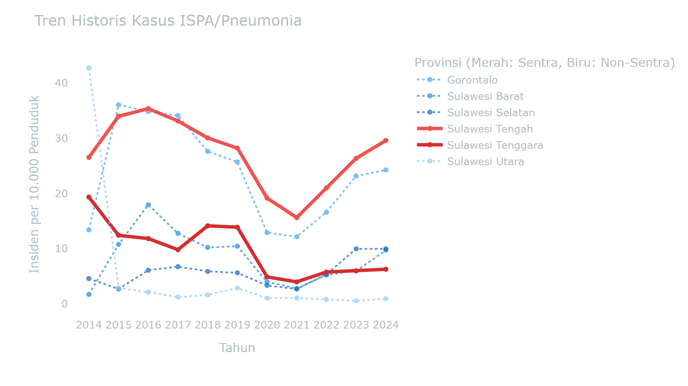

> INFO: **Insight Ekologis:** Grafik di atas membagi jumlah kasus terhadap total populasi, menampilkan **beban per kapita (rasio keparahan)** yang sesungguhnya. Terlihat jelas bahwa rasio kesakitan di kawasan Sentra Industri (garis merah tebal) lebih tinggi secara konsisten dibandingkan wilayah Non-Sentra.

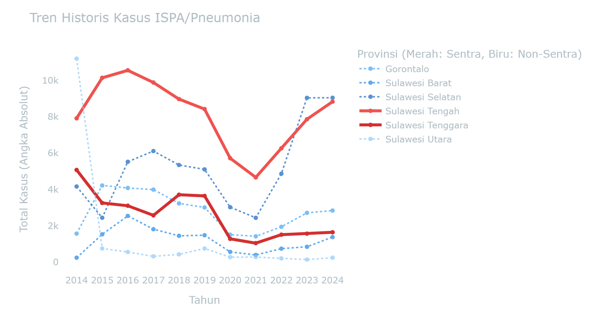

> WARNING: **Catatan Analitis (Population Bias):** Tingginya garis biru (contoh: Sulsel) pada grafik absolut ini merupakan anomali karena perbedaan populasi. Penduduk Sulsel (9 juta jiwa) 3x lebih besar dari Sulteng (3 juta jiwa). Ketersediaan rumah sakit rujukan yang baik di Sulsel juga meminimalisir *under-reporting* (kasus tak tercatat) yang banyak luput di lingkar tambang.

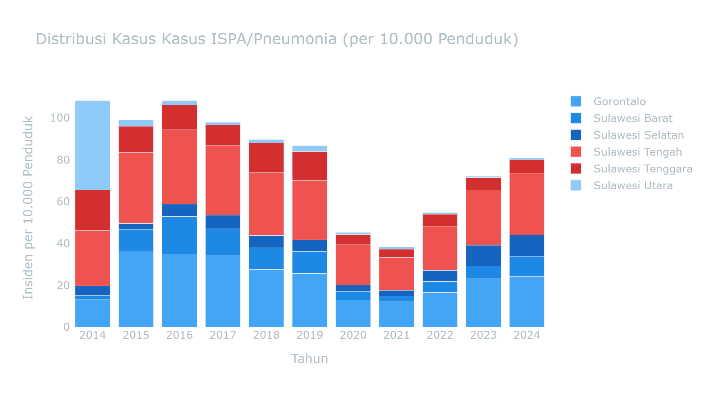

> INFO: **Interpretasi Data:** Proporsi beban kesakitan di wilayah Sentra Industri (blok warna merah) secara konsisten mendominasi dan semakin menebal dari tahun ke tahun. Akumulasi ini menunjukkan bahwa ekspansi kawasan industri berkorelasi dengan peningkatan beban kesehatan masyarakat di lingkar tambang.

Lihat Data Panel: Kasus ISPA/Pneumonia

|   tahun |   Gorontalo |   Sulawesi Barat |   Sulawesi Selatan |   Sulawesi Tengah |   Sulawesi Tenggara |   Sulawesi Utara |
|--------:|------------:|-----------------:|-------------------:|------------------:|--------------------:|-----------------:|
|    2014 |        1572 |              243 |               4168 |              7923 |                5081 |            11208 |
|    2015 |        4226 |             1532 |               2445 |             10152 |                3262 |              753 |
|    2016 |        4084 |             2549 |               5528 |             10565 |                3106 |              559 |
|    2017 |        3996 |             1815 |               6120 |              9895 |                2577 |              321 |
|    2018 |        3237 |             1450 |               5350 |              8980 |                3713 |              427 |
|    2019 |        3013 |             1484 |               5108 |              8430 |                3648 |              752 |
|    2020 |        1514 |              565 |               3027 |              5724 |                1283 |              274 |
|    2021 |        1424 |              396 |               2443 |              4668 |                1048 |              281 |
|    2022 |        1947 |              744 |               4872 |              6273 |                1515 |              209 |
|    2023 |        2716 |              848 |               9050 |              7873 |                1572 |              143 |
|    2024 |        2843 |             1381 |               9052 |              8840 |                1647 |              243 |

> 📁 **Sumber File:** `data/processed/sulawesi_kesehatan_detail_2014_2024.csv`

#### Uji Statistik: Asosiasi Kualitas Udara (IKU) dengan Insidensi Penyakit

Hipotesis utama narasi ini adalah bahwa **penurunan kualitas udara ambien (IKU)** berbanding lurus dengan **peningkatan insidensi penyakit pernapasan dan lingkungan** (seperti ISPA dan Diare).
Untuk mengujinya secara statistik di tengah keterbatasan jumlah provinsi di Sulawesi (N=6), tabel crosstab dan uji Chi-Square di bawah menggunakan unit observasi **Provinsi-Tahun** (6 provinsi × 10 tahun = 60 sampel panel).
Setiap observasi diklasifikasikan menjadi "Tinggi" atau "Rendah" berdasarkan nilai **Median panel** dari indikator yang dipilih.

##### Variabel Independen (X) - Faktor Lingkungan & Spasial

##### Variabel Dependen (Y) - Dampak Kesehatan

### Detail Uji Statistik (Chi-Square & Odds Ratio)

> Tabel-tabel di bawah ini adalah *output* statistik formal yang menyajikan bukti statistik formal: Case Processing → Crosstabulation → Chi-Square Tests → Ringkasan Hipotesis.

##### Case Processing Summary

|   ('Cases', 'Valid', 'N') | ('Cases', 'Valid', 'Percent')   |   ('Cases', 'Missing', 'N') | ('Cases', 'Missing', 'Percent')   |   ('Cases', 'Total', 'N') | ('Cases', 'Total', 'Percent')   |
|--------------------------:|:--------------------------------|----------------------------:|:----------------------------------|--------------------------:|:--------------------------------|
|                        18 | 27.3%                           |                          48 | 72.7%                             |                        66 | 100.0%                          |

##### IKU Wilayah Sentra Tambang * Total Kasus ISPA/Pneumonia Crosstabulation

|   Rendah (< Median Provinsi) |   Tinggi (≥ Median Provinsi) |   Total |
|-----------------------------:|-----------------------------:|--------:|
|                          2   |                          7   |       9 |
|                          4.5 |                          4.5 |       9 |
|                          7   |                          2   |       9 |
|                          4.5 |                          4.5 |       9 |
|                          9   |                          9   |      18 |
|                          9   |                          9   |      18 |

##### Chi-Square Tests

**IKU Wilayah Sentra Tambang * Total Kasus ISPA/Pneumonia**

|   Value |   df |   Asymp. Sig. (2-sided) |
|--------:|-----:|------------------------:|
|   3.556 |    1 |                   0.059 |
|   3.683 |    1 |                   0.055 |
|   5.247 |    1 |                   0.017 |
|  18     |      |                         |

### Ringkasan Uji Hipotesis

    #### Result: TIDAK SIGNIFIKAN
    
        P-Value    : 0.0593
        Chi-Square : 3.556
        df         : 1
    

**Odds Ratio (Risk Estimate):** `12.250`

> **Interpretasi Ekologis:**
> 
> 
    Secara agregat, hubungan antara IKU Wilayah Sentra Tambang dan Total Kasus ISPA/Pneumonia **tidak signifikan** secara statistik (P ≥ 0.05). Ini mengindikasikan bahwa degradasi ekologis telah berlangsung secara merata di seluruh panel waktu dan ruang, sehingga penambahan izin di tahun tertentu tidak lagi menjadi prediktor tunggal atas peningkatan insidensi penyakit pernapasan dan lingkungan yang sudah meluas.

---

### Ringkasan Eksekutif Seluruh Skenario Crosstab

Tabel di bawah ini merangkum hasil pengujian statistik (Chi-Square) untuk semua kemungkinan kombinasi antara indikator Ekspansi (X) dan Dampak Kesehatan (Y) pada panel data yang sama.

| Variabel Independen (X)    | Variabel Dependen (Y)      |   Chi-Square |   P-Value |   Odds Ratio | Kesimpulan         |
|:---------------------------|:---------------------------|-------------:|----------:|-------------:|:-------------------|
| IKU Wilayah Sentra Tambang | Total Kasus ISPA/Pneumonia |        3.556 |     0.059 |        12.25 | 🔴 TIDAK SIGNIFIKAN |
| IKU Wilayah Non-Sentra     | Total Kasus ISPA/Pneumonia |        1.044 |     0.307 |         2.52 | 🔴 TIDAK SIGNIFIKAN |

> **Pembedahan Realitas Ekologis:****
> >
> Dari **2 skenario pengujian**, seluruhnya menunjukkan status **TIDAK SIGNIFIKAN**.
> >
> >
> Dalam perspektif analisis ekologis, ketidaksignifikanan secara agregat ini mengindikasikan bahwa penurunan kualitas lingkungan dan peningkatan beban penyakit telah terjadi secara *merata dan persisten* di seluruh wilayah. Penambahan aktivitas industri di satu titik berkorelasi dengan tekanan lingkungan yang sudah merata secara sistemik.

Lihat Data Panel Mentah (Merge Izin & Dinas Kesehatan)

| Provinsi          |   Tahun |   IKU_Sentra | X_Label   |   Total_ISPA | Y_Label   |
|:------------------|--------:|-------------:|:----------|-------------:|:----------|
| Sulawesi Tengah   |    2015 |        73    | Rendah    |        10152 | Tinggi    |
| Sulawesi Tengah   |    2016 |        73    | Rendah    |        10565 | Tinggi    |
| Sulawesi Tengah   |    2017 |        87.96 | Rendah    |         9895 | Tinggi    |
| Sulawesi Tengah   |    2018 |        89.1  | Rendah    |         8980 | Tinggi    |
| Sulawesi Tengah   |    2019 |        92.98 | Tinggi    |         8430 | Rendah    |
| Sulawesi Tengah   |    2020 |        91.8  | Tinggi    |         5724 | Rendah    |
| Sulawesi Tengah   |    2021 |        91.33 | Rendah    |         4668 | Rendah    |
| Sulawesi Tengah   |    2022 |        91.86 | Tinggi    |         6273 | Rendah    |
| Sulawesi Tengah   |    2023 |        91.88 | Tinggi    |         7873 | Rendah    |
| Sulawesi Tengah   |    2024 |        92.93 | Tinggi    |         8840 | Tinggi    |
| Sulawesi Tenggara |    2017 |        86.5  | Rendah    |         2577 | Tinggi    |
| Sulawesi Tenggara |    2018 |        83.6  | Rendah    |         3713 | Tinggi    |
| Sulawesi Tenggara |    2019 |        90.01 | Rendah    |         3648 | Tinggi    |
| Sulawesi Tenggara |    2020 |        91.21 | Tinggi    |         1283 | Rendah    |
| Sulawesi Tenggara |    2021 |        90.89 | Rendah    |         1048 | Rendah    |
| Sulawesi Tenggara |    2022 |        92.05 | Tinggi    |         1515 | Rendah    |
| Sulawesi Tenggara |    2023 |        92.83 | Tinggi    |         1572 | Rendah    |
| Sulawesi Tenggara |    2024 |        93    | Tinggi    |         1647 | Tinggi    |

> Sumber: Gabungan `sulawesi_iku_2015_2024.csv` (KLHK) dan `sulawesi_kesehatan_detail_2014_2024.csv` (Dinas Kesehatan).

---

### 3.4 Anomali Zoonosis: Dampak Kritis Ekspansi Industri di Level Tapak (Studi Kasus Sulteng)

> **Metode: Time-Series & Komparasi Spasial Wilayah (Dinas Kesehatan)**

ℹ️ Metodologi: Time-Series & Komparasi Spasial Wilayah

**Metode Analisis:** Sub-bab ini menggunakan studi kasus mendalam (*Deep Dive Case Study*) berbasis deret waktu di tingkat distrik (Kabupaten/Kota) khusus untuk endemik Sulawesi Tengah.

1. **Model Anomali Ekologis Spesifik Distrik:**
    * **Analisis Komparatif Zoonosis:** Mengisolasi zona episentrum ekstraktif (Morowali, Morowali Utara, Banggai) dan membandingkannya secara absolut dengan kabupaten agraris/non-tambang yang difungsikan sebagai daerah kontrol.
    * **Korelasi Ekologis:** Merunut pola peningkatan prevalensi penyakit infeksi yang ditransmisikan oleh vektor di kawasan perluasan pembukaan lahan (*land clearing*).
    * **Pemetaan Risiko:** Mengukur eskalasi kerentanan populasi terhadap ancaman wabah malaria dan DBD akibat hancurnya perlindungan habitat alami.
2. **Kalkulasi/Formula Pengolahan:** Akumulasi tren tahunan infeksi Zoonosis per Kategori Wilayah (Tambang vs Non-Tambang).
    * `Tren_Zoonosis_Distrik = Σ(Total_Kasus) GROUP BY Kategori_Wilayah, Tahun`
3. **Variabel & Fitur Data:**
    * **Kategori Wilayah Distrik:** Label dikotomi daerah ring 1 tambang vs daerah penyangga luar ring.
    * **Total Kasus Penyakit:** Angka infeksi yang ditransmisikan vektor (Malaria, Rabies, Gigitan Hewan).
4. **Dataset & File:**
    * Data Zoonosis: `data/processed/zoonosis_kab_kota_2015_2024.csv`

    Data empiris Dinas Kesehatan mencatat total akumulasi <b>3,111 kasus** penyakit Zoonosis di wilayah Lingkar Tambang/Smelter Aktif Sulawesi Tengah (Morowali, Morowali Utara, Banggai) sepanjang rentang waktu pengamatan. Rincian insidensi tertinggi menurut jenis penyakit meliputi: **DBD** mencatatkan insidensi tertinggi **431 kasus** di Morowali Utara (2024), **FILARIASIS** mencatatkan insidensi tertinggi **16 kasus** di Banggai (2019), **RABIES** mencatatkan insidensi tertinggi **2 kasus** di Banggai (2019), serta **MALARIA** mencatatkan insidensi tertinggi **355 kasus** di Morowali Utara (2024).

    Peningkatan angka zoonosis ini berkorelasi dengan perubahan ekologis akibat ekspansi penggunaan lahan. Konversi tutupan hutan demi perluasan konsesi dan fasilitas pengolahan *smelter* berdampak pada pergeseran habitat alami satwa liar. Akibatnya, vektor pembawa penyakit terpaksa bermigrasi dan beririsan langsung dengan pemukiman pekerja tambang dan warga lokal. Keberadaan genangan air galian tambang yang tidak direklamasi serta kondisi sanitasi di area industri turut menjadi faktor pendukung perkembangbiakan vektor penyakit.

    Pertumbuhan investasi di sektor ekstraktif belum diimbangi dengan alokasi perlindungan sosial dan lingkungan yang memadai bagi masyarakat lokal. Penduduk asli dan pekerja tambang menghadapi risiko kesehatan berlapis: paparan emisi udara dari *captive power plant* sekaligus potensi risiko penyakit menular akibat disrupsi lingkungan hidup.

> Menampilkan tren pertumbuhan historis untuk **DBD** di Kabupaten/Kota se-Sulawesi Tengah.

    **Keterangan pembacaan grafik:** garis merah solid menandai kabupaten **Ekstraktif/Smelter** (Morowali, Morowali Utara, Banggai). Gradasi merah mengikuti puncak kasus pada penyakit yang dipilih: merah paling kuat = puncak tertinggi. Garis abu-abu putus-putus menandai wilayah **Non-Ekstraktif/Kontrol**. Angka di setiap titik menunjukkan total kasus absolut pada tahun tersebut.

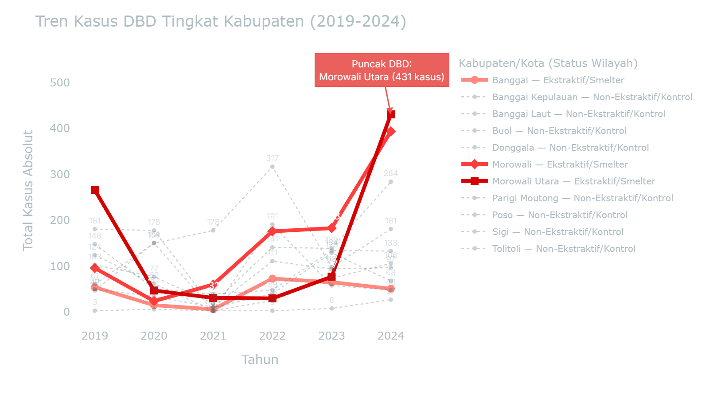

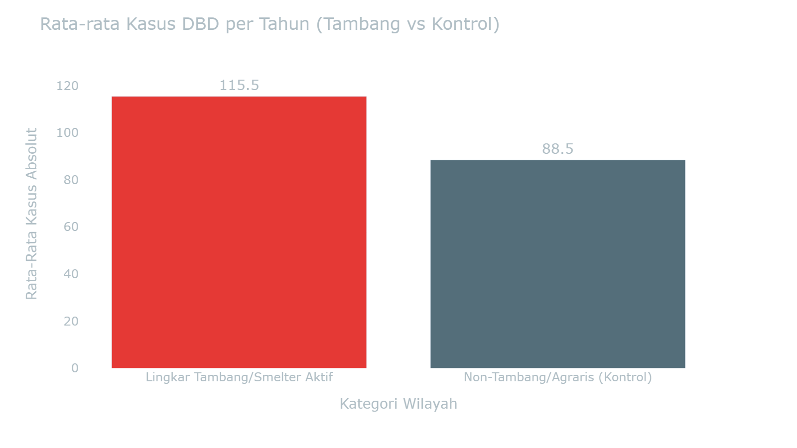

#### Interpretasi Spesifik: DBD

    Perbandingan grafik rata-rata di samping menunjukkan bahwa beban absolut kasus **DBD** di wilayah Lingkar Tambang/Smelter Aktif mencapai **115.5 kasus/tahun**.

    Meskipun populasi area tambang seringkali lebih terkonsentrasi, angka ini memberikan sinyal kuat bahwa degradasi lingkungan di sekitar smelter menciptakan ceruk ekologis baru (seperti genangan air galian) yang mempercepat siklus penularan DBD.

Lihat Data Mentah: Dataset Zoonosis Provinsi (2015-2024)

| provinsi   | kabupaten_kota    |   tahun | jenis_penyakit   |   total_kasus |   meninggal |   halaman_pdf | catatan_data                                                 |
|:-----------|:------------------|--------:|:-----------------|--------------:|------------:|--------------:|:-------------------------------------------------------------|
| Gorontalo  | Boalemo           |    2019 | DBD              |           176 |           0 |           183 | nan                                                          |
| Gorontalo  | Boalemo           |    2020 | DBD              |           163 |           0 |           163 | nan                                                          |
| Gorontalo  | Boalemo           |    2021 | DBD              |            41 |           0 |           160 | nan                                                          |
| Gorontalo  | Boalemo           |    2022 | DBD              |           120 |           2 |           160 | nan                                                          |
| Gorontalo  | Boalemo           |    2023 | DBD              |           152 |           0 |           158 | nan                                                          |
| Gorontalo  | Boalemo           |    2024 | DBD              |           435 |           0 |           162 | nan                                                          |
| Gorontalo  | Bone Bolango      |    2019 | DBD              |           225 |           3 |           183 | nan                                                          |
| Gorontalo  | Bone Bolango      |    2020 | DBD              |           180 |           0 |           163 | nan                                                          |
| Gorontalo  | Bone Bolango      |    2021 | DBD              |           144 |           4 |           160 | nan                                                          |
| Gorontalo  | Bone Bolango      |    2022 | DBD              |            89 |           2 |           160 | nan                                                          |
| Gorontalo  | Bone Bolango      |    2023 | DBD              |           142 |           0 |           158 | nan                                                          |
| Gorontalo  | Bone Bolango      |    2024 | DBD              |           664 |           8 |           162 | nan                                                          |
| Gorontalo  | Gorontalo         |    2019 | DBD              |           111 |           6 |           183 | nan                                                          |
| Gorontalo  | Gorontalo         |    2020 | DBD              |            81 |           3 |           163 | nan                                                          |
| Gorontalo  | Gorontalo         |    2021 | DBD              |           112 |           0 |           160 | nan                                                          |
| Gorontalo  | Gorontalo         |    2022 | DBD              |            98 |           3 |           160 | nan                                                          |
| Gorontalo  | Gorontalo         |    2023 | DBD              |            72 |           3 |           158 | nan                                                          |
| Gorontalo  | Gorontalo         |    2024 | DBD              |           270 |           3 |           162 | nan                                                          |
| Gorontalo  | Pohuwato          |    2019 | DBD              |           309 |           6 |           183 | nan                                                          |
| Gorontalo  | Pohuwato          |    2020 | DBD              |            87 |           0 |           163 | nan                                                          |
| Gorontalo  | Pohuwato          |    2021 | DBD              |           136 |           0 |           160 | nan                                                          |
| Gorontalo  | Pohuwato          |    2022 | DBD              |           169 |          15 |           160 | nan                                                          |
| Gorontalo  | Pohuwato          |    2023 | DBD              |           155 |           0 |           158 | nan                                                          |
| Gorontalo  | Pohuwato          |    2024 | DBD              |           391 |           0 |           162 | nan                                                          |
| Gorontalo  | Bone Bolango      |    2019 | FILARIASIS       |             3 |           0 |           185 | nan                                                          |
| Gorontalo  | Bone Bolango      |    2021 | FILARIASIS       |             3 |           0 |           162 | nan                                                          |
| Gorontalo  | Bone Bolango      |    2022 | FILARIASIS       |             3 |           0 |           162 | nan                                                          |
| Gorontalo  | Gorontalo         |    2019 | FILARIASIS       |             1 |           0 |           185 | nan                                                          |
| Gorontalo  | Gorontalo         |    2020 | FILARIASIS       |             1 |           0 |           165 | nan                                                          |
| Gorontalo  | Gorontalo         |    2023 | FILARIASIS       |             1 |           0 |           160 | nan                                                          |
| Gorontalo  | Gorontalo         |    2024 | FILARIASIS       |             5 |           0 |            81 | nan                                                          |
| Gorontalo  | Gorontalo         |    2019 | MALARIA          |             5 |           0 |           108 | nan                                                          |
| Gorontalo  | Gorontalo         |    2020 | MALARIA          |             5 |           0 |            92 | nan                                                          |
| Gorontalo  | Gorontalo         |    2021 | MALARIA          |             5 |           0 |            89 | nan                                                          |
| Gorontalo  | Gorontalo         |    2022 | MALARIA          |             5 |           0 |            82 | nan                                                          |
| Sulsel     | Bantaeng          |    2016 | DBD              |           787 |           0 |            34 | nan                                                          |
| Sulsel     | Bantaeng          |    2017 | DBD              |            61 |          64 |            35 | nan                                                          |
| Sulsel     | Bantaeng          |    2018 | DBD              |           197 |           0 |            27 | nan                                                          |
| Sulsel     | Barru             |    2016 | DBD              |            22 |           0 |            35 | nan                                                          |
| Sulsel     | Barru             |    2017 | DBD              |             3 |           0 |            26 | nan                                                          |
| Sulsel     | Barru             |    2018 | DBD              |            18 |           0 |            27 | nan                                                          |
| Sulsel     | Bone              |    2016 | DBD              |             3 |           0 |            30 | nan                                                          |
| Sulsel     | Bone              |    2017 | DBD              |             2 |           1 |            27 | nan                                                          |
| Sulsel     | Bone              |    2018 | DBD              |            64 |           2 |            27 | nan                                                          |
| Sulsel     | Bulukumba         |    2016 | DBD              |            20 |           0 |            29 | nan                                                          |
| Sulsel     | Bulukumba         |    2017 | DBD              |             4 |           0 |            26 | nan                                                          |
| Sulsel     | Bulukumba         |    2018 | DBD              |           110 |           0 |            27 | nan                                                          |
| Sulsel     | Enrekang          |    2016 | DBD              |            35 |           0 |            35 | nan                                                          |
| Sulsel     | Enrekang          |    2017 | DBD              |            32 |           0 |            32 | nan                                                          |
| Sulsel     | Enrekang          |    2018 | DBD              |            81 |           0 |            27 | nan                                                          |
| Sulsel     | Gowa              |    2016 | DBD              |           628 |           0 |            34 | nan                                                          |
| Sulsel     | Gowa              |    2017 | DBD              |             5 |           0 |            26 | nan                                                          |
| Sulsel     | Gowa              |    2018 | DBD              |           147 |           0 |            27 | nan                                                          |
| Sulsel     | Jeneponto         |    2016 | DBD              |             6 |           0 |            35 | nan                                                          |
| Sulsel     | Jeneponto         |    2017 | DBD              |             1 |           0 |            26 | nan                                                          |
| Sulsel     | Jeneponto         |    2018 | DBD              |            84 |           0 |            27 | nan                                                          |
| Sulsel     | Luwu              |    2016 | DBD              |             2 |           0 |            35 | nan                                                          |
| Sulsel     | Luwu              |    2017 | DBD              |             1 |           0 |            26 | nan                                                          |
| Sulsel     | Luwu              |    2018 | DBD              |             1 |           0 |            27 | nan                                                          |
| Sulsel     | Makassar          |    2016 | DBD              |           192 |           0 |            34 | nan                                                          |
| Sulsel     | Makassar          |    2017 | DBD              |             8 |           0 |            26 | nan                                                          |
| Sulsel     | Makassar          |    2018 | DBD              |           135 |           0 |            27 | nan                                                          |
| Sulsel     | Maros             |    2016 | DBD              |           301 |           0 |            34 | nan                                                          |
| Sulsel     | Maros             |    2017 | DBD              |            10 |           0 |            26 | nan                                                          |
| Sulsel     | Maros             |    2018 | DBD              |           253 |           2 |            27 | nan                                                          |
| Sulsel     | Palopo            |    2016 | DBD              |            86 |           0 |            29 | nan                                                          |
| Sulsel     | Palopo            |    2017 | DBD              |            19 |           0 |            26 | nan                                                          |
| Sulsel     | Palopo            |    2018 | DBD              |            74 |           0 |            27 | nan                                                          |
| Sulsel     | Pangkep           |    2016 | DBD              |           317 |           0 |            35 | nan                                                          |
| Sulsel     | Pangkep           |    2017 | DBD              |             4 |           0 |            26 | nan                                                          |
| Sulsel     | Pangkep           |    2018 | DBD              |           123 |           0 |            27 | nan                                                          |
| Sulsel     | Pinrang           |    2016 | DBD              |             1 |           0 |            35 | nan                                                          |
| Sulsel     | Pinrang           |    2017 | DBD              |             6 |           0 |            26 | nan                                                          |
| Sulsel     | Pinrang           |    2018 | DBD              |             1 |           0 |            27 | nan                                                          |
| Sulsel     | Selayar           |    2016 | DBD              |           940 |           0 |            34 | nan                                                          |
| Sulsel     | Selayar           |    2017 | DBD              |             5 |           8 |            26 | nan                                                          |
| Sulsel     | Selayar           |    2018 | DBD              |             5 |           8 |            27 | nan                                                          |
| Sulsel     | Sidrap            |    2016 | DBD              |           521 |           0 |            35 | nan                                                          |
| Sulsel     | Sidrap            |    2017 | DBD              |             8 |           0 |            26 | nan                                                          |
| Sulsel     | Sidrap            |    2018 | DBD              |            14 |           0 |            27 | nan                                                          |
| Sulsel     | Sinjai            |    2016 | DBD              |           286 |           0 |            34 | nan                                                          |
| Sulsel     | Sinjai            |    2017 | DBD              |             3 |           0 |            34 | nan                                                          |
| Sulsel     | Sinjai            |    2018 | DBD              |            41 |           0 |            27 | nan                                                          |
| Sulsel     | Soppeng           |    2016 | DBD              |            38 |           0 |            35 | nan                                                          |
| Sulsel     | Soppeng           |    2017 | DBD              |             1 |           0 |            26 | nan                                                          |
| Sulsel     | Soppeng           |    2018 | DBD              |            35 |           0 |            27 | nan                                                          |
| Sulsel     | Takalar           |    2016 | DBD              |             6 |           0 |            35 | nan                                                          |
| Sulsel     | Takalar           |    2017 | DBD              |           121 |           0 |            26 | nan                                                          |
| Sulsel     | Takalar           |    2018 | DBD              |           117 |           0 |            27 | nan                                                          |
| Sulsel     | Tana Toraja       |    2016 | DBD              |            28 |           0 |            29 | nan                                                          |
| Sulsel     | Tana Toraja       |    2017 | DBD              |             2 |           0 |            26 | nan                                                          |
| Sulsel     | Tana Toraja       |    2018 | DBD              |            17 |           0 |            27 | nan                                                          |
| Sulsel     | Toraja Utara      |    2016 | DBD              |           319 |           0 |            35 | nan                                                          |
| Sulsel     | Toraja Utara      |    2017 | DBD              |           111 |           0 |            26 | nan                                                          |
| Sulsel     | Toraja Utara      |    2018 | DBD              |            29 |           0 |            27 | nan                                                          |
| Sulsel     | Wajo              |    2016 | DBD              |            33 |           0 |            35 | nan                                                          |
| Sulsel     | Wajo              |    2017 | DBD              |            22 |           0 |            26 | nan                                                          |
| Sulsel     | Wajo              |    2018 | DBD              |            29 |           0 |            27 | nan                                                          |
| Sulsel     | Bone              |    2015 | FILARIASIS       |             3 |           0 |            52 | nan                                                          |
| Sulsel     | Enrekang          |    2015 | FILARIASIS       |             4 |           0 |            52 | nan                                                          |
| Sulsel     | Makassar          |    2015 | FILARIASIS       |             1 |           0 |            52 | nan                                                          |
| Sulsel     | Pangkep           |    2015 | FILARIASIS       |            72 |           0 |            52 | nan                                                          |
| Sulsel     | Bantaeng          |    2017 | RABIES           |           760 |           0 |            78 | nan                                                          |
| Sulsel     | Barru             |    2017 | RABIES           |           199 |           0 |            76 | nan                                                          |
| Sulsel     | Barru             |    2018 | RABIES           |             1 |           0 |            39 | PERLU_VALIDASI_MANUAL                                        |
| Sulsel     | Bone              |    2017 | RABIES           |            17 |           0 |            77 | nan                                                          |
| Sulsel     | Bone              |    2018 | RABIES           |             1 |           0 |            42 | PERLU_VALIDASI_MANUAL                                        |
| Sulsel     | Bulukumba         |    2017 | RABIES           |           600 |           0 |            77 | nan                                                          |
| Sulsel     | Bulukumba         |    2018 | RABIES           |             2 |           0 |            43 | PERLU_VALIDASI_MANUAL                                        |
| Sulsel     | Enrekang          |    2017 | RABIES           |           463 |           0 |            77 | nan                                                          |
| Sulsel     | Enrekang          |    2018 | RABIES           |             2 |           0 |            43 | PERLU_VALIDASI_MANUAL                                        |
| Sulsel     | Gowa              |    2017 | RABIES           |           466 |           0 |            76 | nan                                                          |
| Sulsel     | Gowa              |    2018 | RABIES           |             1 |           0 |            43 | PERLU_VALIDASI_MANUAL                                        |
| Sulsel     | Jeneponto         |    2017 | RABIES           |            25 |           0 |            77 | nan                                                          |
| Sulsel     | Jeneponto         |    2018 | RABIES           |             1 |           0 |            39 | PERLU_VALIDASI_MANUAL                                        |
| Sulsel     | Luwu              |    2017 | RABIES           |           832 |           0 |            78 | nan                                                          |
| Sulsel     | Luwu              |    2018 | RABIES           |             1 |           0 |            43 | PERLU_VALIDASI_MANUAL                                        |
| Sulsel     | Makassar          |    2017 | RABIES           |            43 |           0 |            77 | nan                                                          |
| Sulsel     | Makassar          |    2018 | RABIES           |             2 |           0 |            43 | PERLU_VALIDASI_MANUAL                                        |
| Sulsel     | Maros             |    2017 | RABIES           |           694 |           0 |            77 | nan                                                          |
| Sulsel     | Palopo            |    2017 | RABIES           |           448 |           0 |            77 | nan                                                          |
| Sulsel     | Pangkep           |    2017 | RABIES           |             1 |           0 |            36 | PERLU_VALIDASI_MANUAL                                        |
| Sulsel     | Pangkep           |    2017 | RABIES           |           217 |           0 |            76 | nan                                                          |
| Sulsel     | Pinrang           |    2017 | RABIES           |           146 |           0 |            76 | nan                                                          |
| Sulsel     | Selayar           |    2017 | RABIES           |            14 |           0 |            78 | nan                                                          |
| Sulsel     | Selayar           |    2018 | RABIES           |             1 |           0 |            39 | PERLU_VALIDASI_MANUAL                                        |
| Sulsel     | Sidrap            |    2017 | RABIES           |             1 |           0 |            40 | PERLU_VALIDASI_MANUAL                                        |
| Sulsel     | Sidrap            |    2017 | RABIES           |           814 |           0 |            78 | nan                                                          |
| Sulsel     | Sinjai            |    2017 | RABIES           |           751 |           0 |            77 | nan                                                          |
| Sulsel     | Sinjai            |    2018 | RABIES           |             1 |           0 |            39 | PERLU_VALIDASI_MANUAL                                        |
| Sulsel     | Soppeng           |    2017 | RABIES           |           152 |           0 |            76 | nan                                                          |
| Sulsel     | Soppeng           |    2018 | RABIES           |             1 |           0 |            43 | PERLU_VALIDASI_MANUAL                                        |
| Sulsel     | Takalar           |    2017 | RABIES           |           258 |           0 |            76 | nan                                                          |
| Sulsel     | Tana Toraja       |    2017 | RABIES           |           264 |           0 |            76 | nan                                                          |
| Sulsel     | Tana Toraja       |    2018 | RABIES           |             1 |           0 |            42 | PERLU_VALIDASI_MANUAL                                        |
| Sulsel     | Toraja Utara      |    2017 | RABIES           |           136 |           0 |            76 | nan                                                          |
| Sulsel     | Wajo              |    2017 | RABIES           |           361 |           0 |            76 | nan                                                          |
| Sulteng    | Banggai           |    2019 | DBD              |            54 |           0 |           351 | nan                                                          |
| Sulteng    | Banggai           |    2020 | DBD              |            15 |           0 |           312 | nan                                                          |
| Sulteng    | Banggai           |    2021 | DBD              |             6 |           0 |           366 | nan                                                          |
| Sulteng    | Banggai           |    2022 | DBD              |            73 |           0 |           352 | nan                                                          |
| Sulteng    | Banggai           |    2023 | DBD              |            65 |           0 |           337 | nan                                                          |
| Sulteng    | Banggai           |    2024 | DBD              |            51 |           0 |           331 | nan                                                          |
| Sulteng    | Banggai Kepulauan |    2019 | DBD              |             3 |           0 |           351 | nan                                                          |
| Sulteng    | Banggai Kepulauan |    2020 | DBD              |             6 |           0 |           312 | nan                                                          |
| Sulteng    | Banggai Kepulauan |    2021 | DBD              |             3 |           0 |           366 | nan                                                          |
| Sulteng    | Banggai Kepulauan |    2022 | DBD              |           191 |           4 |           352 | nan                                                          |
| Sulteng    | Banggai Kepulauan |    2023 | DBD              |            58 |           0 |           337 | nan                                                          |
| Sulteng    | Banggai Kepulauan |    2024 | DBD              |            48 |           0 |           331 | nan                                                          |
| Sulteng    | Banggai Laut      |    2019 | DBD              |            47 |           0 |           351 | nan                                                          |
| Sulteng    | Banggai Laut      |    2020 | DBD              |           151 |           0 |           312 | nan                                                          |
| Sulteng    | Banggai Laut      |    2021 | DBD              |             3 |           0 |           366 | nan                                                          |
| Sulteng    | Banggai Laut      |    2022 | DBD              |             3 |           0 |           352 | nan                                                          |
| Sulteng    | Banggai Laut      |    2023 | DBD              |             8 |           0 |           337 | nan                                                          |
| Sulteng    | Banggai Laut      |    2024 | DBD              |            27 |           0 |           331 | nan                                                          |
| Sulteng    | Buol              |    2019 | DBD              |            50 |           0 |           351 | nan                                                          |
| Sulteng    | Buol              |    2020 | DBD              |            34 |           0 |           312 | nan                                                          |
| Sulteng    | Buol              |    2021 | DBD              |            11 |           0 |           366 | nan                                                          |
| Sulteng    | Buol              |    2022 | DBD              |           111 |           0 |           352 | nan                                                          |
| Sulteng    | Buol              |    2023 | DBD              |            94 |           0 |           337 | nan                                                          |
| Sulteng    | Buol              |    2024 | DBD              |            97 |           0 |           331 | nan                                                          |
| Sulteng    | Donggala          |    2019 | DBD              |           181 |           0 |           351 | nan                                                          |
| Sulteng    | Donggala          |    2020 | DBD              |           178 |           0 |           312 | nan                                                          |
| Sulteng    | Donggala          |    2021 | DBD              |            10 |           0 |           366 | nan                                                          |
| Sulteng    | Donggala          |    2022 | DBD              |            40 |           0 |           352 | nan                                                          |
| Sulteng    | Donggala          |    2023 | DBD              |           129 |           0 |           337 | nan                                                          |
| Sulteng    | Donggala          |    2024 | DBD              |            68 |           0 |           331 | nan                                                          |
| Sulteng    | Morowali          |    2019 | DBD              |            96 |           0 |           351 | nan                                                          |
| Sulteng    | Morowali          |    2020 | DBD              |            24 |           0 |           312 | nan                                                          |
| Sulteng    | Morowali          |    2021 | DBD              |            60 |           0 |           366 | nan                                                          |
| Sulteng    | Morowali          |    2022 | DBD              |           176 |           0 |           352 | nan                                                          |
| Sulteng    | Morowali          |    2023 | DBD              |           183 |           0 |           337 | nan                                                          |
| Sulteng    | Morowali          |    2024 | DBD              |           394 |           0 |           331 | nan                                                          |
| Sulteng    | Morowali Utara    |    2019 | DBD              |           266 |           0 |           351 | nan                                                          |
| Sulteng    | Morowali Utara    |    2020 | DBD              |            47 |           0 |           312 | nan                                                          |
| Sulteng    | Morowali Utara    |    2021 | DBD              |            31 |           0 |           366 | nan                                                          |
| Sulteng    | Morowali Utara    |    2022 | DBD              |            30 |           0 |           352 | nan                                                          |
| Sulteng    | Morowali Utara    |    2023 | DBD              |            77 |           0 |           337 | nan                                                          |
| Sulteng    | Morowali Utara    |    2024 | DBD              |           431 |           4 |           331 | nan                                                          |
| Sulteng    | Palu              |    2019 | DBD              |           591 |           9 |           351 | nan                                                          |
| Sulteng    | Palu              |    2020 | DBD              |           301 |           5 |           312 | nan                                                          |
| Sulteng    | Palu              |    2021 | DBD              |           302 |           4 |           366 | nan                                                          |
| Sulteng    | Palu              |    2022 | DBD              |           640 |           7 |           352 | nan                                                          |
| Sulteng    | Palu              |    2023 | DBD              |           541 |           3 |           337 | nan                                                          |
| Sulteng    | Palu              |    2024 | DBD              |           441 |           3 |           331 | nan                                                          |
| Sulteng    | Parigi Moutong    |    2019 | DBD              |           124 |           0 |           351 | nan                                                          |
| Sulteng    | Parigi Moutong    |    2020 | DBD              |            62 |           0 |           312 | nan                                                          |
| Sulteng    | Parigi Moutong    |    2021 | DBD              |             3 |           0 |           366 | nan                                                          |
| Sulteng    | Parigi Moutong    |    2022 | DBD              |            25 |           0 |           352 | nan                                                          |
| Sulteng    | Parigi Moutong    |    2023 | DBD              |            74 |           0 |           337 | nan                                                          |
| Sulteng    | Parigi Moutong    |    2024 | DBD              |           106 |           0 |           331 | nan                                                          |
| Sulteng    | Poso              |    2019 | DBD              |           103 |           0 |           351 | nan                                                          |
| Sulteng    | Poso              |    2020 | DBD              |            77 |           0 |           312 | nan                                                          |
| Sulteng    | Poso              |    2021 | DBD              |            19 |           0 |           366 | nan                                                          |
| Sulteng    | Poso              |    2022 | DBD              |           141 |           0 |           352 | nan                                                          |
| Sulteng    | Poso              |    2023 | DBD              |           139 |           0 |           337 | nan                                                          |
| Sulteng    | Poso              |    2024 | DBD              |           284 |           0 |           331 | nan                                                          |
| Sulteng    | Sigi              |    2019 | DBD              |           148 |           0 |           351 | nan                                                          |
| Sulteng    | Sigi              |    2020 | DBD              |            51 |           0 |           312 | nan                                                          |
| Sulteng    | Sigi              |    2021 | DBD              |            39 |           0 |           366 | nan                                                          |
| Sulteng    | Sigi              |    2022 | DBD              |            48 |           0 |           352 | nan                                                          |
| Sulteng    | Sigi              |    2023 | DBD              |           134 |           0 |           337 | nan                                                          |
| Sulteng    | Sigi              |    2024 | DBD              |           133 |           0 |           331 | nan                                                          |
| Sulteng    | Tolitoli          |    2019 | DBD              |            61 |           0 |           351 | nan                                                          |
| Sulteng    | Tolitoli          |    2020 | DBD              |           150 |           0 |           312 | nan                                                          |
| Sulteng    | Tolitoli          |    2021 | DBD              |           178 |           0 |           366 | nan                                                          |
| Sulteng    | Tolitoli          |    2022 | DBD              |           317 |           0 |           352 | nan                                                          |
| Sulteng    | Tolitoli          |    2023 | DBD              |            98 |           0 |           337 | nan                                                          |
| Sulteng    | Tolitoli          |    2024 | DBD              |           181 |           0 |           331 | nan                                                          |
| Sulteng    | Banggai           |    2019 | FILARIASIS       |            16 |           0 |           353 | nan                                                          |
| Sulteng    | Banggai           |    2020 | FILARIASIS       |            11 |           0 |           314 | nan                                                          |
| Sulteng    | Banggai           |    2021 | FILARIASIS       |            10 |           0 |           368 | nan                                                          |
| Sulteng    | Banggai           |    2022 | FILARIASIS       |             9 |           0 |           354 | nan                                                          |
| Sulteng    | Banggai           |    2023 | FILARIASIS       |             7 |           0 |           339 | nan                                                          |
| Sulteng    | Banggai           |    2024 | FILARIASIS       |             7 |           0 |           333 | nan                                                          |
| Sulteng    | Banggai Kepulauan |    2019 | FILARIASIS       |             1 |           0 |           353 | nan                                                          |
| Sulteng    | Banggai Kepulauan |    2020 | FILARIASIS       |             1 |           0 |           314 | nan                                                          |
| Sulteng    | Banggai Kepulauan |    2021 | FILARIASIS       |             1 |           0 |           368 | nan                                                          |
| Sulteng    | Banggai Kepulauan |    2022 | FILARIASIS       |             1 |           0 |           354 | nan                                                          |
| Sulteng    | Banggai Kepulauan |    2023 | FILARIASIS       |             1 |           0 |           339 | nan                                                          |
| Sulteng    | Banggai Kepulauan |    2024 | FILARIASIS       |             1 |           0 |           333 | nan                                                          |
| Sulteng    | Buol              |    2019 | FILARIASIS       |             3 |           0 |           353 | nan                                                          |
| Sulteng    | Buol              |    2020 | FILARIASIS       |             3 |           0 |           314 | nan                                                          |
| Sulteng    | Buol              |    2021 | FILARIASIS       |             3 |           0 |           368 | nan                                                          |
| Sulteng    | Buol              |    2022 | FILARIASIS       |             3 |           0 |           354 | nan                                                          |
| Sulteng    | Buol              |    2023 | FILARIASIS       |             3 |           0 |           339 | nan                                                          |
| Sulteng    | Buol              |    2024 | FILARIASIS       |             3 |           0 |           333 | nan                                                          |
| Sulteng    | Donggala          |    2019 | FILARIASIS       |            11 |           0 |           353 | nan                                                          |
| Sulteng    | Donggala          |    2020 | FILARIASIS       |            11 |           0 |           314 | nan                                                          |
| Sulteng    | Donggala          |    2021 | FILARIASIS       |            11 |           0 |           368 | nan                                                          |
| Sulteng    | Donggala          |    2022 | FILARIASIS       |            11 |           0 |           354 | nan                                                          |
| Sulteng    | Donggala          |    2023 | FILARIASIS       |             7 |           0 |           339 | nan                                                          |
| Sulteng    | Donggala          |    2024 | FILARIASIS       |             5 |           0 |           333 | nan                                                          |
| Sulteng    | Morowali          |    2019 | FILARIASIS       |             6 |           0 |           353 | nan                                                          |
| Sulteng    | Morowali          |    2020 | FILARIASIS       |             6 |           0 |           314 | nan                                                          |
| Sulteng    | Morowali          |    2021 | FILARIASIS       |             4 |           0 |           368 | nan                                                          |
| Sulteng    | Morowali          |    2022 | FILARIASIS       |             4 |           0 |           354 | nan                                                          |
| Sulteng    | Morowali          |    2023 | FILARIASIS       |             4 |           0 |           339 | nan                                                          |
| Sulteng    | Morowali          |    2024 | FILARIASIS       |             4 |           0 |           333 | nan                                                          |
| Sulteng    | Parigi Moutong    |    2019 | FILARIASIS       |            24 |           0 |           353 | nan                                                          |
| Sulteng    | Parigi Moutong    |    2020 | FILARIASIS       |            17 |           0 |           314 | nan                                                          |
| Sulteng    | Parigi Moutong    |    2021 | FILARIASIS       |             8 |           0 |           368 | nan                                                          |
| Sulteng    | Parigi Moutong    |    2022 | FILARIASIS       |            15 |           0 |           354 | nan                                                          |
| Sulteng    | Parigi Moutong    |    2023 | FILARIASIS       |            11 |           0 |           339 | nan                                                          |
| Sulteng    | Parigi Moutong    |    2024 | FILARIASIS       |            11 |           0 |           333 | nan                                                          |
| Sulteng    | Poso              |    2019 | FILARIASIS       |            31 |           0 |           353 | nan                                                          |
| Sulteng    | Poso              |    2020 | FILARIASIS       |            31 |           0 |           314 | nan                                                          |
| Sulteng    | Poso              |    2021 | FILARIASIS       |            31 |           0 |           368 | nan                                                          |
| Sulteng    | Poso              |    2022 | FILARIASIS       |            13 |           0 |           354 | nan                                                          |
| Sulteng    | Poso              |    2023 | FILARIASIS       |            13 |           0 |           339 | nan                                                          |
| Sulteng    | Poso              |    2024 | FILARIASIS       |             9 |           0 |           333 | nan                                                          |
| Sulteng    | Sigi              |    2019 | FILARIASIS       |            73 |           0 |           353 | nan                                                          |
| Sulteng    | Sigi              |    2020 | FILARIASIS       |            72 |           0 |           314 | nan                                                          |
| Sulteng    | Sigi              |    2021 | FILARIASIS       |            46 |           0 |           368 | nan                                                          |
| Sulteng    | Sigi              |    2022 | FILARIASIS       |            72 |           0 |           354 | nan                                                          |
| Sulteng    | Sigi              |    2023 | FILARIASIS       |            46 |           0 |           339 | nan                                                          |
| Sulteng    | Sigi              |    2024 | FILARIASIS       |            42 |           0 |           333 | nan                                                          |
| Sulteng    | Tojo Una-Una      |    2024 | FILARIASIS       |            18 |           0 |           179 | nan                                                          |
| Sulteng    | Banggai           |    2019 | RABIES           |             2 |           0 |           203 | nan                                                          |
| Sulteng    | Banggai           |    2023 | RABIES           |             1 |           0 |           207 | nan                                                          |
| Sulteng    | Banggai           |    2024 | RABIES           |             1 |           0 |           176 | nan                                                          |
| Sulteng    | Morowali          |    2019 | RABIES           |             1 |           0 |           350 | nan                                                          |
| Sulteng    | Poso              |    2020 | RABIES           |           341 |           0 |           164 | nan                                                          |
| Sulteng    | Poso              |    2022 | RABIES           |           262 |           0 |           170 | nan                                                          |
| Sulteng    | Touna             |    2019 | RABIES           |             1 |           0 |           245 | nan                                                          |
| Sulteng    | Banggai Kepulauan |    2019 | MALARIA          |             0 |           0 |            -1 | Extracted via opendataloader_pdf (Profil Kesehatan Kemenkes) |
| Sulteng    | Banggai           |    2019 | MALARIA          |            19 |           0 |            -1 | Extracted via opendataloader_pdf (Profil Kesehatan Kemenkes) |
| Sulteng    | Morowali          |    2019 | MALARIA          |            28 |           0 |            -1 | Extracted via opendataloader_pdf (Profil Kesehatan Kemenkes) |
| Sulteng    | Poso              |    2019 | MALARIA          |             7 |           0 |            -1 | Extracted via opendataloader_pdf (Profil Kesehatan Kemenkes) |
| Sulteng    | Donggala          |    2019 | MALARIA          |            30 |           0 |            -1 | Extracted via opendataloader_pdf (Profil Kesehatan Kemenkes) |
| Sulteng    | Toli-Toli         |    2019 | MALARIA          |             0 |           0 |            -1 | Extracted via opendataloader_pdf (Profil Kesehatan Kemenkes) |
| Sulteng    | Buol              |    2019 | MALARIA          |             1 |           0 |            -1 | Extracted via opendataloader_pdf (Profil Kesehatan Kemenkes) |
| Sulteng    | Parigi Moutong    |    2019 | MALARIA          |            21 |           0 |            -1 | Extracted via opendataloader_pdf (Profil Kesehatan Kemenkes) |
| Sulteng    | Tojo Una-Una      |    2019 | MALARIA          |             2 |           0 |            -1 | Extracted via opendataloader_pdf (Profil Kesehatan Kemenkes) |
| Sulteng    | Sigi              |    2019 | MALARIA          |             7 |           0 |            -1 | Extracted via opendataloader_pdf (Profil Kesehatan Kemenkes) |
| Sulteng    | Banggai Laut      |    2019 | MALARIA          |             1 |           0 |            -1 | Extracted via opendataloader_pdf (Profil Kesehatan Kemenkes) |
| Sulteng    | Morowali Utara    |    2019 | MALARIA          |             6 |           0 |            -1 | Extracted via opendataloader_pdf (Profil Kesehatan Kemenkes) |
| Sulteng    | Kota Palu         |    2019 | MALARIA          |             3 |           0 |            -1 | Extracted via opendataloader_pdf (Profil Kesehatan Kemenkes) |
| Sulteng    | Banggai Kepulauan |    2020 | MALARIA          |            18 |           0 |            -1 | Extracted via opendataloader_pdf (Profil Kesehatan Kemenkes) |
| Sulteng    | Banggai           |    2020 | MALARIA          |            12 |           0 |            -1 | Extracted via opendataloader_pdf (Profil Kesehatan Kemenkes) |
| Sulteng    | Morowali          |    2020 | MALARIA          |            17 |           0 |            -1 | Extracted via opendataloader_pdf (Profil Kesehatan Kemenkes) |
| Sulteng    | Poso              |    2020 | MALARIA          |             3 |           0 |            -1 | Extracted via opendataloader_pdf (Profil Kesehatan Kemenkes) |
| Sulteng    | Donggala          |    2020 | MALARIA          |             6 |           0 |            -1 | Extracted via opendataloader_pdf (Profil Kesehatan Kemenkes) |
| Sulteng    | Toli-Toli         |    2020 | MALARIA          |             0 |           0 |            -1 | Extracted via opendataloader_pdf (Profil Kesehatan Kemenkes) |
| Sulteng    | Buol              |    2020 | MALARIA          |             0 |           0 |            -1 | Extracted via opendataloader_pdf (Profil Kesehatan Kemenkes) |
| Sulteng    | Parigi Moutong    |    2020 | MALARIA          |            12 |           0 |            -1 | Extracted via opendataloader_pdf (Profil Kesehatan Kemenkes) |
| Sulteng    | Tojo Una-Una      |    2020 | MALARIA          |            84 |           0 |            -1 | Extracted via opendataloader_pdf (Profil Kesehatan Kemenkes) |
| Sulteng    | Sigi              |    2020 | MALARIA          |             4 |           0 |            -1 | Extracted via opendataloader_pdf (Profil Kesehatan Kemenkes) |
| Sulteng    | Banggai Laut      |    2020 | MALARIA          |             2 |           0 |            -1 | Extracted via opendataloader_pdf (Profil Kesehatan Kemenkes) |
| Sulteng    | Morowali Utara    |    2020 | MALARIA          |            70 |           0 |            -1 | Extracted via opendataloader_pdf (Profil Kesehatan Kemenkes) |
| Sulteng    | Kota Palu         |    2020 | MALARIA          |            10 |           0 |            -1 | Extracted via opendataloader_pdf (Profil Kesehatan Kemenkes) |
| Sulteng    | Banggai Kepulauan |    2022 | MALARIA          |             0 |           0 |            -1 | Extracted via opendataloader_pdf (Profil Kesehatan Kemenkes) |
| Sulteng    | Banggai           |    2022 | MALARIA          |            24 |           0 |            -1 | Extracted via opendataloader_pdf (Profil Kesehatan Kemenkes) |
| Sulteng    | Morowali          |    2022 | MALARIA          |             4 |           0 |            -1 | Extracted via opendataloader_pdf (Profil Kesehatan Kemenkes) |
| Sulteng    | Poso              |    2022 | MALARIA          |            10 |           0 |            -1 | Extracted via opendataloader_pdf (Profil Kesehatan Kemenkes) |
| Sulteng    | Donggala          |    2022 | MALARIA          |             7 |           0 |            -1 | Extracted via opendataloader_pdf (Profil Kesehatan Kemenkes) |
| Sulteng    | Toli-Toli         |    2022 | MALARIA          |             4 |           0 |            -1 | Extracted via opendataloader_pdf (Profil Kesehatan Kemenkes) |
| Sulteng    | Buol              |    2022 | MALARIA          |            21 |           0 |            -1 | Extracted via opendataloader_pdf (Profil Kesehatan Kemenkes) |
| Sulteng    | Parigi Moutong    |    2022 | MALARIA          |             0 |           0 |            -1 | Extracted via opendataloader_pdf (Profil Kesehatan Kemenkes) |
| Sulteng    | Tojo Una-Una      |    2022 | MALARIA          |            99 |           0 |            -1 | Extracted via opendataloader_pdf (Profil Kesehatan Kemenkes) |
| Sulteng    | Sigi              |    2022 | MALARIA          |             0 |           0 |            -1 | Extracted via opendataloader_pdf (Profil Kesehatan Kemenkes) |
| Sulteng    | Banggai Laut      |    2022 | MALARIA          |             2 |           0 |            -1 | Extracted via opendataloader_pdf (Profil Kesehatan Kemenkes) |
| Sulteng    | Morowali Utara    |    2022 | MALARIA          |            33 |           0 |            -1 | Extracted via opendataloader_pdf (Profil Kesehatan Kemenkes) |
| Sulteng    | Kota Palu         |    2022 | MALARIA          |            14 |           0 |            -1 | Extracted via opendataloader_pdf (Profil Kesehatan Kemenkes) |
| Sulteng    | Banggai Kepulauan |    2023 | MALARIA          |             1 |           0 |            -1 | Extracted via opendataloader_pdf (Profil Kesehatan Kemenkes) |
| Sulteng    | Banggai           |    2023 | MALARIA          |             5 |           0 |            -1 | Extracted via opendataloader_pdf (Profil Kesehatan Kemenkes) |
| Sulteng    | Morowali          |    2023 | MALARIA          |             7 |           0 |            -1 | Extracted via opendataloader_pdf (Profil Kesehatan Kemenkes) |
| Sulteng    | Poso              |    2023 | MALARIA          |             1 |           0 |            -1 | Extracted via opendataloader_pdf (Profil Kesehatan Kemenkes) |
| Sulteng    | Donggala          |    2023 | MALARIA          |             4 |           0 |            -1 | Extracted via opendataloader_pdf (Profil Kesehatan Kemenkes) |
| Sulteng    | Toli-Toli         |    2023 | MALARIA          |             4 |           0 |            -1 | Extracted via opendataloader_pdf (Profil Kesehatan Kemenkes) |
| Sulteng    | Buol              |    2023 | MALARIA          |             7 |           0 |            -1 | Extracted via opendataloader_pdf (Profil Kesehatan Kemenkes) |
| Sulteng    | Parigi Moutong    |    2023 | MALARIA          |             2 |           0 |            -1 | Extracted via opendataloader_pdf (Profil Kesehatan Kemenkes) |
| Sulteng    | Tojo Una-Una      |    2023 | MALARIA          |           442 |           5 |            -1 | Extracted via opendataloader_pdf (Profil Kesehatan Kemenkes) |
| Sulteng    | Sigi              |    2023 | MALARIA          |             1 |           0 |            -1 | Extracted via opendataloader_pdf (Profil Kesehatan Kemenkes) |
| Sulteng    | Banggai Laut      |    2023 | MALARIA          |             0 |           0 |            -1 | Extracted via opendataloader_pdf (Profil Kesehatan Kemenkes) |
| Sulteng    | Morowali Utara    |    2023 | MALARIA          |           131 |           1 |            -1 | Extracted via opendataloader_pdf (Profil Kesehatan Kemenkes) |
| Sulteng    | Kota Palu         |    2023 | MALARIA          |            19 |           0 |            -1 | Extracted via opendataloader_pdf (Profil Kesehatan Kemenkes) |
| Sulteng    | Banggai Kepulauan |    2024 | MALARIA          |            20 |           1 |            -1 | Extracted via opendataloader_pdf (Profil Kesehatan Kemenkes) |
| Sulteng    | Banggai           |    2024 | MALARIA          |            94 |           0 |            -1 | Extracted via opendataloader_pdf (Profil Kesehatan Kemenkes) |
| Sulteng    | Morowali          |    2024 | MALARIA          |           134 |           0 |            -1 | Extracted via opendataloader_pdf (Profil Kesehatan Kemenkes) |
| Sulteng    | Poso              |    2024 | MALARIA          |            55 |           0 |            -1 | Extracted via opendataloader_pdf (Profil Kesehatan Kemenkes) |
| Sulteng    | Donggala          |    2024 | MALARIA          |             5 |           0 |            -1 | Extracted via opendataloader_pdf (Profil Kesehatan Kemenkes) |
| Sulteng    | Toli-Toli         |    2024 | MALARIA          |             1 |           0 |            -1 | Extracted via opendataloader_pdf (Profil Kesehatan Kemenkes) |
| Sulteng    | Buol              |    2024 | MALARIA          |             7 |           0 |            -1 | Extracted via opendataloader_pdf (Profil Kesehatan Kemenkes) |
| Sulteng    | Parigi Moutong    |    2024 | MALARIA          |            26 |           0 |            -1 | Extracted via opendataloader_pdf (Profil Kesehatan Kemenkes) |
| Sulteng    | Tojo Una-Una      |    2024 | MALARIA          |           400 |           0 |            -1 | Extracted via opendataloader_pdf (Profil Kesehatan Kemenkes) |
| Sulteng    | Sigi              |    2024 | MALARIA          |            22 |           1 |            -1 | Extracted via opendataloader_pdf (Profil Kesehatan Kemenkes) |
| Sulteng    | Banggai Laut      |    2024 | MALARIA          |             2 |           0 |            -1 | Extracted via opendataloader_pdf (Profil Kesehatan Kemenkes) |
| Sulteng    | Morowali Utara    |    2024 | MALARIA          |           355 |           4 |            -1 | Extracted via opendataloader_pdf (Profil Kesehatan Kemenkes) |
| Sulteng    | Kota Palu         |    2024 | MALARIA          |            20 |           0 |            -1 | Extracted via opendataloader_pdf (Profil Kesehatan Kemenkes) |

> 📁 **Sumber File:** `data/processed/zoonosis_kab_kota_2015_2024.csv` - Hasil Ekstraksi Otomatis PDF Profil Kesehatan Provinsi Kemenkes

---

### Analisis Tambahan: Proxy Zoonosis (DBD) dan Tekanan Populasi: Tekanan Populasi dan Beban Kesehatan

Metode: Crosstab DBD × Kategori Industri Ekstraktif

DBD dipakai sebagai indikator proxy karena penyakit ini sensitif terhadap perubahan lingkungan permukiman, kepadatan, drainase, sanitasi, dan mobilitas penduduk. Analisis ini tidak menyatakan bahwa smelter secara tunggal menyebabkan DBD; yang diuji adalah apakah kabupaten smelter menunjukkan beban kesehatan yang perlu dibaca bersama tekanan demografi dan perubahan ruang. Sejak 2019, total kasus DBD yang tercatat di kabupaten smelter mencapai **1,378** kasus, sedangkan kabupaten non-smelter mencapai **5,756** kasus. Karena jumlah kabupaten dalam dua kelompok tidak sama, grafik memakai rata-rata kasus per kabupaten-tahun. Rata-rata kabupaten smelter tercatat sekitar **47.5** kasus per observasi, sementara non-smelter sekitar **15.5**. Rasio **3.06 kali** ini harus dibaca hati-hati sebagai sinyal komparatif, bukan bukti kausal final, tetapi tetap penting untuk menilai beban sosial dari industrialisasi.

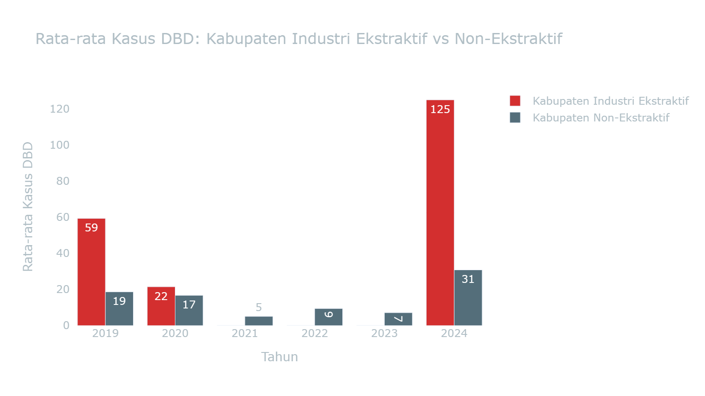

Lihat Data Mentah: DBD dan Kategori Industri Ekstraktif

| provinsi          | kabupaten                 |   tahun | is_smelter   |   dbd_kasus |   jumlah_penduduk_rb |
|:------------------|:--------------------------|--------:|:-------------|------------:|---------------------:|
| Gorontalo         | Boalemo                   |    2019 | False        |         176 |              167.024 |
| Gorontalo         | Boalemo                   |    2020 | False        |         163 |              145.9   |
| Gorontalo         | Boalemo                   |    2021 | False        |          41 |              147     |
| Gorontalo         | Boalemo                   |    2022 | False        |         120 |              148.5   |
| Gorontalo         | Boalemo                   |    2023 | False        |         152 |              151.3   |
| Gorontalo         | Boalemo                   |    2024 | False        |         435 |              153.3   |
| Gorontalo         | Bone Bolango              |    2019 | False        |         225 |              161.236 |
| Gorontalo         | Bone Bolango              |    2020 | False        |         180 |              162.8   |
| Gorontalo         | Bone Bolango              |    2021 | False        |         144 |              164.3   |
| Gorontalo         | Bone Bolango              |    2022 | False        |          89 |              166.2   |
| Gorontalo         | Bone Bolango              |    2023 | False        |         142 |              168.6   |
| Gorontalo         | Bone Bolango              |    2024 | False        |         664 |              170.7   |
| Gorontalo         | Gorontalo Utara           |    2019 | False        |           0 |              115.072 |
| Gorontalo         | Gorontalo Utara           |    2020 | False        |           0 |              125     |
| Gorontalo         | Gorontalo Utara           |    2021 | False        |           0 |              126.5   |
| Gorontalo         | Gorontalo Utara           |    2022 | False        |           0 |              128.6   |
| Gorontalo         | Gorontalo Utara           |    2023 | False        |           0 |              130.7   |
| Gorontalo         | Gorontalo Utara           |    2024 | False        |           0 |              132.8   |
| Gorontalo         | Kota Gorontalo            |    2019 | False        |           0 |              219.399 |
| Gorontalo         | Kota Gorontalo            |    2020 | False        |           0 |              198.5   |
| Gorontalo         | Kota Gorontalo            |    2021 | False        |           0 |              199.8   |
| Gorontalo         | Kota Gorontalo            |    2022 | False        |           0 |              201.4   |
| Gorontalo         | Kota Gorontalo            |    2023 | False        |           0 |              205.4   |
| Gorontalo         | Kota Gorontalo            |    2024 | False        |           0 |              207.8   |
| Gorontalo         | Pohuwato                  |    2019 | False        |         309 |              161.373 |
| Gorontalo         | Pohuwato                  |    2020 | False        |          87 |              146.4   |
| Gorontalo         | Pohuwato                  |    2021 | False        |         136 |              147.7   |
| Gorontalo         | Pohuwato                  |    2022 | False        |         169 |              149.3   |
| Gorontalo         | Pohuwato                  |    2023 | False        |         155 |              151.9   |
| Gorontalo         | Pohuwato                  |    2024 | False        |         391 |              153.8   |
| Sulawesi Barat    | Majene                    |    2019 | False        |           0 |              173.9   |
| Sulawesi Barat    | Majene                    |    2020 | False        |           0 |              174.4   |
| Sulawesi Barat    | Majene                    |    2021 | False        |           0 |              175.8   |
| Sulawesi Barat    | Majene                    |    2022 | False        |           0 |              177.4   |
| Sulawesi Barat    | Majene                    |    2023 | False        |           0 |              181.4   |
| Sulawesi Barat    | Majene                    |    2024 | False        |           0 |              183.9   |
| Sulawesi Barat    | Mamasa                    |    2019 | False        |           0 |              162     |
| Sulawesi Barat    | Mamasa                    |    2020 | False        |           0 |              163.4   |
| Sulawesi Barat    | Mamasa                    |    2021 | False        |           0 |              164.8   |
| Sulawesi Barat    | Mamasa                    |    2022 | False        |           0 |              166.5   |
| Sulawesi Barat    | Mamasa                    |    2023 | False        |           0 |              170.4   |
| Sulawesi Barat    | Mamasa                    |    2024 | False        |           0 |              172.9   |
| Sulawesi Barat    | Mamuju                    |    2019 | False        |           0 |              293.3   |
| Sulawesi Barat    | Mamuju                    |    2020 | False        |           0 |              278.8   |
| Sulawesi Barat    | Mamuju                    |    2021 | False        |           0 |              281.9   |
| Sulawesi Barat    | Mamuju                    |    2022 | False        |           0 |              285.6   |
| Sulawesi Barat    | Mamuju                    |    2023 | False        |           0 |              292.4   |
| Sulawesi Barat    | Mamuju                    |    2024 | False        |           0 |              297.1   |
| Sulawesi Barat    | Mamuju Tengah             |    2019 | False        |           0 |              134     |
| Sulawesi Barat    | Mamuju Tengah             |    2020 | False        |           0 |              135.3   |
| Sulawesi Barat    | Mamuju Tengah             |    2021 | False        |           0 |              137.4   |
| Sulawesi Barat    | Mamuju Tengah             |    2022 | False        |           0 |              140     |
| Sulawesi Barat    | Mamuju Tengah             |    2023 | False        |           0 |              142.5   |
| Sulawesi Barat    | Mamuju Tengah             |    2024 | False        |           0 |              145.1   |
| Sulawesi Barat    | Pasangkayu                |    2019 | False        |           0 |              174.5   |
| Sulawesi Barat    | Pasangkayu                |    2020 | False        |           0 |              188.9   |
| Sulawesi Barat    | Pasangkayu                |    2021 | False        |           0 |              193.1   |
| Sulawesi Barat    | Pasangkayu                |    2022 | False        |           0 |              198.6   |
| Sulawesi Barat    | Pasangkayu                |    2023 | False        |           0 |              199.1   |
| Sulawesi Barat    | Pasangkayu                |    2024 | False        |           0 |              202.9   |
| Sulawesi Barat    | Polewali Mandar           |    2019 | False        |           0 |              442.6   |
| Sulawesi Barat    | Polewali Mandar           |    2020 | False        |           0 |              478.5   |
| Sulawesi Barat    | Polewali Mandar           |    2021 | False        |           0 |              483.9   |
| Sulawesi Barat    | Polewali Mandar           |    2022 | False        |           0 |              490.5   |
| Sulawesi Barat    | Polewali Mandar           |    2023 | False        |           0 |              495.4   |
| Sulawesi Barat    | Polewali Mandar           |    2024 | False        |           0 |              501.3   |
| Sulawesi Selatan  | Bantaeng                  |    2019 | False        |           0 |              187.6   |
| Sulawesi Selatan  | Bantaeng                  |    2020 | False        |           0 |              196.7   |
| Sulawesi Selatan  | Bantaeng                  |    2021 | False        |           0 |              197.9   |
| Sulawesi Selatan  | Bantaeng                  |    2023 | False        |           0 |              203.1   |
| Sulawesi Selatan  | Bantaeng                  |    2024 | False        |           0 |              205.4   |
| Sulawesi Selatan  | Barru                     |    2019 | False        |           0 |              174.3   |
| Sulawesi Selatan  | Barru                     |    2020 | False        |           0 |              184.5   |
| Sulawesi Selatan  | Barru                     |    2021 | False        |           0 |              185.5   |
| Sulawesi Selatan  | Barru                     |    2023 | False        |           0 |              188     |
| Sulawesi Selatan  | Barru                     |    2024 | False        |           0 |              189.2   |
| Sulawesi Selatan  | Bone                      |    2019 | False        |           0 |              758.6   |
| Sulawesi Selatan  | Bone                      |    2020 | False        |           0 |              801.8   |
| Sulawesi Selatan  | Bone                      |    2021 | False        |           0 |              806.8   |
| Sulawesi Selatan  | Bone                      |    2023 | False        |           0 |              823.1   |
| Sulawesi Selatan  | Bone                      |    2024 | False        |           0 |              830.1   |
| Sulawesi Selatan  | Bulukumba                 |    2019 | False        |           0 |              420.6   |
| Sulawesi Selatan  | Bulukumba                 |    2020 | False        |           0 |              437.6   |
| Sulawesi Selatan  | Bulukumba                 |    2021 | False        |           0 |              440.1   |
| Sulawesi Selatan  | Bulukumba                 |    2023 | False        |           0 |              450.3   |
| Sulawesi Selatan  | Bulukumba                 |    2024 | False        |           0 |              454.7   |
| Sulawesi Selatan  | Enrekang                  |    2019 | False        |           0 |              206.4   |
| Sulawesi Selatan  | Enrekang                  |    2020 | False        |           0 |              225.2   |
| Sulawesi Selatan  | Enrekang                  |    2021 | False        |           0 |              227.5   |
| Sulawesi Selatan  | Enrekang                  |    2023 | False        |           0 |              234.6   |
| Sulawesi Selatan  | Enrekang                  |    2024 | False        |           0 |              238.1   |
| Sulawesi Selatan  | Gowa                      |    2019 | False        |           0 |              772.7   |
| Sulawesi Selatan  | Gowa                      |    2020 | False        |           0 |              765.8   |
| Sulawesi Selatan  | Gowa                      |    2021 | False        |           0 |              773.3   |
| Sulawesi Selatan  | Gowa                      |    2023 | False        |           0 |              801.1   |
| Sulawesi Selatan  | Gowa                      |    2024 | False        |           0 |              814     |
| Sulawesi Selatan  | Jeneponto                 |    2019 | False        |           0 |              363.8   |
| Sulawesi Selatan  | Jeneponto                 |    2020 | False        |           0 |              401.6   |
| Sulawesi Selatan  | Jeneponto                 |    2021 | False        |           0 |              405.5   |
| Sulawesi Selatan  | Jeneponto                 |    2023 | False        |           0 |              414.5   |
| Sulawesi Selatan  | Jeneponto                 |    2024 | False        |           0 |              419     |
| Sulawesi Selatan  | Kepulauan Selayar         |    2019 | False        |           0 |              135.6   |
| Sulawesi Selatan  | Kepulauan Selayar         |    2020 | False        |           0 |              137.1   |
| Sulawesi Selatan  | Kepulauan Selayar         |    2021 | False        |           0 |              138     |
| Sulawesi Selatan  | Kepulauan Selayar         |    2023 | False        |           0 |              141.2   |
| Sulawesi Selatan  | Kepulauan Selayar         |    2024 | False        |           0 |              142.7   |
| Sulawesi Selatan  | Kota Makassar             |    2019 | False        |           0 |             1526.7   |
| Sulawesi Selatan  | Kota Makassar             |    2020 | False        |           0 |             1423.9   |
| Sulawesi Selatan  | Kota Makassar             |    2021 | False        |           0 |             1427.6   |
| Sulawesi Selatan  | Kota Makassar             |    2023 | False        |           0 |             1455     |
| Sulawesi Selatan  | Kota Makassar             |    2024 | False        |           0 |             1464.6   |
| Sulawesi Selatan  | Kota Palopo               |    2019 | False        |           0 |              184.6   |
| Sulawesi Selatan  | Kota Palopo               |    2020 | False        |           0 |              184.7   |
| Sulawesi Selatan  | Kota Palopo               |    2021 | False        |           0 |              187.3   |
| Sulawesi Selatan  | Kota Palopo               |    2023 | False        |           0 |              192.8   |
| Sulawesi Selatan  | Kota Palopo               |    2024 | False        |           0 |              195.7   |
| Sulawesi Selatan  | Kota Parepare             |    2019 | False        |           0 |              145.2   |
| Sulawesi Selatan  | Kota Parepare             |    2020 | False        |           0 |              151.5   |
| Sulawesi Selatan  | Kota Parepare             |    2021 | False        |           0 |              152.9   |
| Sulawesi Selatan  | Kota Parepare             |    2023 | False        |           0 |              158.4   |
| Sulawesi Selatan  | Kota Parepare             |    2024 | False        |           0 |              160.9   |
| Sulawesi Selatan  | Luwu                      |    2019 | False        |           0 |              362     |
| Sulawesi Selatan  | Luwu                      |    2020 | False        |           0 |              365.6   |
| Sulawesi Selatan  | Luwu                      |    2021 | False        |           0 |              367.5   |
| Sulawesi Selatan  | Luwu                      |    2023 | False        |           0 |              379.3   |
| Sulawesi Selatan  | Luwu                      |    2024 | False        |           0 |              384.3   |
| Sulawesi Selatan  | Luwu Timur                |    2019 | True         |           0 |              299.7   |
| Sulawesi Selatan  | Luwu Timur                |    2020 | True         |           0 |              296.7   |
| Sulawesi Selatan  | Luwu Timur                |    2021 | True         |           0 |              300.5   |
| Sulawesi Selatan  | Luwu Timur                |    2023 | True         |           0 |              308.5   |
| Sulawesi Selatan  | Luwu Timur                |    2024 | True         |           0 |              312.7   |
| Sulawesi Selatan  | Luwu Utara                |    2019 | False        |           0 |              312.9   |
| Sulawesi Selatan  | Luwu Utara                |    2020 | False        |           0 |              322.9   |
| Sulawesi Selatan  | Luwu Utara                |    2021 | False        |           0 |              325.1   |
| Sulawesi Selatan  | Luwu Utara                |    2023 | False        |           0 |              333.8   |
| Sulawesi Selatan  | Luwu Utara                |    2024 | False        |           0 |              337.7   |
| Sulawesi Selatan  | Maros                     |    2019 | False        |           0 |              353.1   |
| Sulawesi Selatan  | Maros                     |    2020 | False        |           0 |              391.8   |
| Sulawesi Selatan  | Maros                     |    2021 | False        |           0 |              396.9   |
| Sulawesi Selatan  | Maros                     |    2023 | False        |           0 |              407.9   |
| Sulawesi Selatan  | Maros                     |    2024 | False        |           0 |              413.6   |
| Sulawesi Selatan  | Pangkajene Dan Kepulauan  |    2019 | False        |           0 |              335.5   |
| Sulawesi Selatan  | Pangkajene Dan Kepulauan  |    2020 | False        |           0 |              345.8   |
| Sulawesi Selatan  | Pangkajene Dan Kepulauan  |    2021 | False        |           0 |              348.2   |
| Sulawesi Selatan  | Pangkajene Dan Kepulauan  |    2023 | False        |           0 |              355.6   |
| Sulawesi Selatan  | Pangkajene Dan Kepulauan  |    2024 | False        |           0 |              359.2   |
| Sulawesi Selatan  | Pinrang                   |    2019 | False        |           0 |              377.1   |
| Sulawesi Selatan  | Pinrang                   |    2020 | False        |           0 |              404     |
| Sulawesi Selatan  | Pinrang                   |    2021 | False        |           0 |              407.4   |
| Sulawesi Selatan  | Pinrang                   |    2023 | False        |           0 |              419.3   |
| Sulawesi Selatan  | Pinrang                   |    2024 | False        |           0 |              424.7   |
| Sulawesi Selatan  | Sidenreng Rappang         |    2019 | False        |           0 |              302     |
| Sulawesi Selatan  | Sidenreng Rappang         |    2020 | False        |           0 |              320     |
| Sulawesi Selatan  | Sidenreng Rappang         |    2021 | False        |           0 |              323.2   |
| Sulawesi Selatan  | Sidenreng Rappang         |    2023 | False        |           0 |              327.9   |
| Sulawesi Selatan  | Sidenreng Rappang         |    2024 | False        |           0 |              330.7   |
| Sulawesi Selatan  | Sinjai                    |    2019 | False        |           0 |              244.1   |
| Sulawesi Selatan  | Sinjai                    |    2020 | False        |           0 |              259.5   |
| Sulawesi Selatan  | Sinjai                    |    2021 | False        |           0 |              261.4   |
| Sulawesi Selatan  | Sinjai                    |    2023 | False        |           0 |              267.5   |
| Sulawesi Selatan  | Sinjai                    |    2024 | False        |           0 |              270.4   |
| Sulawesi Selatan  | Soppeng                   |    2019 | False        |           0 |              227     |
| Sulawesi Selatan  | Soppeng                   |    2020 | False        |           0 |              235.2   |
| Sulawesi Selatan  | Soppeng                   |    2021 | False        |           0 |              235.6   |
| Sulawesi Selatan  | Soppeng                   |    2023 | False        |           0 |              238.2   |
| Sulawesi Selatan  | Soppeng                   |    2024 | False        |           0 |              239.4   |
| Sulawesi Selatan  | Takalar                   |    2019 | False        |           0 |              298.7   |
| Sulawesi Selatan  | Takalar                   |    2020 | False        |           0 |              300.9   |
| Sulawesi Selatan  | Takalar                   |    2021 | False        |           0 |              302.7   |
| Sulawesi Selatan  | Takalar                   |    2023 | False        |           0 |              312.8   |
| Sulawesi Selatan  | Takalar                   |    2024 | False        |           0 |              317     |
| Sulawesi Selatan  | Tana Toraja               |    2019 | False        |           0 |              234     |
| Sulawesi Selatan  | Tana Toraja               |    2020 | False        |           0 |              280.8   |
| Sulawesi Selatan  | Tana Toraja               |    2021 | False        |           0 |              285.2   |
| Sulawesi Selatan  | Tana Toraja               |    2023 | False        |           0 |              289.5   |
| Sulawesi Selatan  | Tana Toraja               |    2024 | False        |           0 |              292.4   |
| Sulawesi Selatan  | Toraja Utara              |    2019 | False        |           0 |              231.2   |
| Sulawesi Selatan  | Toraja Utara              |    2020 | False        |           0 |              261.1   |
| Sulawesi Selatan  | Toraja Utara              |    2021 | False        |           0 |              264.1   |
| Sulawesi Selatan  | Toraja Utara              |    2023 | False        |           0 |              273.3   |
| Sulawesi Selatan  | Toraja Utara              |    2024 | False        |           0 |              277.8   |
| Sulawesi Selatan  | Wajo                      |    2019 | False        |           0 |              397.8   |
| Sulawesi Selatan  | Wajo                      |    2020 | False        |           0 |              379.1   |
| Sulawesi Selatan  | Wajo                      |    2021 | False        |           0 |              379.4   |
| Sulawesi Selatan  | Wajo                      |    2023 | False        |           0 |              386.5   |
| Sulawesi Selatan  | Wajo                      |    2024 | False        |           0 |              389.1   |
| Sulawesi Tengah   | Banggai                   |    2019 | True         |          54 |              376.8   |
| Sulawesi Tengah   | Banggai                   |    2020 | True         |          15 |              362.3   |
| Sulawesi Tengah   | Banggai                   |    2024 | True         |          51 |              377.6   |
| Sulawesi Tengah   | Banggai Kepulauan         |    2019 | False        |           3 |              118.4   |
| Sulawesi Tengah   | Banggai Kepulauan         |    2020 | False        |           6 |              120.1   |
| Sulawesi Tengah   | Banggai Kepulauan         |    2024 | False        |          48 |              124.6   |
| Sulawesi Tengah   | Banggai Laut              |    2019 | False        |          47 |               75     |
| Sulawesi Tengah   | Banggai Laut              |    2020 | False        |         151 |               70.4   |
| Sulawesi Tengah   | Banggai Laut              |    2024 | False        |          27 |               74     |
| Sulawesi Tengah   | Buol                      |    2019 | False        |          50 |              162.2   |
| Sulawesi Tengah   | Buol                      |    2020 | False        |          34 |              145.3   |
| Sulawesi Tengah   | Buol                      |    2024 | False        |          97 |              152.4   |
| Sulawesi Tengah   | Donggala                  |    2019 | False        |         181 |              304.1   |
| Sulawesi Tengah   | Donggala                  |    2020 | False        |         178 |              300.4   |
| Sulawesi Tengah   | Donggala                  |    2024 | False        |          68 |              311     |
| Sulawesi Tengah   | Kota Palu                 |    2019 | False        |           0 |              391.4   |
| Sulawesi Tengah   | Kota Palu                 |    2020 | False        |           0 |              373.2   |
| Sulawesi Tengah   | Kota Palu                 |    2024 | False        |           0 |              392.5   |
| Sulawesi Tengah   | Morowali                  |    2019 | True         |          96 |              121.3   |
| Sulawesi Tengah   | Morowali                  |    2020 | True         |          24 |              161.7   |
| Sulawesi Tengah   | Morowali                  |    2024 | True         |         394 |              173.3   |
| Sulawesi Tengah   | Morowali Utara            |    2019 | True         |         266 |              128.3   |
| Sulawesi Tengah   | Morowali Utara            |    2020 | True         |          47 |              120.8   |
| Sulawesi Tengah   | Morowali Utara            |    2024 | True         |         431 |              127.9   |
| Sulawesi Tengah   | Parigi Moutong            |    2019 | False        |         124 |              490.9   |
| Sulawesi Tengah   | Parigi Moutong            |    2020 | False        |          62 |              440     |
| Sulawesi Tengah   | Parigi Moutong            |    2024 | False        |         106 |              459.8   |
| Sulawesi Tengah   | Poso                      |    2019 | False        |         103 |              256.4   |
| Sulawesi Tengah   | Poso                      |    2020 | False        |          77 |              244.9   |
| Sulawesi Tengah   | Poso                      |    2024 | False        |         284 |              254.1   |
| Sulawesi Tengah   | Sigi                      |    2019 | False        |         148 |              239.4   |
| Sulawesi Tengah   | Sigi                      |    2020 | False        |          51 |              257.6   |
| Sulawesi Tengah   | Sigi                      |    2024 | False        |         133 |              270     |
| Sulawesi Tengah   | Tojo Una-Una              |    2019 | False        |           0 |              154     |
| Sulawesi Tengah   | Tojo Una-Una              |    2020 | False        |           0 |              163.8   |
| Sulawesi Tengah   | Tojo Una-Una              |    2024 | False        |           0 |              170.8   |
| Sulawesi Tengah   | Toli-Toli                 |    2019 | False        |           0 |              235.8   |
| Sulawesi Tengah   | Toli-Toli                 |    2020 | False        |           0 |              225.2   |
| Sulawesi Tengah   | Toli-Toli                 |    2024 | False        |           0 |              233.9   |
| Sulawesi Tenggara | Bombana                   |    2019 | False        |           0 |              184.57  |
| Sulawesi Tenggara | Bombana                   |    2021 | False        |           0 |              151.91  |
| Sulawesi Tenggara | Bombana                   |    2022 | False        |           0 |              153.304 |
| Sulawesi Tenggara | Bombana                   |    2023 | False        |           0 |              158.1   |
| Sulawesi Tenggara | Bombana                   |    2024 | False        |           0 |              160.7   |
| Sulawesi Tenggara | Buton                     |    2019 | False        |           0 |              102.641 |
| Sulawesi Tenggara | Buton                     |    2021 | False        |           0 |              117.04  |
| Sulawesi Tenggara | Buton                     |    2022 | False        |           0 |              119.353 |
| Sulawesi Tenggara | Buton                     |    2023 | False        |           0 |              120.2   |
| Sulawesi Tenggara | Buton                     |    2024 | False        |           0 |              122     |
| Sulawesi Tenggara | Buton Selatan             |    2019 | False        |           0 |               80.784 |
| Sulawesi Tenggara | Buton Selatan             |    2021 | False        |           0 |               95.472 |
| Sulawesi Tenggara | Buton Selatan             |    2022 | False        |           0 |               95.613 |
| Sulawesi Tenggara | Buton Selatan             |    2023 | False        |           0 |               99.6   |
| Sulawesi Tenggara | Buton Selatan             |    2024 | False        |           0 |              101.2   |
| Sulawesi Tenggara | Buton Tengah              |    2019 | False        |           0 |               93.091 |
| Sulawesi Tenggara | Buton Tengah              |    2021 | False        |           0 |              116.599 |
| Sulawesi Tenggara | Buton Tengah              |    2022 | False        |           0 |              118.904 |
| Sulawesi Tenggara | Buton Tengah              |    2023 | False        |           0 |              119.5   |
| Sulawesi Tenggara | Buton Tengah              |    2024 | False        |           0 |              121.3   |
| Sulawesi Tenggara | Buton Utara               |    2019 | False        |           0 |               64.072 |
| Sulawesi Tenggara | Buton Utara               |    2021 | False        |           0 |               67.714 |
| Sulawesi Tenggara | Buton Utara               |    2022 | False        |           0 |               69.051 |
| Sulawesi Tenggara | Buton Utara               |    2023 | False        |           0 |               69     |
| Sulawesi Tenggara | Buton Utara               |    2024 | False        |           0 |               69.8   |
| Sulawesi Tenggara | Kolaka                    |    2019 | True         |           0 |              261.664 |
| Sulawesi Tenggara | Kolaka                    |    2021 | True         |           0 |              241.366 |
| Sulawesi Tenggara | Kolaka                    |    2022 | True         |           0 |              246.137 |
| Sulawesi Tenggara | Kolaka                    |    2023 | True         |           0 |              245.9   |
| Sulawesi Tenggara | Kolaka                    |    2024 | True         |           0 |              248.8   |
| Sulawesi Tenggara | Kolaka Timur              |    2019 | False        |           0 |              133.324 |
| Sulawesi Tenggara | Kolaka Timur              |    2021 | False        |           0 |              120.966 |
| Sulawesi Tenggara | Kolaka Timur              |    2022 | False        |           0 |              121.145 |
| Sulawesi Tenggara | Kolaka Timur              |    2023 | False        |           0 |              125.8   |
| Sulawesi Tenggara | Kolaka Timur              |    2024 | False        |           0 |              127.6   |
| Sulawesi Tenggara | Kolaka Utara              |    2019 | False        |           0 |              150.831 |
| Sulawesi Tenggara | Kolaka Utara              |    2021 | False        |           0 |              139.234 |
| Sulawesi Tenggara | Kolaka Utara              |    2022 | False        |           0 |              141.151 |
| Sulawesi Tenggara | Kolaka Utara              |    2023 | False        |           0 |              145.6   |
| Sulawesi Tenggara | Kolaka Utara              |    2024 | False        |           0 |              148.5   |
| Sulawesi Tenggara | Konawe                    |    2019 | True         |           0 |              254.695 |
| Sulawesi Tenggara | Konawe                    |    2021 | True         |           0 |              261.116 |
| Sulawesi Tenggara | Konawe                    |    2022 | True         |           0 |              266.299 |
| Sulawesi Tenggara | Konawe                    |    2023 | True         |           0 |              269.5   |
| Sulawesi Tenggara | Konawe                    |    2024 | True         |           0 |              274.1   |
| Sulawesi Tenggara | Konawe Kepulauan          |    2019 | False        |           0 |               34.219 |
| Sulawesi Tenggara | Konawe Kepulauan          |    2021 | False        |           0 |               37.639 |
| Sulawesi Tenggara | Konawe Kepulauan          |    2022 | False        |           0 |               38.383 |
| Sulawesi Tenggara | Konawe Kepulauan          |    2023 | False        |           0 |               39     |
| Sulawesi Tenggara | Konawe Kepulauan          |    2024 | False        |           0 |               39.7   |
| Sulawesi Tenggara | Konawe Selatan            |    2019 | False        |           0 |              314.785 |
| Sulawesi Tenggara | Konawe Selatan            |    2021 | False        |           0 |              312.674 |
| Sulawesi Tenggara | Konawe Selatan            |    2022 | False        |           0 |              317.826 |
| Sulawesi Tenggara | Konawe Selatan            |    2023 | False        |           0 |              323.8   |
| Sulawesi Tenggara | Konawe Selatan            |    2024 | False        |           0 |              329.2   |
| Sulawesi Tenggara | Konawe Utara              |    2019 | True         |           0 |               63.814 |
| Sulawesi Tenggara | Konawe Utara              |    2021 | True         |           0 |               68.95  |
| Sulawesi Tenggara | Konawe Utara              |    2022 | True         |           0 |               70.314 |
| Sulawesi Tenggara | Konawe Utara              |    2023 | True         |           0 |               72.3   |
| Sulawesi Tenggara | Konawe Utara              |    2024 | True         |           0 |               73.8   |
| Sulawesi Tenggara | Kota Baubau               |    2019 | False        |           0 |              171.802 |
| Sulawesi Tenggara | Kota Baubau               |    2021 | False        |           0 |              161.354 |
| Sulawesi Tenggara | Kota Baubau               |    2022 | False        |           0 |              163.963 |
| Sulawesi Tenggara | Kota Baubau               |    2023 | False        |           0 |              166.2   |
| Sulawesi Tenggara | Kota Baubau               |    2024 | False        |           0 |              168.5   |
| Sulawesi Tenggara | Kota Kendari              |    2019 | False        |           0 |              392.83  |
| Sulawesi Tenggara | Kota Kendari              |    2021 | False        |           0 |              350.267 |
| Sulawesi Tenggara | Kota Kendari              |    2022 | False        |           0 |              356.747 |
| Sulawesi Tenggara | Kota Kendari              |    2023 | False        |           0 |              364.2   |
| Sulawesi Tenggara | Kota Kendari              |    2024 | False        |           0 |              370.8   |
| Sulawesi Tenggara | Muna                      |    2019 | False        |           0 |              224.099 |
| Sulawesi Tenggara | Muna                      |    2021 | False        |           0 |              218.956 |
| Sulawesi Tenggara | Muna                      |    2022 | False        |           0 |              223.283 |
| Sulawesi Tenggara | Muna                      |    2023 | False        |           0 |              224.7   |
| Sulawesi Tenggara | Muna                      |    2024 | False        |           0 |              228     |
| Sulawesi Tenggara | Muna Barat                |    2019 | False        |           0 |               81.624 |
| Sulawesi Tenggara | Muna Barat                |    2021 | False        |           0 |               84.777 |
| Sulawesi Tenggara | Muna Barat                |    2022 | False        |           0 |               84.902 |
| Sulawesi Tenggara | Muna Barat                |    2023 | False        |           0 |               89.3   |
| Sulawesi Tenggara | Muna Barat                |    2024 | False        |           0 |               91     |
| Sulawesi Tenggara | Wakatobi                  |    2019 | False        |           0 |               95.892 |
| Sulawesi Tenggara | Wakatobi                  |    2021 | False        |           0 |              113.122 |
| Sulawesi Tenggara | Wakatobi                  |    2022 | False        |           0 |              115.286 |
| Sulawesi Tenggara | Wakatobi                  |    2023 | False        |           0 |              116.5   |
| Sulawesi Tenggara | Wakatobi                  |    2024 | False        |           0 |              118.3   |
| Sulawesi Utara    | Bolaang Mongondow         |    2019 | False        |           0 |              247.8   |
| Sulawesi Utara    | Bolaang Mongondow         |    2020 | False        |           0 |              248.8   |
| Sulawesi Utara    | Bolaang Mongondow         |    2021 | False        |           0 |              250.478 |
| Sulawesi Utara    | Bolaang Mongondow         |    2022 | False        |           0 |              252.648 |
| Sulawesi Utara    | Bolaang Mongondow         |    2023 | False        |           0 |              255.1   |
| Sulawesi Utara    | Bolaang Mongondow         |    2024 | False        |           0 |              257.3   |
| Sulawesi Utara    | Bolaang Mongondow Selatan |    2019 | False        |           0 |               66.1   |
| Sulawesi Utara    | Bolaang Mongondow Selatan |    2020 | False        |           0 |               69.8   |
| Sulawesi Utara    | Bolaang Mongondow Selatan |    2021 | False        |           0 |               70.529 |
| Sulawesi Utara    | Bolaang Mongondow Selatan |    2022 | False        |           0 |               71.481 |
| Sulawesi Utara    | Bolaang Mongondow Selatan |    2023 | False        |           0 |               72.1   |
| Sulawesi Utara    | Bolaang Mongondow Selatan |    2024 | False        |           0 |               72.9   |
| Sulawesi Utara    | Bolaang Mongondow Timur   |    2019 | False        |           0 |               72.4   |
| Sulawesi Utara    | Bolaang Mongondow Timur   |    2020 | False        |           0 |               88.2   |
| Sulawesi Utara    | Bolaang Mongondow Timur   |    2021 | False        |           0 |               89.981 |
| Sulawesi Utara    | Bolaang Mongondow Timur   |    2022 | False        |           0 |               92.299 |
| Sulawesi Utara    | Bolaang Mongondow Timur   |    2023 | False        |           0 |               91.2   |
| Sulawesi Utara    | Bolaang Mongondow Timur   |    2024 | False        |           0 |               92.2   |
| Sulawesi Utara    | Bolaang Mongondow Utara   |    2019 | False        |           0 |               80.3   |
| Sulawesi Utara    | Bolaang Mongondow Utara   |    2020 | False        |           0 |               83.1   |
| Sulawesi Utara    | Bolaang Mongondow Utara   |    2021 | False        |           0 |               83.743 |
| Sulawesi Utara    | Bolaang Mongondow Utara   |    2022 | False        |           0 |               84.543 |
| Sulawesi Utara    | Bolaang Mongondow Utara   |    2023 | False        |           0 |               86.1   |
| Sulawesi Utara    | Bolaang Mongondow Utara   |    2024 | False        |           0 |               87.2   |
| Sulawesi Utara    | Kepulauan Sangihe         |    2019 | False        |           0 |              131.2   |
| Sulawesi Utara    | Kepulauan Sangihe         |    2020 | False        |           0 |              139.3   |
| Sulawesi Utara    | Kepulauan Sangihe         |    2021 | False        |           0 |              139.684 |
| Sulawesi Utara    | Kepulauan Sangihe         |    2022 | False        |           0 |              140.165 |
| Sulawesi Utara    | Kepulauan Sangihe         |    2023 | False        |           0 |              142     |
| Sulawesi Utara    | Kepulauan Sangihe         |    2024 | False        |           0 |              142.9   |
| Sulawesi Utara    | Kepulauan Talaud          |    2019 | False        |           0 |               92.5   |
| Sulawesi Utara    | Kepulauan Talaud          |    2020 | False        |           0 |               94.5   |
| Sulawesi Utara    | Kepulauan Talaud          |    2021 | False        |           0 |               94.983 |
| Sulawesi Utara    | Kepulauan Talaud          |    2022 | False        |           0 |               95.545 |
| Sulawesi Utara    | Kepulauan Talaud          |    2023 | False        |           0 |               97.3   |
| Sulawesi Utara    | Kepulauan Talaud          |    2024 | False        |           0 |               98.3   |
| Sulawesi Utara    | Kota Bitung               |    2019 | False        |           0 |              219     |
| Sulawesi Utara    | Kota Bitung               |    2020 | False        |           0 |              225.1   |
| Sulawesi Utara    | Kota Bitung               |    2021 | False        |           0 |              227.177 |
| Sulawesi Utara    | Kota Bitung               |    2022 | False        |           0 |              229.795 |
| Sulawesi Utara    | Kota Bitung               |    2023 | False        |           0 |              232.4   |
| Sulawesi Utara    | Kota Bitung               |    2024 | False        |           0 |              235     |
| Sulawesi Utara    | Kota Kotamobagu           |    2019 | False        |           0 |              128.4   |
| Sulawesi Utara    | Kota Kotamobagu           |    2020 | False        |           0 |              123.7   |
| Sulawesi Utara    | Kota Kotamobagu           |    2021 | False        |           0 |              124.473 |
| Sulawesi Utara    | Kota Kotamobagu           |    2022 | False        |           0 |              125.405 |
| Sulawesi Utara    | Kota Kotamobagu           |    2023 | False        |           0 |              127.7   |
| Sulawesi Utara    | Kota Kotamobagu           |    2024 | False        |           0 |              129.1   |
| Sulawesi Utara    | Kota Manado               |    2019 | False        |           0 |              433.6   |
| Sulawesi Utara    | Kota Manado               |    2020 | False        |           0 |              451.9   |
| Sulawesi Utara    | Kota Manado               |    2021 | False        |           0 |              453.182 |
| Sulawesi Utara    | Kota Manado               |    2022 | False        |           0 |              454.606 |
| Sulawesi Utara    | Kota Manado               |    2023 | False        |           0 |              458.6   |
| Sulawesi Utara    | Kota Manado               |    2024 | False        |           0 |              460.4   |
| Sulawesi Utara    | Kota Tomohon              |    2019 | False        |           0 |              106.9   |
| Sulawesi Utara    | Kota Tomohon              |    2020 | False        |           0 |              100.6   |
| Sulawesi Utara    | Kota Tomohon              |    2021 | False        |           0 |              100.853 |
| Sulawesi Utara    | Kota Tomohon              |    2022 | False        |           0 |              101.151 |
| Sulawesi Utara    | Kota Tomohon              |    2023 | False        |           0 |              103.1   |
| Sulawesi Utara    | Kota Tomohon              |    2024 | False        |           0 |              104     |
| Sulawesi Utara    | Minahasa                  |    2019 | False        |           0 |              341.2   |
| Sulawesi Utara    | Minahasa                  |    2020 | False        |           0 |              347.3   |
| Sulawesi Utara    | Minahasa                  |    2021 | False        |           0 |              348.673 |
| Sulawesi Utara    | Minahasa                  |    2022 | False        |           0 |              350.317 |
| Sulawesi Utara    | Minahasa                  |    2023 | False        |           0 |              351.9   |
| Sulawesi Utara    | Minahasa                  |    2024 | False        |           0 |              353.5   |
| Sulawesi Utara    | Minahasa Selatan          |    2019 | False        |           0 |              210.7   |
| Sulawesi Utara    | Minahasa Selatan          |    2020 | False        |           0 |              236.5   |
| Sulawesi Utara    | Minahasa Selatan          |    2021 | False        |           0 |              238.746 |
| Sulawesi Utara    | Minahasa Selatan          |    2022 | False        |           0 |              241.68  |
| Sulawesi Utara    | Minahasa Selatan          |    2023 | False        |           0 |              240     |
| Sulawesi Utara    | Minahasa Selatan          |    2024 | False        |           0 |              241.3   |
| Sulawesi Utara    | Minahasa Tenggara         |    2019 | False        |           0 |              106.9   |
| Sulawesi Utara    | Minahasa Tenggara         |    2020 | False        |           0 |              116.3   |
| Sulawesi Utara    | Minahasa Tenggara         |    2021 | False        |           0 |              117.079 |
| Sulawesi Utara    | Minahasa Tenggara         |    2022 | False        |           0 |              118.023 |
| Sulawesi Utara    | Minahasa Tenggara         |    2023 | False        |           0 |              119.4   |
| Sulawesi Utara    | Minahasa Tenggara         |    2024 | False        |           0 |              120.4   |
| Sulawesi Utara    | Minahasa Utara            |    2019 | False        |           0 |              203.6   |
| Sulawesi Utara    | Minahasa Utara            |    2020 | False        |           0 |              225     |
| Sulawesi Utara    | Minahasa Utara            |    2021 | False        |           0 |              226.915 |
| Sulawesi Utara    | Minahasa Utara            |    2022 | False        |           0 |              229.368 |
| Sulawesi Utara    | Minahasa Utara            |    2023 | False        |           0 |              231.3   |
| Sulawesi Utara    | Minahasa Utara            |    2024 | False        |           0 |              233.5   |
| Sulawesi Utara    | Siau Tagulandang Biaro    |    2019 | False        |           0 |               66.4   |
| Sulawesi Utara    | Siau Tagulandang Biaro    |    2020 | False        |           0 |               71.8   |
| Sulawesi Utara    | Siau Tagulandang Biaro    |    2021 | False        |           0 |               72.135 |
| Sulawesi Utara    | Siau Tagulandang Biaro    |    2022 | False        |           0 |               72.517 |
| Sulawesi Utara    | Siau Tagulandang Biaro    |    2023 | False        |           0 |               73.4   |
| Sulawesi Utara    | Siau Tagulandang Biaro    |    2024 | False        |           0 |               73.9   |

> Sumber File: `data/processed/sulawesi_demografi_master_fase4.csv` dan `data/processed/zoonosis_kab_kota_2015_2024.csv`.

#### Lintasan Waktu Kasus Malaria

> Altair chart save failed: Saving charts in 'png' format requires the vl-convert-python package: see https://altair-viz.github.io/user_guide/saving_charts.html#png-svg-and-pdf-format

---

### 3.5 Pemetaan Geospasial: Distribusi Spasial Beban Penyakit

> **Metode: Choropleth & Bubble Map (GeoJSON)**

ℹ️ Metodologi: Choropleth & Bubble Map

**Metode Analisis:** Sub-bab ini menggunakan visualisasi WebGIS (Choropleth dan Point/Bubble Mapping) berbasis Leaflet/Folium untuk menganalisis pergeseran geospasial beban penyakit secara komparatif (*Before-After Analysis*).

1. **Pemetaan Spasial Komparatif:**
    * **Poligon (Choropleth):** Intensitas warna area mewakili tingkatan total insiden ISPA. Semakin gelap, semakin rentan.
    * **Titik (Bubble):** Ukuran/radius lingkaran merepresentasikan volume kasus Diare secara proporsional.
    * **Identifikasi Episentrum (Clustering):** Menganalisis pemusatan visual beban ganda penyakit pada koordinat geografis yang beririsan langsung dengan zona perluasan industri.
2. **Kalkulasi/Formula Pengolahan:** Komparasi absolut lintas dekade (2015 vs 2024) dan standarisasi radius bubble.
    * `Radius_Bubble = SQRT(Kasus_Diare) / K` (K = konstanta penyesuaian visual)
    * `Growth_Rate = ((Kasus_2024 - Kasus_2015) / Kasus_2015) * 100%`
3. **Variabel & Fitur Data:**
    * **Titik Koordinat/Poligon:** Polygon Provinsi Sulawesi (GeoJSON).
    * **Warna & Ukuran (Visual Encode):** Total ISPA dan Total Diare (Data Kesehatan).
4. **Dataset & File:**
    * Data Spasial: `data/raw/indonesia-prov.geojson`
    * Data Penyakit: `data/processed/sulawesi_kesehatan_detail_2014_2024.csv`

Peta interaktif di bawah ini memproyeksikan secara spasial perbandingan absolut beban kesehatan (ISPA dan Diare) antara **Awal Ekstraksi (2015)** dan **Kondisi Terkini (2024)**. Sesuai *framework Before-After Analysis*, Anda bisa melihat bagaimana distribusi beban penyakit berkembang seiring perluasan kawasan industri.

#### Tahun 2015 (Kondisi Awal)

#### Tahun 2024 (Kondisi Terkini)

> 🗺️ **Before-After Geospasial:** Warna merah (*Choropleth*) menunjukkan keparahan absolut ISPA, sedangkan lingkaran biru (*Bubble*) merepresentasikan skala Diare. Skala legenda disamakan agar komparasi antar-tahun lebih adil. Sumber: Dinas Kesehatan 2015 & 2024.

---

### 3.6 Krisis Air Bersih: Tinjauan Makro Provinsi dan Bukti Uji Klinis Lingkar Tambang

> **Metode: Data Tapak Laboratorium Independen & Analisis Data Panel BPS (2016-2024)**

ℹ️ Metodologi: Pendekatan Komplementer Dua Lensa

**Metode Analisis:** Sub-bab ini menggunakan pendekatan komplementer untuk memetakan krisis air bersih dan dampaknya terhadap penyakit Diare. Keterbatasan granularitas pada data statistik agregat tingkat provinsi memerlukan validasi lapangan melalui uji laboratorium di tingkat tapak.

1. **Tinjauan Mikro (Bukti Fisik Laboratorium):**
    * Memeriksa kadar Kromium Heksavalen (Cr6+) di muara pembuangan air dan *tailing* tambang menggunakan data uji lab lapangan.
    * `Benchmark:` Membandingkan temuan sampel dengan baku mutu air laut (0.005 mg/L) untuk menilai pelanggaran toksisitas secara absolut.
2. **Tinjauan Makro (Analisis Panel Provinsi):**
    * **Korelasi Bivariat (Scatter Plot):** Melihat tren distribusi antara IKA dan kasus Diare untuk melihat gambaran umum regional, terlepas dari kelemahan signifikansi OLS (Ordinary Least Squares) akibat jumlah sampel yang sangat kecil (n=6 provinsi).
3. **Variabel & Fitur Data:**
    * **Kualitas Air (Mikro):** Data konsentrasi Cr6+ dari investigasi lapangan (AEER & WALHI).
    * **IKA (Makro):** Indeks Kualitas Air (BPS/KLHK).
    * **Diare (Makro):** Kasus infeksi saluran pencernaan yang dilayani (Kemenkes).

Sub-bab ini membedah krisis air bersih melalui **dua tingkat observasi paralel**. Pertama, tinjauan mikro spesifik di kawasan padat industri menggunakan hasil uji fisik laboratorium independen. Kedua, pemetaan tren makro di tingkat provinsi yang melihat distribusi Indeks Kualitas Air (IKA) terhadap sebaran kasus Diare.

Pendekatan komplementer ini sangat penting untuk dilakukan. **Indeks Kualitas Air (IKA)** dari pemerintah merupakan nilai rata-rata dari seluruh DAS (Daerah Aliran Sungai) di satu provinsi, sehingga tidak bisa mendeteksi pencemaran ekstrem secara spesifik di muara tambang (*point source*). Oleh karena itu, kita mendampingkan pemetaan statistik makro ini dengan bukti lab klinis (Kromium) di tingkat tapak untuk mendapatkan realita krisis secara utuh.

#### Pemetaan Analisis: Kualitas Air dan Kasus Diare

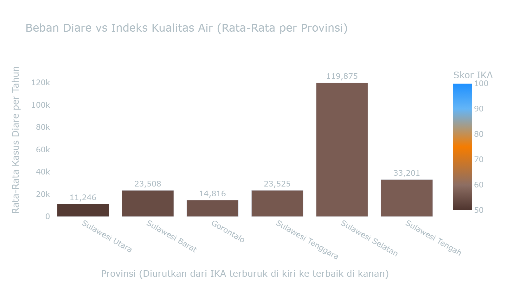

Interpretasi Visual: Provinsi di sebelah kiri yang memiliki warna coklat pekat (skor IKA terburuk) secara konsisten diiringi dengan batang kasus diare yang relatif lebih tinggi.

Titik yang tersebar acak mengindikasikan bahwa data makro secara statistik tidak menunjukkan korelasi kausalitas yang kuat pada level agregat provinsi (R²=0.043, P=0.157). Oleh karena itu, kesimpulan pencemaran air lebih valid ditarik dari hasil uji klinis mikroskopis di tapak (Bukti Lab NGO).

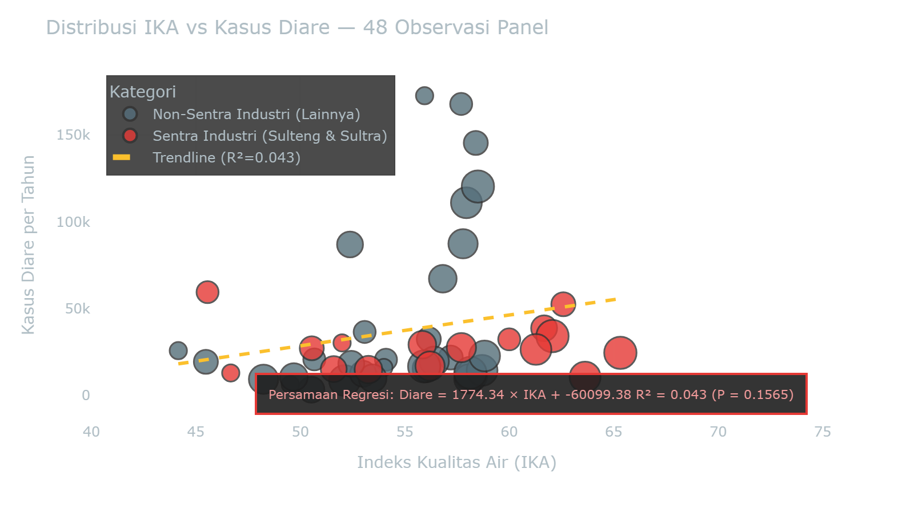

**Interpretasi Korelasi Statistik:**

        Hasil regresi linear (OLS) menunjukkan bahwa hubungan antara IKA dan Diare **TIDAK SIGNIFIKAN** secara statistik pada tingkat kepercayaan 95% (**R² = 0.043, P = 0.1565 > 0.05**).

        Oleh karena itu, kita **tidak dapat menyimpulkan secara absolut** bahwa setiap penurunan 1 poin IKA otomatis meningkatkan jumlah kasus Diare secara proporsional. Namun secara kualitatif (visual), Provinsi Sentra Industri (titik merah) memang cenderung berkumpul di area IKA yang sangat rendah, memperlihatkan kerentanan ekologis yang patut diwaspadai.

        **Bubble size merepresentasikan tahun:** titik besar = tahun terkini (2024). Meskipun relasi linearnya lemah, sebaran titik ini menunjukkan perlunya kehati-hatian dalam mengelola limbah yang mencemari air permukaan.

Menghadapi absennya data **"Akses Air Minum Layak"** di tingkat Kabupaten dari BPS sejak 2019, kami menggunakan **Ground Truth Data** dari pengujian laboratorium independen (AEER & WALHI) sebagai alternatif pengukur pencemaran air secara absolut.

Berdasarkan hasil uji klinis dari 12 titik sampel di lingkar kawasan tambang, teridentifikasi bahwa **9 titik (75%) melampaui batas aman toksisitas biota laut** (0.005 mg/L). Konsentrasi terparah ditemukan di Saluran Smelter Morosi dengan kadar Kromium Heksavalen mencapai **0.100 mg/L**, atau 20 kali lipat lebih tinggi dari ambang batas aman. 

⚠️ **Peringatan Klinis:** Kromium Heksavalen (Cr6+) adalah logam berat karsinogenik beracun. Paparan berulang pada air yang dikonsumsi atau digunakan mencuci memicu iritasi kulit kronis, kerusakan pernapasan, pencernaan, dan potensi kanker parah di komunitas lingkar tambang. Bukti konkret di level tapak ini mengonfirmasi asimetri dampak ekologis industri ekstraktif yang gagal ditangkap oleh agregasi data makro.

> Altair chart save failed: Saving charts in 'png' format requires the vl-convert-python package: see https://altair-viz.github.io/user_guide/saving_charts.html#png-svg-and-pdf-format

#### Uji Statistik: Asosiasi IKA Rendah dengan Tingginya Kasus Diare

Untuk membuktikan hubungan kausal secara statistik, crosstab Chi-Square di bawah menggunakan unit observasi **Provinsi-Tahun** (6 provinsi × 9 tahun = 54 sampel panel).
Setiap observasi diklasifikasikan menjadi "IKA Rendah/Tinggi" dan "Diare Rendah/Tinggi" berdasarkan **median panel** dari masing-masing indikator.

##### Variabel Independen (X) - Faktor Lingkungan

##### Variabel Dependen (Y) - Dampak Kesehatan

### Detail Uji Statistik (Chi-Square & Odds Ratio)

> Tabel-tabel di bawah ini adalah *output* statistik formal yang menyajikan bukti statistik formal: Case Processing → Crosstabulation → Chi-Square Tests → Ringkasan Hipotesis.

##### Case Processing Summary

|   ('Cases', 'Valid', 'N') | ('Cases', 'Valid', 'Percent')   |   ('Cases', 'Missing', 'N') | ('Cases', 'Missing', 'Percent')   |   ('Cases', 'Total', 'N') | ('Cases', 'Total', 'Percent')   |
|--------------------------:|:--------------------------------|----------------------------:|:----------------------------------|--------------------------:|:--------------------------------|
|                        16 | 33.3%                           |                          32 | 66.7%                             |                        48 | 100.0%                          |

##### IKA Wilayah Sentra Tambang * Total Kasus Diare Crosstabulation

|   Total Kasus Diare Rendah (< Median Prov) |   Total Kasus Diare Tinggi (≥ Median Prov) |   Total |
|-------------------------------------------:|-------------------------------------------:|--------:|
|                                          5 |                                          3 |       8 |
|                                          4 |                                          4 |       8 |
|                                          3 |                                          5 |       8 |
|                                          4 |                                          4 |       8 |
|                                          8 |                                          8 |      16 |
|                                          8 |                                          8 |      16 |

##### Chi-Square Tests

**IKA Wilayah Sentra Tambang * Total Kasus Diare**

|   Value |   df |   Asymp. Sig. (2-sided) |
|--------:|-----:|------------------------:|
|   0.25  |    1 |                   0.617 |
|   0.251 |    1 |                   0.617 |
|   0.938 |    1 |                   0.35  |
|  16     |      |                         |

### Ringkasan Uji Hipotesis

    #### Result: TIDAK SIGNIFIKAN
    
        P-Value    : 0.6171
        Chi-Square : 0.250
        df         : 1
    

**Odds Ratio (Risk Estimate):** `0.360`

> **Interpretasi Ekologis:**
> 
> 
    Secara agregat, hubungan antara IKA Wilayah Sentra Tambang dan Total Kasus Diare **tidak signifikan** secara statistik (P ≥ 0.05). Hal ini mengindikasikan bahwa pencemaran air telah menyebar secara merata ke seluruh wilayah Sulawesi, sehingga tidak ada lagi provinsi 'aman' dari krisis air bersih. **Krisis tata kelola air telah menjadi sistemik**, bukan lagi terisolasi di zona industri tertentu.

Lihat Data Panel Mentah (IKA Wilayah Sentra Tambang × Total Kasus Diare)

| Provinsi          |   Tahun |   IKA_Sentra | IKA_Label                                         |   Total_Diare | Diare_Label                              |
|:------------------|--------:|-------------:|:--------------------------------------------------|--------------:|:-----------------------------------------|
| Sulawesi Tengah   |    2016 |        46.67 | IKA Wilayah Sentra Tambang Rendah (< Median Prov) |         12992 | Total Kasus Diare Rendah (< Median Prov) |
| Sulawesi Tengah   |    2018 |        45.56 | IKA Wilayah Sentra Tambang Rendah (< Median Prov) |         59544 | Total Kasus Diare Tinggi (≥ Median Prov) |
| Sulawesi Tengah   |    2019 |        62.59 | IKA Wilayah Sentra Tambang Tinggi (≥ Median Prov) |         52584 | Total Kasus Diare Tinggi (≥ Median Prov) |
| Sulawesi Tengah   |    2020 |        61.67 | IKA Wilayah Sentra Tambang Tinggi (≥ Median Prov) |         38757 | Total Kasus Diare Tinggi (≥ Median Prov) |
| Sulawesi Tengah   |    2021 |        55.84 | IKA Wilayah Sentra Tambang Rendah (< Median Prov) |         29273 | Total Kasus Diare Rendah (< Median Prov) |
| Sulawesi Tengah   |    2022 |        57.71 | IKA Wilayah Sentra Tambang Rendah (< Median Prov) |         27582 | Total Kasus Diare Rendah (< Median Prov) |
| Sulawesi Tengah   |    2023 |        63.63 | IKA Wilayah Sentra Tambang Tinggi (≥ Median Prov) |         10648 | Total Kasus Diare Rendah (< Median Prov) |
| Sulawesi Tengah   |    2024 |        62.07 | IKA Wilayah Sentra Tambang Tinggi (≥ Median Prov) |         34225 | Total Kasus Diare Tinggi (≥ Median Prov) |
| Sulawesi Tenggara |    2016 |        52    | IKA Wilayah Sentra Tambang Rendah (< Median Prov) |         30304 | Total Kasus Diare Tinggi (≥ Median Prov) |
| Sulawesi Tenggara |    2018 |        60    | IKA Wilayah Sentra Tambang Tinggi (≥ Median Prov) |         32359 | Total Kasus Diare Tinggi (≥ Median Prov) |
| Sulawesi Tenggara |    2019 |        50.55 | IKA Wilayah Sentra Tambang Rendah (< Median Prov) |         27212 | Total Kasus Diare Tinggi (≥ Median Prov) |
| Sulawesi Tenggara |    2020 |        51.6  | IKA Wilayah Sentra Tambang Rendah (< Median Prov) |         15237 | Total Kasus Diare Rendah (< Median Prov) |
| Sulawesi Tenggara |    2021 |        53.26 | IKA Wilayah Sentra Tambang Rendah (< Median Prov) |         14929 | Total Kasus Diare Rendah (< Median Prov) |
| Sulawesi Tenggara |    2022 |        56.21 | IKA Wilayah Sentra Tambang Tinggi (≥ Median Prov) |         17004 | Total Kasus Diare Rendah (< Median Prov) |
| Sulawesi Tenggara |    2023 |        61.28 | IKA Wilayah Sentra Tambang Tinggi (≥ Median Prov) |         26539 | Total Kasus Diare Tinggi (≥ Median Prov) |
| Sulawesi Tenggara |    2024 |        65.32 | IKA Wilayah Sentra Tambang Tinggi (≥ Median Prov) |         24613 | Total Kasus Diare Rendah (< Median Prov) |

> 📁 **Sumber File:** `data/processed/sulawesi_ika_2016_2024.csv` + `data/processed/sulawesi_kesehatan_detail_2014_2024.csv`

---

### Ringkasan Eksekutif Seluruh Skenario Crosstab

Tabel di bawah ini merangkum hasil pengujian statistik (Chi-Square) untuk indikator IKA terhadap Kasus Diare pada panel data yang sama.

| Variabel Independen (X)    | Variabel Dependen (Y)   |   Chi-Square |   P-Value |   Odds Ratio | Kesimpulan         |
|:---------------------------|:------------------------|-------------:|----------:|-------------:|:-------------------|
| IKA Wilayah Sentra Tambang | Total Kasus Diare       |         0.25 |     0.617 |         0.36 | 🔴 TIDAK SIGNIFIKAN |
| IKA Wilayah Non-Sentra     | Total Kasus Diare       |         0    |     1     |         1    | 🔴 TIDAK SIGNIFIKAN |

> **Pembedahan Realitas Ekologis:****
> >
> Hasil pengujian menunjukkan bahwa korelasi antara IKA dan Kasus Diare **TIDAK SIGNIFIKAN** secara statistik (P ≥ 0.05).**
> >
> Dalam kacamata ekonomi politik ekologi, ketidaksignifikanan ini mengindikasikan bahwa pencemaran air telah terjadi secara *meluas dan merata* di seluruh provinsi Sulawesi.
> >
> >
> <b>Tantangan tata kelola air bersifat sistemik** di berbagai zona wilayah.

---

### 3.7 Beban Limbah Beracun (B3): Eksternalitas Kesehatan yang Diabaikan

> **Metode: Descriptive Statistics & Comparative Bar Chart (2020-2024)**

ℹ️ Metodologi: Descriptive Statistics & Comparative Bar Chart

**Metode Analisis:** Sub-bab ini menggunakan agregasi statistik deskriptif dan komparasi grafik batang (*Bar Chart*) untuk merunut skala penumpukan limbah B3 sebagai pemicu (driver) racun ekosistem.

1. **Agregasi Limpasan Limbah Industri:**
    * **Statistik Deskriptif:** Melakukan pemeringkatan dan *profiling* komposisi buangan B3 absolut dari setiap fasilitas peleburan logam berat yang beroperasi.
    * **Audit Defisit Pengelolaan:** Mengkomparasikan kapasitas pengolahan yang dilaporkan dengan estimasi empiris total emisi limbah.
    * **Pemetaan Toksisitas:** Mengidentifikasi sumber dan skala ancaman racun lingkungan berdasarkan jenis tailing dan material B3 yang dominan.
2. **Kalkulasi/Formula Pengolahan:** Penjumlahan agregat produksi limbah kotor dari level pabrik hingga ke level regional.
    * `Total_B3_Provinsi = Σ(Timbulan_Ton) GROUP BY Provinsi`
    * `Total_B3_Jenis = Σ(Timbulan_Ton) GROUP BY Jenis_Limbah`
3. **Variabel & Fitur Data:**
    * **Timbulan (Ton/Tahun):** Estimasi absolut volume buangan limbah (Dependen).
    * **Kawasan & Jenis Limbah:** Klasifikasi operasi dan karakter residu seperti Slag/Tailing/Air Asam Tambang (Independen).
4. **Dataset & File:**
    * Data Audit LSM & KLHK: `data/processed/sulawesi_limbah_b3.csv`

Jika sub-bab sebelumnya telah membedah dampak pencemaran udara (IKU → ISPA) dan air (IKA → Diare), maka sub-bab ini mengungkap **sumber polusi yang signifikan namun memerlukan perhatian khusus**: timbulan **Limbah Bahan Berbahaya dan Beracun (B3)** dari operasi smelter dan tambang nikel.

**Limbah B3** adalah residu hasil proses ekstraktif yang mengandung logam berat, senyawa kimia berbahaya, dan material berpotensi karsinogenik. Jenis limbah ini meliputi:

- **Slag & Tailing**: Material sisa pengolahan bijih nikel yang mengandung logam berat seperti Chromium, Nikel, dan Kadmium
- **Tailing HPAL**: Limbah padat hasil proses High-Pressure Acid Leaching (HPAL) yang bersifat asam dan mengandung sulfat tinggi
- **Air Limbah Tambang**: Buangan cair yang tercemar logam berat dan asam sulfat
- **Residu & DSTP**: Material beracun yang dikaji dalam opsi pembuangan laut dalam (Deep Sea Tailing Placement)

Klaim bahwa slag dapat "dimanfaatkan untuk batako dan penahan abrasi" memerlukan kajian kritis, mengingat akumulasi material ini memerlukan pengelolaan dan pemantauan risiko kesehatan yang transparan.

Data kompilasi dari laporan AEER, WALHI, JATAM, dan kajian akademis membuktikan bahwa **operasi smelter di Sulawesi menghasilkan puluhan juta ton limbah B3 per tahun**—dengan dampak kesehatan jangka panjang yang perlu dimonitor secara berkelanjutan.

    <h3 style="color: #FF6F60; margin-top: 0;">Skala Ancaman Limbah Beracun</h3>
    

        Data komprehensif dari berbagai sumber (AEER, WALHI, JATAM, BPLH) membuktikan bahwa industri nikel di Sulawesi menghasilkan <b>lebih dari 32.8 juta ton limbah B3 per tahun**. Angka ini setara dengan menimbun **32,800 gedung bertingkat** dengan material beracun setiap tahunnya.
    

    

        Provinsi **Sulawesi Utara** menanggung beban terbesar dengan **0.0 juta ton** limbah B3 per tahun, didominasi oleh operasi **IMIP (Indonesia Morowali Industrial Park)** yang menghasilkan slag dan tailing HPAL tanpa izin formal yang memadai.
    

    

        **Catatan Kritis:** Angka resmi ini kemungkinan besar *underestimate* (meremehkan) karena banyak fasilitas yang tidak melaporkan timbulan limbah secara transparan. Estimasi independen menyebutkan angka sebenarnya bisa 2-3 kali lipat lebih tinggi.
    

#### Distribusi Limbah B3 per Provinsi

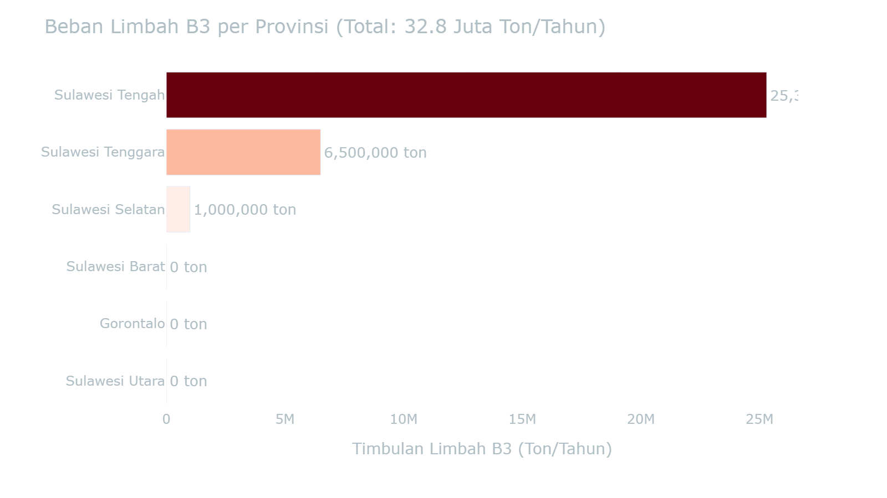

> **Interpretasi Spasial:**
> 
> 
    Visualisasi di atas menunjukkan bahwa **Sulawesi Tengah dan Sulawesi Tenggara**—dua provinsi episentrum hilirisasi nikel—menanggung volume limbah B3 yang signifikan. **Sulawesi Tengah** menghasilkan **25.3 juta ton B3/tahun**, terutama dari kawasan industri Morowali.
> 
> 

    Ini mencerminkan **ketimpangan ekologis**: wilayah penyangga menanggung beban limbah industri yang signifikan dibandingkan manfaat ekonomi langsung yang diterima. Warga lokal beriringan dengan lokasi timbunan slag—**sehingga membutuhkan pengawasan proteksi kesehatan dan transparansi pengolahan**.

#### Komposisi Limbah B3 Berdasarkan Jenis

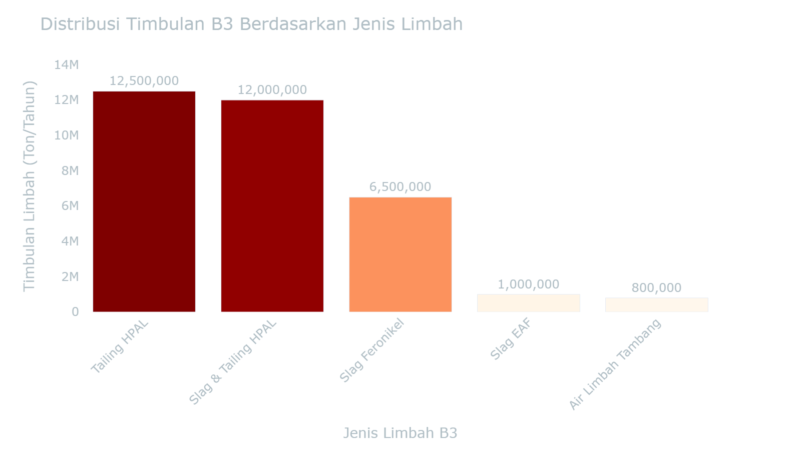

> **Interpretasi Komposisi Limbah:**
> 
> 
    **Slag dan Tailing** mendominasi timbulan limbah B3 dengan total **44.0 juta ton/tahun**. Material ini mengandung konsentrasi tinggi logam berat seperti **Chromium (Cr), Nikel (Ni), Kadmium (Cd), dan Arsenik (As)** yang bersifat karsinogenik (memicu kanker) dan neurotoksik (merusak sistem saraf).
> 
> 

    Klaim industri bahwa slag "aman dimanfaatkan untuk batako" adalah **klaim yang perlu dikaji lebih kritis**. Penelitian mengindikasikan bahwa paparan jangka panjang terhadap debu slag berpotensi memicu **dermatitis dan gangguan pernapasan** pada komunitas sekitar.
> 
> 

    **Tailing HPAL** (High-Pressure Acid Leaching) lebih berbahaya lagi karena mengandung **asam sulfat konsentrasi tinggi** yang dapat mencemari sungai dan laut. Proses HPAL yang digunakan PT HNC dan PT QMB di Morowali menghasilkan **12,5 juta ton tailing beracun per tahun**—setara dengan volume banjir bandang yang terjadi setiap hari.

#### Fasilitas Penghasil Limbah B3 Terbesar

| Provinsi          | Kawasan/Perusahaan                       | Jenis Limbah B3     |   Estimasi Timbulan (Ton/Tahun) | Sumber Referensi                           |
|:------------------|:-----------------------------------------|:--------------------|--------------------------------:|:-------------------------------------------|
| Sulawesi Tengah   | IMIP (Morowali)                          | Slag & Tailing HPAL |                      12,000,000 | Temuan KLH/BPLH & Laporan AEER (2024-2025) |
| Sulawesi Tengah   | PT Huayue Nickel Cobalt (HNC) - Morowali | Tailing HPAL        |                       7,000,000 | AEER HPAL Report (2024)                    |
| Sulawesi Tenggara | VDNI (Konawe) & Sekitarnya               | Slag Feronikel      |                       6,500,000 | Data Produksi VDNI & Kajian WALHI          |
| Sulawesi Tengah   | PT QMB New Energy Materials - Morowali   | Tailing HPAL        |                       5,500,000 | AEER HPAL Report (2024)                    |
| Sulawesi Selatan  | Huadi Nickel Alloy (Bantaeng)            | Slag EAF            |                       1,000,000 | Kajian JATAM & Akademis (Unhas/BRIN)       |
| Sulawesi Tengah   | PT SCM (Sulawesi Cahaya Mineral)         | Air Limbah Tambang  |                         800,000 | AEER HPAL Report (2024)                    |

> **Top 10 Fasilitas Penghasil Limbah B3** — Data dikompilasi dari laporan AEER (2024), WALHI, JATAM, dan audit lingkungan independen.

#### Kaitan dengan Beban Kesehatan Masyarakat

Meskipun data epidemiologis yang menghubungkan secara langsung antara paparan limbah B3 dengan penyakit spesifik masih terbatas (karena keengganan industri untuk melakukan kajian kesehatan independen), **bukti-bukti tidak langsung sangat kuat**:

1. **Korelasi Geografis:** Provinsi dengan timbulan B3 tertinggi (Sulteng & Sultra) adalah provinsi yang sama dengan beban ISPA dan Diare tertinggi (terbukti di sub-bab 3.1 dan 3.5)

2. **Jalur Paparan Multipel:**
   - **Paparan Inhalasi:** Debu slag yang beterbangan terhirup warga sekitar → ISPA/Pneumonia kronis
   - **Kontaminasi Air:** Lindi (leachate) dari timbunan tailing berpotensi memengaruhi sumber air → Peningkatan kasus Diare dan penyakit kulit
   - **Akumulasi Logam Berat:** Chromium dan Nikel terakumulasi dalam rantai makanan → Risiko kanker jangka panjang

3. **Temuan Lapangan dari WALHI dan JATAM:**
   - Warga Morowali melaporkan peningkatan kasus gatal-gatal kulit dan iritasi mata sejak operasi IMIP dimulai
   - Air sumur warga di sekitar kawasan smelter berubah warna menjadi kemerahan dan berbau logam
   - Ikan hasil tangkapan nelayan lokal mengalami penurunan kualitas dan kuantitas drastis

4. **Perbandingan Internasional:** Kasus pencemaran slag di Filipina (Zambales) dan Kaledonia Baru (New Caledonia) membuktikan bahwa komunitas yang hidup di sekitar fasilitas pengolahan nikel mengalami peningkatan signifikan kasus penyakit pernapasan, kanker paru-paru, dan gangguan reproduksi.

    #### Kesimpulan Kritis: Beban Ganda Masyarakat Terdampak
    

        Data limbah B3 di atas menegaskan bahwa masyarakat di zona penyangga smelter **menanggung beban ganda (double burden)**:
    

    <ol style="color: #EEEEEE; font-size: 1rem; line-height: 1.7;">
        <li>**Beban Polusi Aktif:** Paparan harian terhadap emisi SO₂, debu PM2.5, dan pencemaran air (terbukti di sub-bab 3.3 dan 3.5)</li>
        <li>**Beban Polusi Pasif:** Hidup berdampingan dengan timbunan **32.8 juta ton limbah beracun** yang terakumulasi setiap tahun—**tanpa jaminan keamanan jangka panjang**</li>
    </ol>
    

        Kompleks IMIP di Morowali menghasilkan **12.0 juta ton limbah B3/tahun**. Hal ini menunjukkan pentingnya evaluasi independen atas dampak lingkungan dan kesehatan dari ekspansi industri nikel bagi masyarakat sekitar.
    

    

        **Rekomendasi Kebijakan:** Pemerintah harus segera menghentikan ekspansi smelter baru hingga tersedia kajian risiko kesehatan independen, sistem monitoring limbah B3 yang transparan, dan skema kompensasi yang adil bagi masyarakat terdampak. **Hak atas lingkungan hidup yang sehat adalah hak asasi yang tidak dapat ditawar dengan pertumbuhan ekonomi semata**.
    

Lihat Data Mentah: Limbah B3 Sulawesi (2020-2024)

| Provinsi           | Kawasan/Perusahaan                       | Jenis Limbah B3     |   Estimasi Timbulan (Ton/Tahun) | Sumber Referensi                                      | Catatan                                                                                                                                                                                                                                                                                                                                                    | Sumber          |
|:-------------------|:-----------------------------------------|:--------------------|--------------------------------:|:------------------------------------------------------|:-----------------------------------------------------------------------------------------------------------------------------------------------------------------------------------------------------------------------------------------------------------------------------------------------------------------------------------------------------------|:----------------|
| Sulawesi Tengah    | IMIP (Morowali)                          | Slag & Tailing HPAL |                         1.2e+07 | Temuan KLH/BPLH & Laporan AEER (2024-2025)            | Timbunan tanpa izin mencapai >12 juta ton. Sebagian dimanfaatkan jadi batako (40.000 unit/hari).                                                                                                                                                                                                                                                           | data/raw/D3TLH/ |
| Sulawesi Tenggara  | VDNI (Konawe) & Sekitarnya               | Slag Feronikel      |                         6.5e+06 | Data Produksi VDNI & Kajian WALHI                     | Tahun 2020 mengolah 7,28 juta ton bijih nikel. Mayoritas industri nikel nasional (13 juta ton slag) berada di wilayah ini.                                                                                                                                                                                                                                 | data/raw/D3TLH/ |
| Sulawesi Selatan   | Huadi Nickel Alloy (Bantaeng)            | Slag EAF            |                         1e+06   | Kajian JATAM & Akademis (Unhas/BRIN)                  | Volume slag mencapai 90% dari total bahan baku yang diproses di tungku EAF. Dimanfaatkan untuk penahan abrasi.                                                                                                                                                                                                                                             | data/raw/D3TLH/ |
| Sulawesi Tengah    | PT Huayue Nickel Cobalt (HNC) - Morowali | Tailing HPAL        |                         7e+06   | AEER HPAL Report (2024)                               | Hasil ekstraksi PDF. Menghasilkan 7 juta ton tailing dari 70.000 ton MHP pada tahun 2023.                                                                                                                                                                                                                                                                  | data/raw/D3TLH/ |
| Sulawesi Tengah    | PT QMB New Energy Materials - Morowali   | Tailing HPAL        |                         5.5e+06 | AEER HPAL Report (2024)                               | Hasil ekstraksi PDF. Menghasilkan 5,5 juta ton tailing dari 55.000 ton MHP pada tahun 2023.                                                                                                                                                                                                                                                                | data/raw/D3TLH/ |
| Sulawesi Tengah    | PT SCM (Sulawesi Cahaya Mineral)         | Air Limbah Tambang  |                    800000       | AEER HPAL Report (2024)                               | Hasil ekstraksi PDF. Melepaskan lebih dari 800.000 ton air limbah tambang ke Sungai Lalindu pada tahun 2022.                                                                                                                                                                                                                                               | data/raw/D3TLH/ |
| Sulawesi (Unknown) | 2021-2022PTFIENVIRONMENTALAUDITEXEC      | Tailing             |                       nan       | Unknown (2021-2022PTFIEnvironmentalAuditExec.pdf)     | Teks: Audit MoEF Roadmap target of 5,500 tons of TSS with the highest measured value being in October 2021 at 2,496 tons of TSS. Despite the fact that sediment discharges from the outlet channels are well below the sediment load target established in the Tailings Management Roadmap, the reclamation works                                          | data/raw/D3TLH/ |
| Sulawesi (Unknown) | 2021-2022PTFIENVIRONMENTALAUDITEXEC      | Tailing             |                       nan       | Unknown (2021-2022PTFIEnvironmentalAuditExec.pdf)     | Teks: Audit MoEF Roadmap target of 5,500 tons of TSS with the highest measured value being in October 2021 at 2,496 tons of TSS. Despite the fact that sediment discharges from the outlet channels are well below the sediment load target established in the Tailings Management Roadmap, the reclamation works                                          | data/raw/D3TLH/ |
| Sulawesi (Unknown) | 2024-2025PTFIENVIRONMENTALAUDITEXEC      | Tailing             |                       nan       | Unknown (2024-2025PTFIEnvironmentalAuditExec.pdf)     | Teks: 4. Mill and Concentrator 1. Currently, MP74 Stockpile maximum capacity is 1 million ton (250,000 tonnes at MLA Stockpile and 750,000 tonnes at Amole Stockpile) to support overall concentrate mill process, including oreflow process. The implementation plan to integrate the C1- C2 and C3-C4 lines coul                                         | data/raw/D3TLH/ |
| Sulawesi (Unknown) | 2024-2025PTFIENVIRONMENTALAUDITEXEC      | Tailing             |                       nan       | Unknown (2024-2025PTFIEnvironmentalAuditExec.pdf)     | Teks: 4. Mill and Concentrator 1. Currently, MP74 Stockpile maximum capacity is 1 million ton (250,000 tonnes at MLA Stockpile and 750,000 tonnes at Amole Stockpile) to support overall concentrate mill process, including oreflow process. The implementation plan to integrate the C1- C2 and C3-C4 lines coul                                         | data/raw/D3TLH/ |
| Sulawesi (Unknown) | 2024-2025PTFIENVIRONMENTALAUDITEXEC      | Tailing             |                       nan       | Unknown (2024-2025PTFIEnvironmentalAuditExec.pdf)     | [Nilai asli: 4,000 mg/L (Konsentrasi)] Teks: r from various underground mining operations is directed to the AB tunnels or pumped to the Amole Drift for use in the mill. Water exiting the AB tunnels is directed to sediment traps then subsequently discharged to surface waters which mix with the tailings discharged to the ModADA. The water quali  | data/raw/D3TLH/ |
| Sulawesi (Unknown) | 2024-2025PTFIENVIRONMENTALAUDITEXEC      | Tailing             |                       nan       | Unknown (2024-2025PTFIEnvironmentalAuditExec.pdf)     | [Nilai asli: 10,000 mg/L (Konsentrasi)] Teks: r from various underground mining operations is directed to the AB tunnels or pumped to the Amole Drift for use in the mill. Water exiting the AB tunnels is directed to sediment traps then subsequently discharged to surface waters which mix with the tailings discharged to the ModADA. The water quali | data/raw/D3TLH/ |
| Sulawesi (Unknown) | 2024-2025PTFIENVIRONMENTALAUDITEXEC      | Tailing             |                       nan       | Unknown (2024-2025PTFIEnvironmentalAuditExec.pdf)     | [Nilai asli: 15,000 mg/L (Konsentrasi)] Teks: onstruction of flow diversion structures as an alternative to cross levees; b) utilization of tailings to support national strategic projects; c) trial of reclamation island construction for enhanced tailings utilization; and d) online monitoring of tailings management roadmap implementation. Follow | data/raw/D3TLH/ |
| Sulawesi (Unknown) | 2024-2025PTFIENVIRONMENTALAUDITEXEC      | Tailing             |                       nan       | Unknown (2024-2025PTFIEnvironmentalAuditExec.pdf)     | [Nilai asli: 500.82 Ha (Area)] Teks: cture of reclamation performance over time and to provide a foundation for improving future reclamation methods and strategies. Elsewhere, in the Ajkwa estuary, reclamation e(cid:431)orts have included mangrove planting using Rhizophora mucronata on tailings substrates, in line with technical approv          | data/raw/D3TLH/ |
| Sulawesi (Unknown) | 2024-2025PTFIENVIRONMENTALAUDITEXEC      | Tailing             |                       nan       | Unknown (2024-2025PTFIEnvironmentalAuditExec.pdf)     | [Nilai asli: 516.35 Ha (Area)] Teks: cture of reclamation performance over time and to provide a foundation for improving future reclamation methods and strategies. Elsewhere, in the Ajkwa estuary, reclamation e(cid:431)orts have included mangrove planting using Rhizophora mucronata on tailings substrates, in line with technical approv          | data/raw/D3TLH/ |
| Sulawesi (Unknown) | 2024-2025PTFIENVIRONMENTALAUDITEXEC      | Tailing             |                       nan       | Unknown (2024-2025PTFIEnvironmentalAuditExec.pdf)     | [Nilai asli: 500.12 Ha (Area)] Teks: anted with mangrove seedlings, 97.0% of the 516.35 ha target included in the 2023 Pertek, while the audit team was informed anecdotally that the 2024 planting target of 500.12 ha was met although report is still being finalized. PTFI also introduced tailings retention infrastructure such as geotubes          | data/raw/D3TLH/ |
| Sulawesi (Unknown) | GTR-TZH-COMPENDIUM                       | Tailing             |                         1       | Unknown (GTR-TZH-compendium.pdf)                      | Teks: mme International Resource Panel Global Material Flows Database Figure 6. The global extraction of metal ores (includes copper, iron, aluminium and other non-ferrous metals) from 1970 to 2017. End result: 20,1 million tonnes of copper At most mines, tailings are pumped Tailings The price of copper i                                         | data/raw/D3TLH/ |
| Sulawesi (Unknown) | GTR-TZH-COMPENDIUM                       | Tailings Dam        |                         1       | Unknown (GTR-TZH-compendium.pdf)                      | Teks: extraction of metal ores (includes copper, iron, aluminium and other non-ferrous metals) from 1970 to 2017. End result: 20,1 million tonnes of copper At most mines, tailings are pumped Tailings The price of copper is variable. In 2016 the into large tailings dams, which remain after milling average                                          | data/raw/D3TLH/ |
| Sulawesi Selatan   | GORONTALO MINERALS                       | Slag                |                       nan       | Academic Report (GORONTALO_MINERALS_e4c43e.pdf)       | [Nilai asli: 1.000 Ha (Area)] Teks: Granit seluas 1.000 Ha terdapat di Kecamatan Kwandang dan Sumalata, Slag pasir                                                                                                                                                                                                                                         | data/raw/D3TLH/ |
| Sulawesi Selatan   | GORONTALO MINERALS                       | Tailing             |                         1       | Academic Report (GORONTALO_MINERALS_e4c43e.pdf)       | [kg] Teks: -rata untuk amalgamasi sebanyak 1 Kg air raksa untuk 120 Kg batuan. Banyaknya air raksa yang terbuang setiap bulannya adalah 30 Kg/bulan atau 360 Kg/tahun (SLHD Kab. Gorontalo Utara, 2010). Kegiatan pertambangan emas telah menghasilkan limbah padat (tailing), pembuangannya dilakukan dengan membuat k                                    | data/raw/D3TLH/ |
| Sulawesi Selatan   | GORONTALO MINERALS                       | Tailing             |                       120       | Academic Report (GORONTALO_MINERALS_e4c43e.pdf)       | [kg] Teks: -rata untuk amalgamasi sebanyak 1 Kg air raksa untuk 120 Kg batuan. Banyaknya air raksa yang terbuang setiap bulannya adalah 30 Kg/bulan atau 360 Kg/tahun (SLHD Kab. Gorontalo Utara, 2010). Kegiatan pertambangan emas telah menghasilkan limbah padat (tailing), pembuangannya dilakukan dengan membuat k                                    | data/raw/D3TLH/ |
| Sulawesi Selatan   | GORONTALO MINERALS                       | Tailing             |                        30       | Academic Report (GORONTALO_MINERALS_e4c43e.pdf)       | [kg] Teks: -rata untuk amalgamasi sebanyak 1 Kg air raksa untuk 120 Kg batuan. Banyaknya air raksa yang terbuang setiap bulannya adalah 30 Kg/bulan atau 360 Kg/tahun (SLHD Kab. Gorontalo Utara, 2010). Kegiatan pertambangan emas telah menghasilkan limbah padat (tailing), pembuangannya dilakukan dengan membuat k                                    | data/raw/D3TLH/ |
| Sulawesi Selatan   | GORONTALO MINERALS                       | Tailing             |                       360       | Academic Report (GORONTALO_MINERALS_e4c43e.pdf)       | [kg] Teks: -rata untuk amalgamasi sebanyak 1 Kg air raksa untuk 120 Kg batuan. Banyaknya air raksa yang terbuang setiap bulannya adalah 30 Kg/bulan atau 360 Kg/tahun (SLHD Kab. Gorontalo Utara, 2010). Kegiatan pertambangan emas telah menghasilkan limbah padat (tailing), pembuangannya dilakukan dengan membuat k                                    | data/raw/D3TLH/ |
| Sulawesi Selatan   | GORONTALO MINERALS                       | Tailing             |                        15       | Academic Report (GORONTALO_MINERALS_e4c43e.pdf)       | [kg] Teks: -rata untuk amalgamasi sebanyak 1 Kg air raksa untuk 120 Kg batuan. Banyaknya air raksa yang terbuang setiap bulannya adalah 30 Kg/bulan atau 360 Kg/tahun (SLHD Kab. Gorontalo Utara, 2010). Kegiatan pertambangan emas telah menghasilkan limbah padat (tailing), pembuangannya dilakukan dengan membuat k                                    | data/raw/D3TLH/ |
| Sulawesi Selatan   | GORONTALO MINERALS                       | Slag                |                       nan       | Academic Report (GORONTALO_MINERALS_e4c43e.pdf)       | [Nilai asli: 14.800 Ha (Area)] Teks: pertambangan mineral logam (emas). Potensi pertambangan dan energi terdiri dari potensi emas seluas 14.800 Ha yang tersebar di Kecamatan Sumalata 8,500 Ha, Kec. Atinggola 5.000 Ha, Granit seluas 1.000 Ha terdapat di Kecamatan Kwandang dan Sumalata, Slag pasir besi 300 Ha berada di Kecamatan Sumalata          | data/raw/D3TLH/ |
| Sulawesi Selatan   | GORONTALO MINERALS                       | Slag                |                       nan       | Academic Report (GORONTALO_MINERALS_e4c43e.pdf)       | [Nilai asli: 8,500 Ha (Area)] Teks: pertambangan mineral logam (emas). Potensi pertambangan dan energi terdiri dari potensi emas seluas 14.800 Ha yang tersebar di Kecamatan Sumalata 8,500 Ha, Kec. Atinggola 5.000 Ha, Granit seluas 1.000 Ha terdapat di Kecamatan Kwandang dan Sumalata, Slag pasir besi 300 Ha berada di Kecamatan Sumalata           | data/raw/D3TLH/ |
| Sulawesi Selatan   | GORONTALO MINERALS                       | Slag                |                       nan       | Academic Report (GORONTALO_MINERALS_e4c43e.pdf)       | [Nilai asli: 5.000 Ha (Area)] Teks: pertambangan mineral logam (emas). Potensi pertambangan dan energi terdiri dari potensi emas seluas 14.800 Ha yang tersebar di Kecamatan Sumalata 8,500 Ha, Kec. Atinggola 5.000 Ha, Granit seluas 1.000 Ha terdapat di Kecamatan Kwandang dan Sumalata, Slag pasir besi 300 Ha berada di Kecamatan Sumalata           | data/raw/D3TLH/ |
| Sulawesi Selatan   | GORONTALO MINERALS                       | Slag                |                       nan       | Academic Report (GORONTALO_MINERALS_e4c43e.pdf)       | [Nilai asli: 300 Ha (Area)] Teks: pertambangan mineral logam (emas). Potensi pertambangan dan energi terdiri dari potensi emas seluas 14.800 Ha yang tersebar di Kecamatan Sumalata 8,500 Ha, Kec. Atinggola 5.000 Ha, Granit seluas 1.000 Ha terdapat di Kecamatan Kwandang dan Sumalata, Slag pasir besi 300 Ha berada di Kecamatan Sumalata             | data/raw/D3TLH/ |
| Sulawesi Selatan   | GORONTALO MINERALS                       | Merkuri             |                       300       | Academic Report (GORONTALO_MINERALS_e4c43e.pdf)       | Teks: dalam proses amalgamasi, karena lebih efektif, mudah, murah dan tersedia di pasaran. Efektifitas penggunaan merkuri ini juga disebabkan kemampuan merkuri untuk mengikat emas diperkirakan 50-60%. Dalam proses pengolahan emas secara tradisional, logam merkuri dari proses amalgamasi sebagian ikut dibua                                         | data/raw/D3TLH/ |
| Sulawesi Selatan   | GORONTALO MINERALS                       | Merkuri             |                       700       | Academic Report (GORONTALO_MINERALS_e4c43e.pdf)       | Teks: dalam proses amalgamasi, karena lebih efektif, mudah, murah dan tersedia di pasaran. Efektifitas penggunaan merkuri ini juga disebabkan kemampuan merkuri untuk mengikat emas diperkirakan 50-60%. Dalam proses pengolahan emas secara tradisional, logam merkuri dari proses amalgamasi sebagian ikut dibua                                         | data/raw/D3TLH/ |
| Sulawesi Selatan   | GORONTALO MINERALS                       | Merkuri             |                       150       | Academic Report (GORONTALO_MINERALS_e4c43e.pdf)       | Teks: proses pengolahan emas secara tradisional, logam merkuri dari proses amalgamasi sebagian ikut dibuang bersama partikel lainnya ke badan air, sungai dan selanjutnya ke perairan pesisir laut. Secara global diperkirakan setiap tahun lebih dari 300 ton merkuri menguap ke udara, 700 ton mencemari sungai,                                         | data/raw/D3TLH/ |
| Sulawesi Selatan   | GORONTALO MINERALS                       | Merkuri             |                        50       | Academic Report (GORONTALO_MINERALS_e4c43e.pdf)       | Teks: 50 ton diantaranya terjadi di Indonesia (Speigel, et al., 2010). Kawasan pesisir dan pantai memiliki konsentrasi merkuri jauh lebih tinggi dibandingkan dengan laut terbuka. Pesisir pantai dan muara yang belum tercemar mengandung kurang lebih 20 ng/L merkuri. Bertambahnya kedalaman akan makin meningk                                         | data/raw/D3TLH/ |
| Sulawesi Selatan   | GORONTALO MINERALS                       | Merkuri             |                       nan       | Academic Report (GORONTALO_MINERALS_e4c43e.pdf)       | [Nilai asli: 0.22 ppm (Konsentrasi)] Teks: i memakan ikan, serangga, udang di habitat pantai, muara dan tambak. Biasanya terbang mencari makan sendirian, duduk dia di atas batu atau tanggul tepi air menunggu mangsa. 19 Berdasarkan hasil analisis laboratorium pada Butorides striatus diperoleh merkuri pada organ ginjal 0.22 ppm, hati 0.17 ppm     | data/raw/D3TLH/ |
| Sulawesi Selatan   | GORONTALO MINERALS                       | Merkuri             |                       nan       | Academic Report (GORONTALO_MINERALS_e4c43e.pdf)       | [Nilai asli: 0.17 ppm (Konsentrasi)] Teks: i memakan ikan, serangga, udang di habitat pantai, muara dan tambak. Biasanya terbang mencari makan sendirian, duduk dia di atas batu atau tanggul tepi air menunggu mangsa. 19 Berdasarkan hasil analisis laboratorium pada Butorides striatus diperoleh merkuri pada organ ginjal 0.22 ppm, hati 0.17 ppm     | data/raw/D3TLH/ |
| Sulawesi Selatan   | GORONTALO MINERALS                       | Merkuri             |                       nan       | Academic Report (GORONTALO_MINERALS_e4c43e.pdf)       | [Nilai asli: 0.12 ppm (Konsentrasi)] Teks: i memakan ikan, serangga, udang di habitat pantai, muara dan tambak. Biasanya terbang mencari makan sendirian, duduk dia di atas batu atau tanggul tepi air menunggu mangsa. 19 Berdasarkan hasil analisis laboratorium pada Butorides striatus diperoleh merkuri pada organ ginjal 0.22 ppm, hati 0.17 ppm     | data/raw/D3TLH/ |
| Sulawesi Selatan   | GORONTALO MINERALS                       | Merkuri             |                       nan       | Academic Report (GORONTALO_MINERALS_e4c43e.pdf)       | [Nilai asli: 0.43 ppm (Konsentrasi)] Teks: nga melanoleuca Spesies ini dikenal sebagai burung trinil, termasuk dalam famili Scolopacidae dan genus Tringa. Burung trinil merupakan jenis pemakan krustase, serangga dan invertebrate yang hidup di perairan pesisir dan muara sungai. Hasil analisis merkuri pada organ ginjal Tringa melanoleuca diper    | data/raw/D3TLH/ |
| Sulawesi Selatan   | GORONTALO MINERALS                       | Merkuri             |                       nan       | Academic Report (GORONTALO_MINERALS_e4c43e.pdf)       | [Nilai asli: 0.31 ppm (Konsentrasi)] Teks: nga melanoleuca Spesies ini dikenal sebagai burung trinil, termasuk dalam famili Scolopacidae dan genus Tringa. Burung trinil merupakan jenis pemakan krustase, serangga dan invertebrate yang hidup di perairan pesisir dan muara sungai. Hasil analisis merkuri pada organ ginjal Tringa melanoleuca diper    | data/raw/D3TLH/ |
| Sulawesi Selatan   | GORONTALO MINERALS                       | Merkuri             |                       nan       | Academic Report (GORONTALO_MINERALS_e4c43e.pdf)       | [Nilai asli: 0.19 ppm (Konsentrasi)] Teks: s ini termasuk dalam famili Scolopacidae dari genus Actitis. Actitis hypoleucos dikenal sebagai Trinil pantai, merupakan jenis burung pemakan krustase, serangga dan invertebrata lain yang hidup di habitat pantai pasir, lumpur, sungai. Hasil analisis merkuri pada organ ginjal Actitis hypoleucos diper    | data/raw/D3TLH/ |
| Sulawesi Selatan   | GORONTALO MINERALS                       | Merkuri             |                       nan       | Academic Report (GORONTALO_MINERALS_e4c43e.pdf)       | [Nilai asli: 0.18 ppm (Konsentrasi)] Teks: s ini termasuk dalam famili Scolopacidae dari genus Actitis. Actitis hypoleucos dikenal sebagai Trinil pantai, merupakan jenis burung pemakan krustase, serangga dan invertebrata lain yang hidup di habitat pantai pasir, lumpur, sungai. Hasil analisis merkuri pada organ ginjal Actitis hypoleucos diper    | data/raw/D3TLH/ |
| Sulawesi Selatan   | GORONTALO MINERALS                       | Merkuri             |                       nan       | Academic Report (GORONTALO_MINERALS_e4c43e.pdf)       | [Nilai asli: 0.10 ppm (Konsentrasi)] Teks: s ini termasuk dalam famili Scolopacidae dari genus Actitis. Actitis hypoleucos dikenal sebagai Trinil pantai, merupakan jenis burung pemakan krustase, serangga dan invertebrata lain yang hidup di habitat pantai pasir, lumpur, sungai. Hasil analisis merkuri pada organ ginjal Actitis hypoleucos diper    | data/raw/D3TLH/ |
| Sulawesi Selatan   | GORONTALO MINERALS                       | Merkuri             |                       nan       | Academic Report (GORONTALO_MINERALS_e4c43e.pdf)       | [Nilai asli: 0.11 ppm (Konsentrasi)] Teks: termasuk dalam famili Charadriidae dan genus Pluvialis. Merupakan jenis burung pemakan invertebrata di habitat berlumpur dan pasir di daerah pasang surut. Biasanya mencari makan dalam kelompok kecil. Berdasarkan hasil analisis laboratorium, paparan merkuri pada organ ginjal Pluvialis squatarola menc    | data/raw/D3TLH/ |
| Sulawesi Selatan   | GORONTALO MINERALS                       | Merkuri             |                       nan       | Academic Report (GORONTALO_MINERALS_e4c43e.pdf)       | [Nilai asli: 0,01 ppm (Konsentrasi)] Teks: n, bioakumulasi dan biokonsentrasi penumpukan metil merkuri di dalam jaringan adiposa tingkat trofik berturut-turut: zooplankton, nekton kecil, invertebrata lain, ikan, burung predator dan hewan yang lebih besar yang makan ikan ini juga mengkonsumsi merkuri semakin tinggi. Proses ini menjelaskan men    | data/raw/D3TLH/ |
| Sulawesi Selatan   | GORONTALO MINERALS                       | Merkuri             |                       nan       | Academic Report (GORONTALO_MINERALS_e4c43e.pdf)       | [Nilai asli: 1 ppm (Konsentrasi)] Teks: ekton kecil, invertebrata lain, ikan, burung predator dan hewan yang lebih besar yang makan ikan ini juga mengkonsumsi merkuri semakin tinggi. Proses ini menjelaskan mengapa ikan predator seperti hiu atau burung predator lainnya memiliki konsentrasi merkuri yang lebih tinggi, misalnya, ikan mengandu       | data/raw/D3TLH/ |
| Sulawesi Utara     | TAMBANG TONDANO NUSAJAYA                 | Tailing             |                       700       | Academic Report (TAMBANG_TONDANO_NUSAJAYA_4f3477.pdf) | Teks: karena kegagalan konstruksi, iklim dan gempa bumi. Beberapa kasus lain terjadi misalnya bulan Februari tahun 1994 di Afrika Selatan di mana 500.000 m3 lumpur mengalir sampai 2 km dan 17 orang meninggal. Bulan September 1995 sebanyak 50.000 m3 limbah tailing lepas dari dam, 12 orang mati. Desember ta                                         | data/raw/D3TLH/ |
| Sulawesi Utara     | TAMBANG TONDANO NUSAJAYA                 | Tailing             |                       nan       | Academic Report (TAMBANG_TONDANO_NUSAJAYA_4f3477.pdf) | [Nilai asli: 500.000 m3 (Volume)] Teks: karena kegagalan konstruksi, iklim dan gempa bumi. Beberapa kasus lain terjadi misalnya bulan Februari tahun 1994 di Afrika Selatan di mana 500.000 m3 lumpur mengalir sampai 2 km dan 17 orang meninggal. Bulan September 1995 sebanyak 50.000 m3 limbah tailing lepas dari dam, 12 orang mati. Desember ta       | data/raw/D3TLH/ |
| Sulawesi Utara     | TAMBANG TONDANO NUSAJAYA                 | Tailing             |                       nan       | Academic Report (TAMBANG_TONDANO_NUSAJAYA_4f3477.pdf) | [Nilai asli: 50.000 m3 (Volume)] Teks: karena kegagalan konstruksi, iklim dan gempa bumi. Beberapa kasus lain terjadi misalnya bulan Februari tahun 1994 di Afrika Selatan di mana 500.000 m3 lumpur mengalir sampai 2 km dan 17 orang meninggal. Bulan September 1995 sebanyak 50.000 m3 limbah tailing lepas dari dam, 12 orang mati. Desember ta        | data/raw/D3TLH/ |
| Sulawesi Utara     | TAMBANG TONDANO NUSAJAYA                 | Sianida             |                       700       | Academic Report (TAMBANG_TONDANO_NUSAJAYA_4f3477.pdf) | Teks: lan September 1995 sebanyak 50.000 m3 limbah tailing lepas dari dam, 12 orang mati. Desember tahun 1998 di Spanyol, sebanyak 50.000m3 air asam dan beracun tumpah dari tailing dam. Pada bulan April 1999 di Filipina, 700.000 ton tailing terkontaminasi sianida keluar dan 17 buah rumah terkubur.12 Kajia                                         | data/raw/D3TLH/ |
| Sulawesi Utara     | TAMBANG TONDANO NUSAJAYA                 | Sianida             |                       nan       | Academic Report (TAMBANG_TONDANO_NUSAJAYA_4f3477.pdf) | [Nilai asli: 50.000 m3 (Volume)] Teks: lan September 1995 sebanyak 50.000 m3 limbah tailing lepas dari dam, 12 orang mati. Desember tahun 1998 di Spanyol, sebanyak 50.000m3 air asam dan beracun tumpah dari tailing dam. Pada bulan April 1999 di Filipina, 700.000 ton tailing terkontaminasi sianida keluar dan 17 buah rumah terkubur.12 Kajia        | data/raw/D3TLH/ |
| Sulawesi Tenggara  | ANEKA TAMBANG                            | Tailing             |                       nan       | Corporate Report (ANEKA_TAMBANG_38b863.pdf)           | Teks: Audit MoEF Roadmap target of 5,500 tons of TSS with the highest measured value being in October 2021 at 2,496 tons of TSS. Despite the fact that sediment discharges from the outlet channels are well below the sediment load target established in the Tailings Management Roadmap, the reclamation works                                          | data/raw/D3TLH/ |
| Sulawesi Tenggara  | ANEKA TAMBANG                            | Tailing             |                       nan       | Corporate Report (ANEKA_TAMBANG_38b863.pdf)           | Teks: Audit MoEF Roadmap target of 5,500 tons of TSS with the highest measured value being in October 2021 at 2,496 tons of TSS. Despite the fact that sediment discharges from the outlet channels are well below the sediment load target established in the Tailings Management Roadmap, the reclamation works                                          | data/raw/D3TLH/ |
| Sulawesi Tenggara  | VALE INDONESIA                           | Tailing             |                       nan       | Corporate Report (VALE_INDONESIA_38b863.pdf)          | Teks: Audit MoEF Roadmap target of 5,500 tons of TSS with the highest measured value being in October 2021 at 2,496 tons of TSS. Despite the fact that sediment discharges from the outlet channels are well below the sediment load target established in the Tailings Management Roadmap, the reclamation works                                          | data/raw/D3TLH/ |
| Sulawesi Tenggara  | VALE INDONESIA                           | Tailing             |                       nan       | Corporate Report (VALE_INDONESIA_38b863.pdf)          | Teks: Audit MoEF Roadmap target of 5,500 tons of TSS with the highest measured value being in October 2021 at 2,496 tons of TSS. Despite the fact that sediment discharges from the outlet channels are well below the sediment load target established in the Tailings Management Roadmap, the reclamation works                                          | data/raw/D3TLH/ |
| Sulawesi Tenggara  | MODERN CAHAYA MAKMUR                     | Tailing             |                       100       | NGO Report (MODERN_CAHAYA_MAKMUR_9c320f.pdf)          | Teks: r-indonesia-battery-materials/81396124. Accessed August 5, 2024. 28 ESDM. “Penuhi Kebutuhan Listrik Smelter di Sulawesi, Pemerintah Manfaatkan Aliran Gas Donggi Senoro dan Eni Muara Bakau”. 10 | HPAL: A New Challenge for the Environment in Indonesia Tailings. Nickel processing using HPAL technology                                          | data/raw/D3TLH/ |
| Sulawesi Tenggara  | MODERN CAHAYA MAKMUR                     | Residu              |                       100       | NGO Report (MODERN_CAHAYA_MAKMUR_9c320f.pdf)          | Teks: ”. 10 | HPAL: A New Challenge for the Environment in Indonesia Tailings. Nickel processing using HPAL technology produces large volumes of toxic tailings. It is estimated that every ton of nickel metal processed through the HPAL produces 100 tons of residue.29 Government Regulation Number 22 of 2021                                         | data/raw/D3TLH/ |
| Sulawesi Tenggara  | MODERN CAHAYA MAKMUR                     | Tailing             |                       nan       | NGO Report (MODERN_CAHAYA_MAKMUR_fb2aed.pdf)          | Teks: mencetak 1,4–1,6 ton limbah tailing. Kajian lain menyebut setiap ton logam nikel dikeruk                                                                                                                                                                                                                                                             | data/raw/D3TLH/ |
| Sulawesi Tenggara  | MODERN CAHAYA MAKMUR                     | Residu              |                       100       | NGO Report (MODERN_CAHAYA_MAKMUR_fb2aed.pdf)          | Teks: melalui proses HPAL menghasilkan 100 ton residu.29 Peraturan pemerintah (PP) Nomor 22                                                                                                                                                                                                                                                                | data/raw/D3TLH/ |
| Sulawesi Tenggara  | MODERN CAHAYA MAKMUR                     | Tailing             |                       nan       | NGO Report (MODERN_CAHAYA_MAKMUR_fb2aed.pdf)          | [Mt] Teks: praktik perampasan tanah; produksi MHP melalui teknologi HPAL, oleh HNC dan QMB, memiliki jejak padat karbon karena bersandar pasokan listrik dari PLTU batubara off- HPAL dalam Industri Nikel | vii grid di IMIP; HNC dan QMB mengelola limbah beracun tailing sekitar 12,5 juta ton per tahun dengan tekn                                    | data/raw/D3TLH/ |
| Sulawesi Tenggara  | MODERN CAHAYA MAKMUR                     | Tailing             |                       100       | NGO Report (MODERN_CAHAYA_MAKMUR_fb2aed.pdf)          | Teks: 500 kilo volt ke smelter-smelter nikel Huadi di Sulawesi Selatan, Pomala-Ceria di Sulawesi Tenggara, dan Konawe-Morowali di perbatasan Sulawesi Tengah dan Sulawesi Tenggara.28 Tailing. Pengolahan nikel via teknologi HPAL menghasilkan limbah beracun tailing dalam volume besar. Diperkirakan setiap ton                                         | data/raw/D3TLH/ |
| Sulawesi Tenggara  | MODERN CAHAYA MAKMUR                     | Residu              |                       nan       | NGO Report (MODERN_CAHAYA_MAKMUR_fb2aed.pdf)          | Teks: limbah beracun tailing dalam volume besar. Diperkirakan setiap ton bijih nikel yang dihasilkan melalui proses HPAL akan mencetak 1,4–1,6 ton limbah tailing. Kajian lain menyebut setiap ton logam nikel dikeruk melalui proses HPAL menghasilkan 100 ton residu.29 Peraturan pemerintah (PP) Nomor 22 Tahun                                         | data/raw/D3TLH/ |
| Sulawesi Tengah    | MULTI DINAR KARYA                        | Tailing             |                       nan       | NGO Report (MULTI_DINAR_KARYA_475682.pdf)             | [Mt] Teks: rang dunia, 37% ikan terumbu karang, dan hutan mangrove terbesar di dunia.40 Setelah diundangkannya PP 22/2021, tambang emas PT Amman Mineral Nusa Tenggara diberikan izin DSTP oleh KHLK per Maret 2022. Izin ini diberikan untuk membuang 58,4 juta ton tailing pertahun ke laut Sumbawa, Nusa Tenggara Ba                                    | data/raw/D3TLH/ |
| Sulawesi Tengah    | MULTI DINAR KARYA                        | Dstp                |                       nan       | NGO Report (MULTI_DINAR_KARYA_475682.pdf)             | [Mt] Teks: i Episentrum Nikel Indonesia 21 dibangun. Laut Morowali memiliki 76% terumbu karang dunia, 37% ikan terumbu karang, dan hutan mangrove terbesar di dunia.40 Setelah diundangkannya PP 22/2021, tambang emas PT Amman Mineral Nusa Tenggara diberikan izin DSTP oleh KHLK per Maret 2022. Izin ini diberikan                                     | data/raw/D3TLH/ |
| Sulawesi Tenggara  | SULAWESI CAHAYA MINERAL                  | Tailing             |                       100       | NGO Report (SULAWESI_CAHAYA_MINERAL_9c320f.pdf)       | Teks: r-indonesia-battery-materials/81396124. Accessed August 5, 2024. 28 ESDM. “Penuhi Kebutuhan Listrik Smelter di Sulawesi, Pemerintah Manfaatkan Aliran Gas Donggi Senoro dan Eni Muara Bakau”. 10 | HPAL: A New Challenge for the Environment in Indonesia Tailings. Nickel processing using HPAL technology                                          | data/raw/D3TLH/ |
| Sulawesi Tenggara  | SULAWESI CAHAYA MINERAL                  | Residu              |                       100       | NGO Report (SULAWESI_CAHAYA_MINERAL_9c320f.pdf)       | Teks: ”. 10 | HPAL: A New Challenge for the Environment in Indonesia Tailings. Nickel processing using HPAL technology produces large volumes of toxic tailings. It is estimated that every ton of nickel metal processed through the HPAL produces 100 tons of residue.29 Government Regulation Number 22 of 2021                                         | data/raw/D3TLH/ |
| Sulawesi Tengah    | TRIO KENCANA                             | Tailing             |                       nan       | NGO Report (TRIO_KENCANA_c0e32b.pdf)                  | [Nilai asli: 2.000 Ha (Area)] Teks: anfaatan. Pertemuan ini terbatas antara pemerintah denegan 2.000 hektar. Terdapat 6 klaster di dalam kompleks industri ini. perusahaan-perusahaan yang mengajukan rencana untuk membuang limbah mereka ke laut dalam atau dikenal dengan istilah Deep Sea Tailing Placement. PT QMB New Energy Material, PT            | data/raw/D3TLH/ |
| Sulawesi Tengah    | MULTI DINAR KARYA                        | Chromium            |                       nan       | Other (MULTI_DINAR_KARYA_febfaa.pdf)                  | [kg] Teks: Executive Summary Policy Paper Severe Air Pollution Risks: Smelters and captive power plants in Central Sulawesi, Southeast Sulawesi, and North Maluku are projected to exceed WHO air quality limits by 2030. NO₂ levels are expected to surpass 30 µg/m³, while PM2.5 and SO₂ concentrations will rise bey                                    | data/raw/D3TLH/ |
| Sulawesi Tenggara  | SULAWESI CAHAYA MINERAL                  | Chromium            |                       nan       | Other (SULAWESI_CAHAYA_MINERAL_febfaa.pdf)            | [kg] Teks: Executive Summary Policy Paper Severe Air Pollution Risks: Smelters and captive power plants in Central Sulawesi, Southeast Sulawesi, and North Maluku are projected to exceed WHO air quality limits by 2030. NO₂ levels are expected to surpass 30 µg/m³, while PM2.5 and SO₂ concentrations will rise bey                                    | data/raw/D3TLH/ |
| Sulawesi Tenggara  | VALE INDONESIA                           | Chromium            |                       nan       | Other (VALE_INDONESIA_febfaa.pdf)                     | [kg] Teks: Executive Summary Policy Paper Severe Air Pollution Risks: Smelters and captive power plants in Central Sulawesi, Southeast Sulawesi, and North Maluku are projected to exceed WHO air quality limits by 2030. NO₂ levels are expected to surpass 30 µg/m³, while PM2.5 and SO₂ concentrations will rise bey                                    | data/raw/D3TLH/ |

> 📁 **Sumber File:** `data/processed/sulawesi_limbah_b3.csv` — Kompilasi dari AEER Report (2024), WALHI, JATAM, BPLH, dan kajian akademis independen.

