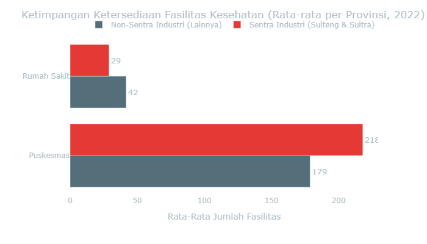
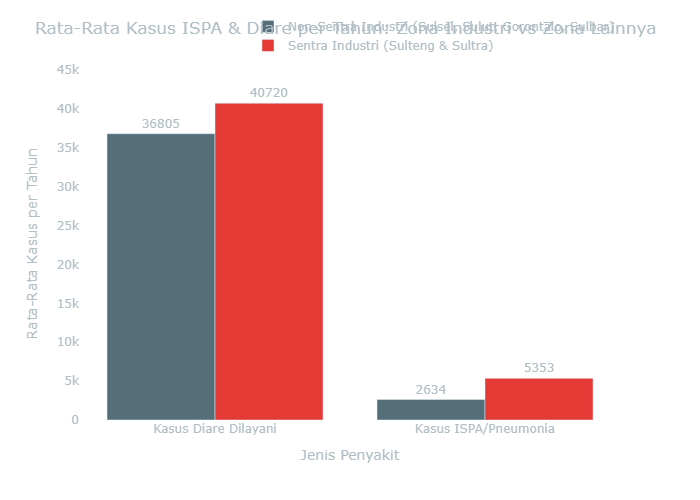
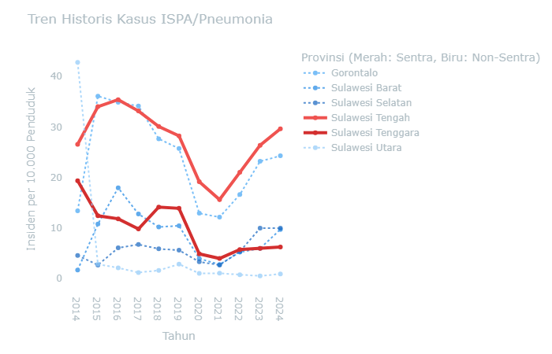
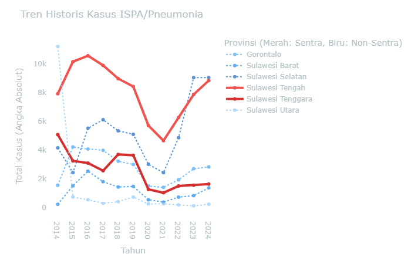
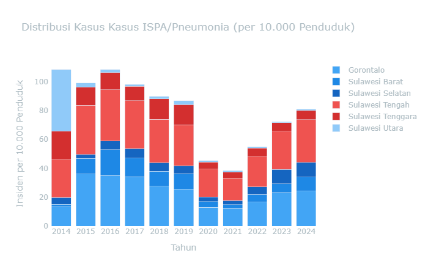
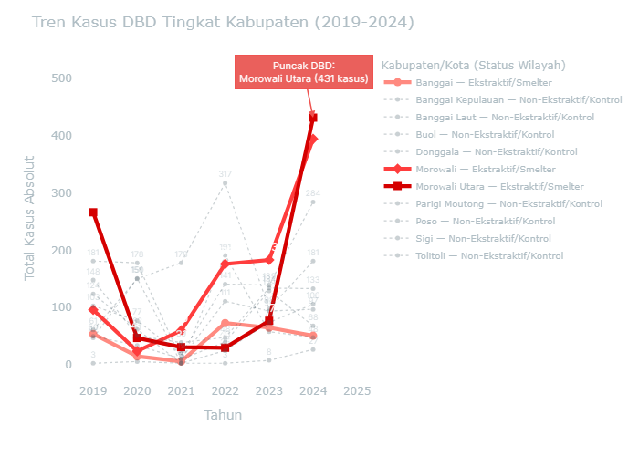
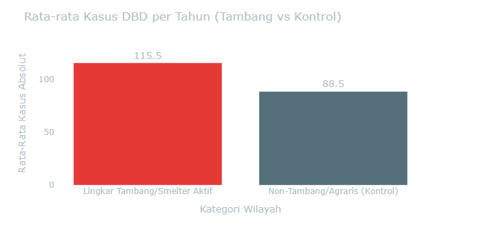
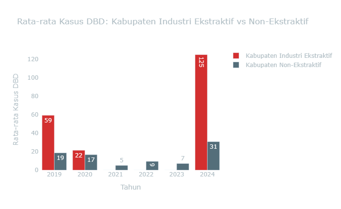
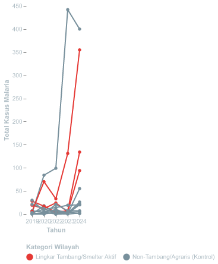

CELIOS — Center of Economic and Law Studies

Beban Kesehatan Masyarakat Terdampak

Tinjauan empiris beban kesehatan masyarakat akibat paparan emisi dan polutan industri di kawasan penyangga smelter nikel Sulawesi.

**🔍 Metodologi**

    **Alur Kausalitas (Ekonomi Politik Ekologi):** `Konsentrasi Industri Ekstraktif` → `Penurunan Kualitas Daya Dukung Lingkungan` → `Peningkatan Insidensi Penyakit (ISPA, Diare) & Ketimpangan Faskes`

    Ekspansi industri ekstraktif berpotensi memengaruhi kualitas lingkungan hidup masyarakat setempat. Pembuangan polutan ke udara ambien dan badan air berkorelasi dengan peningkatan insidensi penyakit respiratori dan infeksi saluran pencernaan, yang diperparah oleh ketimpangan distribusi fasilitas kesehatan.

    **Variabel Dampak Kesehatan (Y):**
    *   **ISPA/Pneumonia:** Penyakit pernapasan akibat paparan debu dan sulfur.
    *   **Diare & Penyakit Menular (Malaria/Kusta):** Dampak pencemaran air dan buruknya sanitasi di lingkar tambang.
    *   **Ketersediaan Fasilitas Kesehatan:** Kesenjangan infrastruktur medis (Puskesmas & Rumah Sakit) terhadap pertumbuhan beban kasus penyakit.

    **Metode Pengolahan Data:**
    Analisis menggunakan *Cross-sectional* dan *Time-Series*. Menggabungkan dataset *survey* dinas kesehatan dan ketersediaan layanan publik untuk menganalisis korelasi antara pertumbuhan kapasitas PLTU *captive* dan peningkatan beban penyakit di masyarakat dengan ketersediaan fasilitas medis yang terbatas.
    

    <h2 style="color: #FFFFFF; font-size: 1.8rem; margin-bottom: 15px; font-weight: 700;">Hilirisasi Nikel dan Dampak Kesehatan: Analisis Data Empiris di Kawasan Penyangga</h2>
    

        Data empiris menggambarkan kesenjangan antara klaim pertumbuhan ekonomi dari ekspansi industri nikel dan kondisi kesehatan masyarakat di kawasan penyangga. Selama satu dekade terakhir, emisi partikulat, gas buang PLTU batu bara, dan timbulan limbah dari fasilitas ekstraktif telah memberikan tekanan signifikan terhadap kualitas lingkungan hidup masyarakat. Data empiris merekam bagaimana ekspansi kapasitas industri, yang ditopang oleh PLTU <i>captive</i> berkapasitas <b>9,825 Megawatt</b>, berjalan sejajar dengan peningkatan kasus penyakit di kawasan-kawasan penyangga.
    

    

        Sepanjang 2014–2024, data agregat dinas kesehatan mencatat total <b>kasus ISPA dan Pneumonia sebanyak 233,687 kasus</b>. Sementara itu, <b>kasus Diare tercatat sebanyak 2,286,607 kasus</b>. Peningkatan insidensi penyakit ini berkorelasi dengan penurunan Indeks Kualitas Air (IKA) secara periodik. Konversi tutupan hutan untuk perluasan konsesi tambang turut berkontribusi pada pergeseran habitat satwa liar, yang berpotensi memicu perpindahan vektor penyakit zoonosis ke permukiman warga. Secara kumulatif, <b>kasus Malaria tercatat mencapai 50,877 kasus</b>, mengindikasikan tekanan terhadap keseimbangan ekologis di wilayah tambang.
    

    

        Distribusi infrastruktur kesehatan di wilayah industri menunjukkan kesenjangan yang perlu menjadi perhatian. Ketersediaan fasilitas layanan primer seperti <b>Puskesmas tercatat sebanyak 1,151 unit</b> pada tahun 2022, di kawasan yang bersamaan menanggung beban penyakit di atas rata-rata. Kondisi ini mengindikasikan bahwa pertumbuhan ekonomi dari hilirisasi nikel belum diimbangi dengan distribusi infrastruktur kesehatan yang proporsional bagi masyarakat di wilayah operasi industri (<i>sacrifice zone</i>).
    

    

        

            
Total Kasus ISPA/Pneumonia

            
233,687

            
Penyakit pernapasan yang meningkat secara konsisten, seiring paparan kronis debu batu bara dan emisi SO₂ dari cerobong <i>smelter</i>.

        

        
<b>Sumber:</b> Data Agregat Dinas Kesehatan (2014-2024) <i>File: sulawesi_kesehatan_detail_2014_2024.csv</i>

    

    

    

        

            
Total Kasus Diare

            
2,286,607

            
Infeksi saluran pencernaan yang tercatat tinggi, seiring degradasi kualitas sumber air tanah dan badan air akibat limbah tailing tambang.

        

        
<b>Sumber:</b> Data Agregat Dinas Kesehatan (2014-2024) <i>File: sulawesi_kesehatan_detail_2014_2024.csv</i>

    

    

    

        

            
Total Kasus Malaria

            
50,877

            
Penyakit vektor endemis dengan kecenderungan meningkat, berkorelasi dengan keberadaan genangan air bekas galian tambang yang tidak direklamasi.

        

        
<b>Sumber:</b> Data Agregat Dinas Kesehatan (2014-2024) <i>File: sulawesi_kesehatan_detail_2014_2024.csv</i>

    

    

    

        

            
Rasio Puskesmas Terdaftar (2022)

            
1,151 Unit

            
Fasilitas primer warga yang pertumbuhannya tidak sebanding dengan peningkatan beban kasus penyakit di wilayah industri.

        

        
<b>Sumber:</b> BPS Ketersediaan Faskes <i>File: sulawesi_faskes_agregat_v2.csv</i>

    

    

    

        

            
Rasio Rumah Sakit (2022)

            
225 Unit

            
Ketersediaan rumah sakit yang tidak merata di wilayah timur, mengindikasikan belum optimalnya distribusi infrastruktur medis.

        

        
<b>Sumber:</b> BPS Ketersediaan Faskes <i>File: sulawesi_faskes_agregat_v2.csv</i>

    

    

  

---

<h2 style="color: #ECEFF1; font-size: 24px;">3.1 Kesenjangan Fasilitas Kesehatan di Kawasan Ekstraktif</h2>

Metode: Grouped Horizontal Bar Chart (Data 2022)

**ℹ️ Metodologi: Grouped Horizontal Bar Chart**

    **Metode Analisis:** Sub-bab ini menggunakan visualisasi perbandingan *Grouped Horizontal Bar Chart* pada satu periode cross-sectional (Tahun 2022) untuk mengukur ketimpangan infrastruktur kesehatan primer dan sekunder.

    1. **Analisis Ketimpangan Infrastruktur (Gap Analysis):**
        * **Segmentasi Fasilitas:** Fasilitas kesehatan dikategorikan secara hierarkis menjadi Puskesmas (Faskes Primer) dan Rumah Sakit (Faskes Sekunder) untuk dievaluasi secara spasial (Sentra vs Non-Sentra).
        * **Evaluasi Defisit:** Mengukur kesenjangan distribusi rasio fasilitas medis per provinsi menggunakan analisis komparatif absolut.
        * **Pemetaan Ketersediaan:** Membedah paradoks ketersediaan layanan kesehatan di wilayah pusat akumulasi kapital ekstraktif sebagai pembuktian defisit infrastruktur publik.
    2. **Kalkulasi/Formula Pengolahan:** Perhitungan agregat ketersediaan faskes menurut wilayah pada tahun acuan data terlengkap (2022).
        * `Rata_Rata_Faskes = MEAN(Jumlah_Faskes) GROUP BY Jenis_Faskes, Kategori_Zona`
    3. **Variabel & Fitur Data:**
        * **Jumlah & Jenis Faskes (Dependen):** Unit Rumah Sakit dan Puskesmas terdaftar (BPS).
        * **Kategori Zona (Independen):** Lokasi wilayah (Sentra vs Non-Sentra).
    4. **Dataset & File:**
        * Data Agregat Faskes: `data/processed/sulawesi_faskes_agregat_v2.csv`
    

 

Data perbandingan distribusi fasilitas kesehatan mengindikasikan bahwa ketersediaan infrastruktur medis di provinsi sentra industri relatif tidak lebih baik dibandingkan wilayah non-sentra, meski beban penyakit di wilayah tersebut lebih tinggi.

Melalui komparasi grafik batang (*Grouped Bar Chart*) di bawah, terlihat bahwa ketersediaan Fasilitas Kesehatan di provinsi dengan konsentrasi industri tinggi justru mengalami defisit relatif. Rata-rata Rumah Sakit di Sentra Industri tercatat **29 unit** per provinsi, lebih rendah dari wilayah Non-Sentra yang mencapai **42 unit**. Kesenjangan distribusi fasilitas medis di area dengan beban penyakit tinggi ini perlu menjadi pertimbangan dalam perencanaan infrastruktur kesehatan ke depan.

**Lihat Data Mentah: Ketimpangan Faskes 2022**

| Kategori                           | jenis       |   jumlah |
|:-----------------------------------|:------------|---------:|
| Non-Sentra Industri (Lainnya)      | Puskesmas   |   178.75 |
| Non-Sentra Industri (Lainnya)      | Rumah Sakit |    41.75 |
| Sentra Industri (Sulteng & Sultra) | Puskesmas   |   218    |
| Sentra Industri (Sulteng & Sultra) | Rumah Sakit |    29    |

*📁 **Sumber File:** `data/processed/sulawesi_faskes_agregat_v2.csv`*

---

### 3.2 Ketimpangan Beban Penyakit: Sentra Industri vs Non-Sentra

Metode: Comparative Spatial Analysis (Dinas Kesehatan 2014-2024)

**ℹ️ Metodologi: Comparative Spatial Analysis**

    **Metode Analisis:** Sub-bab ini menggunakan analisis komparatif spasial (*Comparative Spatial Analysis*) untuk membandingkan rata-rata beban penyakit antara provinsi sentra ekstraktif dan non-sentra.

    1. **Model Komparasi Spasial (Comparative Analysis):**
        * **Segmentasi Wilayah (Binning):** Provinsi secara sistematis dibagi menjadi dua zona: Sentra Industri (Sulteng & Sultra) dan Non-Sentra (Sulsel, Sulut, Gorontalo, Sulbar).
        * **Kuantifikasi Kesenjangan:** Menghitung rata-rata absolut beban kesakitan (*disease burden*) per zona untuk mengukur ketimpangan kesehatan struktural antar wilayah.
        * **Pemetaan Pola:** Mengidentifikasi secara analitik apakah konsentrasi fasilitas tambang berkorespondensi langsung dengan akumulasi masif kasus epidemiologis.
    2. **Kalkulasi/Formula Pengolahan:** Perhitungan rata-rata absolut beban penyakit tahunan berdasarkan klasifikasi wilayah.
        * `Rata_Rata_Kasus_Zona = MEAN(Jumlah_Kasus) GROUP BY Kategori_Zona`
        * `Disparitas_Beban = Rata_Rata_Kasus_Sentra / Rata_Rata_Kasus_Non_Sentra`
    3. **Variabel & Fitur Data:**
        * **Kategori Zona (Independen):** Labeling spasial (Sentra vs Non-Sentra).
        * **Kasus ISPA/Pneumonia & Diare (Dependen):** Total prevalensi historis penyakit per tahun dari fasilitas kesehatan primer.
    4. **Dataset & File:**
        * Data Agregasi Kesehatan: `data/processed/sulawesi_kesehatan_detail_2014_2024.csv`
    

Melalui analisis komparatif spasial, terlihat bahwa beban ekologis tidak terdistribusi secara merata di seluruh wilayah. Provinsi sentra ekspansi nikel—Sulawesi Tengah dan Sulawesi Tenggara—menunjukkan indikator penyakit yang secara konsisten lebih tinggi.

Data menunjukkan bahwa rata-rata penderita **ISPA/Pneumonia** di Sentra Industri tercatat **5,353 kasus per tahun**, dibandingkan provinsi Non-Sentra di angka **2,634 kasus**. Selisih sebesar **2.0 kali lipat** ini mengindikasikan beban pernapasan yang lebih berat di kawasan penyangga *smelter*. Temuan ini mendukung hipotesis kerangka riset D3TLH: wilayah dengan konsentrasi industri tinggi cenderung menanggung beban kesehatan yang lebih besar akibat tekanan terhadap daya tampung lingkungan.

**Lihat Data Mentah: Komparasi Kasus per Provinsi**

| indikator            | Kategori                                               |    nilai |
|:---------------------|:-------------------------------------------------------|---------:|
| Kasus Diare Dilayani | Non-Sentra Industri (Sulsel, Sulut, Gorontalo, Sulbar) | 36805    |
| Kasus Diare Dilayani | Sentra Industri (Sulteng & Sultra)                     | 40720.3  |
| Kasus ISPA/Pneumonia | Non-Sentra Industri (Sulsel, Sulut, Gorontalo, Sulbar) |  2634.36 |
| Kasus ISPA/Pneumonia | Sentra Industri (Sulteng & Sultra)                     |  5353.41 |

*📁 **Sumber File:** `data/processed/sulawesi_kesehatan_detail_2014_2024.csv` - Agregasi Rata-rata per Kategori Wilayah*

    <b>Interpretasi Ekologis:</b> Kesenjangan statistik ini mengindikasikan bahwa manfaat ekonomi dari hilirisasi nikel belum disertai perbaikan infrastruktur kesehatan yang proporsional di wilayah operasi industri ekstraktif.

---

<h2 style="color: #ECEFF1; font-size: 24px;">3.3 Lintasan Waktu Ekologis &amp; Dinamika Penyakit di Kawasan Industri Ekstraktif</h2>

Metode: Time-Series Line Chart & Crosstabulation

**ℹ️ Metodologi: Time-Series Line Chart & Crosstabulation**

    **Metode Analisis:** Sub-bab ini menggunakan visualisasi runtut waktu (Time-Series) dan uji silang (Crosstabulation) secara interaktif untuk merunut dinamika insiden penyakit sejalan dengan akumulasi polusi tahunan.

    1. **Uji Trend Historis & Proporsi Tabulasi Silang:**
        * **Time-Series Tracking:** Mengkonversi absolute numbers ke rasio per kapita (Kasus per 10.000 Penduduk) untuk menghilangkan bias jumlah populasi antar wilayah.
        * `H0 (Null Hypothesis): Penurunan kualitas lingkungan (IKU/IKA) tidak berkorelasi dengan peningkatan insidensi penyakit pernapasan dan pencernaan.`
        * `Decision Rule: Chi-Square P-Value < 0.05 (Tolak H0) dan kalkulasi Odds Ratio.`
    2. **Kalkulasi/Formula Pengolahan:** Rasio keparahan per kapita dan agregasi tabel silang panel.
        * `Insiden_Per_10K = (Total_Kasus / Total_Populasi) * 10,000`
        * `Odds_Ratio = (A * D) / (B * C)`
    3. **Variabel & Fitur Data:**
        * **Indikator Kualitas Lingkungan (X):** IKU/IKA sebagai matriks tekanan lingkungan.
        * **Total Insiden Penyakit (Y):** Angka absolut & insiden per kapita dari beragam penyakit lingkungan (ISPA, Diare, Malaria, Kusta).
        * **Waktu (Time):** Periode longitudinal 2014-2024.
    4. **Dataset & File:**
        * Data Lingkungan & Penyakit: `data/processed/sulawesi_kesehatan_detail_2014_2024.csv`, `data/processed/sulawesi_ika_2016_2024.csv`, `data/processed/sulawesi_iku_2015_2024.csv`
    

Meskipun secara akumulatif kawasan Sentra Industri menanggung beban yang lebih berat, penelusuran data secara *time-series* (historis) dari 2014 hingga 2024 memberikan wawasan tambahan mengenai fluktuasi kasus penyakit dari tahun ke tahun. Anda dapat memilih indikator penyakit pada menu di bawah untuk melihat jejak ekologis secara spesifik.

*Menampilkan tren pertumbuhan historis untuk **Kasus ISPA/Pneumonia**.*

**Tab: Insiden per 10.000 Penduduk**

> [!NOTE]
> **Insight Ekologis:** Grafik di atas membagi jumlah kasus terhadap total populasi, menampilkan **beban per kapita (rasio keparahan)** yang sesungguhnya. Terlihat jelas bahwa rasio kesakitan di kawasan Sentra Industri (garis merah tebal) lebih tinggi secara konsisten dibandingkan wilayah Non-Sentra.

**Tab: Total Kasus Absolut**

> [!WARNING]
> **Catatan Analitis (Population Bias):** Tingginya garis biru (contoh: Sulsel) pada grafik absolut ini merupakan anomali karena perbedaan populasi. Penduduk Sulsel (9 juta jiwa) 3x lebih besar dari Sulteng (3 juta jiwa). Ketersediaan rumah sakit rujukan yang baik di Sulsel juga meminimalisir *under-reporting* (kasus tak tercatat) yang banyak luput di lingkar tambang.

**Tab: Opsi: Stacked Bar Chart**

> [!NOTE]
> **Interpretasi Data:** Proporsi beban kesakitan di wilayah Sentra Industri (blok warna merah) secara konsisten mendominasi dan semakin menebal dari tahun ke tahun. Akumulasi ini menunjukkan bahwa ekspansi kawasan industri berkorelasi dengan peningkatan beban kesehatan masyarakat di lingkar tambang.

**Lihat Data Panel: Kasus ISPA/Pneumonia**

|   tahun |   Gorontalo |   Sulawesi Barat |   Sulawesi Selatan |   Sulawesi Tengah |   Sulawesi Tenggara |   Sulawesi Utara |
|--------:|------------:|-----------------:|-------------------:|------------------:|--------------------:|-----------------:|
|    2014 |        1572 |              243 |               4168 |              7923 |                5081 |            11208 |
|    2015 |        4226 |             1532 |               2445 |             10152 |                3262 |              753 |
|    2016 |        4084 |             2549 |               5528 |             10565 |                3106 |              559 |
|    2017 |        3996 |             1815 |               6120 |              9895 |                2577 |              321 |
|    2018 |        3237 |             1450 |               5350 |              8980 |                3713 |              427 |
|    2019 |        3013 |             1484 |               5108 |              8430 |                3648 |              752 |
|    2020 |        1514 |              565 |               3027 |              5724 |                1283 |              274 |
|    2021 |        1424 |              396 |               2443 |              4668 |                1048 |              281 |
|    2022 |        1947 |              744 |               4872 |              6273 |                1515 |              209 |
|    2023 |        2716 |              848 |               9050 |              7873 |                1572 |              143 |
|    2024 |        2843 |             1381 |               9052 |              8840 |                1647 |              243 |

*📁 **Sumber File:** `data/processed/sulawesi_kesehatan_detail_2014_2024.csv`*

#### Uji Statistik: Asosiasi Kualitas Udara (IKU) dengan Insidensi Penyakit

Hipotesis utama narasi ini adalah bahwa **penurunan kualitas udara ambien (IKU)** berbanding lurus dengan **peningkatan insidensi penyakit pernapasan dan lingkungan** (seperti ISPA dan Diare).
Untuk mengujinya secara statistik di tengah keterbatasan jumlah provinsi di Sulawesi (N=6), tabel crosstab dan uji Chi-Square di bawah menggunakan unit observasi **Provinsi-Tahun** (6 provinsi × 10 tahun = 60 sampel panel).
Setiap observasi diklasifikasikan menjadi "Tinggi" atau "Rendah" berdasarkan nilai **Median panel** dari indikator yang dipilih.

##### Variabel Independen (X) - Faktor Lingkungan & Spasial

##### Variabel Dependen (Y) - Dampak Kesehatan

### Detail Uji Statistik (Chi-Square & Odds Ratio)

*Tabel-tabel di bawah ini adalah *output* statistik formal yang menyajikan bukti statistik formal: Case Processing → Crosstabulation → Chi-Square Tests → Ringkasan Hipotesis.*

##### Case Processing Summary

|                                                         |   ('Cases', 'Valid', 'N') | ('Cases', 'Valid', 'Percent')   |   ('Cases', 'Missing', 'N') | ('Cases', 'Missing', 'Percent')   |   ('Cases', 'Total', 'N') | ('Cases', 'Total', 'Percent')   |
|:--------------------------------------------------------|--------------------------:|:--------------------------------|----------------------------:|:----------------------------------|--------------------------:|:--------------------------------|
| IKU Wilayah Sentra Tambang * Total Kasus ISPA/Pneumonia |                        18 | 27.3%                           |                          48 | 72.7%                             |                        66 | 100.0%                          |

##### IKU Wilayah Sentra Tambang * Total Kasus ISPA/Pneumonia Crosstabulation

|                                                  |   Rendah (< Median Provinsi) |   Tinggi (≥ Median Provinsi) |   Total |
|:-------------------------------------------------|-----------------------------:|-----------------------------:|--------:|
| ('Rendah (< Median Provinsi)', 'Count')          |                          2   |                          7   |       9 |
| ('Rendah (< Median Provinsi)', 'Expected Count') |                          4.5 |                          4.5 |       9 |
| ('Tinggi (≥ Median Provinsi)', 'Count')          |                          7   |                          2   |       9 |
| ('Tinggi (≥ Median Provinsi)', 'Expected Count') |                          4.5 |                          4.5 |       9 |
| ('Total', 'Count')                               |                          9   |                          9   |      18 |
| ('Total', 'Expected Count')                      |                          9   |                          9   |      18 |

##### Chi-Square Tests

**IKU Wilayah Sentra Tambang * Total Kasus ISPA/Pneumonia**

|                              |   Value |   df |   Asymp. Sig. (2-sided) |
|:-----------------------------|--------:|-----:|------------------------:|
| Pearson Chi-Square           |   3.556 |    1 |                   0.059 |
| Likelihood Ratio             |   3.683 |    1 |                   0.055 |
| Linear-by-Linear Association |   5.247 |    1 |                   0.017 |
| N of Valid Cases             |  18     |      |                         |

### Ringkasan Uji Hipotesis

    

        <h4 style="color: #F44336; margin: 0 0 10px 0; text-transform: uppercase;">Result: TIDAK SIGNIFIKAN</h4>
        

            P-Value    : 0.0593 
            Chi-Square : 3.556 
            df         : 1
        

    

    

**Odds Ratio (Risk Estimate):** `12.250`

    

        <b>Interpretasi Ekologis:</b>  
        Secara agregat, hubungan antara IKU Wilayah Sentra Tambang dan Total Kasus ISPA/Pneumonia **tidak signifikan** secara statistik (P ≥ 0.05). Ini mengindikasikan bahwa degradasi ekologis telah berlangsung secara merata di seluruh panel waktu dan ruang, sehingga penambahan izin di tahun tertentu tidak lagi menjadi prediktor tunggal atas peningkatan insidensi penyakit pernapasan dan lingkungan yang sudah meluas.
    

    

---

### Ringkasan Eksekutif Seluruh Skenario Crosstab

Tabel di bawah ini merangkum hasil pengujian statistik (Chi-Square) untuk semua kemungkinan kombinasi antara indikator Ekspansi (X) dan Dampak Kesehatan (Y) pada panel data yang sama.

| Variabel Independen (X)    | Variabel Dependen (Y)      |   Chi-Square |   P-Value |   Odds Ratio | Kesimpulan          |
|:---------------------------|:---------------------------|-------------:|----------:|-------------:|:--------------------|
| IKU Wilayah Sentra Tambang | Total Kasus ISPA/Pneumonia |        3.556 |     0.059 |        12.25 | 🔴 TIDAK SIGNIFIKAN |
| IKU Wilayah Non-Sentra     | Total Kasus ISPA/Pneumonia |        1.044 |     0.307 |         2.52 | 🔴 TIDAK SIGNIFIKAN |

    <b style="color: #FF9800; font-size: 1.05rem;">Pembedahan Realitas Ekologis:</b>  
    

Dari <b>2 skenario pengujian</b>, seluruhnya menunjukkan status <b>TIDAK SIGNIFIKAN</b>.  
Dalam perspektif analisis ekologis, ketidaksignifikanan secara agregat ini mengindikasikan bahwa penurunan kualitas lingkungan dan peningkatan beban penyakit telah terjadi secara <i>merata dan persisten</i> di seluruh wilayah. Penambahan aktivitas industri di satu titik berkorelasi dengan tekanan lingkungan yang sudah merata secara sistemik.    
    

**Lihat Data Panel Mentah (Merge Izin & Dinas Kesehatan)**

| Provinsi          |   Tahun |   IKU_Sentra | X_Label   |   Total_ISPA | Y_Label   |
|:------------------|--------:|-------------:|:----------|-------------:|:----------|
| Sulawesi Tengah   |    2015 |        73    | Rendah    |        10152 | Tinggi    |
| Sulawesi Tengah   |    2016 |        73    | Rendah    |        10565 | Tinggi    |
| Sulawesi Tengah   |    2017 |        87.96 | Rendah    |         9895 | Tinggi    |
| Sulawesi Tengah   |    2018 |        89.1  | Rendah    |         8980 | Tinggi    |
| Sulawesi Tengah   |    2019 |        92.98 | Tinggi    |         8430 | Rendah    |
| Sulawesi Tengah   |    2020 |        91.8  | Tinggi    |         5724 | Rendah    |
| Sulawesi Tengah   |    2021 |        91.33 | Rendah    |         4668 | Rendah    |
| Sulawesi Tengah   |    2022 |        91.86 | Tinggi    |         6273 | Rendah    |
| Sulawesi Tengah   |    2023 |        91.88 | Tinggi    |         7873 | Rendah    |
| Sulawesi Tengah   |    2024 |        92.93 | Tinggi    |         8840 | Tinggi    |
| Sulawesi Tenggara |    2017 |        86.5  | Rendah    |         2577 | Tinggi    |
| Sulawesi Tenggara |    2018 |        83.6  | Rendah    |         3713 | Tinggi    |
| Sulawesi Tenggara |    2019 |        90.01 | Rendah    |         3648 | Tinggi    |
| Sulawesi Tenggara |    2020 |        91.21 | Tinggi    |         1283 | Rendah    |
| Sulawesi Tenggara |    2021 |        90.89 | Rendah    |         1048 | Rendah    |
| Sulawesi Tenggara |    2022 |        92.05 | Tinggi    |         1515 | Rendah    |
| Sulawesi Tenggara |    2023 |        92.83 | Tinggi    |         1572 | Rendah    |
| Sulawesi Tenggara |    2024 |        93    | Tinggi    |         1647 | Tinggi    |

*Sumber: Gabungan `sulawesi_iku_2015_2024.csv` (KLHK) dan `sulawesi_kesehatan_detail_2014_2024.csv` (Dinas Kesehatan).*

---

<h2 style="color: #ECEFF1; font-size: 24px;">3.4 Anomali Zoonosis: Dampak Kritis Ekspansi Industri di Level Tapak (Studi Kasus Sulteng)</h2>

Metode: Time-Series & Komparasi Spasial Wilayah (Dinas Kesehatan)

**ℹ️ Metodologi: Time-Series & Komparasi Spasial Wilayah**

        **Metode Analisis:** Sub-bab ini menggunakan studi kasus mendalam (*Deep Dive Case Study*) berbasis deret waktu di tingkat distrik (Kabupaten/Kota) khusus untuk endemik Sulawesi Tengah.

        1. **Model Anomali Ekologis Spesifik Distrik:**
            * **Analisis Komparatif Zoonosis:** Mengisolasi zona episentrum ekstraktif (Morowali, Morowali Utara, Banggai) dan membandingkannya secara absolut dengan kabupaten agraris/non-tambang yang difungsikan sebagai daerah kontrol.
            * **Korelasi Ekologis:** Merunut pola peningkatan prevalensi penyakit infeksi yang ditransmisikan oleh vektor di kawasan perluasan pembukaan lahan (*land clearing*).
            * **Pemetaan Risiko:** Mengukur eskalasi kerentanan populasi terhadap ancaman wabah malaria dan DBD akibat hancurnya perlindungan habitat alami.
        2. **Kalkulasi/Formula Pengolahan:** Akumulasi tren tahunan infeksi Zoonosis per Kategori Wilayah (Tambang vs Non-Tambang).
            * `Tren_Zoonosis_Distrik = Σ(Total_Kasus) GROUP BY Kategori_Wilayah, Tahun`
        3. **Variabel & Fitur Data:**
            * **Kategori Wilayah Distrik:** Label dikotomi daerah ring 1 tambang vs daerah penyangga luar ring.
            * **Total Kasus Penyakit:** Angka infeksi yang ditransmisikan vektor (Malaria, Rabies, Gigitan Hewan).
        4. **Dataset & File:**
            * Data Zoonosis: `data/processed/zoonosis_kab_kota_2015_2024.csv`
        

    

        Data empiris Dinas Kesehatan mencatat total akumulasi <b>3,111 kasus</b> penyakit Zoonosis di wilayah Lingkar Tambang/Smelter Aktif Sulawesi Tengah (Morowali, Morowali Utara, Banggai) sepanjang rentang waktu pengamatan. Rincian insidensi tertinggi menurut jenis penyakit meliputi: <b>DBD</b> mencatatkan insidensi tertinggi <b>431 kasus</b> di Morowali Utara (2024), <b>FILARIASIS</b> mencatatkan insidensi tertinggi <b>16 kasus</b> di Banggai (2019), <b>RABIES</b> mencatatkan insidensi tertinggi <b>2 kasus</b> di Banggai (2019), serta <b>MALARIA</b> mencatatkan insidensi tertinggi <b>355 kasus</b> di Morowali Utara (2024).
    

    

        Peningkatan angka zoonosis ini berkorelasi dengan perubahan ekologis akibat ekspansi penggunaan lahan. Konversi tutupan hutan demi perluasan konsesi dan fasilitas pengolahan <i>smelter</i> berdampak pada pergeseran habitat alami satwa liar. Akibatnya, vektor pembawa penyakit terpaksa bermigrasi dan beririsan langsung dengan pemukiman pekerja tambang dan warga lokal. Keberadaan genangan air galian tambang yang tidak direklamasi serta kondisi sanitasi di area industri turut menjadi faktor pendukung perkembangbiakan vektor penyakit.
    

    

        Pertumbuhan investasi di sektor ekstraktif belum diimbangi dengan alokasi perlindungan sosial dan lingkungan yang memadai bagi masyarakat lokal. Penduduk asli dan pekerja tambang menghadapi risiko kesehatan berlapis: paparan emisi udara dari <i>captive power plant</i> sekaligus potensi risiko penyakit menular akibat disrupsi lingkungan hidup.
    

    

*Menampilkan tren pertumbuhan historis untuk **DBD** di Kabupaten/Kota se-Sulawesi Tengah.*

            

                <b>Keterangan pembacaan grafik:</b> garis merah solid menandai kabupaten <b>Ekstraktif/Smelter</b> (Morowali, Morowali Utara, Banggai). Gradasi merah mengikuti puncak kasus pada penyakit yang dipilih: merah paling kuat = puncak tertinggi. Garis abu-abu putus-putus menandai wilayah <b>Non-Ekstraktif/Kontrol</b>. Angka di setiap titik menunjukkan total kasus absolut pada tahun tersebut.
            

            

 

            <h4 style="color: #FF5722; margin-top: 10px; margin-bottom: 5px; font-size: 1.1rem;">Interpretasi Spesifik: DBD</h4>
            

                Perbandingan grafik rata-rata di samping menunjukkan bahwa beban absolut kasus <b>DBD</b> di wilayah Lingkar Tambang/Smelter Aktif mencapai <b>115.5 kasus/tahun</b>.
            

            

                Meskipun populasi area tambang seringkali lebih terkonsentrasi, angka ini memberikan sinyal kuat bahwa degradasi lingkungan di sekitar smelter menciptakan ceruk ekologis baru (seperti genangan air galian) yang mempercepat siklus penularan DBD.
            

            

**Lihat Data Mentah: Dataset Zoonosis Provinsi (2015-2024)**

| provinsi   | kabupaten_kota    |   tahun | jenis_penyakit   |   total_kasus |   meninggal |   halaman_pdf | catatan_data                                                 |
|:-----------|:------------------|--------:|:-----------------|--------------:|------------:|--------------:|:-------------------------------------------------------------|
| Gorontalo  | Boalemo           |    2019 | DBD              |           176 |           0 |           183 | nan                                                          |
| Gorontalo  | Boalemo           |    2020 | DBD              |           163 |           0 |           163 | nan                                                          |
| Gorontalo  | Boalemo           |    2021 | DBD              |            41 |           0 |           160 | nan                                                          |
| Gorontalo  | Boalemo           |    2022 | DBD              |           120 |           2 |           160 | nan                                                          |
| Gorontalo  | Boalemo           |    2023 | DBD              |           152 |           0 |           158 | nan                                                          |
| Gorontalo  | Boalemo           |    2024 | DBD              |           435 |           0 |           162 | nan                                                          |
| Gorontalo  | Bone Bolango      |    2019 | DBD              |           225 |           3 |           183 | nan                                                          |
| Gorontalo  | Bone Bolango      |    2020 | DBD              |           180 |           0 |           163 | nan                                                          |
| Gorontalo  | Bone Bolango      |    2021 | DBD              |           144 |           4 |           160 | nan                                                          |
| Gorontalo  | Bone Bolango      |    2022 | DBD              |            89 |           2 |           160 | nan                                                          |
| Gorontalo  | Bone Bolango      |    2023 | DBD              |           142 |           0 |           158 | nan                                                          |
| Gorontalo  | Bone Bolango      |    2024 | DBD              |           664 |           8 |           162 | nan                                                          |
| Gorontalo  | Gorontalo         |    2019 | DBD              |           111 |           6 |           183 | nan                                                          |
| Gorontalo  | Gorontalo         |    2020 | DBD              |            81 |           3 |           163 | nan                                                          |
| Gorontalo  | Gorontalo         |    2021 | DBD              |           112 |           0 |           160 | nan                                                          |
| Gorontalo  | Gorontalo         |    2022 | DBD              |            98 |           3 |           160 | nan                                                          |
| Gorontalo  | Gorontalo         |    2023 | DBD              |            72 |           3 |           158 | nan                                                          |
| Gorontalo  | Gorontalo         |    2024 | DBD              |           270 |           3 |           162 | nan                                                          |
| Gorontalo  | Pohuwato          |    2019 | DBD              |           309 |           6 |           183 | nan                                                          |
| Gorontalo  | Pohuwato          |    2020 | DBD              |            87 |           0 |           163 | nan                                                          |
| Gorontalo  | Pohuwato          |    2021 | DBD              |           136 |           0 |           160 | nan                                                          |
| Gorontalo  | Pohuwato          |    2022 | DBD              |           169 |          15 |           160 | nan                                                          |
| Gorontalo  | Pohuwato          |    2023 | DBD              |           155 |           0 |           158 | nan                                                          |
| Gorontalo  | Pohuwato          |    2024 | DBD              |           391 |           0 |           162 | nan                                                          |
| Gorontalo  | Bone Bolango      |    2019 | FILARIASIS       |             3 |           0 |           185 | nan                                                          |
| Gorontalo  | Bone Bolango      |    2021 | FILARIASIS       |             3 |           0 |           162 | nan                                                          |
| Gorontalo  | Bone Bolango      |    2022 | FILARIASIS       |             3 |           0 |           162 | nan                                                          |
| Gorontalo  | Gorontalo         |    2019 | FILARIASIS       |             1 |           0 |           185 | nan                                                          |
| Gorontalo  | Gorontalo         |    2020 | FILARIASIS       |             1 |           0 |           165 | nan                                                          |
| Gorontalo  | Gorontalo         |    2023 | FILARIASIS       |             1 |           0 |           160 | nan                                                          |
| Gorontalo  | Gorontalo         |    2024 | FILARIASIS       |             5 |           0 |            81 | nan                                                          |
| Gorontalo  | Gorontalo         |    2019 | MALARIA          |             5 |           0 |           108 | nan                                                          |
| Gorontalo  | Gorontalo         |    2020 | MALARIA          |             5 |           0 |            92 | nan                                                          |
| Gorontalo  | Gorontalo         |    2021 | MALARIA          |             5 |           0 |            89 | nan                                                          |
| Gorontalo  | Gorontalo         |    2022 | MALARIA          |             5 |           0 |            82 | nan                                                          |
| Sulsel     | Bantaeng          |    2016 | DBD              |           787 |           0 |            34 | nan                                                          |
| Sulsel     | Bantaeng          |    2017 | DBD              |            61 |          64 |            35 | nan                                                          |
| Sulsel     | Bantaeng          |    2018 | DBD              |           197 |           0 |            27 | nan                                                          |
| Sulsel     | Barru             |    2016 | DBD              |            22 |           0 |            35 | nan                                                          |
| Sulsel     | Barru             |    2017 | DBD              |             3 |           0 |            26 | nan                                                          |
| Sulsel     | Barru             |    2018 | DBD              |            18 |           0 |            27 | nan                                                          |
| Sulsel     | Bone              |    2016 | DBD              |             3 |           0 |            30 | nan                                                          |
| Sulsel     | Bone              |    2017 | DBD              |             2 |           1 |            27 | nan                                                          |
| Sulsel     | Bone              |    2018 | DBD              |            64 |           2 |            27 | nan                                                          |
| Sulsel     | Bulukumba         |    2016 | DBD              |            20 |           0 |            29 | nan                                                          |
| Sulsel     | Bulukumba         |    2017 | DBD              |             4 |           0 |            26 | nan                                                          |
| Sulsel     | Bulukumba         |    2018 | DBD              |           110 |           0 |            27 | nan                                                          |
| Sulsel     | Enrekang          |    2016 | DBD              |            35 |           0 |            35 | nan                                                          |
| Sulsel     | Enrekang          |    2017 | DBD              |            32 |           0 |            32 | nan                                                          |
| Sulsel     | Enrekang          |    2018 | DBD              |            81 |           0 |            27 | nan                                                          |
| Sulsel     | Gowa              |    2016 | DBD              |           628 |           0 |            34 | nan                                                          |
| Sulsel     | Gowa              |    2017 | DBD              |             5 |           0 |            26 | nan                                                          |
| Sulsel     | Gowa              |    2018 | DBD              |           147 |           0 |            27 | nan                                                          |
| Sulsel     | Jeneponto         |    2016 | DBD              |             6 |           0 |            35 | nan                                                          |
| Sulsel     | Jeneponto         |    2017 | DBD              |             1 |           0 |            26 | nan                                                          |
| Sulsel     | Jeneponto         |    2018 | DBD              |            84 |           0 |            27 | nan                                                          |
| Sulsel     | Luwu              |    2016 | DBD              |             2 |           0 |            35 | nan                                                          |
| Sulsel     | Luwu              |    2017 | DBD              |             1 |           0 |            26 | nan                                                          |
| Sulsel     | Luwu              |    2018 | DBD              |             1 |           0 |            27 | nan                                                          |
| Sulsel     | Makassar          |    2016 | DBD              |           192 |           0 |            34 | nan                                                          |
| Sulsel     | Makassar          |    2017 | DBD              |             8 |           0 |            26 | nan                                                          |
| Sulsel     | Makassar          |    2018 | DBD              |           135 |           0 |            27 | nan                                                          |
| Sulsel     | Maros             |    2016 | DBD              |           301 |           0 |            34 | nan                                                          |
| Sulsel     | Maros             |    2017 | DBD              |            10 |           0 |            26 | nan                                                          |
| Sulsel     | Maros             |    2018 | DBD              |           253 |           2 |            27 | nan                                                          |
| Sulsel     | Palopo            |    2016 | DBD              |            86 |           0 |            29 | nan                                                          |
| Sulsel     | Palopo            |    2017 | DBD              |            19 |           0 |            26 | nan                                                          |
| Sulsel     | Palopo            |    2018 | DBD              |            74 |           0 |            27 | nan                                                          |
| Sulsel     | Pangkep           |    2016 | DBD              |           317 |           0 |            35 | nan                                                          |
| Sulsel     | Pangkep           |    2017 | DBD              |             4 |           0 |            26 | nan                                                          |
| Sulsel     | Pangkep           |    2018 | DBD              |           123 |           0 |            27 | nan                                                          |
| Sulsel     | Pinrang           |    2016 | DBD              |             1 |           0 |            35 | nan                                                          |
| Sulsel     | Pinrang           |    2017 | DBD              |             6 |           0 |            26 | nan                                                          |
| Sulsel     | Pinrang           |    2018 | DBD              |             1 |           0 |            27 | nan                                                          |
| Sulsel     | Selayar           |    2016 | DBD              |           940 |           0 |            34 | nan                                                          |
| Sulsel     | Selayar           |    2017 | DBD              |             5 |           8 |            26 | nan                                                          |
| Sulsel     | Selayar           |    2018 | DBD              |             5 |           8 |            27 | nan                                                          |
| Sulsel     | Sidrap            |    2016 | DBD              |           521 |           0 |            35 | nan                                                          |
| Sulsel     | Sidrap            |    2017 | DBD              |             8 |           0 |            26 | nan                                                          |
| Sulsel     | Sidrap            |    2018 | DBD              |            14 |           0 |            27 | nan                                                          |
| Sulsel     | Sinjai            |    2016 | DBD              |           286 |           0 |            34 | nan                                                          |
| Sulsel     | Sinjai            |    2017 | DBD              |             3 |           0 |            34 | nan                                                          |
| Sulsel     | Sinjai            |    2018 | DBD              |            41 |           0 |            27 | nan                                                          |
| Sulsel     | Soppeng           |    2016 | DBD              |            38 |           0 |            35 | nan                                                          |
| Sulsel     | Soppeng           |    2017 | DBD              |             1 |           0 |            26 | nan                                                          |
| Sulsel     | Soppeng           |    2018 | DBD              |            35 |           0 |            27 | nan                                                          |
| Sulsel     | Takalar           |    2016 | DBD              |             6 |           0 |            35 | nan                                                          |
| Sulsel     | Takalar           |    2017 | DBD              |           121 |           0 |            26 | nan                                                          |
| Sulsel     | Takalar           |    2018 | DBD              |           117 |           0 |            27 | nan                                                          |
| Sulsel     | Tana Toraja       |    2016 | DBD              |            28 |           0 |            29 | nan                                                          |
| Sulsel     | Tana Toraja       |    2017 | DBD              |             2 |           0 |            26 | nan                                                          |
| Sulsel     | Tana Toraja       |    2018 | DBD              |            17 |           0 |            27 | nan                                                          |
| Sulsel     | Toraja Utara      |    2016 | DBD              |           319 |           0 |            35 | nan                                                          |
| Sulsel     | Toraja Utara      |    2017 | DBD              |           111 |           0 |            26 | nan                                                          |
| Sulsel     | Toraja Utara      |    2018 | DBD              |            29 |           0 |            27 | nan                                                          |
| Sulsel     | Wajo              |    2016 | DBD              |            33 |           0 |            35 | nan                                                          |
| Sulsel     | Wajo              |    2017 | DBD              |            22 |           0 |            26 | nan                                                          |
| Sulsel     | Wajo              |    2018 | DBD              |            29 |           0 |            27 | nan                                                          |
| Sulsel     | Bone              |    2015 | FILARIASIS       |             3 |           0 |            52 | nan                                                          |
| Sulsel     | Enrekang          |    2015 | FILARIASIS       |             4 |           0 |            52 | nan                                                          |
| Sulsel     | Makassar          |    2015 | FILARIASIS       |             1 |           0 |            52 | nan                                                          |
| Sulsel     | Pangkep           |    2015 | FILARIASIS       |            72 |           0 |            52 | nan                                                          |
| Sulsel     | Bantaeng          |    2017 | RABIES           |           760 |           0 |            78 | nan                                                          |
| Sulsel     | Barru             |    2017 | RABIES           |           199 |           0 |            76 | nan                                                          |
| Sulsel     | Barru             |    2018 | RABIES           |             1 |           0 |            39 | PERLU_VALIDASI_MANUAL                                        |
| Sulsel     | Bone              |    2017 | RABIES           |            17 |           0 |            77 | nan                                                          |
| Sulsel     | Bone              |    2018 | RABIES           |             1 |           0 |            42 | PERLU_VALIDASI_MANUAL                                        |
| Sulsel     | Bulukumba         |    2017 | RABIES           |           600 |           0 |            77 | nan                                                          |
| Sulsel     | Bulukumba         |    2018 | RABIES           |             2 |           0 |            43 | PERLU_VALIDASI_MANUAL                                        |
| Sulsel     | Enrekang          |    2017 | RABIES           |           463 |           0 |            77 | nan                                                          |
| Sulsel     | Enrekang          |    2018 | RABIES           |             2 |           0 |            43 | PERLU_VALIDASI_MANUAL                                        |
| Sulsel     | Gowa              |    2017 | RABIES           |           466 |           0 |            76 | nan                                                          |
| Sulsel     | Gowa              |    2018 | RABIES           |             1 |           0 |            43 | PERLU_VALIDASI_MANUAL                                        |
| Sulsel     | Jeneponto         |    2017 | RABIES           |            25 |           0 |            77 | nan                                                          |
| Sulsel     | Jeneponto         |    2018 | RABIES           |             1 |           0 |            39 | PERLU_VALIDASI_MANUAL                                        |
| Sulsel     | Luwu              |    2017 | RABIES           |           832 |           0 |            78 | nan                                                          |
| Sulsel     | Luwu              |    2018 | RABIES           |             1 |           0 |            43 | PERLU_VALIDASI_MANUAL                                        |
| Sulsel     | Makassar          |    2017 | RABIES           |            43 |           0 |            77 | nan                                                          |
| Sulsel     | Makassar          |    2018 | RABIES           |             2 |           0 |            43 | PERLU_VALIDASI_MANUAL                                        |
| Sulsel     | Maros             |    2017 | RABIES           |           694 |           0 |            77 | nan                                                          |
| Sulsel     | Palopo            |    2017 | RABIES           |           448 |           0 |            77 | nan                                                          |
| Sulsel     | Pangkep           |    2017 | RABIES           |             1 |           0 |            36 | PERLU_VALIDASI_MANUAL                                        |
| Sulsel     | Pangkep           |    2017 | RABIES           |           217 |           0 |            76 | nan                                                          |
| Sulsel     | Pinrang           |    2017 | RABIES           |           146 |           0 |            76 | nan                                                          |
| Sulsel     | Selayar           |    2017 | RABIES           |            14 |           0 |            78 | nan                                                          |
| Sulsel     | Selayar           |    2018 | RABIES           |             1 |           0 |            39 | PERLU_VALIDASI_MANUAL                                        |
| Sulsel     | Sidrap            |    2017 | RABIES           |             1 |           0 |            40 | PERLU_VALIDASI_MANUAL                                        |
| Sulsel     | Sidrap            |    2017 | RABIES           |           814 |           0 |            78 | nan                                                          |
| Sulsel     | Sinjai            |    2017 | RABIES           |           751 |           0 |            77 | nan                                                          |
| Sulsel     | Sinjai            |    2018 | RABIES           |             1 |           0 |            39 | PERLU_VALIDASI_MANUAL                                        |
| Sulsel     | Soppeng           |    2017 | RABIES           |           152 |           0 |            76 | nan                                                          |
| Sulsel     | Soppeng           |    2018 | RABIES           |             1 |           0 |            43 | PERLU_VALIDASI_MANUAL                                        |
| Sulsel     | Takalar           |    2017 | RABIES           |           258 |           0 |            76 | nan                                                          |
| Sulsel     | Tana Toraja       |    2017 | RABIES           |           264 |           0 |            76 | nan                                                          |
| Sulsel     | Tana Toraja       |    2018 | RABIES           |             1 |           0 |            42 | PERLU_VALIDASI_MANUAL                                        |
| Sulsel     | Toraja Utara      |    2017 | RABIES           |           136 |           0 |            76 | nan                                                          |
| Sulsel     | Wajo              |    2017 | RABIES           |           361 |           0 |            76 | nan                                                          |
| Sulteng    | Banggai           |    2019 | DBD              |            54 |           0 |           351 | nan                                                          |
| Sulteng    | Banggai           |    2020 | DBD              |            15 |           0 |           312 | nan                                                          |
| Sulteng    | Banggai           |    2021 | DBD              |             6 |           0 |           366 | nan                                                          |
| Sulteng    | Banggai           |    2022 | DBD              |            73 |           0 |           352 | nan                                                          |
| Sulteng    | Banggai           |    2023 | DBD              |            65 |           0 |           337 | nan                                                          |
| Sulteng    | Banggai           |    2024 | DBD              |            51 |           0 |           331 | nan                                                          |
| Sulteng    | Banggai Kepulauan |    2019 | DBD              |             3 |           0 |           351 | nan                                                          |
| Sulteng    | Banggai Kepulauan |    2020 | DBD              |             6 |           0 |           312 | nan                                                          |
| Sulteng    | Banggai Kepulauan |    2021 | DBD              |             3 |           0 |           366 | nan                                                          |
| Sulteng    | Banggai Kepulauan |    2022 | DBD              |           191 |           4 |           352 | nan                                                          |
| Sulteng    | Banggai Kepulauan |    2023 | DBD              |            58 |           0 |           337 | nan                                                          |
| Sulteng    | Banggai Kepulauan |    2024 | DBD              |            48 |           0 |           331 | nan                                                          |
| Sulteng    | Banggai Laut      |    2019 | DBD              |            47 |           0 |           351 | nan                                                          |
| Sulteng    | Banggai Laut      |    2020 | DBD              |           151 |           0 |           312 | nan                                                          |
| Sulteng    | Banggai Laut      |    2021 | DBD              |             3 |           0 |           366 | nan                                                          |
| Sulteng    | Banggai Laut      |    2022 | DBD              |             3 |           0 |           352 | nan                                                          |
| Sulteng    | Banggai Laut      |    2023 | DBD              |             8 |           0 |           337 | nan                                                          |
| Sulteng    | Banggai Laut      |    2024 | DBD              |            27 |           0 |           331 | nan                                                          |
| Sulteng    | Buol              |    2019 | DBD              |            50 |           0 |           351 | nan                                                          |
| Sulteng    | Buol              |    2020 | DBD              |            34 |           0 |           312 | nan                                                          |
| Sulteng    | Buol              |    2021 | DBD              |            11 |           0 |           366 | nan                                                          |
| Sulteng    | Buol              |    2022 | DBD              |           111 |           0 |           352 | nan                                                          |
| Sulteng    | Buol              |    2023 | DBD              |            94 |           0 |           337 | nan                                                          |
| Sulteng    | Buol              |    2024 | DBD              |            97 |           0 |           331 | nan                                                          |
| Sulteng    | Donggala          |    2019 | DBD              |           181 |           0 |           351 | nan                                                          |
| Sulteng    | Donggala          |    2020 | DBD              |           178 |           0 |           312 | nan                                                          |
| Sulteng    | Donggala          |    2021 | DBD              |            10 |           0 |           366 | nan                                                          |
| Sulteng    | Donggala          |    2022 | DBD              |            40 |           0 |           352 | nan                                                          |
| Sulteng    | Donggala          |    2023 | DBD              |           129 |           0 |           337 | nan                                                          |
| Sulteng    | Donggala          |    2024 | DBD              |            68 |           0 |           331 | nan                                                          |
| Sulteng    | Morowali          |    2019 | DBD              |            96 |           0 |           351 | nan                                                          |
| Sulteng    | Morowali          |    2020 | DBD              |            24 |           0 |           312 | nan                                                          |
| Sulteng    | Morowali          |    2021 | DBD              |            60 |           0 |           366 | nan                                                          |
| Sulteng    | Morowali          |    2022 | DBD              |           176 |           0 |           352 | nan                                                          |
| Sulteng    | Morowali          |    2023 | DBD              |           183 |           0 |           337 | nan                                                          |
| Sulteng    | Morowali          |    2024 | DBD              |           394 |           0 |           331 | nan                                                          |
| Sulteng    | Morowali Utara    |    2019 | DBD              |           266 |           0 |           351 | nan                                                          |
| Sulteng    | Morowali Utara    |    2020 | DBD              |            47 |           0 |           312 | nan                                                          |
| Sulteng    | Morowali Utara    |    2021 | DBD              |            31 |           0 |           366 | nan                                                          |
| Sulteng    | Morowali Utara    |    2022 | DBD              |            30 |           0 |           352 | nan                                                          |
| Sulteng    | Morowali Utara    |    2023 | DBD              |            77 |           0 |           337 | nan                                                          |
| Sulteng    | Morowali Utara    |    2024 | DBD              |           431 |           4 |           331 | nan                                                          |
| Sulteng    | Palu              |    2019 | DBD              |           591 |           9 |           351 | nan                                                          |
| Sulteng    | Palu              |    2020 | DBD              |           301 |           5 |           312 | nan                                                          |
| Sulteng    | Palu              |    2021 | DBD              |           302 |           4 |           366 | nan                                                          |
| Sulteng    | Palu              |    2022 | DBD              |           640 |           7 |           352 | nan                                                          |
| Sulteng    | Palu              |    2023 | DBD              |           541 |           3 |           337 | nan                                                          |
| Sulteng    | Palu              |    2024 | DBD              |           441 |           3 |           331 | nan                                                          |
| Sulteng    | Parigi Moutong    |    2019 | DBD              |           124 |           0 |           351 | nan                                                          |
| Sulteng    | Parigi Moutong    |    2020 | DBD              |            62 |           0 |           312 | nan                                                          |
| Sulteng    | Parigi Moutong    |    2021 | DBD              |             3 |           0 |           366 | nan                                                          |
| Sulteng    | Parigi Moutong    |    2022 | DBD              |            25 |           0 |           352 | nan                                                          |
| Sulteng    | Parigi Moutong    |    2023 | DBD              |            74 |           0 |           337 | nan                                                          |
| Sulteng    | Parigi Moutong    |    2024 | DBD              |           106 |           0 |           331 | nan                                                          |
| Sulteng    | Poso              |    2019 | DBD              |           103 |           0 |           351 | nan                                                          |
| Sulteng    | Poso              |    2020 | DBD              |            77 |           0 |           312 | nan                                                          |
| Sulteng    | Poso              |    2021 | DBD              |            19 |           0 |           366 | nan                                                          |
| Sulteng    | Poso              |    2022 | DBD              |           141 |           0 |           352 | nan                                                          |
| Sulteng    | Poso              |    2023 | DBD              |           139 |           0 |           337 | nan                                                          |
| Sulteng    | Poso              |    2024 | DBD              |           284 |           0 |           331 | nan                                                          |
| Sulteng    | Sigi              |    2019 | DBD              |           148 |           0 |           351 | nan                                                          |
| Sulteng    | Sigi              |    2020 | DBD              |            51 |           0 |           312 | nan                                                          |
| Sulteng    | Sigi              |    2021 | DBD              |            39 |           0 |           366 | nan                                                          |
| Sulteng    | Sigi              |    2022 | DBD              |            48 |           0 |           352 | nan                                                          |
| Sulteng    | Sigi              |    2023 | DBD              |           134 |           0 |           337 | nan                                                          |
| Sulteng    | Sigi              |    2024 | DBD              |           133 |           0 |           331 | nan                                                          |
| Sulteng    | Tolitoli          |    2019 | DBD              |            61 |           0 |           351 | nan                                                          |
| Sulteng    | Tolitoli          |    2020 | DBD              |           150 |           0 |           312 | nan                                                          |
| Sulteng    | Tolitoli          |    2021 | DBD              |           178 |           0 |           366 | nan                                                          |
| Sulteng    | Tolitoli          |    2022 | DBD              |           317 |           0 |           352 | nan                                                          |
| Sulteng    | Tolitoli          |    2023 | DBD              |            98 |           0 |           337 | nan                                                          |
| Sulteng    | Tolitoli          |    2024 | DBD              |           181 |           0 |           331 | nan                                                          |
| Sulteng    | Banggai           |    2019 | FILARIASIS       |            16 |           0 |           353 | nan                                                          |
| Sulteng    | Banggai           |    2020 | FILARIASIS       |            11 |           0 |           314 | nan                                                          |
| Sulteng    | Banggai           |    2021 | FILARIASIS       |            10 |           0 |           368 | nan                                                          |
| Sulteng    | Banggai           |    2022 | FILARIASIS       |             9 |           0 |           354 | nan                                                          |
| Sulteng    | Banggai           |    2023 | FILARIASIS       |             7 |           0 |           339 | nan                                                          |
| Sulteng    | Banggai           |    2024 | FILARIASIS       |             7 |           0 |           333 | nan                                                          |
| Sulteng    | Banggai Kepulauan |    2019 | FILARIASIS       |             1 |           0 |           353 | nan                                                          |
| Sulteng    | Banggai Kepulauan |    2020 | FILARIASIS       |             1 |           0 |           314 | nan                                                          |
| Sulteng    | Banggai Kepulauan |    2021 | FILARIASIS       |             1 |           0 |           368 | nan                                                          |
| Sulteng    | Banggai Kepulauan |    2022 | FILARIASIS       |             1 |           0 |           354 | nan                                                          |
| Sulteng    | Banggai Kepulauan |    2023 | FILARIASIS       |             1 |           0 |           339 | nan                                                          |
| Sulteng    | Banggai Kepulauan |    2024 | FILARIASIS       |             1 |           0 |           333 | nan                                                          |
| Sulteng    | Buol              |    2019 | FILARIASIS       |             3 |           0 |           353 | nan                                                          |
| Sulteng    | Buol              |    2020 | FILARIASIS       |             3 |           0 |           314 | nan                                                          |
| Sulteng    | Buol              |    2021 | FILARIASIS       |             3 |           0 |           368 | nan                                                          |
| Sulteng    | Buol              |    2022 | FILARIASIS       |             3 |           0 |           354 | nan                                                          |
| Sulteng    | Buol              |    2023 | FILARIASIS       |             3 |           0 |           339 | nan                                                          |
| Sulteng    | Buol              |    2024 | FILARIASIS       |             3 |           0 |           333 | nan                                                          |
| Sulteng    | Donggala          |    2019 | FILARIASIS       |            11 |           0 |           353 | nan                                                          |
| Sulteng    | Donggala          |    2020 | FILARIASIS       |            11 |           0 |           314 | nan                                                          |
| Sulteng    | Donggala          |    2021 | FILARIASIS       |            11 |           0 |           368 | nan                                                          |
| Sulteng    | Donggala          |    2022 | FILARIASIS       |            11 |           0 |           354 | nan                                                          |
| Sulteng    | Donggala          |    2023 | FILARIASIS       |             7 |           0 |           339 | nan                                                          |
| Sulteng    | Donggala          |    2024 | FILARIASIS       |             5 |           0 |           333 | nan                                                          |
| Sulteng    | Morowali          |    2019 | FILARIASIS       |             6 |           0 |           353 | nan                                                          |
| Sulteng    | Morowali          |    2020 | FILARIASIS       |             6 |           0 |           314 | nan                                                          |
| Sulteng    | Morowali          |    2021 | FILARIASIS       |             4 |           0 |           368 | nan                                                          |
| Sulteng    | Morowali          |    2022 | FILARIASIS       |             4 |           0 |           354 | nan                                                          |
| Sulteng    | Morowali          |    2023 | FILARIASIS       |             4 |           0 |           339 | nan                                                          |
| Sulteng    | Morowali          |    2024 | FILARIASIS       |             4 |           0 |           333 | nan                                                          |
| Sulteng    | Parigi Moutong    |    2019 | FILARIASIS       |            24 |           0 |           353 | nan                                                          |
| Sulteng    | Parigi Moutong    |    2020 | FILARIASIS       |            17 |           0 |           314 | nan                                                          |
| Sulteng    | Parigi Moutong    |    2021 | FILARIASIS       |             8 |           0 |           368 | nan                                                          |
| Sulteng    | Parigi Moutong    |    2022 | FILARIASIS       |            15 |           0 |           354 | nan                                                          |
| Sulteng    | Parigi Moutong    |    2023 | FILARIASIS       |            11 |           0 |           339 | nan                                                          |
| Sulteng    | Parigi Moutong    |    2024 | FILARIASIS       |            11 |           0 |           333 | nan                                                          |
| Sulteng    | Poso              |    2019 | FILARIASIS       |            31 |           0 |           353 | nan                                                          |
| Sulteng    | Poso              |    2020 | FILARIASIS       |            31 |           0 |           314 | nan                                                          |
| Sulteng    | Poso              |    2021 | FILARIASIS       |            31 |           0 |           368 | nan                                                          |
| Sulteng    | Poso              |    2022 | FILARIASIS       |            13 |           0 |           354 | nan                                                          |
| Sulteng    | Poso              |    2023 | FILARIASIS       |            13 |           0 |           339 | nan                                                          |
| Sulteng    | Poso              |    2024 | FILARIASIS       |             9 |           0 |           333 | nan                                                          |
| Sulteng    | Sigi              |    2019 | FILARIASIS       |            73 |           0 |           353 | nan                                                          |
| Sulteng    | Sigi              |    2020 | FILARIASIS       |            72 |           0 |           314 | nan                                                          |
| Sulteng    | Sigi              |    2021 | FILARIASIS       |            46 |           0 |           368 | nan                                                          |
| Sulteng    | Sigi              |    2022 | FILARIASIS       |            72 |           0 |           354 | nan                                                          |
| Sulteng    | Sigi              |    2023 | FILARIASIS       |            46 |           0 |           339 | nan                                                          |
| Sulteng    | Sigi              |    2024 | FILARIASIS       |            42 |           0 |           333 | nan                                                          |
| Sulteng    | Tojo Una-Una      |    2024 | FILARIASIS       |            18 |           0 |           179 | nan                                                          |
| Sulteng    | Banggai           |    2019 | RABIES           |             2 |           0 |           203 | nan                                                          |
| Sulteng    | Banggai           |    2023 | RABIES           |             1 |           0 |           207 | nan                                                          |
| Sulteng    | Banggai           |    2024 | RABIES           |             1 |           0 |           176 | nan                                                          |
| Sulteng    | Morowali          |    2019 | RABIES           |             1 |           0 |           350 | nan                                                          |
| Sulteng    | Poso              |    2020 | RABIES           |           341 |           0 |           164 | nan                                                          |
| Sulteng    | Poso              |    2022 | RABIES           |           262 |           0 |           170 | nan                                                          |
| Sulteng    | Touna             |    2019 | RABIES           |             1 |           0 |           245 | nan                                                          |
| Sulteng    | Banggai Kepulauan |    2019 | MALARIA          |             0 |           0 |            -1 | Extracted via opendataloader_pdf (Profil Kesehatan Kemenkes) |
| Sulteng    | Banggai           |    2019 | MALARIA          |            19 |           0 |            -1 | Extracted via opendataloader_pdf (Profil Kesehatan Kemenkes) |
| Sulteng    | Morowali          |    2019 | MALARIA          |            28 |           0 |            -1 | Extracted via opendataloader_pdf (Profil Kesehatan Kemenkes) |
| Sulteng    | Poso              |    2019 | MALARIA          |             7 |           0 |            -1 | Extracted via opendataloader_pdf (Profil Kesehatan Kemenkes) |
| Sulteng    | Donggala          |    2019 | MALARIA          |            30 |           0 |            -1 | Extracted via opendataloader_pdf (Profil Kesehatan Kemenkes) |
| Sulteng    | Toli-Toli         |    2019 | MALARIA          |             0 |           0 |            -1 | Extracted via opendataloader_pdf (Profil Kesehatan Kemenkes) |
| Sulteng    | Buol              |    2019 | MALARIA          |             1 |           0 |            -1 | Extracted via opendataloader_pdf (Profil Kesehatan Kemenkes) |
| Sulteng    | Parigi Moutong    |    2019 | MALARIA          |            21 |           0 |            -1 | Extracted via opendataloader_pdf (Profil Kesehatan Kemenkes) |
| Sulteng    | Tojo Una-Una      |    2019 | MALARIA          |             2 |           0 |            -1 | Extracted via opendataloader_pdf (Profil Kesehatan Kemenkes) |
| Sulteng    | Sigi              |    2019 | MALARIA          |             7 |           0 |            -1 | Extracted via opendataloader_pdf (Profil Kesehatan Kemenkes) |
| Sulteng    | Banggai Laut      |    2019 | MALARIA          |             1 |           0 |            -1 | Extracted via opendataloader_pdf (Profil Kesehatan Kemenkes) |
| Sulteng    | Morowali Utara    |    2019 | MALARIA          |             6 |           0 |            -1 | Extracted via opendataloader_pdf (Profil Kesehatan Kemenkes) |
| Sulteng    | Kota Palu         |    2019 | MALARIA          |             3 |           0 |            -1 | Extracted via opendataloader_pdf (Profil Kesehatan Kemenkes) |
| Sulteng    | Banggai Kepulauan |    2020 | MALARIA          |            18 |           0 |            -1 | Extracted via opendataloader_pdf (Profil Kesehatan Kemenkes) |
| Sulteng    | Banggai           |    2020 | MALARIA          |            12 |           0 |            -1 | Extracted via opendataloader_pdf (Profil Kesehatan Kemenkes) |
| Sulteng    | Morowali          |    2020 | MALARIA          |            17 |           0 |            -1 | Extracted via opendataloader_pdf (Profil Kesehatan Kemenkes) |
| Sulteng    | Poso              |    2020 | MALARIA          |             3 |           0 |            -1 | Extracted via opendataloader_pdf (Profil Kesehatan Kemenkes) |
| Sulteng    | Donggala          |    2020 | MALARIA          |             6 |           0 |            -1 | Extracted via opendataloader_pdf (Profil Kesehatan Kemenkes) |
| Sulteng    | Toli-Toli         |    2020 | MALARIA          |             0 |           0 |            -1 | Extracted via opendataloader_pdf (Profil Kesehatan Kemenkes) |
| Sulteng    | Buol              |    2020 | MALARIA          |             0 |           0 |            -1 | Extracted via opendataloader_pdf (Profil Kesehatan Kemenkes) |
| Sulteng    | Parigi Moutong    |    2020 | MALARIA          |            12 |           0 |            -1 | Extracted via opendataloader_pdf (Profil Kesehatan Kemenkes) |
| Sulteng    | Tojo Una-Una      |    2020 | MALARIA          |            84 |           0 |            -1 | Extracted via opendataloader_pdf (Profil Kesehatan Kemenkes) |
| Sulteng    | Sigi              |    2020 | MALARIA          |             4 |           0 |            -1 | Extracted via opendataloader_pdf (Profil Kesehatan Kemenkes) |
| Sulteng    | Banggai Laut      |    2020 | MALARIA          |             2 |           0 |            -1 | Extracted via opendataloader_pdf (Profil Kesehatan Kemenkes) |
| Sulteng    | Morowali Utara    |    2020 | MALARIA          |            70 |           0 |            -1 | Extracted via opendataloader_pdf (Profil Kesehatan Kemenkes) |
| Sulteng    | Kota Palu         |    2020 | MALARIA          |            10 |           0 |            -1 | Extracted via opendataloader_pdf (Profil Kesehatan Kemenkes) |
| Sulteng    | Banggai Kepulauan |    2022 | MALARIA          |             0 |           0 |            -1 | Extracted via opendataloader_pdf (Profil Kesehatan Kemenkes) |
| Sulteng    | Banggai           |    2022 | MALARIA          |            24 |           0 |            -1 | Extracted via opendataloader_pdf (Profil Kesehatan Kemenkes) |
| Sulteng    | Morowali          |    2022 | MALARIA          |             4 |           0 |            -1 | Extracted via opendataloader_pdf (Profil Kesehatan Kemenkes) |
| Sulteng    | Poso              |    2022 | MALARIA          |            10 |           0 |            -1 | Extracted via opendataloader_pdf (Profil Kesehatan Kemenkes) |
| Sulteng    | Donggala          |    2022 | MALARIA          |             7 |           0 |            -1 | Extracted via opendataloader_pdf (Profil Kesehatan Kemenkes) |
| Sulteng    | Toli-Toli         |    2022 | MALARIA          |             4 |           0 |            -1 | Extracted via opendataloader_pdf (Profil Kesehatan Kemenkes) |
| Sulteng    | Buol              |    2022 | MALARIA          |            21 |           0 |            -1 | Extracted via opendataloader_pdf (Profil Kesehatan Kemenkes) |
| Sulteng    | Parigi Moutong    |    2022 | MALARIA          |             0 |           0 |            -1 | Extracted via opendataloader_pdf (Profil Kesehatan Kemenkes) |
| Sulteng    | Tojo Una-Una      |    2022 | MALARIA          |            99 |           0 |            -1 | Extracted via opendataloader_pdf (Profil Kesehatan Kemenkes) |
| Sulteng    | Sigi              |    2022 | MALARIA          |             0 |           0 |            -1 | Extracted via opendataloader_pdf (Profil Kesehatan Kemenkes) |
| Sulteng    | Banggai Laut      |    2022 | MALARIA          |             2 |           0 |            -1 | Extracted via opendataloader_pdf (Profil Kesehatan Kemenkes) |
| Sulteng    | Morowali Utara    |    2022 | MALARIA          |            33 |           0 |            -1 | Extracted via opendataloader_pdf (Profil Kesehatan Kemenkes) |
| Sulteng    | Kota Palu         |    2022 | MALARIA          |            14 |           0 |            -1 | Extracted via opendataloader_pdf (Profil Kesehatan Kemenkes) |
| Sulteng    | Banggai Kepulauan |    2023 | MALARIA          |             1 |           0 |            -1 | Extracted via opendataloader_pdf (Profil Kesehatan Kemenkes) |
| Sulteng    | Banggai           |    2023 | MALARIA          |             5 |           0 |            -1 | Extracted via opendataloader_pdf (Profil Kesehatan Kemenkes) |
| Sulteng    | Morowali          |    2023 | MALARIA          |             7 |           0 |            -1 | Extracted via opendataloader_pdf (Profil Kesehatan Kemenkes) |
| Sulteng    | Poso              |    2023 | MALARIA          |             1 |           0 |            -1 | Extracted via opendataloader_pdf (Profil Kesehatan Kemenkes) |
| Sulteng    | Donggala          |    2023 | MALARIA          |             4 |           0 |            -1 | Extracted via opendataloader_pdf (Profil Kesehatan Kemenkes) |
| Sulteng    | Toli-Toli         |    2023 | MALARIA          |             4 |           0 |            -1 | Extracted via opendataloader_pdf (Profil Kesehatan Kemenkes) |
| Sulteng    | Buol              |    2023 | MALARIA          |             7 |           0 |            -1 | Extracted via opendataloader_pdf (Profil Kesehatan Kemenkes) |
| Sulteng    | Parigi Moutong    |    2023 | MALARIA          |             2 |           0 |            -1 | Extracted via opendataloader_pdf (Profil Kesehatan Kemenkes) |
| Sulteng    | Tojo Una-Una      |    2023 | MALARIA          |           442 |           5 |            -1 | Extracted via opendataloader_pdf (Profil Kesehatan Kemenkes) |
| Sulteng    | Sigi              |    2023 | MALARIA          |             1 |           0 |            -1 | Extracted via opendataloader_pdf (Profil Kesehatan Kemenkes) |
| Sulteng    | Banggai Laut      |    2023 | MALARIA          |             0 |           0 |            -1 | Extracted via opendataloader_pdf (Profil Kesehatan Kemenkes) |
| Sulteng    | Morowali Utara    |    2023 | MALARIA          |           131 |           1 |            -1 | Extracted via opendataloader_pdf (Profil Kesehatan Kemenkes) |
| Sulteng    | Kota Palu         |    2023 | MALARIA          |            19 |           0 |            -1 | Extracted via opendataloader_pdf (Profil Kesehatan Kemenkes) |
| Sulteng    | Banggai Kepulauan |    2024 | MALARIA          |            20 |           1 |            -1 | Extracted via opendataloader_pdf (Profil Kesehatan Kemenkes) |
| Sulteng    | Banggai           |    2024 | MALARIA          |            94 |           0 |            -1 | Extracted via opendataloader_pdf (Profil Kesehatan Kemenkes) |
| Sulteng    | Morowali          |    2024 | MALARIA          |           134 |           0 |            -1 | Extracted via opendataloader_pdf (Profil Kesehatan Kemenkes) |
| Sulteng    | Poso              |    2024 | MALARIA          |            55 |           0 |            -1 | Extracted via opendataloader_pdf (Profil Kesehatan Kemenkes) |
| Sulteng    | Donggala          |    2024 | MALARIA          |             5 |           0 |            -1 | Extracted via opendataloader_pdf (Profil Kesehatan Kemenkes) |
| Sulteng    | Toli-Toli         |    2024 | MALARIA          |             1 |           0 |            -1 | Extracted via opendataloader_pdf (Profil Kesehatan Kemenkes) |
| Sulteng    | Buol              |    2024 | MALARIA          |             7 |           0 |            -1 | Extracted via opendataloader_pdf (Profil Kesehatan Kemenkes) |
| Sulteng    | Parigi Moutong    |    2024 | MALARIA          |            26 |           0 |            -1 | Extracted via opendataloader_pdf (Profil Kesehatan Kemenkes) |
| Sulteng    | Tojo Una-Una      |    2024 | MALARIA          |           400 |           0 |            -1 | Extracted via opendataloader_pdf (Profil Kesehatan Kemenkes) |
| Sulteng    | Sigi              |    2024 | MALARIA          |            22 |           1 |            -1 | Extracted via opendataloader_pdf (Profil Kesehatan Kemenkes) |
| Sulteng    | Banggai Laut      |    2024 | MALARIA          |             2 |           0 |            -1 | Extracted via opendataloader_pdf (Profil Kesehatan Kemenkes) |
| Sulteng    | Morowali Utara    |    2024 | MALARIA          |           355 |           4 |            -1 | Extracted via opendataloader_pdf (Profil Kesehatan Kemenkes) |
| Sulteng    | Kota Palu         |    2024 | MALARIA          |            20 |           0 |            -1 | Extracted via opendataloader_pdf (Profil Kesehatan Kemenkes) |

*📁 **Sumber File:** `data/processed/zoonosis_kab_kota_2015_2024.csv` - Hasil Ekstraksi Otomatis PDF Profil Kesehatan Provinsi Kemenkes*

---

### Analisis Tambahan: Proxy Zoonosis (DBD) dan Tekanan Populasi: Tekanan Populasi dan Beban Kesehatan

Metode: Crosstab DBD × Kategori Industri Ekstraktif

    

    DBD dipakai sebagai indikator proxy karena penyakit ini sensitif terhadap perubahan lingkungan permukiman, kepadatan, drainase, sanitasi, dan mobilitas penduduk. Analisis ini tidak menyatakan bahwa smelter secara tunggal menyebabkan DBD; yang diuji adalah apakah kabupaten smelter menunjukkan beban kesehatan yang perlu dibaca bersama tekanan demografi dan perubahan ruang. Sejak 2019, total kasus DBD yang tercatat di kabupaten smelter mencapai <b>1,378</b> kasus, sedangkan kabupaten non-smelter mencapai <b>5,756</b> kasus. Karena jumlah kabupaten dalam dua kelompok tidak sama, grafik memakai rata-rata kasus per kabupaten-tahun. Rata-rata kabupaten smelter tercatat sekitar <b>47.5</b> kasus per observasi, sementara non-smelter sekitar <b>15.5</b>. Rasio <b>3.06 kali</b> ini harus dibaca hati-hati sebagai sinyal komparatif, bukan bukti kausal final, tetapi tetap penting untuk menilai beban sosial dari industrialisasi.
    

    

**Lihat Data Mentah: DBD dan Kategori Industri Ekstraktif**

| provinsi          | kabupaten                 |   tahun | is_smelter   |   dbd_kasus |   jumlah_penduduk_rb |
|:------------------|:--------------------------|--------:|:-------------|------------:|---------------------:|
| Gorontalo         | Boalemo                   |    2019 | False        |         176 |              167.024 |
| Gorontalo         | Boalemo                   |    2020 | False        |         163 |              145.9   |
| Gorontalo         | Boalemo                   |    2021 | False        |          41 |              147     |
| Gorontalo         | Boalemo                   |    2022 | False        |         120 |              148.5   |
| Gorontalo         | Boalemo                   |    2023 | False        |         152 |              151.3   |
| Gorontalo         | Boalemo                   |    2024 | False        |         435 |              153.3   |
| Gorontalo         | Bone Bolango              |    2019 | False        |         225 |              161.236 |
| Gorontalo         | Bone Bolango              |    2020 | False        |         180 |              162.8   |
| Gorontalo         | Bone Bolango              |    2021 | False        |         144 |              164.3   |
| Gorontalo         | Bone Bolango              |    2022 | False        |          89 |              166.2   |
| Gorontalo         | Bone Bolango              |    2023 | False        |         142 |              168.6   |
| Gorontalo         | Bone Bolango              |    2024 | False        |         664 |              170.7   |
| Gorontalo         | Gorontalo Utara           |    2019 | False        |           0 |              115.072 |
| Gorontalo         | Gorontalo Utara           |    2020 | False        |           0 |              125     |
| Gorontalo         | Gorontalo Utara           |    2021 | False        |           0 |              126.5   |
| Gorontalo         | Gorontalo Utara           |    2022 | False        |           0 |              128.6   |
| Gorontalo         | Gorontalo Utara           |    2023 | False        |           0 |              130.7   |
| Gorontalo         | Gorontalo Utara           |    2024 | False        |           0 |              132.8   |
| Gorontalo         | Kota Gorontalo            |    2019 | False        |           0 |              219.399 |
| Gorontalo         | Kota Gorontalo            |    2020 | False        |           0 |              198.5   |
| Gorontalo         | Kota Gorontalo            |    2021 | False        |           0 |              199.8   |
| Gorontalo         | Kota Gorontalo            |    2022 | False        |           0 |              201.4   |
| Gorontalo         | Kota Gorontalo            |    2023 | False        |           0 |              205.4   |
| Gorontalo         | Kota Gorontalo            |    2024 | False        |           0 |              207.8   |
| Gorontalo         | Pohuwato                  |    2019 | False        |         309 |              161.373 |
| Gorontalo         | Pohuwato                  |    2020 | False        |          87 |              146.4   |
| Gorontalo         | Pohuwato                  |    2021 | False        |         136 |              147.7   |
| Gorontalo         | Pohuwato                  |    2022 | False        |         169 |              149.3   |
| Gorontalo         | Pohuwato                  |    2023 | False        |         155 |              151.9   |
| Gorontalo         | Pohuwato                  |    2024 | False        |         391 |              153.8   |
| Sulawesi Barat    | Majene                    |    2019 | False        |           0 |              173.9   |
| Sulawesi Barat    | Majene                    |    2020 | False        |           0 |              174.4   |
| Sulawesi Barat    | Majene                    |    2021 | False        |           0 |              175.8   |
| Sulawesi Barat    | Majene                    |    2022 | False        |           0 |              177.4   |
| Sulawesi Barat    | Majene                    |    2023 | False        |           0 |              181.4   |
| Sulawesi Barat    | Majene                    |    2024 | False        |           0 |              183.9   |
| Sulawesi Barat    | Mamasa                    |    2019 | False        |           0 |              162     |
| Sulawesi Barat    | Mamasa                    |    2020 | False        |           0 |              163.4   |
| Sulawesi Barat    | Mamasa                    |    2021 | False        |           0 |              164.8   |
| Sulawesi Barat    | Mamasa                    |    2022 | False        |           0 |              166.5   |
| Sulawesi Barat    | Mamasa                    |    2023 | False        |           0 |              170.4   |
| Sulawesi Barat    | Mamasa                    |    2024 | False        |           0 |              172.9   |
| Sulawesi Barat    | Mamuju                    |    2019 | False        |           0 |              293.3   |
| Sulawesi Barat    | Mamuju                    |    2020 | False        |           0 |              278.8   |
| Sulawesi Barat    | Mamuju                    |    2021 | False        |           0 |              281.9   |
| Sulawesi Barat    | Mamuju                    |    2022 | False        |           0 |              285.6   |
| Sulawesi Barat    | Mamuju                    |    2023 | False        |           0 |              292.4   |
| Sulawesi Barat    | Mamuju                    |    2024 | False        |           0 |              297.1   |
| Sulawesi Barat    | Mamuju Tengah             |    2019 | False        |           0 |              134     |
| Sulawesi Barat    | Mamuju Tengah             |    2020 | False        |           0 |              135.3   |
| Sulawesi Barat    | Mamuju Tengah             |    2021 | False        |           0 |              137.4   |
| Sulawesi Barat    | Mamuju Tengah             |    2022 | False        |           0 |              140     |
| Sulawesi Barat    | Mamuju Tengah             |    2023 | False        |           0 |              142.5   |
| Sulawesi Barat    | Mamuju Tengah             |    2024 | False        |           0 |              145.1   |
| Sulawesi Barat    | Pasangkayu                |    2019 | False        |           0 |              174.5   |
| Sulawesi Barat    | Pasangkayu                |    2020 | False        |           0 |              188.9   |
| Sulawesi Barat    | Pasangkayu                |    2021 | False        |           0 |              193.1   |
| Sulawesi Barat    | Pasangkayu                |    2022 | False        |           0 |              198.6   |
| Sulawesi Barat    | Pasangkayu                |    2023 | False        |           0 |              199.1   |
| Sulawesi Barat    | Pasangkayu                |    2024 | False        |           0 |              202.9   |
| Sulawesi Barat    | Polewali Mandar           |    2019 | False        |           0 |              442.6   |
| Sulawesi Barat    | Polewali Mandar           |    2020 | False        |           0 |              478.5   |
| Sulawesi Barat    | Polewali Mandar           |    2021 | False        |           0 |              483.9   |
| Sulawesi Barat    | Polewali Mandar           |    2022 | False        |           0 |              490.5   |
| Sulawesi Barat    | Polewali Mandar           |    2023 | False        |           0 |              495.4   |
| Sulawesi Barat    | Polewali Mandar           |    2024 | False        |           0 |              501.3   |
| Sulawesi Selatan  | Bantaeng                  |    2019 | False        |           0 |              187.6   |
| Sulawesi Selatan  | Bantaeng                  |    2020 | False        |           0 |              196.7   |
| Sulawesi Selatan  | Bantaeng                  |    2021 | False        |           0 |              197.9   |
| Sulawesi Selatan  | Bantaeng                  |    2023 | False        |           0 |              203.1   |
| Sulawesi Selatan  | Bantaeng                  |    2024 | False        |           0 |              205.4   |
| Sulawesi Selatan  | Barru                     |    2019 | False        |           0 |              174.3   |
| Sulawesi Selatan  | Barru                     |    2020 | False        |           0 |              184.5   |
| Sulawesi Selatan  | Barru                     |    2021 | False        |           0 |              185.5   |
| Sulawesi Selatan  | Barru                     |    2023 | False        |           0 |              188     |
| Sulawesi Selatan  | Barru                     |    2024 | False        |           0 |              189.2   |
| Sulawesi Selatan  | Bone                      |    2019 | False        |           0 |              758.6   |
| Sulawesi Selatan  | Bone                      |    2020 | False        |           0 |              801.8   |
| Sulawesi Selatan  | Bone                      |    2021 | False        |           0 |              806.8   |
| Sulawesi Selatan  | Bone                      |    2023 | False        |           0 |              823.1   |
| Sulawesi Selatan  | Bone                      |    2024 | False        |           0 |              830.1   |
| Sulawesi Selatan  | Bulukumba                 |    2019 | False        |           0 |              420.6   |
| Sulawesi Selatan  | Bulukumba                 |    2020 | False        |           0 |              437.6   |
| Sulawesi Selatan  | Bulukumba                 |    2021 | False        |           0 |              440.1   |
| Sulawesi Selatan  | Bulukumba                 |    2023 | False        |           0 |              450.3   |
| Sulawesi Selatan  | Bulukumba                 |    2024 | False        |           0 |              454.7   |
| Sulawesi Selatan  | Enrekang                  |    2019 | False        |           0 |              206.4   |
| Sulawesi Selatan  | Enrekang                  |    2020 | False        |           0 |              225.2   |
| Sulawesi Selatan  | Enrekang                  |    2021 | False        |           0 |              227.5   |
| Sulawesi Selatan  | Enrekang                  |    2023 | False        |           0 |              234.6   |
| Sulawesi Selatan  | Enrekang                  |    2024 | False        |           0 |              238.1   |
| Sulawesi Selatan  | Gowa                      |    2019 | False        |           0 |              772.7   |
| Sulawesi Selatan  | Gowa                      |    2020 | False        |           0 |              765.8   |
| Sulawesi Selatan  | Gowa                      |    2021 | False        |           0 |              773.3   |
| Sulawesi Selatan  | Gowa                      |    2023 | False        |           0 |              801.1   |
| Sulawesi Selatan  | Gowa                      |    2024 | False        |           0 |              814     |
| Sulawesi Selatan  | Jeneponto                 |    2019 | False        |           0 |              363.8   |
| Sulawesi Selatan  | Jeneponto                 |    2020 | False        |           0 |              401.6   |
| Sulawesi Selatan  | Jeneponto                 |    2021 | False        |           0 |              405.5   |
| Sulawesi Selatan  | Jeneponto                 |    2023 | False        |           0 |              414.5   |
| Sulawesi Selatan  | Jeneponto                 |    2024 | False        |           0 |              419     |
| Sulawesi Selatan  | Kepulauan Selayar         |    2019 | False        |           0 |              135.6   |
| Sulawesi Selatan  | Kepulauan Selayar         |    2020 | False        |           0 |              137.1   |
| Sulawesi Selatan  | Kepulauan Selayar         |    2021 | False        |           0 |              138     |
| Sulawesi Selatan  | Kepulauan Selayar         |    2023 | False        |           0 |              141.2   |
| Sulawesi Selatan  | Kepulauan Selayar         |    2024 | False        |           0 |              142.7   |
| Sulawesi Selatan  | Kota Makassar             |    2019 | False        |           0 |             1526.7   |
| Sulawesi Selatan  | Kota Makassar             |    2020 | False        |           0 |             1423.9   |
| Sulawesi Selatan  | Kota Makassar             |    2021 | False        |           0 |             1427.6   |
| Sulawesi Selatan  | Kota Makassar             |    2023 | False        |           0 |             1455     |
| Sulawesi Selatan  | Kota Makassar             |    2024 | False        |           0 |             1464.6   |
| Sulawesi Selatan  | Kota Palopo               |    2019 | False        |           0 |              184.6   |
| Sulawesi Selatan  | Kota Palopo               |    2020 | False        |           0 |              184.7   |
| Sulawesi Selatan  | Kota Palopo               |    2021 | False        |           0 |              187.3   |
| Sulawesi Selatan  | Kota Palopo               |    2023 | False        |           0 |              192.8   |
| Sulawesi Selatan  | Kota Palopo               |    2024 | False        |           0 |              195.7   |
| Sulawesi Selatan  | Kota Parepare             |    2019 | False        |           0 |              145.2   |
| Sulawesi Selatan  | Kota Parepare             |    2020 | False        |           0 |              151.5   |
| Sulawesi Selatan  | Kota Parepare             |    2021 | False        |           0 |              152.9   |
| Sulawesi Selatan  | Kota Parepare             |    2023 | False        |           0 |              158.4   |
| Sulawesi Selatan  | Kota Parepare             |    2024 | False        |           0 |              160.9   |
| Sulawesi Selatan  | Luwu                      |    2019 | False        |           0 |              362     |
| Sulawesi Selatan  | Luwu                      |    2020 | False        |           0 |              365.6   |
| Sulawesi Selatan  | Luwu                      |    2021 | False        |           0 |              367.5   |
| Sulawesi Selatan  | Luwu                      |    2023 | False        |           0 |              379.3   |
| Sulawesi Selatan  | Luwu                      |    2024 | False        |           0 |              384.3   |
| Sulawesi Selatan  | Luwu Timur                |    2019 | True         |           0 |              299.7   |
| Sulawesi Selatan  | Luwu Timur                |    2020 | True         |           0 |              296.7   |
| Sulawesi Selatan  | Luwu Timur                |    2021 | True         |           0 |              300.5   |
| Sulawesi Selatan  | Luwu Timur                |    2023 | True         |           0 |              308.5   |
| Sulawesi Selatan  | Luwu Timur                |    2024 | True         |           0 |              312.7   |
| Sulawesi Selatan  | Luwu Utara                |    2019 | False        |           0 |              312.9   |
| Sulawesi Selatan  | Luwu Utara                |    2020 | False        |           0 |              322.9   |
| Sulawesi Selatan  | Luwu Utara                |    2021 | False        |           0 |              325.1   |
| Sulawesi Selatan  | Luwu Utara                |    2023 | False        |           0 |              333.8   |
| Sulawesi Selatan  | Luwu Utara                |    2024 | False        |           0 |              337.7   |
| Sulawesi Selatan  | Maros                     |    2019 | False        |           0 |              353.1   |
| Sulawesi Selatan  | Maros                     |    2020 | False        |           0 |              391.8   |
| Sulawesi Selatan  | Maros                     |    2021 | False        |           0 |              396.9   |
| Sulawesi Selatan  | Maros                     |    2023 | False        |           0 |              407.9   |
| Sulawesi Selatan  | Maros                     |    2024 | False        |           0 |              413.6   |
| Sulawesi Selatan  | Pangkajene Dan Kepulauan  |    2019 | False        |           0 |              335.5   |
| Sulawesi Selatan  | Pangkajene Dan Kepulauan  |    2020 | False        |           0 |              345.8   |
| Sulawesi Selatan  | Pangkajene Dan Kepulauan  |    2021 | False        |           0 |              348.2   |
| Sulawesi Selatan  | Pangkajene Dan Kepulauan  |    2023 | False        |           0 |              355.6   |
| Sulawesi Selatan  | Pangkajene Dan Kepulauan  |    2024 | False        |           0 |              359.2   |
| Sulawesi Selatan  | Pinrang                   |    2019 | False        |           0 |              377.1   |
| Sulawesi Selatan  | Pinrang                   |    2020 | False        |           0 |              404     |
| Sulawesi Selatan  | Pinrang                   |    2021 | False        |           0 |              407.4   |
| Sulawesi Selatan  | Pinrang                   |    2023 | False        |           0 |              419.3   |
| Sulawesi Selatan  | Pinrang                   |    2024 | False        |           0 |              424.7   |
| Sulawesi Selatan  | Sidenreng Rappang         |    2019 | False        |           0 |              302     |
| Sulawesi Selatan  | Sidenreng Rappang         |    2020 | False        |           0 |              320     |
| Sulawesi Selatan  | Sidenreng Rappang         |    2021 | False        |           0 |              323.2   |
| Sulawesi Selatan  | Sidenreng Rappang         |    2023 | False        |           0 |              327.9   |
| Sulawesi Selatan  | Sidenreng Rappang         |    2024 | False        |           0 |              330.7   |
| Sulawesi Selatan  | Sinjai                    |    2019 | False        |           0 |              244.1   |
| Sulawesi Selatan  | Sinjai                    |    2020 | False        |           0 |              259.5   |
| Sulawesi Selatan  | Sinjai                    |    2021 | False        |           0 |              261.4   |
| Sulawesi Selatan  | Sinjai                    |    2023 | False        |           0 |              267.5   |
| Sulawesi Selatan  | Sinjai                    |    2024 | False        |           0 |              270.4   |
| Sulawesi Selatan  | Soppeng                   |    2019 | False        |           0 |              227     |
| Sulawesi Selatan  | Soppeng                   |    2020 | False        |           0 |              235.2   |
| Sulawesi Selatan  | Soppeng                   |    2021 | False        |           0 |              235.6   |
| Sulawesi Selatan  | Soppeng                   |    2023 | False        |           0 |              238.2   |
| Sulawesi Selatan  | Soppeng                   |    2024 | False        |           0 |              239.4   |
| Sulawesi Selatan  | Takalar                   |    2019 | False        |           0 |              298.7   |
| Sulawesi Selatan  | Takalar                   |    2020 | False        |           0 |              300.9   |
| Sulawesi Selatan  | Takalar                   |    2021 | False        |           0 |              302.7   |
| Sulawesi Selatan  | Takalar                   |    2023 | False        |           0 |              312.8   |
| Sulawesi Selatan  | Takalar                   |    2024 | False        |           0 |              317     |
| Sulawesi Selatan  | Tana Toraja               |    2019 | False        |           0 |              234     |
| Sulawesi Selatan  | Tana Toraja               |    2020 | False        |           0 |              280.8   |
| Sulawesi Selatan  | Tana Toraja               |    2021 | False        |           0 |              285.2   |
| Sulawesi Selatan  | Tana Toraja               |    2023 | False        |           0 |              289.5   |
| Sulawesi Selatan  | Tana Toraja               |    2024 | False        |           0 |              292.4   |
| Sulawesi Selatan  | Toraja Utara              |    2019 | False        |           0 |              231.2   |
| Sulawesi Selatan  | Toraja Utara              |    2020 | False        |           0 |              261.1   |
| Sulawesi Selatan  | Toraja Utara              |    2021 | False        |           0 |              264.1   |
| Sulawesi Selatan  | Toraja Utara              |    2023 | False        |           0 |              273.3   |
| Sulawesi Selatan  | Toraja Utara              |    2024 | False        |           0 |              277.8   |
| Sulawesi Selatan  | Wajo                      |    2019 | False        |           0 |              397.8   |
| Sulawesi Selatan  | Wajo                      |    2020 | False        |           0 |              379.1   |
| Sulawesi Selatan  | Wajo                      |    2021 | False        |           0 |              379.4   |
| Sulawesi Selatan  | Wajo                      |    2023 | False        |           0 |              386.5   |
| Sulawesi Selatan  | Wajo                      |    2024 | False        |           0 |              389.1   |
| Sulawesi Tengah   | Banggai                   |    2019 | True         |          54 |              376.8   |
| Sulawesi Tengah   | Banggai                   |    2020 | True         |          15 |              362.3   |
| Sulawesi Tengah   | Banggai                   |    2024 | True         |          51 |              377.6   |
| Sulawesi Tengah   | Banggai Kepulauan         |    2019 | False        |           3 |              118.4   |
| Sulawesi Tengah   | Banggai Kepulauan         |    2020 | False        |           6 |              120.1   |
| Sulawesi Tengah   | Banggai Kepulauan         |    2024 | False        |          48 |              124.6   |
| Sulawesi Tengah   | Banggai Laut              |    2019 | False        |          47 |               75     |
| Sulawesi Tengah   | Banggai Laut              |    2020 | False        |         151 |               70.4   |
| Sulawesi Tengah   | Banggai Laut              |    2024 | False        |          27 |               74     |
| Sulawesi Tengah   | Buol                      |    2019 | False        |          50 |              162.2   |
| Sulawesi Tengah   | Buol                      |    2020 | False        |          34 |              145.3   |
| Sulawesi Tengah   | Buol                      |    2024 | False        |          97 |              152.4   |
| Sulawesi Tengah   | Donggala                  |    2019 | False        |         181 |              304.1   |
| Sulawesi Tengah   | Donggala                  |    2020 | False        |         178 |              300.4   |
| Sulawesi Tengah   | Donggala                  |    2024 | False        |          68 |              311     |
| Sulawesi Tengah   | Kota Palu                 |    2019 | False        |           0 |              391.4   |
| Sulawesi Tengah   | Kota Palu                 |    2020 | False        |           0 |              373.2   |
| Sulawesi Tengah   | Kota Palu                 |    2024 | False        |           0 |              392.5   |
| Sulawesi Tengah   | Morowali                  |    2019 | True         |          96 |              121.3   |
| Sulawesi Tengah   | Morowali                  |    2020 | True         |          24 |              161.7   |
| Sulawesi Tengah   | Morowali                  |    2024 | True         |         394 |              173.3   |
| Sulawesi Tengah   | Morowali Utara            |    2019 | True         |         266 |              128.3   |
| Sulawesi Tengah   | Morowali Utara            |    2020 | True         |          47 |              120.8   |
| Sulawesi Tengah   | Morowali Utara            |    2024 | True         |         431 |              127.9   |
| Sulawesi Tengah   | Parigi Moutong            |    2019 | False        |         124 |              490.9   |
| Sulawesi Tengah   | Parigi Moutong            |    2020 | False        |          62 |              440     |
| Sulawesi Tengah   | Parigi Moutong            |    2024 | False        |         106 |              459.8   |
| Sulawesi Tengah   | Poso                      |    2019 | False        |         103 |              256.4   |
| Sulawesi Tengah   | Poso                      |    2020 | False        |          77 |              244.9   |
| Sulawesi Tengah   | Poso                      |    2024 | False        |         284 |              254.1   |
| Sulawesi Tengah   | Sigi                      |    2019 | False        |         148 |              239.4   |
| Sulawesi Tengah   | Sigi                      |    2020 | False        |          51 |              257.6   |
| Sulawesi Tengah   | Sigi                      |    2024 | False        |         133 |              270     |
| Sulawesi Tengah   | Tojo Una-Una              |    2019 | False        |           0 |              154     |
| Sulawesi Tengah   | Tojo Una-Una              |    2020 | False        |           0 |              163.8   |
| Sulawesi Tengah   | Tojo Una-Una              |    2024 | False        |           0 |              170.8   |
| Sulawesi Tengah   | Toli-Toli                 |    2019 | False        |           0 |              235.8   |
| Sulawesi Tengah   | Toli-Toli                 |    2020 | False        |           0 |              225.2   |
| Sulawesi Tengah   | Toli-Toli                 |    2024 | False        |           0 |              233.9   |
| Sulawesi Tenggara | Bombana                   |    2019 | False        |           0 |              184.57  |
| Sulawesi Tenggara | Bombana                   |    2021 | False        |           0 |              151.91  |
| Sulawesi Tenggara | Bombana                   |    2022 | False        |           0 |              153.304 |
| Sulawesi Tenggara | Bombana                   |    2023 | False        |           0 |              158.1   |
| Sulawesi Tenggara | Bombana                   |    2024 | False        |           0 |              160.7   |
| Sulawesi Tenggara | Buton                     |    2019 | False        |           0 |              102.641 |
| Sulawesi Tenggara | Buton                     |    2021 | False        |           0 |              117.04  |
| Sulawesi Tenggara | Buton                     |    2022 | False        |           0 |              119.353 |
| Sulawesi Tenggara | Buton                     |    2023 | False        |           0 |              120.2   |
| Sulawesi Tenggara | Buton                     |    2024 | False        |           0 |              122     |
| Sulawesi Tenggara | Buton Selatan             |    2019 | False        |           0 |               80.784 |
| Sulawesi Tenggara | Buton Selatan             |    2021 | False        |           0 |               95.472 |
| Sulawesi Tenggara | Buton Selatan             |    2022 | False        |           0 |               95.613 |
| Sulawesi Tenggara | Buton Selatan             |    2023 | False        |           0 |               99.6   |
| Sulawesi Tenggara | Buton Selatan             |    2024 | False        |           0 |              101.2   |
| Sulawesi Tenggara | Buton Tengah              |    2019 | False        |           0 |               93.091 |
| Sulawesi Tenggara | Buton Tengah              |    2021 | False        |           0 |              116.599 |
| Sulawesi Tenggara | Buton Tengah              |    2022 | False        |           0 |              118.904 |
| Sulawesi Tenggara | Buton Tengah              |    2023 | False        |           0 |              119.5   |
| Sulawesi Tenggara | Buton Tengah              |    2024 | False        |           0 |              121.3   |
| Sulawesi Tenggara | Buton Utara               |    2019 | False        |           0 |               64.072 |
| Sulawesi Tenggara | Buton Utara               |    2021 | False        |           0 |               67.714 |
| Sulawesi Tenggara | Buton Utara               |    2022 | False        |           0 |               69.051 |
| Sulawesi Tenggara | Buton Utara               |    2023 | False        |           0 |               69     |
| Sulawesi Tenggara | Buton Utara               |    2024 | False        |           0 |               69.8   |
| Sulawesi Tenggara | Kolaka                    |    2019 | True         |           0 |              261.664 |
| Sulawesi Tenggara | Kolaka                    |    2021 | True         |           0 |              241.366 |
| Sulawesi Tenggara | Kolaka                    |    2022 | True         |           0 |              246.137 |
| Sulawesi Tenggara | Kolaka                    |    2023 | True         |           0 |              245.9   |
| Sulawesi Tenggara | Kolaka                    |    2024 | True         |           0 |              248.8   |
| Sulawesi Tenggara | Kolaka Timur              |    2019 | False        |           0 |              133.324 |
| Sulawesi Tenggara | Kolaka Timur              |    2021 | False        |           0 |              120.966 |
| Sulawesi Tenggara | Kolaka Timur              |    2022 | False        |           0 |              121.145 |
| Sulawesi Tenggara | Kolaka Timur              |    2023 | False        |           0 |              125.8   |
| Sulawesi Tenggara | Kolaka Timur              |    2024 | False        |           0 |              127.6   |
| Sulawesi Tenggara | Kolaka Utara              |    2019 | False        |           0 |              150.831 |
| Sulawesi Tenggara | Kolaka Utara              |    2021 | False        |           0 |              139.234 |
| Sulawesi Tenggara | Kolaka Utara              |    2022 | False        |           0 |              141.151 |
| Sulawesi Tenggara | Kolaka Utara              |    2023 | False        |           0 |              145.6   |
| Sulawesi Tenggara | Kolaka Utara              |    2024 | False        |           0 |              148.5   |
| Sulawesi Tenggara | Konawe                    |    2019 | True         |           0 |              254.695 |
| Sulawesi Tenggara | Konawe                    |    2021 | True         |           0 |              261.116 |
| Sulawesi Tenggara | Konawe                    |    2022 | True         |           0 |              266.299 |
| Sulawesi Tenggara | Konawe                    |    2023 | True         |           0 |              269.5   |
| Sulawesi Tenggara | Konawe                    |    2024 | True         |           0 |              274.1   |
| Sulawesi Tenggara | Konawe Kepulauan          |    2019 | False        |           0 |               34.219 |
| Sulawesi Tenggara | Konawe Kepulauan          |    2021 | False        |           0 |               37.639 |
| Sulawesi Tenggara | Konawe Kepulauan          |    2022 | False        |           0 |               38.383 |
| Sulawesi Tenggara | Konawe Kepulauan          |    2023 | False        |           0 |               39     |
| Sulawesi Tenggara | Konawe Kepulauan          |    2024 | False        |           0 |               39.7   |
| Sulawesi Tenggara | Konawe Selatan            |    2019 | False        |           0 |              314.785 |
| Sulawesi Tenggara | Konawe Selatan            |    2021 | False        |           0 |              312.674 |
| Sulawesi Tenggara | Konawe Selatan            |    2022 | False        |           0 |              317.826 |
| Sulawesi Tenggara | Konawe Selatan            |    2023 | False        |           0 |              323.8   |
| Sulawesi Tenggara | Konawe Selatan            |    2024 | False        |           0 |              329.2   |
| Sulawesi Tenggara | Konawe Utara              |    2019 | True         |           0 |               63.814 |
| Sulawesi Tenggara | Konawe Utara              |    2021 | True         |           0 |               68.95  |
| Sulawesi Tenggara | Konawe Utara              |    2022 | True         |           0 |               70.314 |
| Sulawesi Tenggara | Konawe Utara              |    2023 | True         |           0 |               72.3   |
| Sulawesi Tenggara | Konawe Utara              |    2024 | True         |           0 |               73.8   |
| Sulawesi Tenggara | Kota Baubau               |    2019 | False        |           0 |              171.802 |
| Sulawesi Tenggara | Kota Baubau               |    2021 | False        |           0 |              161.354 |
| Sulawesi Tenggara | Kota Baubau               |    2022 | False        |           0 |              163.963 |
| Sulawesi Tenggara | Kota Baubau               |    2023 | False        |           0 |              166.2   |
| Sulawesi Tenggara | Kota Baubau               |    2024 | False        |           0 |              168.5   |
| Sulawesi Tenggara | Kota Kendari              |    2019 | False        |           0 |              392.83  |
| Sulawesi Tenggara | Kota Kendari              |    2021 | False        |           0 |              350.267 |
| Sulawesi Tenggara | Kota Kendari              |    2022 | False        |           0 |              356.747 |
| Sulawesi Tenggara | Kota Kendari              |    2023 | False        |           0 |              364.2   |
| Sulawesi Tenggara | Kota Kendari              |    2024 | False        |           0 |              370.8   |
| Sulawesi Tenggara | Muna                      |    2019 | False        |           0 |              224.099 |
| Sulawesi Tenggara | Muna                      |    2021 | False        |           0 |              218.956 |
| Sulawesi Tenggara | Muna                      |    2022 | False        |           0 |              223.283 |
| Sulawesi Tenggara | Muna                      |    2023 | False        |           0 |              224.7   |
| Sulawesi Tenggara | Muna                      |    2024 | False        |           0 |              228     |
| Sulawesi Tenggara | Muna Barat                |    2019 | False        |           0 |               81.624 |
| Sulawesi Tenggara | Muna Barat                |    2021 | False        |           0 |               84.777 |
| Sulawesi Tenggara | Muna Barat                |    2022 | False        |           0 |               84.902 |
| Sulawesi Tenggara | Muna Barat                |    2023 | False        |           0 |               89.3   |
| Sulawesi Tenggara | Muna Barat                |    2024 | False        |           0 |               91     |
| Sulawesi Tenggara | Wakatobi                  |    2019 | False        |           0 |               95.892 |
| Sulawesi Tenggara | Wakatobi                  |    2021 | False        |           0 |              113.122 |
| Sulawesi Tenggara | Wakatobi                  |    2022 | False        |           0 |              115.286 |
| Sulawesi Tenggara | Wakatobi                  |    2023 | False        |           0 |              116.5   |
| Sulawesi Tenggara | Wakatobi                  |    2024 | False        |           0 |              118.3   |
| Sulawesi Utara    | Bolaang Mongondow         |    2019 | False        |           0 |              247.8   |
| Sulawesi Utara    | Bolaang Mongondow         |    2020 | False        |           0 |              248.8   |
| Sulawesi Utara    | Bolaang Mongondow         |    2021 | False        |           0 |              250.478 |
| Sulawesi Utara    | Bolaang Mongondow         |    2022 | False        |           0 |              252.648 |
| Sulawesi Utara    | Bolaang Mongondow         |    2023 | False        |           0 |              255.1   |
| Sulawesi Utara    | Bolaang Mongondow         |    2024 | False        |           0 |              257.3   |
| Sulawesi Utara    | Bolaang Mongondow Selatan |    2019 | False        |           0 |               66.1   |
| Sulawesi Utara    | Bolaang Mongondow Selatan |    2020 | False        |           0 |               69.8   |
| Sulawesi Utara    | Bolaang Mongondow Selatan |    2021 | False        |           0 |               70.529 |
| Sulawesi Utara    | Bolaang Mongondow Selatan |    2022 | False        |           0 |               71.481 |
| Sulawesi Utara    | Bolaang Mongondow Selatan |    2023 | False        |           0 |               72.1   |
| Sulawesi Utara    | Bolaang Mongondow Selatan |    2024 | False        |           0 |               72.9   |
| Sulawesi Utara    | Bolaang Mongondow Timur   |    2019 | False        |           0 |               72.4   |
| Sulawesi Utara    | Bolaang Mongondow Timur   |    2020 | False        |           0 |               88.2   |
| Sulawesi Utara    | Bolaang Mongondow Timur   |    2021 | False        |           0 |               89.981 |
| Sulawesi Utara    | Bolaang Mongondow Timur   |    2022 | False        |           0 |               92.299 |
| Sulawesi Utara    | Bolaang Mongondow Timur   |    2023 | False        |           0 |               91.2   |
| Sulawesi Utara    | Bolaang Mongondow Timur   |    2024 | False        |           0 |               92.2   |
| Sulawesi Utara    | Bolaang Mongondow Utara   |    2019 | False        |           0 |               80.3   |
| Sulawesi Utara    | Bolaang Mongondow Utara   |    2020 | False        |           0 |               83.1   |
| Sulawesi Utara    | Bolaang Mongondow Utara   |    2021 | False        |           0 |               83.743 |
| Sulawesi Utara    | Bolaang Mongondow Utara   |    2022 | False        |           0 |               84.543 |
| Sulawesi Utara    | Bolaang Mongondow Utara   |    2023 | False        |           0 |               86.1   |
| Sulawesi Utara    | Bolaang Mongondow Utara   |    2024 | False        |           0 |               87.2   |
| Sulawesi Utara    | Kepulauan Sangihe         |    2019 | False        |           0 |              131.2   |
| Sulawesi Utara    | Kepulauan Sangihe         |    2020 | False        |           0 |              139.3   |
| Sulawesi Utara    | Kepulauan Sangihe         |    2021 | False        |           0 |              139.684 |
| Sulawesi Utara    | Kepulauan Sangihe         |    2022 | False        |           0 |              140.165 |
| Sulawesi Utara    | Kepulauan Sangihe         |    2023 | False        |           0 |              142     |
| Sulawesi Utara    | Kepulauan Sangihe         |    2024 | False        |           0 |              142.9   |
| Sulawesi Utara    | Kepulauan Talaud          |    2019 | False        |           0 |               92.5   |
| Sulawesi Utara    | Kepulauan Talaud          |    2020 | False        |           0 |               94.5   |
| Sulawesi Utara    | Kepulauan Talaud          |    2021 | False        |           0 |               94.983 |
| Sulawesi Utara    | Kepulauan Talaud          |    2022 | False        |           0 |               95.545 |
| Sulawesi Utara    | Kepulauan Talaud          |    2023 | False        |           0 |               97.3   |
| Sulawesi Utara    | Kepulauan Talaud          |    2024 | False        |           0 |               98.3   |
| Sulawesi Utara    | Kota Bitung               |    2019 | False        |           0 |              219     |
| Sulawesi Utara    | Kota Bitung               |    2020 | False        |           0 |              225.1   |
| Sulawesi Utara    | Kota Bitung               |    2021 | False        |           0 |              227.177 |
| Sulawesi Utara    | Kota Bitung               |    2022 | False        |           0 |              229.795 |
| Sulawesi Utara    | Kota Bitung               |    2023 | False        |           0 |              232.4   |
| Sulawesi Utara    | Kota Bitung               |    2024 | False        |           0 |              235     |
| Sulawesi Utara    | Kota Kotamobagu           |    2019 | False        |           0 |              128.4   |
| Sulawesi Utara    | Kota Kotamobagu           |    2020 | False        |           0 |              123.7   |
| Sulawesi Utara    | Kota Kotamobagu           |    2021 | False        |           0 |              124.473 |
| Sulawesi Utara    | Kota Kotamobagu           |    2022 | False        |           0 |              125.405 |
| Sulawesi Utara    | Kota Kotamobagu           |    2023 | False        |           0 |              127.7   |
| Sulawesi Utara    | Kota Kotamobagu           |    2024 | False        |           0 |              129.1   |
| Sulawesi Utara    | Kota Manado               |    2019 | False        |           0 |              433.6   |
| Sulawesi Utara    | Kota Manado               |    2020 | False        |           0 |              451.9   |
| Sulawesi Utara    | Kota Manado               |    2021 | False        |           0 |              453.182 |
| Sulawesi Utara    | Kota Manado               |    2022 | False        |           0 |              454.606 |
| Sulawesi Utara    | Kota Manado               |    2023 | False        |           0 |              458.6   |
| Sulawesi Utara    | Kota Manado               |    2024 | False        |           0 |              460.4   |
| Sulawesi Utara    | Kota Tomohon              |    2019 | False        |           0 |              106.9   |
| Sulawesi Utara    | Kota Tomohon              |    2020 | False        |           0 |              100.6   |
| Sulawesi Utara    | Kota Tomohon              |    2021 | False        |           0 |              100.853 |
| Sulawesi Utara    | Kota Tomohon              |    2022 | False        |           0 |              101.151 |
| Sulawesi Utara    | Kota Tomohon              |    2023 | False        |           0 |              103.1   |
| Sulawesi Utara    | Kota Tomohon              |    2024 | False        |           0 |              104     |
| Sulawesi Utara    | Minahasa                  |    2019 | False        |           0 |              341.2   |
| Sulawesi Utara    | Minahasa                  |    2020 | False        |           0 |              347.3   |
| Sulawesi Utara    | Minahasa                  |    2021 | False        |           0 |              348.673 |
| Sulawesi Utara    | Minahasa                  |    2022 | False        |           0 |              350.317 |
| Sulawesi Utara    | Minahasa                  |    2023 | False        |           0 |              351.9   |
| Sulawesi Utara    | Minahasa                  |    2024 | False        |           0 |              353.5   |
| Sulawesi Utara    | Minahasa Selatan          |    2019 | False        |           0 |              210.7   |
| Sulawesi Utara    | Minahasa Selatan          |    2020 | False        |           0 |              236.5   |
| Sulawesi Utara    | Minahasa Selatan          |    2021 | False        |           0 |              238.746 |
| Sulawesi Utara    | Minahasa Selatan          |    2022 | False        |           0 |              241.68  |
| Sulawesi Utara    | Minahasa Selatan          |    2023 | False        |           0 |              240     |
| Sulawesi Utara    | Minahasa Selatan          |    2024 | False        |           0 |              241.3   |
| Sulawesi Utara    | Minahasa Tenggara         |    2019 | False        |           0 |              106.9   |
| Sulawesi Utara    | Minahasa Tenggara         |    2020 | False        |           0 |              116.3   |
| Sulawesi Utara    | Minahasa Tenggara         |    2021 | False        |           0 |              117.079 |
| Sulawesi Utara    | Minahasa Tenggara         |    2022 | False        |           0 |              118.023 |
| Sulawesi Utara    | Minahasa Tenggara         |    2023 | False        |           0 |              119.4   |
| Sulawesi Utara    | Minahasa Tenggara         |    2024 | False        |           0 |              120.4   |
| Sulawesi Utara    | Minahasa Utara            |    2019 | False        |           0 |              203.6   |
| Sulawesi Utara    | Minahasa Utara            |    2020 | False        |           0 |              225     |
| Sulawesi Utara    | Minahasa Utara            |    2021 | False        |           0 |              226.915 |
| Sulawesi Utara    | Minahasa Utara            |    2022 | False        |           0 |              229.368 |
| Sulawesi Utara    | Minahasa Utara            |    2023 | False        |           0 |              231.3   |
| Sulawesi Utara    | Minahasa Utara            |    2024 | False        |           0 |              233.5   |
| Sulawesi Utara    | Siau Tagulandang Biaro    |    2019 | False        |           0 |               66.4   |
| Sulawesi Utara    | Siau Tagulandang Biaro    |    2020 | False        |           0 |               71.8   |
| Sulawesi Utara    | Siau Tagulandang Biaro    |    2021 | False        |           0 |               72.135 |
| Sulawesi Utara    | Siau Tagulandang Biaro    |    2022 | False        |           0 |               72.517 |
| Sulawesi Utara    | Siau Tagulandang Biaro    |    2023 | False        |           0 |               73.4   |
| Sulawesi Utara    | Siau Tagulandang Biaro    |    2024 | False        |           0 |               73.9   |

*Sumber File: `data/processed/sulawesi_demografi_master_fase4.csv` dan `data/processed/zoonosis_kab_kota_2015_2024.csv`.*

 

#### Lintasan Waktu Kasus Malaria

---

<h2 style="color: #ECEFF1; font-size: 24px;">3.5 Pemetaan Geospasial: Distribusi Spasial Beban Penyakit</h2>

Metode: Choropleth & Bubble Map (GeoJSON)

**ℹ️ Metodologi: Choropleth & Bubble Map**

    **Metode Analisis:** Sub-bab ini menggunakan visualisasi WebGIS (Choropleth dan Point/Bubble Mapping) berbasis Leaflet/Folium untuk menganalisis pergeseran geospasial beban penyakit secara komparatif (*Before-After Analysis*).

    1. **Pemetaan Spasial Komparatif:**
        * **Poligon (Choropleth):** Intensitas warna area mewakili tingkatan total insiden ISPA. Semakin gelap, semakin rentan.
        * **Titik (Bubble):** Ukuran/radius lingkaran merepresentasikan volume kasus Diare secara proporsional.
        * **Identifikasi Episentrum (Clustering):** Menganalisis pemusatan visual beban ganda penyakit pada koordinat geografis yang beririsan langsung dengan zona perluasan industri.
    2. **Kalkulasi/Formula Pengolahan:** Komparasi absolut lintas dekade (2015 vs 2024) dan standarisasi radius bubble.
        * `Radius_Bubble = SQRT(Kasus_Diare) / K` (K = konstanta penyesuaian visual)
        * `Growth_Rate = ((Kasus_2024 - Kasus_2015) / Kasus_2015) * 100%`
    3. **Variabel & Fitur Data:**
        * **Titik Koordinat/Poligon:** Polygon Provinsi Sulawesi (GeoJSON).
        * **Warna & Ukuran (Visual Encode):** Total ISPA dan Total Diare (Data Kesehatan).
    4. **Dataset & File:**
        * Data Spasial: `data/raw/indonesia-prov.geojson`
        * Data Penyakit: `data/processed/sulawesi_kesehatan_detail_2014_2024.csv`
    

Peta interaktif di bawah ini memproyeksikan secara spasial perbandingan absolut beban kesehatan (ISPA dan Diare) antara **Awal Ekstraksi (2015)** dan **Kondisi Terkini (2024)**. Sesuai *framework Before-After Analysis*, Anda bisa melihat bagaimana distribusi beban penyakit berkembang seiring perluasan kawasan industri.

