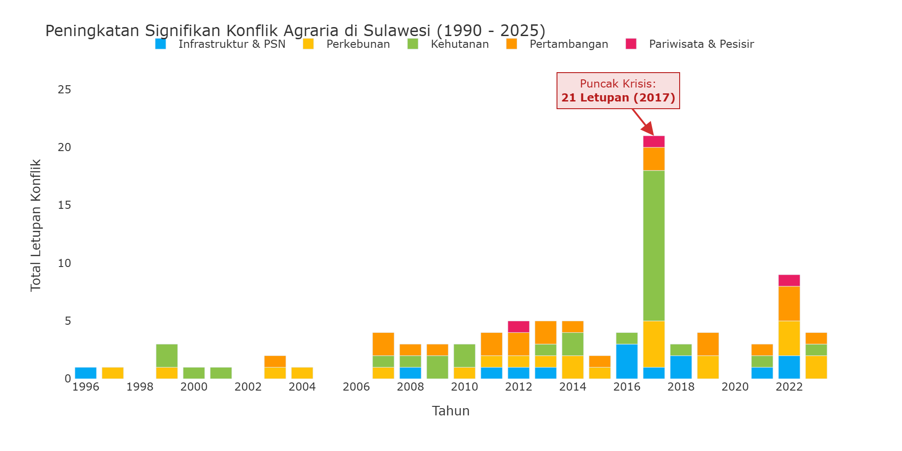
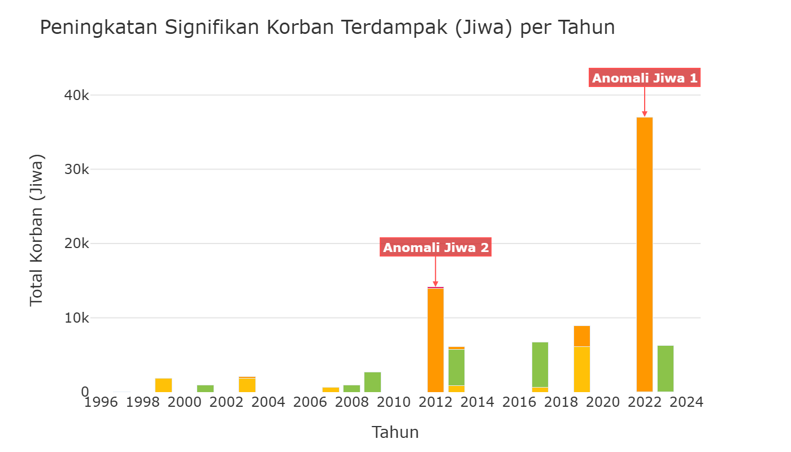
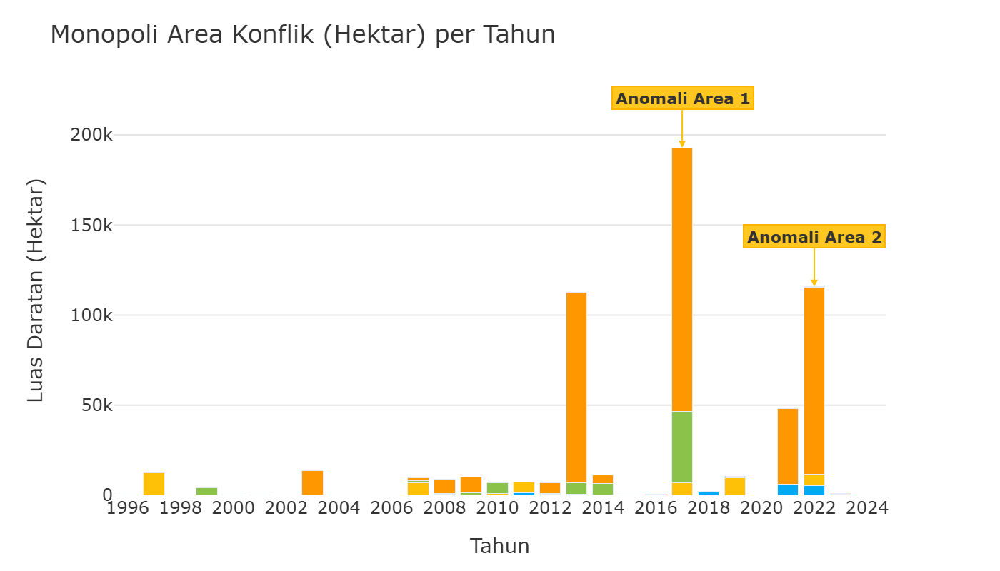
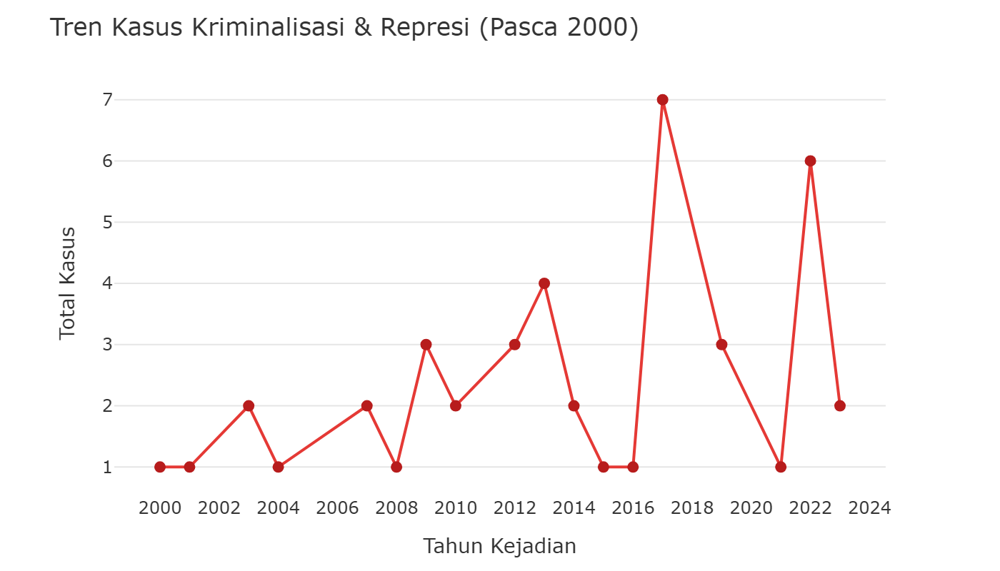
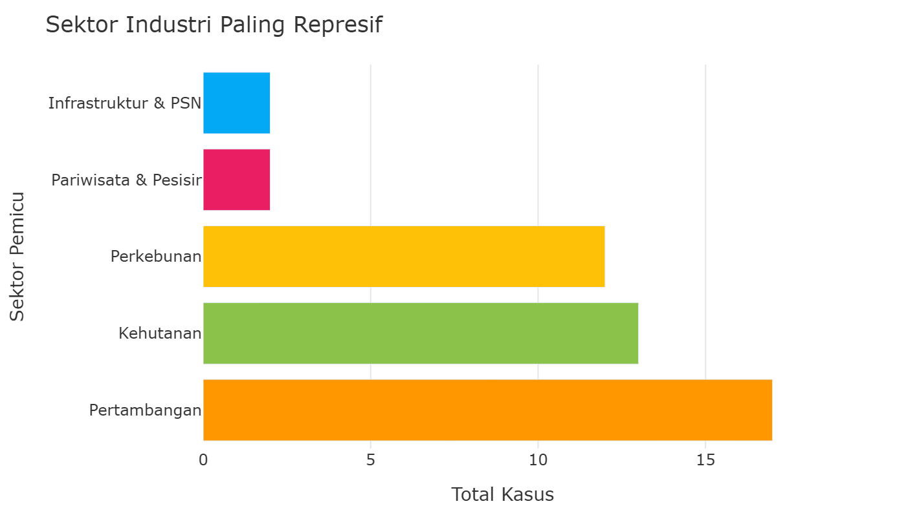
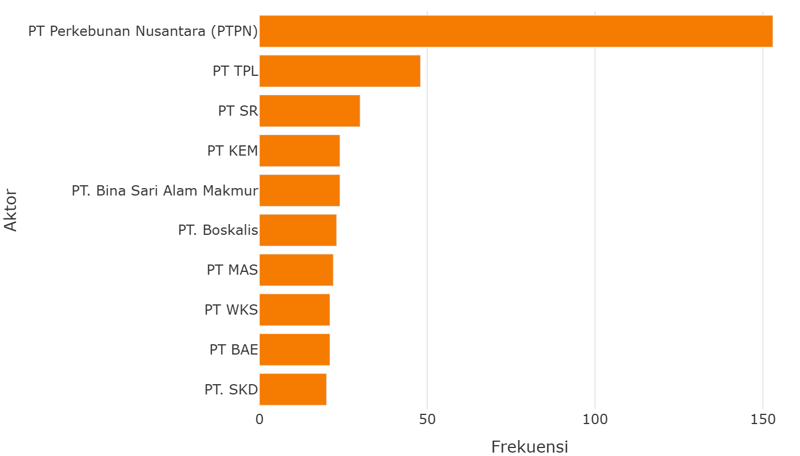
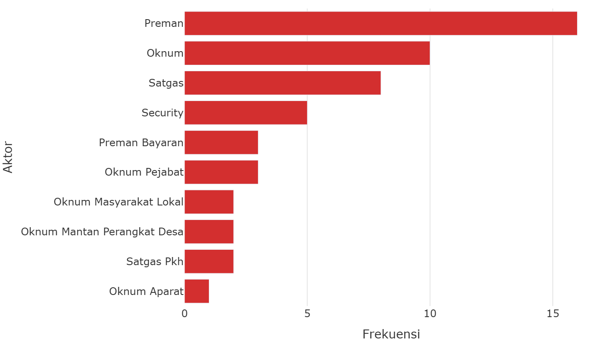

# Ruang Hidup yang Terampas

Analisis dinamika konflik sosial dan alokasi ruang agraria dalam konteks pembangunan kawasan.

---

Ekspansi industri ekstraktif dan proyek strategis berimplikasi pada dinamika sosial dan penggunaan lahan masyarakat. Data empiris mencatat akumulasi **95 kasus konflik agraria**. Konflik ini berkaitan erat dengan perubahan tata guna lahan dan alokasi ruang di berbagai daerah.

Aktor dan sektor pemicu konflik mencakup sektor **Kehutanan** (Hutan Lindung, Produksi, Konservasi), **Infrastruktur & PSN** (Bendungan, Transmigrasi, Kawasan Industri), hingga proyek **Pariwisata & Pesisir**. Tiga sektor utama (Perkebunan, Kehutanan, dan Pertambangan) menyumbang porsi **82.1%** dari keseluruhan catatan konflik.

---

### Ringkasan Metrik Agregat

| Indikator | Nilai | Keterangan |
|---|---|---|
| **Total Kasus Konflik** | **95 kasus** | Catatan insiden sengketa agraria dan tata guna lahan. |
| **Korban Terdampak (Jiwa)** | **90,582 jiwa** | Estimasi jumlah warga yang terdampak oleh konflik sengketa lahan. |
| **Status: Belum Ditangani** | **51 kasus** | Kasus sengketa yang masih dalam proses penanganan. |
| **Komunitas Terdampak** | **59 komunitas** | Kelompok tani dan komunitas lokal yang terlibat dalam sengketa. |
| **Sektor Perkebunan** | **25 kasus** | Sengketa tumpang tindih Hak Guna Usaha (HGU) perkebunan dengan lahan masyarakat. |
| **Sektor Kehutanan** | **30 kasus** | Sengketa batas kawasan hutan produksi dan konservasi dengan wilayah kelola lokal. |
| **Sektor Pertambangan** | **23 kasus** | Sengketa alokasi lahan untuk operasi pertambangan dan fasilitas hilirisasi. |
| **Infrastruktur & PSN** | **13 kasus** | Sengketa pengadaan tanah untuk Proyek Strategis Nasional. |
| **Pariwisata & Pesisir** | **3 kasus** | Sengketa pemanfaatan wilayah pesisir dan kawasan pariwisata. |
| **Keterlibatan Pemerintah** | **69 kasus** | Keterlibatan instansi pemerintah dalam fasilitasi atau sengketa lahan. |
| **Keterlibatan Korporasi** | **52 kasus** | Entitas BUMN atau swasta yang terlibat dalam sengketa lahan. |

*Sumber Analisis Data: Konsorsium Pembaruan Agraria (KPA) / Tanah Kita*

---

### 4.1 Tren Eskalasi Konflik Agraria Seiring Ekspansi Industri

Visualisasi *time-series* di bawah ini memberikan gambaran korelasi antara ekspansi industri dan dinamika konflik agraria di daratan Sulawesi. Secara historis, perbandingan dua periode waktu menunjukkan perbedaan tingkat insidensi konflik. Pada periode pra-2005, sistem pendataan mencatat **13 kasus** konflik agraria.

Pada periode pasca-2005 hingga saat ini, data mencatat **82 kasus** konflik lahan, yang mencerminkan peningkatan sebesar **630.8%** dibandingkan periode sebelumnya. Perubahan tren ini beriringan dengan penerbitan Izin Usaha Pertambangan (IUP) serta ekspansi Hak Guna Usaha (HGU) untuk perkebunan.

Penelusuran tren satu dekade terakhir menunjukkan bahwa sengketa agraria mencakup berbagai sektor, termasuk pertambangan nikel, infrastruktur, dan Proyek Strategis Nasional. Akumulasi **95 insiden historis** ini mengindikasikan perlunya tata kelola alokasi lahan dan perlindungan hak masyarakat lokal yang lebih seimbang di kawasan investasi.

> **Interpretasi Ekologis: Puncak Insidensi Konflik 2017**
>
> Grafik memperlihatkan peningkatan insidensi konflik yang memuncak pada **tahun 2017** dengan **75 kasus konflik**. Pembedahan data sektoral menunjukkan konsentrasi pada sektor **Kehutanan (40 kasus)** dan **Perkebunan (21 kasus)**, diikuti oleh **Pertambangan dan Infrastruktur PSN**. Periode ini bertepatan dengan percepatan pelepasan kawasan hutan dan Izin Pinjam Pakai Kawasan Hutan (IPPKH) untuk mendukung proyek strategis dan kawasan industri.

> **Interpretasi Ekologis dan Sosial:**
>
> Peningkatan insidensi konflik beririsan dengan dinamika perizinan kawasan. Pengelolaan alokasi ruang dan perlindungan hak masyarakat di wilayah investasi menjadi faktor penting untuk meminimalkan dampak sosial.

---

### 4.2 Sebaran Sektoral: Dampak Masyarakat dan Penggunaan Lahan

Visualisasi komparatif di bawah ini menggambarkan skala dampak sosial dan penggunaan lahan berdasarkan sektor industri. Data menunjukkan bahwa **Sektor Kehutanan** mencatatkan jumlah warga terdampak sebanyak **21,886 jiwa**, berkaitan dengan tumpang tindih kawasan hutan produksi, konservasi, dan Hutan Tanaman Industri (HTI) dengan wilayah kelola masyarakat lokal.

Menyusul berikutnya adalah **Sektor Pertambangan** dengan total korban terdampak sebanyak **54,658 jiwa**, yang beririsan dengan proyek hilirisasi nikel dan tambang terbuka di kawasan pesisir dan pertanian.

Dari dimensi penggunaan lahan (luasan hektar yang terlibat sengketa), **Sektor Perkebunan** mencatatkan luas sengketa terbesar yaitu **77,902 Hektar**, disusul oleh sektor Kehutanan seluas **66,193 Ha** dan Pertambangan seluas **441,286 Ha**. Data ini menunjukkan bahwa dinamika penguasaan lahan di tiga sektor tersebut berkorelasi dengan tingginya insidensi sengketa agraria di tingkat lokal.

> **Interpretasi Ekologis dan Sosial:**
>
> Dinamika Grafik mencerminkan akumulasi dampak sosial di wilayah industri yang memerlukan perhatian dalam pengelolaan sengketa lahan.

### Bedah Forensik Anomali (Spike) Konflik Agraria

Berdasarkan ekstraksi dataset secara mendalam, berikut adalah bedah anatomis dari lonjakan-lonjakan ekstrem (*spikes*) yang terjadi pada grafik **Peningkatan Signifikan Korban Terdampak (Jiwa)** dan **Monopoli Area Konflik (Hektar)** di wilayah ini.

#### ANOMALI JIWA 1: Lonjakan Korban Jiwa Tahun 2022
- **Kasus Utama Pendongkrak Statistik:** Konflik Koalisi Selamatkan Pulau Wawoni
- **Total Korban (Kasus Ini):** 37,000 Jiwa
- **Perusahaan Terlibat:** PT Gema Kreasi Perdana (GKP)
- **Narasi Singkat:** Keberadaan PT Gema Kreasi Perdana (GKP), anak perusahaan Harita Group, di Pulau Wawonii, Kabupaten Konawe Kepulauan, Sulawesi Tenggara mengancam keselamatan warga, menggusur lahan pertanian-perkebunan dan berpotensi mencemari laut. Keduanya merupakan sumber ekonomi utama dari lebih dari 37.000 jiwa warga di Pulau Wawonii. Tidak hanya mengancam keselamatan dan ruang hidup warga, aktivitas pertambangan yang dilakukan PT GKP adalah ilegal karena ban...
- **Sumber Referensi:** Laporan WALHI ([Telusuri Berita Kasus](https://www.google.com/search?q=Konflik%20Koalisi%20Selamatkan%20Pulau%20Wawoni%20PT%20Gema%20Kreasi%20Perdana%20%28GKP%29) | [Link Asli TanahKita](https://tanahkita.id/data/konflik/detil/SWpxcGxoUThtUVk))

#### ANOMALI JIWA 2: Lonjakan Korban Jiwa Tahun 2012
- **Kasus Utama Pendongkrak Statistik:** Konflik Masyarakat Tumpang Pitu dengan PT BSI
- **Total Korban (Kasus Ini):** 13,936 Jiwa
- **Perusahaan Terlibat:** PT Bumi Suksindo | PT. Merdeka Copper Gold
- **Narasi Singkat:** Gunung Tumpang Pitu yang masuk wilayah Desa Sumberagung, Kecamatan Pesanggaran, Kabupaten Banyuwangi, Jawa Timur, merupakan lokasi tambang emas dari PT Bumi Suksindo ( PT BSI) seluas 4.998 Ha, melalui Izin Usaha Pertambangan Operasi Produksi (IUP OP) berdasarkan Keputusan Bupati Banyuwangi No. 188/547/KEP/429.011/2012 tanggal 9 Juli 2012 sebagaimana terakhir kali diubah dengan Keputusan Bupati Banyuwangi, No. 188/928/KEP/429.011/2012 tertanggal 7...
- **Sumber Referensi:** Laporan WALHI JATIM, Front Nahdliyin Untuk Kedaulatan Sumber Daya Alam ([Telusuri Berita Kasus](https://www.google.com/search?q=Konflik%20Masyarakat%20Tumpang%20Pitu%20dengan%20PT%20BSI%20PT%20Bumi%20Suksindo%20%7C%20PT.%20Merdeka%20Copper%20Gold) | [Link Asli TanahKita](https://tanahkita.id/data/konflik/detil/WWg2QmItRXZ4SGs))

#### ANOMALI AREA 1: Monopoli Area Konflik Tahun 2017
- **Kasus Utama Pendongkrak Statistik:** Konflik Nelayan Desa Boddia dengan Pertambangan Pasir Laut PT. Boskalis dan PT. Jan De Nul
- **Total Daratan Dirampas (Kasus Ini):** 146,201 Hektar
- **Perusahaan Terlibat:** PT. Boskalis | PT. Jan De Nul
- **Narasi Singkat:** Pertambangan pasir laut yang dilakukan oleh PT. Boskalis dan PT. Jan De Null menjadi dasar dari munculnya konflik yang ada di Desa Boddia, Khususnya di Dusun Boddia dan Manjalling. Pertambangan pasir laut ini merupakan bagian dari proyek reklamasi yang telah disepakati oleh Gubernur dan DPRD Provinsi Sulawesi Selatan di dalam Ranperda RZWP3K Sulsel. Kebutuhan reklamasi ini menciptakan beberapa daerah yang dialokasikan menjadi zona tambang pasir l...
- **Sumber Referensi:** Laporan WALHI Sulawesi Selatan ([Telusuri Berita Kasus](https://www.google.com/search?q=Konflik%20Nelayan%20Desa%20Boddia%20dengan%20Pertambangan%20Pasir%20Laut%20PT.%20Boskalis%20dan%20PT.%20Jan%20De%20Nul%20PT.%20Boskalis%20%7C%20PT.%20Jan%20De%20Nul) | [Link Asli TanahKita](https://tanahkita.id/data/konflik/detil/dXpRbGVnRTJHS2c))

#### ANOMALI AREA 2: Monopoli Area Konflik Tahun 2022
- **Kasus Utama Pendongkrak Statistik:** Konflik Koalisi Selamatkan Pulau Wawoni
- **Total Daratan Dirampas (Kasus Ini):** 86,758 Hektar
- **Perusahaan Terlibat:** PT Gema Kreasi Perdana (GKP)
- **Narasi Singkat:** Keberadaan PT Gema Kreasi Perdana (GKP), anak perusahaan Harita Group, di Pulau Wawonii, Kabupaten Konawe Kepulauan, Sulawesi Tenggara mengancam keselamatan warga, menggusur lahan pertanian-perkebunan dan berpotensi mencemari laut. Keduanya merupakan sumber ekonomi utama dari lebih dari 37.000 jiwa warga di Pulau Wawonii. Tidak hanya mengancam keselamatan dan ruang hidup warga, aktivitas pertambangan yang dilakukan PT GKP adalah ilegal karena ban...
- **Sumber Referensi:** Laporan WALHI ([Telusuri Berita Kasus](https://www.google.com/search?q=Konflik%20Koalisi%20Selamatkan%20Pulau%20Wawoni%20PT%20Gema%20Kreasi%20Perdana%20%28GKP%29) | [Link Asli TanahKita](https://tanahkita.id/data/konflik/detil/SWpxcGxoUThtUVk))

---

### 4.3 Indikasi Represi dan Kriminalisasi dalam Konflik Agraria

Data kuantitatif di wilayah Sulawesi mencatat indikasi terjadinya represi dan tindakan kriminalisasi dalam sebagian sengketa agraria. Dari database yang didokumentasikan, terdapat **46 kasus indikasi kriminalisasi** dan **93 warga/aktivis lingkungan yang tercatat pernah ditangkap** dalam penanganan sengketa lahan.

Berdasarkan distribusi sektoral, **Sektor Pertambangan** mencatatkan frekuensi indikasi represi tertinggi dengan **17 kasus**. Tahun dengan jumlah catatan insiden represi tertinggi adalah **2017** dengan **7 kasus**.

Catatan ini menunjukkan pentingnya pendekatan hukum yang adil, penyelesaian konflik secara ramah HAM, serta jaminan perlindungan bagi pejuang lingkungan dan komunitas lokal sesuai dengan peraturan perundang-undangan.

| Kasus Indikasi Kriminalisasi | Warga/Aktivis Ditangkap | Korban Luka-luka | Korban Tewas |
|---|---|---|---|
| **46 Kasus** | **93 Orang** | **4 Orang** | **1 Orang** |

> **Interpretasi Ekologis & Hak Asasi Manusia:** Keberadaan kasus kriminalisasi di sekitar area konsesi (terutama Pertambangan) mengindikasikan pentingnya jaminan perlindungan ruang sipil dan penghormatan HAM dalam setiap proses pembangunan.

---

### 4.4 Pembuktian Statistik: Ekspansi vs Eskalasi Konflik

Hipotesis utama dalam evaluasi ini adalah bahwa **industrialisasi dan ekspansi korporasi** berbanding lurus dengan **eskalasi konflik dan represi** terhadap masyarakat. 
Untuk mengujinya secara statistik sesuai pedoman D3TLH, analisis dibagi menjadi dua bagian: (1) Komparasi metrik Before-After, dan (2) Uji signifikansi Crosstab Chi-Square. Unit observasinya adalah catatan kejadian letupan konflik historis.

#### A. Analisis Komparatif Before-After (Pra vs Era Hilirisasi)

Perbandingan absolut eskalasi konflik agraria sebelum dan sesudah rezim hilirisasi masif dimulai (cut-off tahun 2014).

| Periode | Rata-rata Konflik | Total Letupan | Warga Ditangkap | Korban Tewas |
|---|---|---|---|---|
| **Pra-Ekspansi (1990 - 2013)** | **2.1 Kasus/Tahun** | 37 kejadian | 83 jiwa | 0 jiwa |
| **Pasca-Ekspansi (2014 - 2024)** | **5.5 Kasus/Tahun** | 55 kejadian | 10 jiwa | 1 jiwa |

#### B. Uji Statistik Crosstab (Chi-Square)

**Variabel Independen (X):** Periode Ekspansi Industri

**Variabel Dependen (Y):** Tingkat Represi & Kriminalisasi

#### Case Processing Summary

| | Valid N | Valid % | Missing N | Missing % | Total N | Total % |
|---|---|---|---|---|---|---|
| Periode Ekspansi Industri * Tingkat Represi & Kriminalisasi | 523 | 100.0% | 0 | 0.0% | 523 | 100.0% |

#### Periode Ekspansi Industri * Tingkat Represi & Kriminalisasi Crosstabulation

| | Baseline (Tanpa Kriminalisasi) | Ada Represi/Kriminalisasi | Total |
|---|---|---|---|
| **Pra-ekspansi (< 2014)** Count | 179 | 73 | 252 |
| **Pra-ekspansi (< 2014)** Expected | 157.6 | 94.4 | 252.0 |
| **Pasca-ekspansi (≥ 2014)** Count | 148 | 123 | 271 |
| **Pasca-ekspansi (≥ 2014)** Expected | 169.4 | 101.6 | 271.0 |
| **Total** Count | 327 | 196 | 523 |
| **Total** Expected | 327.0 | 196.0 | 523.0 |

#### Chi-Square Tests

**Periode Ekspansi Industri * Tingkat Represi & Kriminalisasi**

| | Value | df | Asymp. Sig. (2-sided) |
|---|---|---|---|
| Pearson Chi-Square | 14.331 | 1 | 0.000 |
| Likelihood Ratio | 14.447 | 1 | 0.000 |
| Linear-by-Linear Association | 14.995 | 1 | 0.000 |
| N of Valid Cases | 523 | | |

### Ringkasan Uji Hipotesis

**Result: SIGNIFIKAN**

| Parameter | Nilai |
|---|---|
| P-Value | 0.0002 |
| Chi-Square | 14.331 |
| df | 1 |
| **Odds Ratio (Risk Estimate)** | **2.038** |

> **Interpretasi Sosial Kritis:** Temuan ini sangat krusial: pergeseran status **Periode Ekspansi Industri** terbukti **berkorelasi kuat dan signifikan** dengan **Tingkat Represi & Kriminalisasi** (P < 0.05). Angka Odds Ratio (OR: 2.038) menjadi konfirmasi empiris bahwa narasi hilirisasi dan investasi bukanlah agenda nirkekerasan—ekspansi spasial mereka mutlak mengeskalasi pelanggaran hak asasi masyarakat tapak.

---

### Ringkasan Eksekutif Seluruh Skenario Crosstab

Tabel di bawah ini merangkum hasil pengujian statistik (Chi-Square) untuk semua kemungkinan kombinasi antara indikator Ekspansi (X) dan Eskalasi Konflik (Y) pada panel data yang sama.

| Variabel Independen (X) | Variabel Dependen (Y) | Chi-Square | P-Value | Odds Ratio | Kesimpulan |
|---|---|---|---|---|---|
| Periode Ekspansi Industri | Tingkat Represi & Kriminalisasi | 14.331 | 0.000 | 2.04 | 🟢 SIGNIFIKAN |
| Periode Ekspansi Industri | Tingkat Penelantaran Kasus | 3.283 | 0.070 | 1.40 | 🔴 TIDAK SIGNIFIKAN |
| Periode Ekspansi Industri | Tingkat Insiden Fisik (Luka/Tewas/Ditangkap) | 2.636 | 0.104 | 0.53 | 🔴 TIDAK SIGNIFIKAN |
| Tipe Sektor (Tambang vs Non-Tambang) | Tingkat Represi & Kriminalisasi | 13.609 | 0.000 | 2.84 | 🟢 SIGNIFIKAN |
| Tipe Sektor (Tambang vs Non-Tambang) | Tingkat Penelantaran Kasus | 4.742 | 0.029 | 1.89 | 🟢 SIGNIFIKAN |
| Tipe Sektor (Tambang vs Non-Tambang) | Tingkat Insiden Fisik (Luka/Tewas/Ditangkap) | 0.665 | 0.415 | 1.66 | 🔴 TIDAK SIGNIFIKAN |
| Keterlibatan Aparat/Pemerintah | Tingkat Represi & Kriminalisasi | 55.633 | 0.000 | 4.80 | 🟢 SIGNIFIKAN |
| Keterlibatan Aparat/Pemerintah | Tingkat Penelantaran Kasus | 1.135 | 0.287 | 0.81 | 🔴 TIDAK SIGNIFIKAN |
| Keterlibatan Aparat/Pemerintah | Tingkat Insiden Fisik (Luka/Tewas/Ditangkap) | 3.253 | 0.071 | 2.23 | 🔴 TIDAK SIGNIFIKAN |

> **Pembedahan Realitas Kemanusiaan:**
>
> Dari **9 skenario pengujian**, terdapat **4 skenario yang terbukti SIGNIFIKAN**.

Angka-angka pada tabel di atas bukan sekadar statistik di atas kertas, melainkan **bukti empiris** dari brutalitas pembangunan. Tingginya angka kemunculan represi pada skenario yang signifikan menegaskan bahwa setiap kali wilayah operasi investasi diperlebar, probabilitas dihadapkannya moncong senjata kepada warga melonjak drastis.

Skenario yang *TIDAK SIGNIFIKAN* tidak berarti rezim terbebas dari dosa kekerasan, melainkan bukti bahwa represi terhadap warga yang mempertahankan tanahnya telah menjadi kultur mapan yang menyebar secara sporadis melampaui sekat waktu dan korporasi.

---

### 4.5 Peta Entitas Aktor: Korporasi dan Organisasi Masyarakat

Analisis entitas aktor berbasis pemrosesan teks (*string parsing*) terhadap catatan kronologi dokumentasi TanahKita memetakan keterlibatan berbagai pihak dalam sengketa agraria. Hasil ekstraksi teks mengidentifikasi entitas korporasi, lembaga pemerintah, serta organisasi masyarakat sipil yang tercatat dalam dokumentasi kasus. Grafik frekuensi di bawah menampilkan entitas korporasi dan kelompok masyarakat yang paling sering teridentifikasi dalam catatan sengketa lahan.

#### Top 10 Entitas Korporasi Paling Dominan

> **Analisis Data Korporasi:** Ekstraksi teks mencatat frekuensi penyebutan entitas **PT Perkebunan Nusantara (PTPN)** dalam **153 catatan kasus terpisah**.

#### Top Aktor Proksi & Vigilante Terdeteksi

> **Analisis Kritis Proksi/Vigilante:** Kemunculan kelompok sipil seperti **Preman** (terdeteksi hingga **16 kali**) menangkap besarnya skala orkestrasi horizontal. Korporasi seringkali menggunakan jasa pengamanan swakarsa, kelompok preman, hingga ormas vigilante sebagai "bemper proksi" untuk mengintimidasi warga lokal dan memecah belah solidaritas akar rumput.

*\* Grafik di atas hanya menampilkan Top 10 entitas. Untuk melihat daftar lengkap dan detail seluruh aktor yang terdeteksi, silakan buka tabel data.*
