# Bab 6: Audit Forensik Metodologi D3TLH

**CELIOS — Center of Economic and Law Studies**

*Fase 1: Evaluasi Kebijakan Ekstraktif - Pembuktian Terbalik*

---

> **Kesimpulan Eksekutif**
>
> D3TLH dan AMDAL telah gagal dan mati sebagai alat pelindung nyawa ruang hidup. Dokumen-dokumen perizinan tersebut telah mereduksi penderitaan manusia menjadi sekadar angka-angka spasial di atas kertas, berfungsi tak lebih dari "stempel birokrasi" untuk melegalkan pengrusakan ekologis secara sistematis.

---

## Ringkasan Audit Kritis D3TLH

| Dimensi Audit | Skor Kerusakan | Status Vonis | Indikator Utama |
|---|---|---|---|
| **Daya Tampung Udara** | **9.1 / 10** | **DAYA TAMPUNG MELAMPAUI** | Kegagalan Deteksi Morbiditas Akumulatif *(Kapasitas PLTU: 9,825 MW / NO2 NASA: 5.76e-06 / Rasio ISPA: 2.0x)* |
| **Daya Tampung Air** | **7.4 / 10** | **DAYA TAMPUNG MELAMPAUI** | Kegagalan Pengukuran Toksisitas *(IKA Sulteng: 62.1 / Kasus Diare: 814,407 / Konflik Air: 82)* |
| **Daya Dukung Lahan** | **10.0 / 10** | **KRISIS RUANG DARAT** | Kegagalan Mengukur Efek Domino Lanskap *(Bencana: 1,557 Kejadian / Deforestasi: 1,148,635 Ha)* |
| **Daya Dukung Sosial** | **8.7 / 10** | **DARURAT AGRARIA** | Ilusi Jasa Budaya & Kedaulatan Ruang *(Konflik Lahan: 565 Kasus TanahKita)* |
| **Veto Kebijakan** | **10.0 / 10** | **REGULATORY CAPTURE** | Kegagalan Tata Kelola Negara *(574 Izin Baru & 12.2 GW PLTU Captive Diloloskan)* |

---

## 1. Filosofi Audit Forensik (Sistem Alarm Rakyat)

AMDAL dan D3TLH pemerintah mengklaim bersifat "prediktif"—menilai batasan daya dukung alam *sebelum* izin diberikan. Namun, data lapangan membuktikan bahwa dokumen-dokumen tersebut secara sistematis cacat dan gagal melindungi ruang hidup masyarakat.

**Standpoint Riset ECC:**
Kita melakukan **Pembuktian Terbalik**. Kita tidak perlu berdebat soal rumus "daya dukung spasial" milik konsultan korporasi. Fakta empiris bahwa **kasus ISPA meroket, banjir bandang rutin terjadi, konflik berdarah bereskalasi, dan izin terus diobral secara anomali** adalah **Bukti Mutlak (Definitive Proof)** bahwa daya dukung ekologis dan sosial wilayah tersebut **SUDAH MELAMPAUI**.

Halaman ini merangkum semua indikator krisis menjadi sebuah palu godam untuk memvonis bahwa sistem AMDAL/D3TLH saat ini sekadar "stempel birokrasi" yang buta terhadap penderitaan manusia.

---

## 2. Fakta: Metodologi Resmi D3TLH Pemerintah (Jasa Ekosistem)

Berdasarkan dokumen pedoman teknis D3TLH (seperti Permen LH 17/2009 dan panduan KLHK), pemerintah saat ini menyusun D3TLH dengan pendekatan murni spasial/bio-fisik yang disebut **Jasa Ekosistem (Ecosystem Services)**.

Indikator resmi yang digunakan dibagi menjadi 4 kategori:
*   **Jasa Penyediaan (Provisioning):** Kapasitas lahan menyediakan pangan, air bersih, dll.
*   **Jasa Pengaturan (Regulating):** Kapasitas tata air, mitigasi iklim, mitigasi banjir, pemurnian udara.
*   **Jasa Pendukung (Supporting):** Siklus hara, pembentukan tanah.
*   **Jasa Budaya (Cultural):** Estetika alam, rekreasi.

### Letak Cacat Metodologi (Blind Spots):

Rumus utama yang dipakai pemerintah untuk menghitung indeks di atas hanyalah: **Peta Ekoregion + Peta Tutupan Lahan (Land Cover)**.

*   **Abaikan Nyawa & Morbiditas:** Menghitung kapasitas udara dari peta vegetasi, namun **TIDAK PERNAH** menghitung rekam medis warga (ISPA) yang paru-parunya rusak akibat debu smelter.
*   **Abaikan Kedaulatan Ruang:** Mengukur kapasitas pertanian, tapi abai terhadap perampasan lahan yang memicu konflik sosial berdarah.
*   **Bukan Veto Kebijakan:** Saat D3TLH menyatakan daya dukung turun, instrumen ini tidak dipakai untuk "menyetop" penerbitan IUP (Izin Usaha Pertambangan) baru.

---

## 3. Matriks Pembuktian Terbalik: D3TLH vs Fakta Lapangan

Di sinilah seluruh temuan riset kita diintegrasikan untuk "menelanjangi" cacat bawaan D3TLH. Di bawah ini adalah benturan langsung antara **Mitos (Klaim Dokumen Resmi)** versus **Realitas Lapangan (Bukti Forensik)**.

---

### A. Audit D3TLH: Daya Tampung Udara

> **Klaim Mitos:** "Daya tampung udara (berdasarkan peta tutupan lahan) diklaim masih luas dan mampu menyerap emisi."
>
> **Fakta Forensik ECC:** Lonjakan drastis persentase Kasus ISPA dan penyakit saluran pernapasan di lingkar tambang.
> **Akumulasi Skor Kerusakan:** **9.1 / 10** — *STATUS: DAYA TAMPUNG MELAMPAUI*
> **VONIS:** Kegagalan Deteksi Morbiditas Akumulatif

#### 1. Korelasi PLTU & Kualitas Udara
Pemerintah sebelumnya mengklaim IKU 'Masih Aman'. Namun pantauan independen Satelit TROPOMI NASA mengungkap realitas lain: konsentrasi gas beracun NO2 meledak meroket sejajar dengan ekspansi PLTU captive. **Threshold Kritis NASA: NO2 > 6.0e-6 mol/m²**.

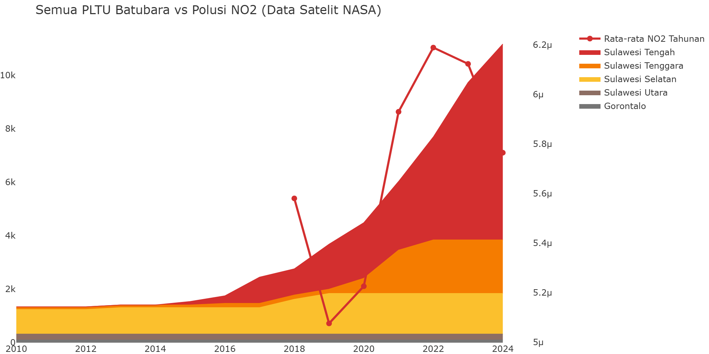

#### 2. Dampak Kasus ISPA/Pneumonia
Dokumen daya dukung mengabaikan lonjakan tajam pasien ISPA di RSUD Morowali dan Kendari. Grafik membuktikan bahwa tren ISPA di provinsi non-tambang relatif stabil, namun meroket secara paralel dengan asap di provinsi sentra nikel.

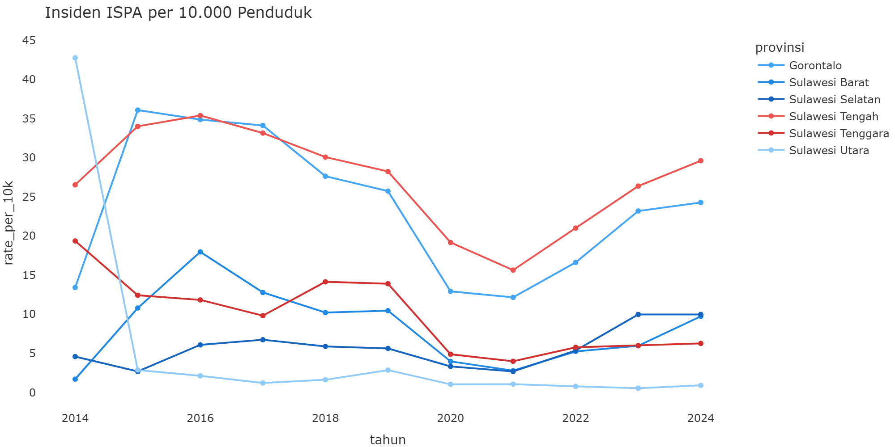

#### 3. Fakta Beban Limbah & Emisi
Data perizinan D3TLH fokus pada syarat emisi cerobong di atas kertas, tetapi mengabaikan gunung-gunung debu slag (fly ash) di darat yang bebas tertiup angin memapari puluhan desa setiap harinya. **Threshold Kritis: 30 Juta Ton/Tahun** = 7% dari total neraca B3 nasional 427 juta ton dari 1 provinsi (anomali 2,4x proporsional).

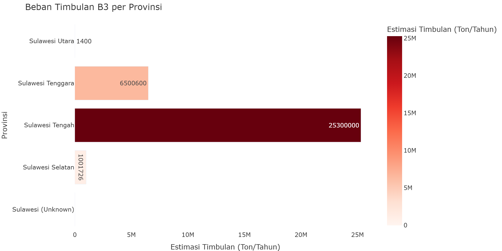

#### 4. Hilangnya Paru-Paru Udara (Emisi CO2)
Audit resmi pemerintah hanya menghitung 'emisi yang keluar dari corong pabrik', tetapi dengan sengaja mengaburkan 'emisi dari jutaan pohon yang mati' akibat ekspansi lahan tambang itu sendiri. **Threshold Kritis: 150 Juta Ton CO2e** = melampaui target NDC FOLU Net Sink 2030 (-140 juta ton CO2e).

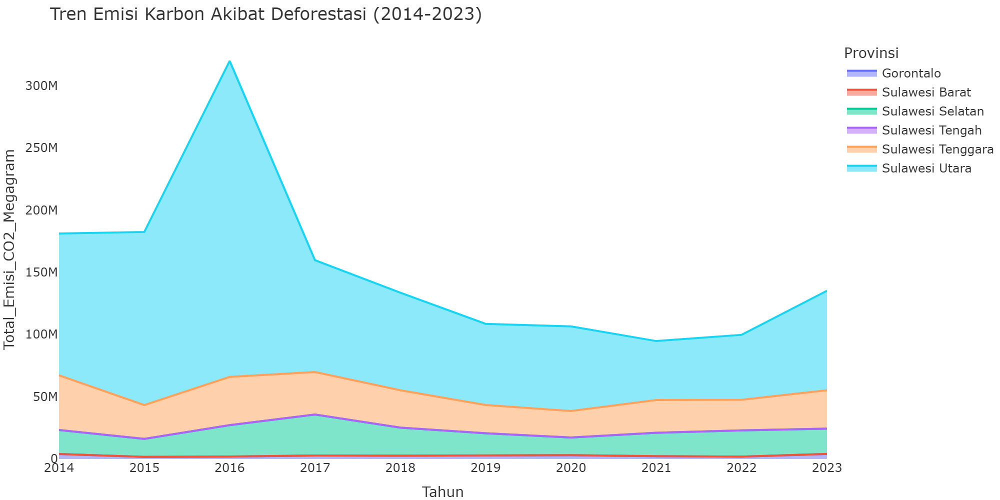

---

### B. Audit D3TLH: Daya Tampung Air

> **Klaim Mitos:** "Pembuangan tailing diizinkan selama beban cemaran sungai/laut masih secara teori mampu mengencerkan."
>
> **Fakta Forensik ECC:** Penurunan drastis Indeks Kualitas Air dan hancurnya pesisir ditandai ledakan morbiditas air.
> **Akumulasi Skor Kerusakan:** **7.4 / 10** — *STATUS: DAYA TAMPUNG MELAMPAUI*
> **VONIS:** Kegagalan Pengukuran Toksisitas

#### 1. Kualitas Air (IKA)
Klaim sungai/laut mampu mengencerkan limbah berbanding terbalik dengan hancurnya Indeks Kualitas Air BPS hingga menyentuh batas cemar kotor.

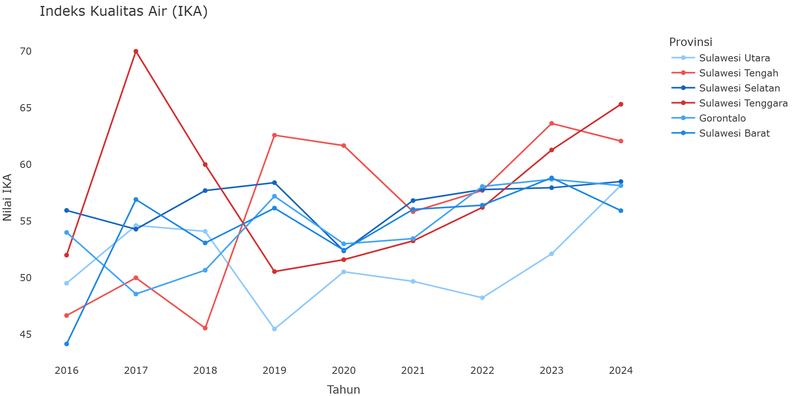

#### 2. Morbiditas Diare
AMDAL gagal menghitung dampak kontaminasi logam berat ke air tanah yang dikonsumsi warga, dibuktikan dengan ledakan pasien Diare di lingkar tambang. **Threshold Kritis: Incidence Rate Ratio (IRR) > 2.0**.

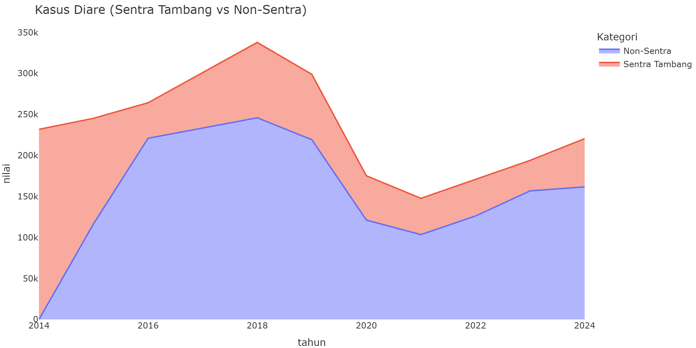

#### 3. Konflik Nelayan & Pesisir
Ekosistem tangkap nelayan dihancurkan oleh limbah tailing dan privatisasi pesisir untuk Smelter, memicu lonjakan konflik agraria laut.

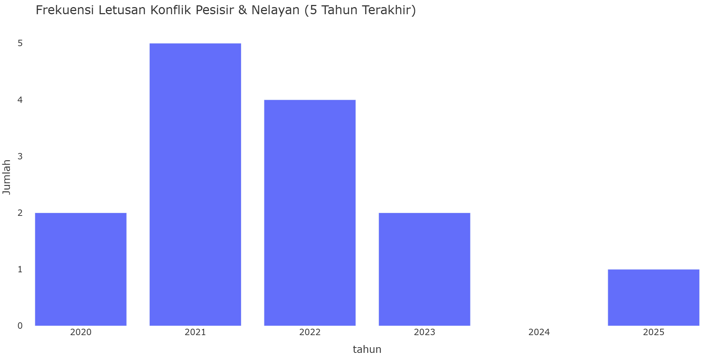

#### 4. Beban Tailing (Treemap B3)
Resiko kebocoran Tailings Dam (Bendungan Tailing) atau Deep Sea Tailing Placement (DSTP) yang ditutupi oleh klaim 'mitigasi teknologi'. **Threshold Kritis: 25 Juta Ton/Tahun**.

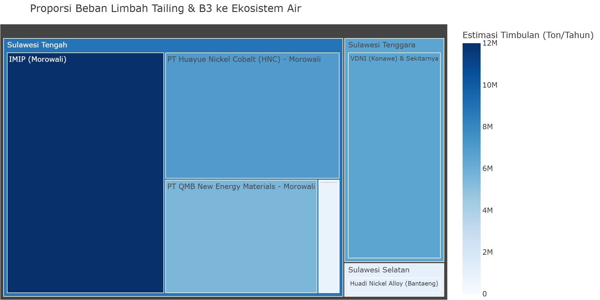

---

### C. Audit D3TLH: Daya Dukung Lahan

> **Klaim Mitos:** "Daya dukung lahan dan tata air tanah dinilai aman secara matematis karena rasio ekoregion hutan dianggap masih mencukupi."
>
> **Fakta Forensik ECC:** Hancurnya sabuk hijau alam memicu rentetan bencana hidrometeorologi parah di lingkar tambang, menabrak batas fungsi kawasan lindung.
> **Skor Kerusakan Lahan:** **10.0 / 10** — *STATUS: KRISIS RUANG DARAT*
> **VONIS:** Kegagalan Menjaga Fungsi Lanskap

#### 1. Bencana Banjir & Longsor (BNPB)
Data BNPB membuktikan bahwa klaim 'mitigasi bencana' dalam AMDAL sama sekali tidak terbukti di lapangan.

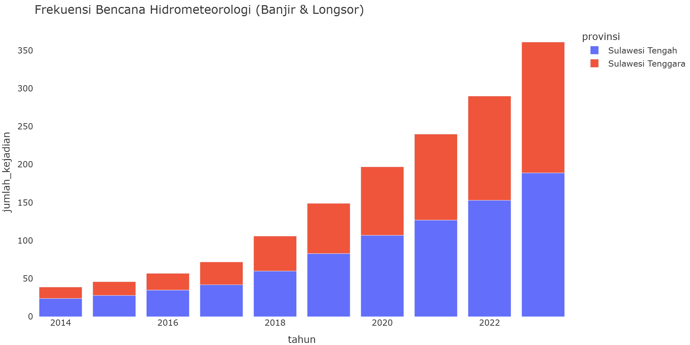

#### 2. Deforestasi Primer (GFW)
Hutan primer yang berfungsi sebagai jasa penyediaan air dan penyerap karbon ditebang habis atas nama IUP.

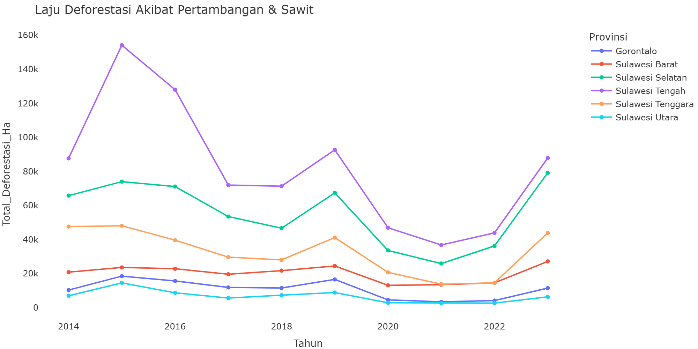

#### 3. Pelanggaran Kawasan Lindung
Temuan **paling mematikan**: Data GFW membuktikan bahwa **100% dari setiap Ha deforestasi** yang terjadi di Sulteng dan Sultra selama 10 tahun (2014–2023) terjadi di dalam **Kawasan Lindung / Protected Areas (IUCN)**. Tidak ada satu pun hektar yang dibabat di luar batas kawasan yang seharusnya tidak boleh disentuh.

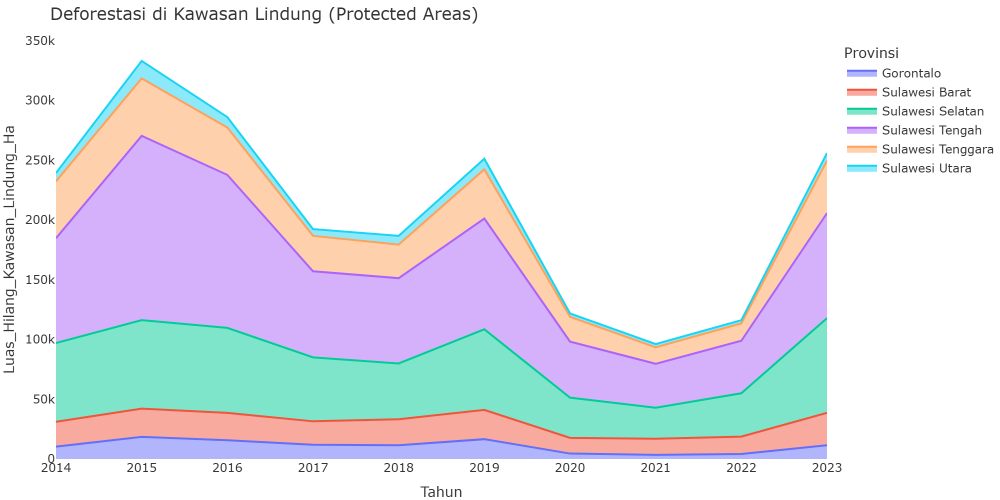

#### 4. Aktor Deforestasi
Data atribusi GFW mematahkan alibi 'ladang berpindah'. Pertambangan dan Sawit adalah aktor dominan penghancur hutan.

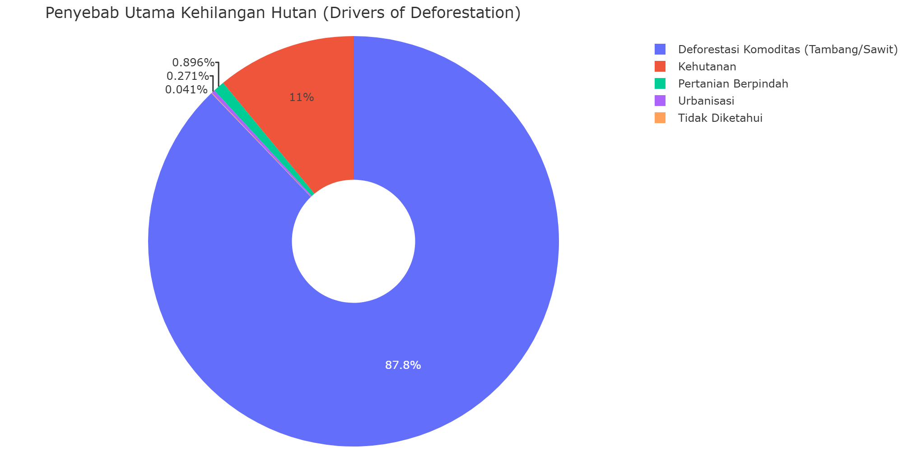

---

### D. Audit D3TLH: Daya Dukung Sosial

> **Klaim Mitos:** "Status kawasan dialokasikan untuk peruntukan tambang dengan klaim bahwa masyarakat telah memberikan persetujuan (FPIC) dalam sosialisasi amdal."
>
> **Fakta Forensik ECC:** Alur penindasan terbukti jelas: Persetujuan dimanipulasi, ruang hidup jutaan hektar dirampas, dan penolakan dibungkam dengan bui.
> **Skor Kerusakan Sosial:** **8.7 / 10** — *STATUS: KRISIS KEMANUSIAAN*
> **VONIS:** Ilusi Kedaulatan Ruang Warga

#### 1. Manipulasi Persetujuan FPIC
'Persetujuan Warga' hanyalah stempel karet. Data investigasi Konsorsium Pembaruan Agraria membuktikan perusahaan memanipulasi persetujuan (FPIC) sejak fase sosialisasi AMDAL.

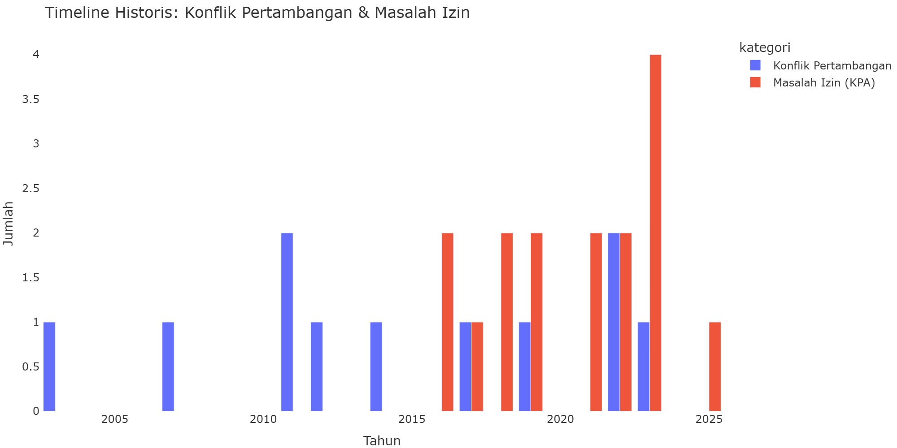

#### 2. Perampasan Ruang Hidup
Setelah izin keluar lewat manipulasi, perampasan paksa terjadi. Ruang hidup warga menyusut drastis, memicu letusan konflik yang berdampak pada ratusan ribu korban jiwa.

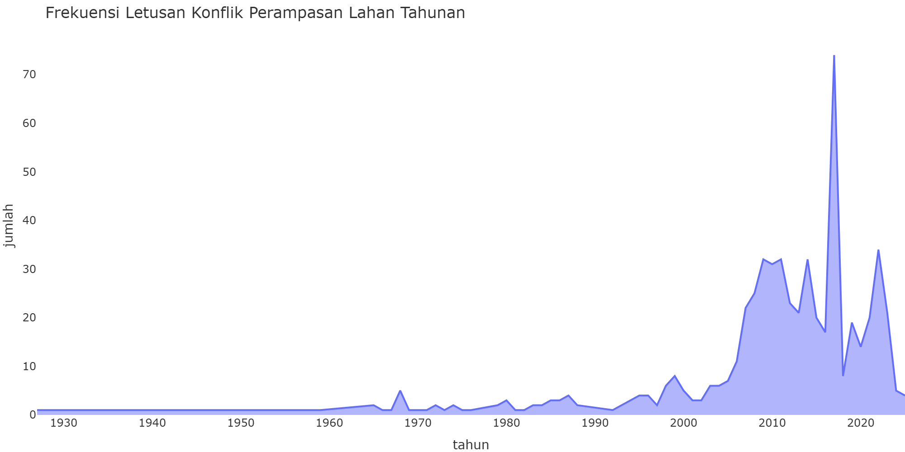

#### 3. Kriminalisasi Warga
Di fase akhir, ketika warga melakukan penolakan yang sah atas perampasan, negara tidak hadir melindungi, melainkan mengirim aparat untuk memenjarakan mereka.

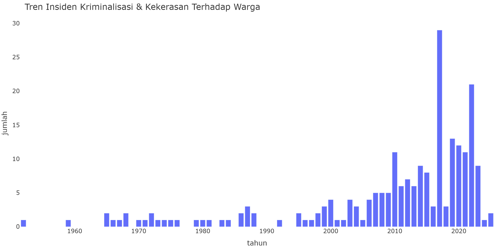

#### 4. Defisit Layanan Dasar (Faskes)
Di tengah ekspor nikel sentra Sulawesi yang meledak ratusan kali lipat, kualitas layanan dasar hancur. Mayoritas Puskesmas gagal memenuhi standar minimal **Sarana, Prasarana, dan Alat Kesehatan (SPA)**. Klaim AMDAL tentang 'peningkatan kesejahteraan' adalah fiksi belaka.

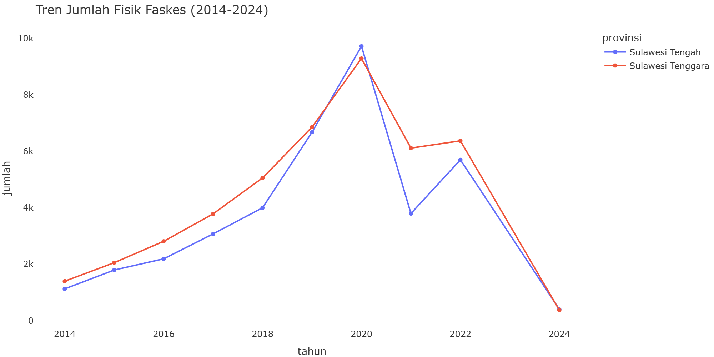

---

### E. Audit D3TLH: Veto Kebijakan

> **Klaim Mitos:** "Penyusunan D3TLH adalah dokumen sakti (veto) yang dapat membatasi izin eksploitasi jika daya dukung lingkungan telah terlampaui."
>
> **Fakta Forensik ECC:** Negara mengalami kelumpuhan tata kelola (Regulatory Capture). Izin diobral massal, perusahaan ilegal dibiarkan, dan infrastruktur energi kotor diloloskan di episentrum krisis.
> **Skor Kegagalan Tata Kelola:** **10.0 / 10** — *STATUS: REGULATORY CAPTURE*
> **VONIS:** Kegagalan Supremasi Hukum

#### 1. Obral Konsesi Legal
Di tengah memuncaknya status krisis daya dukung lingkungan, pemerintah secara paradoks justru menerbitkan ratusan izin eksploitasi tambang (IUP) baru. Dokumen veto tidak berfungsi.

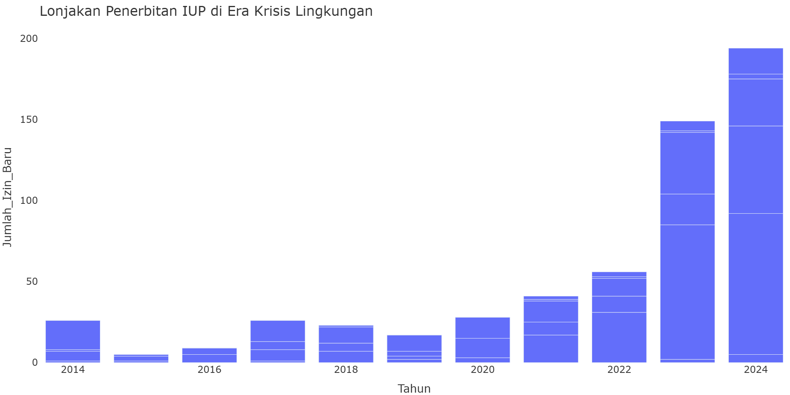

#### 2. Pembiaran Pelanggaran Korporat
Bukti mutlak 'Regulatory Capture'—bahkan ketika perusahaan beroperasi ilegal, menabrak izin, tumpang tindih, atau HGU kedaluwarsa, negara tidak berani melakukan penegakan hukum dan membiarkannya.

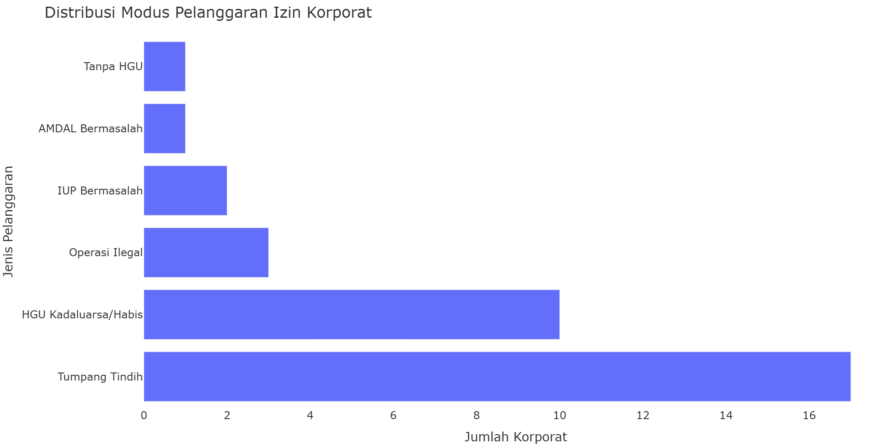

#### 3. Karpet Merah Energi Kotor (PLTU Captive)
Inkonsistensi paling telanjang terhadap komitmen iklim. Di wilayah ekoregion krisis, pemerintah memberikan karpet merah pembangunan infrastruktur penyumbang emisi terbesar (PLTU Batubara Captive) khusus untuk menyuplai kawasan smelter nikel.

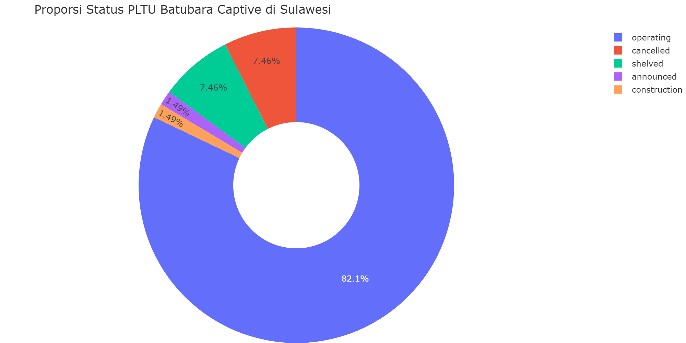
