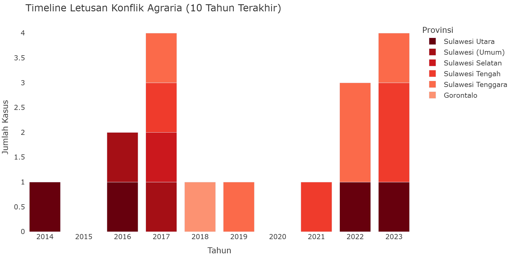
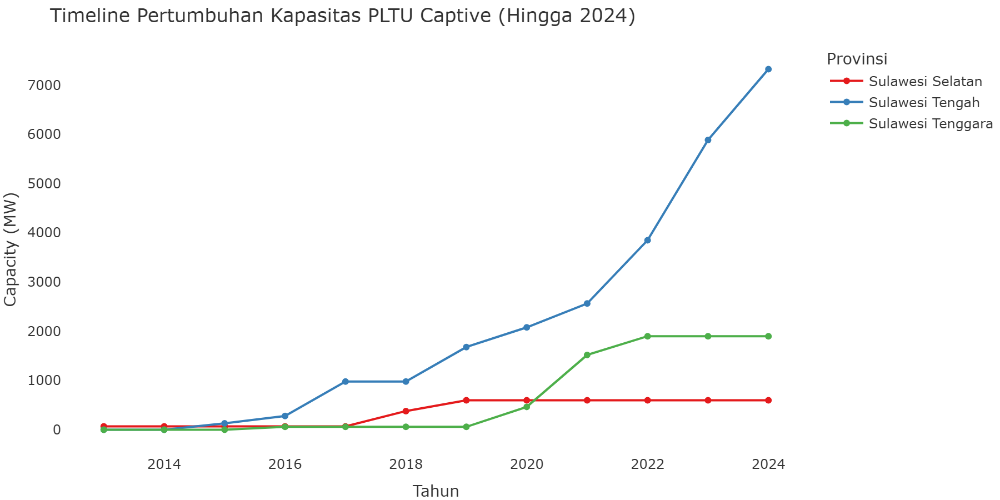

# Bab 7: Kegagalan Tata Kelola: D3TLH Dalam Sistem Perizinan

**CELIOS — Center of Economic and Law Studies**

*Evaluasi instrumen perlindungan ekologis dan implementasinya dalam sistem perizinan.*

---

## Ringkasan Tata Kelola
| Indikator | Kondisi Aktual | Deskripsi |
|---|---|---|
| **Fungsi Pembatas Daya Dukung** | **Penerbitan Izin Lanjut** | Data menunjukkan perlunya penguatan fungsi D3TLH sebagai instrumen pengaman. Penerbitan izin baru masih berlangsung di kawasan yang tercatat mengalami tekanan lingkungan tinggi. |
| **Pengawasan & Penegakan Hukum** | **Tantangan Sanksi** | Evaluasi menunjukkan tantangan dalam penegakan sanksi administratif dan pengawasan perizinan bagi entitas yang beroperasi tidak sesuai ketentuan. |

---

## Metodologi Pendekatan & Pertanyaan Kritis

**Membaca Hubungan Antara Hasil D3TLH dan Keputusan Perizinan Aktual**

Analisis di halaman ini menggunakan **Matriks Analisis Crosstab** untuk menjawab 3 pertanyaan fundamental:
1. **Apakah D3TLH digunakan sebagai dasar keputusan?**
2. **Apakah D3TLH bersifat mengikat atau hanya rekomendasi?**
3. **Apakah D3TLH dapat diabaikan secara prosedural?**

*Kerangka Pengujian:* Menyilangkan Data Fase Status Ekologis (Aman / Tertekan / Kritis) dengan Data Empiris Keputusan Izin yang benar-benar diterbitkan negara.

---

Dokumen tata ruang dan Daya Dukung Daya Tampung Lingkungan Hidup (D3TLH) dirancang sebagai instrumen pengendalian investasi agar tidak melampaui kapasitas daya dukung lingkungan. Penelusuran *timeline* penerbitan izin di Sulawesi mengindikasikan perlunya penguatan efektivitas instrumen ini dalam proses perizinan usaha pertambangan dan infrastruktur pendukungnya.

---

## 7.1 Pembuktian Empiris: Status Ekologis vs Penerbitan Izin

**Metode: Spatial Overlay & Crosstabulation (ESDM x GFW)**

### Metodologi: Evaluasi Kepatuhan D3TLH Berdasarkan Data Historis

**Metode Analisis:** Sub-bab ini menggunakan agregasi berbasis aturan (*Rule-based Categorization*) untuk membedah ketidaksesuaian antara status kerusakan lingkungan dengan keputusan administratif perizinan.

1. **Model Evaluasi Pelanggaran (*Compliance Modeling*):**
    * **Kategorisasi Status (Binning):** Nilai kerusakan lingkungan absolut dibagi ke dalam tiga kelas menggunakan distribusi *percentile*: Aman (≤33%), Tertekan (33-66%), dan Kritis (>66%).
    * **Kuantifikasi Pelanggaran D3TLH:** Mengidentifikasi secara kuantitatif apakah pemerintah tetap mengobral Izin Usaha Pertambangan (IUP) baru pada wilayah-wilayah yang secara empiris terbukti telah berada di fase 'Kritis'.
2. **Kalkulasi/Formula Pengolahan:**
    * `Ambang_Kritis = Percentile(Deforestasi, 0.66)`
    * `Total_Izin_Ilegal_Ekologis = SUM(IUP_Baru) WHERE Status_D3TLH = 'Kritis'`
3. **Variabel & Fitur Data:**
    * **Variabel Konteks Lingkungan:** `Total_Deforestasi_Ha` atau `Deforestasi_Driver_Komoditas...` (sebagai basis status wilayah)
    * **Variabel Keputusan Aktor:** `Jumlah_Izin_Baru` dan `Total_Luas_Konsesi_Baru_Ha`
4. **Dataset & File:**
    * `data/processed/sulawesi_izin_baru_per_tahun.csv` dan `sulawesi_gfw_master_1_dekade_2014_2023.csv`

---

Daya Tampung dan Daya Dukung Lingkungan Hidup (D3TLH) dirancang sebagai instrumen pencegahan dan pengatur batas pengaman ekologis (*ecological safeguard*). Secara umum, penerbitan izin baru sepatutnya mempertimbangkan indikator daya dukung lingkungan guna mengantisipasi degradasi ekosistem.

Penyandingan data deforestasi tahunan dari *Global Forest Watch* (GFW) dan data perizinan pertambangan dari *Minerba One Data Indonesia* (MODI) Kementerian ESDM menunjukkan bahwa penerbitan izin usaha pertambangan baru tetap tercatat pada kurun waktu ketika perubahan tutupan hutan meningkat. Hal ini terlihat pada tren di wilayah Sulawesi Tengah dan Tenggara periode 2014-2023.

Kondisi ini menggarisbawahi pentingnya penguatan fungsi dokumen AMDAL, D3TLH, dan KLHS agar menjadi pertimbangan utama yang mengikat dalam pengambilan keputusan perizinan, demi menjaga keberlanjutan lingkungan dan kehidupan masyarakat sekitar.

Matriks Statistik di bawah ini menyajikan perbandingan indikator status ekologis dan penerbitan izin.

### Konklusi Analisis Kepatuhan D3TLH Berdasarkan Data Historis

Tabel pembuktian di bawah ini mengukur akumulasi penerbitan izin pada rentang waktu ketika wilayah berstatus Aman, Tertekan, hingga Kritis secara aktual. Apabila pada status Kritis izin masih diterbitkan, hal tersebut secara matematis mendiskualifikasi D3TLH sebagai instrumen perlindungan lingkungan.

| Status Daya Dukung | Kondisi Kerusakan Hutan | Seharusnya (Menurut Aturan) | Kenyataan di Lapangan | Kesimpulan Tata Kelola |
|---|---|---|---|---|
| **Aman** | Ringan (Hilang 2,649 - 14,542 Ha) | Wajar diterbitkan izin | 39 Izin Baru Keluar | Normal (Sesuai Aturan) |
| **Tertekan** | Sedang (Hilang 14,568 - 36,808 Ha) | Izin mulai direm/dibatasi | 81 Izin Baru Keluar | Anomali (Lampu Kuning) |
| **Kritis** | Sangat Parah (Hilang 39,633 - 154,169 Ha) | **Moratorium / Izin Dilarang!** | **260 Izin Baru Keluar** (Termasuk luasan 447,683 Ha) | **BUKTI PELANGGARAN FATAL** |

> **Temuan Target:**
> - **Fungsi pembatas D3TLH perlu ditingkatkan** (Terdapat **260** Izin Baru yang terbit pada periode berstatus deforestasi tinggi).
> - **Diperlukan penguatan integrasi data lingkungan dalam keputusan perizinan**.

**Metodologi Pembuktian (100% Data-Driven)**

Daftar di bawah ini adalah **Tabel Irisan (Intersection)** yang menyatukan Data Satelit (GFW) dan Data Perizinan (ESDM Minerba One).
Sistem secara otomatis melacak dan menarik nama-nama perusahaan yang SK IUP-nya ditandatangani persis pada Tahun dan Provinsi yang sedang berstatus Kritis akibat deforestasi.

#### Tabel Irisan: Daftar Izin IUP Baru yang Diterbitkan di Tengah Situasi Kritis

*(Tabel dapat dilihat pada versi interaktif web).*

---

## 7.2 Tabrakan Hukum: Impunitas dan Pembiaran Operasi Ilegal

**Impunitas Korporasi dan Pembiaran Konflik Struktural di Sektor Ekstraktif**

**Metode: Thematic Coding & Analisis Kasus (LSM / KPA / Tanah Kita)**

### Metodologi: Pemetaan Impunitas Korporasi

**Metode Analisis:** Sub-bab ini menggunakan agregasi pelaporan berbasis insiden (*Incident-based Reporting Aggregation*) untuk mengukur tingkat pembiaran penegakan hukum (impunitas).

1. **Model Penelusuran Anomali Hukum:**
    * **Kasus Rekam Jejak:** Menyaring dan mengklasifikasikan database konflik sengketa lahan, pelanggaran HAM, dan kasus operasi ilegal tanpa izin di level tapak.
    * **Pemetaan Pembiaran (*State Omission*):** Menghitung total volume agregat di mana korporasi yang terbukti bermasalah secara hukum tetap dipertahankan keberadaan operasinya oleh aparatur negara.
2. **Kalkulasi/Formula Pengolahan:**
    * `Total_Kasus_Impunitas = COUNT(Judul_Kasus)`
    * `Volume_Pembiaran_Sektoral = SUM(Kasus) GROUP BY Sektor`
3. **Variabel & Fitur Data:**
    * **Atribut Laporan:** `Provinsi`, `Sektor`, `Judul_Kasus`, `Deskripsi_Singkat`
4. **Dataset & File:**
    * `data/processed/sulawesi_konflik_hukum.csv`

---

Konsep Daya Tampung dan Daya Dukung Lingkungan Hidup (D3TLH) mengukur kapasitas daya tahan ekosistem serta daya dukung sosial masyarakat di sekitar kawasan industri. Kompilasi laporan masyarakat sipil dan organisasi terkait mencatat adanya sengketa tanah dan dinamika sosial dalam ekspansi industri ekstraktif.

Hal ini menunjukkan pentingnya kepatuhan perizinan dan penerapan sanksi administratif secara konsisten. Pengawasan terhadap batas wilayah perizinan (HGU/IUP) serta pelaksanaan konsultasi publik (FPIC) menjadi aspek penting dalam tata kelola pertanahan dan lingkungan.

Penguatan koordinasi antar-instansi serta penyelesaian sengketa tenurial secara adil menjadi langkah krusial untuk memastikan kepastian hukum dan perlindungan hak masyarakat di wilayah sekitar industri.

| Indikator Evaluasi | Nilai | Keterangan |
|---|---|---|
| **Total Kasus Tercatat** | **32 Kasus** | Dinamika Konflik di Sulawesi (KPA/LSM) |

---

## 7.3 Inkonsistensi Iklim: Karpet Merah PLTU Captive

**Paradoks Hilirisasi Hijau dan Karpet Merah untuk PLTU Batubara Captive**

**Metode: Penyaringan Agregat Dataset Eksternal (Global Coal Plant Tracker GEM)**

### Metodologi: Agregasi Beban Karbon PLTU Captive

**Metode Analisis:** Sub-bab ini menggunakan inventarisasi agregat kuantitatif (*Quantitative Inventory Aggregation*) dari database global PLTU batubara independen (*captive*).

1. **Model Ekstraksi Kapasitas Fosil:**
    * **Isolasi Regional:** Melakukan pemfilteran data inventaris energi kotor (PLTU) yang berlokasi secara presisi di kawasan industri strategis pulau Sulawesi.
    * **Kuantifikasi Kontradiksi Karbon:** Menghitung total jumlah *unit* pembangkit dan agregat luaran listrik kotor (dalam satuan Megawatt) yang dibangun secara masif demi menopang pabrik pemurnian nikel, yang notabene dipromosikan sebagai proyek energi ramah lingkungan.
2. **Kalkulasi/Formula Pengolahan:**
    * `Total_Beban_Karbon = SUM(Capacity_MW) GROUP BY Provinsi`
    * `Total_Infrastruktur_Kotor = COUNT(Unit_PLTU)`
3. **Variabel & Fitur Data:**
    * **Spesifikasi Pembangkit:** `Capacity (MW)`, `Start year`, `Provinsi (Subnational unit)`
4. **Dataset & File:**
    * `data/processed/sulawesi_pltu_captive.csv`

---

Komitmen transisi energi global dan pengembangan rantai pasok industri nikel memegang peranan strategis. Di saat yang sama, pemenuhan kebutuhan energi untuk fasilitas pengolahan nikel (*smelter*) di Sulawesi masih didominasi oleh Pembangkit Listrik Tenaga Uap (PLTU) Batubara *Captive*.

Data dari *Global Coal Plant Tracker* (GEM) mencatat keberadaan unit PLTU *Captive* yang beroperasi maupun direncanakan di kawasan industri Sulawesi Tengah dan Sulawesi Tenggara. Pemanfaatan energi berbasis batu bara pada industri ini menghasilkan tantangan tersendiri bagi pengelolaan emisi gas rumah kaca dan kualitas udara ambien.

Kondisi ini menunjukkan perlunya strategi percepatan transisi energi bersih di sektor industri ekstraktif guna menyelaraskan target hilirisasi dengan komitmen penurunan emisi nasional.

| Indikator PLTU Captive | Nilai | Keterangan |
|---|---|---|
| **Total Unit PLTU Captive** | **67 Unit** | Beroperasi/Dibangun/Direncanakan Khusus Kawasan Sulawesi |
| **Total Kapasitas Pembangkitan Kotor** | **12,245 MW** | Pembangkit Fosil Penopang Smelter |

