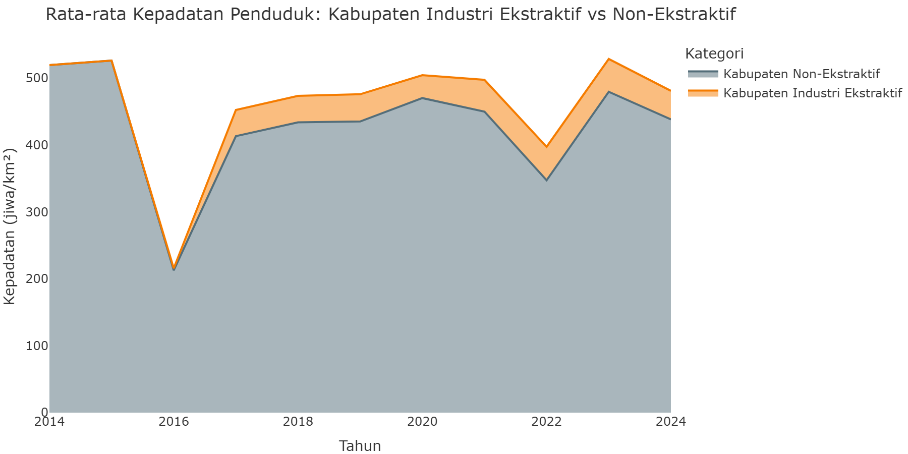
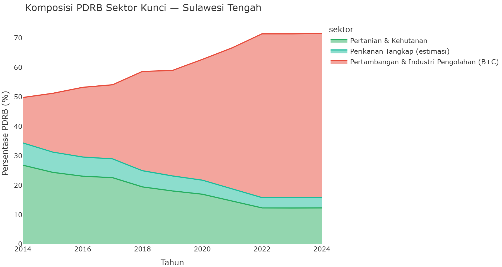
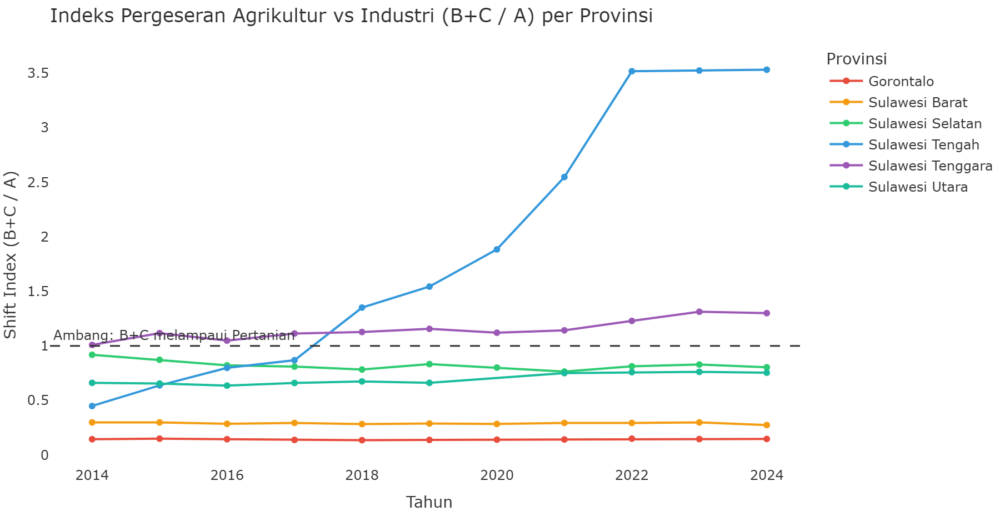

# Bab 9: Demografi & Struktur Sosial: Guncangan Sosial dan Pergeseran Ekonomi Agraris

**CELIOS — Center of Economic and Law Studies**

*Membaca tekanan demografi, intensifikasi ruang, dan transisi ekonomi di lingkar industri ekstraktif Sulawesi.*

---

## Metodologi Pendekatan

**Alur Kausalitas:** `Ekspansi Nikel` → `Tekanan Demografi & Kepadatan` → `Pergeseran Struktur Ekonomi` → `Beban Sosial-Kesehatan`

- **Variabel Tekanan (X):** Kabupaten prioritas industri ekstraktif, IUP kumulatif, porsi PDRB pertambangan dan industri pengolahan, serta nilai investasi PMDN provinsi.
- **Variabel Dampak (Y):** Jumlah penduduk kabupaten, kepadatan penduduk, laju pertumbuhan penduduk, kasus DBD sebagai proxy tekanan kesehatan, dan pergeseran proporsi PDRB pertanian vs tambang+industri.

**Catatan Batasan:** Halaman ini tidak mengklaim data migrasi risen tahunan langsung. Analisis migrasi dibaca sebagai **proxy tekanan demografi** dari data populasi dan kepadatan kabupaten. Analisis perubahan pekerjaan dibaca sebagai **pergeseran struktur ekonomi** berbasis PDRB sektoral, bukan perpindahan individu pekerja secara literal.

---

## Ketika Hilirisasi Mengubah Struktur Masyarakat

Ekspansi nikel di Sulawesi bukan hanya perubahan industri, melainkan rekayasa ulang ruang hidup. Data demografi dan ekonomi sektoral menunjukkan bahwa kawasan yang menjadi pusat industri ekstraktif mengalami tekanan ganda: populasi dan kepadatan meningkat, sementara struktur ekonomi regional bergerak meninggalkan basis agraris menuju dominasi tambang dan industri pengolahan. Di Sulawesi Tengah, provinsi yang menjadi episentrum Morowali dan Morowali Utara, porsi PDRB sektor pertanian turun dari **34.39%** pada **2014** menjadi **15.80%** pada **2024**. Pada periode yang sama, gabungan sektor pertambangan dan industri pengolahan melonjak dari **15.45%** menjadi **55.82%**.

Perubahan ini tidak netral. Indeks pergeseran agraris-ke-industri di Sulawesi Tengah naik dari **0.449** menjadi **3.533**, atau sekitar **7.9 kali**. Pada level kabupaten, Morowali memperlihatkan sinyal tekanan demografi yang tajam: pada 2020, data SIMDASI mencatat penduduk sebesar **161.7 ribu jiwa** dengan laju pertumbuhan sumber **4.54%**. Angka-angka ini tidak cukup untuk menyebut migrasi langsung secara definitif, tetapi cukup kuat sebagai proxy bahwa kawasan industri ekstraktif mengalami tarikan penduduk dan intensifikasi ruang yang tidak dialami merata oleh wilayah non-industri. Dengan demikian, hilirisasi tidak hanya memindahkan bijih menjadi logam; ia juga memindahkan beban sosial ke masyarakat lokal.

---

## Ringkasan Metrik Agregat

| Indikator | Nilai | Keterangan |
|---|---|---|
| **Shift Index Sulteng** | **3.53×** | Rasio tambang+industri terhadap pertanian. Makin tinggi berarti struktur ekonomi makin bergeser meninggalkan basis agraris. Sumber: BPS SIMDASI |
| **Pertanian Sulteng Turun** | **34.4% → 15.8%** | Porsi PDRB pertanian menyusut tajam, menunjukkan pelemahan basis ekonomi agraris dalam struktur regional. Sumber: BPS SIMDASI |
| **Tambang+Industri Sulteng Naik** | **15.4% → 55.8%** | Gabungan pertambangan dan industri pengolahan menjadi blok dominan dalam ekonomi Sulawesi Tengah. Sumber: BPS SIMDASI |
| **Kabupaten Industri Ekstraktif** | **7 Kabupaten** | Kabupaten prioritas untuk membaca tekanan demografi dan ekonomi di lingkar industri ekstraktif Sulawesi. Sumber: Klasifikasi Fase 4 |
| **Rasio Kepadatan Industri Ekstraktif** | **0.10×** | Perbandingan rata-rata kepadatan kabupaten industri ekstraktif terhadap non-ekstraktif pada tahun 2024. Sumber: BPS SIMDASI |
| **Kasus DBD di Kab. Ekstraktif** | **1,378 Kasus** | Akumulasi DBD sejak 2019 pada kabupaten prioritas industri ekstraktif sebagai proxy tekanan kesehatan. Sumber: Profil Kesehatan/Dinkes |

---

## 9.1 Tekanan Demografi di Kabupaten Industri Ekstraktif

**Metode: Proxy Migrasi dari Time-Series Populasi Kabupaten**

Analisis ini membaca tekanan demografi melalui perubahan jumlah penduduk kabupaten, bukan melalui data migrasi langsung. Dengan pendekatan ini, populasi diperlakukan sebagai sinyal awal: ketika kawasan smelter tumbuh lebih cepat dibanding pola umum wilayah sekitar, maka terdapat indikasi tarikan penduduk, pekerja, dan aktivitas ekonomi baru yang perlu diuji lebih lanjut. Fokus pembacaan ditempatkan pada tujuh kabupaten prioritas smelter, yaitu **Banggai, Kolaka, Konawe, Konawe Utara, Luwu Timur, Morowali, Morowali Utara**. Dalam window data yang tersedia, rata-rata pertumbuhan YoY kabupaten smelter tercatat **1.95%**, sedangkan wilayah non-smelter berada di sekitar **2.09%**. Pada tahun **2024**, total populasi kabupaten smelter mencapai **1,588.2 ribu jiwa**. Angka-angka ini tidak cukup untuk menyebut asal migran atau arah mobilitas penduduk, tetapi cukup kuat untuk menunjukkan bahwa hilirisasi nikel menciptakan tekanan demografis yang harus dibaca sebagai bagian dari beban sosial, bukan sekadar konsekuensi administratif pembangunan industri.

---

## 9.2 Intensifikasi Ruang: Kepadatan Industri Ekstraktif vs Non-Ekstraktif

**Metode: Comparative Density Analysis**

Sub-bab ini tidak mengklaim perubahan resmi desa menjadi kota karena data klasifikasi Podes belum menjadi basis utama di halaman ini. Yang dibaca adalah **intensifikasi ruang**, yaitu tekanan yang muncul ketika pertumbuhan penduduk dan konsentrasi industri bertemu pada wilayah yang sama. Rata-rata kepadatan kabupaten smelter pada **2024** mencapai **42.7 jiwa/km²**, sedangkan kabupaten non-smelter berada pada **438.3 jiwa/km²**. Rasio smelter terhadap non-smelter sebesar **0.10 kali** memberi sinyal bahwa kawasan industri membutuhkan kapasitas layanan publik yang berbeda: perumahan, air bersih, sanitasi, transportasi, hingga fasilitas kesehatan. Dalam kerangka D3TLH, kepadatan bukan sekadar angka demografi, melainkan indikator apakah ruang hidup lokal sedang dipadatkan oleh proyek ekstraktif tanpa perencanaan sosial yang sepadan. Karena itu, grafik berikut dibaca sebagai peta awal tekanan ruang, bukan sebagai klaim urbanisasi formal.

---

## 9.3 Pergeseran Ekonomi Agraris ke Tambang dan Industri

**Metode: PDRB Sector Shift Index (B+C / A)**

Pergeseran pekerjaan tidak dapat diklaim hanya dari PDRB, tetapi struktur PDRB memberi petunjuk kuat tentang arah ekonomi yang sedang dibentuk. Di sini sektor A dibaca sebagai basis agraris, sementara sektor B dan C dibaca sebagai blok ekstraktif-industrial: pertambangan dan industri pengolahan. Rasio B+C terhadap A menjadi *shift index*; nilai di atas 1 berarti kontribusi tambang dan industri sudah melampaui pertanian. Di Sulawesi Tengah, porsi pertanian turun dari **34.39%** menjadi **15.80%**, sementara tambang+industri naik dari **15.45%** menjadi **55.82%**. Indeksnya naik dari **0.449** ke **3.533**, atau sekitar **7.9 kali**. Dengan kata lain, data sektoral menunjukkan bahwa hilirisasi tidak hanya menambah pabrik; ia mengubah pusat gravitasi ekonomi daerah, dari ruang produksi agraris menuju rantai ekstraktif yang lebih terkonsentrasi pada modal besar.

> **Catatan Metodologi:** BPS menggabungkan Pertanian, Kehutanan, dan Perikanan dalam Sektor A. **Perikanan Tangkap** diestimasi sebagai **±22% dari nilai Sektor A**, mengacu pada rata-rata proporsi sub-sektor perikanan terhadap Sektor A di provinsi-provinsi pesisir Sulawesi (Sumber: Statistik Perikanan BPS Sulawesi, 2016–2024). Sektor B+C digabung menjadi satu blok ekstraktif-industrial.

#### Komposisi PDRB Sektor Kunci — Sulawesi Tengah

#### Indeks Pergeseran Agrikultur vs Industri (B+C / A) per Provinsi

---

## 9.4 Sintesis: Matriks Tekanan Sosial-Ekologis

**Metode: Executive Crosstab Sektor Ekonomi × Demografi × Kesehatan**

Matriks sintesis menggabungkan tiga lapis bukti: perubahan struktur ekonomi, keberadaan kabupaten industri ekstraktif, dan beban DBD di wilayah prioritas. Tujuannya bukan mengganti analisis kausal formal, melainkan memberi ringkasan eksekutif untuk membaca provinsi mana yang paling kuat menunjukkan kombinasi tekanan ekonomi-ekologis dan sosial. Berdasarkan data yang sudah diproses, provinsi dengan kenaikan shift index tertinggi adalah **Sulawesi Tengah**, dengan delta sebesar **3.08** poin dari tahun awal ke tahun akhir. Ini berarti perubahan struktur ekonomi tidak merata di seluruh Sulawesi; ada wilayah yang mengalami transformasi jauh lebih tajam karena posisinya dalam rantai nikel. Tabel berikut mengurutkan provinsi berdasarkan delta shift index, lalu mengaitkannya dengan jumlah kabupaten industri ekstraktif dan total DBD di wilayah prioritas. Dengan susunan ini, pembaca dapat melihat bahwa tekanan sosial-ekologis bukan hanya soal satu indikator, melainkan gabungan antara ekonomi yang makin ekstraktif, penduduk yang terkonsentrasi, dan beban kesehatan yang muncul di ruang yang sama.

Uji crosstab berikut memakai unit observasi **kabupaten-tahun**, bukan provinsi-tahun. Perubahan ini penting karena tekanan sosial terjadi di level kabupaten, sementara agregasi provinsi membuat variasi lokal hilang dan membuat banyak tabel menjadi tidak signifikan. Variabel X merepresentasikan intensitas ekonomi ekstraktif pada provinsi-tahun, lalu diwariskan ke kabupaten di provinsi yang sama. Variabel Y merepresentasikan kepadatan, populasi, pertumbuhan penduduk, kemiskinan, dan beban DBD.

### Detail Uji Statistik (Chi-Square & Odds Ratio)

**Variabel Independen (X):** Shift Index Tambang+Industri / Pertanian

**Variabel Dependen (Y):** Kepadatan Penduduk Kabupaten

#### Case Processing Summary

| | Valid N | Valid % | Missing N | Missing % | Total N | Total % |
|---|---|---|---|---|---|---|
| Shift Index Tambang+Industri / Pertanian * Kepadatan Penduduk Kabupaten | 608 | 100.0% | 0 | 0.0% | 608 | 100.0% |

#### Shift Index Tambang+Industri / Pertanian * Kepadatan Penduduk Kabupaten Crosstabulation

| | Rendah (<119.5) | Tinggi (≥119.5) | Total |
|---|---|---|---|
| **Rendah (<0.8)** Count | 123 | 181 | 304 |
| **Rendah (<0.8)** Expected | 152.0 | 152.0 | 304.0 |
| **Tinggi (≥0.8)** Count | 181 | 123 | 304 |
| **Tinggi (≥0.8)** Expected | 152.0 | 152.0 | 304.0 |
| **Total** Count | 304 | 304 | 608 |
| **Total** Expected | 304.0 | 304.0 | 608.0 |

#### Chi-Square Tests

**Shift Index Tambang+Industri / Pertanian * Kepadatan Penduduk Kabupaten**

| | Value | df | Asymp. Sig. (2-sided) |
|---|---|---|---|
| Pearson Chi-Square | 21.375 | 1 | 0.000 |
| Likelihood Ratio | 21.502 | 1 | 0.000 |
| Linear-by-Linear Association | 22.095 | 1 | 0.000 |
| N of Valid Cases | 608 | | |

### Ringkasan Uji Hipotesis

**Result: SIGNIFIKAN**

| Parameter | Nilai |
|---|---|
| P-Value | 0.0000 |
| Chi-Square | 21.375 |
| df | 1 |
| **Odds Ratio (Risk Estimate)** | **0.462** |

> **Interpretasi Sosial-Ekologis:**
>
> Hasil signifikan menunjukkan bahwa intensitas ekonomi ekstraktif memiliki asosiasi statistik dengan indikator tekanan sosial-demografis yang dipilih. Dalam konteks ini, memperkuat pembacaan bahwa pergeseran struktur ekonomi perlu dibaca bersama kepadatan, populasi smelter, dan beban kesehatan.

---

### Ringkasan Eksekutif Seluruh Skenario Crosstab

Tabel di bawah ini merangkum hasil pengujian statistik (Chi-Square) untuk semua kemungkinan kombinasi antara indikator Ekonomi Ekstraktif (X) dan Tekanan Sosial-Demografis (Y) pada panel kabupaten-tahun yang sama.

| Variabel Independen (X) | Variabel Dependen (Y) | Chi-Square | P-Value | Odds Ratio | Kesimpulan |
|---|---|---|---|---|---|
| Shift Index Tambang+Industri / Pertanian | Kepadatan Penduduk Kabupaten | 21.375 | 0.000 | 0.46 | 🟢 SIGNIFIKAN |
| Shift Index Tambang+Industri / Pertanian | Jumlah Penduduk Kabupaten (ribu jiwa) | 5.533 | 0.019 | 1.49 | 🟢 SIGNIFIKAN |
| Shift Index Tambang+Industri / Pertanian | Laju Pertumbuhan Penduduk YoY | 19.909 | 0.000 | 2.11 | 🟢 SIGNIFIKAN |
| Shift Index Tambang+Industri / Pertanian | Persentase Penduduk Miskin | 47.541 | 0.000 | 3.20 | 🟢 SIGNIFIKAN |
| Porsi PDRB Tambang+Industri (B+C) | Kepadatan Penduduk Kabupaten | 11.672 | 0.001 | 0.56 | 🟢 SIGNIFIKAN |
| Porsi PDRB Tambang+Industri (B+C) | Jumlah Penduduk Kabupaten (ribu jiwa) | 11.672 | 0.001 | 1.77 | 🟢 SIGNIFIKAN |
| Porsi PDRB Tambang+Industri (B+C) | Laju Pertumbuhan Penduduk YoY | 8.796 | 0.003 | 1.65 | 🟢 SIGNIFIKAN |
| Porsi PDRB Tambang+Industri (B+C) | Persentase Penduduk Miskin | 40.577 | 0.000 | 2.93 | 🟢 SIGNIFIKAN |
| Porsi PDRB Industri Pengolahan (C) | Kepadatan Penduduk Kabupaten | 12.164 | 0.000 | 1.79 | 🟢 SIGNIFIKAN |
| Porsi PDRB Industri Pengolahan (C) | Jumlah Penduduk Kabupaten (ribu jiwa) | 75.322 | 0.000 | 4.42 | 🟢 SIGNIFIKAN |
| Porsi PDRB Industri Pengolahan (C) | Laju Pertumbuhan Penduduk YoY | 0.322 | 0.570 | 0.90 | 🔴 TIDAK SIGNIFIKAN |
| Porsi PDRB Industri Pengolahan (C) | Persentase Penduduk Miskin | 8.061 | 0.005 | 0.62 | 🟢 SIGNIFIKAN |

> **Ringkasan Eksekutif:**
>
> Sebagian skenario menunjukkan hubungan signifikan antara intensitas ekonomi ekstraktif dan tekanan sosial-demografis. Karena unit observasi sudah diturunkan ke kabupaten-tahun, hasil ini lebih peka terhadap variasi lokal dibanding panel provinsi-tahun. Temuan ini memperkuat argumen bahwa hilirisasi nikel bukan hanya fenomena ekonomi sektoral, tetapi juga perubahan struktural yang menekan ruang hidup dan kesehatan publik.
